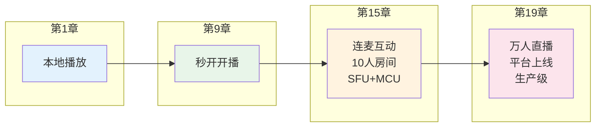
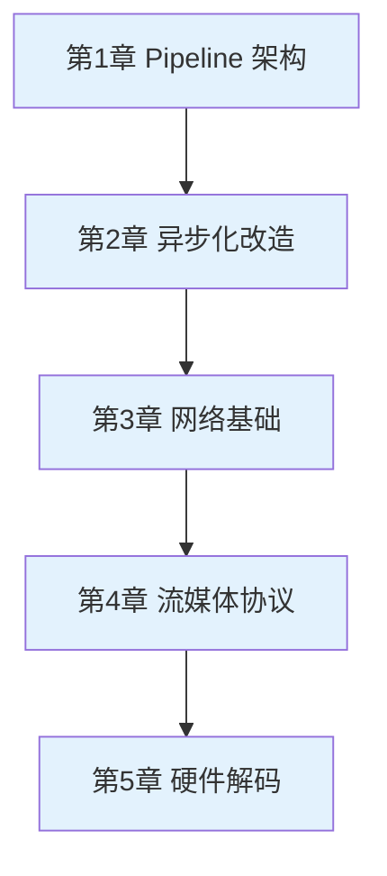
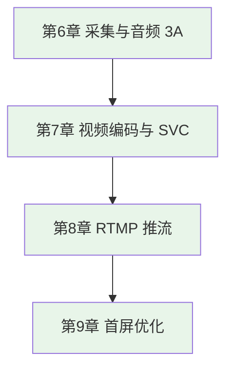
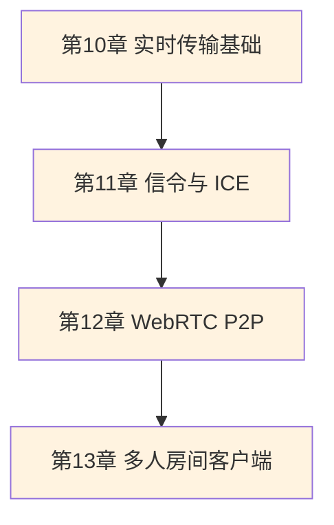
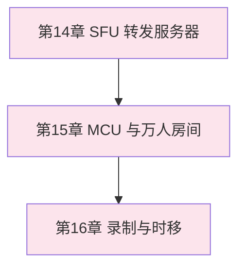
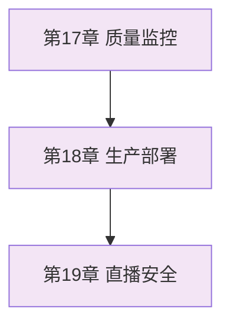

# 📺 直播连麦系统：从零到一

> **一本让你从 C++ 开发者成长为音视频工程师的实战教程**

[](https://opensource.org/licenses/MIT)
[](https://isocpp.org/)
[](https://ffmpeg.org/)

---

## 🎯 这本书能给你什么？

**如果你是：**
- 会写 C++，但面对 FFmpeg 无从下手
- 看过直播协议文档，却不知道如何落地
- 想系统学习音视频，而不是零散搜博客

**学完这本书，你能：**

| 能力 | 学完章节 | 成果展示 |
|-----|---------|---------|
| 🔧 **开发播放器** | 第 1-5 章 | 流畅播放 4K 直播流 |
| 📡 **搭建直播系统** | 第 6-9 章 | 自己开播，秒开低延迟 |
| 👥 **实现连麦互动** | 第 10-13 章 | 多人音视频实时通话 |
| 🏗️ **设计服务端架构** | 第 14-16 章 | 支持万人同时观看 |
| 🚀 **上线生产环境** | 第 17-19 章 | 完整的监控、安全、部署体系 |

---

## 📚 核心特色

### 1. 单案例渐进式

**「小直播」**—— 从第 1 章到第 19 章，同一个产品不断进化：



每一章在前一章**代码基础上增量开发**，不是孤立的 Demo。

### 2. 工业级代码标准

**不是玩具代码，而是生产可用：**

```cpp
// ❌ 普通教程的写法
AVPacket* pkt = av_packet_alloc();  // 裸指针，易泄漏

// ✅ 本书的写法
PacketPtr pkt = MakePacket();        // RAII 智能指针，异常安全
```

- **内存安全**：RAII 封装所有 FFmpeg 资源
- **错误处理**：详细错误码分类，不是简单返回 false
- **可观测性**：内置统计、日志、事件回调
- **可测试性**：接口抽象，支持 Mock 测试

### 3. 深入浅出讲解

**复杂概念的直观解释：**

| 概念 | 一句话解释 | 类比 |
|-----|-----------|------|
| **Pipeline** | 数据像水一样流动 | 工厂流水线 |
| **PTS** | 视频帧的"闹钟" | 告诉系统这帧该什么时候显示 |
| **YUV** | 把亮度和颜色分开存 | 黑白电视 + 彩色调色板 |
| **SFU** | 选择性转发 | 快递分拣中心 |
| **MCU** | 混音混画 | 视频编辑软件实时合成 |

---

## 🗺️ 学习路线图

### 第一阶段：播放能力（第 1-5 章）

**目标**：成为播放器开发专家



**关键产出**：工业级播放器，支持 4K60fps

### 第二阶段：推流能力（第 6-9 章）

**目标**：搭建直播推流系统



**关键产出**：低延迟直播推流工具

### 第三阶段：实时连麦（第 10-13 章）

**目标**：实现多人实时互动



**关键产出**：类似微信视频通话的客户端

### 第四阶段：服务端架构（第 14-16 章）

**目标**：设计高并发直播系统



**关键产出**：可扩展的直播服务端

### 第五阶段：生产运维（第 17-19 章）

**目标**：上线稳定可靠的直播平台



**关键产出**：生产级直播平台

---

## 🚀 快速开始

### 环境准备

**macOS:**
```bash
brew install ffmpeg sdl2 cmake
```

**Ubuntu/Debian:**
```bash
sudo apt-get update
sudo apt-get install -y ffmpeg libavformat-dev libavcodec-dev \
    libavutil-dev libswscale-dev libsdl2-dev cmake
```

### 构建运行（第 1 章）

```bash
# 1. 克隆代码
git clone https://github.com/chapin666/live-system-book.git
cd live-system-book/chapter-01

# 2. 构建
mkdir build && cd build
cmake .. && make -j4

# 3. 准备测试视频
ffmpeg -f lavfi -i testsrc=duration=10:size=640x480:rate=30 \
       -pix_fmt yuv420p sample.mp4

# 4. 运行
./live-player sample.mp4
```

**预期效果：**
- 弹出播放窗口
- 显示彩色测试条纹
- 窗口标题显示帧率和统计
- 按 ESC 退出

---

## 📖 章节索引

### 已完成

| 章节 | 主题 | 阅读 | 代码 |
|:---:|------|:---:|:---:|
| [01](chapter-01/) | Pipeline 架构与本地播放 | ✅ | ✅ |

### 进行中

| 章节 | 主题 | 预计完成 |
|:---:|------|:---:|
| 02 | 异步化改造 | 🚧 |
| 03 | 网络基础 | 📅 |

### 规划中的 19 章完整大纲

<details>
<summary>点击查看完整路线图</summary>

| 章节 | 主题 | 核心产出 |
|:---:|------|---------|
| 01 | [Pipeline 架构](chapter-01/) | 本地播放器 |
| 02 | 异步化改造 | 流畅播放器 |
| 03 | 网络基础 | 下载视频 |
| 04 | 流媒体协议与弱网对抗 | RTMP 播放器 |
| 05 | 硬件解码 | 4K 播放器 |
| 06 | 采集与音频 3A | 高质量采集 |
| 07 | 视频编码与 SVC | 自适应编码 |
| 08 | RTMP 推流 | 开播工具 |
| 09 | 首屏优化与低延迟 | 秒开直播 |
| 10 | 实时传输基础 | UDP 互通 |
| 11 | 信令服务器与 ICE | P2P 连接 |
| 12 | WebRTC P2P 连麦 | 1v1 连麦 |
| 13 | 多人房间客户端 | 10 人房间 |
| 14 | SFU 转发服务器 | 100 人房间 |
| 15 | MCU 混音混画 | 1 万人房间 |
| 16 | 录制与时移回放 | 回放系统 |
| 17 | 质量监控 | 可观测大盘 |
| 18 | 生产部署 | K8s 上线 |
| 19 | 直播安全与风控 | 安全防护 |

</details>

---

## 🎓 学习建议

### 1. 不要跳章节

每一章都依赖前一章的代码。第 5 章的播放器是在第 1 章基础上改的，跳过会看不懂。

### 2. 一定要动手

看完一章后，**自己敲一遍代码**，不要直接复制。改改参数，看看会发生什么。

### 3. 善用调试工具

```bash
# 查看视频信息
ffprobe -v quiet -print_format json -show_streams video.mp4

# 检查内存泄漏
valgrind --leak-check=full ./live-player sample.mp4

# 性能分析
perf record ./live-player sample.mp4
perf report
```

### 4. 遇到问题先查 FAQ

每章末尾都有"常见问题"，90% 的问题都有答案。

---

## 🛠️ 技术栈

- **C++14**：现代 C++，RAII、智能指针、lambda
- **FFmpeg 4.0+**：音视频处理的行业标准
- **SDL2**：跨平台窗口和渲染
- **CMake 3.10+**：构建系统
- **WebRTC**：实时通信（第 10-13 章）
- **Docker/Kubernetes**：部署（第 18 章）

---

## 📊 代码统计

```
语言       文件数    代码行数
─────────────────────────────
C++        15        ~8000
CMake      1         ~50
Markdown   1         ~300
─────────────────────────────
总计                 ~8350
```

---

## 🤝 参与贡献

欢迎提交 Issue 和 PR：

1. 发现问题？提交 [GitHub Issue](https://github.com/chapin666/live-system-book/issues)
2. 代码优化？Fork 后提交 PR
3. 翻译文档？联系作者

---

## 📄 许可证

[MIT License](LICENSE) - 你可以自由使用、修改、分发代码，用于个人学习或商业项目。

---

## 💬 关于作者

> 一个从 C++ 后端转行音视频开发的工程师，踩过无数坑，想把经验写成书。

如有问题，欢迎通过 GitHub Issues 交流。

---

**🌟 如果这本书对你有帮助，请点个 Star！**
