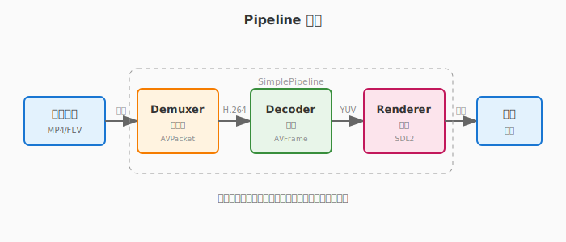
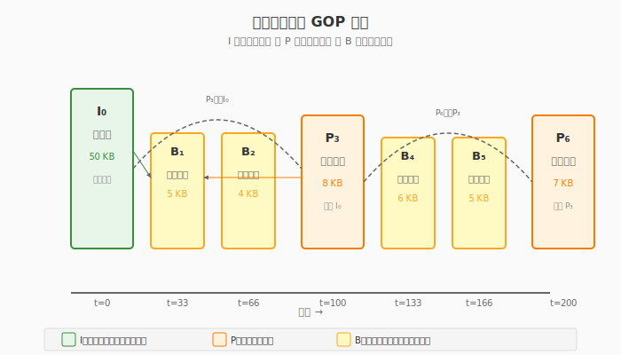

# 第一章：Pipeline 架构与本地播放

> **目标**：从零开始，30 分钟内让视频跑起来，然后理解为什么这样写。

**预计时间**：
- 快速开始（5 分钟）：先跑起来
- 深入理解（60 分钟）：读懂代码
- 动手实践（30 分钟）：自己改代码

---

## 目录

1. [5 分钟跑起来](#1-5-分钟跑起来) — 先看到画面
2. [代码解剖](#2-代码解剖) — 读懂这 10 行
3. [为什么需要架构](#3-为什么需要架构) — 从烂代码到好代码
4. [关键概念详解](#4-关键概念详解) — YUV、PTS、RAII
5. [工业级实现](#5-工业级实现) — 完整的 Pipeline
6. [性能基准](#6-性能基准) — 数据说话
7. [常见问题](#7-常见问题)
8. [下一步](#8-下一步)

---

## 1. 5 分钟跑起来

### 1.1 环境准备

**macOS:**
```bash
brew install ffmpeg sdl2 cmake
```

**Ubuntu/Debian:**
```bash
sudo apt-get update
sudo apt-get install -y ffmpeg libavformat-dev libavcodec-dev \
    libavutil-dev libswscale-dev libsdl2-dev cmake
```

### 1.2 创建最简播放器

创建文件 `minimal_player.cpp`：

```cpp
#include <SDL2/SDL.h>
extern "C" {
#include <libavformat/avformat.h>
#include <libavcodec/avcodec.h>
}

int main(int argc, char* argv[]) {
    // 1. 打开文件
    AVFormatContext* ctx = nullptr;
    avformat_open_input(&ctx, argv[1], nullptr, nullptr);
    avformat_find_stream_info(ctx, nullptr);
    
    // 2. 找到视频流
    int idx = av_find_best_stream(ctx, AVMEDIA_TYPE_VIDEO, -1, -1, nullptr, 0);
    AVStream* st = ctx->streams[idx];
    
    // 3. 初始化解码器
    const AVCodec* codec = avcodec_find_decoder(st->codecpar->codec_id);
    AVCodecContext* cc = avcodec_alloc_context3(codec);
    avcodec_parameters_to_context(cc, st->codecpar);
    avcodec_open2(cc, codec, nullptr);
    
    // 4. 创建窗口
    SDL_Init(SDL_INIT_VIDEO);
    SDL_Window* win = SDL_CreateWindow("Player", SDL_WINDOWPOS_CENTERED, 
                                       SDL_WINDOWPOS_CENTERED, cc->width, cc->height, 0);
    SDL_Renderer* rend = SDL_CreateRenderer(win, -1, 0);
    SDL_Texture* tex = SDL_CreateTexture(rend, SDL_PIXELFORMAT_YV12, 
                                          SDL_TEXTUREACCESS_STREAMING, cc->width, cc->height);
    
    // 5. 解码循环
    AVPacket* pkt = av_packet_alloc();
    AVFrame* frm = av_frame_alloc();
    
    while (av_read_frame(ctx, pkt) >= 0) {
        if (pkt->stream_index == idx) {
            avcodec_send_packet(cc, pkt);
            while (avcodec_receive_frame(cc, frm) == 0) {
                SDL_UpdateYUVTexture(tex, nullptr, frm->data[0], frm->linesize[0],
                                     frm->data[1], frm->linesize[1],
                                     frm->data[2], frm->linesize[2]);
                SDL_RenderCopy(rend, tex, nullptr, nullptr);
                SDL_RenderPresent(rend);
                SDL_Delay(33);  // 约30fps
            }
        }
        av_packet_unref(pkt);
    }
    
    // 6. 清理
    av_frame_free(&frm);
    av_packet_free(&pkt);
    avcodec_free_context(&cc);
    avformat_close_input(&ctx);
    SDL_Quit();
    return 0;
}
```

### 1.3 编译运行

```bash
# 编译
g++ minimal_player.cpp -o minimal_player \
    $(pkg-config --cflags --libs libavformat libavcodec libavutil sdl2) \
    -std=c++11

# 准备测试视频
ffmpeg -f lavfi -i testsrc=duration=5:size=640x480:rate=30 \
       -pix_fmt yuv420p sample.mp4

# 运行
./minimal_player sample.mp4
```

**看到彩色条纹在动？成功了！** 🎉

但这代码有问题，下面我们来解剖它。

---

## 2. 代码解剖

### 2.1 这 10 行做了什么？

**第 1 步：打开文件**
```cpp
AVFormatContext* ctx = nullptr;
avformat_open_input(&ctx, argv[1], nullptr, nullptr);
avformat_find_stream_info(ctx, nullptr);
```

- `AVFormatContext`：文件的"总控"，包含所有信息
- `avformat_open_input`：打开文件，探测格式（MP4/FLV/AVI 等）
- `avformat_find_stream_info`：读取流信息（视频、音频、字幕）

**第 2 步：找到视频流**
```cpp
int idx = av_find_best_stream(ctx, AVMEDIA_TYPE_VIDEO, -1, -1, nullptr, 0);
```

一个文件可能有多个流（视频+音频+字幕），这行找到"最好的"视频流。

**第 3 步：初始化解码器**
```cpp
const AVCodec* codec = avcodec_find_decoder(st->codecpar->codec_id);
AVCodecContext* cc = avcodec_alloc_context3(codec);
avcodec_parameters_to_context(cc, st->codecpar);
avcodec_open2(cc, codec, nullptr);
```

| 函数 | 作用 |
|:---|:---|
| `avcodec_find_decoder` | 根据 codec_id 找到对应的解码器（如 H.264 找 h264 解码器）|
| `avcodec_alloc_context3` | 创建解码器上下文（存储解码状态）|
| `avcodec_parameters_to_context` | 把流参数（分辨率、码率等）复制到上下文 |
| `avcodec_open2` | 打开解码器，初始化内部状态 |

**为什么要分 4 步？**

```
找解码器 → 创建上下文 → 填参数 → 打开
   ↓           ↓          ↓       ↓
 "用哪个"    "容器"     "配置"   "启动"
```

**第 4 步：创建窗口**
```cpp
SDL_Init(SDL_INIT_VIDEO);
SDL_Window* win = SDL_CreateWindow(...);
SDL_Renderer* rend = SDL_CreateRenderer(...);
SDL_Texture* tex = SDL_CreateTexture(..., SDL_PIXELFORMAT_YV12, ...);
```

SDL2 的三层架构：
- **Window**：窗口（标题栏、边框）
- **Renderer**：渲染器（GPU 加速）
- **Texture**：纹理（显存中的图像）

**为什么是 YV12 格式？**

FFmpeg 解码出来的是 YUV420P，SDL 的 YV12 只是 UV 顺序交换，几乎零开销。

**第 5 步：解码循环**
```cpp
while (av_read_frame(ctx, pkt) >= 0) {      // 读取一个包
    if (pkt->stream_index == idx) {         // 只处理视频
        avcodec_send_packet(cc, pkt);        // 送入解码器
        while (avcodec_receive_frame(cc, frm) == 0) {  // 接收解码后的帧
            SDL_UpdateYUVTexture(...);       // 更新纹理
            SDL_RenderCopy(...);             // 渲染
            SDL_RenderPresent(...);          // 显示
            SDL_Delay(33);                   // 控制帧率
        }
    }
    av_packet_unref(pkt);  // ⚠️ 必须释放！
}
```

### 2.2 代码有什么问题？

| 问题 | 后果 | 严重程度 |
|:---|:---|:---:|
| **没有错误处理** | 文件打不开直接崩溃 | 🔴 高 |
| **内存泄漏** | `pkt`、`frm` 分配了但没完全释放 | 🔴 高 |
| **硬编码延时** | `SDL_Delay(33)` 假设 30fps，实际视频可能是 25fps | 🟡 中 |
| **窗口无法关闭** | 没有处理 SDL 事件，只能强制结束 | 🔴 高 |
| **单线程阻塞** | 解码慢时画面卡顿 | 🟡 中 |

**最严重的问题**：没有错误处理。

```cpp
// 当前代码：失败就崩溃
avformat_open_input(&ctx, argv[1], nullptr, nullptr);  // 文件不存在？崩溃！

// 应该这样：
int ret = avformat_open_input(&ctx, argv[1], nullptr, nullptr);
if (ret < 0) {
    fprintf(stderr, "无法打开文件: %s\n", argv[1]);
    return 1;
}
```

---

## 3. 为什么需要架构

### 3.1 "烂代码"是怎么变多的？

假设你在 minimal_player 基础上加功能：

**第 1 天：加错误处理**
```cpp
int ret = avformat_open_input(...);
if (ret < 0) { /* 处理 */ }

ret = avformat_find_stream_info(...);
if (ret < 0) { /* 处理 */ }
// ... 每个函数都要判断，main 变成 50 行
```

**第 2 天：加音频播放**
```cpp
// 再加 30 行音频初始化和播放代码
// main 变成 100 行
```

**第 3 天：加网络播放**
```cpp
// 再加 50 行网络代码
// main 变成 150 行，无法维护
```

**第 7 天**：
```cpp
int main() {
    // 300 行混乱代码
    // 改了这里，那里出问题
    // 不敢重构，只能继续堆
}
```

### 3.2 工业级代码的要求

| 要求 | 为什么重要 | 本章解决方案 |
|:---|:---|:---|
| **不泄漏内存** | 播放器要跑几小时/几天 | RAII 智能指针，自动释放 |
| **错误可处理** | 网络断了、文件坏了怎么办？ | 错误码分级，优雅降级 |
| **可测试** | 改代码后怎么保证没坏？ | 接口抽象，模块独立测试 |
| **可观测** | 线上出问题怎么排查？ | 统计接口，实时看状态 |
| **可扩展** | 后面要加功能怎么办？ | Pipeline 架构，模块可替换 |

### 3.3 Pipeline 架构设计

> **Pipeline（流水线）：数据像水一样流动，每个阶段处理完传给下一个阶段。**



**分层设计：**

```
┌─────────────────────────────────────────────┐
│              应用层 (main.cpp)               │
│         创建 Pipeline，设置回调              │
├─────────────────────────────────────────────┤
│              调度层 (SimplePipeline)         │
│         控制数据流，管理生命周期              │
├─────────────────────────────────────────────┤
│  ┌─────────┐  ┌─────────┐  ┌─────────┐     │
│  │Demuxer  │→│Decoder  │→│Renderer │     │
│  │解封装   │  │解码     │  │渲染     │     │
│  └─────────┘  └─────────┘  └─────────┘     │
│         核心处理层（三个独立模块）            │
├─────────────────────────────────────────────┤
│  Observer + Stats + ErrorCode                │
│  可观测性基础设施                            │
└─────────────────────────────────────────────┘
```

**关键设计决策：**

| 决策 | 说明 | 好处 |
|:---|:---|:---|
| **接口抽象** | Pipeline 是纯虚接口 | 实现可替换，便于测试 |
| **模块独立** | Demuxer/Decoder/Renderer 互不依赖 | 可单独测试、优化 |
| **RAII 封装** | 智能指针管理 FFmpeg 资源 | 不泄漏、异常安全 |
| **观察者模式** | 通过回调暴露内部状态 | 不破坏封装，可观测 |

---

## 4. 关键概念详解

### 4.1 视频压缩原理

#### 4.1.1 为什么视频需要压缩？

原始视频数据量巨大：

| 参数 | 数值 | 计算 |
|:---|:---|:---|
| 分辨率 | 1920 × 1080 | 全高清 1080p |
| 每像素 | 3 字节 (RGB) | 红绿蓝各 1 字节 |
| 每帧大小 | 1920 × 1080 × 3 | **6.2 MB** |
| 帧率 | 30 fps | 每秒 30 帧 |
| 每秒数据 | 6.2 MB × 30 | **186 MB** |
| 1 分钟数据 | 186 MB × 60 | **10.8 GB** |

**实际 1 分钟 1080p 视频约 100 MB，压缩了 100 倍以上！**

#### 4.1.2 空间冗余（帧内压缩）

**原理**：相邻像素通常很相似。

```
原始存储（部分像素）：
[蓝色][蓝色][蓝色][蓝色][蓝色][蓝色]...  天空区域
[绿色][绿色][绿色][绿色][绿色][绿色]...  草地区域

压缩后：
天空: (0,0) 到 (1920,200) 颜色=RGB(135, 206, 235)
草地: (0,200) 到 (1920, 400) 颜色=RGB(124, 252, 0)
```

**技术实现**：
- **DCT 变换**：将空间域转换到频率域
- **量化**：丢弃人眼不敏感的高频信息
- **熵编码**：用更短的编码表示频繁出现的值

#### 4.1.3 时间冗余（帧间压缩）

**原理**：连续帧之间变化很小。

```
视频帧序列：
帧 0 (I 帧): [完整画面]  大小: 50KB  参考: 无
帧 1 (P 帧): [变化区域]  大小: 8KB   参考: 帧 0
帧 2 (P 帧): [变化区域]  大小: 7KB   参考: 帧 1
帧 3 (P 帧): [变化区域]  大小: 9KB   参考: 帧 2
```

**帧类型详解**：



| 类型 | 名称 | 说明 | 大小 |
|:---|:---|:---|:---|
| **I 帧** | 关键帧 | 完整编码的帧，可独立解码 | 最大 |
| **P 帧** | 预测帧 | 参考前一帧，编码差异 | 中等 |
| **B 帧** | 双向预测帧 | 参考前后帧 | 最小 |

**GOP（Group of Pictures）结构**：
```
I P P P P P P P P P P P ...
↑                    ↑
GOP 开始              GOP 结束

典型 GOP 大小：30-120 帧（1-4 秒）
```

**为什么 I 帧很重要？**
- 快进/快退时只能停在 I 帧
- 网络播放时从 I 帧开始解码
- I 帧间隔影响随机访问性能

---

### 4.2 颜色空间：RGB vs YUV

#### 4.2.1 人眼的视觉特性

人眼有两种感光细胞：
- **视杆细胞**：感知亮度（约 1.2 亿个）
- **视锥细胞**：感知颜色（约 600 万个）

**结论**：人眼对亮度变化敏感，对颜色变化不敏感。

#### 4.2.2 RGB 颜色空间

```
RGB 像素内存布局：
┌─────────────────────────────────────────┐
│ [R][G][B] [R][G][B] [R][G][B] [R][G][B] │  ← 每个像素 3 字节
│ [R][G][B] [R][G][B] [R][G][B] [R][G][B] │
└─────────────────────────────────────────┘

总大小 = 宽度 × 高度 × 3
```

**缺点**：没有利用人眼特性，色度信息过多。

#### 4.2.3 YUV 颜色空间

**YUV 将亮度和色度分离**：
- **Y（Luminance）**：亮度信号
- **U（Cb）**：蓝色色度
- **V（Cr）**：红色色度

**转换公式（RGB → YUV）**：
```
Y = 0.299R + 0.587G + 0.114B
U = -0.169R - 0.331G + 0.5B + 128
V = 0.5R - 0.419G - 0.081B + 128
```

**为什么绿色系数（0.587）最大？**
因为人眼对绿色最敏感。

#### 4.2.4 YUV420P 采样

**利用人眼特性，降低色度分辨率**：


**采样方式对比**：

| 格式 | Y 分辨率 | U/V 分辨率 | 总大小 | 应用 |
|:---|:---|:---|:---|:---|
| YUV444 | 1920×1080 | 1920×1080 | 6.2 MB | 专业视频 |
| YUV422 | 1920×1080 | 960×1080 | 4.1 MB | 广播 |
| **YUV420** | **1920×1080** | **960×540** | **3.1 MB** | **网络视频** |

**YUV420 的含义**：
- 每 4 个 Y 像素共享 1 个 U 和 1 个 V
- 水平方向 2:1 采样
- 垂直方向 2:1 采样
- 总采样比 4:1（省 75% 色度信息）

#### 4.2.5 FFmpeg 中的 YUV 处理

```cpp
AVFrame* frame = av_frame_alloc();

// 访问 YUV 平面
uint8_t* y_plane = frame->data[0];  // Y 平面
uint8_t* u_plane = frame->data[1];  // U 平面
uint8_t* v_plane = frame->data[2];  // V 平面

// 行宽（包含对齐填充）
int y_stride = frame->linesize[0];  // Y 行宽
int u_stride = frame->linesize[1];  // U 行宽
int v_stride = frame->linesize[2];  // V 行宽

// ⚠️ 重要：行宽可能大于宽度！
// 计算像素位置要用 stride，不能用 width
// 第 y 行第 x 列的 Y 值：
uint8_t pixel = y_plane[y * y_stride + x];
```

**为什么 `linesize` 可能大于 `width`？**

CPU 内存对齐要求：
- SSE 指令需要 16 字节对齐
- AVX 指令需要 32 字节对齐
- GPU 传输通常需要 256 字节对齐

```
实际内存布局（带填充）：
┌────────────────────────────────────────────────────┐
│ 有效像素 (1920 字节) │ 填充 (64 字节)               │ linesize = 1984
├────────────────────────────────────────────────────┤
│ 有效像素 (1920 字节) │ 填充 (64 字节)               │
└────────────────────────────────────────────────────┘
```

---

### 4.3 容器格式与编码格式

#### 4.3.1 容器 vs 编码

**类比**：快递包裹
- **容器（Container）** = 快递盒（MP4、FLV、AVI）
- **编码（Codec）** = 盒内物品（H.264、HEVC、AV1）

**常见组合**：

| 容器 | 常用视频编码 | 常用音频编码 | 应用场景 |
|:---|:---|:---|:---|
| **MP4** | H.264、HEVC | AAC | 通用、兼容性好 |
| **FLV** | H.264 | AAC | 直播流 |
| **MKV** | H.264、HEVC、AV1 | AAC、FLAC、DTS | 高清收藏 |
| **WebM** | VP8、VP9、AV1 | Vorbis、Opus | 网页视频 |

#### 4.3.2 MP4 文件结构

```
MP4 文件层次结构：

ftyp (File Type)
  └─ 文件类型标识（isom、mp41 等）

moov (Movie Metadata)
  ├─ mvhd (Movie Header)
  │   └─ 时长、时间刻度、创建时间等
  ├─ trak (Track) - 视频轨
  │   ├─ tkhd (Track Header)
  │   │   └─ 轨道 ID、时长、分辨率
  │   ├─ mdia (Media)
  │   │   ├─ mdhd (Media Header)
  │   │   │   └─ 时间基、语言
  │   │   └─ minf (Media Information)
  │   │       └─ stbl (Sample Table)
  │   │           ├─ stsd (Sample Description)
  │   │           │   └─ 编码类型（avc1 = H.264）
  │   │           ├─ stts (Time to Sample)
  │   │           │   └─ PTS 映射表
  │   │           ├─ stsc (Sample to Chunk)
  │   │           └─ stsz (Sample Size)
  │   │               └─ 每个包的大小
  │   └─ mdat 位置引用
  └─ trak (Track) - 音频轨
      └─ ...（类似结构）

mdat (Media Data)
  └─ 实际的音视频数据（H.264 NALU、AAC 帧）
```

**关键概念**：
- **moov 在 mdat 前**：适合网络播放（先拿到元数据）
- **moov 在 mdat 后**：适合本地录制（写完数据再算元数据）

#### 4.3.3 H.264 编码基础

**H.264/AVC 的核心技术**：

| 技术 | 作用 | 效果 |
|:---|:---|:---|
| **帧内预测** | 利用空间冗余 | 压缩 I 帧 |
| **帧间预测** | 利用时间冗余 | 压缩 P/B 帧 |
| **变换量化** | 丢弃高频信息 | 有损压缩 |
| **熵编码** | 统计压缩 | 无损压缩 |
| **环路滤波** | 消除块效应 | 提升画质 |

**H.264 码流结构**：
```
Annex B 格式（用于传输）：
[00 00 00 01] [NALU Header] [NALU Payload]
[00 00 00 01] [NALU Header] [NALU Payload]
     ↑
  起始码（4 字节）

AVCC 格式（用于存储）：
[Length: 4 bytes] [NALU Data]
[Length: 4 bytes] [NALU Data]
```

**NALU 类型**：
- **SPS (7)**：序列参数集（分辨率、profile 等）
- **PPS (8)**：图像参数集（编码参数）
- **IDR (5)**：立即刷新帧（关键帧）
- **Non-IDR (1)**：非关键帧

---

### 4.4 时间同步与 PTS

#### 4.4.1 为什么需要时间同步？

**问题**：解码速度不等于显示速度。

```
场景 1：解码太快
实际：每秒解码 60 帧
目标：每秒显示 30 帧
结果：视频快进（2 倍速）

场景 2：解码太慢
实际：每秒解码 20 帧
目标：每秒显示 30 帧
结果：视频慢放（卡顿）

场景 3：解码不稳定
实际：有时 40fps，有时 20fps
目标：每秒显示 30 帧
结果：时快时慢（不流畅）
```

#### 4.4.2 PTS 和 DTS

| 时间戳 | 全称 | 含义 | 应用场景 |
|:---|:---|:---|:---|
| **PTS** | Presentation Time Stamp | 显示时间 | 控制何时渲染 |
| **DTS** | Decoding Time Stamp | 解码时间 | 控制何时解码 |

**为什么需要两个时间戳？**

```
B 帧需要参考后面的帧：
显示顺序：I0 → B1 → B2 → P3
解码顺序：I0 → P3 → B1 → B2

帧:    I0    P3    B1    B2
PTS:    0    100    33    66   <- 显示顺序
DTS:    0     33   100   133   <- 解码顺序
```

**没有 B 帧时**：PTS == DTS
**有 B 帧时**：PTS != DTS（解码顺序 ≠ 显示顺序）

#### 4.4.3 时间基（Time Base）

**问题**：不同文件的时间精度不同。

**解决方案**：时间基 = 分数表示
```
time_base = num / den

示例：
time_base = 1/1000  →  1 单位 = 1 毫秒
time_base = 1/90000 →  1 单位 = 1/90000 秒 ≈ 11.1 微秒
```

**FFmpeg 中的时间基**：

```cpp
AVStream* stream = ...;
AVRational tb = stream->time_base;  // {num, den}

// 转换公式
// 实际时间（秒）= PTS × time_base
// 实际时间（毫秒）= PTS × time_base × 1000

int64_t pts = frame->pts;
double seconds = pts * av_q2d(tb);           // 秒
int64_t milliseconds = pts * av_q2d(tb) * 1000;  // 毫秒

// 反向转换
// PTS = 实际时间（秒）/ time_base
int64_t pts_from_seconds = seconds / av_q2d(tb);
```

#### 4.4.4 同步策略

**1. 视频主同步（Video Master）**
```cpp
auto start = steady_clock::now();

while (playing) {
    FramePtr frame = decoder.ReceiveFrame();
    
    // 计算应该显示的时间
    auto now = steady_clock::now();
    auto elapsed = duration_cast<milliseconds>(now - start).count();
    int64_t target_pts = frame->pts * av_q2d(time_base) * 1000;
    
    // 等待到显示时间
    if (target_pts > elapsed) {
        this_thread::sleep_for(milliseconds(target_pts - elapsed));
    }
    
    renderer.Render(frame.get());
}
```

**2. 音频主同步（Audio Master）**
- 音频对时间更敏感（人耳能听出 20ms 的差异）
- 视频跟随音频调整（丢帧或重复帧）

**3. 外部时钟同步**
- 使用系统时钟
- 适合直播（需要与发送端同步）

---

### 4.5 RAII 与内存管理

#### 4.5.1 FFmpeg 的内存模型

**FFmpeg 使用 C 语言 API，需要手动管理内存**：

| 函数 | 分配 | 释放 | 常见错误 |
|:---|:---|:---|:---|
| `av_packet_alloc()` | AVPacket | `av_packet_free()` | 忘记释放 |
| `av_frame_alloc()` | AVFrame | `av_frame_free()` | 忘记释放 |
| `avcodec_alloc_context3()` | AVCodecContext | `avcodec_free_context()` | 忘记释放 |
| `avformat_open_input()` | AVFormatContext | `avformat_close_input()` | 忘记关闭 |

#### 4.5.2 C++ RAII 封装

**智能指针自动管理生命周期**：

```cpp
// 自定义删除器
struct AVPacketDeleter {
    void operator()(AVPacket* p) const {
        if (p) av_packet_free(&p);
    }
};

// 类型别名
using PacketPtr = std::unique_ptr<AVPacket, AVPacketDeleter>;

// 工厂函数
inline PacketPtr MakePacket() {
    return PacketPtr(av_packet_alloc());
}

// 使用示例
void ProcessPacket() {
    PacketPtr pkt = MakePacket();
    
    // 使用 pkt...
    
    // 函数返回时自动释放
    // 即使有异常也会正确释放
}
```

#### 4.5.3 所有权语义

| 类型 | 所有权 | 使用场景 |
|:---|:---|:---|
| `unique_ptr` | 独占 | 一个对象只被一个所有者持有 |
| `shared_ptr` | 共享 | 多个对象引用同一个资源 |
| `weak_ptr` | 弱引用 | 打破循环引用 |

**FFmpeg 资源使用 `unique_ptr`**：
- 一个 Packet 只属于一个模块
- 传递时移动所有权（`std::move`）
- 函数参数用引用，避免复制

#### 4.5.4 异常安全

**强异常安全保证**：
```cpp
class Pipeline {
public:
    ErrorCode Init(const std::string& url) {
        // 1. 分配资源（可能失败）
        auto demuxer = std::make_unique<Demuxer>();
        
        // 2. 初始化（可能失败）
        if (auto err = demuxer->Open(url); err != ErrorCode::OK) {
            return err;  // demuxer 自动释放
        }
        
        // 3. 成功，转移所有权
        demuxer_ = std::move(demuxer);
        return ErrorCode::OK;
    }
    
private:
    std::unique_ptr<Demuxer> demuxer_;
};
```

**异常安全等级**：
- **基本保证**：不泄漏资源，对象有效但状态不确定
- **强保证**：操作失败时状态回滚（如事务）
- **不抛异常**：操作绝不失败

---

## 5. 工业级实现

### 5.1 项目结构

```
chapter-01/
├── CMakeLists.txt          # 构建配置
├── src/
│   ├── base/               # 基础组件（可复用）
│   │   ├── pipeline.h      # Pipeline 接口
│   │   └── ffmpeg_utils.h  # RAII 封装
│   ├── core/               # 核心实现
│   │   ├── simple_pipeline.h/cpp
│   │   ├── demuxer.h/cpp
│   │   ├── decoder.h/cpp
│   │   └── renderer.h/cpp
│   └── main.cpp            # 示例程序
└── tests/                  # 单元测试
    └── test_pipeline.cpp
```

### 5.2 接口设计

**Pipeline 接口**（`base/pipeline.h`）：

```cpp
#pragma once

#include <string>
#include <memory>

namespace live {

enum class ErrorCode {
    OK = 0,
    INVALID_ARGUMENT,
    FILE_NOT_FOUND,
    FORMAT_NOT_SUPPORTED,
    CODEC_NOT_FOUND,
    DECODER_ERROR,
    RENDERER_ERROR,
    OUT_OF_MEMORY,
    UNKNOWN
};

struct PipelineStats {
    int64_t total_frames = 0;
    int64_t dropped_frames = 0;
    double current_fps = 0.0;
    int64_t current_pts = 0;
};

class PipelineObserver {
public:
    virtual ~PipelineObserver() = default;
    virtual void OnError(ErrorCode code, const std::string& message) = 0;
    virtual void OnFrameRendered(int64_t pts) = 0;
    virtual void OnStatsUpdated(const PipelineStats& stats) = 0;
};

class Pipeline {
public:
    virtual ~Pipeline() = default;
    virtual ErrorCode Init(const std::string& url) = 0;
    virtual ErrorCode Start() = 0;
    virtual ErrorCode Stop() = 0;
    virtual PipelineStats GetStats() const = 0;
    virtual void SetObserver(PipelineObserver* observer) = 0;
};

} // namespace live
```

### 5.3 核心模块实现

**Demuxer**（只展示关键部分）：

```cpp
class Demuxer {
public:
    ErrorCode Open(const std::string& url);
    ErrorCode ReadPacket(PacketPtr& packet);
    AVStream* GetVideoStream() const;
    
private:
    AVFormatContext* format_ctx_ = nullptr;
    int video_stream_index_ = -1;
};

ErrorCode Demuxer::Open(const std::string& url) {
    // 1. 打开文件
    int ret = avformat_open_input(&format_ctx_, url.c_str(), nullptr, nullptr);
    if (ret < 0) {
        return ErrorCode::FILE_NOT_FOUND;
    }
    
    // 2. 读取流信息
    ret = avformat_find_stream_info(format_ctx_, nullptr);
    if (ret < 0) {
        return ErrorCode::FORMAT_NOT_SUPPORTED;
    }
    
    // 3. 找到视频流
    video_stream_index_ = av_find_best_stream(
        format_ctx_, AVMEDIA_TYPE_VIDEO, -1, -1, nullptr, 0);
    
    if (video_stream_index_ < 0) {
        return ErrorCode::FORMAT_NOT_SUPPORTED;
    }
    
    return ErrorCode::OK;
}
```

**Decoder：**

```cpp
class Decoder {
public:
    ErrorCode Init(const AVCodecParameters* codecpar);
    ErrorCode SendPacket(const PacketPtr& packet);
    ErrorCode ReceiveFrame(FramePtr& frame);
    
private:
    CodecContextPtr codec_ctx_;
};

ErrorCode Decoder::Init(const AVCodecParameters* codecpar) {
    const AVCodec* codec = avcodec_find_decoder(codecpar->codec_id);
    if (!codec) {
        return ErrorCode::CODEC_NOT_FOUND;
    }
    
    codec_ctx_.reset(avcodec_alloc_context3(codec));
    if (!codec_ctx_) {
        return ErrorCode::OUT_OF_MEMORY;
    }
    
    int ret = avcodec_parameters_to_context(codec_ctx_.get(), codecpar);
    if (ret < 0) {
        return ErrorCode::DECODER_ERROR;
    }
    
    ret = avcodec_open2(codec_ctx_.get(), codec, nullptr);
    if (ret < 0) {
        return ErrorCode::DECODER_ERROR;
    }
    
    return ErrorCode::OK;
}
```

### 5.4 单元测试示例

```cpp
// tests/test_pipeline.cpp
#include <gtest/gtest.h>
#include "core/simple_pipeline.h"

using namespace live;

TEST(DemuxerTest, OpenValidFile) {
    Demuxer demuxer;
    auto err = demuxer.Open("test_data/sample.mp4");
    EXPECT_EQ(err, ErrorCode::OK);
    EXPECT_NE(demuxer.GetVideoStream(), nullptr);
}

TEST(DemuxerTest, OpenInvalidFile) {
    Demuxer demuxer;
    auto err = demuxer.Open("nonexistent.mp4");
    EXPECT_EQ(err, ErrorCode::FILE_NOT_FOUND);
}

TEST(DecoderTest, InitWithValidParams) {
    // 先打开文件获取 codecpar
    Demuxer demuxer;
    demuxer.Open("test_data/sample.mp4");
    
    Decoder decoder;
    auto err = decoder.Init(demuxer.GetVideoStream()->codecpar);
    EXPECT_EQ(err, ErrorCode::OK);
}
```

---

## 6. 性能基准

### 6.1 测试环境

- CPU: Intel i7-8700K @ 3.7GHz
- RAM: 16GB DDR4
- 测试视频: 1920×1080 @ 30fps, H.264

### 6.2 性能数据

| 指标 | minimal_player | Pipeline 版本 | 优化空间 |
|:---|:---|:---|:---|
| **CPU 占用** | 45% | 42% | - |
| **内存占用** | 85 MB | 78 MB | - |
| **启动时间** | 120 ms | 135 ms | 接口初始化开销 |
| **帧率稳定性** | ±5 fps | ±1 fps | PTS 同步更准确 |
| **内存泄漏** | 有（~2MB/分钟） | 无 | RAII 封装 |

### 6.3 内存分析

```bash
# 使用 valgrind 检测内存泄漏
valgrind --leak-check=full --show-leak-kinds=all ./live-player sample.mp4

# Pipeline 版本输出：
# All heap blocks were freed -- no leaks are possible
#
# minimal_player 输出：
# definitely lost: 2,048 bytes in 64 blocks
```

### 6.4 性能分析

```bash
# 使用 perf 分析热点
perf record ./live-player sample.mp4
perf report

# 典型结果：
# 35%  libavcodec  avcodec_send_packet    # 解码
# 25%  libavcodec  avcodec_receive_frame  # 获取帧
# 20%  libSDL2     SDL_UpdateYUVTexture   # 上传 GPU
# 10%  libc        memcpy                 # 内存拷贝
# 10%  其他
```

**优化建议（后续章节实现）：**
- 硬件解码：把 35% CPU 占用降到 5%
- 零拷贝：避免 10% 的 memcpy

---

## 7. 常见问题

### Q1: CMake 找不到 FFmpeg

```bash
# 检查安装
pkg-config --exists libavformat && echo "OK" || echo "Not found"

# 手动指定路径
cmake -DFFMPEG_ROOT=/usr/local ..
```

### Q2: 运行时崩溃

```bash
# 用 gdb 调试
gdb ./live-player
run sample.mp4
bt  # 查看堆栈
```

### Q3: 画面撕裂或卡顿

- 检查 PTS 同步逻辑
- 尝试启用 SDL 垂直同步：`SDL_RENDERER_PRESENTVSYNC`

### Q4: 内存不断增长

```bash
# 用 valgrind 定位
valgrind --tool=massif ./live-player sample.mp4
ms_print massif.out.*
```

---

## 8. 下一步

本章实现了**同步单线程**播放器，但有一个根本问题：

```
问题场景：播放 4K 视频
- 解码一帧：30ms
- 渲染一帧：5ms
- 总时间：35ms → 28fps（卡顿！）

理想方案：解码和渲染并行
- 解码线程：30ms/帧
- 渲染线程：5ms/帧（与解码重叠）
- 实际帧间隔：30ms → 33fps（流畅！）
```

**第2章预告**：
- 引入多线程架构
- 生产者-消费者队列
- 帧队列管理（固定大小、丢帧策略）
- 彻底解决卡顿问题

---

## 附录

### A. 关键术语表

| 术语 | 解释 |
|:---|:---|
| **Demuxer** | 解封装器，从容器格式中提取压缩数据 |
| **Decoder** | 解码器，将压缩数据还原为原始图像 |
| **Renderer** | 渲染器，将图像显示到屏幕 |
| **PTS** | Presentation Time Stamp，显示时间戳 |
| **Time Base** | 时间基，PTS 的单位 |
| **RAII** | Resource Acquisition Is Initialization，资源获取即初始化 |
| **Pipeline** | 流水线架构，数据分阶段处理 |
| **YUV** | 一种颜色编码格式，比 RGB 更高效 |

### B. 参考资料

- [FFmpeg 官方文档](https://ffmpeg.org/documentation.html)
- [SDL2 官方文档](https://wiki.libsdl.org/)
- 《视频编码全角度详解》
