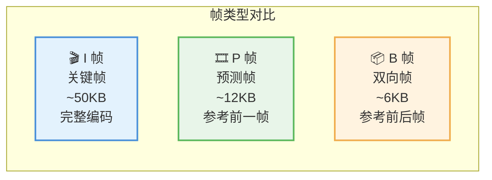
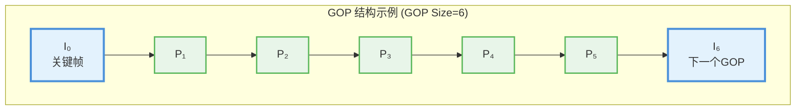
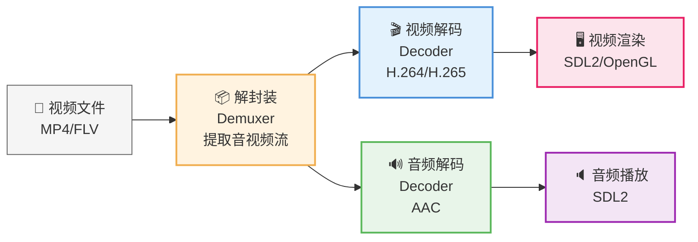
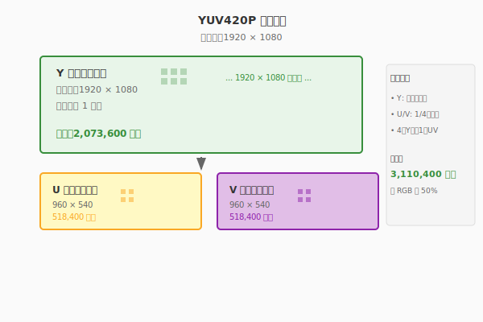
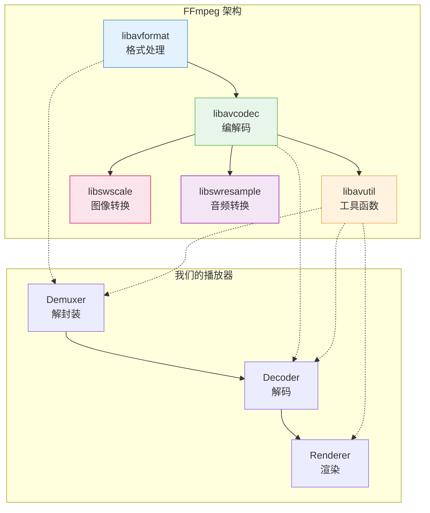
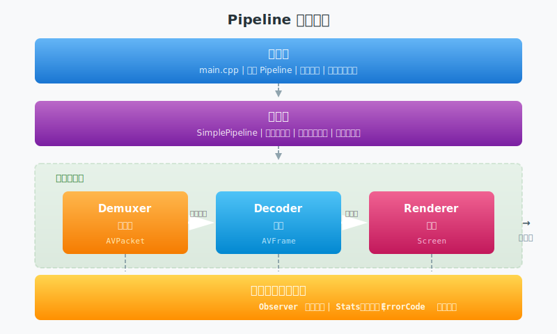
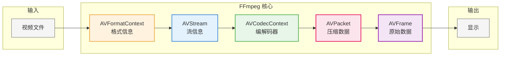
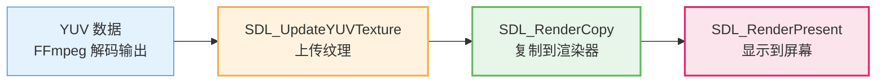

# 第一章：视频基础理论

> **本章目标**：理解视频播放的完整链路——从文件中的压缩数据，到屏幕上的清晰画面。

在开始编写代码之前，我们需要先理解几个根本问题：**为什么视频能压缩？压缩后的数据是什么样的？如何把这些数据还原成图像？** 本章将带你从零开始，理解视频技术的核心概念。

**阅读指南**：
- 第 1-2 节：视频压缩原理，建立直观感受
- 第 3-5 节：颜色空间、FFmpeg 架构、SDL2 渲染
- 第 6-7 节：调试技巧和常见问题

---

## 目录

1. [视频压缩原理：为什么 1 分钟视频只有 100MB](#1-视频压缩原理为什么-1-分钟视频只有-100mb)
2. [颜色空间：YUV 与 RGB 的区别](#2-颜色空间yuv-与-rgb-的区别)
3. [FFmpeg 架构：核心数据结构详解](#3-ffmpeg-架构核心数据结构详解)
4. [SDL2 渲染：从像素到屏幕](#4-sdl2-渲染从像素到屏幕)
5. [调试技巧：排查问题](#5-调试技巧排查问题)
6. [常见问题](#6-常见问题)
7. [本章总结与下一步](#7-本章总结与下一步)

---

## 1. 视频压缩原理：为什么 1 分钟视频只有 100MB

**本节概览**：为什么 1 分钟的 1080p 视频只需要 100MB，而不压缩的话需要 10GB？这一节将揭示视频压缩的三个核心技巧。

### 1.1 原始视频有多大

让我们先算一笔账。1080p 视频每帧有 1920×1080 = 2073600 个像素，如果每个像素用 3 字节（RGB）表示：

| 分辨率 | 每帧大小 | 1 秒 (30fps) | 1 分钟 | 1 小时 |
|:---|:---|:---|:---|:---|
| 1280×720 | 2.8 MB | 84 MB | **5.0 GB** | 300 GB |
| 1920×1080 | 6.2 MB | 186 MB | **11.2 GB** | 672 GB |
| 3840×2160 | 24.9 MB | 747 MB | **44.8 GB** | 2.7 TB |

**实际 1 分钟 1080p 视频约 100 MB**，压缩了 **100 倍以上**！

这是怎么做到的？视频数据中存在三种"冗余"，压缩就是去除这些冗余。

### 1.2 冗余一：空间冗余（帧内压缩）

**现象**：一张照片中，相邻的像素通常很相似。比如一片蓝天，像素值可能是 200, 201, 200, 199, 201... 变化不大。

**压缩思路**：不直接存储每个像素的值，而是存储"差值"。

```
原始数据：200, 201, 200, 199, 201, 202, 200, 199 （8 字节）
差分编码：200（基准）, +1, -1, -1, +2, +1, -2, -1

差值范围小（-2 到 +2），可以用更少的位存储
```

**核心算法：DCT 变换**

JPEG 和视频压缩都使用 DCT（离散余弦变换）。它的核心思想是：

```
把图像从"空间域"（像素值）转换到"频率域"（变化快慢）

- 低频 = 缓慢变化的区域（天空、墙面）→ 保留
- 高频 = 快速变化的区域（边缘、纹理）→ 适当丢弃
```

人眼对高频细节不敏感，因此可以丢弃部分高频信息，大幅减小数据量。

### 1.3 冗余二：时间冗余（帧间压缩）

**现象**：视频中连续帧之间变化很小。30fps 的视频，相邻帧只间隔 33 毫秒，画面通常只有微小变化。

**压缩思路**：不存储完整画面，只存储"变化的部分"。

```
第 1 帧：存储完整画面（关键帧）      50 KB
第 2 帧：只存储与第 1 帧的差异       10 KB
第 3 帧：只存储与第 2 帧的差异       8 KB
...
```

**帧类型设计**

为了高效利用时间冗余，视频编码定义了三种帧类型：



| 类型 | 名称 | 大小 | 说明 |
|:---|:---|:---|:---|
| **I 帧** | 关键帧 | 40-60 KB | 完整编码，可独立解码 |
| **P 帧** | 预测帧 | 8-15 KB | 参考前一帧，只存变化 |
| **B 帧** | 双向帧 | 3-8 KB | 参考前后两帧，压缩率最高 |

**GOP 结构**

两个 I 帧之间的帧序列称为 GOP（Group of Pictures）：



GOP 大小影响：
- **GOP 小（如 12）**：解码延迟低，适合直播，但压缩率稍差
- **GOP 大（如 250）**：压缩率高，适合存储，但解码延迟高


### 1.4 冗余三：视觉冗余（感知压缩）

**现象**：人眼对颜色和亮度的敏感度不同。

- **亮度（Y）**：敏感，需要高精度
- **色度（UV）**：不敏感，可以降低采样精度

这就是 **YUV 4:2:0** 颜色空间的原理：亮度全采样，色度减半采样，数据量减少 50%。

### 1.5 播放器 Pipeline 概览

视频播放的本质是：**解封装 → 解码 → 渲染**



**为什么要分这么多步骤？**

每个步骤解决一个特定问题：
1. **解封装**：从容器格式中提取压缩数据
2. **解码**：将压缩数据还原为原始图像
3. **渲染**：将图像显示到屏幕


---

## 2. 颜色空间：YUV 与 RGB 的区别

### 2.1 为什么需要 YUV

**RGB 的问题**：
- 每个像素 3 字节（R、G、B 各 1 字节）
- 但人眼对颜色不如对亮度敏感

**YUV 的优势**：
- **Y（Luma）**：亮度，人眼敏感，全分辨率
- **U/V（Chroma）**：色度，人眼不敏感，可降采样

### 2.2 YUV 采样格式

| 格式 | 采样方式 | 数据量 | 说明 |
|:---|:---|:---|:---|
| **YUV 4:4:4** | YUV 全采样 | 100% | 无压缩，专业制作 |
| **YUV 4:2:2** | UV 水平减半 | 66% | 广播级质量 |
| **YUV 4:2:0** | UV 水平和垂直都减半 | 50% | **最常用**，网络视频 |

**YUV 4:2:0 示意图**：

```
┌─────────────────────────────────────┐
│  Y  Y  Y  Y  Y  Y  Y  Y  （亮度全采样）│
│  Y  Y  Y  Y  Y  Y  Y  Y              │
├─────────────────────────────────────┤
│  U        U        U        U       │
│        （色度 1/4 采样）              │
│  V        V        V        V       │
└─────────────────────────────────────┘

4 个 Y 共享 1 个 U 和 1 个 V
数据量 = 4 + 1 + 1 = 6 字节/4像素 = 1.5 字节/像素
相比 RGB（3 字节/像素）节省 50%
```



### 2.3 YUV 数据在内存中的布局

```c
// YUV 4:2:0 planar 格式（YUV420P）
// 对于 1920×1080 的视频

uint8_t *data[4];     // 数据指针
int linesize[4];      // 每行字节数

// data[0] 指向 Y 平面：1920 × 1080 字节
// data[1] 指向 U 平面：960 × 540 字节（1/4 大小）
// data[2] 指向 V 平面：960 × 540 字节（1/4 大小）
// data[3] 未使用

// linesize[0] = 1920（Y 每行 1920 字节）
// linesize[1] = 960（U 每行 960 字节）
// linesize[2] = 960（V 每行 960 字节）
```

---

## 3. FFmpeg 架构：核心数据结构详解

### 3.1 FFmpeg 的核心组件

FFmpeg 提供了播放器所需的全部功能：





### 3.2 关键数据结构

**AVFormatContext**：格式上下文
```c
typedef struct AVFormatContext {
    struct AVInputFormat *iformat;   // 输入格式（MP4、FLV 等）
    struct AVOutputFormat *oformat;  // 输出格式
    
    AVStream **streams;              // 流数组（视频流、音频流等）
    int nb_streams;                  // 流数量
    
    int64_t duration;                // 总时长（微秒）
    int64_t bit_rate;                // 比特率
    
    // ... 更多字段
} AVFormatContext;
```

**AVCodecContext**：编解码器上下文
```c
typedef struct AVCodecContext {
    const AVCodec *codec;            // 编解码器
    
    int width, height;               // 视频宽高
    enum AVPixelFormat pix_fmt;      // 像素格式
    
    int sample_rate;                 // 音频采样率
    int channels;                    // 音频声道数
    
    // ... 更多字段
} AVCodecContext;
```

**AVFrame**：解码后的帧
```c
typedef struct AVFrame {
    uint8_t *data[AV_NUM_DATA_POINTERS];     // 数据指针数组
    int linesize[AV_NUM_DATA_POINTERS];      // 每行字节数
    
    int width, height;                       // 视频宽高
    int nb_samples;                          // 音频采样数
    
    int64_t pts;                             // 显示时间戳
    int64_t pkt_dts;                         // 解码时间戳
    
    // ... 更多字段
} AVFrame;
```

### 3.3 数据流关系图



---

## 4. SDL2 渲染：从像素到屏幕

### 4.1 为什么用 SDL2

**SDL2（Simple DirectMedia Layer）** 是一个跨平台的多媒体库，提供：
- 窗口创建和管理
- 2D 图形渲染
- 音频播放
- 事件处理（键盘、鼠标）

**优势**：
- 简单：几行代码就能创建窗口
- 跨平台：Windows、macOS、Linux 都支持
- 硬件加速：自动使用 GPU 加速

### 4.2 SDL2 渲染流程



**关键概念**：
- **Texture**：显存中的图像数据（GPU 直接访问）
- **Renderer**：渲染器，负责把 Texture 画到窗口
- **Window**：显示窗口

### 4.3 核心代码示例

```c
// 1. 初始化 SDL
SDL_Init(SDL_INIT_VIDEO | SDL_INIT_AUDIO);

// 2. 创建窗口
SDL_Window *window = SDL_CreateWindow(
    "Player",
    SDL_WINDOWPOS_UNDEFINED, SDL_WINDOWPOS_UNDEFINED,
    1920, 1080,
    SDL_WINDOW_RESIZABLE
);

// 3. 创建渲染器
SDL_Renderer *renderer = SDL_CreateRenderer(window, -1, 0);

// 4. 创建 YUV 纹理
SDL_Texture *texture = SDL_CreateTexture(
    renderer,
    SDL_PIXELFORMAT_YV12,           // YUV 4:2:0 格式
    SDL_TEXTUREACCESS_STREAMING,    // 经常更新
    1920, 1080
);

// 5. 更新纹理（每帧调用）
SDL_UpdateYUVTexture(
    texture,
    NULL,                           // 更新整个纹理
    frame->data[0], frame->linesize[0],  // Y 平面
    frame->data[1], frame->linesize[1],  // U 平面
    frame->data[2], frame->linesize[2]   // V 平面
);

// 6. 渲染
SDL_RenderClear(renderer);
SDL_RenderCopy(renderer, texture, NULL, NULL);
SDL_RenderPresent(renderer);
```

---

## 5. 调试技巧：排查问题

### 5.1 FFmpeg 日志

```c
// 设置日志级别
av_log_set_level(AV_LOG_DEBUG);

// 级别从低到高：
// AV_LOG_QUIET    - 不输出
// AV_LOG_ERROR    - 只输出错误
// AV_LOG_WARNING  - 警告和错误
// AV_LOG_INFO     - 普通信息（默认）
// AV_LOG_DEBUG    - 调试信息
// AV_LOG_TRACE    - 最详细
```

### 5.2 常见问题排查

| 现象 | 可能原因 | 排查方法 |
|:---|:---|:---|
| 黑屏 | 解码失败、渲染错误 | 检查 `avcodec_receive_frame` 返回值 |
| 花屏 | 数据损坏、格式错误 | 检查 YUV 数据是否正确 |
| 卡顿 | 解码慢、渲染慢 | 打印每步耗时 |
| 音画不同步 | 时间戳问题 | 对比音频和视频的 pts |
| 崩溃 | 内存错误、空指针 | 使用 gdb/valgrind |

---

## 6. 常见问题

### Q1: 为什么播放器需要这么多步骤？

**答**：视频文件本身就是分层的：
1. **容器层**（MP4/FLV）：把音视频打包在一起
2. **编码层**（H.264/AAC）：压缩数据
3. **原始数据层**（YUV/PCM）：解码后的数据

播放器必须逐层解析，就像打开一个俄罗斯套娃。

### Q2: 为什么要用 YUV 而不是 RGB？

**答**：三个原因：
1. **兼容性**：视频编码标准基于 YUV 设计
2. **压缩率**：YUV 4:2:0 比 RGB 节省 50% 空间
3. **硬件支持**：GPU 和显示器原生支持 YUV

### Q3: FFmpeg 这么多结构体，怎么记？

**答**：抓住主线：
```
文件 → AVFormatContext → AVStream → AVCodecContext → AVPacket → AVFrame → 显示
```

记住这个流程，用到什么查什么，不用死记硬背。

---

## 7. 本章总结与下一步

### 核心概念回顾

| 概念 | 一句话解释 |
|:---|:---|
| **I/P/B 帧** | I 帧完整，P 帧参考前面，B 帧参考前后 |
| **GOP** | 两个 I 帧之间的帧序列 |
| **YUV 4:2:0** | 亮度全采样，色度 1/4 采样 |
| **AVPacket** | 压缩后的音视频数据 |
| **AVFrame** | 解码后的原始音视频数据 |
| **SDL_Texture** | GPU 显存中的图像 |

### 关键技能

- 理解视频压缩的三种冗余
- 掌握 FFmpeg 核心数据结构
- 使用 SDL2 进行视频渲染

### 下一步

第二章，我们将编写**第一个视频播放器**，把本章的理论付诸实践。

---

**延伸阅读**：
- H.264 标准：ITU-T Rec. H.264
- FFmpeg 文档：https://ffmpeg.org/documentation.html
- SDL2 文档：https://wiki.libsdl.org/
