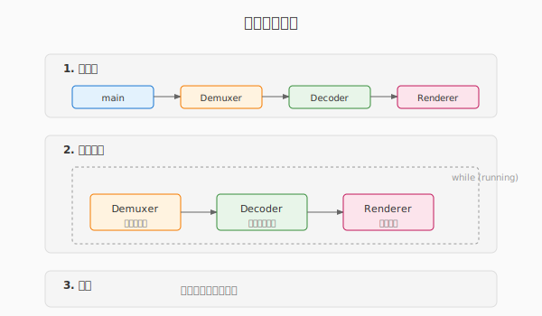
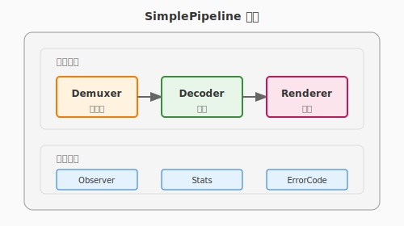

# 第一章：Pipeline 架构与本地播放

> **目标**：从零开始，理解音视频播放的本质，写出工业级代码。

**预计时间**：阅读 90 分钟，动手 40 分钟。

---

## 写在前面：写给初学者

如果你打开一个视频文件，看到画面在动，背后发生了什么？

这听起来简单，但实现一个**稳定、高效、可维护**的播放器，需要理解很多概念。

**本章不会让你立即成为专家，但会：**
- 建立正确的思维模型
- 写出有架构的代码，不是一团乱麻
- 为后续章节打下坚实基础

**遇到困难时**：每个概念都有类比和图解，先理解大意，再深入细节。

---

## 目录

1. [视频播放的本质](#1-视频播放的本质)
2. [为什么需要 Pipeline 架构](#2-为什么需要-pipeline-架构)
3. [认识 FFmpeg](#3-认识-ffmpeg)
4. [关键概念详解](#4-关键概念详解)
5. [代码实现：从零开始](#5-代码实现从零开始)
6. [构建与运行](#6-构建与运行)
7. [常见问题](#7-常见问题)
8. [下一步](#8-下一步)

---

## 1. 视频播放的本质

### 1.1 视频是什么？

想象你快速翻动手翻书（Flip Book）：

```
第1张图 → 第2张图 → 第3张图 → ... → 每秒30张
     快速连续播放 = 动起来的画面
```

**视频的本质就是：快速播放的一系列静态图片。**

电影胶片就是这个原理：每秒播放 24 帧（张）画面，人眼就感觉到流畅的运动。

### 1.2 为什么视频文件这么小？

一个 1 分钟的 1080p 视频，如果不压缩：

```
每张图：1920 × 1080 像素 × 3 字节(RGB) = 6.2 MB
每秒：30 张 × 6.2 MB = 186 MB
1 分钟：186 MB × 60 = 10.8 GB
```

**实际 MP4 文件只有约 100 MB，压缩了 100 倍！**

#### 压缩原理 ①：空间冗余

一张风景照片：
- 天空区域：几万像素都是类似的蓝色
- 草地区域：几万像素都是类似的绿色

**不需要存每个像素，只需存：**
- "天空：从 (100, 50) 到 (800, 200) 都是浅蓝色"
- 用数学方法（DCT 变换）高效表示颜色变化

这就像你描述一幅画：不会说"第1个点蓝色，第2个点蓝色..."，而是说"上面一半是蓝天"。

#### 压缩原理 ②：时间冗余

视频的特点是**连续帧变化很小**：

```
第 1 帧：完整的画面（I 帧，关键帧）
第 2 帧：只存"人走动了一步"的变化（P 帧，预测帧）
第 3 帧：只存"手抬起来"的变化（P 帧）
```

如果画面没变化，理论上只需存"和上一帧一样"。

**类比**：
- I 帧 = 拍一张照片
- P 帧 = 描述"和照片相比，什么变了"

### 1.3 播放视频需要做什么？

要把压缩的视频显示出来，需要经历三个阶段：


| 阶段 | 做什么 | 比喻 |
|:---:|:---|:---|
| **解封装** | 从 MP4 盒子里取出视频数据 | 拆开快递盒 |
| **解码** | 把压缩的 H.264 还原成图像 | 解压 zip 文件 |
| **渲染** | 把图像画到屏幕上 | 把照片贴到墙上 |

**这就是 Pipeline 的三个核心模块。**

---

## 2. 为什么需要 Pipeline 架构

### 2.1 "烂代码"长什么样？

假设老板让你写个播放器，新手的第一版可能是这样：

```cpp
int main() {
    // 1. 打开文件
    AVFormatContext* ctx = nullptr;
    avformat_open_input(&ctx, "video.mp4", nullptr, nullptr);
    
    // 2. 读取数据
    AVPacket packet;
    while (av_read_frame(ctx, &packet) >= 0) {
        // 解码...
        // 渲染...
    }
    
    return 0;
}
```

**这段代码能跑，但有很多问题：**

| 问题 | 后果 | 示例 |
|:---|:---|:---|
| **没有错误处理** | 文件打不开就崩溃 | `avformat_open_input` 失败没检查 |
| **内存泄漏** | 运行几小时后内存耗尽 | `packet` 没释放 |
| **所有逻辑堆在 main** | 100 行变 1000 行后无法维护 | 没有模块划分 |
| **无法测试** | 改代码后不知道有没有坏 | 没法单独测试解码逻辑 |

**真实场景**：播放器要连续运行几小时甚至几天，上述问题会导致严重故障。

### 2.2 工业级代码的要求

| 要求 | 为什么重要 | 本章解决方案 |
|:---|:---|:---|
| **不泄漏内存** | 播放器要跑几小时/几天 | RAII 智能指针，自动释放 |
| **错误可处理** | 网络断了、文件坏了怎么办？ | 详细错误码，优雅降级 |
| **可测试** | 改代码后怎么保证没坏？ | 接口抽象，模块独立测试 |
| **可观测** | 线上出问题怎么排查？ | 统计接口，实时看状态 |
| **可扩展** | 后面要加功能怎么办？ | Pipeline 架构，模块可替换 |

### 2.3 什么是 Pipeline 架构？

> **Pipeline（流水线）：数据像水一样流动，每个阶段处理完传给下一个阶段。**


**生活类比：咖啡店的流水线**

```
顾客下单 → 制作咖啡 → 添加配料 → 交付顾客
   ↓          ↓          ↓          ↓
 接单员    咖啡师     配料员     服务员
   ↓          ↓          ↓          ↓
 解封装    解码器     处理器     渲染器
```

**每个岗位只负责一件事：**
- 接单员（Demuxer）：只管从盒子里取出原料
- 咖啡师（Decoder）：只管把原料加工成产品
- 服务员（Renderer）：只管把产品交给顾客

**好处**：
- 岗位之间通过标准接口交接（订单小票）
- 可以替换某个岗位，不影响其他岗位
- 可以监控每个岗位的效率

### 2.4 为什么要抽象接口？

**想象你要换一辆车：**

| 情况 | 没有接口 | 有接口 |
|:---|:---|:---|
| 换车体验 | 重新学开车（方向盘位置变了、档位变了） | 只要会开车，换什么车都能开 |
| 代码体验 | 换实现时修改所有调用代码 | 只换实现，调用代码不变 |

**代码中的接口：**

```cpp
// 定义接口（抽象的驾驶规范）
class Pipeline {
public:
    virtual ErrorCode Init(const std::string& url) = 0;
    virtual ErrorCode Start() = 0;
    virtual ErrorCode Stop() = 0;
};

// 使用接口（开车的人不需要知道是什么车）
std::unique_ptr<Pipeline> player = std::make_unique<SimplePipeline>();
player->Init("video.mp4");
player->Start();
```

**后续章节的好处：**
- 第2章换成网络流：用户代码一行不改
- 第3章加硬件解码：只改 Decoder 实现
- 可以 Mock 接口做单元测试

### 2.5 我们的架构设计



**整体结构：**



---

## 3. 认识 FFmpeg

FFmpeg 是音视频开发的事实标准，本章用它来简化底层操作。

### 3.1 FFmpeg 是什么？

FFmpeg 是一套开源的音视频处理工具集，包含：
- **库**：开发者用的代码库（libavformat、libavcodec 等）
- **工具**：命令行工具（ffmpeg、ffprobe、ffplay）

**本章用到的核心库：**

| 库 | 作用 | 对应 Pipeline 模块 |
|:---|:---|:---|
| **libavformat** | 处理各种容器格式（MP4、FLV 等） | Demuxer |
| **libavcodec** | 编解码（H.264、AAC 等） | Decoder |
| **libavutil** | 工具函数（内存管理、数学运算等） | 通用 |
| **libswscale** | 图像格式转换（YUV→RGB 等） | Renderer |

### 3.2 核心数据结构

FFmpeg 有几个贯穿始终的结构体，必须理解：

#### AVFormatContext —— 文件的"总控"

```cpp
// 想象这是一个文件管理器
AVFormatContext* ctx = nullptr;

// 打开文件，ctx 指向一个复杂的内部结构
avformat_open_input(&ctx, "video.mp4", nullptr, nullptr);

// 里面包含：
// - 文件格式信息（MP4、FLV 等）
// - 有多少路流（视频、音频、字幕）
// - 每路流的编码参数
// - 时长、比特率等元数据
```

**类比**：`AVFormatContext` 就像快递单，记录了包裹的所有信息。

#### AVStream —— 一路流的描述

一个视频文件可能包含多路流：
- 视频流（画面）
- 音频流（声音）
- 字幕流

```cpp
// 从 ctx 中获取视频流
AVStream* video_stream = ctx->streams[video_stream_index];

// 包含这路流的：
// - 编码格式（H.264、HEVC 等）
// - 分辨率、帧率
// - 时间基（time_base）
```

#### AVPacket —— 压缩的数据包

```cpp
AVPacket packet;
// packet.data   → 压缩后的数据（H.264 编码的二进制）
// packet.size   → 数据大小
// packet.pts    → 显示时间戳（什么时候显示这帧）
// packet.stream_index → 属于哪路流
```

**类比**：`AVPacket` 就像快递包裹里的一个小盒子，上面写着"第几号零件、什么时候组装"。

#### AVFrame —— 解码后的图像帧

```cpp
AVFrame* frame = av_frame_alloc();
// frame->data[0] → Y 平面数据
// frame->data[1] → U 平面数据
// frame->data[2] → V 平面数据
// frame->width   → 图像宽度
// frame->height  → 图像高度
// frame->pts     → 显示时间戳
```

**类比**：`AVFrame` 就是组装好的零件，可以直接使用。

### 3.3 为什么需要 RAII 封装？

FFmpeg 的 API 是 C 语言写的，需要手动管理内存：

```cpp
// ❌ 裸指针：容易泄漏和重复释放
void BadExample() {
    AVPacket* pkt = av_packet_alloc();  // 分配内存
    
    if (some_error) {
        return;  // 糟糕！pkt 没释放，内存泄漏！
    }
    
    av_packet_free(&pkt);  // 释放内存
}

// ❌ 更糟的情况：重复释放
void WorseExample() {
    AVPacket* pkt = av_packet_alloc();
    av_packet_free(&pkt);
    av_packet_free(&pkt);  // 崩溃！重复释放！
}
```

**C++ 解决方案：RAII（资源获取即初始化）**

```cpp
// ✅ 智能指针：自动管理生命周期
class AVPacketDeleter {
public:
    void operator()(AVPacket* p) {
        if (p) av_packet_free(&p);
    }
};

using PacketPtr = std::unique_ptr<AVPacket, AVPacketDeleter>;

// 使用
void GoodExample() {
    PacketPtr pkt(av_packet_alloc());  // 分配
    
    if (some_error) {
        return;  // 安全！pkt 自动释放
    }
    
}  // 函数结束，pkt 自动释放
```

**本章提供的封装：**

```cpp
// ffmpeg_utils.h 中定义
using PacketPtr = std::unique_ptr<AVPacket, AVPacketDeleter>;
using FramePtr = std::unique_ptr<AVFrame, AVFrameDeleter>;
using CodecContextPtr = std::unique_ptr<AVCodecContext, CodecContextDeleter>;

// 工厂函数
inline PacketPtr MakePacket() {
    return PacketPtr(av_packet_alloc());
}

inline FramePtr MakeFrame() {
    return FramePtr(av_frame_alloc());
}
```

**好处**：
- 不会内存泄漏
- 不会重复释放
- 代码更简洁
- 异常安全（抛出异常也会正确释放）

---

## 4. 关键概念详解

### 4.1 YUV 像素格式

#### 为什么用 YUV 而不是 RGB？

人眼的特性：
- **对亮度敏感**：能看出明暗变化
- **对色度不敏感**：看不出细微的颜色差别

**YUV 的设计**：
- **Y**（Luma）：亮度，完整分辨率
- **U/V**（Chroma）：色度，分辨率减半

**内存占用对比（1920×1080）：**

| 格式 | Y 平面 | U 平面 | V 平面 | 总大小 | 相比 RGB |
|:---|:---|:---|:---|:---|:---|
| **RGB** | - | - | - | 6.2 MB/帧 | 100% |
| **YUV420P** | 2.0 MB | 0.5 MB | 0.5 MB | **3.1 MB/帧** | **50%** |

**内存布局：**

```
**内存布局：**


总大小：3,110,400 字节（比 RGB 省 50%）
```

### 4.2 PTS（Presentation Time Stamp）

#### 视频播放的时间控制

视频帧不是越快显示越好，而是要**按正确的时间显示**。

**类比**：音乐会演奏
- 每个音符有固定的节拍（第几拍开始演奏）
- 演奏者需要按节拍演奏，不能乱来

**PTS 的作用**：告诉播放器"这帧应该在什么时候显示"。

```cpp
// 假设视频是 30fps（每秒30帧）
// 第0帧：PTS = 0ms，应该立即显示
// 第1帧：PTS = 33ms，应该在33毫秒后显示
// 第2帧：PTS = 66ms，应该在66毫秒后显示
```

**代码实现：**

```cpp
// 简单的同步逻辑
auto start_time = std::chrono::steady_clock::now();

while (running) {
    FramePtr frame = decoder.ReceiveFrame();
    
    // 计算这帧应该显示的时间
    auto now = std::chrono::steady_clock::now();
    auto elapsed = now - start_time;
    auto frame_time = std::chrono::microseconds(frame->pts);
    
    // 如果还没到显示时间，等待
    if (frame_time > elapsed) {
        std::this_thread::sleep_for(frame_time - elapsed);
    }
    
    // 现在显示
    renderer.Render(frame.get());
}
```

### 4.3 时间基（Time Base）

**问题**：不同视频文件的 PTS 单位可能不同。

**解决方案**：时间基（Time Base）

```cpp
// 时间基是一个分数，表示 PTS 的单位
// 例如：time_base = 1/1000，表示 PTS 以毫秒为单位
//       time_base = 1/90000，表示 PTS 以 1/90000 秒为单位

// 转换公式：
// 实际时间（秒）= PTS × time_base
// 实际时间（毫秒）= PTS × time_base × 1000

// 示例：
// PTS = 3000, time_base = 1/1000
// 实际时间 = 3000 × (1/1000) = 3 秒
```

---

## 5. 代码实现：从零开始

### 5.1 项目结构

```
chapter-01/
├── CMakeLists.txt          # 构建配置
├── README.md               # 本章文档
└── src/
    ├── base/               # 基础组件（可复用）
    │   ├── pipeline.h      # Pipeline 接口定义
    │   └── ffmpeg_utils.h  # FFmpeg RAII 封装
    ├── core/               # 核心实现
    │   ├── simple_pipeline.h/cpp   # 主 Pipeline
    │   ├── demuxer.h/cpp           # 解封装模块
    │   ├── decoder.h/cpp           # 解码模块
    │   └── renderer.h/cpp          # 渲染模块
    └── main.cpp            # 示例程序
```

**分层设计：**
- **base/**：与业务无关的基础工具，可被其他项目复用
- **core/**：本章的业务逻辑，实现 Pipeline 接口

### 5.2 接口定义（base/pipeline.h）

```cpp
#pragma once

#include <string>
#include <memory>
#include <functional>

namespace live {

// 错误码定义
enum class ErrorCode {
    OK = 0,
    INVALID_ARGUMENT,
    FILE_NOT_FOUND,
    FORMAT_NOT_SUPPORTED,
    CODEC_NOT_FOUND,
    DECODER_ERROR,
    RENDERER_ERROR,
    OUT_OF_MEMORY,
    UNKNOWN
};

// 统计信息
struct PipelineStats {
    int64_t total_frames = 0;
    int64_t dropped_frames = 0;
    double current_fps = 0.0;
    int64_t current_pts = 0;
};

// 观察者接口（用于外部监听事件）
class PipelineObserver {
public:
    virtual ~PipelineObserver() = default;
    virtual void OnError(ErrorCode code, const std::string& message) = 0;
    virtual void OnFrameRendered(int64_t pts) = 0;
    virtual void OnStatsUpdated(const PipelineStats& stats) = 0;
};

// Pipeline 接口
class Pipeline {
public:
    virtual ~Pipeline() = default;
    
    // 生命周期管理
    virtual ErrorCode Init(const std::string& url) = 0;
    virtual ErrorCode Start() = 0;
    virtual ErrorCode Stop() = 0;
    
    // 查询状态
    virtual PipelineStats GetStats() const = 0;
    virtual void SetObserver(PipelineObserver* observer) = 0;
};

} // namespace live
```

**设计要点：**
- `ErrorCode`：详细的错误分类，便于问题定位
- `PipelineStats`：可观测性，实时查看运行状态
- `PipelineObserver`：回调接口，外部可以监听事件
- `Pipeline`：纯虚接口，实现与使用分离

### 5.3 FFmpeg RAII 封装（base/ffmpeg_utils.h）

```cpp
#pragma once

extern "C" {
#include <libavformat/avformat.h>
#include <libavcodec/avcodec.h>
#include <libavutil/frame.h>
}

#include <memory>

namespace live {

// AVPacket 删除器
struct AVPacketDeleter {
    void operator()(AVPacket* p) const {
        if (p) {
            av_packet_free(&p);
        }
    }
};

// AVFrame 删除器
struct AVFrameDeleter {
    void operator()(AVFrame* p) const {
        if (p) {
            av_frame_free(&p);
        }
    }
};

// AVCodecContext 删除器
struct CodecContextDeleter {
    void operator()(AVCodecContext* p) const {
        if (p) {
            avcodec_free_context(&p);
        }
    }
};

// 智能指针类型别名
using PacketPtr = std::unique_ptr<AVPacket, AVPacketDeleter>;
using FramePtr = std::unique_ptr<AVFrame, AVFrameDeleter>;
using CodecContextPtr = std::unique_ptr<AVCodecContext, CodecContextDeleter>;

// 工厂函数
inline PacketPtr MakePacket() {
    return PacketPtr(av_packet_alloc());
}

inline FramePtr MakeFrame() {
    return FramePtr(av_frame_alloc());
}

} // namespace live
```

**关键设计：**
- 自定义 `Deleter`：适配 FFmpeg 的 C 风格 API
- `std::unique_ptr`：自动管理生命周期
- 工厂函数：简化创建代码

### 5.4 Demuxer 模块（core/demuxer.h）

```cpp
#pragma once

#include "../base/pipeline.h"
#include "../base/ffmpeg_utils.h"

extern "C" {
#include <libavformat/avformat.h>
}

namespace live {

class Demuxer {
public:
    Demuxer();
    ~Demuxer();
    
    // 禁止拷贝（资源唯一）
    Demuxer(const Demuxer&) = delete;
    Demuxer& operator=(const Demuxer&) = delete;
    
    // 允许移动
    Demuxer(Demuxer&&) = default;
    Demuxer& operator=(Demuxer&&) = default;
    
    // 打开文件
    ErrorCode Open(const std::string& url);
    
    // 读取一个 packet
    // 返回 OK：成功读取
    // 返回 END_OF_STREAM：读取完毕
    // 返回其他：错误
    ErrorCode ReadPacket(PacketPtr& packet);
    
    // 获取视频流信息
    AVStream* GetVideoStream() const { return video_stream_; }
    int GetVideoStreamIndex() const { return video_stream_index_; }
    
    // 获取时长（毫秒）
    int64_t GetDuration() const;

private:
    AVFormatContext* format_ctx_ = nullptr;
    AVStream* video_stream_ = nullptr;
    int video_stream_index_ = -1;
};

} // namespace live
```

**实现要点（core/demuxer.cpp）：**

```cpp
#include "demuxer.h"
#include <vector>

namespace live {

Demuxer::Demuxer() = default;

Demuxer::~Demuxer() {
    if (format_ctx_) {
        avformat_close_input(&format_ctx_);
    }
}

ErrorCode Demuxer::Open(const std::string& url) {
    // 1. 打开文件
    int ret = avformat_open_input(&format_ctx_, url.c_str(), nullptr, nullptr);
    if (ret < 0) {
        return ErrorCode::FILE_NOT_FOUND;
    }
    
    // 2. 读取流信息
    ret = avformat_find_stream_info(format_ctx_, nullptr);
    if (ret < 0) {
        return ErrorCode::FORMAT_NOT_SUPPORTED;
    }
    
    // 3. 找到视频流
    video_stream_index_ = av_find_best_stream(
        format_ctx_, AVMEDIA_TYPE_VIDEO, -1, -1, nullptr, 0);
    
    if (video_stream_index_ < 0) {
        return ErrorCode::FORMAT_NOT_SUPPORTED;
    }
    
    video_stream_ = format_ctx_->streams[video_stream_index_];
    return ErrorCode::OK;
}

ErrorCode Demuxer::ReadPacket(PacketPtr& packet) {
    if (!packet) {
        packet = MakePacket();
    }
    
    int ret = av_read_frame(format_ctx_, packet.get());
    
    if (ret == AVERROR_EOF) {
        return ErrorCode::OK;  // 结束
    }
    if (ret < 0) {
        return ErrorCode::UNKNOWN;
    }
    
    // 只保留视频流
    if (packet->stream_index != video_stream_index_) {
        av_packet_unref(packet.get());
        return ReadPacket(packet);  // 递归读取下一个
    }
    
    return ErrorCode::OK;
}

int64_t Demuxer::GetDuration() const {
    if (!video_stream_) return 0;
    return video_stream_->duration * av_q2d(video_stream_->time_base) * 1000;
}

} // namespace live
```

### 5.5 Decoder 模块（core/decoder.h）

```cpp
#pragma once

#include "../base/pipeline.h"
#include "../base/ffmpeg_utils.h"

extern "C" {
#include <libavcodec/avcodec.h>
}

namespace live {

class Decoder {
public:
    Decoder();
    ~Decoder();
    
    // 禁止拷贝
    Decoder(const Decoder&) = delete;
    Decoder& operator=(const Decoder&) = delete;
    
    // 初始化（传入视频流的 codecpar）
    ErrorCode Init(const AVCodecParameters* codecpar);
    
    // 发送 packet 到解码器
    ErrorCode SendPacket(const PacketPtr& packet);
    
    // 从解码器接收 frame
    // 返回 OK：成功获取一帧
    // 返回 NEED_MORE_DATA：需要更多输入
    // 返回 END_OF_STREAM：解码完毕
    ErrorCode ReceiveFrame(FramePtr& frame);

private:
    CodecContextPtr codec_ctx_;
    const AVCodec* codec_ = nullptr;
};

} // namespace live
```

### 5.6 Renderer 模块（core/renderer.h）

```cpp
#pragma once

#include "../base/pipeline.h"
#include "../base/ffmpeg_utils.h"
#include <string>

struct SDL_Window;
struct SDL_Renderer;
struct SDL_Texture;

namespace live {

class Renderer {
public:
    Renderer();
    ~Renderer();
    
    // 禁止拷贝
    Renderer(const Renderer&) = delete;
    Renderer& operator=(const Renderer&) = delete;
    
    // 初始化（传入窗口标题和大小）
    ErrorCode Init(const std::string& title, int width, int height);
    
    // 渲染一帧
    ErrorCode Render(const FramePtr& frame);
    
    // 处理窗口事件（如关闭窗口）
    bool HandleEvents();

private:
    SDL_Window* window_ = nullptr;
    SDL_Renderer* renderer_ = nullptr;
    SDL_Texture* texture_ = nullptr;
    int width_ = 0;
    int height_ = 0;
};

} // namespace live
```

### 5.7 SimplePipeline 主控（core/simple_pipeline.h）

```cpp
#pragma once

#include "../base/pipeline.h"
#include "demuxer.h"
#include "decoder.h"
#include "renderer.h"
#include <atomic>
#include <thread>

namespace live {

class SimplePipeline : public Pipeline {
public:
    SimplePipeline();
    ~SimplePipeline();
    
    // Pipeline 接口实现
    ErrorCode Init(const std::string& url) override;
    ErrorCode Start() override;
    ErrorCode Stop() override;
    PipelineStats GetStats() const override;
    void SetObserver(PipelineObserver* observer) override;

private:
    void Run();  // 主循环
    
    // 核心模块
    std::unique_ptr<Demuxer> demuxer_;
    std::unique_ptr<Decoder> decoder_;
    std::unique_ptr<Renderer> renderer_;
    
    // 状态
    std::atomic<bool> running_{false};
    std::thread thread_;
    
    // 统计
    mutable std::mutex stats_mutex_;
    PipelineStats stats_;
    
    // 观察者
    PipelineObserver* observer_ = nullptr;
};

} // namespace live
```

### 5.8 main.cpp 示例

```cpp
#include "core/simple_pipeline.h"
#include <iostream>

using namespace live;

// 打印统计的观察者
class PrintObserver : public PipelineObserver {
public:
    void OnError(ErrorCode code, const std::string& message) override {
        std::cerr << "[错误] " << static_cast<int>(code) << ": " << message << std::endl;
    }
    
    void OnFrameRendered(int64_t pts) override {
        // 可选：打印每帧的 PTS
    }
    
    void OnStatsUpdated(const PipelineStats& stats) override {
        std::cout << "\r帧数: " << stats.total_frames 
                  << " FPS: " << stats.current_fps 
                  << std::flush;
    }
};

int main(int argc, char* argv[]) {
    if (argc < 2) {
        std::cerr << "用法: " << argv[0] << " <视频文件>" << std::endl;
        return 1;
    }
    
    // 创建 Pipeline
    auto pipeline = std::make_unique<SimplePipeline>();
    
    // 设置观察者
    PrintObserver observer;
    pipeline->SetObserver(&observer);
    
    // 初始化
    if (auto err = pipeline->Init(argv[1]); err != ErrorCode::OK) {
        std::cerr << "初始化失败: " << static_cast<int>(err) << std::endl;
        return 1;
    }
    
    // 开始播放
    if (auto err = pipeline->Start(); err != ErrorCode::OK) {
        std::cerr << "启动失败: " << static_cast<int>(err) << std::endl;
        return 1;
    }
    
    // 等待播放结束（在 SimplePipeline 中处理窗口事件）
    // 实际会在 SDL 窗口关闭时自动停止
    
    std::cout << "播放结束" << std::endl;
    return 0;
}
```

---

## 6. 构建与运行

### 6.1 安装依赖

**macOS:**
```bash
brew install ffmpeg sdl2 cmake
```

**Ubuntu/Debian:**
```bash
sudo apt-get update
sudo apt-get install -y ffmpeg libavformat-dev libavcodec-dev \
    libavutil-dev libswscale-dev libsdl2-dev cmake
```

### 6.2 构建项目

```bash
cd chapter-01
mkdir build && cd build
cmake ..
make -j4
```

### 6.3 准备测试视频

```bash
# 生成 10 秒的测试视频（彩色条纹）
ffmpeg -f lavfi -i testsrc=duration=10:size=640x480:rate=30 \
       -pix_fmt yuv420p sample.mp4
```

### 6.4 运行

```bash
./live-player sample.mp4
```

**预期输出：**
```
初始化成功: 640x480 @ 30fps
帧数: 1 FPS: 0
帧数: 2 FPS: 30
帧数: 3 FPS: 30
...
播放结束
```

---

## 7. 常见问题

### Q1: CMake 找不到 FFmpeg

**现象**：`Could not find FFmpeg`

**解决**：
```bash
# 检查 FFmpeg 是否安装
pkg-config --exists libavformat && echo "OK" || echo "Not found"

# 如果安装了但 CMake 找不到，手动指定路径
cmake -DFFMPEG_ROOT=/usr/local ..
```

### Q2: 运行时崩溃（Segmentation fault）

**现象**：程序启动后立即崩溃

**解决**：
1. 检查视频文件是否有效：`ffprobe sample.mp4`
2. 检查是否是纯视频文件（某些 MP4 包含音频但视频流有问题）
3. 使用调试器查看崩溃位置：`gdb ./live-player`，然后 `run sample.mp4`

### Q3: 窗口黑屏，没有画面

**现象**：窗口弹出，但是黑色的

**可能原因**：
1. 像素格式不匹配（检查是否使用 YUV420P）
2. SDL 纹理创建失败（检查日志）
3. 解码失败（检查 Decoder 的返回值）

### Q4: 播放速度不对（太快或太慢）

**现象**：视频播放速度明显不对

**原因**：PTS 同步逻辑有问题

**检查点**：
- 时间基转换是否正确（`av_q2d(time_base)`）
- 单位是否统一（毫秒 vs 微秒）
- 是否处理了 pts 无效的情况

---

## 8. 下一步

本章实现了**同步单线程**播放器。但这有一个问题：

```
问题场景：播放 4K 视频
- 解码一帧需要 30ms
- 渲染只需要 5ms
- 总时间：35ms/帧 → 28fps（卡顿！）

理想：30ms 解码 + 5ms 渲染 = 35ms（还是不够）
理想+：解码和渲染并行 → 30ms/帧 → 33fps（流畅！）
```

**第2章预告**：
- 引入多线程
- 解码线程 + 渲染线程
- 生产者-消费者队列
- 解决卡顿问题

---

## 附录：关键术语表

| 术语 | 解释 |
|:---|:---|
| **Demuxer** | 解封装器，从容器格式中提取压缩数据 |
| **Decoder** | 解码器，将压缩数据还原为原始图像 |
| **Renderer** | 渲染器，将图像显示到屏幕 |
| **FFmpeg** | 开源音视频处理库 |
| **RAII** | 资源获取即初始化，C++ 内存管理惯用法 |
| **PTS** | Presentation Time Stamp，显示时间戳 |
| **YUV** | 一种颜色编码格式，比 RGB 更高效 |
| **Pipeline** | 流水线架构，数据分阶段处理 |
