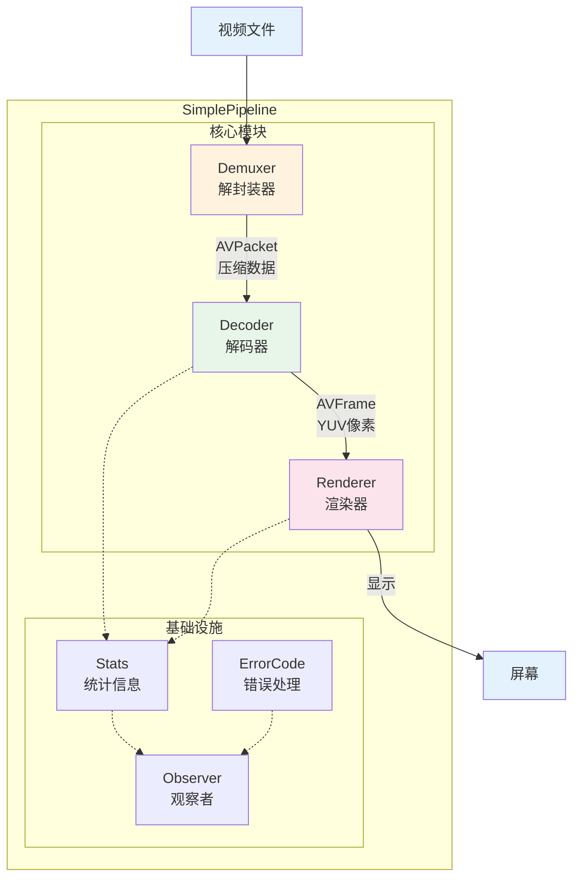
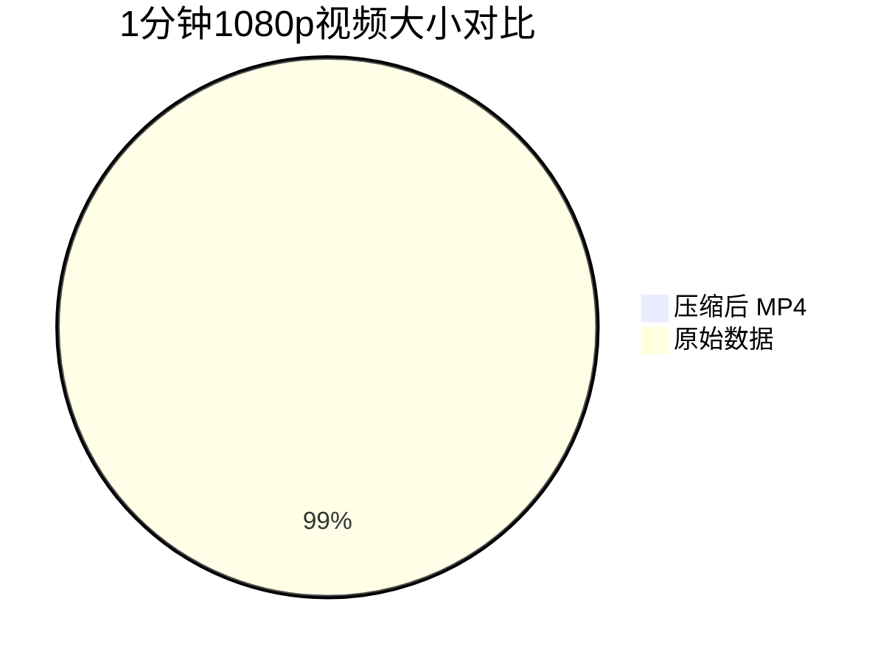
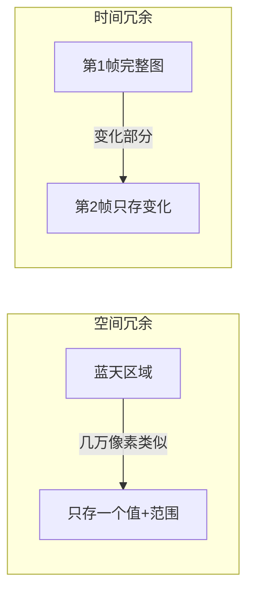
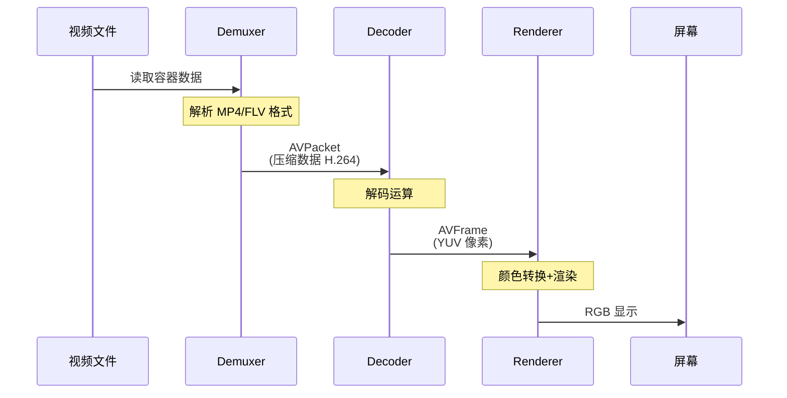
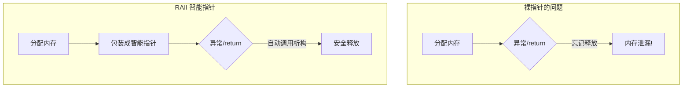
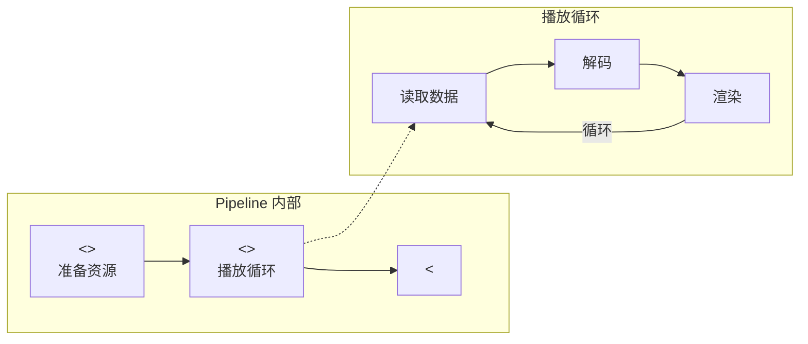
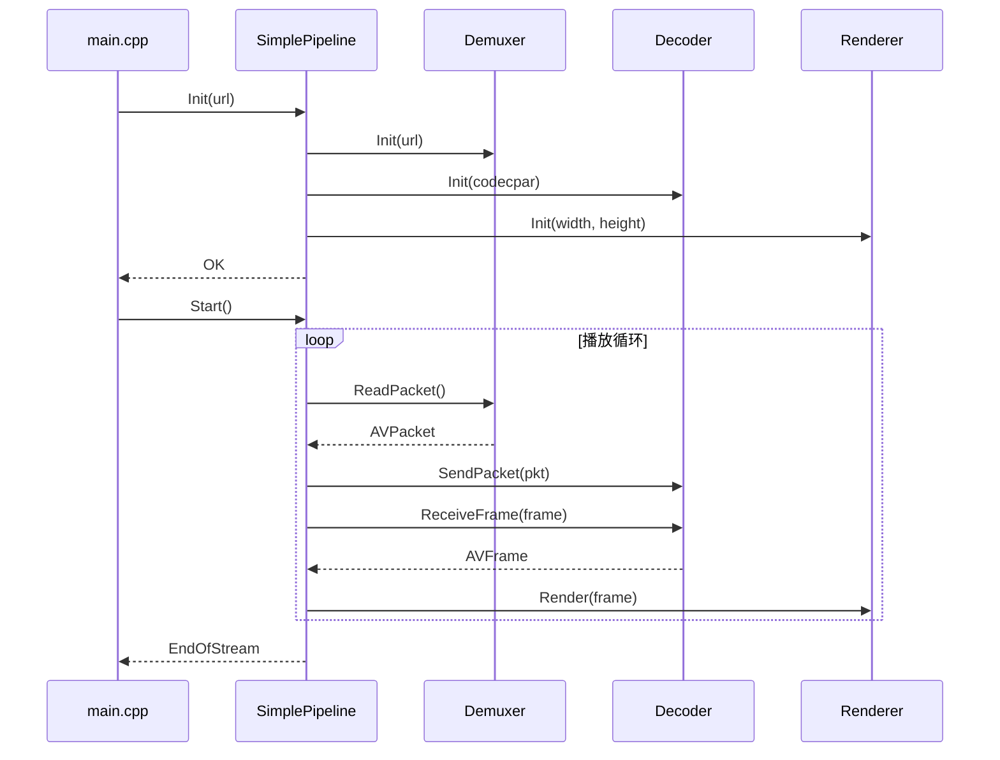
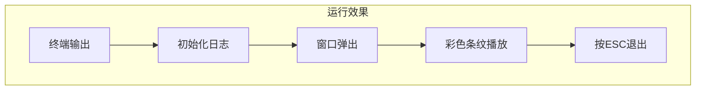

# 第一章：Pipeline 架构与本地播放

**目标**：理解音视频播放的核心 Pipeline，写出工业级代码。

**预计时间**：阅读 60 分钟，动手 30 分钟。

---

## 📋 目录

1. [为什么需要架构？](#1-为什么需要架构)
2. [Pipeline 设计思想](#2-pipeline-设计思想)
3. [关键技术概念](#3-关键技术概念)
4. [代码实现详解](#4-代码实现详解)
5. [构建与测试](#5-构建与测试)
6. [问题排查](#6-问题排查)
7. [架构演进预告](#7-架构演进预告)

---

## 1. 为什么需要架构？

### 1.1 从一个问题开始

假设老板让你写个播放器，你的第一版可能是这样：

```cpp
int main() {
    // 打开文件
    AVFormatContext* ctx = nullptr;
    avformat_open_input(&ctx, "video.mp4", nullptr, nullptr);
    
    // 读取 packet
    AVPacket packet;
    while (av_read_frame(ctx, &packet) >= 0) {
        // 解码...
        // 渲染...
    }
    return 0;
}
```

这能跑，但**不能维护**：
- 所有逻辑堆在 main 里
- 没有错误处理（打开失败怎么办？）
- 内存泄漏（packet 没释放）
- 无法测试（怎么验证解码正确？）

### 1.2 工业级代码的要求

真正的播放器代码需要：

| 要求 | 为什么重要 | 本章解决方案 |
|------|-----------|-------------|
| **不泄漏内存** | 播放器要跑几小时甚至几天 | RAII 智能指针 |
| **可测试** | 改代码后怎么保证没坏？ | 接口抽象 + 单元测试 |
| **可观测** | 线上出问题怎么排查？ | 统计接口 + 日志 |
| **可扩展** | 后面要加功能怎么办？ | Pipeline 架构 |

---

## 2. Pipeline 设计思想

### 2.1 什么是 Pipeline？

Pipeline（流水线）是音视频领域的核心概念：

> **数据像水一样流动，每个阶段处理完传给下一个阶段。**


**比喻**：
- 视频文件 = 原料
- Demuxer = 拆解工（把盒子拆开）
- Decoder = 加工工（把压缩数据还原）
- Renderer = 装配工（显示到屏幕）

### 2.2 为什么要抽象 Pipeline 接口？

想象你要换一辆车：
- 没有接口：你要重新学开车（方向盘位置变了、档位变了）
- 有接口：只要会开车，换什么车都能开

**代码中的体现**：

```cpp
// 定义接口（本章实现 SimplePipeline，后续换实现但不换接口）
class Pipeline {
public:
    virtual ErrorCode Init(const std::string& url) = 0;
    virtual ErrorCode Start() = 0;
    virtual ErrorCode Stop() = 0;
};

// 使用接口（用户代码不需要知道具体实现）
std::unique_ptr<Pipeline> player = std::make_unique<SimplePipeline>();
player->Init("video.mp4");
player->Start();
```

**好处**：
- 第2章换成网络流，用户代码不用改
- 可以 Mock 接口做测试
- 团队分工：有人写 Demuxer，有人写 Decoder，通过接口对接

### 2.3 我们的 Pipeline 架构



---

## 3. 关键技术概念

### 3.1 视频压缩原理

**为什么不压缩的视频那么大？**



**计算过程**：

| 参数 | 数值 | 说明 |
|-----|------|------|
| 分辨率 | 1920 × 1080 | 全高清 1080p |
| 每像素 | 3 字节 | RGB 三色 |
| 每帧大小 | 1920 × 1080 × 3 = **6.2 MB** | 一张图片 |
| 帧率 | 30 fps | 每秒 30 张 |
| 每秒大小 | 6.2 MB × 30 = **186 MB** | 每秒视频 |
| 1分钟大小 | 186 MB × 60 = **10.8 GB** | 原始数据 |
| 压缩后 | **~100 MB** | MP4 文件 |
| **压缩率** | **100 倍** | 节省 99% 空间 |

**压缩原理**：



### 3.2 视频播放的数据流



**三个阶段详解**：

| 阶段 | 输入 | 输出 | 核心操作 |
|-----|------|------|---------|
| **解封装** | MP4 文件 | H.264 数据包 | 从容器提取视频流 |
| **解码** | H.264 压缩数据 | YUV 像素帧 | 解压缩还原图像 |
| **渲染** | YUV 像素 | 屏幕显示 | 颜色转换+绘制 |

### 3.3 YUV 像素格式

**为什么用 YUV 而不是 RGB？**

```mermaid
flowchart TB
    subgraph "RGB 格式"
        R1[像素1: R G B] --- R2[像素2: R G B]
        R2 --- R3[像素3: R G B]
        note right of R1
            每个像素 3 字节
            无压缩空间
        end note
    end
    
    subgraph "YUV420P 格式"
        Y[Y 平面: 1920×1080<br/>每个像素1字节] --- UV[U/V 平面: 960×540<br/>每4个像素共享1个UV]
        note right of Y
            Y: 亮度（完整）
            UV: 色度（1/4）
            省 50% 空间
        end note
    end
```

**内存布局对比（1920×1080）**：

| 平面 | 分辨率 | 大小 | 说明 |
|-----|--------|------|------|
| Y | 1920 × 1080 | 2,073,600 字节 | 亮度，每个像素1字节 |
| U | 960 × 540 | 518,400 字节 | 色度，横向纵向都减半 |
| V | 960 × 540 | 518,400 字节 | 色度，横向纵向都减半 |
| **总计** | - | **3,110,400 字节** | 比 RGB 省 50% |

### 3.4 RAII 内存管理

**为什么不用裸指针？**



**代码对比**：

```cpp
// ❌ 裸指针：容易泄漏
void Bad() {
    AVPacket* pkt = av_packet_alloc();
    if (error) return;  // 泄漏！pkt 没释放
    av_packet_free(&pkt);
}

// ✅ 智能指针：自动释放
void Good() {
    PacketPtr pkt = MakePacket();  // RAII 包装
    if (error) return;  // 安全！自动释放
}  // 这里也自动释放
```

---

## 4. 代码实现详解

### 4.1 项目结构

```mermaid
tree
    root["chapter-01/"]
    ├── CMakeLists.txt
    ├── README.md
    └── src["src/"]
        ├── base["base/ - 基础组件"]
        │   ├── pipeline.h["Pipeline 接口"]
        │   └── ffmpeg_utils.h["FFmpeg RAII 封装"]
        ├── core["core/ - 核心实现"]
        │   ├── simple_pipeline.h/cpp["主 Pipeline"]
        │   ├── demuxer.h/cpp["解封装模块"]
        │   ├── decoder.h/cpp["解码模块"]
        │   └── renderer.h/cpp["渲染模块"]
        └── main.cpp["示例程序"]
```

### 4.2 接口层设计

**Pipeline 接口定义**（`base/pipeline.h`）：

```cpp
class Pipeline {
public:
    virtual ~Pipeline() = default;
    
    // 生命周期
    virtual ErrorCode Init(const std::string& url) = 0;
    virtual ErrorCode Start() = 0;
    virtual ErrorCode Stop() = 0;
    
    // 可观测性
    virtual PipelineStats GetStats() const = 0;
    virtual void SetObserver(PipelineObserver* observer) = 0;
};
```

**数据流向**：



### 4.3 核心模块协作



---

## 5. 构建与测试

### 5.1 构建步骤

```bash
mkdir build && cd build
cmake ..
make -j4
```

### 5.2 运行

```bash
# 生成测试视频
ffmpeg -f lavfi -i testsrc=duration=10:size=640x480:rate=30 \
       -pix_fmt yuv420p sample.mp4

# 运行
./live-player sample.mp4
```

**预期效果**：



---

## 6. 问题排查

| 问题 | 现象 | 解决 |
|-----|------|------|
| CMake 找不到 FFmpeg | `Could not find FFmpeg` | 检查 `pkg-config --exists libavformat` |
| 运行时崩溃 | `Segmentation fault` | 检查视频文件是否有效 `ffprobe sample.mp4` |
| 窗口黑屏 | 有窗口无画面 | 检查像素格式是否为 YUV420P |

---

## 7. 架构演进预告

本章是**同步单线程**实现，下一章将演进为**异步多线程**：

```mermaid
flowchart TB
    subgraph "第1章：同步 Pipeline"
        A[Demuxer] --> B[Decoder] --> C[Renderer]
        note right of B
            单线程顺序执行
            解码慢会卡住渲染
        end note
    end
    
    subgraph "第2章：异步 Pipeline（预告）"
        D[Demuxer] -->|队列| E[Decoder线程]
        E -->|队列| F[Renderer线程]
        note right of E
            多线程并行
            解码渲染不互相阻塞
        end note
    end
```

**第2章目标**：解决播放 4K 视频时的卡顿问题。

---

## 附录：Draw.io 图表源文件

如需更精美的图表，可使用以下 Draw.io 源文件：

- `docs/diagrams/pipeline-arch.drawio` - Pipeline 架构图
- `docs/diagrams/data-flow.drawio` - 数据流图
- `docs/diagrams/memory-layout.drawio` - 内存布局图

（源文件将在后续版本提供）
