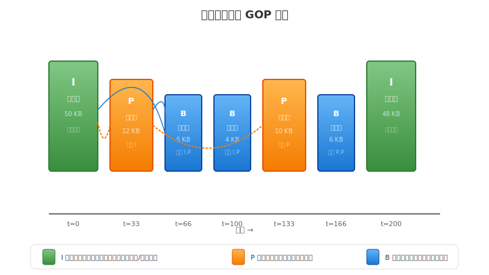
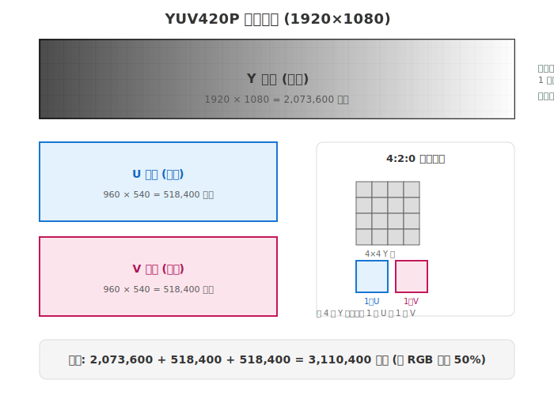
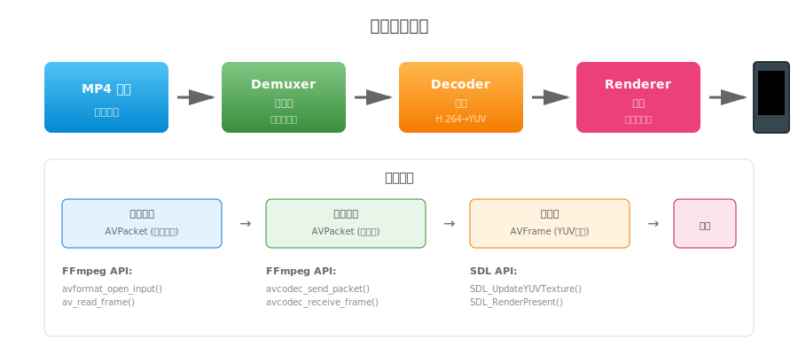

# 第一章：Pipeline 架构与本地播放

> **本章目标**：理解视频播放的完整链路——从文件中的压缩数据，到屏幕上的清晰画面。

在开始编写代码之前，我们需要先理解几个根本问题：**为什么视频能压缩？压缩后的数据是什么样的？如何把这些数据还原成图像？** 本章将带你从零开始，一步步搭建一个完整的视频播放器。

**阅读指南**：
- 第 1-2 节：先跑起来，建立直观感受
- 第 3-5 节：深入原理，理解视频压缩和 FFmpeg 架构
- 第 6-7 节：代码实践，掌握播放器开发
- 第 8-9 节：调试优化，提升工程能力

---

## 目录

1. [快速开始：先跑起来](#1-快速开始先跑起来)
2. [视频压缩原理：为什么 1 分钟视频只有 100MB](#2-视频压缩原理为什么-1-分钟视频只有-100mb)
3. [颜色空间：YUV 与 RGB 的区别](#3-颜色空间yuv-与-rgb-的区别)
4. [FFmpeg 架构：核心数据结构详解](#4-ffmpeg-架构核心数据结构详解)
5. [SDL2 渲染：从像素到屏幕](#5-sdl2-渲染从像素到屏幕)
6. [代码详解：实现一个完整的播放器](#6-代码详解实现一个完整的播放器)
7. [Pipeline 架构：工程化设计](#7-pipeline-架构工程化设计)
8. [性能优化：让播放更流畅](#8-性能优化让播放更流畅)
9. [调试技巧：排查问题](#9-调试技巧排查问题)
10. [常见问题](#10-常见问题)
11. [本章总结与下一步](#11-本章总结与下一步)

---

## 1. 快速开始：先跑起来

**本节概览**：在深入原理之前，让我们先安装环境，运行一个最简单的播放器，建立直观感受。这 100 行代码将是本章的基础，后续所有内容都是围绕它展开。

### 1.1 安装依赖

FFmpeg 和 SDL2 是开发视频应用的两大基石：
- **FFmpeg**：负责音视频的所有底层处理（解封装、解码、滤镜等）
- **SDL2**：负责跨平台的窗口创建和图像渲染

**macOS**（使用 Homebrew）：
```bash
brew install ffmpeg sdl2 cmake
```

**Ubuntu/Debian**：
```bash
sudo apt-get update
sudo apt-get install -y ffmpeg \
    libavformat-dev libavcodec-dev libavutil-dev libswscale-dev \
    libsdl2-dev cmake pkg-config
```

**为什么用 pkg-config？**

FFmpeg 有很多库文件和头文件路径，手动指定很繁琐。pkg-config 可以自动返回正确的编译参数：
```bash
pkg-config --cflags --libs libavformat libavcodec libavutil sdl2
# 输出：-I/usr/include ... -lavformat -lavcodec -lavutil -lSDL2
```

### 1.2 100 行播放器

这是本章的核心代码，后续的架构设计、性能优化都是围绕它展开：

```cpp
#include <SDL2/SDL.h>
#include <stdio.h>
#include <stdint.h>

extern "C" {
#include <libavformat/avformat.h>
#include <libavcodec/avcodec.h>
#include <libavutil/time.h>
}

int main(int argc, char* argv[]) {
    if (argc < 2) {
        fprintf(stderr, "用法: %s <视频文件>\n", argv[0]);
        return 1;
    }

    // ========== 1. 打开输入文件 ==========
    AVFormatContext* fmt_ctx = nullptr;
    int ret = avformat_open_input(&fmt_ctx, argv[1], nullptr, nullptr);
    if (ret < 0) {
        char errbuf[256];
        av_strerror(ret, errbuf, sizeof(errbuf));
        fprintf(stderr, "无法打开文件: %s\n", errbuf);
        return 1;
    }
    
    ret = avformat_find_stream_info(fmt_ctx, nullptr);
    if (ret < 0) {
        fprintf(stderr, "无法获取流信息\n");
        avformat_close_input(&fmt_ctx);
        return 1;
    }

    // ========== 2. 查找视频流 ==========
    int video_stream_idx = av_find_best_stream(
        fmt_ctx, AVMEDIA_TYPE_VIDEO, -1, -1, nullptr, 0);
    if (video_stream_idx < 0) {
        fprintf(stderr, "未找到视频流\n");
        avformat_close_input(&fmt_ctx);
        return 1;
    }
    AVStream* video_stream = fmt_ctx->streams[video_stream_idx];

    printf("视频信息: %dx%d, 时长: %.2f 秒\n", 
           video_stream->codecpar->width,
           video_stream->codecpar->height,
           fmt_ctx->duration / (double)AV_TIME_BASE);

    // ========== 3. 初始化解码器 ==========
    const AVCodec* codec = avcodec_find_decoder(
        video_stream->codecpar->codec_id);
    AVCodecContext* codec_ctx = avcodec_alloc_context3(codec);
    avcodec_parameters_to_context(codec_ctx, video_stream->codecpar);
    avcodec_open2(codec_ctx, codec, nullptr);

    // ========== 4. 创建 SDL2 窗口 ==========
    SDL_Init(SDL_INIT_VIDEO);
    SDL_Window* window = SDL_CreateWindow("Player",
        SDL_WINDOWPOS_CENTERED, SDL_WINDOWPOS_CENTERED,
        codec_ctx->width, codec_ctx->height, SDL_WINDOW_SHOWN);
    SDL_Renderer* renderer = SDL_CreateRenderer(window, -1,
        SDL_RENDERER_ACCELERATED | SDL_RENDERER_PRESENTVSYNC);
    SDL_Texture* texture = SDL_CreateTexture(renderer,
        SDL_PIXELFORMAT_IYUV, SDL_TEXTUREACCESS_STREAMING,
        codec_ctx->width, codec_ctx->height);

    // ========== 5. 解码循环 ==========
    AVPacket* packet = av_packet_alloc();
    AVFrame* frame = av_frame_alloc();
    int64_t start_time = av_gettime();

    while (av_read_frame(fmt_ctx, packet) >= 0) {
        SDL_Event e;
        while (SDL_PollEvent(&e)) {
            if (e.type == SDL_QUIT) goto cleanup;
        }

        if (packet->stream_index == video_stream_idx) {
            avcodec_send_packet(codec_ctx, packet);
            while (avcodec_receive_frame(codec_ctx, frame) == 0) {
                // 同步
                int64_t pts_us = frame->pts * av_q2d(video_stream->time_base) * 1000000;
                int64_t elapsed = av_gettime() - start_time;
                if (pts_us > elapsed) av_usleep(pts_us - elapsed);

                // 渲染
                SDL_UpdateYUVTexture(texture, nullptr,
                    frame->data[0], frame->linesize[0],
                    frame->data[1], frame->linesize[1],
                    frame->data[2], frame->linesize[2]);
                SDL_RenderClear(renderer);
                SDL_RenderCopy(renderer, texture, nullptr, nullptr);
                SDL_RenderPresent(renderer);
            }
        }
        av_packet_unref(packet);
    }

cleanup:
    av_frame_free(&frame);
    av_packet_free(&packet);
    avcodec_free_context(&codec_ctx);
    avformat_close_input(&fmt_ctx);
    SDL_Quit();
    return 0;
}
```

### 1.3 编译运行

```bash
# 创建测试视频
ffmpeg -f lavfi -i testsrc=duration=5:size=640x480:rate=30 \
       -pix_fmt yuv420p test.mp4

# 编译
g++ -std=c++14 -O2 player.cpp -o player \
    $(pkg-config --cflags --libs libavformat libavcodec libavutil sdl2)

# 运行
./player test.mp4
```

**这 100 行代码做了什么？**

简单来说，它完成了视频播放的五个核心步骤：
1. **解封装**：从 MP4 文件中提取压缩的视频数据
2. **解码**：将 H.264 压缩数据还原成 YUV 图像
3. **同步**：根据时间戳控制播放速度
4. **渲染**：将 YUV 图像显示到屏幕上
5. **清理**：释放所有资源

**接下来的问题**：
- 为什么视频能压缩？（第 2 节）
- YUV 是什么？（第 3 节）
- FFmpeg 是怎么组织的？（第 4 节）
- 怎么显示到屏幕上？（第 5 节）

---

## 2. 视频压缩原理：为什么 1 分钟视频只有 100MB

**本节概览**：上一节我们成功播放了视频，但你是否想过——为什么 1 分钟的 1080p 视频只需要 100MB，而不压缩的话需要 10GB？这一节将揭示视频压缩的三个核心技巧，这些技巧也是理解 FFmpeg 解码流程的基础。

### 2.1 原始视频有多大

让我们先算一笔账。1080p 视频每帧有 1920×1080 = 2073600 个像素，如果每个像素用 3 字节（RGB）表示：

| 分辨率 | 每帧大小 | 1 秒 (30fps) | 1 分钟 | 1 小时 |
|:---|:---|:---|:---|:---|
| 1280×720 | 2.8 MB | 84 MB | **5.0 GB** | 300 GB |
| 1920×1080 | 6.2 MB | 186 MB | **11.2 GB** | 672 GB |
| 3840×2160 | 24.9 MB | 747 MB | **44.8 GB** | 2.7 TB |

**实际 1 分钟 1080p 视频约 100 MB**，压缩了 **100 倍以上**！

这是怎么做到的？视频数据中存在三种"冗余"，压缩就是去除这些冗余。

### 2.2 冗余一：空间冗余（帧内压缩）

**现象**：一张照片中，相邻的像素通常很相似。比如一片蓝天，像素值可能是 200, 201, 200, 199, 201... 变化不大。

**压缩思路**：不直接存储每个像素的值，而是存储"差值"。

```
原始数据：200, 201, 200, 199, 201, 202, 200, 199 （8 字节）
差分编码：200（基准）, +1, -1, -1, +2, +1, -2, -1

差值范围小（-2 到 +2），可以用更少的位存储
```

**核心算法：DCT 变换**

JPEG 和视频压缩都使用 DCT（离散余弦变换）。它的核心思想是：

```
把图像从"空间域"（像素值）转换到"频率域"（变化快慢）

- 低频 = 缓慢变化的区域（天空、墙面）→ 保留
- 高频 = 快速变化的区域（边缘、纹理）→ 适当丢弃
```

人眼对高频细节不敏感，因此可以丢弃部分高频信息，大幅减小数据量。

### 2.3 冗余二：时间冗余（帧间压缩）

**现象**：视频中连续帧之间变化很小。30fps 的视频，相邻帧只间隔 33 毫秒，画面通常只有微小变化。

**压缩思路**：不存储完整画面，只存储"变化的部分"。

```
第 1 帧：存储完整画面（关键帧）      50 KB
第 2 帧：只存储与第 1 帧的差异       10 KB
第 3 帧：只存储与第 2 帧的差异       8 KB
...
```

**帧类型设计**

为了高效利用时间冗余，视频编码定义了三种帧类型：



| 类型 | 名称 | 大小 | 说明 |
|:---|:---|:---|:---|
| **I 帧** | 关键帧 | 40-60 KB | 完整编码，可独立解码 |
| **P 帧** | 预测帧 | 8-15 KB | 参考前一帧，只存变化 |
| **B 帧** | 双向帧 | 3-8 KB | 参考前后两帧，压缩率最高 |

**GOP 结构**

两个 I 帧之间的帧序列称为 GOP（Group of Pictures）：

```
时间线：  0ms   33ms   66ms   100ms  133ms  166ms  200ms
帧类型：   I     P      B      B      P      B      I
大小：    50K   12K    5K     4K     10K    5K    48K
```

**为什么需要 I 帧？**

如果只是 P/B 帧链，快进时会遇到问题——你要从最近的 I 帧开始解码才能看到画面。因此 I 帧间隔通常为 1-2 秒，平衡压缩率和随机访问性能。

### 2.4 冗余三：视觉冗余（色度子采样）

**人眼特性**：视网膜上的感光细胞（感知明暗）比感色细胞多得多。我们对亮度变化敏感，但对颜色变化不太敏感。

**YUV 颜色空间**

视频使用 YUV 而不是 RGB：
- **Y（Luma）**：亮度，决定明暗
- **U（Cb）**：蓝色色度
- **V（Cr）**：红色色度

**4:2:0 采样**：每 4 个像素共享 1 个 U 和 1 个 V

```
RGB：每个像素 3 字节
YUV420：平均每个像素 1.5 字节（省 50%）
```

### 2.5 压缩效果实测

理论讲完了，让我们看看实际的压缩效果。以 1920×1080 30fps 的视频为例（1 秒 = 30 帧）：

| 帧序列 | 类型 | 大小 | 累计 | 压缩来源 |
|:---|:---|:---|:---|:---|
| 帧 0 | I 帧 | 50 KB | 50 KB | DCT + 量化 |
| 帧 1 | P 帧 | 12 KB | 62 KB | 运动估计（参考帧 0）|
| 帧 2 | B 帧 | 5 KB | 67 KB | 双向预测（参考帧 0,4）|
| 帧 3 | B 帧 | 4 KB | 71 KB | 双向预测（参考帧 0,4）|
| 帧 4 | P 帧 | 10 KB | 81 KB | 运动估计（参考帧 1）|
| 帧 5 | B 帧 | 6 KB | 87 KB | 双向预测 |
| ... | ... | ... | ... | ... |
| 帧 29 | P 帧 | 11 KB | ~320 KB | 运动估计 |

**数据对比**：

| 指标 | 原始数据 | 压缩后 | 压缩率 |
|:---|:---|:---|:---|
| 单帧大小 | 6.2 MB | 10.7 KB（平均）| 99.8% |
| 1 秒数据（30fps）| 186 MB | ~320 KB | 99.8% |
| 1 分钟数据 | 11.2 GB | ~19 MB | 99.8% |
| 1 小时数据 | 672 GB | ~1.1 GB | 99.8% |

**各种压缩技术的贡献**：

```
原始数据：6.2 MB/帧
├── 空间冗余压缩（DCT+量化）：→ 约 300 KB（压缩 95%）
├── 时间冗余压缩（帧间预测）：→ 平均 10-50 KB（再压缩 80%）
└── 视觉冗余压缩（YUV420）：→ 平均 1.5 字节/像素（再压缩 50%）

最终：约 10 KB/帧，压缩率 99.8%
```

**实际观察**：
你可以用以下命令查看真实视频的帧类型分布：

```bash
# 查看每帧的类型和大小
ffprobe -v error -select_streams v:0 -show_frames \
    -show_entries frame=pkt_size,pict_type \
    -of csv test.mp4 | head -20

# 输出示例：
# frame,50000,I
# frame,12000,P
# frame,5000,B
# ...
```

**本节小结**：视频压缩利用三种冗余——空间冗余（DCT）、时间冗余（帧间预测）、视觉冗余（YUV 子采样）。实测显示压缩率可达 99.8%，让 11GB/分钟的原始数据减少到 19MB。这些概念将在下一节"颜色空间"和第四节"FFmpeg 架构"中继续展开。

---

## 3. 颜色空间：YUV 与 RGB 的区别

**本节概览**：上一节提到视频使用 YUV 格式，这一节将详细解释 YUV 的内存布局，以及 FFmpeg 中如何处理像素数据。这是理解解码后图像数据的关键。

### 3.1 为什么视频用 YUV

| 特性 | RGB | YUV |
|:---|:---|:---|
| 存储 | 3 字节/像素 | 1.5 字节/像素（YUV420）|
| 黑白兼容 | 需特殊处理 | Y 通道直接可用 |
| 压缩友好 | 不友好 | 可降采样 U/V |
| 用途 | 图像处理、游戏 | 视频编解码 |

### 3.2 YUV420 内存布局



以 1920×1080 为例：

| 平面 | 分辨率 | 大小 | 占比 |
|:---|:---|:---|:---|
| Y | 1920 × 1080 | 2,073,600 B | 66.7% |
| U | 960 × 540 | 518,400 B | 16.7% |
| V | 960 × 540 | 518,400 B | 16.7% |
| **总计** | - | **3,110,400 B** | - |

对比 RGB：1920 × 1080 × 3 = **6,220,800 B**

**YUV420 比 RGB 节省 50% 空间**。

### 3.3 FFmpeg 中的像素访问

解码后的图像存储在 `AVFrame` 结构中：

```cpp
AVFrame* frame = av_frame_alloc();
// ... 解码 ...

// 访问 YUV 数据
uint8_t* y_data = frame->data[0];  // Y 平面指针
uint8_t* u_data = frame->data[1];  // U 平面指针
uint8_t* v_data = frame->data[2];  // V 平面指针

int y_stride = frame->linesize[0];  // Y 行宽（含对齐填充）
int u_stride = frame->linesize[1];  // U 行宽
int v_stride = frame->linesize[2];  // V 行宽
```

⚠️ **重要**：`linesize` 可能大于 `width`，因为某些 CPU 要求内存对齐。

```cpp
// 错误：可能读到填充区域
uint8_t y = frame->data[0][y * frame->width + x];

// 正确：使用 linesize
uint8_t y = frame->data[0][y * frame->linesize[0] + x];
```

**本节小结**：YUV420 通过降低色度分辨率节省空间，解码后的数据通过 `AVFrame` 的 `data` 和 `linesize` 访问。下一节将介绍 FFmpeg 的核心数据结构。

---

## 4. FFmpeg 架构：核心数据结构详解

**本节概览**：前面我们了解了视频压缩的原理和像素格式，现在来看看 FFmpeg 如何用代码组织这些概念。FFmpeg 的核心是几个结构体，理解它们是掌握视频开发的关键。

### 4.1 FFmpeg 库结构

```
┌─────────────────────────────────────────────┐
│  libavformat - 封装/解封装（MP4、FLV 等）     │
├─────────────────────────────────────────────┤
│  libavcodec - 编解码（H.264、H.265 等）       │
├─────────────────────────────────────────────┤
│  libavutil - 工具函数（内存、数学、时间）     │
├─────────────────────────────────────────────┤
│  libswscale - 图像转换（YUV ↔ RGB）           │
└─────────────────────────────────────────────┘
```

### 4.2 四大核心结构体

FFmpeg 的设计哲学是"分层抽象"，每个结构体负责一个层次：

#### AVFormatContext - 文件层

代表一个打开的文件或流，管理所有流的元信息：

```cpp
typedef struct AVFormatContext {
    unsigned int nb_streams;      // 流数量（可能有视频+音频+字幕）
    AVStream** streams;           // 流数组
    int64_t duration;             // 总时长（微秒）
    int64_t bit_rate;             // 总码率
} AVFormatContext;
```

#### AVStream - 流层

代表文件中的一个流（视频流、音频流等）：

```cpp
typedef struct AVStream {
    AVCodecParameters* codecpar;  // 编解码器参数（分辨率、码率等）
    AVRational time_base;         // 时间基（PTS 的单位）
    int64_t duration;             // 流时长
} AVStream;
```

**时间基**是理解时间戳的关键：

```cpp
AVRational tb = stream->time_base;  // 如 {1, 1000} = 毫秒
int64_t pts = 33000;                // 33 秒

// 转换为秒
double seconds = pts * av_q2d(tb);  // 33.0
```

#### AVCodecContext - 编解码层

编解码器的状态和配置：

```cpp
typedef struct AVCodecContext {
    int width, height;            // 分辨率
    AVPixelFormat pix_fmt;        // 像素格式（YUV420P 等）
    int thread_count;             // 解码线程数
} AVCodecContext;
```

#### AVPacket / AVFrame - 数据层

- **AVPacket**：压缩后的数据（从文件读取）
- **AVFrame**：解码后的原始图像

```cpp
typedef struct AVPacket {
    int64_t pts;                  // 显示时间戳
    int64_t dts;                  // 解码时间戳
    uint8_t* data;                // 压缩数据
    int size;                     // 数据大小
} AVPacket;

typedef struct AVFrame {
    uint8_t* data[8];             // 像素数据指针（Y/U/V）
    int linesize[8];              // 行宽
    int64_t pts;                  // 显示时间戳
} AVFrame;
```

**数据流总结**：

```
文件 → AVFormatContext → AVStream → AVPacket → AVCodecContext → AVFrame
       (文件层)          (流层)     (压缩数据)   (编解码层)     (原始图像)
```

### 4.3 错误处理最佳实践

FFmpeg 的函数大多返回整数表示状态，负数表示错误。正确处理错误是写出健壮代码的关键。

**错误码处理模式**：

```cpp
// 1. 基本错误检查
int ret = avcodec_send_packet(ctx, pkt);
if (ret < 0) {
    char errbuf[AV_ERROR_MAX_STRING_SIZE];
    av_strerror(ret, errbuf, sizeof(errbuf));
    fprintf(stderr, "错误: %s\n", errbuf);
    return -1;
}

// 2. 宏简化（推荐）
#define CHECK_ERROR(ret, msg) \
    do { if ((ret) < 0) { \
        char errbuf[256]; av_strerror((ret), errbuf, sizeof(errbuf)); \
        fprintf(stderr, "%s: %s\n", msg, errbuf); \
        return -1; \
    } } while(0)

// 使用
CHECK_ERROR(avcodec_send_packet(ctx, pkt), "发送 packet 失败");
```

**常见错误码对照表**：

| 错误码 | 宏定义 | 含义 | 常见原因 | 处理方式 |
|:---|:---|:---|:---|:---|
| `-11` | `AVERROR(EAGAIN)` | 资源暂不可用 | 缓冲区满，需先接收帧 | 先 `avcodec_receive_frame` |
| `-12` | `AVERROR(ENOMEM)` | 内存不足 | 分配失败 | 释放资源重试或退出 |
| `-1094995529` | `AVERROR_INVALIDDATA` | 数据无效 | 文件损坏或格式错误 | 跳过或终止 |
| `-1414092869` | `AVERROR_EOF` | 文件结束 | 正常结束 | 退出解码循环 |
| `-2` | `AVERROR(ENOENT)` | 文件不存在 | 路径错误 | 检查路径 |
| `-13` | `AVERROR(EACCES)` | 权限不足 | 无读取权限 | 检查权限 |

**特殊错误处理：EAGAIN**

`EAGAIN` 不是真正的错误，表示需要更多数据或需要先取出数据：

```cpp
// 发送 packet
ret = avcodec_send_packet(ctx, pkt);
if (ret == AVERROR(EAGAIN)) {
    // 解码器缓冲区满，需要先接收帧
    while (avcodec_receive_frame(ctx, frame) == 0) {
        // 处理帧
    }
    // 再次尝试发送
    ret = avcodec_send_packet(ctx, pkt);
}

// 刷新解码器（文件结尾时）
avcodec_send_packet(ctx, nullptr);  // 发送空 packet
while (avcodec_receive_frame(ctx, frame) == 0) {
    // 取出所有缓冲的帧
}
```

**资源清理的 RAII 模式**：

C++ 中推荐使用 RAII 管理 FFmpeg 资源，避免泄漏：

```cpp
struct AVPacketDeleter {
    void operator()(AVPacket* p) const {
        if (p) av_packet_free(&p);
    }
};
using PacketPtr = std::unique_ptr<AVPacket, AVPacketDeleter>;

// 使用
PacketPtr pkt(av_packet_alloc());
// ... 使用 pkt ...
// 自动释放，即使发生异常
```

**本节小结**：FFmpeg 通过分层结构体管理视频数据，错误处理使用返回值检查，`av_strerror` 可转换错误码为可读信息。理解这些结构体的关系是后续开发的基础。下一节将介绍如何把 `AVFrame` 显示到屏幕上。

---

## 5. SDL2 渲染：从像素到屏幕

**本节概览**：上一节我们得到了解码后的 YUV 数据（`AVFrame`），但这一堆数字如何变成屏幕上的画面？这一节介绍 SDL2 的渲染机制。

### 5.1 SDL2 三层架构

SDL2 提供三层抽象，将像素数据呈现到屏幕上：

```
┌─────────────────────────────────────────────┐
│  SDL_Window  ──→  窗口（标题栏、边框）       │
│       ↓                                     │
│  SDL_Renderer ──→ 渲染器（GPU/CPU 加速）    │
│       ↓                                     │
│  SDL_Texture ──→ 纹理（显存中的图像）       │
│       ↓                                     │
│  显示器                                      │
└─────────────────────────────────────────────┘
```

### 5.2 关键概念

| 概念 | 说明 | 本章使用 |
|:---|:---|:---|
| **渲染器** | GPU 或 CPU 负责绘制 | `SDL_RENDERER_ACCELERATED` |
| **纹理** | 显存中的图像数据 | `SDL_TEXTUREACCESS_STREAMING` |
| **VSync** | 垂直同步，防止画面撕裂 | `SDL_RENDERER_PRESENTVSYNC` |

### 5.3 YUV 纹理上传

SDL2 支持直接上传 YUV 数据，无需转换为 RGB：

```cpp
// 创建 YUV 纹理
SDL_Texture* texture = SDL_CreateTexture(
    renderer,
    SDL_PIXELFORMAT_IYUV,           // YUV420 格式
    SDL_TEXTUREACCESS_STREAMING,    // 频繁更新
    width, height);

// 更新纹理（每帧调用）
SDL_UpdateYUVTexture(
    texture, nullptr,
    frame->data[0], frame->linesize[0],  // Y
    frame->data[1], frame->linesize[1],  // U
    frame->data[2], frame->linesize[2]); // V
```

**渲染循环**：

```cpp
SDL_RenderClear(renderer);           // 1. 清空
SDL_RenderCopy(renderer, tex, ...);  // 2. 复制纹理
SDL_RenderPresent(renderer);         // 3. 显示（带 VSync）
```

**本节小结**：SDL2 通过 Window → Renderer → Texture 三层架构将 YUV 数据呈现到屏幕。`SDL_UpdateYUVTexture` 可以直接上传 FFmpeg 解码后的数据，无需格式转换。下一节将整合所有内容，实现完整播放器。

---

## 6. 代码详解：实现一个完整的播放器

**本节概览**：前面四节分别介绍了压缩原理、像素格式、FFmpeg 架构和 SDL2 渲染。这一节将它们整合起来，逐行分析第 1 节的 100 行代码。

### 6.1 代码流程图



### 6.2 分阶段详解

**阶段 1：打开文件（解封装）**

```cpp
AVFormatContext* fmt_ctx = nullptr;
avformat_open_input(&fmt_ctx, argv[1], nullptr, nullptr);
avformat_find_stream_info(fmt_ctx, nullptr);
```

- `avformat_open_input`：检测文件格式，初始化解封装器
- `avformat_find_stream_info`：读取文件头，获取流信息

**阶段 2：查找视频流**

```cpp
int idx = av_find_best_stream(fmt_ctx, AVMEDIA_TYPE_VIDEO, -1, -1, nullptr, 0);
AVStream* st = fmt_ctx->streams[idx];
```

文件可能有多个流（视频+音频+字幕），这行找到"最好的"视频流。

**阶段 3：初始化解码器**

```cpp
const AVCodec* codec = avcodec_find_decoder(st->codecpar->codec_id);
AVCodecContext* cc = avcodec_alloc_context3(codec);
avcodec_parameters_to_context(cc, st->codecpar);
avcodec_open2(cc, codec, nullptr);
```

| 函数 | 作用 |
|:---|:---|
| `avcodec_find_decoder` | 根据 codec_id 找到解码器 |
| `avcodec_alloc_context3` | 创建解码器上下文 |
| `avcodec_open2` | 打开解码器，初始化内部状态 |

**阶段 4：创建窗口**

```cpp
SDL_Init(SDL_INIT_VIDEO);
SDL_Window* win = SDL_CreateWindow(...);
SDL_Renderer* rend = SDL_CreateRenderer(..., SDL_RENDERER_ACCELERATED);
SDL_Texture* tex = SDL_CreateTexture(..., SDL_PIXELFORMAT_IYUV, ...);
```

**阶段 5：解码循环**

```cpp
while (av_read_frame(fmt_ctx, pkt) >= 0) {      // 读取压缩数据
    avcodec_send_packet(cc, pkt);               // 送入解码器
    while (avcodec_receive_frame(cc, frm) == 0) {  // 获取解码后的帧
        // 同步和渲染
    }
}
```

**阶段 6：清理资源**

```cpp
av_frame_free(&frm);
av_packet_free(&pkt);
avcodec_free_context(&cc);
avformat_close_input(&fmt_ctx);
SDL_Quit();
```

### 6.3 关键 API 详解

为了让代码更清晰，以下是主要 API 的详细参数说明：

#### avformat_open_input

```cpp
int avformat_open_input(
    AVFormatContext **ps,      // 输出：格式上下文指针的地址
    const char *url,           // 输入：文件路径或 URL
    AVInputFormat *fmt,        // 输入：指定格式（nullptr 表示自动检测）
    AVDictionary **options     // 输入：额外选项
);
```

**返回值**：0 表示成功，负数表示错误码。

**示例：设置超时和网络选项**：
```cpp
AVDictionary* opts = nullptr;
av_dict_set(&opts, "timeout", "5000000", 0);       // 5 秒超时（微秒）
av_dict_set(&opts, "rtsp_transport", "tcp", 0);    // RTSP 使用 TCP

ret = avformat_open_input(&ctx, "rtsp://...", nullptr, &opts);
av_dict_free(&opts);
CHECK_ERROR(ret, "打开文件失败");
```

#### avcodec_find_decoder / avcodec_find_decoder_by_name

```cpp
// 根据 codec_id 查找（推荐）
const AVCodec* codec = avcodec_find_decoder(codec_id);

// 根据名称查找（用于硬件解码）
const AVCodec* codec = avcodec_find_decoder_by_name("h264_videotoolbox");
// macOS: "h264_videotoolbox"
// Linux VAAPI: "h264_vaapi"
// NVIDIA: "h264_nvdec"
```

#### avcodec_send_packet / avcodec_receive_frame

这两个函数实现了**异步解码**模式：

```cpp
// 发送压缩数据到解码器
// packet 可以为 nullptr，表示刷新缓冲区（文件结尾时）
int avcodec_send_packet(AVCodecContext *avctx, const AVPacket *avpkt);

// 接收解码后的帧
// 返回值：
//   0：成功获取一帧
//   AVERROR(EAGAIN)：需要更多输入数据
//   AVERROR_EOF：解码器已刷新完毕
int avcodec_receive_frame(AVCodecContext *avctx, AVFrame *frame);
```

**典型使用模式**：
```cpp
// 1. 发送 packet
ret = avcodec_send_packet(ctx, pkt);
if (ret < 0 && ret != AVERROR(EAGAIN)) {
    // 真正的错误
    return -1;
}

// 2. 循环接收所有可用的帧（一个 packet 可能产生多个 frame）
while (ret >= 0) {
    ret = avcodec_receive_frame(ctx, frame);
    if (ret == AVERROR(EAGAIN) || ret == AVERROR_EOF) break;
    if (ret < 0) return -1;  // 错误
    
    // 处理 frame
    render(frame);
}

// 3. 文件结尾时刷新解码器
avcodec_send_packet(ctx, nullptr);  // 发送空 packet
while (avcodec_receive_frame(ctx, frame) == 0) {
    render(frame);
}
```

#### SDL_UpdateYUVTexture

```cpp
int SDL_UpdateYUVTexture(
    SDL_Texture *texture,      // 目标纹理
    const SDL_Rect *rect,      // 更新区域（nullptr 表示整个纹理）
    const Uint8 *Yplane,       // Y 平面数据指针
    int Ypitch,                // Y 行宽（linesize）
    const Uint8 *Uplane,       // U 平面数据指针
    int Upitch,                // U 行宽
    const Uint8 *Vplane,       // V 平面数据指针
    int Vpitch                 // V 行宽
);
```

**性能提示**：如果只需要更新部分区域（如局部刷新），可以指定 `rect` 参数，减少数据传输。

#### av_gettime 与同步

```cpp
// 获取当前时间（微秒）
int64_t av_gettime(void);

// 休眠（微秒）
void av_usleep(unsigned int usec);
```

**同步示例**：
```cpp
int64_t start_time = av_gettime();

// 解码循环中
int64_t pts_us = frame->pts * av_q2d(stream->time_base) * 1000000;
int64_t elapsed = av_gettime() - start_time;

if (pts_us > elapsed) {
    av_usleep(pts_us - elapsed);  // 等待到正确的时间
}
```

**本节小结**：100 行代码完成了从文件到屏幕的完整链路。理解每个 API 的参数和返回值，是写出健壮代码的基础。接下来两节将介绍如何工程化这个代码，以及如何调试优化。

---

## 7. Pipeline 架构：工程化设计

**本节概览**：第 6 节的代码虽然能工作，但把所有逻辑写在 `main` 函数里难以维护和扩展。这一节介绍如何将代码重构为模块化的 Pipeline 架构。

### 7.1 为什么需要架构

**问题代码**：
```cpp
int main() {
    // 300 行混乱代码
    // - 改了这里，那里出问题
    // - 不敢重构，只能继续堆
}
```

**Pipeline 架构**：
```
输入 → Demuxer → Decoder → Renderer → 输出
         ↑           ↑          ↑
      解封装      解码       渲染
```

### 7.2 接口设计

```cpp
// Demuxer 接口
class IDemuxer {
public:
    virtual ErrorCode Open(const std::string& url) = 0;
    virtual ErrorCode ReadPacket(AVPacket* packet) = 0;
    virtual AVStream* GetVideoStream() const = 0;
};

// Decoder 接口
class IDecoder {
public:
    virtual ErrorCode Init(const AVCodecParameters* params) = 0;
    virtual ErrorCode SendPacket(const AVPacket* packet) = 0;
    virtual ErrorCode ReceiveFrame(AVFrame* frame) = 0;
};

// Renderer 接口
class IRenderer {
public:
    virtual ErrorCode Init(int width, int height) = 0;
    virtual ErrorCode RenderFrame(const AVFrame* frame) = 0;
};
```

### 7.3 项目结构

```
chapter-01/
├── CMakeLists.txt
├── include/
│   └── live/
│       ├── interfaces/       # 接口定义
│       │   ├── idemuxer.h
│       │   ├── idecoder.h
│       │   ├── irenderer.h
│       │   └── ipipeline.h
│       └── impl/             # 实现头文件
│           ├── ffmpeg_demuxer.h
│           ├── ffmpeg_decoder.h
│           └── sdl_renderer.h
├── src/
│   ├── impl/                 # 具体实现
│   │   ├── ffmpeg_demuxer.cpp
│   │   ├── ffmpeg_decoder.cpp
│   │   └── sdl_renderer.cpp
│   └── main.cpp
└── tests/
```

### 7.4 完整 CMakeLists.txt

以下是一个完整的 CMake 配置，包含库目标、可执行目标、测试和安装规则：

```cmake
cmake_minimum_required(VERSION 3.14)
project(player VERSION 1.0.0 LANGUAGES CXX)

# C++ 标准
set(CMAKE_CXX_STANDARD 14)
set(CMAKE_CXX_STANDARD_REQUIRED ON)
set(CMAKE_EXPORT_COMPILE_COMMANDS ON)  # 生成 compile_commands.json

# 编译选项
if(CMAKE_BUILD_TYPE STREQUAL "Debug")
    add_compile_options(-g -O0 -Wall -Wextra)
else()
    add_compile_options(-O3 -DNDEBUG)
endif()

# 查找依赖
find_package(PkgConfig REQUIRED)
pkg_check_modules(FFMPEG REQUIRED
    libavformat>=58.0
    libavcodec>=58.0
    libavutil>=56.0
    libswscale>=5.0)
find_package(SDL2 REQUIRED)

# 库目标
add_library(player_lib STATIC
    src/impl/ffmpeg_demuxer.cpp
    src/impl/ffmpeg_decoder.cpp
    src/impl/sdl_renderer.cpp)

target_include_directories(player_lib PUBLIC
    ${CMAKE_CURRENT_SOURCE_DIR}/include
    ${FFMPEG_INCLUDE_DIRS}
    ${SDL2_INCLUDE_DIRS})

target_link_libraries(player_lib PUBLIC
    ${FFMPEG_LIBRARIES}
    SDL2::SDL2)

# 可执行文件
add_executable(player src/main.cpp)
target_link_libraries(player PRIVATE player_lib)

# 测试
enable_testing()
if(BUILD_TESTING)
    add_subdirectory(tests)
endif()

# 安装
install(TARGETS player DESTINATION bin)
install(DIRECTORY include/ DESTINATION include)
```

**使用示例**：

```bash
# 创建构建目录
mkdir build && cd build

# 配置（Debug 模式）
cmake .. -DCMAKE_BUILD_TYPE=Debug

# 编译
make -j$(nproc)

# 运行
./player ../test.mp4

# 安装（可选）
sudo make install
```

**本节小结**：Pipeline 架构将播放器分解为独立的模块，配合 CMake 可以方便地管理依赖、编译和测试。下一节将介绍如何优化性能。

---

## 8. 性能优化：让播放更流畅

**本节概览**：代码能工作后，下一步是优化性能。这一节介绍如何分析性能瓶颈，以及常见的优化策略。

### 8.1 性能指标

| 指标 | 目标值 | 测量方法 |
|:---|:---|:---|
| 解码帧率 | ≥ 30fps | 统计解码时间 |
| CPU 占用 | < 50% | top/htop |
| 内存占用 | < 200MB | RSS |

### 8.2 火焰图分析

```bash
# 记录性能
perf record -g ./player test.mp4

# 生成火焰图
perf script | ./stackcollapse-perf.pl | ./flamegraph.pl > flamegraph.svg
```

### 8.3 优化策略

**多线程解码**：
```cpp
codec_ctx->thread_count = 4;
codec_ctx->thread_type = FF_THREAD_FRAME;
```

**硬件解码**（macOS 示例）：
```cpp
const AVCodec* codec = avcodec_find_decoder_by_name("h264_videotoolbox");
```

**本节小结**：性能优化的关键是测量先行，找到真正的瓶颈再优化。下一节将介绍调试技巧。

---

## 9. 调试技巧：排查问题

**本节概览**：开发过程中难免遇到问题，这一节介绍常用的调试工具和方法。

### 9.1 GDB 调试

```bash
gdb ./player
run test.mp4
bt              # 查看调用栈
print variable  # 打印变量
```

### 9.2 Valgrind 内存检测

```bash
valgrind --leak-check=full ./player test.mp4
```

### 9.3 FFmpeg 专用调试技巧

**查看视频文件信息（ffprobe）**：

```bash
# 查看文件整体信息
ffprobe -v error -show_format -show_streams test.mp4

# 查看视频流的详细信息
ffprobe -v error -select_streams v:0 \
    -show_entries stream=codec_name,width,height,pix_fmt,r_frame_rate,bit_rate \
    -of default=noprint_wrappers=1 test.mp4

# 查看每帧的类型和大小
ffprobe -v error -select_streams v:0 -show_frames \
    -show_entries frame=pkt_size,pict_type,pts \
    -of csv test.mp4 | head -20
```

**提取单帧保存为图片**：

```bash
# 提取第 1 秒的画面
ffmpeg -i test.mp4 -ss 00:00:01 -vframes 1 frame.png

# 提取所有 I 帧
ffmpeg -i test.mp4 -vf "select=eq(pict_type\,I)" -vsync vfr i_frame_%03d.png
```

**FFmpeg 日志级别**：

```cpp
// 设置 FFmpeg 日志级别
av_log_set_level(AV_LOG_DEBUG);  // DEBUG, INFO, WARNING, ERROR

// 级别说明：
// AV_LOG_QUIET   - 不输出
// AV_LOG_ERROR   - 仅错误
// AV_LOG_WARNING - 警告和错误
// AV_LOG_INFO    - 普通信息（默认）
// AV_LOG_DEBUG   - 调试信息
// AV_LOG_TRACE   - 最详细
```

**自定义日志回调**：

```cpp
void my_log_callback(void* ptr, int level, const char* fmt, va_list vl) {
    if (level > AV_LOG_WARNING) return;  // 只显示警告及以上
    
    char line[1024];
    vsnprintf(line, sizeof(line), fmt, vl);
    fprintf(stderr, "[FFmpeg] %s", line);
}

// 注册回调
av_log_set_callback(my_log_callback);
```

**解码过程调试**：

```cpp
// 打印 packet 信息
printf("Packet: pts=%lld, dts=%lld, size=%d, flags=%d\n",
       packet->pts, packet->dts, packet->size, packet->flags);

// 判断是否为关键帧
if (packet->flags & AV_PKT_FLAG_KEY) {
    printf("关键帧\n");
}

// 打印 frame 信息
printf("Frame: pts=%lld, format=%s, %dx%d\n",
       frame->pts,
       av_get_pix_fmt_name((AVPixelFormat)frame->format),
       frame->width, frame->height);
```

### 9.4 常见问题速查

| 问题 | 原因 | 解决 |
|:---|:---|:---|
| 绿色画面 | YUV 格式错误 | 检查 `SDL_PIXELFORMAT_IYUV` |
| 播放太快 | 没有 PTS 同步 | 根据时间戳延迟 |
| 内存泄漏 | 未释放资源 | 使用 Valgrind 检测 |
| 解码失败 | 不支持的编解码器 | 检查 codec_id 或尝试硬件解码 |
| 花屏/马赛克 | 数据损坏或丢包 | 检查 packet 是否完整 |

---

## 10. 常见问题

### Q1: 编译报错 `undefined reference to`

```bash
# 检查 pkg-config
export PKG_CONFIG_PATH=/usr/local/lib/pkgconfig:$PKG_CONFIG_PATH
```

### Q2: 画面是绿色的

检查 YUV 格式是否匹配：
```cpp
printf("格式: %s\n", av_get_pix_fmt_name((AVPixelFormat)frame->format));
```

### Q3: 音画不同步

```cpp
int64_t audio_pts = ...;  // 获取音频时间
int64_t video_pts = frame->pts * av_q2d(stream->time_base) * 1000;
int64_t diff = video_pts - audio_pts;

if (diff > 40) av_usleep(diff * 1000);  // 视频超前，等待
```

---

## 11. 本章总结与下一步

### 11.1 本章回顾

我们从零开始，一步步搭建了一个完整的视频播放器：

1. **为什么能压缩**：利用空间冗余（DCT）、时间冗余（帧间预测）、视觉冗余（YUV）
2. **像素格式**：YUV420 比 RGB 省 50% 空间
3. **FFmpeg 架构**：AVFormatContext → AVStream → AVPacket → AVCodecContext → AVFrame
4. **SDL2 渲染**：Window → Renderer → Texture
5. **Pipeline 架构**：模块化设计，便于维护和扩展

### 11.2 本章的局限

当前实现是**同步单线程**，存在性能瓶颈：

```
播放 4K 视频时：
- 文件读取：5ms
- 解码：25ms
- 渲染：8ms
- 总时间（串行）：38ms → 26fps（卡顿！）
```

### 11.3 下一步：异步多线程架构

解决方案是**多线程并行**：

```
线程 A：读取文件 ──→ 队列 ──→ 线程 B：解码 ──→ 队列 ──→ 线程 C：渲染
         5ms                      25ms                      8ms

并行后瓶颈是解码 25ms → 40fps（流畅）
```

**第 2 章预告**：
- 生产者-消费者队列设计
- 线程安全的数据结构
- 帧队列管理（固定大小、超时丢帧）
- 多线程同步原语（mutex、condition_variable）

---

## 附录

### 术语表

| 术语 | 解释 |
|:---|:---|
| **FFmpeg** | 开源音视频处理库 |
| **Demuxer** | 解封装器 |
| **Decoder** | 解码器 |
| **YUV** | 亮度+色度像素格式 |
| **YUV420** | 4:2:0 采样 |
| **I/P/B 帧** | 关键帧/预测帧/双向帧 |
| **GOP** | 图像组 |
| **PTS/DTS** | 显示/解码时间戳 |
| **DCT** | 离散余弦变换 |

### 参考资源

- FFmpeg 文档：https://ffmpeg.org/documentation.html
- SDL2 文档：https://wiki.libsdl.org/

---

**本章代码仓库**：https://github.com/chapin666/live-system-book