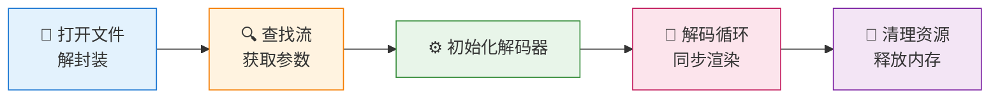

# 第二章：第一个播放器

> **本章目标**：编写并理解你的第一个视频播放器——将压缩的视频文件转化为屏幕上的动态画面。

上一章我们学习了视频播放的理论基础。本章将把这些知识转化为代码，实现一个**100行的完整播放器**。

虽然这个播放器很简单（单线程、同步执行），但麻雀虽小五脏俱全——它包含了视频播放的所有核心环节：解封装、解码、同步、渲染。

---

## 目录

1. [环境准备](#1-环境准备)
2. [100行播放器](#2-100行播放器)
3. [代码逐行解析](#3-代码逐行解析)
4. [编译与运行](#4-编译与运行)
5. [常见问题](#5-常见问题)
6. [本章总结与下一步](#6-本章总结与下一步)

---

## 1. 环境准备

### 1.1 安装依赖

FFmpeg 和 SDL2 是开发视频应用的两大基石：
- **FFmpeg**：负责音视频的所有底层处理（解封装、解码、滤镜等）
- **SDL2**：负责跨平台的窗口创建和图像渲染

**macOS**（使用 Homebrew）：
```bash
brew install ffmpeg sdl2 cmake
```

**Ubuntu/Debian**：
```bash
sudo apt-get update
sudo apt-get install -y ffmpeg \
    libavformat-dev libavcodec-dev libavutil-dev libswscale-dev \
    libsdl2-dev cmake pkg-config
```

**为什么用 pkg-config？**

FFmpeg 有很多库文件和头文件路径，手动指定很繁琐。pkg-config 可以自动返回正确的编译参数：
```bash
pkg-config --cflags --libs libavformat libavcodec libavutil sdl2
# 输出：-I/usr/include ... -lavformat -lavcodec -lavutil -lSDL2
```

### 1.2 创建测试视频

使用 FFmpeg 生成一个测试视频：
```bash
ffmpeg -f lavfi -i testsrc=duration=5:size=640x480:rate=30 \
       -pix_fmt yuv420p test.mp4
```

这个命令创建：
- 5 秒时长
- 640x480 分辨率
- 30fps 帧率
- YUV420p 像素格式（最通用的格式）

---

## 2. 100行播放器

这是本章的核心代码，后续的架构设计、性能优化都是围绕它展开：

```cpp
#include <SDL2/SDL.h>
#include <stdio.h>
#include <stdint.h>

extern "C" {
#include <libavformat/avformat.h>
#include <libavcodec/avcodec.h>
#include <libavutil/time.h>
}

int main(int argc, char* argv[]) {
    if (argc < 2) {
        fprintf(stderr, "用法: %s <视频文件>\n", argv[0]);
        return 1;
    }

    // ========== 1. 打开输入文件 ==========
    AVFormatContext* fmt_ctx = nullptr;
    int ret = avformat_open_input(&fmt_ctx, argv[1], nullptr, nullptr);
    if (ret < 0) {
        char errbuf[256];
        av_strerror(ret, errbuf, sizeof(errbuf));
        fprintf(stderr, "无法打开文件: %s\n", errbuf);
        return 1;
    }
    
    ret = avformat_find_stream_info(fmt_ctx, nullptr);
    if (ret < 0) {
        fprintf(stderr, "无法获取流信息\n");
        avformat_close_input(&fmt_ctx);
        return 1;
    }

    // ========== 2. 查找视频流 ==========
    int video_stream_idx = av_find_best_stream(
        fmt_ctx, AVMEDIA_TYPE_VIDEO, -1, -1, nullptr, 0);
    if (video_stream_idx < 0) {
        fprintf(stderr, "未找到视频流\n");
        avformat_close_input(&fmt_ctx);
        return 1;
    }
    AVStream* video_stream = fmt_ctx->streams[video_stream_idx];

    printf("视频信息: %dx%d, 时长: %.2f 秒\n", 
           video_stream->ccodecpar->width,
           video_stream->ccodecpar->height,
           fmt_ctx->duration / (double)AV_TIME_BASE);

    // ========== 3. 初始化解码器 ==========
    const AVCodec* codec = avcodec_find_decoder(
        video_stream->ccodecpar->codec_id);
    AVCodecContext* codec_ctx = avcodec_alloc_context3(codec);
    avcodec_parameters_to_context(codec_ctx, video_stream->ccodecpar);
    avcodec_open2(codec_ctx, codec, nullptr);

    // ========== 4. 创建 SDL2 窗口 ==========
    SDL_Init(SDL_INIT_VIDEO);
    SDL_Window* window = SDL_CreateWindow("Player",
        SDL_WINDOWPOS_CENTERED, SDL_WINDOWPOS_CENTERED,
        codec_ctx->width, codec_ctx->height, SDL_WINDOW_SHOWN);
    SDL_Renderer* renderer = SDL_CreateRenderer(window, -1,
        SDL_RENDERER_ACCELERATED | SDL_RENDERER_PRESENTVSYNC);
    SDL_Texture* texture = SDL_CreateTexture(renderer,
        SDL_PIXELFORMAT_IYUV, SDL_TEXTUREACCESS_STREAMING,
        codec_ctx->width, codec_ctx->height);

    // ========== 5. 解码循环 ==========
    AVPacket* packet = av_packet_alloc();
    AVFrame* frame = av_frame_alloc();
    int64_t start_time = av_gettime();

    while (av_read_frame(fmt_ctx, packet) >= 0) {
        SDL_Event e;
        while (SDL_PollEvent(&e)) {
            if (e.type == SDL_QUIT) goto cleanup;
        }

        if (packet->stream_index == video_stream_idx) {
            avcodec_send_packet(codec_ctx, packet);
            while (avcodec_receive_frame(codec_ctx, frame) == 0) {
                // 同步
                int64_t pts_us = frame->pts * av_q2d(video_stream->time_base) * 1000000;
                int64_t elapsed = av_gettime() - start_time;
                if (pts_us > elapsed) av_usleep(pts_us - elapsed);

                // 渲染
                SDL_UpdateYUVTexture(texture, nullptr,
                    frame->data[0], frame->linesize[0],
                    frame->data[1], frame->linesize[1],
                    frame->data[2], frame->linesize[2]);
                SDL_RenderClear(renderer);
                SDL_RenderCopy(renderer, texture, nullptr, nullptr);
                SDL_RenderPresent(renderer);
            }
        }
        av_packet_unref(packet);
    }

cleanup:
    av_frame_free(&frame);
    av_packet_free(&packet);
    avcodec_free_context(&codec_ctx);
    avformat_close_input(&fmt_ctx);
    SDL_Quit();
    return 0;
}
```

### 2.1 这100行代码做了什么？

简单来说，它完成了视频播放的五个核心步骤：




---

## 3. 代码逐行解析

### 3.1 阶段1：打开文件（解封装）

```cpp
AVFormatContext* fmt_ctx = nullptr;
avformat_open_input(&fmt_ctx, argv[1], nullptr, nullptr);
avformat_find_stream_info(fmt_ctx, nullptr);
```

- `avformat_open_input`：检测文件格式，初始化解封装器
- `avformat_find_stream_info`：读取文件头，获取流信息

### 3.2 阶段2：查找视频流

```cpp
int idx = av_find_best_stream(fmt_ctx, AVMEDIA_TYPE_VIDEO, -1, -1, nullptr, 0);
AVStream* st = fmt_ctx->streams[idx];
```

文件可能有多个流（视频+音频+字幕），这行找到"最好的"视频流。

### 3.3 阶段3：初始化解码器

```cpp
const AVCodec* codec = avcodec_find_decoder(st->ccodecpar->codec_id);
AVCodecContext* cc = avcodec_alloc_context3(codec);
avcodec_parameters_to_context(cc, st->ccodecpar);
avcodec_open2(cc, codec, nullptr);
```

| 函数 | 作用 |
|:---|:---|
| `avcodec_find_decoder` | 根据 codec_id 找到解码器 |
| `avcodec_alloc_context3` | 创建解码器上下文 |
| `avcodec_open2` | 打开解码器，初始化内部状态 |

### 3.4 阶段4：创建窗口

```cpp
SDL_Init(SDL_INIT_VIDEO);
SDL_Window* win = SDL_CreateWindow(...);
SDL_Renderer* rend = SDL_CreateRenderer(..., SDL_RENDERER_ACCELERATED);
SDL_Texture* tex = SDL_CreateTexture(..., SDL_PIXELFORMAT_IYUV, ...);
```

SDL2 的三层架构：
- **Window**：窗口（标题栏、边框）
- **Renderer**：渲染器（GPU/CPU 加速）
- **Texture**：纹理（显存中的图像）

### 3.5 阶段5：解码循环

```cpp
while (av_read_frame(fmt_ctx, pkt) >= 0) {      // 读取压缩数据
    avcodec_send_packet(cc, pkt);               // 送入解码器
    while (avcodec_receive_frame(cc, frm) == 0) {  // 获取解码后的帧
        // 同步和渲染
    }
}
```

**同步逻辑**：
```cpp
int64_t pts_us = frame->pts * av_q2d(video_stream->time_base) * 1000000;
int64_t elapsed = av_gettime() - start_time;
if (pts_us > elapsed) av_usleep(pts_us - elapsed);
```

根据 PTS（显示时间戳）计算应该何时显示这一帧，如果太早则睡眠等待。

### 3.6 阶段6：清理资源

```cpp
av_frame_free(&frm);
av_packet_free(&pkt);
avcodec_free_context(&cc);
avformat_close_input(&fmt_ctx);
SDL_Quit();
```

释放顺序与创建顺序相反。

---

## 4. 编译与运行

### 4.1 单文件编译

```bash
g++ -std=c++14 -O2 simple_player.cpp -o player \
    $(pkg-config --cflags --libs libavformat libavcodec libavutil sdl2)
```

### 4.2 使用 CMake

创建 `CMakeLists.txt`：

```cmake
cmake_minimum_required(VERSION 3.10)
project(SimplePlayer)

set(CMAKE_CXX_STANDARD 14)

find_package(PkgConfig REQUIRED)
pkg_check_modules(FFMPEG REQUIRED libavformat libavcodec libavutil)
pkg_check_modules(SDL2 REQUIRED sdl2)

add_executable(player simple_player.cpp)

target_include_directories(player PRIVATE ${FFMPEG_INCLUDE_DIRS} ${SDL2_INCLUDE_DIRS})
target_link_libraries(player ${FFMPEG_LIBRARIES} ${SDL2_LIBRARIES})
target_compile_options(player PRIVATE ${FFMPEG_CFLAGS_OTHER} ${SDL2_CFLAGS_OTHER})
```

编译：
```bash
mkdir build && cd build
cmake ..
make
./player ../test.mp4
```

### 4.3 运行效果

如果一切正常，你会看到：
1. 一个窗口弹出，显示测试视频画面
2. 控制台输出视频信息（分辨率、时长）
3. 视频播放 5 秒后自动结束
4. 点击窗口关闭按钮可提前退出

---

## 5. 常见问题

### Q1: 编译错误 "libavformat/avformat.h: No such file"

**原因**：FFmpeg 头文件路径未找到。

**解决**：
```bash
# macOS
export PKG_CONFIG_PATH="/opt/homebrew/lib/pkgconfig:$PKG_CONFIG_PATH"

# Linux
export PKG_CONFIG_PATH="/usr/local/lib/pkgconfig:$PKG_CONFIG_PATH"
```

### Q2: 运行时 "无法打开文件"

**原因**：视频文件路径错误或文件不存在。

**解决**：
```bash
# 检查文件是否存在
ls -la test.mp4

# 使用绝对路径
./player /absolute/path/to/test.mp4
```

### Q3: 画面显示为绿色或花屏

**原因**：像素格式不匹配。

**解决**：确保视频是 YUV420p 格式：
```bash
ffmpeg -i input.mp4 -pix_fmt yuv420p output.mp4
```

### Q4: 播放速度不对（太快/太慢）

**原因**：时间戳计算错误。

**检查点**：
- `time_base` 是否正确获取
- `av_gettime()` 返回的是微秒（us）
- 整数溢出问题（使用 int64_t）

### Q5: 内存泄漏

**原因**：资源未正确释放。

**检查点**：
- 每个 `alloc` 都要有对应的 `free`
- `av_packet_unref()` 每次循环都要调用
- 程序退出前调用 `SDL_Quit()`

---

## 6. 本章总结与下一步

### 本章回顾

我们实现了一个**100行的完整播放器**，学习了：

1. **解封装**：`avformat_open_input` 打开文件
2. **解码器**：`avcodec_find_decoder` + `avcodec_open2`
3. **解码循环**：`av_read_frame` → `avcodec_send_packet` → `avcodec_receive_frame`
4. **同步**：根据 PTS 控制播放速度
5. **渲染**：SDL2 的 Window → Renderer → Texture 架构

### 这个播放器的局限

虽然它能工作，但存在明显问题：

1. **单线程**：解封装、解码、渲染都在主线程，拖动窗口会卡顿
2. **无缓冲**：解码和渲染紧耦合，解码耗时直接影响帧率
3. **内存管理**：手动管理容易出错
4. **错误处理**：过于简单，生产环境不够健壮

### 下一步

下一章我们将学习 **Pipeline 架构与工程化**，解决上述问题：
- 面向接口设计（IDemuxer/IDecoder/IRenderer）
- RAII 自动内存管理
- 为后续多线程改造打下基础

---

**本章代码**：完整代码见 `src/simple_player.cpp`
