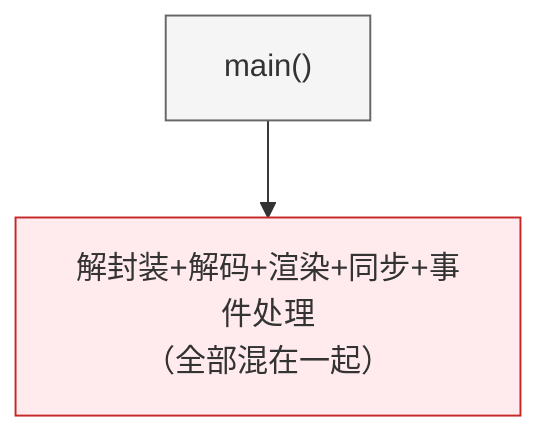
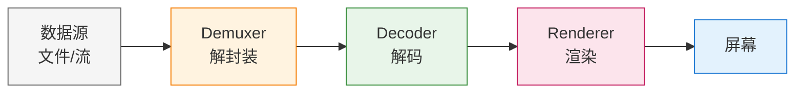

# 第三章：播放器工程化

> **本章目标**：将第2章的简单播放器改造为模块化的 Pipeline 架构，掌握工程化设计原则。

第2章的播放器虽然能工作，但所有代码挤在 main 函数里，难以维护和扩展。本章将学习如何：
- 用**接口**解耦各个模块
- 用**RAII**自动管理资源
- 用**Pipeline**组织数据流

---

## 目录

1. [为什么需要工程化](#1-为什么需要工程化)
2. [Pipeline 架构设计](#2-pipeline-架构设计)
3. [接口设计：解耦的核心](#3-接口设计解耦的核心)
4. [RAII：安全的资源管理](#4-raii安全的资源管理)
5. [完整实现](#5-完整实现)
6. [本章总结](#6-本章总结)

---

## 1. 为什么需要工程化

### 1.1 第2章播放器的问题

```cpp
// 第2章的代码结构
int main() {
    // 1. 打开文件
    // 2. 查找视频流
    // 3. 初始化解码器
    // 4. 创建 SDL 窗口
    // 5. 解码循环（解封装+解码+渲染混在一起）
    // 6. 清理资源
}
```

**问题**：
- 所有逻辑耦合在一起，修改一处可能影响全局
- 资源手动管理，容易内存泄漏
- 无法单元测试，只能整体测试
- 难以扩展（比如添加音频支持需要大幅改动）

### 1.2 工程化的目标

```
改造前：


改造后：


---

## 2. Pipeline 架构设计

### 2.1 数据流动模型

视频播放本质上是一个**数据流处理**过程：


每个阶段：
- **输入**：文件名或 URL
- **解封装**：从容器格式提取压缩数据（H.264/AAC）
- **解码**：将压缩数据还原为原始帧（YUV/PCM）
- **渲染**：将原始帧显示到屏幕

### 2.2 Pipeline 的优势

| 特性 | 说明 |
|:---|:---|
| **模块化** | 每个组件独立，可单独开发和测试 |
| **可替换** | 支持软件解码/硬件解码切换 |
| **可扩展** | 添加音频只需增加 AudioDecoder |
| **可复用** | Demuxer 可用于播放器也可用于转码器 |

---

## 3. 接口设计：解耦的核心

### 3.1 定义模块接口

```cpp
// include/live/idemuxer.h
#pragma once
#include <cstdint>
#include <vector>
#include <memory>

struct AVPacket;

namespace live {

// 流信息
struct StreamInfo {
    int index;
    int codec_id;
    int width, height;      // 视频
    int sample_rate;        // 音频
    int channels;
};

// 解封装器接口
class IDemuxer {
public:
    virtual ~IDemuxer() = default;
    
    // 打开输入
    virtual bool Open(const char* url) = 0;
    
    // 获取视频流信息
    virtual bool GetVideoStreamInfo(StreamInfo& info) = 0;
    
    // 读取一个 packet
    virtual bool ReadPacket(AVPacket* packet) = 0;
    
    // 关闭
    virtual void Close() = 0;
};

// 工厂函数
std::unique_ptr<IDemuxer> CreateFFmpegDemuxer();

} // namespace live
```

```cpp
// include/live/idecoder.h
#pragma once
#include <cstdint>

struct AVPacket;
struct AVFrame;

namespace live {

// 解码器接口
class IDecoder {
public:
    virtual ~IDecoder() = default;
    
    // 初始化解码器
    virtual bool Init(int codec_id, int width, int height) = 0;
    
    // 发送压缩数据
    virtual bool SendPacket(const AVPacket* packet) = 0;
    
    // 接收解码后的帧
    virtual bool ReceiveFrame(AVFrame* frame) = 0;
    
    // 刷新解码器（文件结束时）
    virtual void Flush() = 0;
    
    // 关闭
    virtual void Close() = 0;
};

std::unique_ptr<IDecoder> CreateFFmpegDecoder();

} // namespace live
```

```cpp
// include/live/irenderer.h
#pragma once
#include <cstdint>

struct AVFrame;

namespace live {

// 渲染器接口
class IRenderer {
public:
    virtual ~IRenderer() = default;
    
    // 初始化窗口
    virtual bool Init(int width, int height, const char* title) = 0;
    
    // 渲染一帧
    virtual bool RenderFrame(const AVFrame* frame) = 0;
    
    // 处理事件（返回 false 表示退出）
    virtual bool PollEvents() = 0;
    
    // 关闭
    virtual void Close() = 0;
};

std::unique_ptr<IRenderer> CreateSDLRenderer();

} // namespace live
```

### 3.2 接口的好处

```cpp
// 使用接口的代码不依赖具体实现
void PlayVideo(const char* url, 
               IDemuxer* demuxer,
               IDecoder* decoder, 
               IRenderer* renderer) {
    // 同样的代码，可以组合不同的实现
    // - FFmpegDemuxer + FFmpegDecoder + SDLRenderer
    // - FFmpegDemuxer + VideoToolboxDecoder + SDLRenderer
    // - MockDemuxer + MockDecoder + NullRenderer (用于测试)
}
```

---

## 4. RAII：安全的资源管理

### 4.1 手动管理的问题

```cpp
// 容易出错的写法
AVFrame* frame = av_frame_alloc();
// ... 某处提前 return，忘记释放 ...
av_frame_free(&frame);  // 可能执行不到
```

### 4.2 RAII 包装器

```cpp
// include/live/raii_utils.h
#pragma once
extern "C" {
#include <libavcodec/avcodec.h>
#include <libavformat/avformat.h>
}

namespace live {

// AVFrame 包装器
struct AVFrameDeleter {
    void operator()(AVFrame* p) { 
        if (p) av_frame_free(&p); 
    }
};
using FramePtr = std::unique_ptr<AVFrame, AVFrameDeleter>;

// AVPacket 包装器
struct AVPacketDeleter {
    void operator()(AVPacket* p) { 
        if (p) av_packet_free(&p); 
    }
};
using PacketPtr = std::unique_ptr<AVPacket, AVPacketDeleter>;

// AVCodecContext 包装器
struct AVCodecContextDeleter {
    void operator()(AVCodecContext* p) { 
        if (p) avcodec_free_context(&p); 
    }
};
using CodecContextPtr = std::unique_ptr<AVCodecContext, AVCodecContextDeleter>;

// AVFormatContext 包装器
struct AVFormatContextDeleter {
    void operator()(AVFormatContext* p) { 
        if (p) avformat_close_input(&p); 
    }
};
using FormatContextPtr = std::unique_ptr<AVFormatContext, AVFormatContextDeleter>;

} // namespace live
```

### 4.3 使用 RAII

```cpp
// 安全的写法
{
    FramePtr frame(av_frame_alloc());
    PacketPtr packet(av_packet_alloc());
    
    // ... 使用 frame 和 packet ...
    // 自动释放，即使发生异常
}
```

---

## 5. 完整实现

### 5.1 FFmpegDemuxer 实现

```cpp
// src/ffmpeg_demuxer.cpp
#include "live/idemuxer.h"
#include "live/raii_utils.h"
#include <iostream>

namespace live {

class FFmpegDemuxer : public IDemuxer {
public:
    FFmpegDemuxer() = default;
    ~FFmpegDemuxer() { Close(); }
    
    bool Open(const char* url) override {
        int ret = avformat_open_input(&fmt_ctx_, url, nullptr, nullptr);
        if (ret < 0) {
            std::cerr << "无法打开输入: " << url << std::endl;
            return false;
        }
        
        ret = avformat_find_stream_info(fmt_ctx_, nullptr);
        if (ret < 0) {
            std::cerr << "无法获取流信息" << std::endl;
            return false;
        }
        
        // 查找视频流
        video_stream_idx_ = av_find_best_stream(
            fmt_ctx_, AVMEDIA_TYPE_VIDEO, -1, -1, nullptr, 0);
        if (video_stream_idx_ < 0) {
            std::cerr << "未找到视频流" << std::endl;
            return false;
        }
        
        return true;
    }
    
    bool GetVideoStreamInfo(StreamInfo& info) override {
        if (video_stream_idx_ < 0) return false;
        
        AVStream* st = fmt_ctx_->streams[video_stream_idx_];
        info.index = video_stream_idx_;
        info.codec_id = st->ccodecpar->codec_id;
        info.width = st->ccodecpar->width;
        info.height = st->ccodecpar->height;
        return true;
    }
    
    bool ReadPacket(AVPacket* packet) override {
        while (av_read_frame(fmt_ctx_, packet) >= 0) {
            if (packet->stream_index == video_stream_idx_) {
                return true;
            }
            av_packet_unref(packet);
        }
        return false;
    }
    
    void Close() override {
        if (fmt_ctx_) {
            avformat_close_input(&fmt_ctx_);
            fmt_ctx_ = nullptr;
        }
    }

private:
    AVFormatContext* fmt_ctx_ = nullptr;
    int video_stream_idx_ = -1;
};

std::unique_ptr<IDemuxer> CreateFFmpegDemuxer() {
    return std::make_unique<FFmpegDemuxer>();
}

} // namespace live
```

### 5.2 FFmpegDecoder 实现

```cpp
// src/ffmpeg_decoder.cpp
#include "live/idecoder.h"
#include <iostream>

namespace live {

class FFmpegDecoder : public IDecoder {
public:
    FFmpegDecoder() = default;
    ~FFmpegDecoder() { Close(); }
    
    bool Init(int codec_id, int width, int height) override {
        const AVCodec* codec = avcodec_find_decoder(
            static_cast<AVCodecID>(codec_id));
        if (!codec) {
            std::cerr << "未找到解码器" << std::endl;
            return false;
        }
        
        codec_ctx_ = avcodec_alloc_context3(codec);
        codec_ctx_>width = width;
        codec_ctx_>height = height;
        
        int ret = avcodec_open2(codec_ctx_, codec, nullptr);
        if (ret < 0) {
            std::cerr << "无法打开解码器" << std::endl;
            return false;
        }
        
        return true;
    }
    
    bool SendPacket(const AVPacket* packet) override {
        int ret = avcodec_send_packet(codec_ctx_, packet);
        return ret >= 0 || ret == AVERROR(EAGAIN);
    }
    
    bool ReceiveFrame(AVFrame* frame) override {
        int ret = avcodec_receive_frame(codec_ctx_, frame);
        return ret >= 0;
    }
    
    void Flush() override {
        avcodec_send_packet(codec_ctx_, nullptr);
    }
    
    void Close() override {
        if (codec_ctx_) {
            avcodec_free_context(&codec_ctx_);
        }
    }

private:
    AVCodecContext* codec_ctx_ = nullptr;
};

std::unique_ptr<IDecoder> CreateFFmpegDecoder() {
    return std::make_unique<FFmpegDecoder>();
}

} // namespace live
```

### 5.3 SDLRenderer 实现

```cpp
// src/sdl_renderer.cpp
#include "live/irenderer.h"
#include <SDL2/SDL.h>
#include <iostream>

namespace live {

class SDLRenderer : public IRenderer {
public:
    SDLRenderer() = default;
    ~SDLRenderer() { Close(); }
    
    bool Init(int width, int height, const char* title) override {
        if (SDL_Init(SDL_INIT_VIDEO) < 0) {
            std::cerr << "SDL 初始化失败" << std::endl;
            return false;
        }
        
        window_ = SDL_CreateWindow(title,
            SDL_WINDOWPOS_CENTERED, SDL_WINDOWPOS_CENTERED,
            width, height, SDL_WINDOW_SHOWN);
        if (!window_) return false;
        
        renderer_ = SDL_CreateRenderer(window_, -1, SDL_RENDERER_ACCELERATED);
        texture_ = SDL_CreateTexture(renderer_,
            SDL_PIXELFORMAT_IYUV, SDL_TEXTUREACCESS_STREAMING,
            width, height);
        
        width_ = width;
        height_ = height;
        return true;
    }
    
    bool RenderFrame(const AVFrame* frame) override {
        SDL_UpdateYUVTexture(texture_, nullptr,
            frame->data[0], frame->linesize[0],
            frame->data[1], frame->linesize[1],
            frame->data[2], frame->linesize[2]);
        
        SDL_RenderClear(renderer_);
        SDL_RenderCopy(renderer_, texture_, nullptr, nullptr);
        SDL_RenderPresent(renderer_);
        return true;
    }
    
    bool PollEvents() override {
        SDL_Event e;
        while (SDL_PollEvent(&e)) {
            if (e.type == SDL_QUIT) return false;
        }
        return true;
    }
    
    void Close() override {
        if (texture_) SDL_DestroyTexture(texture_);
        if (renderer_) SDL_DestroyRenderer(renderer_);
        if (window_) SDL_DestroyWindow(window_);
        SDL_Quit();
        texture_ = nullptr;
        renderer_ = nullptr;
        window_ = nullptr;
    }

private:
    SDL_Window* window_ = nullptr;
    SDL_Renderer* renderer_ = nullptr;
    SDL_Texture* texture_ = nullptr;
    int width_ = 0, height_ = 0;
};

std::unique_ptr<IRenderer> CreateSDLRenderer() {
    return std::make_unique<SDLRenderer>();
}

} // namespace live
```

### 5.4 主程序

```cpp
// src/main.cpp
#include "live/idemuxer.h"
#include "live/idecoder.h"
#include "live/irenderer.h"
#include "live/raii_utils.h"
#include <iostream>
#include <cstring>

using namespace live;

int main(int argc, char* argv[]) {
    if (argc < 2) {
        std::cerr << "用法: " << argv[0] << " <视频文件>" << std::endl;
        return 1;
    }
    
    // 创建组件
    auto demuxer = CreateFFmpegDemuxer();
    auto decoder = CreateFFmpegDecoder();
    auto renderer = CreateSDLRenderer();
    
    // 打开输入
    if (!demuxer->Open(argv[1])) {
        return 1;
    }
    
    // 获取视频信息
    StreamInfo info;
    demuxer->GetVideoStreamInfo(info);
    std::cout << "视频: " << info.width << "x" << info.height << std::endl;
    
    // 初始化解码器和渲染器
    decoder->Init(info.codec_id, info.width, info.height);
    renderer->Init(info.width, info.height, "Pipeline Player");
    
    // 创建 RAII 资源
    FramePtr frame(av_frame_alloc());
    PacketPtr packet(av_packet_alloc());
    
    // 播放循环
    bool running = true;
    while (running) {
        // 读取 packet
        if (!demuxer->ReadPacket(packet.get())) {
            break;
        }
        
        // 解码
        decoder->SendPacket(packet.get());
        av_packet_unref(packet.get());
        
        // 获取解码后的帧
        while (decoder->ReceiveFrame(frame.get())) {
            // 渲染
            renderer->RenderFrame(frame.get());
            
            // 处理事件
            if (!renderer->PollEvents()) {
                running = false;
                break;
            }
        }
    }
    
    // 刷新解码器
    decoder->Flush();
    while (decoder->ReceiveFrame(frame.get())) {
        renderer->RenderFrame(frame.get());
    }
    
    // 自动清理（RAII）
    return 0;
}
```

### 5.5 CMakeLists.txt

```cmake
cmake_minimum_required(VERSION 3.10)
project(PipelinePlayer)

set(CMAKE_CXX_STANDARD 14)

find_package(PkgConfig REQUIRED)
pkg_check_modules(FFMPEG REQUIRED libavformat libavcodec libavutil)
pkg_check_modules(SDL2 REQUIRED sdl2)

include_directories(
    ${CMAKE_SOURCE_DIR}/include
    ${FFMPEG_INCLUDE_DIRS}
    ${SDL2_INCLUDE_DIRS}
)

add_executable(player
    src/main.cpp
    src/ffmpeg_demuxer.cpp
    src/ffmpeg_decoder.cpp
    src/sdl_renderer.cpp
)

target_link_libraries(player
    ${FFMPEG_LIBRARIES}
    ${SDL2_LIBRARIES}
)
```

---

## 6. 本章总结

### 核心概念

| 概念 | 说明 | 本章实现 |
|:---|:---|:---|
| **接口** | 定义模块契约，解耦实现 | IDemuxer/IDecoder/IRenderer |
| **RAII** | 资源获取即初始化，自动释放 | FramePtr/PacketPtr 等 |
| **Pipeline** | 数据流处理架构 | Demuxer→Decoder→Renderer |

### 代码对比

| 特性 | 第2章 | 第3章 |
|:---|:---|:---|
| 代码组织 | 单文件 100 行 | 多文件模块化 |
| 资源管理 | 手动 | RAII 自动 |
| 可测试性 | 差 | 好（可 Mock）|
| 可扩展性 | 差 | 好（添加接口实现）|

### 下一步

本章的 Pipeline 虽然模块化，但仍然是**同步单线程**的。接下来几章将：

1. **第四章**：分析这种架构的**性能瓶颈**（卡顿现象、帧率预算）
2. **第五章**：学习 **C++11 多线程基础**（为异步改造做准备）
3. **第六章**：实现**多线程异步播放器**（解码与渲染分离）

---

**本章代码**：完整实现见 `src/` 目录，包含 5 个源文件和 4 个头文件。

---

**本章代码**：完整实现见 `src/` 目录，包含 5 个源文件和 4 个头文件。
