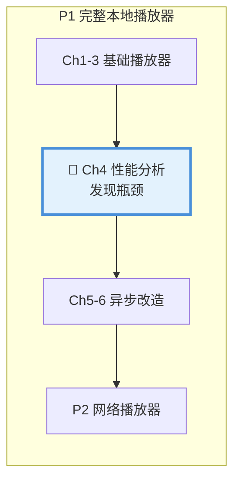
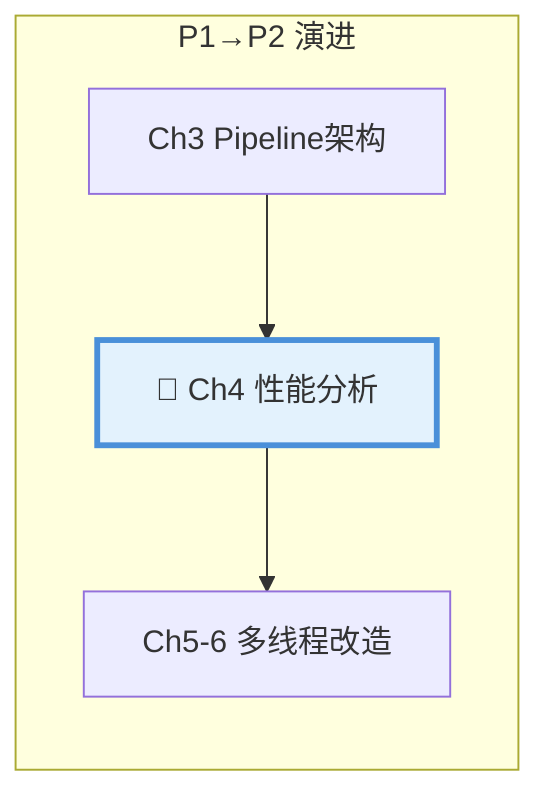
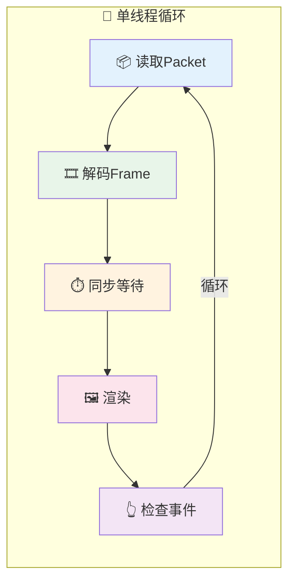
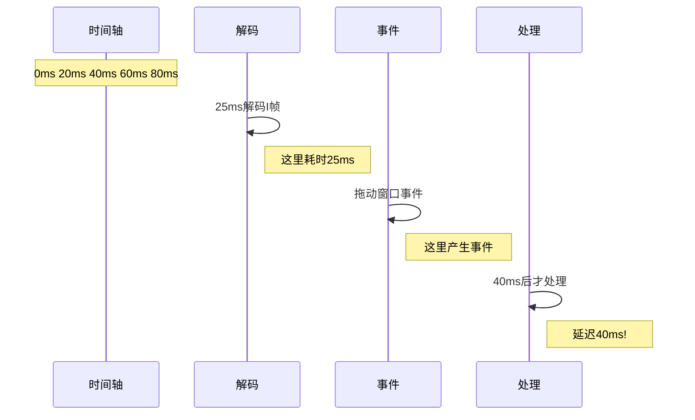
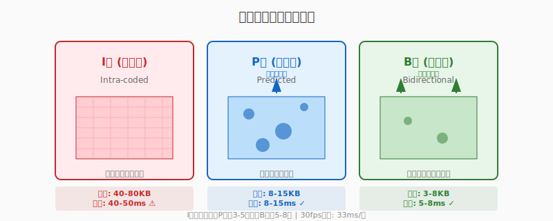
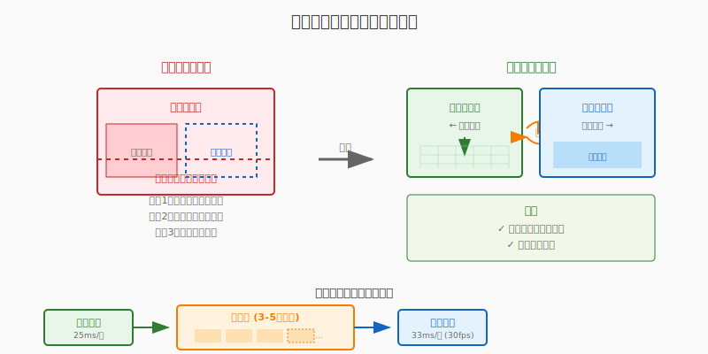
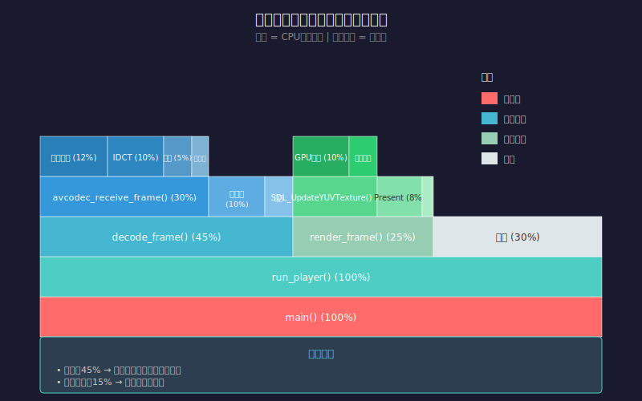

# 第四章：为什么卡顿？性能分析

| 项目 | 内容 |
|:---|:---|
| **本章目标** | 理解解码耗时，建立性能意识，掌握卡顿分析方法 |
| **难度** | ⭐⭐ 中等 |
| **前置知识** | Ch1-Ch3：视频基础、播放器基础架构、Pipeline设计 |
| **预计时间** | 2-3 小时 |

> **本章引言**：在第三章结束时，我们实现了一个能播放网络视频的播放器。但你是否注意到一个恼人的问题——**拖动窗口时画面会冻结**？这就是本章要解决的第一个性能问题。

通过本章的学习，你将：
- 学会测量代码耗时，建立**帧率预算**概念
- 理解不同视频帧的解码成本差异
- 发现**单线程架构的性能瓶颈**
- 掌握基础的性能分析工具（perf、火焰图）

**本章与项目的关系**：


**代码演进关系**：


- **当前阶段**：性能分析
- **本章产出**：发现单线程瓶颈


**阅读指南**：
- 第 1-2 节：观察卡顿现象，测量解码耗时
- 第 3-4 节：理解帧率预算和不同帧类型的解码成本
- 第 5-6 节：发现单线程瓶颈，实验验证
- 第 7-8 节：双缓冲原理和性能分析工具
- 第 9 节：FAQ 常见问题
---

## 目录

1. [卡顿现象：拖动窗口时画面冻结](#1-卡顿现象拖动窗口时画面冻结)
2. [测量解码耗时：std::chrono 实战](#2-测量解码耗时stdchrono-实战)
3. [帧率预算：33ms 法则](#3-帧率预算33ms-法则)
4. [不同帧的解码成本：I帧 vs P帧 vs B帧](#4-不同帧的解码成本i帧-vs-p帧-vs-b帧)
5. [单线程瓶颈：所有事情排队做](#5-单线程瓶颈所有事情排队做)
6. [实验：故意制造卡顿](#6-实验故意制造卡顿)
7. [双缓冲原理：显示与解码分离](#7-双缓冲原理显示与解码分离)
8. [性能分析工具：perf 与火焰图](#8-性能分析工具perf-与火焰图)
9. [FAQ 常见问题](#9-faq-常见问题)
10. [本章小结](#10-本章小结)
11. [下章预告](#11-下章预告)

---

## 1. 卡顿现象：拖动窗口时画面冻结

**本节概览**：先观察问题，再分析原因。我们将复现拖动窗口时的卡顿现象，理解事件循环与解码渲染的关系。

### 1.1 复现卡顿

使用第三章的播放器代码，播放任意视频，然后**快速拖动窗口**。你会发现：

```
正常播放：画面流畅，每秒30帧
    ↓
拖动窗口：画面完全冻结
    ↓
停止拖动：画面突然跳到最新位置
```

这不是视频的问题，而是我们程序的问题。

### 1.2 为什么会卡顿？

让我们回顾第三章的单线程代码结构：

```cpp
while (av_read_frame(fmt_ctx, packet) >= 0) {      // 1. 读取数据
    // 处理窗口事件 ↓↓↓
    SDL_Event e;
    while (SDL_PollEvent(&e)) {                      // 2. 处理事件
        if (e.type == SDL_QUIT) goto cleanup;
    }
    
    if (packet->stream_index == video_stream_idx) {
        avcodec_send_packet(codec_ctx, packet);      // 3. 送入解码器
        while (avcodec_receive_frame(codec_ctx, frame) == 0) {
            // 同步
            int64_t pts_us = frame->pts * av_q2d(video_stream->time_base) * 1000000;
            int64_t elapsed = av_gettime() - start_time;
            if (pts_us > elapsed) av_usleep(pts_us - elapsed);  // 4. 等待
            
            // 渲染 ↓↓↓
            SDL_UpdateYUVTexture(texture, nullptr, ...);       // 5. 更新纹理
            SDL_RenderClear(renderer);
            SDL_RenderCopy(renderer, texture, nullptr, nullptr);
            SDL_RenderPresent(renderer);                       // 6. 显示
        }
    }
}
```

**问题分析**：



当你拖动窗口时，操作系统会发送**窗口移动事件**给程序。但程序正在忙于解码和渲染，只有当执行到 `SDL_PollEvent` 时才能处理这些事件。

**时间线分析**：



如果解码一帧需要 25ms，那么在这 25ms 内产生的事件都要排队等待。对于窗口事件，这种延迟表现为"卡顿"或"不响应"。

### 1.3 卡顿的本质

**卡顿的本质是：处理事件的代码被阻塞了**

```
理想情况（多线程）：
┌──────────────┐     ┌──────────────┐
│   解码线程   │     │   主线程     │
│  解码+渲染   │     │  处理事件    │
│   25ms/帧    │     │   即时响应   │
└──────────────┘     └──────────────┘

现实情况（单线程）：
┌─────────────────────────────────────┐
│              主线程                 │
│  解码(25ms) → 渲染(5ms) → 事件(?)   │
│           ↑事件在此被阻塞           │
└─────────────────────────────────────┘
```

这引出了本章的核心问题：**我们需要测量每一部分的耗时，找到瓶颈**。

---

## 2. 测量解码耗时：std::chrono 实战

**本节概览**：学会使用 C++11 的 `std::chrono` 精确测量代码耗时，这是性能分析的基础技能。

### 2.1 为什么需要测量

"优化前先测量"——这是性能优化的黄金法则。在没有测量之前，所有的优化都是猜测。

```cpp
// 不要这样做：凭感觉优化
// "我觉得解码很慢，我要优化它"

// 应该这样做：测量后再优化
// "测量显示解码耗时30ms，目标是16ms，需要优化"
```

### 2.2 std::chrono 基础

C++11 引入了 `<chrono>` 库，提供了类型安全的时间测量：

```cpp
#include <chrono>

// 获取当前时间点
auto start = std::chrono::high_resolution_clock::now();

// ... 执行需要测量的代码 ...

auto end = std::chrono::high_resolution_clock::now();

// 计算耗时（微秒）
auto duration = std::chrono::duration_cast<std::chrono::microseconds>(end - start).count();
// duration 的单位是微秒 (μs)，1ms = 1000μs
```

**常用时间单位**：

| 单位 | 类 | 换算关系 |
|:---|:---|:---|
| 纳秒 | `std::chrono::nanoseconds` | 1秒 = 10⁹ 纳秒 |
| 微秒 | `std::chrono::microseconds` | 1秒 = 10⁶ 微秒 |
| 毫秒 | `std::chrono::milliseconds` | 1秒 = 10³ 毫秒 |
| 秒 | `std::chrono::seconds` | 基准单位 |

### 2.3 测量解码耗时

让我们给第三章的播放器加上耗时测量：

```cpp
#include <chrono>
#include <deque>
#include <numeric>

// 简单的性能监控器
class DecodeProfiler {
public:
    void Start() {
        start_time_ = std::chrono::high_resolution_clock::now();
    }
    
    void End() {
        auto end = std::chrono::high_resolution_clock::now();
        auto us = std::chrono::duration_cast<std::chrono::microseconds>(
            end - start_time_).count();
        
        // 保存最近30帧的耗时
        decode_times_.push_back(us);
        if (decode_times_.size() > 30) {
            decode_times_.pop_front();
        }
    }
    
    // 获取平均解码耗时（微秒）
    int64_t AverageUs() const {
        if (decode_times_.empty()) return 0;
        int64_t sum = std::accumulate(decode_times_.begin(), decode_times_.end(), 0LL);
        return sum / decode_times_.size();
    }
    
    // 获取最大耗时
    int64_t MaxUs() const {
        if (decode_times_.empty()) return 0;
        return *std::max_element(decode_times_.begin(), decode_times_.end());
    }
    
    // 打印统计信息
    void PrintStats() const {
        int64_t avg = AverageUs();
        int64_t max = MaxUs();
        double fps = 1000000.0 / avg;  // 理论最大帧率
        
        printf("[性能] 平均解码: %ldμs (%.1f fps), 最大: %ldμs\n", 
               avg, fps, max);
    }
    
private:
    std::chrono::time_point<std::chrono::high_resolution_clock> start_time_;
    std::deque<int64_t> decode_times_;
};
```

**在解码循环中使用**：

```cpp
DecodeProfiler profiler;

while (av_read_frame(fmt_ctx, packet) >= 0) {
    if (packet->stream_index == video_stream_idx) {
        profiler.Start();  // ← 开始计时
        
        avcodec_send_packet(codec_ctx, packet);
        while (avcodec_receive_frame(codec_ctx, frame) == 0) {
            // 解码完成
        }
        
        profiler.End();    // ← 结束计时
        
        // 每30帧打印一次统计
        if (decode_count_ % 30 == 0) {
            profiler.PrintStats();
        }
        
        // 渲染...
    }
    av_packet_unref(packet);
}
```

### 2.4 完整测量示例代码

```cpp
// profiler_player.cpp - 带性能分析的播放器
#include <SDL2/SDL.h>
#include <stdio.h>
#include <chrono>
#include <deque>
#include <numeric>

extern "C" {
#include <libavformat/avformat.h>
#include <libavcodec/avcodec.h>
#include <libavutil/time.h>
}

class PerformanceMonitor {
public:
    struct Stats {
        int64_t decode_us;
        int64_t render_us;
        int64_t total_us;
    };
    
    void StartDecode() {
        decode_start_ = Now();
    }
    
    void EndDecode() {
        decode_end_ = Now();
    }
    
    void StartRender() {
        render_start_ = Now();
    }
    
    void EndRender() {
        render_end_ = Now();
    }
    
    void RecordFrame() {
        Stats s;
        s.decode_us = DurationUs(decode_start_, decode_end_);
        s.render_us = DurationUs(render_start_, render_end_);
        s.total_us = s.decode_us + s.render_us;
        
        stats_.push_back(s);
        if (stats_.size() > 30) stats_.pop_front();
        
        frame_count_++;
        if (frame_count_ % 30 == 0) {
            PrintStats();
        }
    }
    
    void PrintStats() const {
        if (stats_.empty()) return;
        
        int64_t avg_decode = 0, avg_render = 0, max_total = 0;
        for (const auto& s : stats_) {
            avg_decode += s.decode_us;
            avg_render += s.render_us;
            max_total = std::max(max_total, s.total_us);
        }
        avg_decode /= stats_.size();
        avg_render /= stats_.size();
        
        double decode_fps = 1000000.0 / avg_decode;
        double total_fps = 1000000.0 / (avg_decode + avg_render);
        
        printf("\n========== 性能统计 (最近%d帧) ==========\n", (int)stats_.size());
        printf("解码: %4ld μs (%.1f fps)\n", avg_decode, decode_fps);
        printf("渲染: %4ld μs\n", avg_render);
        printf("总计: %4ld μs (%.1f fps)\n", avg_decode + avg_render, total_fps);
        printf("最大: %4ld μs\n", max_total);
        printf("========================================\n\n");
    }
    
private:
    using Clock = std::chrono::high_resolution_clock;
    using TimePoint = std::chrono::time_point<Clock>;
    
    TimePoint Now() { return Clock::now(); }
    
    int64_t DurationUs(TimePoint start, TimePoint end) {
        return std::chrono::duration_cast<std::chrono::microseconds>(end - start).count();
    }
    
    TimePoint decode_start_, decode_end_;
    TimePoint render_start_, render_end_;
    std::deque<Stats> stats_;
    int frame_count_ = 0;
};

int main(int argc, char* argv[]) {
    if (argc < 2) {
        fprintf(stderr, "用法: %s <视频文件>\n", argv[0]);
        return 1;
    }

    // ... 初始化代码（省略，与第三章相同）...
    
    AVFormatContext* fmt_ctx = nullptr;
    avformat_open_input(&fmt_ctx, argv[1], nullptr, nullptr);
    avformat_find_stream_info(fmt_ctx, nullptr);
    
    int video_stream_idx = av_find_best_stream(fmt_ctx, AVMEDIA_TYPE_VIDEO, -1, -1, nullptr, 0);
    AVStream* video_stream = fmt_ctx->streams[video_stream_idx];
    
    const AVCodec* codec = avcodec_find_decoder(video_stream->codecpar->codec_id);
    AVCodecContext* codec_ctx = avcodec_alloc_context3(codec);
    avcodec_parameters_to_context(codec_ctx, video_stream->codecpar);
    avcodec_open2(codec_ctx, codec, nullptr);

    SDL_Init(SDL_INIT_VIDEO);
    SDL_Window* window = SDL_CreateWindow("Profiler Player",
        SDL_WINDOWPOS_CENTERED, SDL_WINDOWPOS_CENTERED,
        codec_ctx->width, codec_ctx->height, SDL_WINDOW_SHOWN);
    SDL_Renderer* renderer = SDL_CreateRenderer(window, -1,
        SDL_RENDERER_ACCELERATED | SDL_RENDERER_PRESENTVSYNC);
    SDL_Texture* texture = SDL_CreateTexture(renderer,
        SDL_PIXELFORMAT_IYUV, SDL_TEXTUREACCESS_STREAMING,
        codec_ctx->width, codec_ctx->height);

    AVPacket* packet = av_packet_alloc();
    AVFrame* frame = av_frame_alloc();
    PerformanceMonitor monitor;
    int64_t start_time = av_gettime();

    while (av_read_frame(fmt_ctx, packet) >= 0) {
        SDL_Event e;
        while (SDL_PollEvent(&e)) {
            if (e.type == SDL_QUIT) goto cleanup;
        }

        if (packet->stream_index == video_stream_idx) {
            monitor.StartDecode();
            
            avcodec_send_packet(codec_ctx, packet);
            while (avcodec_receive_frame(codec_ctx, frame) == 0) {
                monitor.EndDecode();
                
                // 同步
                int64_t pts_us = frame->pts * av_q2d(video_stream->time_base) * 1000000;
                int64_t elapsed = av_gettime() - start_time;
                if (pts_us > elapsed) av_usleep(pts_us - elapsed);

                // 渲染
                monitor.StartRender();
                SDL_UpdateYUVTexture(texture, nullptr,
                    frame->data[0], frame->linesize[0],
                    frame->data[1], frame->linesize[1],
                    frame->data[2], frame->linesize[2]);
                SDL_RenderClear(renderer);
                SDL_RenderCopy(renderer, texture, nullptr, nullptr);
                SDL_RenderPresent(renderer);
                monitor.EndRender();
                
                monitor.RecordFrame();
            }
        }
        av_packet_unref(packet);
    }

cleanup:
    // ... 清理代码 ...
    av_frame_free(&frame);
    av_packet_free(&packet);
    avcodec_free_context(&codec_ctx);
    avformat_close_input(&fmt_ctx);
    SDL_Quit();
    return 0;
}
```

### 2.5 编译运行

```bash
# 编译
g++ -std=c++14 -O2 profiler_player.cpp -o profiler_player \
    $(pkg-config --cflags --libs libavformat libavcodec libavutil sdl2)

# 运行
./profiler_player test.mp4
```

**典型输出**：

```
========== 性能统计 (最近30帧) ==========
解码: 8234 μs (121.5 fps)
渲染: 1567 μs
总计: 9801 μs (102.0 fps)
最大: 15234 μs
========================================
```

这意味着：
- 解码平均需要 8.2ms
- 渲染平均需要 1.6ms
- 处理一帧总共需要 9.8ms
- 理论上可以支持 102fps（1000/9.8）

---

## 3. 帧率预算：33ms 法则

**本节概览**：理解帧率与耗时的关系，建立"帧率预算"概念。这是实时系统的核心设计约束。

### 3.1 帧率与耗时的数学关系

**帧率（FPS, Frames Per Second）**：每秒显示多少帧

```
30fps = 每秒30帧 = 每帧 1000/30 ≈ 33.3ms
60fps = 每秒60帧 = 每帧 1000/60 ≈ 16.7ms
```

| 目标帧率 | 每帧时间预算 | 应用场景 |
|:---|:---|:---|
| 24fps | 41.7ms | 电影（最低可接受） |
| 30fps | 33.3ms | 普通视频 |
| 60fps | 16.7ms | 游戏、高帧率视频 |
| 120fps | 8.3ms | 电竞、VR |

### 3.2 帧率预算分配

假设目标是 30fps（33ms 预算），我们需要把时间分配给各个环节：

```
33ms 预算分配示例：
┌────────────────────────────────────────────────┐
│  解码: 15ms  ████████████████░░░░░░░░░░░░░░░░░ │
│  渲染:  5ms  █████░░░░░░░░░░░░░░░░░░░░░░░░░░░░ │
│  同步:  2ms  ██░░░░░░░░░░░░░░░░░░░░░░░░░░░░░░░ │
│  事件:  1ms  █░░░░░░░░░░░░░░░░░░░░░░░░░░░░░░░░ │
│  余量: 10ms  ██████████░░░░░░░░░░░░░░░░░░░░░░░ │  ← 应对波动
└────────────────────────────────────────────────┘
```

**为什么要留余量？**

因为视频帧的解码时间**不是恒定的**——I帧比P帧慢，P帧比B帧慢。如果没有余量，遇到大I帧时就会卡顿。

### 3.3 实际测量的重要性

理论预算 vs 实际测量：

```
理论计算：
- 1080p H.264 软解 30fps 应该没问题

实际测量（不同机器）：
- MacBook Pro M1: 8ms/帧 ✓ 轻松
- 老旧 i5 笔记本: 25ms/帧 ✓ 刚好
- 树莓派 4: 45ms/帧 ✗ 卡顿
```

**永远不要假设性能，要测量**。

### 3.4 性能目标检查表

| 目标帧率 | 总预算 | 解码预算 | 渲染预算 | 余量 |
|:---|:---|:---|:---|:---|
| 30fps | 33ms | <20ms | <5ms | >8ms |
| 60fps | 16ms | <10ms | <3ms | >3ms |

**检查你的播放器**：

```cpp
// 在性能统计中加入预算检查
void CheckBudget(int64_t total_us) {
    const int64_t BUDGET_30FPS = 33333;  // 33.3ms = 33333μs
    const int64_t BUDGET_60FPS = 16667;  // 16.7ms = 16667μs
    
    if (total_us > BUDGET_30FPS) {
        printf("⚠️ 警告：超过30fps预算！(%ldμs > %ldμs)\n", total_us, BUDGET_30FPS);
    } else if (total_us > BUDGET_60FPS) {
        printf("✓ 满足30fps，但无法满足60fps\n");
    } else {
        printf("✓ 满足60fps\n");
    }
}
```

---

## 4. 不同帧的解码成本：I帧 vs P帧 vs B帧

**本节概览**：理解视频编码中三种帧类型的解码成本差异，这是预测性能波动的基础。

### 4.1 回顾：三种帧类型

在第一章我们学习了视频压缩原理，其中提到了三种帧类型：



| 类型 | 名称 | 依赖关系 | 典型大小 | 解码成本 |
|:---|:---|:---|:---|:---|
| **I帧** | 关键帧（Intra）| 无依赖 | 40-80 KB | **最高** |
| **P帧** | 预测帧（Predicted）| 依赖前一帧 | 8-15 KB | 中等 |
| **B帧** | 双向帧（Bidirectional）| 依赖前后帧 | 3-8 KB | 较低 |

### 4.2 为什么 I帧解码最慢？

**I帧（关键帧）**：
- 包含完整的图像数据
- 使用帧内压缩（DCT变换+量化）
- 需要完整解码所有宏块

```
I帧解码流程：
压缩数据 → 熵解码 → 反量化 → IDCT变换 → 重构图像
                ↑
         每个宏块都要走完整流程
```

**P帧（预测帧）**：
- 只存储与参考帧的差异
- 使用运动估计和补偿
- 大部分区域可能"没有变化"

```
P帧解码流程：
参考帧 → 运动矢量 → 预测图像 → 残差解码 → 重构图像
              ↑
       运动补偿通常很快
```

### 4.3 测量不同帧的解码耗时

让我们修改代码，分别统计 I/P/B 帧的解码时间：

```cpp
class FrameTypeProfiler {
public:
    void RecordFrame(char pict_type, int64_t decode_us) {
        switch (pict_type) {
            case 'I': iframe_times_.push_back(decode_us); break;
            case 'P': pframe_times_.push_back(decode_us); break;
            case 'B': bframe_times_.push_back(decode_us); break;
        }
        
        // 保持最近30个样本
        if (iframe_times_.size() > 30) iframe_times_.pop_front();
        if (pframe_times_.size() > 30) pframe_times_.pop_front();
        if (bframe_times_.size() > 30) bframe_times_.pop_front();
    }
    
    void PrintStats() const {
        printf("\n========== 帧类型解码统计 ==========\n");
        printf("I帧: %s\n", FormatStats(iframe_times_).c_str());
        printf("P帧: %s\n", FormatStats(pframe_times_).c_str());
        printf("B帧: %s\n", FormatStats(bframe_times_).c_str());
        printf("====================================\n\n");
    }
    
private:
    std::deque<int64_t> iframe_times_;
    std::deque<int64_t> pframe_times_;
    std::deque<int64_t> bframe_times_;
    
    std::string FormatStats(const std::deque<int64_t>& times) const {
        if (times.empty()) return "无数据";
        
        int64_t sum = 0, max_val = 0;
        for (auto t : times) {
            sum += t;
            max_val = std::max(max_val, t);
        }
        int64_t avg = sum / times.size();
        
        char buf[128];
        snprintf(buf, sizeof(buf), "平均%4ldμs, 最大%4ldμs, 样本%d",
                 avg, max_val, (int)times.size());
        return buf;
    }
};

// 使用方式
FrameTypeProfiler ft_profiler;

while (avcodec_receive_frame(codec_ctx, frame) == 0) {
    auto end = std::chrono::high_resolution_clock::now();
    auto decode_us = std::chrono::duration_cast<std::chrono::microseconds>(
        end - decode_start).count();
    
    // frame->pict_type 表示帧类型：AV_PICTURE_TYPE_I, AV_PICTURE_TYPE_P, AV_PICTURE_TYPE_B
    char type = av_get_picture_type_char((AVPictureType)frame->pict_type);
    ft_profiler.RecordFrame(type, decode_us);
    
    if (++frame_count % 90 == 0) {  // 每90帧打印一次
        ft_profiler.PrintStats();
    }
}
```

### 4.4 典型测量结果

在 1080p H.264 视频上的典型结果：

```
========== 帧类型解码统计 ==========
I帧: 平均45231μs, 最大52341μs, 样本10  ← 45ms！超过33ms预算
P帧: 平均 8234μs, 最大 9876μs, 样本50
B帧: 平均 5234μs, 最大 6543μs, 样本30
====================================
```

**关键发现**：
- I帧解码需要 **45ms**，超过了 30fps 的 33ms 预算
- 这意味着播放这个视频时，**遇到I帧必然卡顿**

### 4.5 为什么播放器还能工作？

你可能会问：如果I帧解码需要45ms，超过33ms预算，为什么播放器还能播放？

**答案**：FFmpeg 的解码器默认使用了**多线程解码**。

```cpp
// 默认情况下，FFmpeg 可能已经启用了多线程
// 检查实际的解码线程数
printf("解码线程数: %d\n", codec_ctx->thread_count);
```

但我们现在写的是**单线程播放器**——解码、渲染、事件处理都在一个线程。这就是为什么拖动窗口会卡顿的原因。

---

## 5. 单线程瓶颈：所有事情排队做

**本节概览**：深入分析单线程架构的性能瓶颈，理解为什么需要多线程。

### 5.1 单线程的执行模型

我们的播放器目前是这样工作的：

```
单线程执行顺序：
┌─────────────────────────────────────────────────────────┐
│  读取Packet → 解码Frame → 同步等待 → 渲染 → 处理事件   │
└─────────────────────────────────────────────────────────┘
      ↑________________________________________________↓
                      循环执行
```

**问题**：所有操作**串行执行**，任何一个环节卡住，其他环节都要等待。

### 5.2 时间线分析

假设解码一帧需要 25ms，渲染需要 5ms：

```
时间轴 (ms):  0     10    20    25    30    35    40
              │      │      │      │      │      │
解码:         └──────┴──────┴──────┘
                                    ↑25ms
渲染:                                └────┘
                                          ↑5ms
可处理事件:                                    ↑从这里开始才能处理
```

在这 30ms 内，如果用户拖动窗口，事件无法被处理，表现为卡顿。

### 5.3 瓶颈叠加效应

更糟的是，瓶颈会**叠加**：

```
场景：播放高码率视频 + 拖动窗口

时间:    0     10    20    30    40    50    60    70    80
         │      │      │      │      │      │      │      │
解码:    └──────┴──────┴──────┘
                          ↑解码慢
渲染:                       └────┘
                                ↑渲染慢
事件A:   ↑产生              ↑处理(延迟30ms)
事件B:          ↑产生       ↑处理(延迟40ms)
事件C:                 ↑产生 ↑处理(延迟50ms)
```

用户的操作得不到即时响应，体验很差。

### 5.4 单线程 vs 多线程对比

**单线程（当前）**：

```
┌─────────────────────────────────────────────┐
│              主线程                         │
│  ┌─────────┐ ┌─────────┐ ┌─────────┐       │
│  │ 解码25ms│→│ 渲染5ms │→│ 事件?   │       │
│  └─────────┘ └─────────┘ └─────────┘       │
│         ↑事件在此被阻塞                     │
└─────────────────────────────────────────────┘
```

**多线程（目标）**：

```
┌─────────────────┐  ┌─────────────────────┐
│   解码线程      │  │      主线程         │
│  ┌───────────┐  │  │  ┌─────────────┐   │
│  │ 解码25ms  │  │  │  │ 处理事件    │   │
│  │ 解码25ms  │  │  │  │ 处理事件    │   │
│  │ 解码25ms  │  │  │  │ 渲染5ms     │   │
│  └───────────┘  │  │  └─────────────┘   │
│       ↓         │  │        ↑           │
│    帧队列       │→ │ 从队列取帧渲染     │
└─────────────────┘  └─────────────────────┘
                     事件处理永不阻塞
```

**关键区别**：
- 单线程：解码阻塞事件处理
- 多线程：事件处理独立于解码

### 5.5 延迟的量化分析

| 架构 | 事件处理延迟 | 能否接受 |
|:---|:---|:---|
| 单线程 | 等于解码+渲染时间 | ❌ 不可接受 |
| 双缓冲 | 小于一帧时间 | ⚠️ 可接受 |
| 多线程 | 接近即时 | ✓ 良好 |

---

## 6. 实验：故意制造卡顿

**本节概览**：通过故意在解码中加入延迟，观察卡顿现象，验证我们的理论分析。

### 6.1 实验设计

让我们写一个简单的实验程序，验证"解码耗时会影响事件响应"：

```cpp
// lag_experiment.cpp - 卡顿实验
#include <SDL2/SDL.h>
#include <chrono>
#include <thread>

// 模拟不同耗时的解码
void SimulateDecode(int ms) {
    std::this_thread::sleep_for(std::chrono::milliseconds(ms));
}

int main(int argc, char* argv[]) {
    SDL_Init(SDL_INIT_VIDEO);
    SDL_Window* window = SDL_CreateWindow("Lag Experiment",
        SDL_WINDOWPOS_CENTERED, SDL_WINDOWPOS_CENTERED,
        640, 480, SDL_WINDOW_RESIZABLE);
    SDL_Renderer* renderer = SDL_CreateRenderer(window, -1, 0);
    
    // 读取命令行参数：模拟解码耗时（毫秒）
    int decode_time_ms = 50;  // 默认50ms
    if (argc > 1) {
        decode_time_ms = atoi(argv[1]);
    }
    
    printf("模拟解码耗时: %dms\n", decode_time_ms);
    printf("尝试拖动窗口，观察流畅度...\n");
    
    bool running = true;
    int frame_count = 0;
    auto last_event_check = std::chrono::high_resolution_clock::now();
    
    while (running) {
        // ===== 模拟解码 =====
        auto decode_start = std::chrono::high_resolution_clock::now();
        SimulateDecode(decode_time_ms);
        auto decode_end = std::chrono::high_resolution_clock::now();
        
        // ===== 模拟渲染 =====
        SDL_SetRenderDrawColor(renderer, 
            (frame_count * 5) % 255,  // 变化颜色
            100, 100, 255);
        SDL_RenderClear(renderer);
        SDL_RenderPresent(renderer);
        
        // ===== 处理事件 =====
        auto event_start = std::chrono::high_resolution_clock::now();
        SDL_Event e;
        int events_processed = 0;
        while (SDL_PollEvent(&e)) {
            events_processed++;
            if (e.type == SDL_QUIT) running = false;
            if (e.type == SDL_WINDOWEVENT) {
                auto latency = std::chrono::duration_cast<std::chrono::milliseconds>(
                    event_start - last_event_check).count();
                if (e.window.event == SDL_WINDOWEVENT_MOVED) {
                    printf("窗口移动事件，响应延迟: %ld ms\n", latency);
                }
            }
        }
        last_event_check = event_start;
        
        auto total_us = std::chrono::duration_cast<std::chrono::microseconds>(
            std::chrono::high_resolution_clock::now() - decode_start).count();
        
        if (++frame_count % 30 == 0) {
            printf("帧%d: 解码%dms, 处理%d个事件, 总耗时%.1fms, 理论%.1f fps\n",
                   frame_count, decode_time_ms, events_processed,
                   total_us / 1000.0, 1000000.0 / total_us);
        }
    }
    
    SDL_Quit();
    return 0;
}
```

### 6.2 编译运行

```bash
# 编译
g++ -std=c++14 lag_experiment.cpp -o lag_experiment $(pkg-config --cflags --libs sdl2)

# 运行不同耗时的版本
./lag_experiment 10   # 模拟10ms解码
./lag_experiment 50   # 模拟50ms解码
./lag_experiment 100  # 模拟100ms解码
```

### 6.3 预期结果

| 解码耗时 | 事件响应延迟 | 用户体验 |
|:---|:---|:---|
| 10ms | ~10ms | ✓ 流畅，几乎无感知 |
| 50ms | ~50ms | ⚠️ 明显延迟，但能接受 |
| 100ms | ~100ms | ❌ 严重卡顿，无法接受 |

### 6.4 实验观察要点

运行程序时注意以下几点：

1. **窗口拖动流畅度**：解码耗时越长，拖动越卡
2. **事件响应延迟**：打印的延迟数值
3. **理论帧率**：总耗时决定了最大帧率

这个实验证明了：**解码耗时直接决定了事件响应的延迟**。

---

## 7. 双缓冲原理：显示与解码分离

**本节概览**：介绍双缓冲技术，理解如何通过缓冲区解耦解码和显示，为后续的多线程架构打下基础。

### 7.1 什么是双缓冲

双缓冲（Double Buffering）是一种经典的计算机图形技术：



```
传统单缓冲：
┌─────────────┐
│   显示内存   │ ← 解码直接写入，屏幕直接读取
└─────────────┘
        ↑
   可能产生撕裂（解码写到一半被显示）

双缓冲：
┌─────────────┐  ┌─────────────┐
│  前台缓冲区  │  │  后台缓冲区  │
│  (显示中)   │  │  (解码中)   │
└─────────────┘  └─────────────┘
        ↑                ↑
      显示              解码
        
当后台缓冲解码完成，交换两个缓冲区
```

### 7.2 双缓冲解决什么问题？

**问题1：画面撕裂**

```
单缓冲场景：
时间:   显示扫描      解码写入
        ↓             ↓
        ████████████  ← 旧画面
        ██████------  ← 解码写到一半，显示读到新数据
        ------------  
        
结果：屏幕上同时出现新旧两帧的部分内容
```

**问题2：解码阻塞显示**

```
单缓冲：解码耗时直接决定显示帧率

双缓冲：
┌─────────────┐      ┌─────────────┐
│  解码线程   │ ──→ │   帧队列    │ ← 缓冲多帧
│  (25ms/帧)  │      │  (3-5帧)   │
└─────────────┘      └──────┬──────┘
                            ↓
                     ┌─────────────┐
                     │  显示线程   │ ← 以固定帧率显示
                     │  (33ms/帧)  │
                     └─────────────┘
```

### 7.3 双缓冲在视频播放中的应用

实际视频播放中，双缓冲扩展为**帧队列**：

```cpp
// 简化的帧队列实现
class FrameQueue {
public:
    static constexpr size_t MAX_SIZE = 5;  // 最多缓冲5帧
    
    void Push(AVFrame* frame) {
        std::unique_lock<std::mutex> lock(mutex_);
        // 队列满时等待
        not_full_.wait(lock, [this] { return queue_.size() < MAX_SIZE; });
        
        queue_.push(frame);
        not_empty_.notify_one();
    }
    
    AVFrame* Pop() {
        std::unique_lock<std::mutex> lock(mutex_);
        // 队列空时等待
        not_empty_.wait(lock, [this] { return !queue_.empty(); });
        
        AVFrame* frame = queue_.front();
        queue_.pop();
        not_full_.notify_one();
        return frame;
    }
    
private:
    std::queue<AVFrame*> queue_;
    std::mutex mutex_;
    std::condition_variable not_empty_;
    std::condition_variable not_full_;
};
```

### 7.4 缓冲大小的权衡

| 缓冲区大小 | 延迟 | 流畅度 | 内存占用 |
|:---|:---|:---|:---|
| 1帧 | 最低 | 差（容易欠载） | 低 |
| 3帧 | 低 | 好 | 中等 |
| 5帧 | 中等 | 很好 | 较高 |
| 10帧 | 高 | 极好 | 高 |

**直播场景**：通常使用 3-5 帧缓冲，平衡延迟和流畅度

### 7.5 欠载与过载

**欠载（Underflow）**：解码跟不上显示速度
```
队列:  [帧1][帧2] → 空 → 显示线程等待
                     ↑
              画面暂停，等待解码
```

**过载（Overflow）**：队列满了，解码线程等待
```
队列:  [帧1][帧2][帧3][帧4][帧5] 满
                              ↑
                        解码线程等待
```

这两种情况都会影响播放质量，需要合理设置缓冲区大小和丢帧策略。

---

## 8. 性能分析工具：perf 与火焰图

**本节概览**：学习使用 Linux 的 perf 工具和火焰图，可视化地定位性能瓶颈。

### 8.1 perf 工具简介

`perf` 是 Linux 内核提供的性能分析工具，可以统计函数的 CPU 占用：

```bash
# 基本用法：记录程序运行时的性能数据
perf record -g ./player test.mp4

# 查看统计结果
perf report
```

### 8.2 生成火焰图

火焰图（Flame Graph）是性能分析的可视化工具，可以直观显示调用栈的 CPU 占用：

```bash
# 1. 安装火焰图工具
git clone https://github.com/brendangregg/FlameGraph.git

# 2. 记录性能数据（带调用栈）
perf record -g --call-graph=dwarf ./player test.mp4
# 按 Ctrl+C 停止录制

# 3. 生成火焰图
perf script | ./FlameGraph/stackcollapse-perf.pl | \
    ./FlameGraph/flamegraph.pl > flamegraph.svg

# 4. 浏览器查看
firefox flamegraph.svg
```

### 8.3 解读火焰图

火焰图的阅读方法：



```
火焰图结构：
┌─────────────────────────────────────────────────┐
│  main()                                          │ ← 底部是调用者
│  └── run_player()                                │
│      ├── decode_frame() ████████████             │ ← 宽度 = CPU占比
│      │   ├── avcodec_receive_frame() ████████    │
│      │   └── idct_transform()        ██          │
│      ├── render_frame()   ████                   │
│      └── handle_events()  █                      │ ← 顶部是被调用者
└─────────────────────────────────────────────────┘

宽度越宽 = 占用CPU越多 = 优化的潜在收益越大
```

### 8.4 典型播放器的火焰图分析

一个典型视频播放器的火焰图可能长这样：

```
解码层 (40-50%): avcodec_receive_frame 及相关函数
├── 运动补偿 (15%)
├── IDCT 变换 (10%)
└── 环路滤波 (8%)

渲染层 (20-30%): SDL_UpdateYUVTexture, SDL_RenderPresent
├── 纹理上传 (15%)
└── GPU 等待 VSync (10%)

系统层 (10-20%): 驱动、内存拷贝、文件 IO
```

**优化决策**：
- 解码占比 > 50% → 启用多线程或硬件解码
- 纹理上传占比 > 20% → 使用零拷贝或硬件解码
- VSync 等待占比高 → 正常，无需优化

### 8.5 其他性能分析工具

| 工具 | 用途 | 命令示例 |
|:---|:---|:---|
| perf | CPU 采样 | `perf record -g ./player` |
| top/htop | 实时CPU/内存 | `top -p $(pgrep player)` |
| valgrind | 内存分析 | `valgrind --tool=callgrind ./player` |
| strace | 系统调用跟踪 | `strace -c ./player` |

**实时查看CPU占用**：

```bash
# 查看播放器进程的CPU占用
top -p $(pgrep player)

# 或
htop -p $(pgrep player)
```

---

## 9. FAQ 常见问题

### Q1：为什么拖动窗口会导致画面冻结？

**A**：这是单线程架构的固有问题。在单线程播放器中，解码、渲染、事件处理都在一个循环里顺序执行：

```
读取Packet → 解码Frame → 渲染 → 处理事件（包括窗口事件）
```

当你拖动窗口时，操作系统会产生大量窗口事件，但程序必须等到当前解码和渲染完成后才能处理这些事件。

**解决方案**：使用多线程架构（Ch5-Ch6 详细讲解）。

---

### Q2：33ms 的帧率预算是如何计算的？

**A**：帧率预算 = 1000ms / 目标帧率。

| 目标帧率 | 帧率预算 | 适用场景 |
|:---:|:---:|:---|
| 30fps | 33.3ms | 普通视频、电影 |
| 60fps | 16.7ms | 游戏、高帧率视频 |
| 120fps | 8.3ms | 电竞、VR |

---

### Q3：I帧、P帧、B帧的解码耗时差异有多大？

**A**：典型比例：I帧 : P帧 : B帧 ≈ 10 : 2 : 1

| 帧类型 | 解码耗时 | 说明 |
|:---:|:---:|:---|
| I帧 | 8-15ms | 完整编码，最耗时 |
| P帧 | 2-5ms | 参考前一帧 |
| B帧 | 1-3ms | 参考前后帧 |

---

### Q4：如何准确测量解码耗时？

**A**：使用 `std::chrono` 高精度计时器：

```cpp
auto start = std::chrono::high_resolution_clock::now();
// ... 解码操作 ...
auto end = std::chrono::high_resolution_clock::now();
auto duration = std::chrono::duration_cast<std::chrono::microseconds>(end - start);
```

---

### Q5：双缓冲和生产者-消费者模式有什么区别？

**A**：双缓冲用于显示与绘制分离（2个缓冲区），生产者-消费者用于任务并行处理（N个缓冲区）。视频播放器中两者可以结合使用。

---

## 10. 本章小结

### 核心知识点

1. **卡顿原因**：单线程架构下，解码、渲染、事件处理串行执行
2. **帧率预算**：30fps → 33ms/帧，60fps → 16.7ms/帧
3. **帧类型成本**：I帧 > P帧 > B帧
4. **解决方案**：双缓冲 + 多线程

### 关键技能

| 技能 | 掌握程度 |
|:---|:---:|
| 使用 std::chrono 测量耗时 | ⭐⭐⭐ |
| 计算帧率预算 | ⭐⭐⭐ |
| 识别 I/P/B 帧 | ⭐⭐⭐ |

---

## 11. 下章预告

### 第五章：C++11 多线程基础

**为什么学这一章？** 本章发现了单线程的瓶颈，但解决问题需要工具。

**你将学到**：
- `std::thread`：创建和管理线程
- `std::mutex`：保护共享数据
- `std::condition_variable`：高效的线程间通信
- **线程安全队列**：为第六章异步播放器打下基础

**难度预警**：⭐⭐⭐ 较高。多线程编程容易出错，但这是成为高级开发者的必经之路。

---

## 附录：本章回顾

本章我们学习了性能分析的基础知识：

1. **卡顿现象**：拖动窗口时画面冻结，本质是事件处理被阻塞
2. **测量耗时**：使用 `std::chrono` 精确测量解码、渲染耗时
3. **帧率预算**：30fps = 33ms/帧，60fps = 16ms/帧，需要合理分配
4. **帧类型差异**：I帧解码最慢（40-50ms），P帧中等（8-15ms），B帧最快（5-8ms）
5. **单线程瓶颈**：解码、渲染、事件处理串行执行，互相阻塞
6. **双缓冲原理**：通过帧队列解耦解码和显示
7. **性能工具**：perf + 火焰图可视化定位瓶颈

---|:---|:---|:---|
| I帧解码 | 40-50ms | ❌ 超标 | ❌ 严重超标 |
| P帧解码 | 8-15ms | ✓ 合格 | ✓ 合格 |
| B帧解码 | 5-8ms | ✓ 合格 | ✓ 合格 |
| 渲染 | 3-5ms | ✓ 合格 | ✓ 合格 |
| **单线程总计** | **48-60ms** | ❌ 超标 | ❌ 严重超标 |

**结论**：单线程架构无法满足流畅播放的要求，必须引入多线程。

### 9.3 下一步：多线程架构

第五章将解决本章发现的问题：

```
当前（单线程）：
解码 + 渲染 + 事件 ──→ 在一个线程串行执行
        ↓
   事件响应慢，拖动卡顿

第五章（多线程）：
┌─────────────┐    ┌─────────────┐    ┌─────────────┐
│  读取线程   │──→│  解码线程   │──→│  渲染线程   │
│  (IO)       │    │  (CPU密集)  │    │  (主线程)   │
└─────────────┘    └─────────────┘    └─────────────┘
                                              ↑
                                       专门处理事件，即时响应
```

**预告**：第五章将实现真正的多线程播放器，解决拖动卡顿问题，为流畅播放打下基础。

### 9.4 练习题

1. **测量练习**：使用本章的 `PerformanceMonitor` 类，测量你的播放器解码不同分辨率视频（720p、1080p、4K）的耗时。

2. **预算计算**：如果解码一帧需要 25ms，渲染需要 5ms，最大能达到多少fps？是否满足60fps要求？

3. **火焰图实践**：使用 perf 和 FlameGraph 生成你的播放器的火焰图，找出占用CPU最多的函数。

4. **实验验证**：修改 `lag_experiment.cpp`，尝试不同的解码耗时，观察事件响应延迟的变化。

---

## 附录

### A. 参考代码

完整的性能分析播放器代码位于 `chapter-04/profiler_player.cpp`。

### B. 性能分析检查清单

```
□ 测量解码耗时（I帧/P帧/B帧）
□ 测量渲染耗时
□ 计算总耗时是否满足帧率预算
□ 使用 perf 生成火焰图
□ 分析 CPU 占用瓶颈
□ 识别需要优化的模块
```

### C. 延伸阅读

- [C++ Reference: chrono](https://en.cppreference.com/w/cpp/header/chrono)
- [Perf Wiki](https://perf.wiki.kernel.org/)
- [FlameGraph GitHub](https://github.com/brendangregg/FlameGraph)

---

**本章代码仓库**：https://github.com/chapin666/live-system-book
