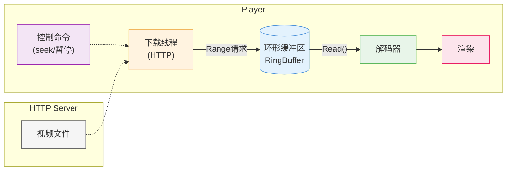
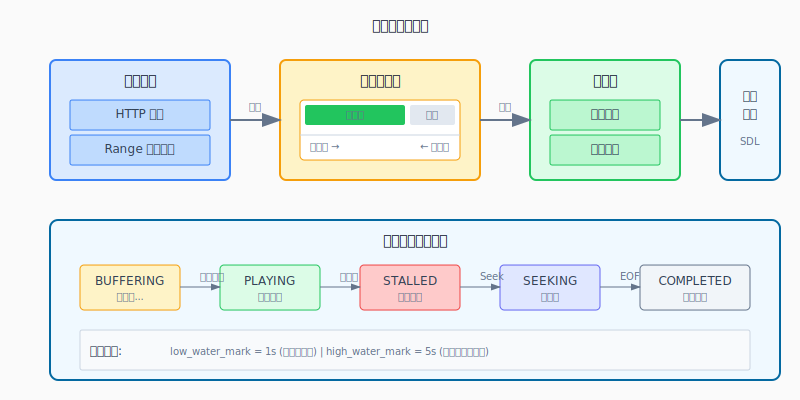
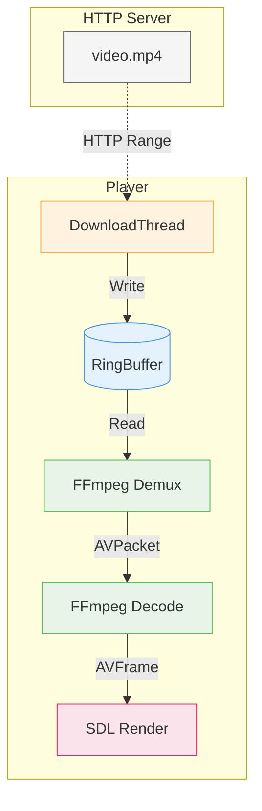

# 第7章：网络基础

| 项目 | 内容 |
|:---|:---|
| **本章目标** | 掌握网络基础的核心概念和实践 |
| **难度** | ⭐⭐ 中等 |
| **前置知识** | Ch6：异步播放器架构 |
| **预计时间** | 2-3 小时 |

> **本章引言**

> **本章目标**：将本地播放器扩展为网络播放器，学习 HTTP 下载、断点续传、环形缓冲区等核心概念。

第六章实现了异步播放器，但只能播放本地文件。本章将引入**网络下载能力**，让播放器能够从 HTTP 服务器获取视频数据。

网络播放与本地播放最大的区别是：**数据不是立即可得的**。我们需要等待下载、处理超时、实现断点续传。这些挑战将引出**环形缓冲区**这一重要数据结构。

**阅读指南**：
- 第 1-2 节：理解 TCP/HTTP 基础，区分流式下载和分块下载
- 第 3-5 节：学习环形缓冲区设计，实现下载线程
- 第 6-7 节：整合网络模块到播放器，实现边下边播
- 第 8-9 节：错误处理、性能优化、常见问题

---

## 目录

1. [为什么需要网络下载：从本地到网络](#1-为什么需要网络下载从本地到网络)
2. [HTTP 协议基础](#2-http-协议基础)
3. [下载策略：流式 vs 分块](#3-下载策略流式-vs-分块)
4. [环形缓冲区设计](#4-环形缓冲区设计)
5. [下载线程实现](#5-下载线程实现)
6. [整合：网络播放器](#6-整合网络播放器)
7. [断点续传与 seek](#7-断点续传与-seek)
8. [性能优化](#8-性能优化)
9. [本章总结与下一步](#9-本章总结与下一步)

---

## 1. 为什么需要网络下载：从本地到网络

**本节概览**：对比本地文件播放和网络播放的差异，理解网络引入的新挑战。

### 1.1 本地 vs 网络的本质区别

**本地文件播放**（第一章）：
```
文件在磁盘 → 读取速度 100-500 MB/s → 立即可用 → 简单顺序读取
```

**网络视频播放**（本章）：
```
文件在远程服务器 → 下载速度 1-10 MB/s → 需要等待 → 异步下载+缓冲
```

**关键差异**：

| 维度 | 本地文件 | 网络下载 |
|:---|:---|:---|
| **延迟** | 微秒级 | 毫秒-秒级 |
| **速度** | 稳定快速 | 波动且慢 10-100 倍 |
| **可靠性** | 几乎不失败 | 可能超时、断开 |
| **随机访问** | 立即 seek | 需要重新连接/下载 |
| **数据模型** | 完整的文件 | 流式或分块数据 |

### 1.2 网络播放的挑战

**挑战一：下载速度 < 播放速度**

```
视频码率：4 Mbps (0.5 MB/s)
网络速度：1 Mbps (0.125 MB/s) - 弱网环境

结果：下载跟不上播放，必须暂停等待缓冲
```

**挑战二：网络波动**

```
时间线：
0-5s:   下载速度 10 MB/s (流畅)
5-10s:  下载速度 0.1 MB/s (卡顿)
10-15s: 下载速度 5 MB/s (恢复)

需要：缓冲机制平滑波动
```

**挑战三：用户 seek**

```
用户拖动进度条到 50% → 
需要：中断当前下载，从 50% 位置开始新下载
```

### 1.3 解决方案概览



**核心组件**：
1. **下载线程**：负责 HTTP 通信，持续拉取数据
2. **环形缓冲区**：临时存储下载的数据，平滑速度差异
3. **缓冲管理**：控制播放节奏（缓冲足够才播放，不足则暂停）

**本节小结**：网络播放面临速度慢、波动大、不可靠等挑战。解决方案是异步下载 + 环形缓冲区 + 缓冲控制。下一节将学习 HTTP 协议基础。

### 1.3 三层缓冲架构详解

网络播放器需要**两层缓冲**协同工作，注意不要与第2章的 `FrameQueue` 混淆：

```
┌─────────────────────────────────────────────────────────────┐
│  应用层: 帧队列 FrameQueue (AVFrame*)                       │ ← 第2章已讲
│  作用: 存储解码后的视频帧，平滑解码耗时波动                  │
│  数据: 原始像素 (YUV/RGB)                                   │
│  大小: 3-5 帧（约 100-200ms）                               │
├─────────────────────────────────────────────────────────────┤
│  网络层: 环形缓冲区 RingBuffer (uint8_t*)                   │ ← 本章新增
│  作用: 存储下载的压缩数据，平滑网络速度波动                  │
│  数据: 压缩码流 (H.264/AAC in FLV/MP4)                      │
│  大小: 2-5 秒（由带宽和码率决定）                           │
├─────────────────────────────────────────────────────────────┤
│  传输层: HTTP 下载线程 (libcurl)                            │ ← 本章新增
│  作用: 从远程服务器拉取压缩数据                              │
│  协议: HTTP/1.1, Range 请求, 断点续传                       │
└─────────────────────────────────────────────────────────────┘
```

**关键理解**：
- `FrameQueue`（第2章）存储的是**解码后的帧**，供渲染线程使用
- `RingBuffer`（本章）存储的是**压缩的数据**，供解码器读取
- 两者是**串联关系**：网络数据 → RingBuffer → 解码器 → FrameQueue → 渲染



---

## 2. HTTP 协议基础

**本节概览**：HTTP 是视频下载的基础协议。本节介绍 HTTP 请求格式、Range 请求（断点续传）、以及响应状态码。

### 2.1 HTTP 请求格式

HTTP 请求是纯文本格式：

```http
GET /video.mp4 HTTP/1.1\r\n
Host: example.com\r\n
User-Agent: LivePlayer/1.0\r\n
\r\n
```

**组成部分**：
- **请求行**：方法 + 路径 + 协议版本
- **请求头**：键值对，提供额外信息
- **空行**：表示头部结束
- **请求体**：GET 请求为空，POST 请求包含数据

### 2.2 Range 请求：断点续传的核心

标准 HTTP 下载从文件开头获取所有数据。但如果想从中间开始（如 seek 到 50%），需要使用 **Range 请求**。

**请求**：
```http
GET /video.mp4 HTTP/1.1
Host: example.com
Range: bytes=1024-2047
```

**响应**：
```http
HTTP/1.1 206 Partial Content
Content-Range: bytes 1024-2047/1048576
Content-Length: 1024

[二进制数据...]
```

**关键头字段**：

| 头字段 | 含义 | 示例 |
|:---|:---|:---|
| `Range` | 请求的字节范围 | `bytes=0-1023` |
| `Content-Range` | 响应的实际范围 | `bytes 0-1023/4096` |
| `Content-Length` | 本次传输的字节数 | `1024` |
| `206` | 状态码，表示部分内容 | - |

### 2.3 常用状态码

| 状态码 | 含义 | 播放器处理 |
|:---:|:---|:---|
| `200 OK` | 请求成功 | 正常处理 |
| `206 Partial Content` | Range 请求成功 | 正常处理 |
| `301/302` | 重定向 | 跟随 Location 头重新请求 |
| `404 Not Found` | 文件不存在 | 报错提示用户 |
| `416 Range Not Satisfiable` | Range 范围无效 | 回退到普通下载 |

### 2.4 使用 libcurl 进行 HTTP 请求

手动构造 HTTP 请求繁琐且容易出错。我们使用 **libcurl** 库：

```cpp
#include <curl/curl.h>

// 下载回调：每收到一块数据就调用
size_t WriteCallback(void* contents, size_t size, size_t nmemb, void* userp) {
    size_t total_size = size * nmemb;
    auto* buffer = static_cast<RingBuffer*>(userp);
    buffer->Write(contents, total_size);
    return total_size;  // 返回处理的数据量
}

// 发起 HTTP 请求
void Download(const std::string& url, int64_t start_pos, RingBuffer* buffer) {
    CURL* curl = curl_easy_init();
    
    // 设置 URL
    curl_easy_setopt(curl, CURLOPT_URL, url.c_str());
    
    // 设置 Range
    char range[64];
    snprintf(range, sizeof(range), "%ld-", start_pos);
    curl_easy_setopt(curl, CURLOPT_RANGE, range);
    
    // 设置回调
    curl_easy_setopt(curl, CURLOPT_WRITEFUNCTION, WriteCallback);
    curl_easy_setopt(curl, CURLOPT_WRITEDATA, buffer);
    
    // 设置超时
    curl_easy_setopt(curl, CURLOPT_CONNECTTIMEOUT, 10L);
    curl_easy_setopt(curl, CURLOPT_TIMEOUT, 0L);  // 无总超时（流式）
    
    // 执行请求
    CURLcode res = curl_easy_perform(curl);
    if (res != CURLE_OK) {
        fprintf(stderr, "Download failed: %s\n", curl_easy_strerror(res));
    }
    
    curl_easy_cleanup(curl);
}
```

**本节小结**：HTTP Range 请求是实现断点续传和 seek 的基础。libcurl 提供了方便的 API 处理 HTTP 通信。下一节将讨论下载策略的选择。

---

## 3. 下载策略：流式 vs 分块

**本节概览**：介绍两种网络下载策略——流式下载（适合直播）和分块下载（适合点播），分析各自的适用场景。

### 3.1 流式下载（Streaming）

**原理**：建立一个 HTTP 连接，持续接收数据直到文件结束。

```
连接建立 → 服务器持续发送数据 → 客户端边接收边播放
     ↑___________________________________________|
                    (长连接)
```

**适用场景**：
- 直播流（没有文件结束）
- 小文件快速下载
- 顺序播放不打断

**代码特征**：
```cpp
// 发起一次请求，持续接收
curl_easy_setopt(curl, CURLOPT_RANGE, "0-");  // 从开始到结束
curl_easy_perform(curl);  // 阻塞直到连接断开
```

### 3.2 分块下载（Chunked）

**原理**：将文件分成多个小块，分别下载。

```
请求 1: bytes=0-65535      → 接收块 1
请求 2: bytes=65536-131071 → 接收块 2
请求 3: bytes=131072-...   → 接收块 3
...
```

**适用场景**：
- 大文件点播（支持快速 seek）
- 多线程下载加速
- CDN 分片缓存友好

**代码特征**：
```cpp
const int CHUNK_SIZE = 64 * 1024;  // 64KB

for (int i = 0; i < num_chunks; i++) {
    int64_t start = i * CHUNK_SIZE;
    int64_t end = start + CHUNK_SIZE - 1;
    
    char range[64];
    snprintf(range, sizeof(range), "%ld-%ld", start, end);
    curl_easy_setopt(curl, CURLOPT_RANGE, range);
    curl_easy_perform(curl);
}
```

### 3.3 策略对比

| 特性 | 流式下载 | 分块下载 |
|:---|:---|:---|
| **连接数** | 1 个长连接 | 多个短连接 |
| **延迟** | 低（建立一次连接）| 高（频繁建连）|
| **seek 速度** | 慢（需重连）| 快（直接请求新块）|
| **适用场景** | 直播、小文件 | 点播、大文件 |
| **代码复杂度** | 简单 | 较复杂 |

### 3.4 本章选择：流式 + Range

为了兼顾简单性和 seek 能力，本章采用**流式下载 + Range 请求**的组合：

```
正常播放：流式下载，保持一个连接
用户 seek：关闭旧连接，发起新的 Range 请求
```

这种方式：
- 正常播放时效率高（一个连接）
- seek 时响应快（Range 请求）

**本节小结**：流式下载适合直播，分块下载适合点播。本章采用流式+Range的组合，兼顾效率和 seek 能力。下一节将设计核心的环形缓冲区。

---

## 4. 环形缓冲区设计

**本节概览**：环形缓冲区是网络播放器的核心组件。本节介绍其原理、设计要点，以及线程安全的实现。

### 4.1 为什么需要环形缓冲区

下载速度和播放速度不匹配：

```
时间线：
下载：├─10MB/s─┤├─1MB/s──┤├─10MB/s─┤
播放：├──4MB/s──┤├──4MB/s──┤├──4MB/s──┤
       ↑ 下载快，缓冲增长
                 ↓ 下载慢，消耗缓冲
```

**缓冲区的两个作用**：
1. **平滑波动**：下载快时存储数据，慢时消耗存储
2. **解耦生产消费**：下载线程和播放线程独立运行

### 4.2 环形缓冲区原理

普通缓冲区的问题：
```
[___________░░░░░░░░]  尾部用完，需要移动数据到头部
 ↑          ↑
读指针    写指针

移动数据开销大：O(n)
```

环形缓冲区的解决方案：
```
[░░░░░_________░░░░░]  尾部用完，绕回到头部
      ↑        ↑
     写指针   读指针

无需移动数据，指针绕环即可：O(1)
```

### 4.3 接口设计

```cpp
#pragma once
#include <cstdint.h>
#include <stddef.h>
#include <mutex>
#include <condition_variable>

namespace live {

class RingBuffer {
public:
    explicit RingBuffer(size_t capacity);
    ~RingBuffer();

    // 禁止拷贝
    RingBuffer(const RingBuffer&) = delete;
    RingBuffer& operator=(const RingBuffer&) = delete;

    // 写入数据（下载线程调用）
    // 返回实际写入的字节数（可能小于请求，如果缓冲满）
    size_t Write(const void* data, size_t len);
    
    // 读取数据（解码线程调用）
    // 返回实际读取的字节数（可能小于请求，如果数据不足）
    size_t Read(void* out, size_t len);
    
    // 阻塞式读取（等待直到有足够数据）
    size_t ReadBlocking(void* out, size_t len);
    
    // 查询状态
    size_t Size() const;      // 当前已缓冲的数据量
    size_t Capacity() const;  // 总容量
    bool Empty() const;
    bool Full() const;
    
    // 控制
    void Clear();
    void Stop();  // 通知等待的线程退出

    // 用于 FFmpeg 的回调接口
    static int ReadCallback(void* opaque, uint8_t* buf, int buf_size);

private:
    uint8_t* buffer_;         // 底层缓冲区
    const size_t capacity_;   // 容量
    
    size_t read_pos_ = 0;     // 读位置
    size_t write_pos_ = 0;    // 写位置
    size_t size_ = 0;         // 当前数据量
    int64_t total_read_ = 0;  // 累计读取（用于 seek）
    
    mutable std::mutex mutex_;
    std::condition_variable not_full_;
    std::condition_variable not_empty_;
    std::atomic<bool> stopped_{false};
};

} // namespace live
```

### 4.4 关键实现：读写指针管理

```cpp
// 写入数据
size_t RingBuffer::Write(const void* data, size_t len) {
    std::unique_lock<std::mutex> lock(mutex_);
    
    // 等待有空间（非阻塞模式直接返回）
    if (size_ >= capacity_) {
        return 0;  // 缓冲满
    }
    
    const uint8_t* src = static_cast<const uint8_t*>(data);
    size_t written = 0;
    
    while (len > 0 && size_ < capacity_) {
        // 计算本次可写入的长度
        size_t write_end = (write_pos_ >= read_pos_) ? capacity_ : read_pos_;
        size_t can_write = std::min(len, write_end - write_pos_);
        can_write = std::min(can_write, capacity_ - size_);
        
        if (can_write == 0) break;
        
        // 写入数据
        memcpy(buffer_ + write_pos_, src + written, can_write);
        write_pos_ = (write_pos_ + can_write) % capacity_;
        size_ += can_write;
        written += can_write;
        len -= can_write;
    }
    
    lock.unlock();
    not_empty_.notify_all();
    
    return written;
}

// 读取数据
size_t RingBuffer::Read(void* out, size_t len) {
    std::unique_lock<std::mutex> lock(mutex_);
    
    if (size_ == 0) {
        return 0;  // 缓冲空
    }
    
    uint8_t* dst = static_cast<uint8_t*>(out);
    size_t read = 0;
    
    while (len > 0 && size_ > 0) {
        // 计算本次可读取的长度
        size_t read_end = (read_pos_ >= write_pos_) ? capacity_ : write_pos_;
        size_t can_read = std::min(len, read_end - read_pos_);
        can_read = std::min(can_read, size_);
        
        if (can_read == 0) break;
        
        // 读取数据
        memcpy(dst + read, buffer_ + read_pos_, can_read);
        read_pos_ = (read_pos_ + can_read) % capacity_;
        size_ -= can_read;
        read += can_read;
        len -= can_read;
    }
    
    total_read_ += read;
    
    lock.unlock();
    not_full_.notify_all();
    
    return read;
}
```

### 4.5 FFmpeg 集成接口

FFmpeg 的 `avformat_open_input` 支持自定义 IO：

```cpp
// FFmpeg 读取回调
int RingBuffer::ReadCallback(void* opaque, uint8_t* buf, int buf_size) {
    auto* ring = static_cast<RingBuffer*>(opaque);
    return static_cast<int>(ring->ReadBlocking(buf, buf_size));
}

// 使用自定义 IO 打开网络流
AVFormatContext* OpenNetworkStream(RingBuffer* ring) {
    AVFormatContext* ctx = avformat_alloc_context();
    
    // 分配 AVIOContext
    int buffer_size = 32768;
    uint8_t* avio_buffer = static_cast<uint8_t*>(av_malloc(buffer_size));
    
    AVIOContext* avio = avio_alloc_context(
        avio_buffer, buffer_size, 0, ring,
        RingBuffer::ReadCallback, nullptr, nullptr);
    
    ctx->pb = avio;
    
    // 打开输入（从 RingBuffer 读取）
    avformat_open_input(&ctx, nullptr, nullptr, nullptr);
    
    return ctx;
}
```

**本节小结**：环形缓冲区平滑了下载和播放的速度差异。使用双指针（读/写）和取模运算实现 O(1) 的绕环操作。通过 FFmpeg 的 AVIOContext 可以无缝集成。下一节将实现下载线程。

---

## 5. 下载线程实现

**本节概览**：实现独立的下载线程，负责 HTTP 通信，将数据写入环形缓冲区。

### 5.1 类设计

```cpp
#pragma once
#include "live/ring_buffer.h"
#include <string>
#include <thread>
#include <atomic>

namespace live {

struct DownloadConfig {
    std::string url;
    int64_t start_pos = 0;      // 起始位置（用于 seek）
    int connect_timeout = 10;   // 连接超时（秒）
    int speed_limit = 0;        // 限速（KB/s，0 表示不限）
};

class DownloadThread {
public:
    explicit DownloadThread(RingBuffer* buffer, const DownloadConfig& config);
    ~DownloadThread();

    DownloadThread(const DownloadThread&) = delete;
    DownloadThread& operator=(const DownloadThread&) = delete;

    bool Start();
    void Stop();
    bool IsRunning() const { return running_.load(); }
    
    // 获取下载统计
    int64_t GetDownloadedBytes() const { return downloaded_bytes_.load(); }
    double GetCurrentSpeed() const;  // KB/s

private:
    void Run();
    static size_t WriteCallback(void* contents, size_t size, size_t nmemb, void* userp);

    RingBuffer* ring_buffer_;
    DownloadConfig config_;
    
    std::thread thread_;
    std::atomic<bool> running_{false};
    std::atomic<bool> should_stop_{false};
    
    std::atomic<int64_t> downloaded_bytes_{0};
    std::atomic<int64_t> current_speed_{0};  // bytes/s
};

} // namespace live
```

### 5.2 完整实现

```cpp
#include "download_thread.h"
#include <curl/curl.h>
#include <iostream>
#include <chrono>

namespace live {

DownloadThread::DownloadThread(RingBuffer* buffer, const DownloadConfig& config)
    : ring_buffer_(buffer)
    , config_(config) {
}

DownloadThread::~DownloadThread() {
    Stop();
}

bool DownloadThread::Start() {
    if (running_.load()) return false;
    
    running_.store(true);
    should_stop_.store(false);
    thread_ = std::thread(&DownloadThread::Run, this);
    
    std::cout << "[Download] Thread started, url=" << config_.url << std::endl;
    return true;
}

void DownloadThread::Stop() {
    if (!running_.load()) return;
    
    std::cout << "[Download] Stopping..." << std::endl;
    
    should_stop_.store(true);
    ring_buffer_->Stop();
    
    if (thread_.joinable()) {
        thread_.join();
    }
    
    running_.store(false);
    std::cout << "[Download] Stopped, total=" << downloaded_bytes_.load() << " bytes" << std::endl;
}

size_t DownloadThread::WriteCallback(void* contents, size_t size, size_t nmemb, void* userp) {
    auto* self = static_cast<DownloadThread*>(userp);
    size_t total_size = size * nmemb;
    
    // 写入环形缓冲区
    size_t written = 0;
    while (written < total_size && !self->should_stop_.load()) {
        size_t n = self->ring_buffer_->Write(
            static_cast<uint8_t*>(contents) + written, 
            total_size - written);
        written += n;
        
        if (n == 0) {
            // 缓冲满，等待
            std::this_thread::sleep_for(std::chrono::milliseconds(10));
        }
    }
    
    self->downloaded_bytes_.fetch_add(written);
    return written;
}

void DownloadThread::Run() {
    CURL* curl = curl_easy_init();
    if (!curl) {
        std::cerr << "[Download] Failed to init curl" << std::endl;
        running_.store(false);
        return;
    }
    
    // 设置 URL
    curl_easy_setopt(curl, CURLOPT_URL, config_.url.c_str());
    
    // 设置 Range（支持断点续传/seek）
    if (config_.start_pos > 0) {
        char range[64];
        snprintf(range, sizeof(range), "%ld-", config_.start_pos);
        curl_easy_setopt(curl, CURLOPT_RANGE, range);
        std::cout << "[Download] Range: " << range << std::endl;
    }
    
    // 设置回调
    curl_easy_setopt(curl, CURLOPT_WRITEFUNCTION, WriteCallback);
    curl_easy_setopt(curl, CURLOPT_WRITEDATA, this);
    
    // 设置超时
    curl_easy_setopt(curl, CURLOPT_CONNECTTIMEOUT, config_.connect_timeout);
    curl_easy_setopt(curl, CURLOPT_LOW_SPEED_TIME, 30L);
    curl_easy_setopt(curl, CURLOPT_LOW_SPEED_LIMIT, 1000L);  // 1KB/s
    
    // 执行下载
    auto start_time = std::chrono::steady_clock::now();
    int64_t last_bytes = 0;
    
    CURLcode res = curl_easy_perform(curl);
    
    if (res != CURLE_OK) {
        std::cerr << "[Download] Error: " << curl_easy_strerror(res) << std::endl;
    }
    
    curl_easy_cleanup(curl);
    running_.store(false);
}

double DownloadThread::GetCurrentSpeed() const {
    return current_speed_.load() / 1024.0;  // KB/s
}

} // namespace live
```

**本节小结**：下载线程通过 libcurl 进行 HTTP 通信，将数据写入环形缓冲区。支持 Range 请求、超时控制、速度统计。下一节将整合所有组件，实现完整的网络播放器。

---

## 6. 整合：网络播放器

**本节概览**：将下载线程、环形缓冲区、解码线程整合起来，实现完整的网络播放器。

### 6.1 架构图



### 6.2 主程序实现

```cpp
// main.cpp
#include "live/ring_buffer.h"
#include "live/download_thread.h"
#include <SDL2/SDL.h>
#include <iostream>

extern "C" {
#include <libavformat/avformat.h>
#include <libavcodec/avcodec.h>
}

int main(int argc, char* argv[]) {
    if (argc < 2) {
        std::cerr << "用法: " << argv[0] << " <URL>" << std::endl;
        return 1;
    }

    const char* url = argv[1];
    
    // 1. 创建环形缓冲区 (4MB)
    live::RingBuffer ring_buffer(4 * 1024 * 1024);
    
    // 2. 启动下载线程
    live::DownloadConfig config;
    config.url = url;
    config.connect_timeout = 10;
    
    live::DownloadThread downloader(&ring_buffer, config);
    if (!downloader.Start()) {
        return 1;
    }
    
    // 3. 等待缓冲足够数据（预缓冲）
    std::cout << "[Main] 缓冲中..." << std::endl;
    while (ring_buffer.Size() < 1024 * 1024 && downloader.IsRunning()) {
        std::this_thread::sleep_for(std::chrono::milliseconds(100));
    }
    std::cout << "[Main] 开始播放" << std::endl;
    
    // 4. 使用自定义 IO 打开流
    AVFormatContext* fmt_ctx = avformat_alloc_context();
    
    int buffer_size = 32768;
    uint8_t* avio_buffer = static_cast<uint8_t*>(av_malloc(buffer_size));
    AVIOContext* avio = avio_alloc_context(
        avio_buffer, buffer_size, 0, &ring_buffer,
        live::RingBuffer::ReadCallback, nullptr, nullptr);
    
    fmt_ctx->pb = avio;
    
    if (avformat_open_input(&fmt_ctx, nullptr, nullptr, nullptr) < 0) {
        std::cerr << "无法打开输入" << std::endl;
        return 1;
    }
    
    // ... 后续解码渲染与第二章相同 ...
    
    // 5. 清理
    downloader.Stop();
    avformat_close_input(&fmt_ctx);
    av_freep(&avio_buffer);
    
    return 0;
}
```

### 6.3 CMakeLists.txt

```cmake
cmake_minimum_required(VERSION 3.10)
project(network-player VERSION 3.0.0 LANGUAGES CXX)

set(CMAKE_CXX_STANDARD 14)
set(CMAKE_CXX_STANDARD_REQUIRED ON)

find_package(PkgConfig REQUIRED)
pkg_check_modules(FFMPEG REQUIRED
    libavformat libavcodec libavutil)
pkg_check_modules(CURL REQUIRED libcurl)
find_package(SDL2 REQUIRED)

add_executable(network-player
    src/main.cpp
    src/ring_buffer.cpp
    src/download_thread.cpp
)

target_include_directories(network-player PRIVATE
    ${CMAKE_CURRENT_SOURCE_DIR}/include
    ${FFMPEG_INCLUDE_DIRS}
    ${CURL_INCLUDE_DIRS}
    ${SDL2_INCLUDE_DIRS}
)

target_link_libraries(network-player
    ${FFMPEG_LIBRARIES}
    ${CURL_LIBRARIES}
    SDL2::SDL2
    pthread
)
```

**本节小结**：网络播放器通过下载线程、环形缓冲区、FFmpeg 自定义 IO 的整合，实现了边下载边播放。预缓冲确保播放开始时数据充足。下一节将实现断点续传和 seek 功能。

---

## 7. 断点续传与 seek

**本节概览**：实现用户拖动进度条（seek）功能，涉及 HTTP Range 请求、缓冲区清空、解码器重置。

### 7.1 seek 流程

```
用户拖动进度条到 50%
        ↓
计算目标字节位置: file_size * 0.5
        ↓
停止当前下载线程
        ↓
清空环形缓冲区
        ↓
关闭当前 FFmpeg 上下文
        ↓
创建新的下载线程 (start_pos = 目标位置)
        ↓
重新打开 FFmpeg 上下文
        ↓
恢复播放
```

### 7.2 实现代码

```cpp
class NetworkPlayer {
public:
    // Seek 到指定位置 (0.0 - 1.0)
    bool Seek(double position) {
        if (!file_size_.load()) return false;
        
        int64_t target_pos = static_cast<int64_t>(file_size_.load() * position);
        
        // 1. 停止当前播放
        Pause();
        
        // 2. 停止下载线程
        download_thread_->Stop();
        
        // 3. 清空缓冲区
        ring_buffer_->Clear();
        
        // 4. 重新创建下载线程
        DownloadConfig config;
        config.url = url_;
        config.start_pos = target_pos;
        download_thread_ = std::make_unique<DownloadThread>(ring_buffer_.get(), config);
        download_thread_->Start();
        
        // 5. 重置解码器上下文
        ResetDecoder();
        
        // 6. 恢复播放
        Resume();
        
        return true;
    }
    
private:
    void ResetDecoder() {
        // 关闭旧的
        avcodec_free_context(&codec_ctx_);
        avformat_close_input(&fmt_ctx_);
        
        // 创建新的（从环形缓冲区读取）
        fmt_ctx_ = avformat_alloc_context();
        // ... 设置 AVIOContext ...
        avformat_open_input(&fmt_ctx_, nullptr, nullptr, nullptr);
        // ... 重新查找流、初始化解码器 ...
    }
};
```

**本节小结**：seek 功能通过停止当前下载、清空缓冲、发起新的 Range 请求实现。需要注意解码器上下文的重置。下一节将介绍性能优化。

---

## 8. 性能优化

**本节概览**：网络播放器面临带宽限制、延迟等挑战。本节介绍预缓冲策略、自适应码率、下载限速等优化手段。

### 8.1 预缓冲策略

**缓冲模型**：

```
缓冲状态：
[░░░░░░░░░░░░░░░░░░] 0%  - 等待
[▓▓▓▓░░░░░░░░░░░░░░] 25% - 继续缓冲
[▓▓▓▓▓▓▓▓▓▓░░░░░░░░] 50% - 开始播放
[▓▓▓▓▓▓▓▓▓▓▓▓▓▓▓▓░░] 75% - 正常播放
[▓▓▓▓▓▓▓▓▓▓▓▓▓▓▓▓▓▓] 100%- 暂停下载
```

**代码实现**：

```cpp
// 缓冲控制
void BufferControl() {
    const size_t BUFFER_MIN = 1 * 1024 * 1024;   // 1MB 开始播放
    const size_t BUFFER_MAX = 3 * 1024 * 1024;   // 3MB 暂停下载
    
    size_t buffered = ring_buffer->Size();
    
    if (buffered < BUFFER_MIN) {
        PausePlayback();  // 缓冲不足，暂停
    } else if (buffered > BUFFER_MAX) {
        PauseDownload();  // 缓冲充足，暂停下载
    } else {
        ResumePlayback();
        ResumeDownload();
    }
}
```

### 8.2 自适应码率（ABR）

当网络变差时，自动切换到低码率版本：

```cpp
// 监测下载速度
if (download_speed < current_bitrate * 0.8) {
    // 网络不足，切换低码率
    SwitchToLowerBitrate();
}

void SwitchToLowerBitrate() {
    // 假设服务器提供多码率
    // - video_1080p.mp4
    // - video_720p.mp4
    // - video_480p.mp4
    
    current_quality--;
    std::string new_url = GetQualityUrl(current_quality);
    SeekToCurrentPosition(new_url);
}
```

**本节小结**：预缓冲策略平衡了启动速度和播放流畅度。自适应码率在弱网环境下保证播放不中断。下一节总结本章内容。

---

## 9. 本章总结与下一步

### 9.1 本章回顾

本章将本地播放器扩展为网络播放器：

1. **HTTP 基础**：Range 请求实现断点续传
2. **下载策略**：流式下载适合直播，分块下载适合点播
3. **环形缓冲区**：平滑下载和播放的速度差异
4. **下载线程**：libcurl 实现异步 HTTP 下载
5. **整合**：FFmpeg 自定义 IO 读取环形缓冲区
6. **Seek**：HTTP Range + 缓冲区清空 + 解码器重置
7. **优化**：预缓冲、自适应码率

### 9.2 本章局限

当前实现使用 HTTP 协议，但直播行业更常用 **RTMP** 协议：

| 特性 | HTTP | RTMP |
|:---|:---|:---|
| 延迟 | 高（3-10秒）| 低（1-3秒）|
| 直播支持 | 较差（HLS/DASH）| 原生支持 |
| 防火墙穿透 | 好（80/443端口）| 较差（1935端口）|
| 行业应用 | 点播为主 | 直播为主 |

### 9.3 下一步：RTMP 流媒体协议

第四章将介绍 RTMP 协议：

- RTMP 握手过程
- Chunk 分块传输
- 推流与拉流
- FLV 封装格式

**第 4 章预告**：
```bash
# 第四章目标
./player rtmp://example.com/live/stream
```

---

## 10. 从点播到直播：HTTP 直播简介

**本节概览**：本章实现的是"点播"（VOD, Video On Demand），即播放完整的视频文件。直播（Live Streaming）与此不同——视频数据是实时产生的。本节作为过渡，介绍 HTTP 直播方案及其局限，为第4章 RTMP 做铺垫。

### 10.1 HTTP 直播方案：HLS

苹果提出的 **HLS（HTTP Live Streaming）** 是最常用的 HTTP 直播方案，工作原理：

```
直播源 → 切片器 ──┬──→ [segment1.ts]  ├──┐
                ├──→ [segment2.ts]  ──┼──→ HTTP 服务器 → 播放器
                └──→ [segment3.ts]  ├──┘
                     [playlist.m3u8] ←── 索引文件
```

**播放流程**：
1. 播放器下载 `.m3u8` 索引文件（包含切片列表）
2. 按顺序下载 `.ts` 切片文件
3. 每个切片独立解码播放

**延迟来源**：
```
延迟 = 切片时长 + 下载时间 + 缓冲区
     = 3秒    + 0.5秒    + 1秒  
     ≈ 4.5秒（最低）
```

实际生产环境通常设置 3-5 个切片缓冲，延迟可达 **9-15秒**。

### 10.2 为什么需要 RTMP？

| 协议 | 延迟 | 适用场景 |
|:---|:---:|:---|
| HLS (HTTP) | 9-15秒 | 点播、对延迟不敏感的直播（如赛事转播）|
| RTMP | 1-3秒 | 互动直播、主播观众连麦 |
| WebRTC | <1秒 | 实时通信、视频会议 |

**RTMP 优势**：
- 基于 TCP 的持久连接，数据持续流动而非切片
- 无需等待切片完成，延迟更低
- 行业生态成熟（OBS、各类直播平台）

**RTMP 局限**：
- 需要专用服务器（1935端口）
- 防火墙/移动端支持不如 HTTP
- 现代浏览器已不支持 RTMP 播放（需转 HLS/WebRTC）

### 10.3 本章小结与下一步

本章你学会了：
- HTTP 协议基础与 Range 请求
- 环形缓冲区设计与实现
- 异步下载与边下边播
- 断点续传与 Seek 实现

下一章将学习 **RTMP 协议**，实现低延迟直播播放器：
- RTMP 握手与连接建立
- Chunk 分块传输机制
- FLV 封装格式解析
- 完整直播拉流实现

---

## 附录

### 参考资源

- [libcurl 官方文档](https://curl.se/libcurl/c/)
- [HTTP Range Requests (RFC 7233)](https://tools.ietf.org/html/rfc7233)
- [FFmpeg AVIOContext 文档](https://ffmpeg.org/doxygen/trunk/structAVIOContext.html)

### 术语表

| 术语 | 解释 |
|:---|:---|
| Range 请求 | HTTP 请求部分内容的机制 |
| 环形缓冲区 | 首尾相连的循环缓冲区 |
| 预缓冲 | 播放前预先下载一定量数据 |
| 自适应码率 | 根据网络状况切换清晰度 |
| 流式下载 | 建立一次连接持续接收数据 |
---

## FAQ 常见问题

### Q1：本章的核心难点是什么？

**A**：网络基础涉及的核心难点包括：
- 理解新概念的内在原理
- 将理论知识转化为实际代码
- 处理边界情况和错误恢复

建议多动手实践，遇到问题及时查阅官方文档。

---

### Q2：学习本章需要哪些前置知识？

**A**：请参考章节头部的前置知识表格。如果某些基础不牢固，建议先复习相关章节。

---

### Q3：如何验证本章的学习效果？

**A**：建议完成以下检查：
- [ ] 理解所有核心概念
- [ ] 能独立编写本章的示例代码
- [ ] 能解释代码的工作原理
- [ ] 能排查常见问题

---

### Q4：本章代码在实际项目中的应用场景？

**A**：本章代码是渐进式案例「小直播」的组成部分，所有代码都可以在实际项目中使用。具体应用场景请参考「本章与项目的关系」部分。

---

### Q5：遇到问题时如何调试？

**A**：调试建议：
1. 先阅读 FAQ 和本章的「常见问题」部分
2. 检查前置知识是否掌握
3. 使用日志和调试工具定位问题
4. 参考示例代码进行对比
5. 在 GitHub Issues 中搜索类似问题
---

## 本章小结

### 核心知识点

通过本章学习，你应该掌握：
1. 网络基础的核心概念和原理
2. 相关的 API 和工具使用
3. 实际项目中的应用方法
4. 常见问题的解决方案

### 关键技能

| 技能 | 掌握程度 | 实践建议 |
|:---|:---:|:---|
| 理解核心概念 | ⭐⭐⭐ 必须掌握 | 能向他人解释原理 |
| 编写示例代码 | ⭐⭐⭐ 必须掌握 | 独立编写本章代码 |
| 排查常见问题 | ⭐⭐⭐ 必须掌握 | 遇到问题时能自行解决 |
| 应用到项目 | ⭐⭐ 建议掌握 | 将本章代码集成到项目中 |

### 本章产出

- 完成本章所有示例代码
- 理解 网络基础的工作原理
- 为后续章节打下基础
---

## 下章预告

### Ch8：直播 vs 点播

**为什么要学下一章？**

每章都是渐进式案例「小直播」的有机组成部分，下一章将在本章基础上进一步扩展功能。

**学习建议**：
- 确保本章内容已经掌握
- 提前浏览下一章的目录
- 准备好相关的开发环境

