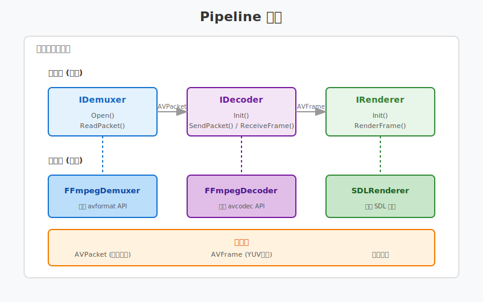
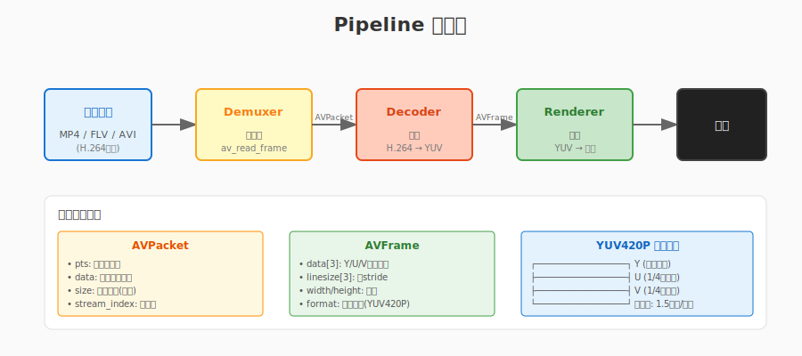

# 第三章：播放器工程化

> **本章目标**：将第二章的简单播放器重构为Pipeline架构，学习接口设计、模块化和CMake工程化。

第二章我们实现了一个能工作的播放器，但所有代码都堆在 `main` 函数里。这种写法在学习阶段没问题，但在实际项目中会遇到很多问题：

- **难以测试**：没有清晰的模块边界，单元测试无从下手
- **难以扩展**：加个功能要改多处，容易牵一发而动全身
- **难以复用**：代码和具体实现耦合，换个渲染库要重写大半

本章将教你如何用 **Pipeline 架构** 重构播放器，让代码更清晰、更易维护。

**阅读指南**：
- 第 1 节：理解为什么需要架构
- 第 2-5 节：学习接口设计和各模块实现
- 第 6 节：Pipeline组装与数据流转
- 第 7 节：CMake工程化实践

---

## 目录

1. [为什么需要架构？](#1-为什么需要架构)
2. [接口设计](#2-接口设计)
3. [FFmpegDemuxer实现](#3-ffmpegdemuxer实现)
4. [FFmpegDecoder实现](#4-ffmpegdecoder实现)
5. [SDLRenderer实现](#5-sdlrenderer实现)
6. [Pipeline组装](#6-pipeline组装)
7. [CMake工程化](#7-cmake工程化)
8. [本章总结](#8-本章总结)

---

## 1. 为什么需要架构？

### 1.1 简单播放器的问题

回顾第二章的代码，主要逻辑大概长这样：

```cpp
int main() {
    // 打开文件
    avformat_open_input(&fmt_ctx, argv[1], nullptr, nullptr);
    avformat_find_stream_info(fmt_ctx, nullptr);
    
    // 查找视频流
    int video_stream = av_find_best_stream(fmt_ctx, AVMEDIA_TYPE_VIDEO, ...);
    
    // 初始化解码器
    const AVCodec* codec = avcodec_find_decoder(...);
    AVCodecContext* codec_ctx = avcodec_alloc_context3(codec);
    avcodec_open2(codec_ctx, codec, nullptr);
    
    // 创建SDL窗口
    SDL_Init(SDL_INIT_VIDEO);
    SDL_Window* window = SDL_CreateWindow(...);
    SDL_Renderer* renderer = SDL_CreateRenderer(...);
    SDL_Texture* texture = SDL_CreateTexture(...);
    
    // 解码循环
    while (av_read_frame(fmt_ctx, packet) >= 0) {
        avcodec_send_packet(codec_ctx, packet);
        while (avcodec_receive_frame(codec_ctx, frame) == 0) {
            SDL_UpdateYUVTexture(texture, ...);
            SDL_RenderCopy(renderer, texture, ...);
            SDL_RenderPresent(renderer);
        }
    }
    
    // 清理
    // ... 十几行清理代码
}
```

**问题一：职责混乱**

一个函数做了太多事：文件打开、流解析、解码器初始化、窗口创建、渲染、资源清理。这种"上帝函数"难以理解和维护。

**问题二：难以测试**

想测试解码逻辑？必须先创建SDL窗口。想测试渲染？必须先有解码器。模块之间紧耦合，无法独立测试。

**问题三：难以扩展**

- 想支持音频？在循环里加更多分支
- 想换用OpenGL渲染？重写main函数
- 想支持硬件解码？到处改代码

### 1.2 Pipeline架构的优势

Pipeline架构的核心思想：**把播放流程拆分为独立的阶段，每个阶段只关注一件事**。

```
输入文件 → [解封装] → [解码] → [渲染] → 屏幕
              ↑          ↑         ↑
          Demuxer   Decoder   Renderer
```

**对比**:

| 特性 | 简单播放器 | Pipeline架构 |
|:---|:---|:---|
| 代码组织 | 混杂在一起 | 模块化分离 |
| 单元测试 | 难以测试 | 每个模块可独立测试 |
| 功能扩展 | 牵一发而动全身 | 新增模块即可 |
| 复用性 | 几乎无法复用 | 模块可在其他项目复用 |
| 团队协作 | 容易冲突 | 每人负责一个模块 |

### 1.3 本章架构图



```
┌─────────────────────────────────────────────────────────────┐
│                      Pipeline 架构                           │
├─────────────────────────────────────────────────────────────┤
│                                                             │
│  ┌─────────────┐    ┌─────────────┐    ┌─────────────┐     │
│  │  IDemuxer   │───→│  IDecoder   │───→│  IRenderer  │     │
│  │  (接口)     │    │  (接口)     │    │  (接口)     │     │
│  └──────┬──────┘    └──────┬──────┘    └──────┬──────┘     │
│         │                  │                  │            │
│  ┌──────▼──────┐    ┌──────▼──────┐    ┌──────▼──────┐     │
│  │FFmpegDemuxer│    │FFmpegDecoder│    │ SDLRenderer │     │
│  │  (实现)     │    │  (实现)     │    │  (实现)     │     │
│  └─────────────┘    └─────────────┘    └─────────────┘     │
│                                                             │
│  AVPacket           AVFrame            YUV → 屏幕          │
│  (压缩数据)         (原始图像)                              │
│                                                             │
└─────────────────────────────────────────────────────────────┘
```

**数据流转**:
1. **FFmpegDemuxer** 从文件读取 `AVPacket`（压缩数据）
2. **FFmpegDecoder** 将 `AVPacket` 解码为 `AVFrame`（YUV图像）
3. **SDLRenderer** 将 `AVFrame` 渲染到屏幕

**核心原则**:
- **面向接口编程**：上层代码只依赖接口，不依赖具体实现
- **单一职责**：每个类只做一件事
- **依赖倒置**：高层模块不依赖低层模块，都依赖抽象接口

---

## 2. 接口设计

### 2.1 设计原则

接口是模块之间的契约。好的接口应该：

1. **简单**：只暴露必要的操作
2. **清晰**：命名直观，一看就懂
3. **稳定**：一旦确定，尽量不改
4. **可测试**：接口设计时要考虑如何 mock

### 2.2 IDemuxer接口

解封装器负责从文件/URL读取压缩数据：

```cpp
// include/live/idemuxer.h
#pragma once

#include <string>
#include <memory>

// FFmpeg前向声明
struct AVPacket;
struct AVCodecParameters;

namespace live {

// 错误码（简单版本，实际项目可扩展）
enum class ErrorCode {
    OK = 0,
    FileNotFound,
    OpenFailed,
    ReadError,
    EndOfFile,
    Unknown
};

// 解封装器接口
class IDemuxer {
public:
    virtual ~IDemuxer() = default;
    
    // 打开文件/URL
    // @param url: 文件路径或网络URL
    // @return: 成功返回OK，失败返回错误码
    virtual ErrorCode Open(const std::string& url) = 0;
    
    // 读取一个压缩数据包
    // @param packet: 输出参数，调用者负责分配和释放
    // @return: OK(成功), EndOfFile(文件结束), ReadError(读取错误)
    virtual ErrorCode ReadPacket(AVPacket* packet) = 0;
    
    // 获取视频流参数（用于初始化解码器）
    // @return: 视频流参数，调用者不应释放
    virtual const AVCodecParameters* GetVideoParams() const = 0;
    
    // 获取视频时长（毫秒）
    virtual int64_t GetDurationMs() const = 0;
    
    // 关闭并释放资源
    virtual void Close() = 0;
};

// 智能指针类型
using IDemuxerPtr = std::unique_ptr<IDemuxer>;

} // namespace live
```

**设计要点**:
- `Open` / `Close` 成对出现，资源管理清晰
- `ReadPacket` 是核心操作，每次返回一个压缩包
- `GetVideoParams` 返回解码器需要的参数
- 使用 `ErrorCode` 而非异常，符合FFmpeg风格

### 2.3 IDecoder接口

解码器负责将压缩数据解码为原始图像：

```cpp
// include/live/idecoder.h
#pragma once

#include "idemuxer.h"

struct AVPacket;
struct AVFrame;
struct AVCodecParameters;

namespace live {

// 解码器接口
class IDecoder {
public:
    virtual ~IDecoder() = default;
    
    // 初始化解码器
    // @param params: 从demuxer获取的编解码器参数
    // @param thread_count: 解码线程数（0表示自动）
    // @return: 成功返回OK
    virtual ErrorCode Init(const AVCodecParameters* params, 
                           int thread_count = 0) = 0;
    
    // 发送压缩数据到解码器
    // @param packet: 压缩数据，nullptr表示刷新（文件结尾时）
    // @return: OK(成功), 其他(错误)
    virtual ErrorCode SendPacket(const AVPacket* packet) = 0;
    
    // 接收解码后的帧
    // @param frame: 输出参数，调用者负责分配
    // @return: OK(成功), EAGAIN(需要更多输入), EOF(解码完成)
    virtual ErrorCode ReceiveFrame(AVFrame* frame) = 0;
    
    // 获取视频宽高
    virtual int GetWidth() const = 0;
    virtual int GetHeight() const = 0;
    
    // 关闭解码器
    virtual void Close() = 0;
};

using IDecoderPtr = std::unique_ptr<IDecoder>;

} // namespace live
```

**设计要点**:
- `SendPacket` / `ReceiveFrame` 分离，支持异步解码
- `SendPacket(nullptr)` 是FFmpeg标准刷新方式
- 支持多线程解码配置

### 2.4 IRenderer接口

渲染器负责将图像显示到屏幕：

```cpp
// include/live/irenderer.h
#pragma once

#include "idemuxer.h"

struct AVFrame;

namespace live {

// 渲染器接口
class IRenderer {
public:
    virtual ~IRenderer() = default;
    
    // 初始化渲染器（创建窗口等）
    // @param width: 视频宽度
    // @param height: 视频高度
    // @param title: 窗口标题
    // @return: 成功返回OK
    virtual ErrorCode Init(int width, int height, 
                           const std::string& title) = 0;
    
    // 渲染一帧
    // @param frame: 解码后的图像帧
    // @return: 成功返回OK
    virtual ErrorCode RenderFrame(const AVFrame* frame) = 0;
    
    // 处理窗口事件（返回false表示用户请求退出）
    virtual bool PollEvents() = 0;
    
    // 等待垂直同步
    virtual void Present() = 0;
    
    // 关闭渲染器
    virtual void Close() = 0;
};

using IRendererPtr = std::unique_ptr<IRenderer>;

} // namespace live
```

**设计要点**:
- `RenderFrame` 只负责上传图像，不处理窗口事件
- `PollEvents` 单独抽离，让主循环控制节奏
- `Present` 明确区分上传和显示（支持双缓冲）

### 2.5 IPipeline接口

Pipeline负责组装各个模块并驱动数据流转：

```cpp
// include/live/ipipeline.h
#pragma once

#include "idemuxer.h"
#include "idecoder.h"
#include "irenderer.h"

namespace live {

// Pipeline配置
struct PipelineConfig {
    std::string url;           // 播放地址
    int decode_threads = 0;    // 解码线程数（0=自动）
    int video_width = 0;       // 强制窗口宽度（0=按视频）
    int video_height = 0;      // 强制窗口高度（0=按视频）
};

// Pipeline接口
class IPipeline {
public:
    virtual ~IPipeline() = default;
    
    // 初始化Pipeline
    virtual ErrorCode Init(const PipelineConfig& config) = 0;
    
    // 开始播放（阻塞直到播放结束）
    virtual ErrorCode Run() = 0;
    
    // 请求停止播放（异步，Run会尽快返回）
    virtual void RequestStop() = 0;
    
    // 获取播放统计
    virtual int64_t GetPlayedFrames() const = 0;
    virtual int64_t GetDroppedFrames() const = 0;
};

using IPipelinePtr = std::unique_ptr<IPipeline>;

} // namespace live
```

**设计要点**:
- `Init` 只初始化，不开始播放
- `Run` 是阻塞的，简化调用方逻辑
- `RequestStop` 实现优雅退出

---

## 3. FFmpegDemuxer实现

### 3.1 类定义

```cpp
// include/live/ffmpeg_demuxer.h
#pragma once

#include "live/idemuxer.h"

extern "C" {
#include <libavformat/avformat.h>
}

namespace live {

class FFmpegDemuxer : public IDemuxer {
public:
    FFmpegDemuxer();
    ~FFmpegDemuxer() override;
    
    // 禁止拷贝
    FFmpegDemuxer(const FFmpegDemuxer&) = delete;
    FFmpegDemuxer& operator=(const FFmpegDemuxer&) = delete;

    ErrorCode Open(const std::string& url) override;
    ErrorCode ReadPacket(AVPacket* packet) override;
    const AVCodecParameters* GetVideoParams() const override;
    int64_t GetDurationMs() const override;
    void Close() override;

private:
    AVFormatContext* fmt_ctx_ = nullptr;
    int video_stream_index_ = -1;
    bool opened_ = false;
};

} // namespace live
```

### 3.2 实现代码

```cpp
// src/ffmpeg_demuxer.cpp
#include "live/ffmpeg_demuxer.h"
#include <cstdio>

namespace live {

FFmpegDemuxer::FFmpegDemuxer() = default;

FFmpegDemuxer::~FFmpegDemuxer() {
    Close();
}

ErrorCode FFmpegDemuxer::Open(const std::string& url) {
    // 1. 打开输入文件
    int ret = avformat_open_input(&fmt_ctx_, url.c_str(), nullptr, nullptr);
    if (ret < 0) {
        char errbuf[256];
        av_strerror(ret, errbuf, sizeof(errbuf));
        printf("[FFmpegDemuxer] Failed to open '%s': %s\n", url.c_str(), errbuf);
        return ErrorCode::FileNotFound;
    }
    
    // 2. 获取流信息
    ret = avformat_find_stream_info(fmt_ctx_, nullptr);
    if (ret < 0) {
        printf("[FFmpegDemuxer] Failed to find stream info\n");
        Close();
        return ErrorCode::OpenFailed;
    }
    
    // 3. 查找视频流
    video_stream_index_ = av_find_best_stream(
        fmt_ctx_, AVMEDIA_TYPE_VIDEO, -1, -1, nullptr, 0);
    
    if (video_stream_index_ < 0) {
        printf("[FFmpegDemuxer] No video stream found\n");
        Close();
        return ErrorCode::OpenFailed;
    }
    
    // 4. 打印信息
    AVStream* stream = fmt_ctx_->streams[video_stream_index_];
    printf("[FFmpegDemuxer] Opened: %s\n", url.c_str());
    printf("[FFmpegDemuxer] Video: %dx%d @ %.2f fps, "
           "duration=%.2fs\n",
           stream->codecpar->width,
           stream->codecpar->height,
           av_q2d(stream->avg_frame_rate),
           GetDurationMs() / 1000.0);
    
    opened_ = true;
    return ErrorCode::OK;
}

ErrorCode FFmpegDemuxer::ReadPacket(AVPacket* packet) {
    if (!opened_ || !fmt_ctx_) {
        return ErrorCode::ReadError;
    }
    
    // 循环读取，直到读到视频包或文件结束
    while (true) {
        int ret = av_read_frame(fmt_ctx_, packet);
        
        if (ret == AVERROR_EOF) {
            return ErrorCode::EndOfFile;
        }
        if (ret < 0) {
            return ErrorCode::ReadError;
        }
        
        // 只返回视频流的数据包
        if (packet->stream_index == video_stream_index_) {
            return ErrorCode::OK;
        }
        
        // 跳过非视频包（音频、字幕等）
        av_packet_unref(packet);
    }
}

const AVCodecParameters* FFmpegDemuxer::GetVideoParams() const {
    if (!opened_ || video_stream_index_ < 0 || !fmt_ctx_) {
        return nullptr;
    }
    return fmt_ctx_->streams[video_stream_index_]->codecpar;
}

int64_t FFmpegDemuxer::GetDurationMs() const {
    if (!fmt_ctx_) return 0;
    
    // AV_TIME_BASE = 1000000（微秒）
    return fmt_ctx_->duration * 1000 / AV_TIME_BASE;
}

void FFmpegDemuxer::Close() {
    if (fmt_ctx_) {
        avformat_close_input(&fmt_ctx_);
        fmt_ctx_ = nullptr;
    }
    video_stream_index_ = -1;
    opened_ = false;
}

} // namespace live
```

### 3.3 关键代码解析

**avformat_open_input**:
```cpp
int avformat_open_input(AVFormatContext **ps, const char *url, 
                        AVInputFormat *fmt, AVDictionary **options);
```
- 自动检测文件格式（MP4、FLV、AVI等）
- 初始化解封装器
- 分配 `AVFormatContext`

**av_find_best_stream**:
```cpp
int av_find_best_stream(AVFormatContext *ic, enum AVMediaType type,
                        int wanted_stream_nb, int related_stream,
                        const AVCodec **decoder_ret, int flags);
```
- 找到指定类型的"最佳"流
- 对于视频，通常选分辨率最高的
- 返回流的索引号

**只返回视频包**:
```cpp
if (packet->stream_index == video_stream_index_) {
    return ErrorCode::OK;
}
av_packet_unref(packet);  // 释放非视频包
```

这是简化版的处理，实际播放器可能需要同时处理音频。

---

## 4. FFmpegDecoder实现

### 4.1 类定义

```cpp
// include/live/ffmpeg_decoder.h
#pragma once

#include "live/idecoder.h"

extern "C" {
#include <libavcodec/avcodec.h>
}

namespace live {

class FFmpegDecoder : public IDecoder {
public:
    FFmpegDecoder();
    ~FFmpegDecoder() override;
    
    FFmpegDecoder(const FFmpegDecoder&) = delete;
    FFmpegDecoder& operator=(const FFmpegDecoder&) = delete;

    ErrorCode Init(const AVCodecParameters* params, 
                   int thread_count = 0) override;
    ErrorCode SendPacket(const AVPacket* packet) override;
    ErrorCode ReceiveFrame(AVFrame* frame) override;
    int GetWidth() const override;
    int GetHeight() const override;
    void Close() override;

private:
    AVCodecContext* codec_ctx_ = nullptr;
    const AVCodec* codec_ = nullptr;
    bool initialized_ = false;
};

} // namespace live
```

### 4.2 实现代码

```cpp
// src/ffmpeg_decoder.cpp
#include "live/ffmpeg_decoder.h"
#include <cstdio>

namespace live {

FFmpegDecoder::FFmpegDecoder() = default;

FFmpegDecoder::~FFmpegDecoder() {
    Close();
}

ErrorCode FFmpegDecoder::Init(const AVCodecParameters* params, 
                               int thread_count) {
    if (!params) {
        return ErrorCode::OpenFailed;
    }
    
    // 1. 查找解码器
    codec_ = avcodec_find_decoder(params->codec_id);
    if (!codec_) {
        printf("[FFmpegDecoder] Codec not found for id=%d\n", 
               params->codec_id);
        return ErrorCode::OpenFailed;
    }
    
    printf("[FFmpegDecoder] Using codec: %s\n", codec_->name);
    
    // 2. 分配解码器上下文
    codec_ctx_ = avcodec_alloc_context3(codec_);
    if (!codec_ctx_) {
        return ErrorCode::OpenFailed;
    }
    
    // 3. 复制参数到上下文
    int ret = avcodec_parameters_to_context(codec_ctx_, params);
    if (ret < 0) {
        printf("[FFmpegDecoder] Failed to copy codec params\n");
        Close();
        return ErrorCode::OpenFailed;
    }
    
    // 4. 配置多线程解码
    if (thread_count > 0) {
        codec_ctx_->thread_count = thread_count;
        codec_ctx_->thread_type = FF_THREAD_FRAME;  // 帧级多线程
    } else {
        // 自动选择线程数
        codec_ctx_->thread_count = 0;
    }
    
    // 5. 打开解码器
    ret = avcodec_open2(codec_ctx_, codec_, nullptr);
    if (ret < 0) {
        char errbuf[256];
        av_strerror(ret, errbuf, sizeof(errbuf));
        printf("[FFmpegDecoder] Failed to open codec: %s\n", errbuf);
        Close();
        return ErrorCode::OpenFailed;
    }
    
    printf("[FFmpegDecoder] Initialized: %dx%d, threads=%d\n",
           GetWidth(), GetHeight(), codec_ctx_->thread_count);
    
    initialized_ = true;
    return ErrorCode::OK;
}

ErrorCode FFmpegDecoder::SendPacket(const AVPacket* packet) {
    if (!initialized_ || !codec_ctx_) {
        return ErrorCode::ReadError;
    }
    
    int ret = avcodec_send_packet(codec_ctx_, packet);
    
    if (ret == 0) {
        return ErrorCode::OK;
    } else if (ret == AVERROR(EAGAIN)) {
        // 需要ReceiveFrame后再发送，不算错误
        return ErrorCode::OK;
    } else if (ret == AVERROR_EOF) {
        return ErrorCode::EndOfFile;
    } else {
        return ErrorCode::ReadError;
    }
}

ErrorCode FFmpegDecoder::ReceiveFrame(AVFrame* frame) {
    if (!initialized_ || !codec_ctx_) {
        return ErrorCode::ReadError;
    }
    
    int ret = avcodec_receive_frame(codec_ctx_, frame);
    
    if (ret == 0) {
        return ErrorCode::OK;
    } else if (ret == AVERROR(EAGAIN)) {
        // 需要更多输入数据
        return ErrorCode::OK;  // 或者返回特殊码表示"需要更多数据"
    } else if (ret == AVERROR_EOF) {
        return ErrorCode::EndOfFile;
    } else {
        return ErrorCode::ReadError;
    }
}

int FFmpegDecoder::GetWidth() const {
    return codec_ctx_ ? codec_ctx_->width : 0;
}

int FFmpegDecoder::GetHeight() const {
    return codec_ctx_ ? codec_ctx_->height : 0;
}

void FFmpegDecoder::Close() {
    if (codec_ctx_) {
        avcodec_free_context(&codec_ctx_);
        codec_ctx_ = nullptr;
    }
    codec_ = nullptr;
    initialized_ = false;
}

} // namespace live
```

### 4.3 多线程解码配置

FFmpeg支持两种多线程模式：

| 模式 | 设置 | 说明 |
|:---|:---|:---|
| **帧级多线程** | `FF_THREAD_FRAME` | 同时解码多帧，适合高延迟场景 |
| **切片级多线程** | `FF_THREAD_SLICE` | 单帧内并行，适合低延迟场景 |

```cpp
// 启用4线程帧级解码
codec_ctx_->thread_count = 4;
codec_ctx_->thread_type = FF_THREAD_FRAME;

// 效果对比（1080p H.264）：
// 单线程：25ms/帧 → 40fps
codec_ctx_->thread_count = 1;

// 4线程：8ms/帧 → 125fps
codec_ctx_->thread_count = 4;
```

### 4.4 解码流程详解

FFmpeg的异步解码API（send/receive模式）：

```
循环:
  1. 读取AVPacket（从文件）
  2. avcodec_send_packet(codec_ctx, packet) → 送入解码器
  3. 循环 avcodec_receive_frame(codec_ctx, frame):
       - 返回 0：成功获取一帧，渲染它
       - 返回 EAGAIN：解码器缓冲区空，需要更多输入
       - 返回 EOF：所有帧已取出
```

**为什么一个packet可能产生多个frame？**

某些编码格式（如H.264的B帧）会重新排序帧。解码器可能缓存多个packet才输出frame。

---

## 5. SDLRenderer实现

### 5.1 类定义

```cpp
// include/live/sdl_renderer.h
#pragma once

#include "live/irenderer.h"
#include <SDL2/SDL.h>

namespace live {

class SDLRenderer : public IRenderer {
public:
    SDLRenderer();
    ~SDLRenderer() override;
    
    SDLRenderer(const SDLRenderer&) = delete;
    SDLRenderer& operator=(const SDLRenderer&) = delete;

    ErrorCode Init(int width, int height, 
                   const std::string& title) override;
    ErrorCode RenderFrame(const AVFrame* frame) override;
    bool PollEvents() override;
    void Present() override;
    void Close() override;

private:
    SDL_Window* window_ = nullptr;
    SDL_Renderer* renderer_ = nullptr;
    SDL_Texture* texture_ = nullptr;
    int width_ = 0;
    int height_ = 0;
    bool initialized_ = false;
};

} // namespace live
```

### 5.2 实现代码

```cpp
// src/sdl_renderer.cpp
#include "live/sdl_renderer.h"
#include <cstdio>

extern "C" {
#include <libavutil/imgutils.h>
}

namespace live {

SDLRenderer::SDLRenderer() = default;

SDLRenderer::~SDLRenderer() {
    Close();
}

ErrorCode SDLRenderer::Init(int width, int height, 
                             const std::string& title) {
    width_ = width;
    height_ = height;
    
    // 1. 初始化SDL视频子系统
    if (SDL_Init(SDL_INIT_VIDEO) < 0) {
        printf("[SDLRenderer] SDL_Init failed: %s\n", SDL_GetError());
        return ErrorCode::OpenFailed;
    }
    
    // 2. 创建窗口
    window_ = SDL_CreateWindow(
        title.c_str(),
        SDL_WINDOWPOS_CENTERED,
        SDL_WINDOWPOS_CENTERED,
        width,
        height,
        SDL_WINDOW_SHOWN | SDL_WINDOW_RESIZABLE
    );
    
    if (!window_) {
        printf("[SDLRenderer] CreateWindow failed: %s\n", SDL_GetError());
        return ErrorCode::OpenFailed;
    }
    
    // 3. 创建渲染器（硬件加速 + 垂直同步）
    renderer_ = SDL_CreateRenderer(
        window_,
        -1,  // 自动选择驱动
        SDL_RENDERER_ACCELERATED | SDL_RENDERER_PRESENTVSYNC
    );
    
    if (!renderer_) {
        printf("[SDLRenderer] CreateRenderer failed: %s\n", SDL_GetError());
        // 回退到软件渲染
        renderer_ = SDL_CreateRenderer(window_, -1, SDL_RENDERER_SOFTWARE);
        if (!renderer_) {
            return ErrorCode::OpenFailed;
        }
    }
    
    // 4. 创建YUV纹理
    // SDL_PIXELFORMAT_IYUV = Y + U + V（平面格式）
    texture_ = SDL_CreateTexture(
        renderer_,
        SDL_PIXELFORMAT_IYUV,
        SDL_TEXTUREACCESS_STREAMING,
        width,
        height
    );
    
    if (!texture_) {
        printf("[SDLRenderer] CreateTexture failed: %s\n", SDL_GetError());
        return ErrorCode::OpenFailed;
    }
    
    printf("[SDLRenderer] Initialized: %dx%d\n", width, height);
    initialized_ = true;
    return ErrorCode::OK;
}

ErrorCode SDLRenderer::RenderFrame(const AVFrame* frame) {
    if (!initialized_ || !frame) {
        return ErrorCode::ReadError;
    }
    
    // 更新YUV纹理
    // FFmpeg的AVFrame是YUV420P（Y,U,V分开）
    // SDL的IYUV也是Y,U,V分开，格式匹配
    int ret = SDL_UpdateYUVTexture(
        texture_,
        nullptr,  // 更新整个纹理
        frame->data[0],      // Y平面
        frame->linesize[0],  // Y stride
        frame->data[1],      // U平面
        frame->linesize[1],  // U stride
        frame->data[2],      // V平面
        frame->linesize[2]   // V stride
    );
    
    if (ret != 0) {
        printf("[SDLRenderer] UpdateYUVTexture failed: %s\n", SDL_GetError());
        return ErrorCode::ReadError;
    }
    
    // 清除画布并复制纹理
    SDL_RenderClear(renderer_);
    SDL_RenderCopy(renderer_, texture_, nullptr, nullptr);
    
    return ErrorCode::OK;
}

bool SDLRenderer::PollEvents() {
    SDL_Event event;
    while (SDL_PollEvent(&event)) {
        if (event.type == SDL_QUIT) {
            return false;  // 用户关闭窗口
        }
        if (event.type == SDL_KEYDOWN) {
            if (event.key.keysym.sym == SDLK_ESCAPE) {
                return false;  // 按ESC退出
            }
        }
    }
    return true;
}

void SDLRenderer::Present() {
    if (renderer_) {
        SDL_RenderPresent(renderer_);
    }
}

void SDLRenderer::Close() {
    if (texture_) {
        SDL_DestroyTexture(texture_);
        texture_ = nullptr;
    }
    if (renderer_) {
        SDL_DestroyRenderer(renderer_);
        renderer_ = nullptr;
    }
    if (window_) {
        SDL_DestroyWindow(window_);
        window_ = nullptr;
    }
    SDL_Quit();
    initialized_ = false;
    printf("[SDLRenderer] Closed\n");
}

} // namespace live
```

### 5.3 SDL纹理格式说明

SDL支持多种YUV格式：

| SDL格式 | FFmpeg对应 | 说明 |
|:---|:---|:---|
| `SDL_PIXELFORMAT_IYUV` | `AV_PIX_FMT_YUV420P` | YUV420平面，最常用 |
| `SDL_PIXELFORMAT_YV12` | `AV_PIX_FMT_YUV420P` | YVU420平面（V,U互换）|
| `SDL_PIXELFORMAT_NV12` | `AV_PIX_FMT_NV12` | Y平面 + UV交错 |

**格式不匹配时的处理**:
```cpp
// 如果FFmpeg输出不是YUV420P，需要用sws_scale转换
#include <libswscale/swscale.h>

SwsContext* sws_ctx = sws_getContext(
    src_w, src_h, src_format,      // 源格式
    dst_w, dst_h, AV_PIX_FMT_YUV420P,  // 目标格式
    SWS_BILINEAR, nullptr, nullptr, nullptr);

sws_scale(sws_ctx, src_data, src_linesize, 0, src_h,
          dst_data, dst_linesize);
```

---

## 6. Pipeline组装

### 6.1 类定义

```cpp
// include/live/player_pipeline.h
#pragma once

#include "live/ipipeline.h"
#include "live/idemuxer.h"
#include "live/idecoder.h"
#include "live/irenderer.h"

namespace live {

// 简单的Pipeline实现
class PlayerPipeline : public IPipeline {
public:
    PlayerPipeline();
    ~PlayerPipeline() override;
    
    // 可以注入自定义模块（用于测试）
    PlayerPipeline(IDemuxerPtr demuxer, IDecoderPtr decoder, 
                   IRendererPtr renderer);

    ErrorCode Init(const PipelineConfig& config) override;
    ErrorCode Run() override;
    void RequestStop() override;
    int64_t GetPlayedFrames() const override;
    int64_t GetDroppedFrames() const override;

private:
    IDemuxerPtr demuxer_;
    IDecoderPtr decoder_;
    IRendererPtr renderer_;
    
    PipelineConfig config_;
    std::atomic<bool> stop_requested_{false};
    std::atomic<int64_t> played_frames_{0};
    std::atomic<int64_t> dropped_frames_{0};
    bool initialized_ = false;
};

} // namespace live
```

### 6.2 实现代码

```cpp
// src/player_pipeline.cpp
#include "live/player_pipeline.h"
#include "live/ffmpeg_demuxer.h"
#include "live/ffmpeg_decoder.h"
#include "live/sdl_renderer.h"
#include <cstdio>
#include <thread>

extern "C" {
#include <libavutil/time.h>
}

namespace live {

PlayerPipeline::PlayerPipeline() = default;

PlayerPipeline::~PlayerPipeline() {
    // 资源由智能指针自动释放
}

PlayerPipeline::PlayerPipeline(IDemuxerPtr demuxer, IDecoderPtr decoder, 
                                IRendererPtr renderer)
    : demuxer_(std::move(demuxer))
    , decoder_(std::move(decoder))
    , renderer_(std::move(renderer)) {
}

ErrorCode PlayerPipeline::Init(const PipelineConfig& config) {
    config_ = config;
    
    // 1. 创建默认模块（如果没有注入）
    if (!demuxer_) {
        demuxer_ = std::make_unique<FFmpegDemuxer>();
    }
    if (!decoder_) {
        decoder_ = std::make_unique<FFmpegDecoder>();
    }
    if (!renderer_) {
        renderer_ = std::make_unique<SDLRenderer>();
    }
    
    // 2. 初始化Demuxer
    ErrorCode ret = demuxer_->Open(config.url);
    if (ret != ErrorCode::OK) {
        return ret;
    }
    
    // 3. 初始化解码器
    const AVCodecParameters* params = demuxer_->GetVideoParams();
    ret = decoder_->Init(params, config.decode_threads);
    if (ret != ErrorCode::OK) {
        return ret;
    }
    
    // 4. 初始化渲染器
    int width = config.video_width > 0 ? config.video_width : decoder_->GetWidth();
    int height = config.video_height > 0 ? config.video_height : decoder_->GetHeight();
    ret = renderer_->Init(width, height, "Player - Chapter 03");
    if (ret != ErrorCode::OK) {
        return ret;
    }
    
    printf("[Pipeline] Initialized successfully\n");
    initialized_ = true;
    return ErrorCode::OK;
}

ErrorCode PlayerPipeline::Run() {
    if (!initialized_) {
        return ErrorCode::OpenFailed;
    }
    
    printf("[Pipeline] Starting playback...\n");
    
    // 分配AVPacket和AVFrame
    AVPacket* packet = av_packet_alloc();
    AVFrame* frame = av_frame_alloc();
    
    int64_t start_time = av_gettime();  // 微秒
    stop_requested_ = false;
    
    // 主循环
    while (!stop_requested_) {
        // 1. 处理窗口事件
        if (!renderer_->PollEvents()) {
            printf("[Pipeline] User requested exit\n");
            break;
        }
        
        // 2. 读取压缩数据
        ErrorCode ret = demuxer_->ReadPacket(packet);
        if (ret == ErrorCode::EndOfFile) {
            printf("[Pipeline] End of file reached\n");
            break;
        }
        if (ret != ErrorCode::OK) {
            printf("[Pipeline] Read error\n");
            break;
        }
        
        // 3. 送入解码器
        ret = decoder_->SendPacket(packet);
        if (ret != ErrorCode::OK) {
            printf("[Pipeline] Send packet failed\n");
            break;
        }
        av_packet_unref(packet);
        
        // 4. 接收解码后的帧（一个packet可能产生多个frame）
        while (true) {
            ret = decoder_->ReceiveFrame(frame);
            if (ret == ErrorCode::EndOfFile) {
                break;
            }
            if (ret != ErrorCode::OK) {
                // 需要更多数据
                break;
            }
            
            // 5. 同步（根据PTS控制播放速度）
            if (frame->pts != AV_NOPTS_VALUE) {
                // 简单同步：假设30fps
                int64_t frame_duration = 33333;  // 33.3ms
                int64_t target_time = start_time + (played_frames_ * frame_duration);
                int64_t now = av_gettime();
                if (target_time > now) {
                    av_usleep(target_time - now);
                }
            }
            
            // 6. 渲染
            renderer_->RenderFrame(frame);
            renderer_->Present();
            
            played_frames_++;
        }
    }
    
    // 刷新解码器（取出缓冲的帧）
    decoder_->SendPacket(nullptr);
    while (decoder_->ReceiveFrame(frame) == ErrorCode::OK) {
        renderer_->RenderFrame(frame);
        renderer_->Present();
        played_frames_++;
    }
    
    // 清理
    av_frame_free(&frame);
    av_packet_free(&packet);
    
    // 关闭所有模块
    renderer_->Close();
    decoder_->Close();
    demuxer_->Close();
    
    printf("[Pipeline] Playback finished. Total frames: %ld\n", 
           played_frames_.load());
    
    return ErrorCode::OK;
}

void PlayerPipeline::RequestStop() {
    printf("[Pipeline] Stop requested\n");
    stop_requested_ = true;
}

int64_t PlayerPipeline::GetPlayedFrames() const {
    return played_frames_.load();
}

int64_t PlayerPipeline::GetDroppedFrames() const {
    return dropped_frames_.load();
}

} // namespace live
```

### 6.3 数据流转图



```
┌───────────┐    ReadPacket()    ┌───────────┐
│  文件     │ ─────────────────→ │  Demuxer  │
│ (MP4等)   │                    │           │
└───────────┘                    └─────┬─────┘
                                       │ AVPacket
                                       │ (压缩数据)
                                       ↓
┌───────────┐    SendPacket()    ┌───────────┐
│           │ ←───────────────── │  Decoder  │
│           │                    │           │
│           │    ReceiveFrame()  │           │
│  YUV帧    │ ←───────────────── │           │
│           │                    └─────┬─────┘
│           │                          │ AVFrame
│           │                          │ (原始图像)
│           │                          ↓
│           │    RenderFrame()   ┌───────────┐
│           │ ─────────────────→ │ Renderer  │
│           │                    │           │
│           │    Present()       │           │
│           │ ←───────────────── │           │
└───────────┘                    └───────────┘
```

### 6.4 优雅退出机制

```cpp
// 主线程调用
pipeline.RequestStop();  // 设置原子标志

// Run循环检查
while (!stop_requested_) {
    // ... 正常处理
}

// 确保资源正确释放：
// 1. 刷新解码器（取出缓冲的帧）
decoder_->SendPacket(nullptr);
while (decoder_->ReceiveFrame(frame) == ErrorCode::OK) {
    renderer_->RenderFrame(frame);
}

// 2. 关闭各模块
renderer_->Close();
decoder_->Close();
demuxer_->Close();
```

---

## 7. CMake工程化

### 7.1 项目目录结构

```
chapter-03/
├── CMakeLists.txt          # 主CMake配置
├── README.md               # 本章文档
├── include/
│   └── live/               # 公共头文件
│       ├── idemuxer.h
│       ├── idecoder.h
│       ├── irenderer.h
│       ├── ipipeline.h
│       ├── ffmpeg_demuxer.h
│       ├── ffmpeg_decoder.h
│       ├── sdl_renderer.h
│       └── player_pipeline.h
├── src/
│   ├── main.cpp            # 程序入口
│   ├── ffmpeg_demuxer.cpp
│   ├── ffmpeg_decoder.cpp
│   ├── sdl_renderer.cpp
│   └── player_pipeline.cpp
└── docs/
    └── images/             # SVG图表
        ├── pipeline-arch.svg
        └── data-flow.svg
```

### 7.2 完整CMakeLists.txt

```cmake
cmake_minimum_required(VERSION 3.14)
project(chapter03-player VERSION 3.0.0 LANGUAGES CXX)

# ============================================
# 1. 基本设置
# ============================================
set(CMAKE_CXX_STANDARD 14)
set(CMAKE_CXX_STANDARD_REQUIRED ON)
set(CMAKE_EXPORT_COMPILE_COMMANDS ON)  # 生成compile_commands.json

# 编译选项
if(CMAKE_BUILD_TYPE STREQUAL "Debug")
    add_compile_options(-g -O0 -Wall -Wextra -fsanitize=address)
    add_link_options(-fsanitize=address)
else()
    add_compile_options(-O3 -DNDEBUG -Wall)
endif()

# ============================================
# 2. 查找依赖
# ============================================
find_package(PkgConfig REQUIRED)
pkg_check_modules(FFMPEG REQUIRED
    libavformat>=58.0
    libavcodec>=58.0
    libavutil>=56.0
)
find_package(SDL2 REQUIRED)

# 打印找到的库信息（方便调试）
message(STATUS "FFmpeg include: ${FFMPEG_INCLUDE_DIRS}")
message(STATUS "FFmpeg libs: ${FFMPEG_LIBRARIES}")
message(STATUS "SDL2 include: ${SDL2_INCLUDE_DIRS}")

# ============================================
# 3. 库目标：player_core
# ============================================
add_library(player_core STATIC
    src/ffmpeg_demuxer.cpp
    src/ffmpeg_decoder.cpp
    src/sdl_renderer.cpp
    src/player_pipeline.cpp
)

# 头文件搜索路径
target_include_directories(player_core PUBLIC
    ${CMAKE_CURRENT_SOURCE_DIR}/include
    ${FFMPEG_INCLUDE_DIRS}
    ${SDL2_INCLUDE_DIRS}
)

# 链接库
target_link_libraries(player_core PUBLIC
    ${FFMPEG_LIBRARIES}
    SDL2::SDL2
)

# 编译选项
target_compile_options(player_core PRIVATE
    ${FFMPEG_CFLAGS_OTHER}
)

# ============================================
# 4. 可执行文件：player
# ============================================
add_executable(player src/main.cpp)

target_link_libraries(player PRIVATE
    player_core
)

# ============================================
# 5. 测试目标（可选）
# ============================================
option(BUILD_TESTS "Build tests" OFF)
if(BUILD_TESTS)
    enable_testing()
    # add_subdirectory(tests)
endif()

# ============================================
# 6. 安装规则
# ============================================
# 安装可执行文件
install(TARGETS player
    RUNTIME DESTINATION bin
)

# 安装库
install(TARGETS player_core
    ARCHIVE DESTINATION lib
    LIBRARY DESTINATION lib
)

# 安装头文件
install(DIRECTORY include/
    DESTINATION include
)

# ============================================
# 7. 打包配置
# ============================================
set(CPACK_PACKAGE_NAME "chapter03-player")
set(CPACK_PACKAGE_VERSION ${PROJECT_VERSION})
set(CPACK_PACKAGE_DESCRIPTION "Chapter 03: Pipeline Architecture Player")
include(CPack)

# ============================================
# 8. 使用说明输出
# ============================================
message(STATUS "")
message(STATUS "========== Chapter 03 Player ==========")
message(STATUS "Build type: ${CMAKE_BUILD_TYPE}")
message(STATUS "Install prefix: ${CMAKE_INSTALL_PREFIX}")
message(STATUS "")
message(STATUS "Build commands:")
message(STATUS "  mkdir build && cd build")
message(STATUS "  cmake .. -DCMAKE_BUILD_TYPE=Release")
message(STATUS "  make -j$(nproc)")
message(STATUS "  ./player <video_file>")
message(STATUS "======================================")
```

### 7.3 构建和使用

```bash
# 1. 创建构建目录
mkdir build && cd build

# 2. 配置（Debug模式）
cmake .. -DCMAKE_BUILD_TYPE=Debug

# 或 Release模式
cmake .. -DCMAKE_BUILD_TYPE=Release

# 3. 编译
make -j$(nproc)

# 4. 运行（需要测试视频）
ffmpeg -f lavfi -i testsrc=duration=5:size=640x480:rate=30 \
       -pix_fmt yuv420p test.mp4
./player test.mp4

# 5. 安装（可选）
sudo make install
```

### 7.4 多目标构建说明

CMake配置支持多种构建类型：

| 构建类型 | 编译选项 | 用途 |
|:---|:---|:---|
| Debug | `-g -O0 -fsanitize=address` | 开发和调试 |
| Release | `-O3 -DNDEBUG` | 正式发布 |
| RelWithDebInfo | `-O2 -g` | 带调试信息的发布版 |
| MinSizeRel | `-Os` | 最小体积 |

---

## 8. 本章总结

### 8.1 学到的内容

1. **架构设计原则**
   - 单一职责：每个类只做一件事
   - 接口隔离：依赖抽象而非具体实现
   - 模块解耦：易于测试和替换

2. **FFmpeg核心API**
   - `avformat_open_input` / `av_read_frame`：解封装
   - `avcodec_send_packet` / `avcodec_receive_frame`：异步解码
   - 多线程解码配置：`thread_count` / `thread_type`

3. **SDL2渲染**
   - YUV纹理直接上传，无需格式转换
   - 垂直同步防止画面撕裂
   - 事件循环处理用户输入

4. **CMake工程化**
   - 多目标构建（库 + 可执行文件）
   - 依赖查找（pkg-config）
   - 安装规则

### 8.2 架构对比

| 特性 | 第二章简单播放器 | 第三章Pipeline架构 |
|:---|:---|:---|
| 代码行数 | ~200行 | ~600行（更模块化）|
| 扩展性 | 差 | 好（新增模块即可）|
| 可测试性 | 几乎无法测试 | 每个模块可独立测试 |
| 维护成本 | 高 | 低 |
| 学习曲线 | 平缓 | 稍陡但值得 |

### 8.3 下一步

第四章将引入**网络播放**能力：
- HTTP下载和环形缓冲区
- 边下载边播放
- 断点续传和seek

架构上，我们将在Pipeline前增加 `NetworkSource` 模块：

```
网络URL → [NetworkSource] → [Demuxer] → [Decoder] → [Renderer]
              ↑
         HTTP下载 + 环形缓冲
```

---

## 附录：完整main.cpp

```cpp
// src/main.cpp
#include "live/player_pipeline.h"
#include <cstdio>

using namespace live;

void PrintUsage(const char* program) {
    printf("Usage: %s <video_file>\n", program);
    printf("Example: %s sample.mp4\n", program);
}

int main(int argc, char* argv[]) {
    if (argc < 2) {
        PrintUsage(argv[0]);
        return 1;
    }
    
    const char* filename = argv[1];
    printf("========================================\n");
    printf("Chapter 03: Pipeline Architecture\n");
    printf("File: %s\n", filename);
    printf("========================================\n\n");
    
    // 创建并初始化Pipeline
    PlayerPipeline pipeline;
    
    PipelineConfig config;
    config.url = filename;
    config.decode_threads = 4;  // 启用4线程解码
    
    ErrorCode ret = pipeline.Init(config);
    if (ret != ErrorCode::OK) {
        printf("Failed to initialize: %d\n", static_cast<int>(ret));
        return 1;
    }
    
    // 开始播放（阻塞直到结束）
    ret = pipeline.Run();
    if (ret != ErrorCode::OK) {
        printf("Playback error: %d\n", static_cast<int>(ret));
        return 1;
    }
    
    printf("\nTotal frames played: %ld\n", pipeline.GetPlayedFrames());
    printf("Bye!\n");
    
    return 0;
}
```
