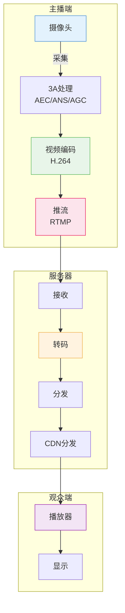

# 第10章：音视频采集

| 项目 | 内容 |
|:---|:---|
| **本章目标** | 掌握音视频采集的核心概念和实践 |
| **难度** | ⭐⭐⭐ 较高 |
| **前置知识** | Ch9：硬件解码、平台API |
| **预计时间** | 3-4 小时 |

> **本章引言**

> **本章目标**：实现音视频采集，从摄像头和麦克风获取原始数据。

前八章完成了观众端播放器（本地播放、异步、网络、RTMP 直播拉流）。从本章开始构建**主播端**。主播端的核心任务是**采集**——从硬件设备获取音视频原始数据。

**核心挑战**：
- 设备兼容性：不同摄像头参数差异大
- 音视频同步：画面和声音需要精确对齐
- 资源占用：采集+编码同时运行

**阅读指南**：
- 第 1-2 节：理解采集的作用，视频采集原理
- 第 3-4 节：跨平台视频采集实现，音频采集基础
- 第 5 节：音视频同步
- 第 6 节：采集参数配置
- 第 7 节：本章总结

> **注意**：音频 3A 处理（AEC/ANS/AGC）将在 [第十一章](../chapter-11/README.md) 详细介绍。

---

## 目录

1. [从播放到直播：采集的重要性](#1-从播放到直播采集的重要性)
2. [视频采集原理](#2-视频采集原理)
3. [跨平台视频采集实现](#3-跨平台视频采集实现)
4. [音频采集基础](#4-音频采集基础)
5. [音视频同步](#5-音视频同步)
6. [采集参数配置](#6-采集参数配置)
7. [本章总结](#7-本章总结)

---

## 1. 从播放到直播：采集的重要性

**本节概览**：回顾前五章内容，理解采集在直播系统中的位置和面临的挑战。



### 1.1 前五章回顾

```
前五章：播放器端（观众视角）
├── 本地文件播放
├── 网络下载播放
├── RTMP 直播拉流
└── 硬件解码

    ↓

第六章起：主播端（主播视角）
├── 音视频采集  ← 本章
├── 音频 3A 处理  ← 第十一章
├── 视频编码
├── RTMP 推流
└── 连麦互动
```

### 1.2 直播系统架构

```
┌─────────────────────────────────────────────────────────────┐
│                        直播系统架构                          │
├─────────────────────────────────────────────────────────────┤
│                                                             │
│    主播端                        服务器           观众端     │
│   ┌──────────┐                ┌─────────┐      ┌────────┐  │
│   │  摄像头  │──采集──→       │  接收   │      │        │  │
│   │  麦克风  │──采集──→       │  转码   │←─────│ 播放器 │  │
│   └──────────┘                │  分发   │      │        │  │
│       ↓                       └────┬────┘      └────────┘  │
│   ┌──────────┐                     │                       │
│   │ 3A处理   │                     ↓                       │
│   │ AEC/ANS  │                CDN 分发                      │
│   │ AGC      │                     │                       │
│   └──────────┘                     ↓                       │
│       ↓                       ┌─────────┐                  │
│   ┌──────────┐                │ 观众 1  │                  │
│   │ 视频编码 │──推流──→       │ 观众 2  │                  │
│   │ H.264   │                │ 观众 N  │                  │
│   └──────────┘                └─────────┘                  │
│                                                             │
└─────────────────────────────────────────────────────────────┘
```

### 1.3 采集面临的挑战

| 挑战 | 影响 | 解决方案 |
|:---|:---|:---|
| **设备兼容性** | 不同摄像头参数差异大 | 统一抽象接口（FFmpeg） |
| **回声问题** | 扬声器声音被麦克风采集 | [AEC 回声消除](../chapter-11/README.md#2-回声消除aec原理) |
| **环境噪声** | 键盘声、空调声干扰 | [ANS 降噪](../chapter-11/README.md#3-降噪ans原理) |
| **音量不均** | 说话声音忽大忽小 | [AGC 自动增益](../chapter-11/README.md#4-自动增益agc原理) |
| **音视频同步** | 画面和声音不同步 | 时间戳对齐 |
| **资源占用** | 采集+编码同时运行 | 异步处理 |

### 1.4 本章目标

```
原始采集数据
    ↓
┌──────────────┐
│  视频采集     │  → 1280x720, 30fps, YUV420P
│  摄像头       │
└──────────────┘
    ↓
┌──────────────┐
│  音频采集     │  → 48kHz, 16bit, 立体声
│  麦克风       │
└──────────────┘
    ↓
时间戳对齐
    ↓
采集后数据 → 3A处理 → 编码 → 推流
```

**本节小结**：采集是主播端第一步，面临设备兼容性、同步等挑战。本章专注于音视频采集实现，3A 处理将在下一章详细介绍。

---

## 2. 视频采集原理

**本节概览**：介绍摄像头的工作原理、常用像素格式、以及帧率控制。

### 2.1 摄像头工作流程

```
光学镜头
    ↓
图像传感器 (CMOS/CCD)
    ↓ 光电转换
原始 Bayer 数据
    ↓ ISP 处理
┌─────────────────────────────┐
│  ISP (Image Signal Processor)│
│  - 去噪 (Denoise)            │
│  - 白平衡 (White Balance)    │
│  - 曝光补偿 (Exposure)       │
│  - 色彩校正 (Color Correction)│
│  - 锐化 (Sharpen)            │
└─────────────────────────────┘
    ↓
输出图像 (YUV/RGB/MJPEG)
```

### 2.2 常用像素格式

| 格式 | 采样 | 每像素字节 | 用途 |
|:---|:---:|:---:|:---|
| **YUY2** | 4:2:2 | 2 | 传统摄像头 |
| **NV12** | 4:2:0 | 1.5 | 现代摄像头，硬件友好 |
| **YUV420P** | 4:2:0 | 1.5 | 编码器标准输入 |
| **MJPEG** | 压缩 | 可变 | 高分辨率场景 |
| **H.264** | 压缩 | 可变 | 部分摄像头直接输出 |

**格式选择建议**：
- **优先 NV12**：现代编码器原生支持，无需转换
- **避免 MJPEG**：需要解码，增加 CPU 负担

### 2.3 帧率与分辨率

| 场景 | 分辨率 | 帧率 | 码率建议 |
|:---|:---|:---:|:---:|
| 屏幕共享 | 1920x1080 | 15fps | 2 Mbps |
| 标准直播 | 1280x720 | 30fps | 4 Mbps |
| 游戏直播 | 1920x1080 | 60fps | 8 Mbps |
| 高清访谈 | 1920x1080 | 30fps | 6 Mbps |

**帧率与流畅度**：
- 15fps：可感知卡顿，适合静态内容
- 30fps：**标准选择**，流畅自然
- 60fps：丝滑体验，适合游戏/运动

**本节小结**：摄像头输出经过 ISP 处理，常用 NV12/YUV420P 格式。帧率选择根据场景需求。下一节实现视频采集代码。

---

## 3. 跨平台视频采集实现

**本节概览**：使用 FFmpeg 的 libavdevice 实现跨平台视频采集。

### 3.1 FFmpeg 设备采集

FFmpeg 封装了各平台的设备访问：
- Linux：Video4Linux2 (V4L2) - `/dev/video0`
- macOS：AVFoundation - `0` (默认摄像头)
- Windows：DirectShow - `video=Camera Name`

### 3.2 打开摄像头

```cpp
#include <libavdevice/avdevice.h>
#include <libavformat/avformat.h>
#include <iostream>

class VideoCapture {
public:
    bool Open(const std::string& device, int width, int height, int fps) {
        // 注册设备
        avdevice_register_all();
        
        // 选择输入格式
        const AVInputFormat* input_format = nullptr;
        std::string dev = device;
        
#if defined(__APPLE__)
        input_format = av_find_input_format("avfoundation");
        if (device.empty()) dev = "0";
#elif defined(__linux__)
        input_format = av_find_input_format("v4l2");
        if (device.empty()) dev = "/dev/video0";
#endif
        
        // 设置参数
        AVDictionary* options = nullptr;
        char video_size[32];
        snprintf(video_size, sizeof(video_size), "%dx%d", width, height);
        av_dict_set(&options, "video_size", video_size, 0);
        
        char framerate[16];
        snprintf(framerate, sizeof(framerate), "%d", fps);
        av_dict_set(&options, "framerate", framerate, 0);
        
        // 优先尝试 NV12，其次是 YUY2
        av_dict_set(&options, "pixel_format", "nv12", 0);
        
        // 打开设备
        int ret = avformat_open_input(&ctx_, dev.c_str(), input_format, &options);
        av_dict_free(&options);
        
        if (ret < 0) {
            char errbuf[256];
            av_strerror(ret, errbuf, sizeof(errbuf));
            std::cerr << "Failed to open camera: " << errbuf << std::endl;
            return false;
        }
        
        // 获取流信息
        ret = avformat_find_stream_info(ctx_, nullptr);
        if (ret < 0) {
            std::cerr << "Failed to find stream info" << std::endl;
            return false;
        }
        
        // 查找视频流
        video_idx_ = av_find_best_stream(ctx_, AVMEDIA_TYPE_VIDEO, -1, -1, nullptr, 0);
        if (video_idx_ < 0) {
            std::cerr << "No video stream found" << std::endl;
            return false;
        }
        
        AVStream* stream = ctx_->streams[video_idx_];
        width_ = stream->codecpar->width;
        height_ = stream->codecpar->height;
        
        std::cout << "Camera opened: " << width_ << "x" << height_ << std::endl;
        return true;
    }
    
    AVFrame* ReadFrame() {
        AVPacket* pkt = av_packet_alloc();
        
        if (av_read_frame(ctx_, pkt) < 0) {
            av_packet_free(&pkt);
            return nullptr;
        }
        
        if (pkt->stream_index != video_idx_) {
            av_packet_unref(pkt);
            av_packet_free(&pkt);
            return nullptr;
        }
        
        // 解码（如果是 MJPEG）
        // 简化处理，实际需要初始化解码器
        AVFrame* frame = av_frame_alloc();
        // ... 解码逻辑
        
        av_packet_unref(pkt);
        av_packet_free(&pkt);
        return frame;
    }
    
    void Close() {
        if (ctx_) {
            avformat_close_input(&ctx_);
        }
    }
    
    int GetWidth() const { return width_; }
    int GetHeight() const { return height_; }

private:
    AVFormatContext* ctx_ = nullptr;
    int video_idx_ = -1;
    int width_ = 0;
    int height_ = 0;
};
```

### 3.3 设备列表

```cpp
// 列出可用摄像头（Linux）
std::vector<std::string> ListCameras() {
    std::vector<std::string> cameras;
    for (int i = 0; i < 10; i++) {
        std::string dev = "/dev/video" + std::to_string(i);
        if (access(dev.c_str(), F_OK) == 0) {
            cameras.push_back(dev);
        }
    }
    return cameras;
}
```

**本节小结**：FFmpeg libavdevice 提供跨平台设备采集。Linux 使用 V4L2，macOS 使用 AVFoundation。优先选择 NV12 格式。下一节介绍音频采集。

---

## 4. 音频采集基础

**本节概览**：介绍音频采集的基本概念：采样率、位深、声道数，以及 FFmpeg 音频采集实现。

### 4.1 音频三要素

| 参数 | 常见值 | 说明 |
|:---|:---|:---|
| **采样率** | 44100 Hz, 48000 Hz | 每秒采样次数 |
| **位深** | 16-bit, 32-bit | 采样精度 |
| **声道数** | 1 (单声道), 2 (立体声) | 音频通道数 |

**数据量计算**：
```
48000 Hz × 16-bit × 2 声道 = 1536 kbps = 192 KB/s
1 分钟原始音频：192 KB/s × 60 = 11.25 MB
```

### 4.2 音频帧

音频数据以帧为单位处理：
```
10ms 音频帧 @ 48000Hz:
- 采样数：48000 × 0.01 = 480 个采样
- 字节数：480 × 2 声道 × 2 字节 = 1920 字节
```

常用帧长：
- 10ms：低延迟，适合实时通信
- 20ms：**标准选择**，平衡延迟和效率
- 40ms：高压缩率，适合语音

### 4.3 FFmpeg 音频采集

```cpp
#include <libavdevice/avdevice.h>

class AudioCapture {
public:
    bool Open(const std::string& device, int sample_rate, int channels) {
        avdevice_register_all();
        
        const AVInputFormat* input_format = nullptr;
        std::string dev = device;
        
#if defined(__APPLE__)
        input_format = av_find_input_format("avfoundation");
        if (device.empty()) dev = ":0";  // 默认音频输入
#elif defined(__linux__)
        input_format = av_find_input_format("alsa");
        if (device.empty()) dev = "default";
#endif
        
        AVDictionary* options = nullptr;
        char sample_rate_str[16];
        snprintf(sample_rate_str, sizeof(sample_rate_str), "%d", sample_rate);
        av_dict_set(&options, "sample_rate", sample_rate_str, 0);
        
        char channels_str[8];
        snprintf(channels_str, sizeof(channels_str), "%d", channels);
        av_dict_set(&options, "channels", channels_str, 0);
        
        int ret = avformat_open_input(&ctx_, dev.c_str(), input_format, &options);
        av_dict_free(&options);
        
        if (ret < 0) {
            std::cerr << "Failed to open audio device" << std::endl;
            return false;
        }
        
        audio_idx_ = av_find_best_stream(ctx_, AVMEDIA_TYPE_AUDIO, -1, -1, nullptr, 0);
        if (audio_idx_ < 0) {
            std::cerr << "No audio stream found" << std::endl;
            return false;
        }
        
        sample_rate_ = sample_rate;
        channels_ = channels;
        return true;
    }

private:
    AVFormatContext* ctx_ = nullptr;
    int audio_idx_ = -1;
    int sample_rate_ = 48000;
    int channels_ = 2;
};
```

**本节小结**：音频采集关注采样率（48kHz）、位深（16bit）、声道数（2）。原始数据量约 192KB/s。采集后的音频需要进行 [3A 处理](../chapter-11/README.md) 后再编码。

---

## 5. 音视频同步

**本节概览**：音视频采集可能产生时间差，需要通过时间戳对齐实现同步。

### 5.1 同步问题

```
理想情况：
视频帧 ────────┬────────┬────────┬────────
               ↓        ↓        ↓
音频帧 ────────┴────────┴────────┴────────
               T0       T1       T2

实际情况：
视频帧 ───────────┬────────┬────────┬──────── (延迟 50ms)
                  ↓
音频帧 ────────┬──┴────────┴────────┴────────
               ↑
           音视频不同步！
```

### 5.2 时间戳方案

```cpp
class AVSynchronizer {
public:
    // 获取当前系统时间（微秒）
    int64_t GetCurrentTime() {
        struct timeval tv;
        gettimeofday(&tv, nullptr);
        return tv.tv_sec * 1000000LL + tv.tv_usec;
    }
    
    // 视频帧打时间戳
    void TimestampVideoFrame(AVFrame* frame) {
        frame->pts = GetCurrentTime();
    }
    
    // 音频帧打时间戳
    void TimestampAudioFrame(AudioFrame* frame) {
        frame->pts = GetCurrentTime();
    }
    
    // 同步检查
    bool CheckSync(int64_t video_pts, int64_t audio_pts) {
        int64_t diff = video_pts - audio_pts;
        if (diff > 40000 || diff < -40000) {  // > 40ms
            std::cout << "AV sync drift: " << diff << " us" << std::endl;
            return false;
        }
        return true;
    }
};
```

### 5.3 同步策略

| 策略 | 说明 | 适用 |
|:---|:---|:---|
| **视频同步到音频** | 调整视频播放速度 | 音乐直播 |
| **音频同步到视频** | 调整音频播放速度 | 口型要求高 |
| **外部时钟** | 两者都同步到独立时钟 | 专业场景 |

**本节小结**：音视频同步通过时间戳实现，容忍度约 ±40ms。视频通常同步到音频（人耳对音频更敏感）。

---

## 6. 采集参数配置

**本节概览**：介绍采集参数的配置策略，以及不同场景的推荐设置。

### 6.1 分辨率与帧率选择

| 场景 | 分辨率 | 帧率 | 码率 |
|:---|:---|:---:|:---:|
| 屏幕共享 | 1920x1080 | 15fps | 2 Mbps |
| 标准直播 | 1280x720 | 30fps | 4 Mbps |
| 游戏直播 | 1920x1080 | 60fps | 8 Mbps |
| 高清访谈 | 1920x1080 | 30fps | 6 Mbps |

### 6.2 音频参数选择

| 参数 | 推荐值 | 说明 |
|:---|:---:|:---|
| 采样率 | 48000 Hz | 与视频行业一致 |
| 位深 | 16-bit | 足够动态范围 |
| 声道 | 立体声 | 空间感 |
| 帧长 | 20ms | 平衡延迟和效率 |

### 6.3 异步处理架构

```
采集线程
    ↓ 原始帧
┌─────────────────────────────────────┐
│  帧队列（生产者-消费者）              │
└─────────────────────────────────────┘
    ↓
处理线程（3A + 编码）
    ↓ 处理后数据
推流线程
```

**本节小结**：采集参数根据场景选择。标准直播推荐 720p@30fps + 48kHz 音频。异步架构分离采集和编码。

---

## 7. 本章总结

### 7.1 本章回顾

本章实现了音视频采集：

1. **视频采集**：FFmpeg libavdevice，跨平台支持
2. **音频采集**：48kHz, 16-bit, 立体声
3. **音视频同步**：时间戳对齐，±40ms 容忍度
4. **参数配置**：根据场景选择分辨率和帧率
5. **异步架构**：生产者-消费者模式分离采集和编码

### 7.2 当前能力

```
摄像头采集 → YUV420P
              ↓
麦克风采集 → PCM
              ↓
时间戳对齐 → 3A处理 → 编码 → 推流
```

### 7.3 下一步

采集到的原始音频需要经过 [3A 处理](../chapter-11/README.md)（AEC/ANS/AGC）才能得到高质量的音频输出。

**第十一章预告：音频 3A 处理**：
- AEC 回声消除原理与实现
- ANS 降噪算法详解
- AGC 自动增益控制
- WebRTC APM 集成

---

## 附录

### 参考资源

- [FFmpeg Device Documentation](https://ffmpeg.org/ffmpeg-devices.html)
- [Video4Linux2 API](https://www.kernel.org/doc/html/v4.9/media/uapi/v4l/v4l2.html)
- [AVFoundation Programming Guide](https://developer.apple.com/documentation/avfoundation)

### 术语表

| 术语 | 解释 |
|:---|:---|
| V4L2 | Video4Linux 2，Linux 视频采集框架 |
| AVFoundation | macOS/iOS 音视频框架 |
| ISP | Image Signal Processor，图像信号处理器 |
| NV12 | YUV 4:2:0 平面格式 |
| Interleaved | 交错采样（LR LR LR）|
| PCM | Pulse Code Modulation，脉冲编码调制 |

### 下一章

**第十一章：[音频 3A 处理](../chapter-11/README.md)** - 实现回声消除、降噪、自动增益，提升音频质量。
---

## FAQ 常见问题

### Q1：本章的核心难点是什么？

**A**：音视频采集涉及的核心难点包括：
- 理解新概念的内在原理
- 将理论知识转化为实际代码
- 处理边界情况和错误恢复

建议多动手实践，遇到问题及时查阅官方文档。

---

### Q2：学习本章需要哪些前置知识？

**A**：请参考章节头部的前置知识表格。如果某些基础不牢固，建议先复习相关章节。

---

### Q3：如何验证本章的学习效果？

**A**：建议完成以下检查：
- [ ] 理解所有核心概念
- [ ] 能独立编写本章的示例代码
- [ ] 能解释代码的工作原理
- [ ] 能排查常见问题

---

### Q4：本章代码在实际项目中的应用场景？

**A**：本章代码是渐进式案例「小直播」的组成部分，所有代码都可以在实际项目中使用。具体应用场景请参考「本章与项目的关系」部分。

---

### Q5：遇到问题时如何调试？

**A**：调试建议：
1. 先阅读 FAQ 和本章的「常见问题」部分
2. 检查前置知识是否掌握
3. 使用日志和调试工具定位问题
4. 参考示例代码进行对比
5. 在 GitHub Issues 中搜索类似问题
---

## 本章小结

### 核心知识点

通过本章学习，你应该掌握：
1. 音视频采集的核心概念和原理
2. 相关的 API 和工具使用
3. 实际项目中的应用方法
4. 常见问题的解决方案

### 关键技能

| 技能 | 掌握程度 | 实践建议 |
|:---|:---:|:---|
| 理解核心概念 | ⭐⭐⭐ 必须掌握 | 能向他人解释原理 |
| 编写示例代码 | ⭐⭐⭐ 必须掌握 | 独立编写本章代码 |
| 排查常见问题 | ⭐⭐⭐ 必须掌握 | 遇到问题时能自行解决 |
| 应用到项目 | ⭐⭐ 建议掌握 | 将本章代码集成到项目中 |

### 本章产出

- 完成本章所有示例代码
- 理解 音视频采集的工作原理
- 为后续章节打下基础
---

## 下章预告

### Ch11：音频 3A 处理

**为什么要学下一章？**

每章都是渐进式案例「小直播」的有机组成部分，下一章将在本章基础上进一步扩展功能。

**学习建议**：
- 确保本章内容已经掌握
- 提前浏览下一章的目录
- 准备好相关的开发环境

