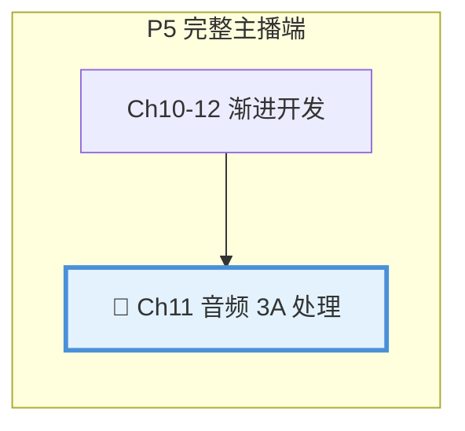

# 第11章：音频 3A 处理

| 项目 | 内容 |
|:---|:---|
| **本章目标** | 掌握音频 3A 处理的核心概念和实践 |
| **难度** | ⭐⭐⭐ 较高 |
| **前置知识** | Ch10：音频采集、信号处理基础 |
| **预计时间** | 3-4 小时 |

> **本章引言**


**本章与项目的关系**：



> **本章目标**：理解并实现音频 3A（AEC/ANS/AGC）处理，提升直播音频质量。

上一章我们实现了音视频采集。但直接采集的音频往往存在问题：
- **回声**：扬声器声音被麦克风采集，产生恼人的回音
- **噪声**：键盘声、空调声等环境噪声干扰
- **音量不均**：说话声音忽大忽小

这就是**音频 3A 处理**要解决的问题。本章将深入讲解 AEC（回声消除）、ANS（降噪）、AGC（自动增益）的原理和实现。

---

## 目录

1. [音频 3A 概述](#1-音频-3a-概述)
2. [AEC：回声消除](#2-aec回声消除)
3. [ANS：降噪](#3-ans降噪)
4. [AGC：自动增益](#4-agc自动增益)
5. [WebRTC APM 集成](#5-webrtc-apm-集成)
6. [简化实现](#6-简化实现)
7. [性能优化](#7-性能优化)
8. [本章总结](#8-本章总结)

---

## 1. 音频 3A 概述

### 1.1 为什么需要 3A

**回声问题**：
```
主播说话 → 扬声器播放 → 麦克风采集 → 推流 → 观众听到回声
```
观众会听到自己的声音延迟后传回来，体验极差。

**噪声问题**：
- 机械键盘敲击声
- 空调/风扇声
- 环境人声

**音量问题**：
- 有人离麦克风远，声音太小
- 有人情绪激动声音太大
- 同一主播说话忽大忽小

### 1.2 3A 简介

| 缩写 | 全称 | 功能 | 效果 |
|:---|:---|:---|:---|
| **AEC** | Acoustic Echo Cancellation | 回声消除 | 消除扬声器→麦克风的回声 |
| **ANS** | Active Noise Suppression | 主动降噪 | 消除环境噪声 |
| **AGC** | Automatic Gain Control | 自动增益 | 音量自动均衡 |

### 1.3 处理流程

```
麦克风输入
    ↓
┌─────────────────────────────────────┐
│  AEC：回声消除                        │
│  减去扬声器参考信号                   │
└─────────────────────────────────────┘
    ↓
┌─────────────────────────────────────┐
│  ANS：降噪                           │
│  抑制环境噪声                         │
└─────────────────────────────────────┘
    ↓
┌─────────────────────────────────────┐
│  AGC：自动增益                       │
│  调整音量到合适范围                   │
└─────────────────────────────────────┘
    ↓
处理后音频 → 编码 → 推流
```

---

## 2. AEC：回声消除

### 2.1 回声产生原理

```
远端语音 → 扬声器播放 ─────┐
                           ↓
                        房间声学环境
                           ↓
麦克风采集 ←───────────── 回声
    ↓
推流到远端（包含回声）
```

### 2.2 AEC 原理

**核心思想**：既然知道扬声器播放了什么，就可以从麦克风输入中"减去"这部分。

```
麦克风信号 = 近端语音 + 回声 + 噪声
                      ↑
            扬声器参考信号 × 房间冲激响应

目标：估计房间冲激响应，从麦克风信号中减去回声
```

### 2.3 自适应滤波

```cpp
// 简化的 NLMS（归一化最小均方）自适应滤波
class SimpleAEC {
public:
    void Process(const float* mic,      // 麦克风输入
                 const float* speaker,  // 扬声器参考
                 float* out,            // 输出
                 int samples) {
        for (int n = 0; n < samples; n++) {
            // 1. 更新参考信号缓冲区
            x_buffer_[write_pos_] = speaker[n];
            
            // 2. 计算估计的回声
            float echo_estimate = 0;
            for (int i = 0; i < FILTER_LENGTH; i++) {
                int idx = (write_pos_ - i + FILTER_LENGTH) % FILTER_LENGTH;
                echo_estimate += filter_[i] * x_buffer_[idx];
            }
            
            // 3. 计算误差（近端语音）
            float error = mic[n] - echo_estimate;
            out[n] = error;
            
            // 4. 更新滤波器系数（NLMS）
            float power = 0;
            for (int i = 0; i < FILTER_LENGTH; i++) {
                int idx = (write_pos_ - i + FILTER_LENGTH) % FILTER_LENGTH;
                power += x_buffer_[idx] * x_buffer_[idx];
            }
            float step = MU / (power + EPSILON);
            
            for (int i = 0; i < FILTER_LENGTH; i++) {
                int idx = (write_pos_ - i + FILTER_LENGTH) % FILTER_LENGTH;
                filter_[i] += step * error * x_buffer_[idx];
            }
            
            write_pos_ = (write_pos_ + 1) % FILTER_LENGTH;
        }
    }

private:
    static constexpr int FILTER_LENGTH = 1024;  // 滤波器长度
    static constexpr float MU = 0.5f;           // 步长
    static constexpr float EPSILON = 1e-10f;    // 防止除零
    
    float filter_[FILTER_LENGTH] = {0};
    float x_buffer_[FILTER_LENGTH] = {0};
    int write_pos_ = 0;
};
```

**关键参数**：
- `FILTER_LENGTH`：滤波器长度，决定可消除的回声延迟范围
- `MU`：步长，控制收敛速度（太大不稳定，太小收敛慢）

---

## 3. ANS：降噪

### 3.1 噪声类型

| 类型 | 特征 | 处理方法 |
|:---|:---|:---|
| **平稳噪声** | 频谱稳定（空调声） | 频谱减法 |
| **非平稳噪声** | 时变（键盘声） | 统计模型 |
| **瞬态噪声** | 突发（关门声） | 瞬态检测 |

### 3.2 频谱减法

```
带噪信号频谱 = 语音频谱 + 噪声频谱
                        ↓ 估计
处理后频谱 = 带噪信号频谱 - α × 估计噪声频谱
```

```cpp
class SimpleNS {
public:
    void Process(float* audio, int samples) {
        // 1. FFT 到频域
        fft(audio, freq_domain_);
        
        // 2. 估计噪声频谱（使用语音间隙）
        if (is_silence(freq_domain_)) {
            UpdateNoiseEstimate(freq_domain_);
        }
        
        // 3. 频谱减法
        for (int i = 0; i < FFT_SIZE/2 + 1; i++) {
            float magnitude = abs(freq_domain_[i]);
            float phase = arg(freq_domain_[i]);
            
            // 减去估计的噪声
            float new_mag = magnitude - 1.5f * noise_estimate_[i];
            new_mag = std::max(new_mag, 0.1f * magnitude);  // 防止过度减法
            
            freq_domain_[i] = std::polar(new_mag, phase);
        }
        
        // 4. IFFT 回时域
        ifft(freq_domain_, audio);
    }
};
```

### 3.3 语音活动检测（VAD）

判断当前是否有语音，用于：
- 噪声估计更新（只在无语音时更新）
- 节省编码带宽（无语音时降低码率）

```cpp
bool DetectVoiceActivity(const float* audio, int samples) {
    // 计算短时能量
    float energy = 0;
    for (int i = 0; i < samples; i++) {
        energy += audio[i] * audio[i];
    }
    energy /= samples;
    
    // 计算过零率
    int zero_crossings = 0;
    for (int i = 1; i < samples; i++) {
        if ((audio[i-1] > 0) != (audio[i] > 0)) {
            zero_crossings++;
        }
    }
    float zcr = (float)zero_crossings / samples;
    
    // 决策：能量高且过零率适中 → 有语音
    return energy > ENERGY_THRESHOLD && zcr < ZCR_THRESHOLD;
}
```

---

## 4. AGC：自动增益

### 4.1 为什么需要 AGC

- 不同主播音量差异大
- 同一人说话距离变化
- 情绪变化导致音量波动

### 4.2 AGC 原理

**目标**：将输出音量稳定在目标范围内

```
输入音量 ──┐
           ├──→ 增益计算 ──→ 应用增益 ──→ 输出音量
目标音量 ──┘
```

### 4.3 压缩器实现

```cpp
class SimpleAGC {
public:
    void Process(float* audio, int samples) {
        // 1. 计算输入 RMS
        float rms = ComputeRMS(audio, samples);
        
        // 2. 计算所需增益
        float target_rms = 0.1f;  // 目标 RMS
        float desired_gain = target_rms / (rms + 1e-10f);
        
        // 3. 限制增益范围
        desired_gain = std::clamp(desired_gain, 0.5f, 10.0f);
        
        // 4. 平滑增益变化（防止音量跳变）
        current_gain_ += (desired_gain - current_gain_) * attack_rate_;
        
        // 5. 应用增益
        for (int i = 0; i < samples; i++) {
            audio[i] *= current_gain_;
            // 硬限幅防止削波
            audio[i] = std::clamp(audio[i], -1.0f, 1.0f);
        }
    }

private:
    float current_gain_ = 1.0f;
    float attack_rate_ = 0.1f;  // 增益变化速度
};
```

---

## 5. WebRTC APM 集成

### 5.1 为什么选择 WebRTC APM

- **工业级**： billions of users 验证
- **实时性**：低延迟处理（10ms 级别）
- **鲁棒性**：各种场景自适应

### 5.2 集成步骤

```cpp
#include "modules/audio_processing/include/audio_processing.h"

class WebRTCAPMWrapper {
public:
    bool Initialize() {
        // 创建 APM 实例
        apm_ = webrtc::AudioProcessingBuilder().Create();
        
        // 配置 APM
        webrtc::AudioProcessing::Config config;
        config.echo_canceller.enabled = true;
        config.echo_canceller.mobile_mode = false;
        config.noise_suppression.enabled = true;
        config.noise_suppression.level = webrtc::AudioProcessing::Config::NoiseSuppression::kHigh;
        config.gain_control1.enabled = true;
        config.gain_control1.mode = webrtc::AudioProcessing::Config::GainControl1::kAdaptiveAnalog;
        apm->ApplyConfig(config);
        
        // 初始化
        apm->Initialize(
            PLAYBACK_SAMPLE_RATE,   // 扬声器采样率
            CAPTURE_SAMPLE_RATE,    // 麦克风采样率
            CAPTURE_SAMPLE_RATE,    // 输出采样率
            webrtc::AudioProcessing::kMonoAndMono   // 声道配置
        );
        
        return true;
    }
    
    void Process(const float* mic,      // 麦克风
                 const float* speaker,  // 扬声器参考
                 float* out,            // 输出
                 int samples) {
        // 分析扬声器信号
        apm->ProcessReverseStream(speaker, ...);
        
        // 处理麦克风信号
        apm->ProcessStream(mic, ..., out, ...);
    }

private:
    std::unique_ptr<webrtc::AudioProcessing> apm_;
};
```

---

## 6. 简化实现

对于学习目的，这里提供一个简化的 3A 处理器：

```cpp
// audio_3a_processor.hpp
#pragma once
#include <cstdint>
#include <memory>

namespace live {

struct AudioConfig {
    int sample_rate = 48000;
    int channels = 2;
    int frame_duration_ms = 10;
};

class Audio3AProcessor {
public:
    explicit Audio3AProcessor(const AudioConfig& config);
    ~Audio3AProcessor();
    
    bool Init();
    
    // 处理音频帧
    // mic: 麦克风输入（interleaved PCM）
    // speaker: 扬声器参考信号（用于 AEC）
    // out: 处理后输出
    void Process(const int16_t* mic, const int16_t* speaker, int16_t* out);
    
    // 设置开关
    void EnableAEC(bool enable);
    void EnableNS(bool enable);
    void EnableAGC(bool enable);

private:
    class Impl;
    std::unique_ptr<Impl> impl_;
};

} // namespace live
```

```cpp
// audio_3a_processor.cpp
#include "audio_3a_processor.hpp"
#include <algorithm>
#include <cmath>
#include <string>

namespace live {

class Audio3AProcessor::Impl {
public:
    explicit Impl(const AudioConfig& cfg) : config_(cfg) {
        samples_per_frame_ = config_.sample_rate * config_.frame_duration_ms / 1000;
    }
    
    void Process(const int16_t* mic, const int16_t* speaker, int16_t* out) {
        size_t samples = samples_per_frame_ * config_.channels;
        
        // 1. AEC：简单回声消除
        if (aec_enabled_ && speaker) {
            for (size_t i = 0; i < samples; i++) {
                int32_t val = mic[i] - (speaker[i] >> 2);  // 减去 25%
                out[i] = static_cast<int16_t>(
                    std::max(-32768, std::min(32767, val)));
            }
        } else {
            std::memcpy(out, mic, samples * sizeof(int16_t));
        }
        
        // 2. NS：简单门限降噪
        if (ns_enabled_) {
            for (size_t i = 0; i < samples; i++) {
                if (std::abs(out[i]) < 500) {
                    out[i] = 0;
                }
            }
        }
        
        // 3. AGC：简单自动增益
        if (agc_enabled_) {
            // 计算 RMS
            int64_t sum = 0;
            for (size_t i = 0; i < samples; i++) {
                sum += out[i] * out[i];
            }
            int rms = static_cast<int>(
                std::sqrt(static_cast<double>(sum) / samples));
            
            // 目标 RMS：3000
            if (rms > 0 && rms < 3000) {
                int gain = std::min(3000 / rms, 10);
                for (size_t i = 0; i < samples; i++) {
                    int32_t val = out[i] * gain;
                    out[i] = static_cast<int16_t>(
                        std::max(-32768, std::min(32767, val)));
                }
            }
        }
    }

    bool aec_enabled_ = true;
    bool ns_enabled_ = true;
    bool agc_enabled_ = true;
    AudioConfig config_;
    int samples_per_frame_;
};

Audio3AProcessor::Audio3AProcessor(const AudioConfig& config)
    : impl_(std::make_unique<Impl>(config)) {}

Audio3AProcessor::~Audio3AProcessor() = default;

bool Audio3AProcessor::Init() {
    return true;
}

void Audio3AProcessor::Process(const int16_t* mic, const int16_t* speaker, int16_t* out) {
    impl_>Process(mic, speaker, out);
}

void Audio3AProcessor::EnableAEC(bool enable) {
    impl_>aec_enabled_ = enable;
}

void Audio3AProcessor::EnableNS(bool enable) {
    impl_>ns_enabled_ = enable;
}

void Audio3AProcessor::EnableAGC(bool enable) {
    impl_>agc_enabled_ = enable;
}

} // namespace live
```

---

## 7. 性能优化

### 7.1 处理延迟优化

3A 处理引入的延迟必须可控：

| 模块 | 典型延迟 | 优化方向 |
|:---|:---:|:---|
| AEC | 10-40ms | 自适应滤波器长度 |
| ANS | 5-10ms | 帧大小、FFT 优化 |
| AGC | <1ms | 查表法、SIMD |
| **总计** | **20-50ms** | **端到端预算 100ms** |

### 7.2 CPU 优化

```cpp
// 使用 SIMD 加速（AVX/SSE）
#include <immintrin.h>

void ProcessSIMD(float* audio, int samples) {
    for (int i = 0; i < samples; i += 8) {
        __m256 vec = _mm256_loadu_ps(&audio[i]);
        // SIMD 处理...
        _mm256_storeu_ps(&audio[i], vec);
    }
}
```

### 7.3 内存优化

- 预分配缓冲区，避免运行时分配
- 使用环形缓冲区管理音频帧
- 缓存 FFT 计划（plan）

---

## 8. 本章总结

### 核心概念

1. **AEC**：自适应滤波消除回声，需要扬声器参考信号
2. **ANS**：频谱减法抑制噪声，需要 VAD 区分语音/噪声
3. **AGC**：压缩器自动调整音量，保持输出稳定

### 实现要点

| 模块 | 核心算法 | 关键参数 |
|:---|:---|:---|
| AEC | NLMS 自适应滤波 | 滤波器长度、步长 |
| ANS | 频谱减法 | 过减因子、噪声估计 |
| AGC | 动态范围压缩 | 目标电平、压缩比 |

### 生产环境建议

- **WebRTC APM**：成熟稳定，推荐直接使用
- **SpeexDSP**：轻量级替代，适合嵌入式
- **自研**：仅在有特殊需求时考虑

### 下一步

完成音频处理后，音视频数据需要**同步**并送入编码器。下一章将介绍：
- 音视频同步策略
- H.264 视频编码
- RTMP 推流实现

---

**本章代码**：完整实现见 `include/live/audio_3a_processor.hpp`
---

## FAQ 常见问题

### Q1：本章的核心难点是什么？

**A**：音频 3A 处理涉及的核心难点包括：
- 理解新概念的内在原理
- 将理论知识转化为实际代码
- 处理边界情况和错误恢复

建议多动手实践，遇到问题及时查阅官方文档。

---

### Q2：学习本章需要哪些前置知识？

**A**：请参考章节头部的前置知识表格。如果某些基础不牢固，建议先复习相关章节。

---

### Q3：如何验证本章的学习效果？

**A**：建议完成以下检查：
- [ ] 理解所有核心概念
- [ ] 能独立编写本章的示例代码
- [ ] 能解释代码的工作原理
- [ ] 能排查常见问题

---

### Q4：本章代码在实际项目中的应用场景？

**A**：本章代码是渐进式案例「小直播」的组成部分，所有代码都可以在实际项目中使用。具体应用场景请参考「本章与项目的关系」部分。

---

### Q5：遇到问题时如何调试？

**A**：调试建议：
1. 先阅读 FAQ 和本章的「常见问题」部分
2. 检查前置知识是否掌握
3. 使用日志和调试工具定位问题
4. 参考示例代码进行对比
5. 在 GitHub Issues 中搜索类似问题
---

## 本章小结

### 核心知识点

通过本章学习，你应该掌握：
1. 音频 3A 处理的核心概念和原理
2. 相关的 API 和工具使用
3. 实际项目中的应用方法
4. 常见问题的解决方案

### 关键技能

| 技能 | 掌握程度 | 实践建议 |
|:---|:---:|:---|
| 理解核心概念 | ⭐⭐⭐ 必须掌握 | 能向他人解释原理 |
| 编写示例代码 | ⭐⭐⭐ 必须掌握 | 独立编写本章代码 |
| 排查常见问题 | ⭐⭐⭐ 必须掌握 | 遇到问题时能自行解决 |
| 应用到项目 | ⭐⭐ 建议掌握 | 将本章代码集成到项目中 |

### 本章产出

- 完成本章所有示例代码
- 理解 音频 3A 处理的工作原理
- 为后续章节打下基础
---

## 下章预告

### Ch12：编码与推流

**为什么要学下一章？**

每章都是渐进式案例「小直播」的有机组成部分，下一章将在本章基础上进一步扩展功能。

**学习建议**：
- 确保本章内容已经掌握
- 提前浏览下一章的目录
- 准备好相关的开发环境

