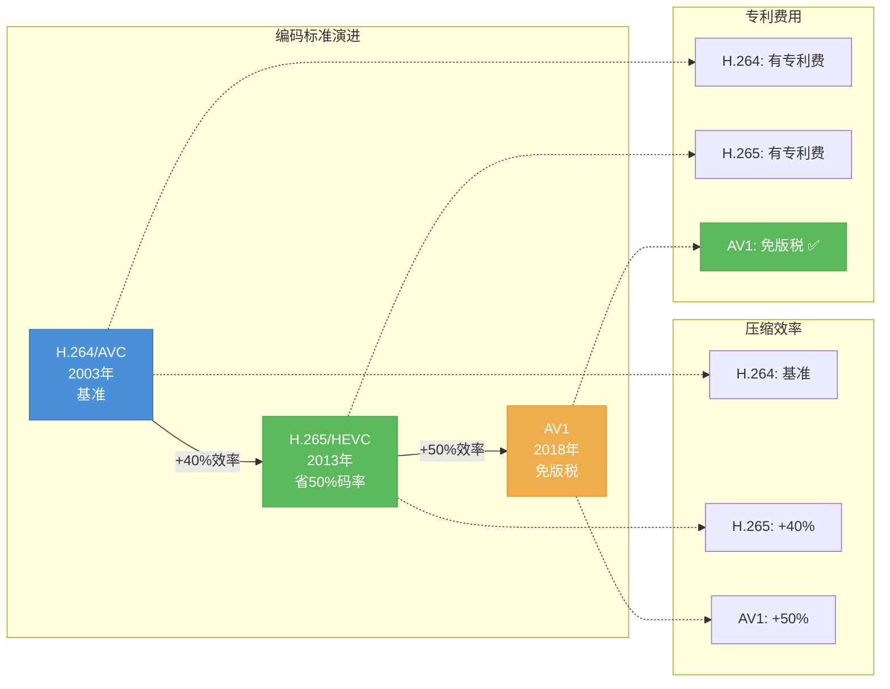
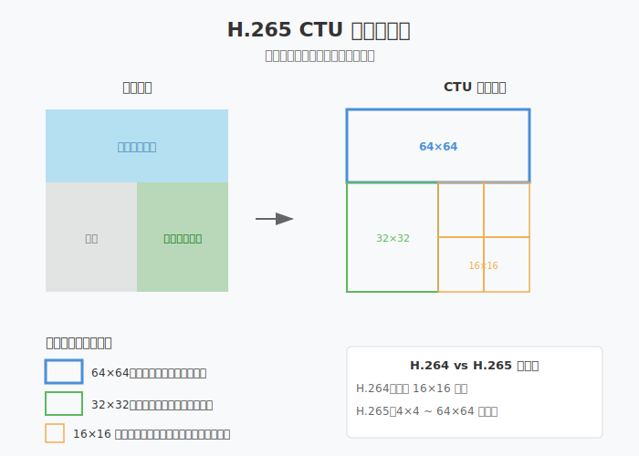
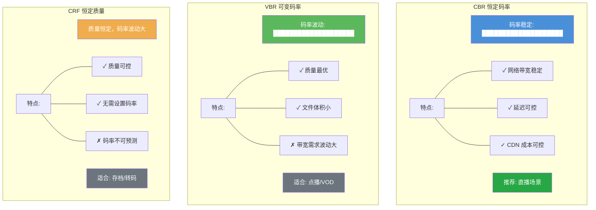
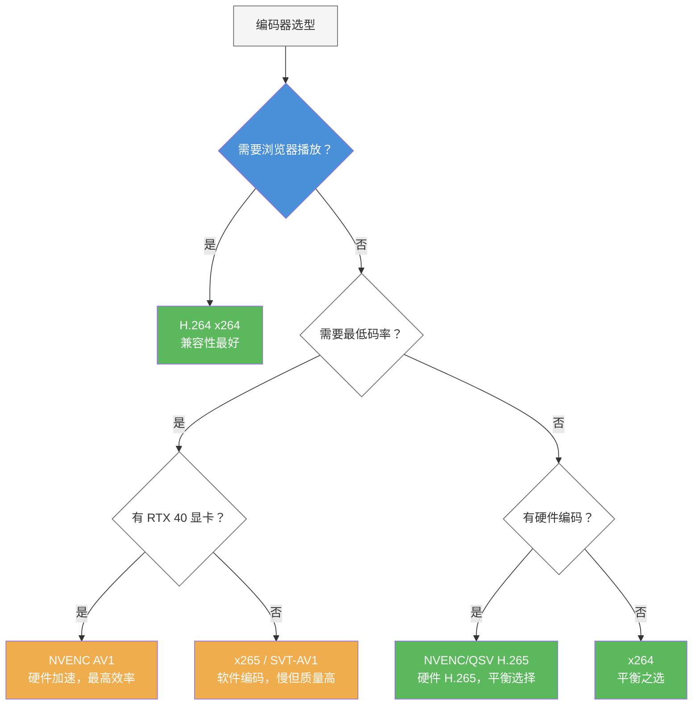

# 第13章：视频编码进阶

| 项目 | 内容 |
|:---|:---|
| **本章目标** | 掌握视频编码进阶的核心概念和实践 |
| **难度** | ⭐⭐⭐⭐ 高 |
| **前置知识** | Ch12：H.264编码、码率控制 |
| **预计时间** | 4-5 小时 |

> **本章引言**

> **本章目标**：掌握 H.265/AV1 编码、SVC 可伸缩编码，理解码率控制的高级策略。

在第十二章中，我们使用 x264 实现了 H.264 编码和 RTMP 推流。H.264 凭借出色的兼容性至今仍是直播领域的主流选择，但随着 4K、8K 超高清视频的普及，H.264 的压缩效率已显不足。本章将深入探讨新一代视频编码技术，帮助你在不同场景下做出最优的技术选型。

**你将学到**：
- **H.265/HEVC**：如何在相同画质下将码率降低 50%
- **AV1**：开源免版税的编码新选择，压缩效率再提升 20%
- **SVC**：让直播自动适应观众网络状况的分层编码技术
- **码率控制**：CBR、VBR、CRF 的原理与选型策略

**本章与第十二章的关系**：
- Ch12 是 H.264 编码的**入门与实践**
- Ch13 是**进阶与选型**，学习何时应该超越 H.264

---

## 目录

1. [视频编码的瓶颈：为什么 H.264 不够了](#1-视频编码的瓶颈为什么-h264-不够了)
2. [编码标准演进路线图](#2-编码标准演进路线图)
3. [压缩效率的数学：BD-Rate 指标详解](#3-压缩效率的数学bd-rate-指标详解)
4. [H.265/HEVC 核心原理](#4-h265hevc-核心原理)
5. [AV1：开源时代的编码选择](#5-av1开源时代的编码选择)
6. [SVC 可伸缩分层编码](#6-svc-可伸缩分层编码)
7. [码率控制策略深度解析](#7-码率控制策略深度解析)
8. [编码器选型决策框架](#8-编码器选型决策框架)
9. [本章总结](#9-本章总结)

---

## 1. 视频编码的瓶颈：为什么 H.264 不够了

### 1.1 带宽成本的现实压力

让我们先看一组实际数据：

| 场景 | H.264 码率 | 1小时流量 | CDN 成本（0.1元/GB）|
|:---|---:|---:|---:|
| 1080p 直播 | 4 Mbps | 1.8 GB | 0.18 元/人 |
| 4K 直播 | 25 Mbps | 11.25 GB | 1.125 元/人 |
| 4K 直播（1万人观看）| - | - | **11,250 元/小时** |

对于大型直播平台，带宽成本是仅次于人力成本的第二大支出。如果能把码率降低 50%，意味着每年可节省数百万的 CDN 费用。

### 1.2 H.264 的技术局限

**设计年代的限制**：
H.264 标准定型于 2003 年，当时的主流分辨率还是 480p（标清）。标准设计时考虑了以下假设：
- 最大分辨率：2048×2048（当时认为足够）
- 最大块大小：16×16（宏块）
- 参考帧数：最多 16 帧

这些参数在 1080p 时代还能应付，但面对 4K（3840×2160）时就显得捉襟见肘：
- 4K 画面有 830 万像素，需要约 52,000 个 16×16 宏块
- 宏块数量过多导致编码决策开销剧增
- 固定块大小无法适应 4K 画面的复杂度分布

**专利费用的隐形成本**：
H.264 采用专利池授权模式（MPEG LA）：
- 编码器/解码器厂商需缴纳专利费
- 流媒体服务商如果收费，超过一定规模也需缴费
- 虽然个人用户和小型项目通常免费，但商业应用存在不确定性

---

## 2. 编码标准演进路线图

### 2.1 三代编码标准对比



**H.264/AVC（2003）—— 基准时代**
- 首次实现数字视频的高效压缩
- 采用宏块划分、运动补偿、变换编码三大技术
- 兼容性无敌，至今仍是设备支持最广泛的格式

**H.265/HEVC（2013）—— 效率时代**
- 目标：相同画质下码率减半
- 核心创新：CTU（编码树单元）四叉树划分
- 代价：计算复杂度大幅提升（编码时间增加 3-5 倍）
- 遗憾：仍受专利费困扰

**AV1（2018）—— 开源时代**
- 由 AOMedia 联盟（Google、Apple、Netflix、Amazon 等）开发
- 目标：免版税 + 最高压缩效率
- 核心创新：更灵活的块划分、更精细的预测模式
- 挑战：软件编码极慢，依赖硬件支持

### 2.2 编码标准选型的决策维度

选择编码标准时需要考虑：

| 维度 | H.264 | H.265 | AV1 |
|:---|:---|:---|:---|
| **压缩效率** | 基准 | +40-50% | +50-60% |
| **编码速度** | 快 | 慢（30%） | 极慢（15%） |
| **硬件支持** |  universal | 较新设备 | 最新设备 |
| **浏览器支持** | 100% | Safari 支持 | Chrome/Firefox |
| **专利风险** | 有 | 有 | 无 |
| **适用场景** | 通用直播 | 4K/存储 | Web/VOD |

---

## 3. 压缩效率的数学：BD-Rate 指标详解

### 3.1 如何量化"压缩效率"

**RD 曲线（Rate-Distortion Curve）**：
RD 曲线描述了码率（Rate）与失真（Distortion）之间的权衡关系：
- **X 轴**：码率（kbps）
- **Y 轴**：质量损失（通常用 PSNR 或 VMAF 表示）

同一视频用不同编码器、不同参数编码，会得到一组 RD 点，连接成曲线。

**BD-Rate 计算原理**：
BD-Rate（Bjøntegaard Delta Rate）计算两条 RD 曲线之间的平均码率差异：
1. 在两个质量点上计算码率差值
2. 对数坐标下求面积积分
3. 结果表示"相同质量下节省的码率百分比"

```
BD-Rate = (Area under curve B - Area under curve A) / Area under curve A × 100%
```

### 3.2 实际 BD-Rate 对比数据

根据 Netflix、Google 等公司的实测数据（1080p 视频）：

| 编码器 | 相对 H.264 的 BD-Rate | 实际意义 |
|:---|:---:|:---|
| x264 (H.264) | 0% | 基准 |
| x265 (H.265) | -45% | 节省近一半码率 |
| libvpx-vp9 | -50% | Google 主推格式 |
| SVT-AV1 | -55% | 最高压缩效率 |

**实例说明**：
一部 2 小时的 1080p 电影：
- H.264 @ 8 Mbps = 7.2 GB
- H.265 @ 4.5 Mbps = 4.05 GB（节省 3.15 GB）
- AV1 @ 3.6 Mbps = 3.24 GB（节省 4 GB）

### 3.3 质量评估指标的选择

**PSNR（峰值信噪比）**：
- 基于像素差异计算
- 优点：计算简单、客观
- 缺点：不符合人眼感知（相同 PSNR 可能看起来差异很大）

**VMAF（视频多方法评估融合）**：
- Netflix 开发，机器学习模型
- 结合多种特征预测人眼感知质量
- 目前业界最权威的客观质量指标

**SSIM（结构相似性）**：
- 衡量结构信息保留程度
- 比 PSNR 更符合人眼感知
- 计算复杂度适中

---

## 4. H.265/HEVC 核心原理

### 4.1 CTU 四叉树划分：自适应块大小



**从宏块到 CTU**：
H.264 使用固定的 16×16 宏块，而 H.265 引入**编码树单元（Coding Tree Unit, CTU）**：
- 最大 CTU 尺寸：64×64（可配置）
- 支持四叉树递归划分：64→32→16→8→4
- 每个 CTU 可根据画面复杂度选择最优块大小

**为什么自适应划分能节省码率？**

想象用不同大小的瓷砖铺地：
- **客厅地面**（平坦）：用大瓷砖（64×64），减少缝隙数量
- **马赛克图案墙**（复杂）：用小瓷砖（4×4），精确还原细节

同理：
- **天空、墙面**（颜色均匀）：64×64 大块，表示"这块都差不多"
- **树叶、毛发**（细节丰富）：4×4 小块，精确编码每个像素

**数学原理**：
设编码决策的拉格朗日代价为：
```
J = D + λR
```
- D：失真（质量损失）
- R：码率（数据量）
- λ：拉格朗日乘子（质量-码率权衡系数）

对于平坦区域，大块划分使 R 显著减小，而 D 增加很小，J 更小。
对于细节区域，小块划分使 D 显著减小，虽然 R 增加，但 J 更小。

### 4.2 更多预测方向

**帧内预测**：利用空间相关性，用已编码的相邻像素预测当前块。

| 编码标准 | 预测模式数 | 新增特性 |
|:---|:---:|:---|
| H.264 | 9 | 8方向 + DC |
| H.265 | 35 | 33方向 + DC + Planar |
| AV1 | 56 | 更精细角度 + 递归滤波 |

**预测方向图解**：
```
    0°（水平）
      ↑
315° ← ● → 45°
      ↓
    90°（垂直）
```

更多方向意味着可以更精确地匹配图像边缘的走向。例如 22.5° 的边缘，H.264 只能用 0° 或 45° 近似，而 H.265 可以更精确地表示。

### 4.3 环路滤波改进

**去块滤波（Deblocking Filter）**：
H.264 和 H.265 都有，用于消除块效应（Block Artifacts）。

**SAO（Sample Adaptive Offset，样本自适应偏移）**：
H.265 新增，解决振铃效应（Ringing Artifacts）：
- 根据边缘方向对重建像素进行偏移修正
- 分为 EO（Edge Offset）和 BO（Band Offset）两种模式

**通俗解释**：
编码后的图像在某些边缘会有"振铃"（像水波纹一样的伪影），SAO 像是一个"修图工具"，检测这些伪影并进行微调修正。

---

## 5. AV1：开源时代的编码选择

### 5.1 为什么需要 AV1

**H.265 的专利困境**：
H.265 有三个专利池：
1. MPEG LA（主要专利池）
2. HEVC Advance（后改名 Access Advance）
3. Velos Media（独立专利池）

这种"多专利池"模式带来不确定性：
- 厂商不知道该向谁缴费
- 专利费总和可能过高
- 某些专利持有者可能突然跳出来收费

**AOMedia 的诞生**：
2015 年，Google、Netflix、Amazon、Microsoft、Intel 等巨头联合成立 Alliance for Open Media（开放媒体联盟），目标是开发**完全免版税**的视频编码标准。

**AV1 的设计目标**：
1. 压缩效率比 H.265 再提升 30%
2. 完全免版税，无专利风险
3. 针对互联网流媒体优化（如支持 Tile 并行编码）

### 5.2 AV1 的核心技术

**扩展块大小**：
- 最大块：128×128（H.265 是 64×64）
- 支持多种划分方式：四叉树 + 二叉树 + 三叉树

**更精细的帧内预测**：
- 56 种方向模式
- 新增"递归滤波帧内预测"（Recursive Filtering Intra Prediction）
- 新增"色度 from 亮度"预测（CfL）

**CDEF 和 Loop Restoration**：
替代 H.265 的 SAO，提供更好的环路滤波效果。

### 5.3 AV1 编码现状与选型建议

**软件编码（SVT-AV1）**：
- 质量极高，但速度极慢（约 x264 的 1/6）
- 适合：VOD 转码、存档、慢直播
- 不适合：实时直播

**硬件编码器支持情况**（截至 2024）：
| 平台 | 支持情况 | 性能 |
|:---|:---|:---|
| NVIDIA RTX 40 系列 | NVENC AV1 | 4K@60fps |
| Intel Arc GPU | QSV AV1 | 4K@60fps |
| Apple M3/M4 | VideoToolbox AV1 | 4K@60fps |
| 手机芯片 | 骁龙 8 Gen 2+ | 1080p@60fps |

**AV1 选型建议**：
- 有 RTX 40 显卡做直播 → NVENC AV1 是最佳选择
- VOD 转码 → SVT-AV1 可获得最高压缩率
- Web 播放场景 → AV1 兼容性已足够（Chrome/Firefox/Safari）

---

## 6. SVC 可伸缩分层编码

### 6.1 为什么需要 SVC

**传统方案的痛点**：
一场直播有 1 万观众，网络状况各不相同：
- 5% 用 5G（可以 1080p）
- 30% 用 WiFi（可以 720p）
- 50% 用 4G（只能 540p）
- 15% 网络差（只能 360p）

传统方案需要服务器为每种分辨率单独转码，资源消耗巨大。

**SVC 的解决方案**：
编码器一次编码产生**多层视频**，观众根据网络状况选择接收哪几层：
- 网络好：基础层 + 增强层 → 高清
- 网络差：只收基础层 → 流畅但质量低

### 6.2 SVC 的三维可伸缩性


**时间可伸缩（Temporal Scalability）**：
```
时间层 T2（30fps）：● ● ● ● ● ● ● （所有帧）
时间层 T1（15fps）：●   ●   ●   ●   （每2帧取1帧）
时间层 T0（7.5fps）：●       ●       （每4帧取1帧）
```
网络差时，接收端可以丢弃高时间层，降低帧率但保持画面流畅。

**空间可伸缩（Spatial Scalability）**：
```
增强层：1920×1080（全高清）
基础层：  960×540（四分之一分辨率）
```
基础层独立可解码，增强层提供细节补充。

**质量可伸缩（Quality Scalability）**：
```
增强层：低 QP（高质量，高码率）
基础层：高 QP（低质量，低码率）
```
同一分辨率，不同压缩比。

### 6.3 SVC 与 Simulcast 的对比

| 特性 | SVC | Simulcast |
|:---|:---|:---|
| 编码次数 | 1 次 | N 次（每层1次）|
| 服务器资源 | 低（无需转码） | 高（需要转码或选择）|
| 客户端选择 | 丢包/选择性接收 | 选择不同流 |
| 延迟 | 低 | 较高 |
| 兼容性 | 较差（需播放器支持）| 好（标准流）|

**WebRTC 的选择**：
WebRTC 早期使用 Simulcast，现在主流实现都支持 SVC（VP9 和 AV1）。

---

## 7. 码率控制策略深度解析

### 7.1 码率控制的目标与约束

**码率控制的本质**：
在给定的带宽约束下，分配比特以最小化整体失真。

**约束条件**：
1. **带宽约束**：不能超过网络容量
2. **缓冲约束**：防止缓冲区溢出或下溢
3. **延迟约束**：直播场景要求低延迟

### 7.2 CBR、VBR、CRF 深度对比



**CBR（Constant Bitrate）恒定码率**：
```
原理：每秒钟输出的数据量恒定
实现：通过填充（stuffing）或量化调整保持码率稳定
优点：带宽可预测，适合直播
缺点：复杂场景质量下降（码率不够），简单场景浪费带宽
```

**VBR（Variable Bitrate）可变码率**：
```
原理：根据画面复杂度动态分配码率
实现：简单场景少给比特，复杂场景多给比特
优点：整体质量最优，文件大小最小
缺点：码率波动大，不适合直播（可能超出带宽）
```

**CRF（Constant Rate Factor）恒定质量因子**：
```
原理：保持"质量水平"恒定，不管码率多少
实现：x264/x265 的参数 0-51，越小质量越高
优点：无需指定码率，一次编码即可
缺点：码率不可预测，不适合带宽受限场景
```

### 7.3 VBV 缓冲区模型

**为什么需要 VBV**：
CBR 并非真正的"每一秒都严格恒定"，而是有一个**缓冲区**来平滑瞬时码率波动。

**VBV（Video Buffering Verifier）模型**：
- **Buffer Size**：缓冲区大小（如 1 秒的数据量）
- **Initial Delay**：初始填充时间
- **Max Rate**：最大输入码率

**VBV 参数设置**：
```bash
ffmpeg -i input.mp4 -c:v libx264 \
  -b:v 4000k \        # 目标码率
  -maxrate 4000k \    # 最大码率
  -bufsize 400k \     # VBV 缓冲区（100ms）
  output.mp4
```

**缓冲区大小的影响**：
- 缓冲区大：码率更平滑，质量更稳定，延迟增加
- 缓冲区小：码率波动大，适合低延迟直播

### 7.4 自适应码率（ABR）算法

**基本思路**：
根据网络反馈（RTT、丢包率）动态调整目标码率。

**简单 ABR 实现**：
```cpp
class AdaptiveBitrateController {
public:
    void OnNetworkReport(int rtt_ms, float loss_rate, int jitter_ms) {
        // 丢包率过高：严重拥塞，大幅降码率
        if (loss_rate > 0.05f) {
            target_bitrate_ *= 0.7f;
            state_ = NetworkState::Congested;
        }
        // 轻微丢包：轻度拥塞，小幅降码率
        else if (loss_rate > 0.02f) {
            target_bitrate_ *= 0.85f;
            state_ = NetworkState::Warning;
        }
        // RTT 和抖动都很小：网络良好，尝试升码率
        else if (rtt_ms < 100 && jitter_ms < 50 && 
                 state_ == NetworkState::Good) {
            target_bitrate_ *= 1.1f;
        }
        
        // 限制在合理范围
        target_bitrate_ = std::clamp(target_bitrate_, 
                                     min_bitrate_, max_bitrate_);
    }
    
private:
    int target_bitrate_ = 4000000;  // 4 Mbps
    int min_bitrate_ = 500000;       // 500 kbps
    int max_bitrate_ = 8000000;      // 8 Mbps
    NetworkState state_ = NetworkState::Good;
};
```

**GCC（Google Congestion Control）**：
WebRTC 使用的拥塞控制算法，同时基于延迟和丢包进行决策，是目前最先进的实时码率控制方案之一。

---

## 8. 编码器选型决策框架

### 8.1 决策流程图



### 8.2 场景化选型指南

**场景 1：普通直播（推荐 H.264）**
- 用户群体多样，设备未知
- 需要确保所有人都能观看
- 推荐：x264，preset medium，CBR

**场景 2：4K 直播（推荐 NVENC AV1/H.265）**
- 观众设备较新，带宽充足
- 追求最佳画质
- 有 RTX 40 → NVENC AV1
- 无 RTX 40 → NVENC H.265

**场景 3：游戏直播（推荐 NVENC H.264）**
- 需要最小 CPU 占用（留给游戏）
- 快速运动场景需要高帧率
- 推荐：NVENC H.264，high profile

**场景 4：视频会议（推荐 H.264 + SVC）**
- 参与者网络状况差异大
- 需要低延迟
- 推荐：OpenH264 或硬件编码 + SVC

**场景 5：视频存档（推荐 SVT-AV1）**
- 时间充裕，追求最高压缩率
- 播放设备较新
- 推荐：SVT-AV1，preset 4-6

### 8.3 性能与质量的权衡

> **没有最好的编码器，只有最适合场景的编码器。**

| 你的优先级 | 推荐选择 |
|:---|:---|
| 兼容性第一 | H.264（x264/硬件） |
| 压缩率第一 | AV1（SVT-AV1/NVENC） |
| 速度第一 | H.264（NVENC） |
| 质量第一 | H.265（x265 slow） |
| 免版税 | AV1（SVT-AV1） |

---

## 9. 本章总结

### 9.1 核心概念回顾

| 概念 | 关键点 |
|:---|:---|
| **H.265/HEVC** | CTU 四叉树划分，比 H.264 省 40-50% 码率，但有专利费 |
| **AV1** | 免版税，压缩率最高，浏览器原生支持，软件编码慢 |
| **SVC** | 一次编码多层输出，自适应网络，适合多观众场景 |
| **CTU** | 编码树单元，64×64 到 4×4 自适应划分 |
| **CBR/VBR/CRF** | CBR 适合直播，VBR 适合存储，CRF 适合转码 |
| **BD-Rate** | 衡量压缩效率的标准指标，负值表示节省码率 |

### 9.2 技术选型速查表

| 场景 | 编码器 | 参数建议 |
|:---|:---|:---|
| 通用直播 | x264 | `-preset fast -tune zerolatency -b:v 4M` |
| 4K 直播（RTX 40）| av1_nvenc | `-preset p4 -cq 23` |
| 4K 直播（旧显卡）| hevc_nvenc | `-preset p4 -cq 23` |
| 游戏直播 | h264_nvenc | `-preset llhq -rc cbr` |
| VOD 存档 | libsvtav1 | `-preset 4 -crf 32` |

### 9.3 本章与下章的衔接

本章聚焦于**编码器的选择与配置**，解决了"如何高效压缩视频"的问题。

下一章（第十四章）将探讨**采集端的进阶技术**：
- 屏幕采集的原理与优化
- 多摄像头管理与画中画
- GPU 纹理共享零拷贝技术

这两章共同构成**主播端 Pipeline**的核心：采集（Ch14）→ 处理（Ch15）→ 编码（Ch13/Ch12）→ 推流（Ch12）。

---

**延伸阅读**：
- H.265 标准文档：ITU-T Rec. H.265
- AV1 规范：AOMedia Codec Working Group
- VMAF 论文："Toward A Practical Perceptual Video Quality Metric"
---

## FAQ 常见问题

### Q1：本章的核心难点是什么？

**A**：视频编码进阶涉及的核心难点包括：
- 理解新概念的内在原理
- 将理论知识转化为实际代码
- 处理边界情况和错误恢复

建议多动手实践，遇到问题及时查阅官方文档。

---

### Q2：学习本章需要哪些前置知识？

**A**：请参考章节头部的前置知识表格。如果某些基础不牢固，建议先复习相关章节。

---

### Q3：如何验证本章的学习效果？

**A**：建议完成以下检查：
- [ ] 理解所有核心概念
- [ ] 能独立编写本章的示例代码
- [ ] 能解释代码的工作原理
- [ ] 能排查常见问题

---

### Q4：本章代码在实际项目中的应用场景？

**A**：本章代码是渐进式案例「小直播」的组成部分，所有代码都可以在实际项目中使用。具体应用场景请参考「本章与项目的关系」部分。

---

### Q5：遇到问题时如何调试？

**A**：调试建议：
1. 先阅读 FAQ 和本章的「常见问题」部分
2. 检查前置知识是否掌握
3. 使用日志和调试工具定位问题
4. 参考示例代码进行对比
5. 在 GitHub Issues 中搜索类似问题
---

## 本章小结

### 核心知识点

通过本章学习，你应该掌握：
1. 视频编码进阶的核心概念和原理
2. 相关的 API 和工具使用
3. 实际项目中的应用方法
4. 常见问题的解决方案

### 关键技能

| 技能 | 掌握程度 | 实践建议 |
|:---|:---:|:---|
| 理解核心概念 | ⭐⭐⭐ 必须掌握 | 能向他人解释原理 |
| 编写示例代码 | ⭐⭐⭐ 必须掌握 | 独立编写本章代码 |
| 排查常见问题 | ⭐⭐⭐ 必须掌握 | 遇到问题时能自行解决 |
| 应用到项目 | ⭐⭐ 建议掌握 | 将本章代码集成到项目中 |

### 本章产出

- 完成本章所有示例代码
- 理解 视频编码进阶的工作原理
- 为后续章节打下基础
---

## 下章预告

### Ch14：高级采集技术

**为什么要学下一章？**

每章都是渐进式案例「小直播」的有机组成部分，下一章将在本章基础上进一步扩展功能。

**学习建议**：
- 确保本章内容已经掌握
- 提前浏览下一章的目录
- 准备好相关的开发环境

