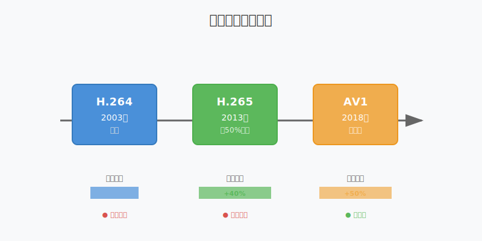
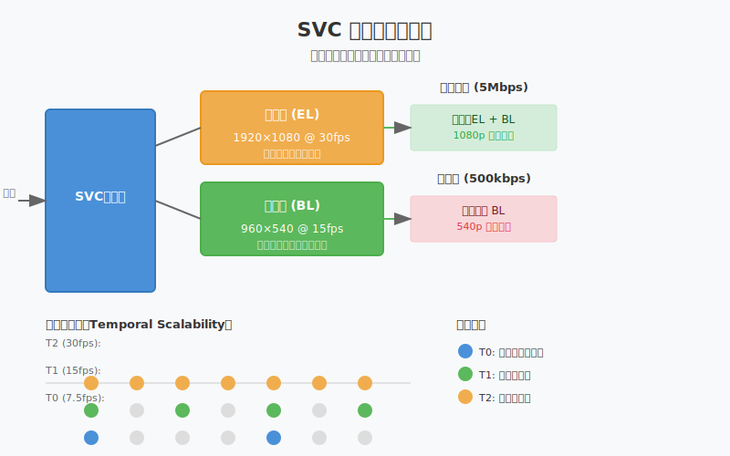
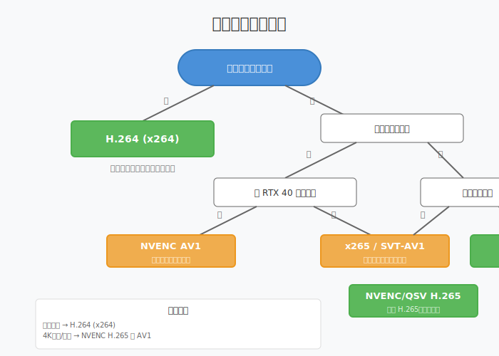

# 第十三章：视频编码进阶

> **本章目标**：掌握 H.265/AV1 编码、SVC 可伸缩编码，理解码率控制的高级策略。

第十二章我们使用 x264 实现了 H.264 编码和 RTMP 推流。H.264 是目前兼容性最好的编码格式，但在 4K 时代，它的压缩效率已显不足。

本章将学习新一代编码技术：
- **H.265/HEVC**：相同质量下码率比 H.264 降低 50%
- **AV1**：开源免版税，压缩效率比 H.265 再高 20%
- **SVC**：可伸缩分层编码，自适应网络带宽

**阅读指南**：
- 第 1-2 节：编码标准演进，理解为什么需要新编码
- 第 3-4 节：H.265、AV1 编码原理与实现
- 第 5-6 节：SVC 分层编码、码率控制策略
- 第 7-8 节：编码器选型、本章总结

---

## 目录

1. [编码标准演进：从 H.264 到 AV1](#1-编码标准演进从-h264-到-av1)
2. [压缩效率对比](#2-压缩效率对比)
3. [H.265/HEVC 编码原理](#3-h265hevc-编码原理)
4. [AV1：开源免版税的选择](#4-av1开源免版税的选择)
5. [SVC 可伸缩分层编码](#5-svc-可伸缩分层编码)
6. [码率控制策略](#6-码率控制策略)
7. [编码器选型指南](#7-编码器选型指南)
8. [本章总结](#8-本章总结)

---

## 1. 编码标准演进：从 H.264 到 AV1

### 1.1 为什么需要新编码标准

H.264 诞生于 2003 年，针对 480p/720p 视频设计。在 4K 时代面临挑战：

| 分辨率 | H.264 码率 | 实际需求 | 问题 |
|:---|---:|---:|:---|
| 1080p@30fps | 8 Mbps | 4 Mbps | 带宽占用高 |
| 4K@30fps | 35 Mbps | 15 Mbps | 普通用户难以上传 |
| 4K@60fps | 60 Mbps | 25 Mbps | 几乎必须专线 |

**核心问题**：4K H.264 直播需要 35-60 Mbps 上行带宽，普通用户难以满足。

### 1.2 编码标准演进路线



**H.264（2003）**：基准标准，兼容性无敌，但有专利费

**H.265/HEVC（2013）**：
- 压缩效率提升 40-50%
- 支持 4K/8K 分辨率
- 仍有专利授权费

**AV1（2018）**：
- 由 AOMedia（Google、Mozilla、Netflix 等）开发
- 压缩效率比 H.265 再提升 20%
- **完全免版税**，浏览器原生支持

---

## 2. 压缩效率对比

### 2.1 BD-Rate 指标

BD-Rate（Bjøntegaard Delta Rate）是衡量编码效率的标准指标，表示**相同质量下码率的节省比例**。

```
基准：H.264 = 100%
H.265：节省 40-50% 码率
AV1：  节省 50-60% 码率
```

**实际意义**：
- 1 小时 1080p 视频，H.264 需要 3.6 GB
- H.265 仅需 1.8-2.2 GB
- AV1 仅需 1.4-1.8 GB

### 2.2 编码速度对比

| 编码器 | 相对速度 | 质量提升 | 适用场景 |
|:---|:---:|:---:|:---|
| x264 (H.264) | 100% | 基准 | 通用直播、兼容性优先 |
| x265 (H.265) | 30% | +40% | 点播、存储、非实时 |
| SVT-AV1 | 15% | +50% | VOD、存档、慢直播 |
| NVENC H.265 | 500% | +35% | 实时直播、有 RTX 显卡 |
| NVENC AV1 | 400% | +45% | 4K 直播、RTX 40 系列 |

> **速度 vs 质量**：软件编码（x265、SVT-AV1）质量高但慢；硬件编码（NVENC）速度快但质量略低。

---

## 3. H.265/HEVC 编码原理

### 3.1 核心改进：CTU 四叉树划分

H.264 使用固定的 **16×16 宏块**，而 H.265 引入 **编码树单元（CTU）**，最大可达 64×64，并支持自适应划分：


**为什么能省 50% 码率？**

想象你在用马赛克拼一幅画：
- **H.264**：只能用 16×16 的小方块，无论画的是天空还是树叶
- **H.265**：天空用 64×64 大方块（平坦区域不需要细节），树叶用 8×8 或 4×4 小方块（细节丰富）

这种自适应划分让平坦区域编码更高效，细节区域保留更多质量。

### 3.2 更多帧内预测方向

帧内预测是指：不存储完整像素值，而是存储"与周围像素的差异"。

| 编码标准 | 预测方向数 | 说明 |
|:---|:---:|:---|
| H.264 | 9 种 | 8 个角度 + DC（平均值） |
| H.265 | 35 种 | 33 个角度 + DC + Planar |
| AV1 | 56 种 | 更精细的角度划分 |

**更多方向 = 预测更精准 = 差异更小 = 压缩率更高**

### 3.3 FFmpeg H.265 编码示例

```bash
# 软件编码（x265）
ffmpeg -i input.mp4 -c:v libx265 -preset medium -crf 28 output.mp4

# 硬件编码（NVIDIA NVENC H.265）
ffmpeg -i input.mp4 -c:v hevc_nvenc -preset p4 -cq 23 output.mp4
```

**关键参数**：
- `-preset`：编码速度预设（ultrafast 到 veryslow）
- `-crf`：恒定质量模式（数值越小质量越高，默认 28）
- `-cq`：质量控制（类似 CRF，用于硬件编码）

---

## 4. AV1：开源免版税的选择

### 4.1 为什么 AV1 重要

**专利费用问题**：
- H.264 和 H.265 都有专利池（MPEG LA）
- 流媒体服务可能需要缴纳授权费
- 个人学习/开源项目通常免费，但商业使用需谨慎

**AV1 的优势**：
- **完全免版税**：由 AOMedia 开发，无专利负担
- **浏览器原生支持**：Chrome 70+、Firefox 67+、Safari 16+
- **压缩效率最高**：比 H.264 省 50-60% 码率

### 4.2 AV1 编码现状

**软件编码（SVT-AV1）**：
- 质量极高，但速度慢（约 x264 的 1/6）
- 适合：VOD 转码、存档、慢直播

**硬件编码**：
- Intel Arc GPU（AV1 编码）
- NVIDIA RTX 40 系列（NVENC AV1）
- Apple M3 系列（VideoToolbox AV1）

```bash
# SVT-AV1 软件编码（质量优先）
ffmpeg -i input.mp4 -c:v libsvtav1 -preset 4 -crf 32 output.mp4

# NVENC AV1 硬件编码（速度优先，需 RTX 40）
ffmpeg -i input.mp4 -c:v av1_nvenc -preset p4 -cq 23 output.mp4
```

---

## 5. SVC 可伸缩分层编码

### 5.1 什么是 SVC

**场景**：直播观众的网络状况各不相同——有人用 5G，有人用慢 WiFi。

**传统方案**：
- 服务器为每个分辨率（1080p/720p/540p）单独转码
- 资源消耗大，延迟高

**SVC 方案**：
- 一次编码产生多层视频
- 网络好时传高清，网络差时只传基础层



### 5.2 三种可伸缩性

**时间可伸缩（Temporal）**：
```
T2层（30fps）：● ● ● ● ● ● ●  （所有帧）
T1层（15fps）：●   ●   ●   ●   （偶数帧）
T0层（7.5fps）：●       ●       （关键帧）
```
网络差时丢弃高时间层，保持流畅但降低帧率。

**空间可伸缩（Spatial）**：
- 基础层：540p
- 增强层：1080p

**质量可伸缩（Quality）**：
- 同一分辨率，不同 QP（量化参数）
- 基础层：高压缩（质量略低）
- 增强层：低压缩（质量更高）

### 5.3 VP9 SVC 配置示例

WebRTC 广泛使用 VP9 SVC：

```cpp
// 配置 3 层时间可伸缩 + 2 层空间可伸缩
svc_params_.number_spatial_layers = 2;   // 540p + 1080p
svc_params_.number_temporal_layers = 3;  // 7.5fps + 15fps + 30fps
svc_params_.max_quantizers[0] = 56;      // 基础层质量上限
svc_params_.max_quantizers[1] = 48;      // 增强层质量上限
```

---

## 6. 码率控制策略

### 6.1 CBR vs VBR vs CRF


| 模式 | 码率特点 | 质量特点 | 适用场景 |
|:---|:---|:---|:---|
| **CBR** | 恒定，波动小 | 场景复杂时质量下降 | **直播（推荐）** |
| **VBR** | 随内容变化 | 整体质量最优 | 点播、存储 |
| **CRF** | 不可预测 | 恒定质量 | 存档、转码 |

### 6.2 为什么直播用 CBR？

**CBR（Constant Bitrate）优势**：
1. **带宽稳定**：不会突然超出网络容量
2. **延迟可控**：缓冲区大小固定
3. **CDN 成本可控**：流量可预测

**CBR 直播配置**：
```bash
ffmpeg -i input.mp4 -c:v libx264 \
  -b:v 4000k -maxrate 4000k -bufsize 400k \
  -preset veryfast -tune zerolatency \
  -f flv rtmp://server/live/stream
```

**参数说明**：
- `-b:v 4000k`：目标码率 4 Mbps
- `-maxrate 4000k`：最大码率 4 Mbps
- `-bufsize 400k`：VBV 缓冲区 100ms

### 6.3 自适应码率（ABR）

根据网络状况动态调整码率：

```cpp
class AdaptiveBitrateController {
public:
    void OnNetworkReport(int rtt_ms, float loss_rate) {
        if (loss_rate > 0.05f) {
            // 丢包严重，降码率
            target_bitrate_ *= 0.8f;
        } else if (loss_rate < 0.01f && rtt_ms < 100) {
            // 网络良好，尝试升码率
            target_bitrate_ *= 1.1f;
        }
        // 限制在合理范围内
        target_bitrate_ = std::clamp(target_bitrate_, 500000, 8000000);
    }
    
private:
    int target_bitrate_ = 4000000;  // 4 Mbps 初始值
};
```

---

## 7. 编码器选型指南

### 7.1 决策流程图



### 7.2 场景推荐

| 场景 | 推荐编码 | 理由 |
|:---|:---|:---|
| 普通直播（推荐） | **H.264 (x264)** | 兼容性无敌，所有设备支持 |
| 4K 直播 + RTX 40 | **NVENC AV1** | 码率最低，硬件加速 |
| 4K 直播 + 旧显卡 | **NVENC H.265** | 平衡之选，码率省 50% |
| 游戏直播 | **NVENC H.264** | 不占用 CPU，游戏更流畅 |
| 视频会议 | **H.264 + SVC** | 自适应带宽，多端兼容 |
| 视频存档/转码 | **SVT-AV1** | 最高压缩率，时间充裕 |

### 7.3 快速决策

```
需要浏览器播放？
├── 是 → H.264（兼容性最好）
└── 否 → 有 RTX 40 系显卡？
    ├── 是 → NVENC AV1（最佳效率）
    └── 否 → 需要硬件加速？
        ├── 是 → NVENC/QSV H.265
        └── 否 → x264（平衡之选）
```

---

## 8. 本章总结

### 核心概念

| 概念 | 一句话解释 |
|:---|:---|
| H.265 | 比 H.264 省 50% 码率，但有专利费 |
| AV1 | 免版税，压缩率最高，浏览器原生支持 |
| SVC | 一次编码多层输出，自适应网络带宽 |
| CBR | 恒定码率，适合直播，延迟可控 |
| CTU | H.265 的自适应块划分，64×64 到 4×4 |

### 关键技能

- 根据场景选择合适的编码器
- 配置 CBR 直播参数
- 理解 SVC 分层原理
- 使用 FFmpeg 进行 H.265/AV1 编码

### 决策速查

1. **不确定选什么？** → H.264（x264）
2. **有 RTX 40 且要 4K？** → NVENC AV1
3. **要省带宽但无新显卡？** → x265（点播）或 NVENC H.265（直播）
4. **观众网络差异大？** → H.264 + SVC

---

**下一步**：第十四章将学习**高级采集技术**——屏幕采集、多摄像头切换、采集参数优化。
