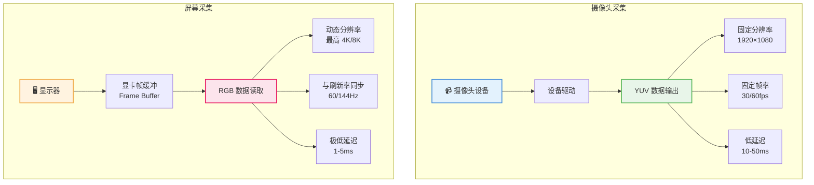
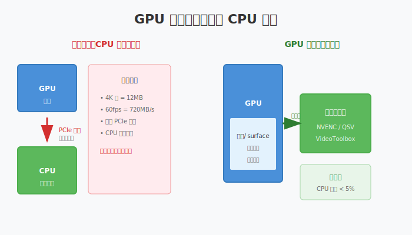
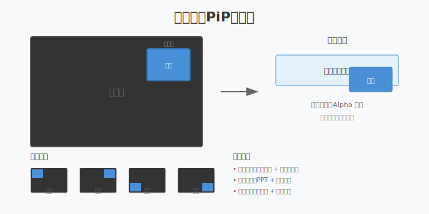
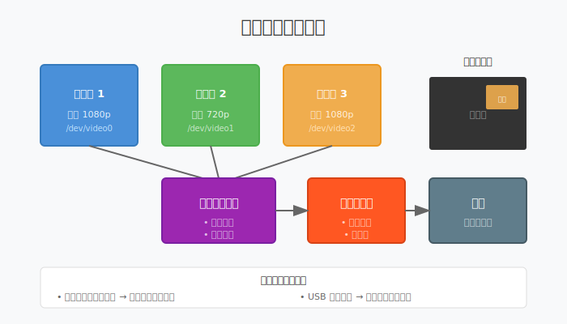
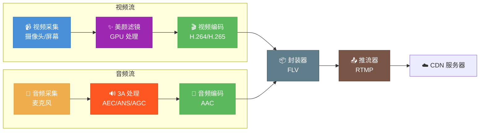

# 第十四章：高级采集技术

> **本章目标**：掌握屏幕采集、窗口采集、多摄像头切换，实现专业级采集能力。

在第十章中，我们学习了基础的摄像头和麦克风采集。对于普通视频通话，这些基础功能已经足够。但对于专业直播场景——无论是游戏直播、在线教学还是多机位直播——我们需要更强大的采集能力：

- **屏幕采集**：捕捉游戏画面、软件演示、PPT 讲解
- **多摄像头**：主摄 + 特写 + 广角，专业直播标配
- **画中画合成**：将多路画面叠加为一路输出
- **性能优化**：4K 屏幕采集的数据量巨大，必须优化

**本章与前后章的关系**：
- Ch10：基础采集（摄像头 + 麦克风）
- **Ch14：高级采集（屏幕 + 多摄像头 + 优化）**
- Ch15：采集后的美颜处理
- Ch16：整合为完整的主播端

---

## 目录

1. [屏幕采集的原理与挑战](#1-屏幕采集的原理与挑战)
2. [GPU 纹理共享：零拷贝优化](#2-gpu-纹理共享零拷贝优化)
3. [窗口采集与区域采集](#3-窗口采集与区域采集)
4. [画中画（PiP）合成技术](#4-画中画pip-合成技术)
5. [多摄像头管理与同步](#5-多摄像头管理与同步)
6. [采集参数优化策略](#6-采集参数优化策略)
7. [本章总结](#7-本章总结)

---

## 1. 屏幕采集的原理与挑战

### 1.1 屏幕采集 vs 摄像头采集



| 特性 | 摄像头采集 | 屏幕采集 |
|:---|:---|:---|
| **数据源** | 摄像头设备驱动 | 显卡帧缓冲（Frame Buffer）|
| **分辨率** | 固定（如 1920×1080） | 随显示器变化（可能 4K/8K）|
| **帧率** | 固定 30/60fps | 与显示器刷新率同步（60/144Hz）|
| **数据格式** | YUV（摄像头直接输出） | RGB（显卡帧缓冲格式）|
| **数据量** | 较小（1920×1080 @ 30fps ≈ 186 MB/s） | 巨大（3840×2160 @ 60fps ≈ 1.5 GB/s）|
| **延迟** | 10-50ms（硬件处理） | 1-5ms（直接内存读取）|
| **CPU 占用** | 低（DMA 传输） | 高（需要优化）|

### 1.2 屏幕采集的技术原理

**什么是帧缓冲（Frame Buffer）**：
显卡将渲染好的画面存储在显存中的特定区域，这个区域就是帧缓冲。屏幕采集的本质就是**读取帧缓冲中的像素数据**。

**单缓冲 vs 双缓冲**：
现代显示系统使用**双缓冲**避免画面撕裂：
- **前台缓冲（Front Buffer）**：当前正在显示的画面
- **后台缓冲（Back Buffer）**：显卡正在渲染的下一帧
- 采集时读取前台缓冲，不会干扰渲染

**采集时序**：
```
显示器刷新（60Hz）
    ↓
垂直同步信号（VSync）
    ↓
交换前后缓冲
    ↓
采集线程读取前台缓冲 ← 采集发生在这里
    ↓
下一帧渲染开始
```

### 1.3 屏幕采集的性能挑战

**数据量计算**：
4K 显示器 @ 60fps：
- 每帧大小：3840 × 2160 × 4 bytes（RGBA）= 33.2 MB
- 每秒数据量：33.2 MB × 60 = 1.99 GB/s
- 每分钟数据量：约 120 GB

**性能瓶颈**：
1. **显存到内存的拷贝**：PCIe 带宽有限（通常 16 GB/s 双向）
2. **格式转换**：RGBA → YUV 需要计算
3. **缩放**：4K 采集后通常需要缩放到 1080p 编码

### 1.4 FFmpeg 屏幕采集实现

**Linux（X11）**：
```bash
# 采集整个屏幕
ffmpeg -f x11grab -r 30 -s 1920x1080 -i :0.0 output.mp4

# 采集指定显示器（多显示器时）
ffmpeg -f x11grab -r 30 -s 1920x1080 -i :0.0+1920,0 output.mp4

# 采集指定区域
ffmpeg -f x11grab -r 30 -s 1280x720 -i :0.0+100,200 output.mp4
```

**参数说明**：
- `-f x11grab`：使用 X11 屏幕采集
- `-s 1920x1080`：采集分辨率（可小于屏幕分辨率，自动缩放）
- `-i :0.0`：显示器编号（`:0.0` 是主显示器）
- `+100,200`：从屏幕左上角偏移 (100,200) 开始采集

**macOS**：
```bash
# 需要授予屏幕录制权限
ffmpeg -f avfoundation -r 30 -i "0:0" output.mp4
```

**关键限制**：
- macOS 10.15+ 需要用户授权屏幕录制权限
- 采集时鼠标光标默认不包含，需要特殊处理

---

## 2. GPU 纹理共享：零拷贝优化

### 2.1 传统方式的问题

**CPU 拷贝路径**：
```
┌──────────┐    PCIe 拷贝    ┌──────────┐    CPU处理    ┌──────────┐
│ GPU 显存 │ ─────────────→ │ 系统内存 │ ───────────→ │ 编码器   │
│ 帧缓冲   │   1.5GB/s     │ RGB数据  │  格式转换    │ 输入    │
└──────────┘                └──────────┘              └──────────┘
         ↑____________________瓶颈___________________________↑
```

问题：
1. PCIe 带宽被占满，影响其他设备（如 NVMe SSD）
2. CPU 需要处理格式转换和缩放
3. 延迟增加，CPU 占用高

### 2.2 GPU 纹理共享方案



**核心思想**：
数据始终留在 GPU 显存，不经过 CPU 内存：
```
┌──────────┐    纹理共享    ┌──────────┐    硬件编码    ┌──────────┐
│ GPU 显存 │ ────────────→ │ GPU 显存 │ ───────────→ │ 编码器   │
│ 帧缓冲   │   零拷贝      │ 处理纹理 │   NVENC     │ 输出    │
└──────────┘                └──────────┘              └──────────┘
```

### 2.3 平台实现详解

**macOS（CoreGraphics + VideoToolbox）**：

macOS 提供 `CGDisplayStream` API，可以直接获取 `IOSurface`：

```cpp
// 创建显示流
CGDisplayStreamRef stream = CGDisplayStreamCreate(
    display_id,           // 显示器 ID
    width, height,        // 分辨率
    kCVPixelFormatType_420YpCbCr8BiPlanarVideoRange,  // YUV 格式
    nullptr,              // 选项
    ^(CGDisplayStreamFrameStatus status, 
      uint64_t time,
      IOSurfaceRef surface,
      CGDisplayStreamUpdateRef ref) {
        // surface 可以直接传给 VideoToolbox
        if (surface) {
            EncodeWithVideoToolbox(surface);
        }
    }
);

// 启动采集
CGDisplayStreamStart(stream);
```

**关键优势**：
- `IOSurface` 是显存中的共享缓冲区
- VideoToolbox 可以直接消费 `IOSurface`，无需拷贝
- 全程 GPU 处理，CPU 占用接近 0

**Linux（DMA-BUF + VAAPI）**：

较新的 Linux 内核支持 DMA-BUF（Direct Memory Access Buffer）：
```cpp
// 从 Wayland/X11 获取 DMA-BUF
struct dma_buf_fd = GetDmaBufFromCompositor();

// 导入到 VAAPI
VASurfaceID va_surface;
vaCreateSurfacesFromFD(va_display, dma_buf_fd, &va_surface);

// 直接编码
vaEncodePicture(va_context, va_surface);
```

**限制**：
- 需要 Wayland 或较新的 X11 + Mesa
- 需要显卡驱动支持（Intel/AMD 支持较好）

### 2.4 抽象接口设计

为了跨平台，需要抽象一层：

```cpp
// 平台无关的 GPU 纹理接口
class IGpuTexture {
public:
    virtual ~IGpuTexture() = default;
    
    // 获取尺寸
    virtual int GetWidth() const = 0;
    virtual int GetHeight() const = 0;
    virtual PixelFormat GetFormat() const = 0;
    
    // 平台特定的原生句柄
    // macOS: IOSurfaceRef
    // Linux: DMA-BUF fd
    // Windows: ID3D11Texture2D
    virtual void* GetNativeHandle() const = 0;
};

// 硬件编码器接口
class IHardwareEncoder {
public:
    virtual bool Initialize(const EncoderConfig& config) = 0;
    
    // 直接消费 GPU 纹理，零拷贝
    virtual bool Encode(IGpuTexture* texture) = 0;
    
    virtual EncodedPacket* GetPacket() = 0;
};
```

---

## 3. 窗口采集与区域采集

### 3.1 窗口采集 vs 屏幕采集

**屏幕采集的问题**：
- 采集整个屏幕，包含桌面、任务栏等无关内容
- 涉及隐私问题（可能采集到通知、聊天窗口）
- 数据量大，性能开销高

**窗口采集的优势**：
- 只采集特定应用窗口
- 更小的数据量
- 更好的隐私保护

### 3.2 窗口采集的实现方式

**方式 1：操作系统 API（推荐）**

macOS：
```cpp
// 使用 CGWindowListCopyWindowInfo 枚举窗口
// 使用 CGWindowCreateImage 捕获特定窗口
CGImageRef image = CGWindowCreateImage(
    window_id,
    kCGWindowBoundsIgnoreMinimum,
    kCGWindowImageDefault
);
```

**方式 2：区域采集（通用）**

如果不能直接获取窗口，可以先获取屏幕，然后裁剪：
```bash
# 获取窗口位置（使用 xwininfo 等工具）
# 假设窗口在 (100, 200)，大小 1280x720

ffmpeg -f x11grab -s 1280x720 -i :0.0+100,200 output.mp4
```

### 3.3 区域采集的应用场景

**场景 1：游戏直播**
- 只采集游戏窗口，不采集桌面
- 避免直播时暴露隐私

**场景 2：在线教学**
- 采集 PPT 区域 + 摄像头画中画
- 保持画面整洁

**场景 3：多路采集**
- 同时采集多个小区域
- 用于画中画的素材准备

---

## 4. 画中画（PiP）合成技术

### 4.1 什么是画中画

画中画（Picture-in-Picture, PiP）是将一个小视频画面叠加到主视频画面上的技术：
- 主画面：游戏/PPT/屏幕分享（全屏或大部分）
- 小窗：主播摄像头（角落）



### 4.2 合成原理

**图层概念**：
```
┌─────────────────────────────────┐
│         主画面（底层）            │
│   ┌───────────┐                 │
│   │           │                 │
│   │   小窗    │  ← 叠加层        │
│   │  (右上角)  │                 │
│   └───────────┘                 │
└─────────────────────────────────┘
```

**GPU 合成步骤**：
1. 将主画面渲染到全屏四边形
2. 在目标位置（如右上角）设置视口
3. 渲染缩放后的小窗画面
4. 使用 Alpha 混合处理边缘

### 4.3 合成 Shader 伪代码

```glsl
// 画中画合成 Shader
uniform sampler2D mainTexture;    // 主画面
uniform sampler2D pipTexture;     // 小窗画面
uniform vec4 pipRect;             // 小窗位置 (x, y, w, h)

void main() {
    vec2 uv = gl_FragCoord.xy / screenSize;
    vec4 color;
    
    // 判断是否在小窗区域内
    if (uv.x >= pipRect.x && uv.x <= pipRect.x + pipRect.z &&
        uv.y >= pipRect.y && uv.y <= pipRect.y + pipRect.w) {
        // 计算小窗 UV
        vec2 pipUV = (uv - pipRect.xy) / pipRect.zw;
        color = texture(pipTexture, pipUV);
    } else {
        // 主画面
        color = texture(mainTexture, uv);
    }
    
    gl_FragColor = color;
}
```

### 4.4 常见布局模式

| 布局 | 主画面 | 小窗位置 | 适用场景 |
|:---|:---|:---|:---|
| 经典布局 | 游戏/内容 | 右下角 | 游戏直播、教学 |
| 反转布局 | 主播 | 全屏 | 主播为主，内容小窗 |
| 左右分屏 | 内容 | 左侧 | 演示 + 讲解 |
| 三画面 | 内容 | 左上+右上 | 多人连线 |

---

## 5. 多摄像头管理与同步

### 5.1 为什么需要多摄像头

**专业直播的需求**：
- **主机位**：全景，展示主播全身
- **特写机位**：面部特写，表情细节
- **侧机位**：展示手部动作（如乐器演奏）
- **物品机位**：展示产品细节

**应用场景**：
- 电商直播：主播 + 产品特写
- 音乐直播：全景 + 乐器特写
- 教学直播：板书 + 讲师



### 5.2 多摄像头架构设计

**核心组件**：
```
┌─────────────┐    ┌─────────────┐    ┌─────────────┐
│  摄像头 1    │    │  摄像头 2    │    │  摄像头 3    │
│ /dev/video0 │    │ /dev/video1 │    │ /dev/video2 │
└──────┬──────┘    └──────┬──────┘    └──────┬──────┘
       │                  │                  │
       └──────────────────┼──────────────────┘
                          ↓
              ┌─────────────────┐
              │   设备管理器     │
              │  - 枚举设备      │
              │  - 打开/关闭     │
              └────────┬────────┘
                       ↓
              ┌─────────────────┐
              │    同步器        │
              │  - 时间戳对齐    │
              │  - 帧率匹配      │
              └────────┬────────┘
                       ↓
              ┌─────────────────┐
              │    切换器        │
              │  - 主副切换      │
              │  - 画中画合成    │
              └─────────────────┘
```

### 5.3 设备枚举与管理

**Linux V4L2 枚举**：
```cpp
class CameraManager {
public:
    std::vector<CameraInfo> EnumerateCameras() {
        std::vector<CameraInfo> cameras;
        
        for (int i = 0; i < 64; i++) {
            std::string device = "/dev/video" + std::to_string(i);
            int fd = open(device.c_str(), O_RDWR);
            if (fd < 0) continue;
            
            // 查询设备能力
            struct v4l2_capability cap;
            if (ioctl(fd, VIDIOC_QUERYCAP, &cap) == 0) {
                CameraInfo info;
                info.device = device;
                info.name = (char*)cap.card;
                info.is_capture_device = cap.capabilities & V4L2_CAP_VIDEO_CAPTURE;
                
                // 只添加视频采集设备
                if (info.is_capture_device) {
                    cameras.push_back(info);
                }
            }
            close(fd);
        }
        return cameras;
    }
};
```

### 5.4 多摄像头同步问题

**问题描述**：
每个摄像头有独立的硬件时钟，帧率可能有微小差异：
- 摄像头 A：30.00 fps
- 摄像头 B：30.02 fps（快 0.07%）

运行 5 分钟后，B 比 A 多出约 6 帧，导致不同步。

**解决方案**：
```cpp
class CameraSync {
public:
    // 注册摄像头
    void RegisterCamera(int camera_id, int fps);
    
    // 接收一帧
    void OnFrame(int camera_id, VideoFrame frame);
    
    // 获取同步的帧组
    std::vector<VideoFrame> GetSyncedFrames();
    
private:
    // 使用 PTS（Presentation Time Stamp）对齐
    // 允许的最大时间差：33ms（1帧@30fps）
    static constexpr int kMaxSyncDiffMs = 33;
    
    // 根据时间戳排序和匹配
    std::map<int, std::queue<VideoFrame>> frame_buffers_;
};
```

**时间戳生成**：
```cpp
// 使用单调时钟生成 PTS
int64_t GeneratePTS() {
    static auto start = std::chrono::steady_clock::now();
    auto now = std::chrono::steady_clock::now();
    return std::chrono::duration_cast<std::chrono::milliseconds>(
        now - start).count();
}
```

---

## 6. 采集参数优化策略

### 6.1 完整的采集 Pipeline



**Pipeline 各阶段**：
```
采集（摄像头/屏幕）→ 处理（美颜/滤镜）→ 编码 → 封装 → 推流
   ↓                      ↓                  ↓        ↓       ↓
 30fps                  30fps              30fps    30fps   网络
 YUV420                 RGB/YUV            H.264    FLV    RTMP
```

### 6.2 采集参数调优

**分辨率选择**：
| 场景 | 显示器分辨率 | 采集分辨率 | 理由 |
|:---|:---:|:---:|:---|
| 普通直播 | 1920×1080 | 1920×1080 | 原生分辨率 |
| 4K 屏幕直播 | 3840×2160 | 1920×1080 | 降采样减少数据量 |
| 游戏直播 | 2560×1440 | 1920×1080 | 平衡画质与性能 |

**帧率选择**：
```
显示器刷新率：144Hz
    ↓
采集帧率：30fps（每 4.8 帧取 1 帧）
    ↓
编码帧率：30fps
    ↓
推流帧率：30fps
```

**为什么采集帧率可以低于刷新率？**
- 直播通常只需要 30fps
- 高刷新率主要用于降低输入延迟（对直播不重要）
- 减少采集数据量，节省 CPU/GPU

### 6.3 性能优化技巧

**技巧 1：降分辨率采集**
```cpp
// 4K 显示器采集 1080p
capture_config.width = 1920;   // 不是 3840
capture_config.height = 1080;  // 不是 2160
// 数据量减少 75%
```

**技巧 2：限制采集帧率**
```cpp
// 即使显示器 144Hz，也只采集 30fps
// 跳过 114 帧/秒，大幅节省资源
capture_config.fps = 30;
```

**技巧 3：使用硬件编码**
```cpp
// 避免 CPU 编码占用
encoder_config.codec = "h264_nvenc";     // NVIDIA
// 或
encoder_config.codec = "h264_videotoolbox";  // macOS
```

**技巧 4：GPU 纹理共享**
```cpp
// 屏幕采集 → GPU 处理 → GPU 编码
// 全程不经过 CPU 内存
EnableGpuTextureSharing(true);
```

### 6.4 性能基准参考

| 配置 | CPU 占用 | 内存占用 | 适用场景 |
|:---|:---:|:---:|:---|
| 1080p 摄像头 | 5-10% | 200MB | 笔记本直播 |
| 1080p 屏幕采集 | 15-20% | 300MB | 桌面直播 |
| 4K 屏幕（优化后） | 25-35% | 500MB | 高端配置 |
| 多摄像头（2路） | 20-30% | 400MB | 专业直播 |

---

## 7. 本章总结

### 7.1 核心概念回顾

| 概念 | 关键点 |
|:---|:---|
| **帧缓冲** | 显卡存储画面的显存区域，屏幕采集的数据源 |
| **GPU 纹理共享** | 数据不经过 CPU 内存，全程 GPU 处理 |
| **画中画** | 多路视频叠加，常见于游戏直播和教学 |
| **多摄像头同步** | 使用 PTS 时间戳对齐不同摄像头的时序 |
| **降采样采集** | 4K 屏幕采集 1080p，减少 75% 数据量 |

### 7.2 技术选型建议

| 场景 | 推荐方案 |
|:---|:---|
| 游戏直播 | 屏幕采集 + GPU 纹理共享 + NVENC |
| 在线教学 | 屏幕采集（PPT区域）+ 摄像头画中画 |
| 电商直播 | 多摄像头 + 自动切换 |
| 音乐直播 | 多机位 + 手动切换 |

### 7.3 本章与前后章的衔接

**本章（Ch14）解决**：如何高效、灵活地采集视频源

**衔接 Ch15（美颜与滤镜）**：
采集后的原始画面需要美化处理，下一章将学习：
- GPU 图像处理管线
- 双边滤波磨皮算法
- 滤镜链架构设计

**衔接 Ch16（主播端架构）**：
Ch14（采集）+ Ch15（处理）+ Ch13（编码）+ Ch12（推流）= 完整主播端

---

**延伸阅读**：
- X11 屏幕采集：X11grab 文档
- macOS 屏幕采集：CGDisplayStream API 文档
- GPU 纹理共享：DMA-BUF 和 IOSurface 规范
