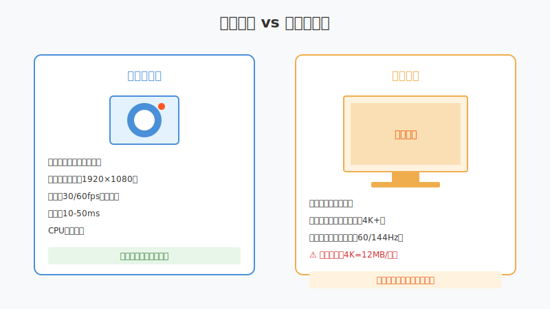
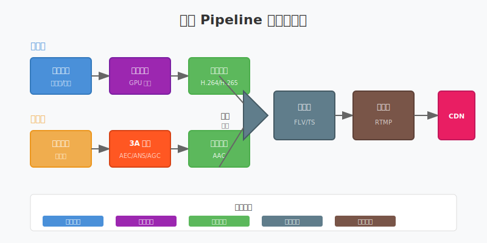

# 第十四章：高级采集技术

> **本章目标**：掌握屏幕采集、窗口采集、多摄像头切换，实现专业级采集能力。

第十章实现了基础的摄像头和麦克风采集。但专业直播场景需要更多能力：
- **屏幕采集**：游戏直播、在线教学
- **窗口采集**：仅采集特定应用窗口
- **多摄像头**：主摄像头 + 特写摄像头切换
- **采集优化**：分辨率适配、帧率控制

**阅读指南**：
- 第 1-2 节：屏幕采集原理与 GPU 优化
- 第 3-4 节：窗口采集、画中画合成
- 第 5-6 节：多摄像头管理、同步问题
- 第 7-8 节：性能优化、本章总结

---

## 目录

1. [屏幕采集原理](#1-屏幕采集原理)
2. [GPU 纹理共享优化](#2-gpu-纹理共享优化)
3. [窗口与区域采集](#3-窗口与区域采集)
4. [画中画合成](#4-画中画合成)
5. [多摄像头管理](#5-多摄像头管理)
6. [采集参数与性能](#6-采集参数与性能)
7. [本章总结](#7-本章总结)

---

## 1. 屏幕采集原理

### 1.1 屏幕采集 vs 摄像头采集



| 特性 | 摄像头采集 | 屏幕采集 |
|:---|:---|:---|
| **数据源** | 摄像头设备驱动 | 显卡帧缓冲 |
| **分辨率** | 固定（1920×1080 等） | 随显示器变化 |
| **帧率** | 30/60fps | 与显示器刷新率同步 |
| **数据量** | 较低 | 极高（4K = 12MB/帧） |
| **延迟** | 10-50ms | 1-5ms |
| **CPU 占用** | 低 | 高（需要优化） |

### 1.2 屏幕采集的挑战

**数据量巨大**：
- 4K 显示器：3840×2160 = 829 万像素
- 每帧原始数据：12 MB（RGB24）
- 60fps 时：**720 MB/s** 的数据量

**性能瓶颈**：
传统方式下，数据需要从 GPU 显存拷贝到 CPU 内存，经过处理后再传回 GPU 编码。这种"CPU 拷贝"是主要瓶颈。

### 1.3 FFmpeg 屏幕采集

Linux（使用 x11grab）：
```bash
# 采集整个屏幕
ffmpeg -f x11grab -r 30 -s 1920x1080 -i :0.0 -c:v libx264 output.mp4

# 采集指定区域
ffmpeg -f x11grab -r 30 -s 1280x720 -i :0.0+100,200 -c:v libx264 output.mp4
```

macOS（使用 avfoundation）：
```bash
# 采集屏幕（设备索引 0 通常是屏幕）
ffmpeg -f avfoundation -r 30 -i "0:0" -c:v libx264 output.mp4
```

**参数说明**：
- `-f x11grab`：使用 X11 屏幕采集
- `-s 1920x1080`：采集分辨率
- `-i :0.0+100,200`：从屏幕左上角偏移 (100,200) 开始采集

---

## 2. GPU 纹理共享优化

### 2.1 为什么要用 GPU 处理


**传统方式的问题**：
```
GPU 显存 → PCIe 拷贝 → CPU 内存 → 处理 → PCIe 拷贝 → GPU 显存 → 编码
         ↑____________瓶颈____________↑
```

4K 屏幕每秒 720MB 数据，PCIe 带宽被占满，CPU 处理延迟高。

**GPU 纹理共享方案**：
```
GPU 显存 → 纹理共享 → GPU 编码器 → 输出
   （零拷贝，直接在显存处理）
```

### 2.2 平台实现

**macOS（CoreGraphics + VideoToolbox）**：
- 使用 `CGDisplayStream` 获取 `IOSurface`
- `IOSurface` 可直接传给 VideoToolbox 硬件编码器
- 全程 GPU 处理，零 CPU 拷贝

**Linux（DMA-BUF + VAAPI）**：
- 使用 `DMA-BUF` 机制共享 GPU buffer
- VAAPI 硬件编码器直接读取
- 需要较新的内核和驱动支持

**关键接口设计**：
```cpp
// 抽象的 GPU 纹理接口
class IGpuTexture {
public:
    virtual ~IGpuTexture() = default;
    virtual int GetWidth() const = 0;
    virtual int GetHeight() const = 0;
    // 获取原生句柄（platform-specific）
    virtual void* GetNativeHandle() = 0;
};

// 硬件编码器直接消费 GPU 纹理
class IHardwareEncoder {
public:
    virtual bool Encode(IGpuTexture* texture) = 0;
};
```

---

## 3. 窗口与区域采集

### 3.1 窗口采集原理

屏幕采集采集的是整个显示器，而窗口采集只采集特定应用的窗口：

**macOS**：
```bash
# 需要知道窗口 ID
ffmpeg -f avfoundation -i "0:0" -vf "crop=800:600:100:100" output.mp4
```

**Linux**：
```bash
# 使用 xwininfo 获取窗口位置，然后区域采集
xwininfo  # 点击窗口获取坐标
ffmpeg -f x11grab -s 800x600 -i :0.0+100,200 -c:v libx264 output.mp4
```

### 3.2 区域采集的使用场景

1. **隐私保护**：只采集应用窗口，不采集桌面其他内容
2. **性能优化**：采集区域比全屏数据量少
3. **多路采集**：同时采集多个小区域（如画中画的素材）

---

## 4. 画中画合成

### 4.1 画中画（PiP）原理


**合成流程**：
1. 主视频作为底层（全尺寸）
2. 小窗视频缩放到合适尺寸
3. 将小窗叠加到主视频的角落
4. 使用 Alpha 混合处理边缘

### 4.2 GPU 合成实现

```cpp
// 伪代码：GPU 画中画合成
void ComposePip(IGpuTexture* main, IGpuTexture* pip, 
                int pip_x, int pip_y, int pip_w, int pip_h) {
    // 1. 绑定主画面为渲染目标
    BindRenderTarget(main);
    
    // 2. 绘制主画面（全屏）
    DrawFullscreenQuad(main);
    
    // 3. 设置小窗位置和大小
    SetViewport(pip_x, pip_y, pip_w, pip_h);
    
    // 4. 绘制小窗（缩放后的pip）
    DrawScaledQuad(pip);
}
```

### 4.3 常见布局

| 布局 | 主画面 | 小窗位置 | 适用场景 |
|:---|:---|:---|:---|
| 游戏直播 | 游戏画面 | 右下角 | 展示游戏 + 主播 |
| 在线教学 | PPT/屏幕 | 左/右下角 | 展示课件 + 讲师 |
| 视频会议 | 共享屏幕 | 右上角 | 演示 + 发言人 |
| 画中画反转 | 主播 | 全屏 | 主播为主，展示反应 |

---

## 5. 多摄像头管理

### 5.1 多摄像头架构


**核心组件**：
1. **设备管理器**：枚举、打开、关闭摄像头设备
2. **帧队列**：每个摄像头独立的缓冲队列
3. **同步器**：时间戳对齐，确保多路视频同步
4. **切换器**：主副画面切换、画中画合成

### 5.2 设备枚举

Linux 使用 V4L2 枚举：
```cpp
// 枚举所有视频设备
for (int i = 0; i < 10; i++) {
    std::string device = "/dev/video" + std::to_string(i);
    int fd = open(device.c_str(), O_RDWR);
    if (fd >= 0) {
        // 查询设备能力
        struct v4l2_capability cap;
        ioctl(fd, VIDIOC_QUERYCAP, &cap);
        printf("设备 %s: %s\n", device.c_str(), cap.card);
        close(fd);
    }
}
```

### 5.3 多摄像头同步问题

**问题**：每个摄像头有独立的硬件时钟，帧率可能有微小差异。

**解决方案**：
```cpp
// 使用时间戳对齐
class CameraSync {
public:
    void OnFrame(int camera_id, VideoFrame frame) {
        // 记录到达时间
        frame.recv_time = GetTimestampMs();
        
        // 等待同步窗口内的所有帧
        buffers_[camera_id].push(frame);
        
        // 检查是否可以输出同步帧组
        if (CheckSyncReady()) {
            OutputSyncedFrames();
        }
    }
    
private:
    // 允许的最大时间差：33ms（1帧@30fps）
    static constexpr int kMaxSyncDiffMs = 33;
};
```

---

## 6. 采集参数与性能

### 6.1 采集 Pipeline 完整数据流



**多线程设计**：
- 采集线程：从设备读取原始帧
- 处理线程：美颜、滤镜、格式转换
- 编码线程：视频/音频编码
- 封装线程：混合、封装为 FLV/TS
- 推流线程：网络发送

### 6.2 性能优化策略

**1. 降低采集分辨率**：
```cpp
// 4K 显示器采集 1080p
// 数据量减少 75%，视觉差异不大
capture_config.width = 1920;
capture_config.height = 1080;
```

**2. 限制采集帧率**：
```cpp
// 显示器 144Hz，但直播只需要 30fps
// 跳过不必要的帧
capture_config.fps = 30;
```

**3. 使用硬件编码**：
```cpp
// 避免 CPU 编码占用
encoder_config.codec = "h264_nvenc";  // NVIDIA
// 或
encoder_config.codec = "h264_videotoolbox";  // macOS
```

### 6.3 性能指标参考

| 场景 | 目标 CPU | 目标延迟 | 优化要点 |
|:---|:---:|:---:|:---|
| 1080p 摄像头采集 | < 10% | 30ms | 硬件编码 |
| 1080p 屏幕采集 | < 20% | 50ms | GPU 纹理共享 |
| 4K 屏幕采集 | < 30% | 100ms | 降低采集分辨率 |
| 多摄像头 (2路) | < 25% | 50ms | 异步采集、统一编码 |

---

## 7. 本章总结

### 核心概念

| 概念 | 一句话解释 |
|:---|:---|
| GPU 纹理共享 | 屏幕数据不经过 CPU，直接在 GPU 处理 |
| 画中画（PiP） | 将小视频叠加到主视频角落 |
| 多摄像头同步 | 用时间戳对齐多路视频的时序 |
| 区域采集 | 只采集屏幕的一部分，减少数据量 |

### 关键技能

- 使用 FFmpeg 进行屏幕采集
- 理解 GPU 纹理共享原理
- 实现画中画合成功能
- 管理多摄像头设备

### 性能优化清单

- [ ] 屏幕采集使用 GPU 纹理共享
- [ ] 降低采集分辨率（4K→1080p）
- [ ] 限制采集帧率（匹配输出需求）
- [ ] 使用硬件编码
- [ ] 多摄像头异步采集 + 同步输出

---

**下一步**：第十五章将学习**美颜与滤镜**——GPU 图像处理、磨皮算法、滤镜链设计。
