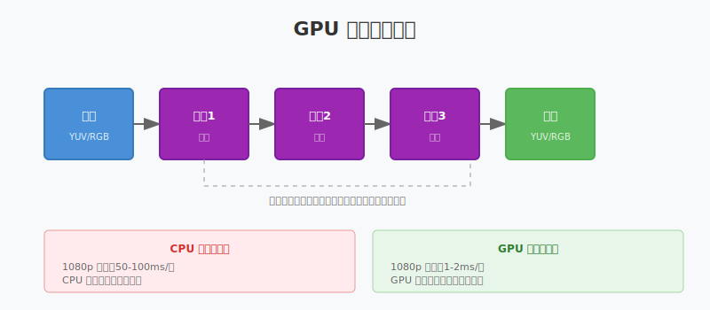
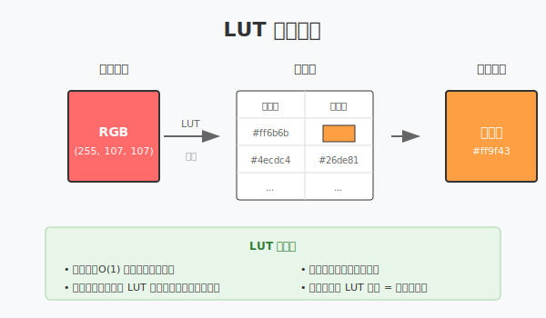
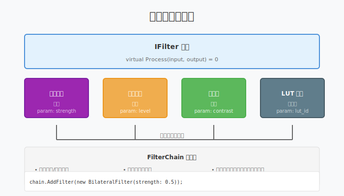

# 第十五章：美颜与滤镜

> **本章目标**：理解 GPU 图像处理原理，掌握美颜算法，学会设计滤镜链。

在第十四章中，我们学习了如何高效采集视频源。但采集的原始画面往往不够理想——肤色暗沉、皮肤瑕疵、光线不均。美颜处理是直播的标配功能，它能显著提升画面观感，让主播呈现出更好的状态。

**美颜的技术挑战**：
- **实时性**：直播不能卡顿，美颜处理必须 < 5ms/帧
- **自然度**：磨皮不能磨掉五官细节，要"美得自然"
- **可调节**：不同主播、不同场景需要不同的美颜强度

**本章与前后章的关系**：
- Ch14：采集原始画面
- **Ch15：美颜处理（本章）**
- Ch16：整合为完整主播端

⚠️ **前置知识**：本章涉及 GPU 和 Shader 概念。如果对这些不熟悉，建议先阅读第 0 节快速入门。

---

## 目录

0. [前置知识：GPU 与 Shader 基础](#0-前置知识gpu-与-shader-基础)
1. [磨皮算法：从均值滤波到双边滤波](#1-磨皮算法从均值滤波到双边滤波)
2. [双边滤波深度解析](#2-双边滤波深度解析)
3. [美白与 LUT 调色](#3-美白与-lut-调色)
4. [滤镜链架构设计](#4-滤镜链架构设计)
5. [性能优化实战](#5-性能优化实战)
6. [本章总结](#6-本章总结)

---

## 0. 前置知识：GPU 与 Shader 基础

### 0.1 为什么美颜必须用 GPU

**CPU 处理的问题**：
1080p 视频每帧 207 万像素，30fps 时每秒处理 6220 万像素。

假设一个简单的磨皮算法需要 100 次浮点运算/像素：
- 每帧：207万 × 100 = 2.07 亿次运算
- 每秒：2.07亿 × 30 = 62.1 亿次运算

CPU（如 Intel i7）单核峰值约 100 GFLOPS，但串行处理限制了实际性能：
- 实际处理一帧需要 50-100ms
- 每秒只能处理 10-20 帧
- **无法满足 30fps 实时要求**

**GPU 的优势**：
- 数千个并行计算核心
- 专门优化图像/矩阵运算
- 1080p 美颜处理 < 2ms/帧

### 0.2 什么是 Shader

**Shader（着色器）** 是运行在 GPU 上的小程序，专门处理图像像素。

**GPU 并行处理模型**：
```
CPU 串行处理：
for (每个像素) { 处理像素; }  // 一个一个来

GPU 并行处理：
处理所有像素同时;  // 数千个核心一起上
```

**最简单的 Shader（亮度提升）**：
```glsl
// Fragment Shader：每个像素运行一次
void main() {
    // 读取当前像素颜色
    vec4 color = texture(inputImage, textureCoord);
    
    // 提升亮度 20%
    color.rgb *= 1.2;
    
    // 输出处理后的颜色
    outputColor = color;
}
```

### 0.3 GPU 图像处理管线



**管线各阶段**：
```
输入纹理（YUV/RGB）
    ↓
[顶点着色器] - 确定像素位置
    ↓
[片段着色器] - 处理像素颜色（美颜算法在这里）
    ↓
[帧缓冲] - 输出结果
    ↓
下一级滤镜的输入纹理
```

### 0.4 离屏渲染（Off-screen Rendering）

美颜处理不需要显示到屏幕，只需要处理后的数据传给编码器。

**离屏渲染的核心概念**：
- **FBO（Frame Buffer Object）**：离屏渲染的目标
- **纹理绑定**：将 FBO 的输出绑定为纹理，供下一级使用
- **纹理链**：多级滤镜串联，每级输出作为下一级输入

---

## 1. 磨皮算法：从均值滤波到双边滤波

### 1.1 磨皮的核心矛盾

**理想效果**：
- 皮肤光滑、无瑕疵
- 眼睛、嘴巴轮廓清晰
- 毛发、衣物纹理保留

**传统滤波的问题**：

| 算法 | 原理 | 问题 |
|:---|:---|:---|
| **均值滤波** | 取周围像素的平均值 | 边缘模糊，整体发虚 |
| **高斯滤波** | 加权平均，权重随距离衰减 | 比均值好，但边缘仍模糊 |
| **双边滤波** | 加权平均，权重考虑距离+颜色差异 | 平滑皮肤，保留边缘 ✓ |

### 1.2 均值滤波与高斯滤波

**均值滤波**：
```
当前像素 = 周围 3×3 像素的平均值
```
问题：对边缘和细节一视同仁，导致整体模糊。

**高斯滤波**：
```
当前像素 = 周围像素的加权平均
权重 = 高斯函数(距离中心点的距离)
```
距离越远的像素影响越小，但仍然会模糊边缘。

### 1.3 双边滤波的直觉理解

**关键洞察**：
皮肤区域的像素颜色相似，可以平滑处理；
边缘（如皮肤→眼睛）的像素颜色差异大，应该保留。

**类比**：
想象你在整理一盒混合的积木：
- **均值/高斯滤波**：不管颜色，全部混在一起（结果一团糟）
- **双边滤波**：相似颜色的积木才混在一起，不同颜色的保持分离

---

## 2. 双边滤波深度解析

### 2.1 双边滤波的数学原理

双边滤波的权重由两个因子相乘得到：
```
权重 = 空间权重 × 颜色权重

空间权重：距离越近，权重越大（和高斯一样）
颜色权重：颜色越相似，权重越大（双边滤波的关键）
```

**公式**：
```
I'(x) = (1/W) × Σ I(y) × Gs(||x-y||) × Gr(|I(x)-I(y)|)

其中：
- I(x)：像素 x 的颜色
- Gs：空间高斯函数（距离权重）
- Gr：颜色高斯函数（颜色相似度权重）
- W：归一化因子
```

### 2.2 双边滤波的可视化


**平滑区域（如脸颊）**：
- 周围像素颜色相似
- 颜色权重 ≈ 1
- 效果类似于高斯滤波 → 平滑

**边缘区域（如眼睛轮廓）**：
- 皮肤像素 vs 眼睛像素，颜色差异大
- 颜色权重 ≈ 0
- 眼睛像素几乎不影响皮肤像素 → 边缘保留

### 2.3 双边滤波 Shader 实现

```glsl
uniform sampler2D inputImage;
uniform vec2 imageSize;
uniform float sigmaSpace;  // 空间 sigma
uniform float sigmaColor;  // 颜色 sigma

vec3 BilateralFilter(vec2 uv) {
    vec3 center = texture(inputImage, uv).rgb;
    vec3 result = vec3(0.0);
    float weightSum = 0.0;
    
    // 遍历周围 5×5 区域
    for (int x = -2; x <= 2; x++) {
        for (int y = -2; y <= 2; y++) {
            vec2 offset = vec2(float(x), float(y)) / imageSize;
            vec2 sampleUV = uv + offset;
            vec3 sample = texture(inputImage, sampleUV).rgb;
            
            // 空间权重：基于像素距离
            float spatialDist = length(vec2(float(x), float(y)));
            float spatialWeight = exp(-(spatialDist * spatialDist) / (2.0 * sigmaSpace * sigmaSpace));
            
            // 颜色权重：基于颜色差异
            float colorDist = length(center - sample);
            float colorWeight = exp(-(colorDist * colorDist) / (2.0 * sigmaColor * sigmaColor));
            
            // 双边权重
            float weight = spatialWeight * colorWeight;
            
            result += sample * weight;
            weightSum += weight;
        }
    }
    
    return result / weightSum;
}
```

### 2.4 参数调优指南

| 参数 | 作用 | 推荐值 | 影响 |
|:---|:---|:---:|:---|
| `sigmaSpace` | 空间影响范围 | 3-5 | 越大磨皮范围越大 |
| `sigmaColor` | 颜色敏感度 | 0.1-0.3 | 越小边缘保留越好 |
| `kernelSize` | 滤波窗口大小 | 5×5 ~ 9×9 | 越大计算量越大 |
| `blend` | 原图与磨皮图混合比例 | 0.3-0.7 | 越大磨皮效果越明显 |

**调参技巧**：
- `sigmaColor` 是关键：太小磨不干净，太大边缘会糊
- 可先降采样做双边滤波，再放大，速度提升 4 倍

---

## 3. 美白与 LUT 调色

### 3.1 亮度与对比度调节

**简单美白（提升亮度）**：
```glsl
vec3 Brightness(vec3 color, float level) {
    // level: 0.0~2.0，1.0 为原亮度
    return color * level;
}
```

**问题**：单纯提升亮度会让画面"发白"，失去层次感。

**对比度调节**：
```glsl
vec3 Contrast(vec3 color, float contrast) {
    // contrast: 0.0~2.0，1.0 为原对比度
    // 先减 0.5 移到中心，乘对比度，再加 0.5 移回去
    return (color - 0.5) * contrast + 0.5;
}
```

**美白 + 对比度联合调节**：
```glsl
vec3 BeautyAdjust(vec3 color, float brightness, float contrast) {
    color = Brightness(color, brightness);  // 先提亮
    color = Contrast(color, contrast);       // 再调对比度
    return color;
}
```

### 3.2 LUT（Lookup Table）调色

**问题**：如何实现"日系清新"、"复古胶片"、"电影感"等不同风格？

**LUT 方案**：
- 不做实时计算，而是"查表"
- 输入颜色 → 查表 → 输出颜色
- 换一张表 = 换一种风格



**3D LUT 原理**：
```
输入 RGB (256×256×256 种可能)
    ↓
3D LUT 纹理（通常是 64×64×64 或 33×33×33）
    ↓
输出 RGB（变换后的颜色）
```

**LUT 的优势**：
1. **速度极快**：O(1) 查找，无计算
2. **效果一致**：同样的 LUT 文件在任何平台效果相同
3. **专业调色**：可以用 Photoshop 制作 LUT，直接应用到直播

### 3.3 LUT Shader 实现

```glsl
uniform sampler2D inputImage;
uniform sampler3D lutTexture;  // 3D LUT 纹理
uniform float lutSize;         // 通常是 33 或 64

vec3 ApplyLUT(vec3 color) {
    // 将 RGB (0.0~1.0) 映射到 LUT 坐标空间
    vec3 lutCoord = color * ((lutSize - 1.0) / lutSize) + (0.5 / lutSize);
    
    // 采样 3D LUT
    return texture(lutTexture, lutCoord).rgb;
}
```

**常用 LUT 风格**：
| 风格 | 特点 | 适用场景 |
|:---|:---|:---|
| 日系清新 | 提高亮度，降低对比度，偏青 | 户外、美食 |
| 复古胶片 | 增加颗粒感，偏暖黄 | 文艺、怀旧 |
| 电影感 | 低饱和度，高对比度，偏青橙 | 人物、故事 |
| 冷白皮 | 提亮，偏蓝 | 人像、美妆 |

---

## 4. 滤镜链架构设计

### 4.1 设计目标

一个完整的直播美颜系统需要支持：
- **多级处理**：磨皮 → 美白 → 调色 → 锐化
- **动态开关**：主播可以随时开关某个效果
- **参数调节**：实时调整美颜强度
- **性能优化**：不用的滤镜不消耗资源

### 4.2 滤镜链架构



**设计原则**：
1. **接口统一**：所有滤镜实现相同的接口
2. **可组合**：任意组合，顺序可调
3. **懒加载**：未启用的滤镜不绑定、不渲染

### 4.3 接口设计

```cpp
// 滤镜基类
class IFilter {
public:
    virtual ~IFilter() = default;
    
    // 初始化（创建 GPU 资源）
    virtual bool Initialize(int width, int height) = 0;
    
    // 处理一帧
    virtual void Process(GpuTexture* input, GpuTexture* output) = 0;
    
    // 是否启用
    virtual bool IsEnabled() const { return enabled_; }
    virtual void SetEnabled(bool enabled) { enabled_ = enabled; }
    
    // 释放资源
    virtual void Release() = 0;
    
protected:
    bool enabled_ = true;
    int width_ = 0;
    int height_ = 0;
};

// 双边滤波实现
class BilateralFilter : public IFilter {
public:
    void SetStrength(float strength) { strength_ = strength; }
    void SetSigmaColor(float sigma) { sigma_color_ = sigma; }
    
    void Process(GpuTexture* input, GpuTexture* output) override {
        if (!enabled_) {
            // 如果禁用，直接拷贝
            CopyTexture(input, output);
            return;
        }
        
        // 绑定 Shader 参数
        shader_.SetUniform("sigmaColor", sigma_color_);
        shader_.SetUniform("sigmaSpace", 3.0f);
        
        // 渲染
        RenderFullscreenQuad(shader_, input, output);
    }
    
private:
    float strength_ = 0.5f;
    float sigma_color_ = 0.15f;
    Shader shader_;
};

// 亮度调节实现
class BrightnessFilter : public IFilter {
public:
    void SetLevel(float level) { level_ = level; }
    
    void Process(GpuTexture* input, GpuTexture* output) override {
        if (!enabled_ || level_ == 1.0f) {
            CopyTexture(input, output);
            return;
        }
        
        shader_.SetUniform("brightness", level_);
        RenderFullscreenQuad(shader_, input, output);
    }
    
private:
    float level_ = 1.0f;
    Shader shader_;
};
```

### 4.4 滤镜链管理器

```cpp
class FilterChain {
public:
    // 添加滤镜到链尾
    void AddFilter(std::unique_ptr<IFilter> filter) {
        filters_.push_back(std::move(filter));
    }
    
    // 处理一帧
    void ProcessFrame(GpuTexture* input, GpuTexture* output) {
        if (filters_.empty()) {
            CopyTexture(input, output);
            return;
        }
        
        GpuTexture* current_input = input;
        GpuTexture temp_texture;  // 临时纹理
        
        for (size_t i = 0; i < filters_.size(); i++) {
            // 确定输出目标
            GpuTexture* current_output = (i == filters_.size() - 1) 
                ? output : &temp_texture;
            
            // 处理
            filters_[i]->Process(current_input, current_output);
            
            // 当前输出成为下一级输入
            current_input = current_output;
        }
    }
    
    // 动态调整滤镜参数
    void SetFilterParam(size_t index, const std::string& name, float value) {
        if (index < filters_.size()) {
            // 根据 name 设置对应参数
            // 具体实现取决于滤镜类型
        }
    }
    
private:
    std::vector<std::unique_ptr<IFilter>> filters_;
};
```

### 4.5 使用示例

```cpp
// 创建滤镜链
FilterChain chain;

// 添加磨皮滤镜
auto bilateral = std::make_unique<BilateralFilter>();
bilateral->SetStrength(0.6f);
chain.AddFilter(std::move(bilateral));

// 添加美白滤镜
auto brightness = std::make_unique<BrightnessFilter>();
brightness->SetLevel(1.15f);
chain.AddFilter(std::move(brightness));

// 添加 LUT 调色滤镜
auto lut = std::make_unique<LUTFilter>();
lut->LoadLUT("skin_warm.cube");
chain.AddFilter(std::move(lut));

// 处理视频帧
chain.ProcessFrame(cameraTexture, outputTexture);
```

---

## 5. 性能优化实战

### 5.1 美颜性能预算

以 1080p@30fps 直播为例：
- **总时间预算**：33ms/帧（1000ms/30fps）
- **美颜处理预算**：< 5ms（留给采集、编码、网络更多时间）

**各级处理时间参考**：

| 滤镜 | 1080p 处理时间 | 优化后 |
|:---|:---:|:---:|
| 双边滤波（全分辨率）| 8-10ms | - |
| 双边滤波（降采样）| - | 2-3ms |
| 亮度/对比度调节 | 0.5ms | 0.5ms |
| LUT 调色 | 1ms | 1ms |
| **完整滤镜链** | **~12ms** | **< 5ms** |

### 5.2 优化技巧 1：降采样双边滤波

**原理**：
- 将 1080p 降到 540p 做双边滤波
- 再放大回 1080p
- 效果损失很小，速度快 4 倍

```cpp
void FastBilateralFilter(GpuTexture* input, GpuTexture* output) {
    // 1. 创建降采样纹理（540p）
    GpuTexture downsampled(input->GetWidth() / 2, input->GetHeight() / 2);
    
    // 2. 降采样
    Downsample(input, &downsampled);
    
    // 3. 在降采样分辨率做双边滤波
    GpuTexture filtered(downsampled.GetWidth(), downsampled.GetHeight());
    BilateralFilter(&downsampled, &filtered);
    
    // 4. 上采样回原始分辨率
    Upsample(&filtered, output);
}
```

### 5.3 优化技巧 2：Shader 合并

**问题**：每个滤镜都是一个渲染 Pass，切换开销大。

**方案**：将简单滤镜合并到一个 Shader。

```glsl
// 合并亮度、对比度、饱和度调节
uniform sampler2D inputImage;
uniform float brightness;
uniform float contrast;
uniform float saturation;

void main() {
    vec3 color = texture(inputImage, uv).rgb;
    
    // 亮度
    color *= brightness;
    
    // 对比度
    color = (color - 0.5) * contrast + 0.5;
    
    // 饱和度
    float gray = dot(color, vec3(0.299, 0.587, 0.114));
    color = mix(vec3(gray), color, saturation);
    
    outputColor = vec4(color, 1.0);
}
```

### 5.4 优化技巧 3：跳过未启用的滤镜

```cpp
void FilterChain::ProcessFrame(GpuTexture* input, GpuTexture* output) {
    // 统计实际启用的滤镜数
    int enabled_count = 0;
    for (const auto& filter : filters_) {
        if (filter->IsEnabled()) enabled_count++;
    }
    
    if (enabled_count == 0) {
        // 全部禁用，直接拷贝
        CopyTexture(input, output);
        return;
    }
    
    // 只处理启用的滤镜
    // ...
}
```

### 5.5 优化技巧 4：硬件预处理

部分硬件编码器（如 NVIDIA NVENC）支持内置降噪：
```cpp
// 使用 NVENC 的降噪功能替代软件双边滤波
encoder_config.enableNoiseReduction = true;
encoder_config.noiseReductionLevel = 3;  // 1-5
```

优点：不占用 GPU 计算资源，速度快。
缺点：效果不如软件算法精细，参数不可调。

---

## 6. 本章总结

### 6.1 核心概念回顾

| 概念 | 关键点 |
|:---|:---|
| **双边滤波** | 磨皮 + 保边，权重 = 空间权重 × 颜色权重 |
| **LUT 调色** | 查表实现风格化，速度快、效果可控 |
| **滤镜链** | 多级滤镜串联，接口统一，动态开关 |
| **降采样优化** | 540p 做双边滤波再放大，速度提升 4 倍 |
| **Shader 合并** | 简单滤镜合并，减少渲染 Pass |

### 6.2 美颜算法选择指南

| 需求 | 推荐方案 | 处理时间 |
|:---|:---|:---:|
| 基础磨皮 | 降采样双边滤波 | 2-3ms |
| 高级磨皮 | 全分辨率双边滤波 + 皮肤 mask | 8-10ms |
| 美白 | 亮度 + 对比度调节 | 0.5ms |
| 风格化 | 3D LUT | 1ms |
| 瘦脸/大眼 | 顶点变形（Mesh Warp）| 3-5ms |

### 6.3 滤镜链设计最佳实践

1. **顺序优化**：磨皮 → 美白 → 调色 → 锐化
2. **降采样**：复杂滤镜（如双边滤波）在降采样分辨率执行
3. **懒加载**：未启用的滤镜不创建 GPU 资源
4. **参数缓存**：Shader  Uniform 值变化时才更新

### 6.4 本章与前后章的衔接

**本章（Ch15）解决**：如何实时美化视频画面

**来自 Ch14（高级采集）**：
- 采集的原始画面作为美颜输入
- GPU 纹理共享技术（采集的 GPU 纹理直接传给美颜处理）

**衔接 Ch16（主播端架构）**：
- 美颜滤镜作为 Pipeline 的一个模块
- 与采集、编码模块通过接口解耦

---

**延伸阅读**：
- 双边滤波论文："Bilateral Filtering for Gray and Color Images"
- GPU Gems：实时图像处理技术
- 3D LUT 制作：Photoshop 导出 .cube 文件格式
