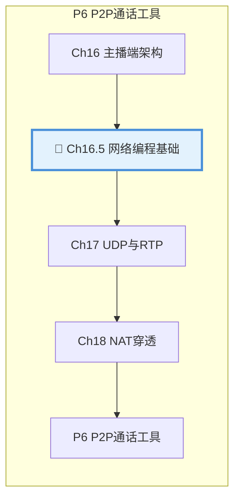

# 第16.5章：网络编程基础（新增）

| 项目 | 内容 |
|:---|:---|
| **本章目标** | 掌握Socket API、UDP编程、字节序转换等网络编程基础 |
| **难度** | ⭐⭐ 中等 |
| **前置知识** | Ch16：主播端架构、C++ 基础 |
| **预计时间** | 2-3 小时 |

> **本章引言**：在学习实时传输协议（RTP/RTCP）之前，我们需要先掌握网络编程的基础知识。本章将从最底层的 Socket API 开始，带你理解网络通信的本质。

**本章与项目的关系**：


通过本章的学习，你将：
- 理解 Socket API 的核心概念
- 掌握 UDP 编程的基本方法
- 理解字节序问题及解决方案
- 能够编写简单的网络通信程序

**阅读指南**：
- 第 1-2 节：Socket API 基础，理解网络编程接口
- 第 3-4 节：UDP 编程详解，掌握无连接通信
- 第 5-6 节：字节序与数据序列化
- 第 7-8 节：实战示例与常见问题

---

## 目录

1. [Socket API 基础](#1-socket-api-基础)
2. [地址与端口](#2-地址与端口)
3. [UDP 编程入门](#3-udp-编程入门)
4. [UDP 高级话题](#4-udp-高级话题)
5. [字节序问题](#5-字节序问题)
6. [数据序列化](#6-数据序列化)
7. [实战：Echo 服务器](#7-实战echo-服务器)
8. [FAQ 常见问题](#8-faq-常见问题)
9. [本章小结](#9-本章小结)
10. [下章预告](#10-下章预告)

---

## 1. Socket API 基础

### 1.1 什么是 Socket

**Socket（套接字）**是操作系统提供的网络通信接口，是应用程序与网络协议栈之间的桥梁。

```
┌─────────────────────────────────────────────────┐
│                  应用程序                        │
│              (你的代码)                          │
├─────────────────────────────────────────────────┤
│  ┌─────────┐  ┌─────────┐  ┌─────────────────┐  │
│  │ Socket  │  │ Socket  │  │     Socket      │  │
│  │  (TCP)  │  │  (UDP)  │  │   (Raw IP)      │  │
│  └────┬────┘  └────┬────┘  └────────┬────────┘  │
├───────┼────────────┼────────────────┼───────────┤
│       ↓            ↓                ↓           │
│  ┌──────────────────────────────────────────┐   │
│  │         传输层 (TCP/UDP)                  │   │
│  └──────────────────────────────────────────┘   │
│  ┌──────────────────────────────────────────┐   │
│  │         网络层 (IP)                       │   │
│  └──────────────────────────────────────────┘   │
│  ┌──────────────────────────────────────────┐   │
│  │         链路层 (以太网/WiFi)              │   │
│  └──────────────────────────────────────────┘   │
└─────────────────────────────────────────────────┘
```

### 1.2 Socket 类型

| Socket 类型 | 协议 | 特点 | 适用场景 |
|:---:|:---:|:---|:---|
| **SOCK_STREAM** | TCP | 面向连接、可靠、有序 | 文件传输、HTTP |
| **SOCK_DGRAM** | UDP | 无连接、不可靠、快速 | 实时音视频、DNS |
| **SOCK_RAW** | IP | 直接访问底层 | 网络工具、ping |

### 1.3 核心 API 概览

```cpp
#include <sys/socket.h>
#include <netinet/in.h>
#include <arpa/inet.h>
#include <unistd.h>

// 创建 Socket
int socket(int domain, int type, int protocol);

// 绑定地址（服务器）
int bind(int sockfd, const struct sockaddr* addr, socklen_t addrlen);

// 监听连接（TCP服务器）
int listen(int sockfd, int backlog);

// 接受连接（TCP服务器）
int accept(int sockfd, struct sockaddr* addr, socklen_t* addrlen);

// 连接到服务器（TCP客户端）
int connect(int sockfd, const struct sockaddr* addr, socklen_t addrlen);

// 发送数据
ssize_t send(int sockfd, const void* buf, size_t len, int flags);
ssize_t sendto(int sockfd, const void* buf, size_t len, int flags,
               const struct sockaddr* dest_addr, socklen_t addrlen);

// 接收数据
ssize_t recv(int sockfd, void* buf, size_t len, int flags);
ssize_t recvfrom(int sockfd, void* buf, size_t len, int flags,
                 struct sockaddr* src_addr, socklen_t* addrlen);

// 关闭 Socket
int close(int sockfd);
```

### 1.4 最简单的 TCP 客户端

```cpp
// simple_tcp_client.cpp
#include <stdio.h>
#include <stdlib.h>
#include <string.h>
#include <unistd.h>
#include <sys/socket.h>
#include <netinet/in.h>
#include <arpa/inet.h>

int main() {
    // 1. 创建 Socket
    int sockfd = socket(AF_INET, SOCK_STREAM, 0);
    if (sockfd < 0) {
        perror("socket");
        return 1;
    }
    
    // 2. 设置服务器地址
    struct sockaddr_in server_addr;
    memset(&server_addr, 0, sizeof(server_addr));
    server_addr.sin_family = AF_INET;
    server_addr.sin_port = htons(8080);
    inet_pton(AF_INET, "127.0.0.1", &server_addr.sin_addr);
    
    // 3. 连接服务器
    if (connect(sockfd, (struct sockaddr*)&server_addr, sizeof(server_addr)) < 0) {
        perror("connect");
        close(sockfd);
        return 1;
    }
    
    printf("Connected to server\n");
    
    // 4. 发送数据
    const char* msg = "Hello, Server!";
    send(sockfd, msg, strlen(msg), 0);
    
    // 5. 接收响应
    char buffer[1024];
    int n = recv(sockfd, buffer, sizeof(buffer) - 1, 0);
    if (n > 0) {
        buffer[n] = '\0';
        printf("Received: %s\n", buffer);
    }
    
    // 6. 关闭连接
    close(sockfd);
    return 0;
}
```

编译运行：
```bash
g++ -o simple_tcp_client simple_tcp_client.cpp
./simple_tcp_client
```

---

## 2. 地址与端口

### 2.1 IPv4 地址结构

```cpp
// IPv4 地址结构（网络字节序）
struct in_addr {
    uint32_t s_addr;  // 32位 IP 地址
};

// IPv4 Socket 地址
struct sockaddr_in {
    sa_family_t    sin_family;  // 地址族：AF_INET
    in_port_t      sin_port;    // 16位端口号（网络字节序）
    struct in_addr sin_addr;    // 32位 IP 地址
    char           sin_zero[8]; // 填充字节
};

// 通用地址结构（用于 API 参数）
struct sockaddr {
    sa_family_t sa_family;    // 地址族
    char        sa_data[14];  // 地址数据
};
```

### 2.2 地址转换函数

```cpp
#include <arpa/inet.h>

// 点分十进制字符串 -> 网络字节序二进制
// 成功返回 1，格式错误返回 0
int inet_pton(int af, const char* src, void* dst);

// 网络字节序二进制 -> 点分十进制字符串
// 成功返回字符串指针，失败返回 NULL
const char* inet_ntop(int af, const void* src, char* dst, socklen_t size);

// 示例
struct in_addr addr;
inet_pton(AF_INET, "192.168.1.1", &addr);  // 字符串转二进制

char ip_str[INET_ADDRSTRLEN];
inet_ntop(AF_INET, &addr, ip_str, sizeof(ip_str));  // 二进制转字符串
```

### 2.3 端口号的范围

| 端口范围 | 名称 | 用途 |
|:---:|:---:|:---|
| 0-1023 | 知名端口 | 系统服务（HTTP:80, HTTPS:443） |
| 1024-49151 | 注册端口 | 用户应用程序 |
| 49152-65535 | 动态/私有端口 | 临时分配 |

```cpp
// 一些常用端口
#define HTTP_PORT     80
#define HTTPS_PORT    443
#define RTMP_PORT     1935
#define RTP_PORT_BASE 10000  // RTP 通常使用 10000-20000
```

### 2.4 地址族（Address Family）

| 地址族 | 说明 | 使用场景 |
|:---:|:---:|:---|
| **AF_INET** | IPv4 | 大多数应用 |
| **AF_INET6** | IPv6 | 下一代互联网 |
| **AF_UNIX** | Unix 域套接字 | 本地进程通信 |
| **AF_PACKET** | 底层数据包 | 网络抓包工具 |

---

## 3. UDP 编程入门

### 3.1 UDP 的特点

```
┌─────────────────────────────────────────────────┐
│              UDP 特点速览                       │
├─────────────────────────────────────────────────┤
│  ✓ 无连接        不需要建立连接，直接发送      │
│  ✓ 低开销        头部仅 8 字节                │
│  ✓ 快速          没有握手和确认延迟           │
│  ✗ 不可靠        可能丢包、乱序、重复         │
│  ✗ 无流量控制    可能 overwhelming 接收方     │
└─────────────────────────────────────────────────┘
```

### 3.2 UDP 服务器

```cpp
// udp_server.cpp
#include <stdio.h>
#include <stdlib.h>
#include <string.h>
#include <unistd.h>
#include <sys/socket.h>
#include <netinet/in.h>
#include <arpa/inet.h>

int main() {
    // 1. 创建 UDP Socket
    int sockfd = socket(AF_INET, SOCK_DGRAM, 0);
    if (sockfd < 0) {
        perror("socket");
        return 1;
    }
    
    // 2. 绑定地址和端口
    struct sockaddr_in server_addr;
    memset(&server_addr, 0, sizeof(server_addr));
    server_addr.sin_family = AF_INET;
    server_addr.sin_port = htons(8888);
    server_addr.sin_addr.s_addr = INADDR_ANY;  // 监听所有接口
    
    if (bind(sockfd, (struct sockaddr*)&server_addr, sizeof(server_addr)) < 0) {
        perror("bind");
        close(sockfd);
        return 1;
    }
    
    printf("UDP Server listening on port 8888...\n");
    
    // 3. 接收和响应
    char buffer[1024];
    struct sockaddr_in client_addr;
    socklen_t addr_len = sizeof(client_addr);
    
    while (1) {
        // 接收数据
        ssize_t n = recvfrom(sockfd, buffer, sizeof(buffer) - 1, 0,
                             (struct sockaddr*)&client_addr, &addr_len);
        if (n < 0) {
            perror("recvfrom");
            continue;
        }
        
        buffer[n] = '\0';
        
        char client_ip[INET_ADDRSTRLEN];
        inet_ntop(AF_INET, &client_addr.sin_addr, client_ip, sizeof(client_ip));
        printf("Received from %s:%d: %s\n", 
               client_ip, ntohs(client_addr.sin_port), buffer);
        
        // 发送响应
        const char* response = "Message received!";
        sendto(sockfd, response, strlen(response), 0,
               (struct sockaddr*)&client_addr, addr_len);
    }
    
    close(sockfd);
    return 0;
}
```

### 3.3 UDP 客户端

```cpp
// udp_client.cpp
#include <stdio.h>
#include <stdlib.h>
#include <string.h>
#include <unistd.h>
#include <sys/socket.h>
#include <netinet/in.h>
#include <arpa/inet.h>

int main() {
    // 1. 创建 UDP Socket
    int sockfd = socket(AF_INET, SOCK_DGRAM, 0);
    if (sockfd < 0) {
        perror("socket");
        return 1;
    }
    
    // 2. 设置服务器地址
    struct sockaddr_in server_addr;
    memset(&server_addr, 0, sizeof(server_addr));
    server_addr.sin_family = AF_INET;
    server_addr.sin_port = htons(8888);
    inet_pton(AF_INET, "127.0.0.1", &server_addr.sin_addr);
    
    // 3. 发送数据
    const char* msg = "Hello, UDP Server!";
    sendto(sockfd, msg, strlen(msg), 0,
           (struct sockaddr*)&server_addr, sizeof(server_addr));
    
    printf("Sent: %s\n", msg);
    
    // 4. 接收响应
    char buffer[1024];
    struct sockaddr_in from_addr;
    socklen_t addr_len = sizeof(from_addr);
    
    ssize_t n = recvfrom(sockfd, buffer, sizeof(buffer) - 1, 0,
                         (struct sockaddr*)&from_addr, &addr_len);
    if (n > 0) {
        buffer[n] = '\0';
        printf("Received: %s\n", buffer);
    }
    
    close(sockfd);
    return 0;
}
```

### 3.4 编译和测试

```bash
# 编译
g++ -o udp_server udp_server.cpp
g++ -o udp_client udp_client.cpp

# 终端 1：启动服务器
./udp_server

# 终端 2：运行客户端
./udp_client
```

---

## 4. UDP 高级话题

### 4.1 UDP 缓冲区

```cpp
// 获取/设置接收缓冲区大小
int recvbuf_size;
socklen_t optlen = sizeof(recvbuf_size);
getsockopt(sockfd, SOL_SOCKET, SO_RCVBUF, &recvbuf_size, &optlen);
printf("Default recv buffer: %d bytes\n", recvbuf_size);

// 增大接收缓冲区（用于高码率视频）
int new_size = 1024 * 1024;  // 1MB
setsockopt(sockfd, SOL_SOCKET, SO_RCVBUF, &new_size, sizeof(new_size));

// 同样设置发送缓冲区
int sndbuf_size = 1024 * 1024;
setsockopt(sockfd, SOL_SOCKET, SO_SNDBUF, &sndbuf_size, sizeof(sndbuf_size));
```

### 4.2 非阻塞 IO

```cpp
#include <fcntl.h>

// 设置非阻塞模式
int flags = fcntl(sockfd, F_GETFL, 0);
fcntl(sockfd, F_SETFL, flags | O_NONBLOCK);

// 非阻塞接收
ssize_t n = recvfrom(sockfd, buffer, sizeof(buffer), 0, ...);
if (n < 0) {
    if (errno == EAGAIN || errno == EWOULDBLOCK) {
        // 暂时没有数据，可以做其他事情
    } else {
        perror("recvfrom");
    }
}
```

### 4.3 select/poll/epoll

```cpp
// 使用 select 监听多个 socket
fd_set readfds;
FD_ZERO(&readfds);
FD_SET(sockfd, &readfds);

struct timeval timeout;
timeout.tv_sec = 1;  // 1秒超时
timeout.tv_usec = 0;

int ret = select(sockfd + 1, &readfds, NULL, NULL, &timeout);
if (ret > 0 && FD_ISSET(sockfd, &readfds)) {
    // 有数据可读
    recvfrom(sockfd, buffer, sizeof(buffer), 0, ...);
}
```

---

## 5. 字节序问题

### 5.1 什么是字节序

**字节序（Endianness）**指多字节数据在内存中的存储顺序。

```
数值：0x12345678（32位整数）

大端序（Big Endian）：高位字节在前
地址：  低 ────────────────────> 高
数据：  [0x12] [0x34] [0x56] [0x78]
        ↑高位              低位↑

小端序（Little Endian）：低位字节在前
地址：  低 ────────────────────> 高
数据：  [0x78] [0x56] [0x34] [0x12]
        ↑低位              高位↑
```

| 平台 | 字节序 |
|:---:|:---:|
| x86/x64 (Intel/AMD) | 小端序 |
| ARM | 可配置，通常小端序 |
| 网络协议 | 大端序 |
| Motorola 68000 | 大端序 |

### 5.2 网络字节序转换

```cpp
#include <arpa/inet.h>

// 主机字节序 -> 网络字节序（大端序）
uint32_t htonl(uint32_t hostlong);   // 32位
uint16_t htons(uint16_t hostshort);  // 16位

// 网络字节序 -> 主机字节序
uint32_t ntohl(uint32_t netlong);    // 32位
uint16_t ntohs(uint16_t netshort);   // 16位

// 示例
uint16_t port = 8080;
uint16_t net_port = htons(port);  // 主机 -> 网络

uint32_t ip = 0xC0A80101;  // 192.168.1.1
uint32_t net_ip = htonl(ip);
```

### 5.3 为什么要转换

```
场景：x86 主机（小端序）发送数据到网络（大端序）

不转换的错误：
发送：0x1234 -> [0x34] [0x12]（小端序字节）
接收方读取：[0x34] [0x12] 解释为大端序 = 0x3412 ❌

正确转换：
发送前：htons(0x1234) = 0x3412 内存表示 [0x12] [0x34]
接收方：ntohs([0x12] [0x34]) = 0x1234 ✓
```

### 5.4 64位整数处理

```cpp
// 64位整数字节序转换
#if __BYTE_ORDER == __LITTLE_ENDIAN
    #define htonll(x) __builtin_bswap64(x)
    #define ntohll(x) __builtin_bswap64(x)
#else
    #define htonll(x) (x)
    #define ntohll(x) (x)
#endif

// 使用
uint64_t timestamp = htonll(GetTimestamp());
send(sockfd, &timestamp, sizeof(timestamp), 0);
```

---

## 6. 数据序列化

### 6.1 为什么需要序列化

网络传输的是字节流，需要把结构化数据转换为字节序列。

```cpp
// 要发送的数据结构
struct PlayerState {
    uint32_t player_id;
    float x, y, z;
    uint16_t health;
    uint8_t status;
};

// 错误：直接发送结构体
struct PlayerState state;
send(sockfd, &state, sizeof(state), 0);  // ❌ 有填充字节和对齐问题

// 正确：手动序列化
```

### 6.2 手动序列化

```cpp
// 将数据序列化为字节流（网络字节序）
void SerializePlayerState(const PlayerState& state, uint8_t* buffer) {
    uint32_t offset = 0;
    
    // player_id (4字节)
    uint32_t net_id = htonl(state.player_id);
    memcpy(buffer + offset, &net_id, sizeof(net_id));
    offset += sizeof(net_id);
    
    // x, y, z (各4字节，float需要特殊处理)
    uint32_t net_x = htonl(*(uint32_t*)&state.x);
    memcpy(buffer + offset, &net_x, sizeof(net_x));
    offset += sizeof(net_x);
    // ... y, z 同理
    
    // health (2字节)
    uint16_t net_health = htons(state.health);
    memcpy(buffer + offset, &net_health, sizeof(net_health));
    offset += sizeof(net_health);
    
    // status (1字节)
    buffer[offset] = state.status;
}

// 反序列化
void DeserializePlayerState(const uint8_t* buffer, PlayerState& state) {
    uint32_t offset = 0;
    
    memcpy(&state.player_id, buffer + offset, sizeof(state.player_id));
    state.player_id = ntohl(state.player_id);
    offset += sizeof(state.player_id);
    
    // ... 同理反序列化其他字段
}
```

### 6.3 TLV 格式

TLV（Type-Length-Value）是常用的自描述数据格式：

```
┌──────────┬──────────┬──────────┐
│  Type    │  Length  │  Value   │
│  (1字节) │  (2字节) │ (变长)   │
└──────────┴──────────┴──────────┘
```

```cpp
// TLV 编码示例
enum DataType {
    TYPE_VIDEO_FRAME = 1,
    TYPE_AUDIO_FRAME = 2,
    TYPE_CONTROL_MSG = 3
};

struct TLVPacket {
    uint8_t type;
    uint16_t length;
    std::vector<uint8_t> value;
};

void EncodeTLV(const TLVPacket& packet, std::vector<uint8_t>& output) {
    output.push_back(packet.type);
    uint16_t net_len = htons(packet.length);
    output.push_back((net_len >> 8) & 0xFF);
    output.push_back(net_len & 0xFF);
    output.insert(output.end(), packet.value.begin(), packet.value.end());
}

bool DecodeTLV(const uint8_t* data, size_t len, TLVPacket& packet) {
    if (len < 3) return false;
    
    packet.type = data[0];
    packet.length = ntohs(*(uint16_t*)(data + 1));
    
    if (len < 3 + packet.length) return false;
    
    packet.value.assign(data + 3, data + 3 + packet.length);
    return true;
}
```

---

## 7. 实战：Echo 服务器

### 7.1 完整代码

```cpp
// echo_server.cpp - 支持 TCP 和 UDP 的 Echo 服务器
#include <stdio.h>
#include <stdlib.h>
#include <string.h>
#include <unistd.h>
#include <signal.h>
#include <sys/socket.h>
#include <netinet/in.h>
#include <arpa/inet.h>
#include <sys/select.h>

static volatile bool running = true;

void signal_handler(int sig) {
    running = false;
}

int main() {
    signal(SIGINT, signal_handler);
    
    // 创建 TCP Socket
    int tcp_sock = socket(AF_INET, SOCK_STREAM, 0);
    if (tcp_sock < 0) {
        perror("tcp socket");
        return 1;
    }
    
    // 创建 UDP Socket
    int udp_sock = socket(AF_INET, SOCK_DGRAM, 0);
    if (udp_sock < 0) {
        perror("udp socket");
        close(tcp_sock);
        return 1;
    }
    
    // 允许地址重用
    int reuse = 1;
    setsockopt(tcp_sock, SOL_SOCKET, SO_REUSEADDR, &reuse, sizeof(reuse));
    setsockopt(udp_sock, SOL_SOCKET, SO_REUSEADDR, &reuse, sizeof(reuse));
    
    // 绑定地址
    struct sockaddr_in addr;
    memset(&addr, 0, sizeof(addr));
    addr.sin_family = AF_INET;
    addr.sin_port = htons(9999);
    addr.sin_addr.s_addr = INADDR_ANY;
    
    if (bind(tcp_sock, (struct sockaddr*)&addr, sizeof(addr)) < 0) {
        perror("tcp bind");
        close(tcp_sock);
        close(udp_sock);
        return 1;
    }
    
    if (bind(udp_sock, (struct sockaddr*)&addr, sizeof(addr)) < 0) {
        perror("udp bind");
        close(tcp_sock);
        close(udp_sock);
        return 1;
    }
    
    // TCP 监听
    listen(tcp_sock, 5);
    
    printf("Echo Server listening on port 9999 (TCP + UDP)...\n");
    printf("Press Ctrl+C to stop\n");
    
    // 使用 select 同时处理 TCP 和 UDP
    fd_set readfds;
    int max_fd = (tcp_sock > udp_sock ? tcp_sock : udp_sock) + 1;
    
    while (running) {
        FD_ZERO(&readfds);
        FD_SET(tcp_sock, &readfds);
        FD_SET(udp_sock, &readfds);
        
        struct timeval tv;
        tv.tv_sec = 1;
        tv.tv_usec = 0;
        
        int ret = select(max_fd, &readfds, NULL, NULL, &tv);
        if (ret < 0) {
            if (errno == EINTR) continue;
            perror("select");
            break;
        }
        
        if (ret == 0) continue;  // 超时
        
        // 处理新的 TCP 连接
        if (FD_ISSET(tcp_sock, &readfds)) {
            struct sockaddr_in client_addr;
            socklen_t addr_len = sizeof(client_addr);
            int client_sock = accept(tcp_sock, (struct sockaddr*)&client_addr, &addr_len);
            
            if (client_sock >= 0) {
                char ip[INET_ADDRSTRLEN];
                inet_ntop(AF_INET, &client_addr.sin_addr, ip, sizeof(ip));
                printf("[TCP] New connection from %s:%d\n", ip, ntohs(client_addr.sin_port));
                
                // 简单处理：接收并回显
                char buffer[1024];
                ssize_t n = recv(client_sock, buffer, sizeof(buffer), 0);
                if (n > 0) {
                    send(client_sock, buffer, n, 0);
                }
                close(client_sock);
            }
        }
        
        // 处理 UDP 数据
        if (FD_ISSET(udp_sock, &readfds)) {
            char buffer[1024];
            struct sockaddr_in client_addr;
            socklen_t addr_len = sizeof(client_addr);
            
            ssize_t n = recvfrom(udp_sock, buffer, sizeof(buffer), 0,
                                 (struct sockaddr*)&client_addr, &addr_len);
            if (n > 0) {
                char ip[INET_ADDRSTRLEN];
                inet_ntop(AF_INET, &client_addr.sin_addr, ip, sizeof(ip));
                printf("[UDP] Received from %s:%d (%zd bytes)\n", 
                       ip, ntohs(client_addr.sin_port), n);
                
                // 回显
                sendto(udp_sock, buffer, n, 0,
                       (struct sockaddr*)&client_addr, addr_len);
            }
        }
    }
    
    printf("\nServer stopped\n");
    close(tcp_sock);
    close(udp_sock);
    return 0;
}
```

### 7.2 测试

```bash
# 编译
g++ -o echo_server echo_server.cpp

# 启动服务器
./echo_server

# 测试 TCP (另一个终端)
echo "Hello TCP" | nc localhost 9999

# 测试 UDP (另一个终端)
echo "Hello UDP" | nc -u localhost 9999
```

---

## 8. FAQ 常见问题

### Q1：TCP 和 UDP 怎么选？

**A**：选择指南：

| 场景 | 推荐协议 | 原因 |
|:---|:---:|:---|
| 文件传输 | TCP | 需要可靠传输 |
| 网页浏览 | TCP | HTTP/HTTPS 基于 TCP |
| 实时音视频 | UDP | 低延迟优先 |
| DNS 查询 | UDP | 单次请求响应 |
| 在线游戏 | UDP + 自定义重传 | 低延迟 + 可控可靠性 |

### Q2：为什么 bind 失败？

**A**：常见原因：
1. **端口被占用**：其他程序正在使用该端口
2. **权限不足**：1024 以下端口需要 root 权限
3. **地址不可用**：绑定的 IP 不在本机网卡上

```cpp
// 解决方案：允许地址重用
int reuse = 1;
setsockopt(sockfd, SOL_SOCKET, SO_REUSEADDR, &reuse, sizeof(reuse));
```

### Q3：UDP 会丢包吗？丢包怎么办？

**A**：UDP 本身不保证可靠性，丢包是正常现象。

解决方案：
1. **应用层重传**：自己实现 ACK 和重传机制
2. **前向纠错（FEC）**：发送冗余数据
3. **接受一定丢包**：音视频场景可以容忍少量丢包

### Q4：select 的 1024 限制怎么破？

**A**：`select` 有文件描述符数量限制（通常是 1024）。

替代方案：
- **poll**：没有数量限制，但效率低
- **epoll**（Linux）：高效，适合大量连接
- **kqueue**（macOS/BSD）：类似 epoll

```cpp
// 使用 poll 替代 select
#include <poll.h>

struct pollfd fds[100];
fds[0].fd = sockfd;
fds[0].events = POLLIN;

int ret = poll(fds, 1, 1000);  // 1秒超时
if (ret > 0 && fds[0].revents & POLLIN) {
    // 可读
}
```

### Q5：怎么测试网络延迟？

**A**：简单方法：

```cpp
// 发送时间戳，计算往返时间
auto start = std::chrono::steady_clock::now();
sendto(sockfd, "ping", 4, 0, ...);
recvfrom(sockfd, buffer, sizeof(buffer), 0, ...);
auto end = std::chrono::steady_clock::now();

auto rtt = std::chrono::duration_cast<std::chrono::milliseconds>(end - start);
std::cout << "RTT: " << rtt.count() << " ms\n";
```

---

## 9. 本章小结

### 核心知识点

1. **Socket API**：网络编程的基础接口，包括 socket、bind、listen、accept、connect、send/recv 等
2. **地址与端口**：IPv4 地址结构、端口范围、地址转换函数
3. **UDP 编程**：无连接通信，适合实时场景，需要自己处理可靠性
4. **字节序**：主机字节序 vs 网络字节序，必须正确转换
5. **数据序列化**：结构化数据到字节流的转换，TLV 格式

### 关键技能

| 技能 | 掌握程度 | 实践建议 |
|:---|:---:|:---|
| 编写 TCP 客户端/服务器 | ⭐⭐⭐ 必须掌握 | 完成本章示例代码 |
| 编写 UDP 程序 | ⭐⭐⭐ 必须掌握 | UDP Echo 服务器 |
| 字节序转换 | ⭐⭐⭐ 必须掌握 | 使用 htons/ntohs |
| 数据序列化 | ⭐⭐ 建议掌握 | 实现 TLV 编解码 |
| 使用 select/poll | ⭐⭐ 建议掌握 | 多路复用服务器 |

### 本章产出

- `simple_tcp_client.cpp`：TCP 客户端示例
- `udp_server.cpp` / `udp_client.cpp`：UDP 通信示例
- `echo_server.cpp`：TCP + UDP Echo 服务器

---

## 10. 下章预告

### 第十七章：UDP 与实时传输

**为什么要学下一章？**

本章学习了基础的网络编程，第十七章将在此基础上引入实时传输协议：

**你将学到**：
- **RTP 协议**：实时传输协议的结构和使用
- **RTCP 协议**：质量控制与统计
- **JitterBuffer**：平滑网络抖动
- **组播**：一对多传输

**关联项目**：P6 P2P通话工具的网络传输层。

**难度预警**：⭐⭐⭐ 较高。需要理解协议设计和实时系统的权衡。

---

## 附录

### A. 参考代码位置

本章所有代码位于 `chapter-16.5/src/` 目录。

### B. 延伸阅读

- 《UNIX网络编程》（W. Richard Stevens）
- 《TCP/IP详解》
- Linux man pages: `man 7 socket`, `man 7 udp`

### C. 常用调试工具

```bash
# 查看端口占用
netstat -tunlp | grep 8080
lsof -i :8080

# 抓包分析
tcpdump -i lo port 8080

# 网络测试工具
nc -l 8080          # 监听端口
nc localhost 8080   # 连接端口
```
