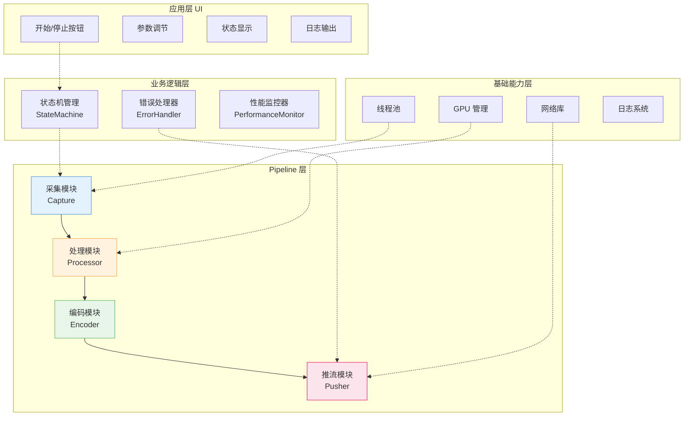
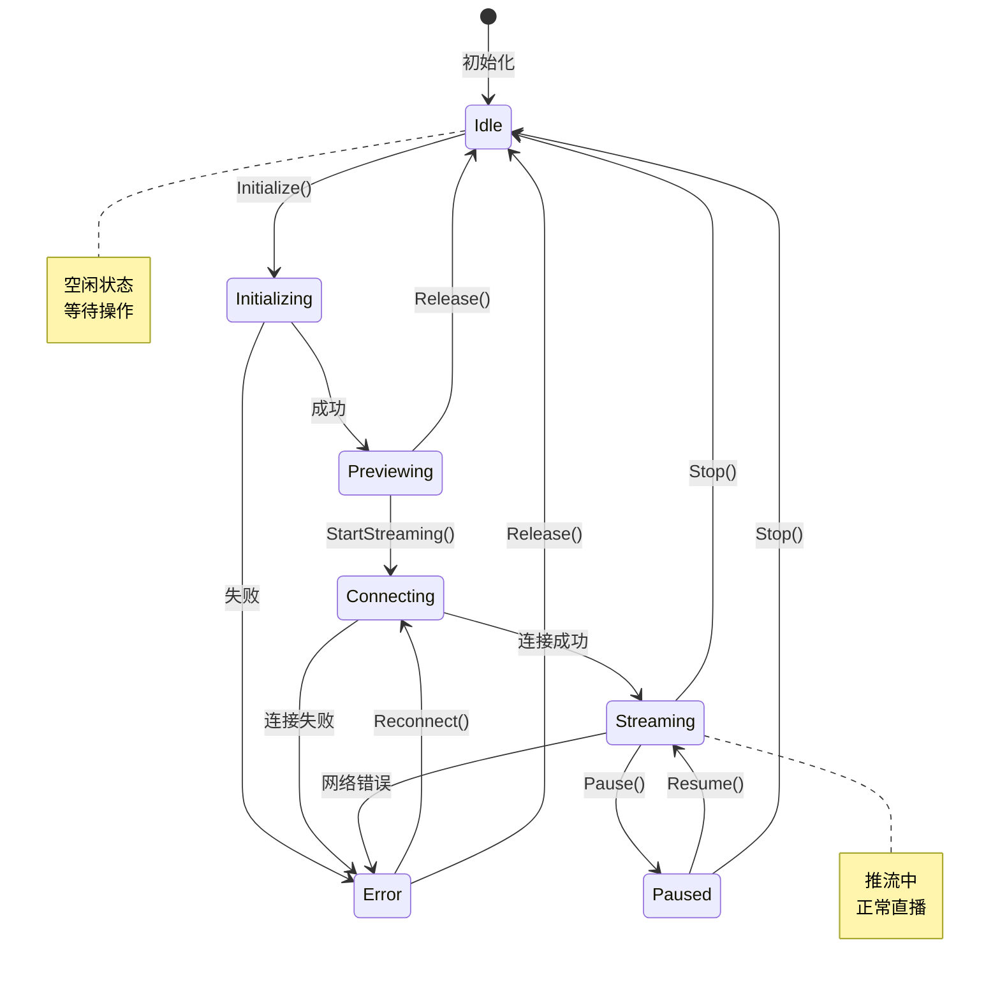
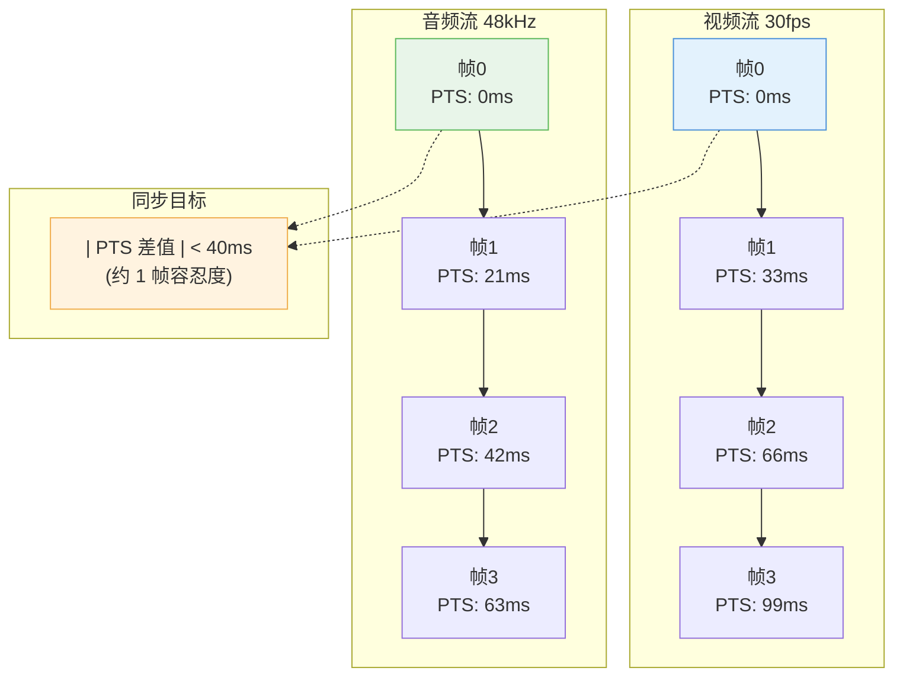

# 第16章：主播端架构

| 项目 | 内容 |
|:---|:---|
| **本章目标** | 掌握主播端架构的核心概念和实践 |
| **难度** | ⭐⭐⭐⭐ 高 |
| **前置知识** | Ch10-15：采集、美颜、编码 |
| **预计时间** | 4-5 小时 |

> **本章引言**

> **本章目标**：整合采集、处理、编码、推流，实现完整的主播端 Pipeline。

在前面的章节中，我们已经完成了主播端的所有核心组件：
- **Ch10-Ch14**：音视频采集（摄像头、麦克风、屏幕、多摄像头）
- **Ch15**：美颜滤镜（双边滤波磨皮、LUT 调色）
- **Ch12-Ch13**：编码与推流（H.264/H.265、RTMP）

本章将这些组件**整合为一个完整的 Pipeline**，实现可开播的主播端系统。这不仅是技术的整合，更是架构设计思想的实践：模块解耦、状态管理、错误恢复、性能优化。

**学习本章后，你将能够**：
- 设计可扩展的直播 Pipeline 架构
- 实现状态机管理主播端生命周期
- 处理网络波动、编码失败等异常情况
- 优化端到端延迟和系统资源占用

---

## 目录

1. [主播端架构全景](#1-主播端架构全景)
2. [模块划分与接口设计](#2-模块划分与接口设计)
3. [Pipeline 数据流设计](#3-pipeline-数据流设计)
4. [状态机设计](#4-状态机设计)
5. [错误处理与恢复策略](#5-错误处理与恢复策略)
6. [音视频同步机制](#6-音视频同步机制)
7. [性能优化实战](#7-性能优化实战)
8. [本章总结](#8-本章总结)

---

## 1. 主播端架构全景

### 1.1 系统整体架构



**架构分层**：

```
┌─────────────────────────────────────────────────────────────┐
│                      应用层（UI 控制）                        │
│         开始/停止按钮 · 参数调节 · 状态显示 · 日志输出          │
├─────────────────────────────────────────────────────────────┤
│                      业务逻辑层                               │
│  ┌─────────────┐  ┌─────────────┐  ┌─────────────────────┐  │
│  │  状态机管理  │  │  错误处理器  │  │  性能监控器         │  │
│  │ StateMachine│  │ErrorHandler │  │PerformanceMonitor   │  │
│  └─────────────┘  └─────────────┘  └─────────────────────┘  │
├─────────────────────────────────────────────────────────────┤
│                      Pipeline 层                             │
│  ┌──────────┐    ┌──────────┐    ┌──────────┐    ┌────────┐ │
│  │  采集模块 │ → │  处理模块 │ → │  编码模块 │ → │ 推流模块│ │
│  │Capture   │    │Processor │    │ Encoder  │    │ Pusher │ │
│  └──────────┘    └──────────┘    └──────────┘    └────────┘ │
├─────────────────────────────────────────────────────────────┤
│                      基础能力层                               │
│  ┌──────────┐  ┌──────────┐  ┌──────────┐  ┌──────────────┐ │
│  │ 线程池   │  │ GPU 管理  │  │ 网络库   │  │ 日志系统     │ │
│  │ThreadPool│  │ GpuContext│  │ Network  │  │ Logger       │ │
│  └──────────┘  └──────────┘  └──────────┘  └──────────────┘ │
└─────────────────────────────────────────────────────────────┘
```

### 1.2 数据流详解

**视频数据流**：
```
摄像头/屏幕采集 → 原始帧(YUV/RGB)
                       ↓
              ┌─────────────────┐
              │   美颜处理        │  GPU 磨皮、美白、LUT 调色
              │ (BeautyProcessor)│
              └─────────────────┘
                       ↓
              ┌─────────────────┐
              │   视频编码        │  H.264/H.265 硬件编码
              │ (VideoEncoder)  │
              └─────────────────┘
                       ↓
              ┌─────────────────┐
              │   封装推流        │  FLV 封装 + RTMP 推送
              │ (RtmpPusher)    │
              └─────────────────┘
```

**音频数据流**：
```
麦克风采集 → 原始 PCM 音频帧
                  ↓
         ┌─────────────────┐
         │   3A 处理         │  AEC/ANS/AGC
         │ (AudioProcessor) │
         └─────────────────┘
                  ↓
         ┌─────────────────┐
         │   音频编码        │  AAC 编码
         │ (AudioEncoder)  │
         └─────────────────┘
                  ↓
         ┌─────────────────┐
         │   封装推流        │  与视频混合封装
         │ (RtmpPusher)    │
         └─────────────────┘
```

### 1.3 关键性能指标

| 指标 | 目标值 | 测量方法 |
|:---|:---:|:---|
| **端到端延迟** | < 500ms | 采集时间戳到播放器显示 |
| **CPU 占用** | < 50% | 系统监控 |
| **内存占用** | < 500MB | 进程内存统计 |
| **丢帧率** | < 1% | 编码帧数/采集帧数 |
| **编码延迟** | < 50ms | 帧进入编码器到输出 |

---

## 2. 模块划分与接口设计

### 2.1 设计原则

**单一职责原则（SRP）**：
每个模块只负责一个明确的功能，便于测试和维护。

**依赖倒置原则（DIP）**：
模块间依赖抽象接口，不依赖具体实现，便于替换算法。

**开闭原则（OCP）**：
对扩展开放（可以添加新的滤镜、编码器），对修改封闭。

### 2.2 核心接口定义

**视频采集接口**：
```cpp
// IVideoCapture.h
class IVideoCapture {
public:
    virtual ~IVideoCapture() = default;
    
    // 初始化采集设备
    virtual bool Init(const CaptureConfig& config) = 0;
    
    // 开始/停止采集
    virtual bool Start() = 0;
    virtual void Stop() = 0;
    
    // 设置帧回调
    virtual void SetFrameCallback(FrameCallback callback) = 0;
    
    // 查询设备能力
    virtual std::vector<Resolution> GetSupportedResolutions() = 0;
    virtual std::vector<int> GetSupportedFps() = 0;
};

// 配置结构
struct CaptureConfig {
    std::string device_id;      // 设备标识
    int width = 1920;           // 采集宽度
    int height = 1080;          // 采集高度
    int fps = 30;               // 采集帧率
    PixelFormat format = PixelFormat::YUV420P;
};
```

**视频处理接口（美颜滤镜）**：
```cpp
// IVideoProcessor.h
class IVideoProcessor {
public:
    virtual ~IVideoProcessor() = default;
    
    // 初始化处理管线
    virtual bool Init(int width, int height) = 0;
    
    // 处理一帧
    virtual void Process(const GpuTexture* input, 
                         GpuTexture* output) = 0;
    
    // 动态调节参数
    virtual void SetBeautyStrength(float strength) = 0;
    virtual void SetBrightness(float level) = 0;
    virtual void EnableFilter(const std::string& name, bool enable) = 0;
    
    // 释放资源
    virtual void Release() = 0;
};
```

**编码器接口**：
```cpp
// IEncoder.h
class IEncoder {
public:
    virtual ~IEncoder() = default;
    
    // 初始化编码器
    virtual bool Init(const EncoderConfig& config) = 0;
    
    // 编码一帧
    virtual bool Encode(const Frame* frame) = 0;
    
    // 获取编码后的数据包
    virtual EncodedPacket* GetPacket() = 0;
    
    // 动态调整码率
    virtual void SetBitrate(int bitrate_bps) = 0;
    
    // 请求关键帧
    virtual void RequestKeyframe() = 0;
    
    // 刷新编码器（发送剩余数据）
    virtual void Flush() = 0;
    
    // 释放资源
    virtual void Release() = 0;
};

struct EncoderConfig {
    int width = 1920;
    int height = 1080;
    int fps = 30;
    int bitrate = 4000000;      // 4 Mbps
    std::string codec = "h264"; // h264/h265/av1
    bool use_hardware = true;   // 使用硬件编码
};
```

**推流接口**：
```cpp
// IRtmpPusher.h
class IRtmpPusher {
public:
    virtual ~IRtmpPusher() = default;
    
    // 连接服务器
    virtual bool Connect(const std::string& url) = 0;
    
    // 发送音视频数据
    virtual bool PushVideo(const EncodedPacket* packet) = 0;
    virtual bool PushAudio(const EncodedPacket* packet) = 0;
    
    // 获取连接状态
    virtual ConnectionState GetState() = 0;
    
    // 断开连接
    virtual void Disconnect() = 0;
};

enum class ConnectionState {
    Disconnected,   // 未连接
    Connecting,     // 连接中
    Connected,      // 已连接
    Reconnecting,   // 重连中
    Error           // 错误
};
```

### 2.3 模块配置结构

```cpp
// 完整的主播端配置
struct StreamerConfig {
    // 视频采集配置
    struct VideoCapture {
        std::string source = "camera";  // camera/screen/window
        std::string device_id;          // 设备标识
        int width = 1920;
        int height = 1080;
        int fps = 30;
    } video_capture;
    
    // 音频采集配置
    struct AudioCapture {
        std::string device_id;
        int sample_rate = 48000;
        int channels = 2;
    } audio_capture;
    
    // 美颜处理配置
    struct Beauty {
        bool enabled = true;
        float strength = 0.5f;          // 磨皮强度 0.0-1.0
        float brightness = 1.1f;        // 亮度调节
        std::string lut_file;           // LUT 文件路径
    } beauty;
    
    // 音频 3A 配置
    struct Audio3A {
        bool aec_enabled = true;        // 回声消除
        bool ans_enabled = true;        // 噪声抑制
        bool agc_enabled = true;        // 自动增益
    } audio_3a;
    
    // 视频编码配置
    struct VideoEncode {
        std::string codec = "h264";     // h264/h265/av1
        int bitrate = 4000000;          // 4 Mbps
        int fps = 30;
        bool use_hardware = true;
    } video_encode;
    
    // 音频编码配置
    struct AudioEncode {
        int bitrate = 128000;           // 128 kbps
    } audio_encode;
    
    // 推流配置
    struct Stream {
        std::string rtmp_url;
        int reconnect_attempts = 3;     // 重连次数
        int reconnect_delay_ms = 2000;  // 重连间隔
    } stream;
};
```

---

## 3. Pipeline 数据流设计

### 3.1 线程模型

主播端涉及多个耗时操作，必须使用多线程并行处理：

```
┌─────────────────────────────────────────────────────────────┐
│                     采集线程（高优先级）                       │
│  摄像头采集 ──────→ 帧缓冲队列（无锁）                         │
│  麦克风采集 ──────→ 音频缓冲队列                              │
├─────────────────────────────────────────────────────────────┤
│                     处理线程                                  │
│  美颜处理 ←──────── 帧缓冲队列                                │
│  3A 处理  ←──────── 音频缓冲队列                              │
├─────────────────────────────────────────────────────────────┤
│                     编码线程                                  │
│  视频编码 ←──────── 处理后帧队列                              │
│  音频编码 ←──────── 处理后音频队列                            │
├─────────────────────────────────────────────────────────────┤
│                     推流线程                                  │
│  封装 ←──────── 编码后数据队列                                │
│  网络发送 ←────── 封装后数据                                  │
└─────────────────────────────────────────────────────────────┘
```

**线程间通信**：
- 使用无锁队列（Lock-free Queue）传递数据
- 每个线程独立，避免阻塞
- 队列深度控制（防止内存无限增长）

### 3.2 无锁队列实现

```cpp
// 单生产者单消费者无锁队列
template<typename T, size_t Capacity>
class LockFreeQueue {
public:
    bool Push(const T& item) {
        size_t current_tail = tail_.load(std::memory_order_relaxed);
        size_t next_tail = (current_tail + 1) % Capacity;
        
        if (next_tail == head_.load(std::memory_order_acquire)) {
            return false;  // 队列满
        }
        
        buffer_[current_tail] = item;
        tail_.store(next_tail, std::memory_order_release);
        return true;
    }
    
    bool Pop(T& item) {
        size_t current_head = head_.load(std::memory_order_relaxed);
        
        if (current_head == tail_.load(std::memory_order_acquire)) {
            return false;  // 队列空
        }
        
        item = buffer_[current_head];
        head_.store((current_head + 1) % Capacity, std::memory_order_release);
        return true;
    }
    
private:
    alignas(64) std::array<T, Capacity> buffer_;
    alignas(64) std::atomic<size_t> head_{0};
    alignas(64) std::atomic<size_t> tail_{0};
};
```

### 3.3 Pipeline 完整流程

```cpp
class StreamPipeline {
public:
    bool Initialize(const StreamerConfig& config) {
        // 1. 初始化采集模块
        video_capture_ = CreateVideoCapture(config.video_capture.source);
        video_capture_- > Init(config.video_capture);
        video_capture_- > SetFrameCallback(
            [this](VideoFrame* frame) { OnVideoFrame(frame); });
        
        // 2. 初始化处理模块
        video_processor_ = CreateBeautyProcessor();
        video_processor_- > Init(config.video_capture.width, 
                                   config.video_capture.height);
        
        // 3. 初始化编码模块
        video_encoder_ = CreateVideoEncoder(config.video_encode.codec);
        video_encoder_- > Init(config.video_encode);
        
        audio_encoder_ = CreateAudioEncoder();
        audio_encoder_- > Init(config.audio_encode);
        
        // 4. 初始化推流模块
        pusher_ = CreateRtmpPusher();
        
        return true;
    }
    
    bool Start() {
        // 连接 RTMP 服务器
        if (!pusher_- > Connect(config_.stream.rtmp_url)) {
            return false;
        }
        
        // 启动采集
        video_capture_- > Start();
        audio_capture_- > Start();
        
        // 启动处理线程
        process_thread_ = std::thread(&StreamPipeline::ProcessLoop, this);
        
        // 启动编码线程
        encode_thread_ = std::thread(&StreamPipeline::EncodeLoop, this);
        
        // 启动推流线程
        push_thread_ = std::thread(&StreamPipeline::PushLoop, this);
        
        return true;
    }
    
private:
    // 采集回调（采集线程）
    void OnVideoFrame(VideoFrame* frame) {
        // 打上采集时间戳
        frame->pts = GetTimestampMs();
        raw_video_queue_.Push(frame);
    }
    
    // 处理循环（处理线程）
    void ProcessLoop() {
        while (running_) {
            VideoFrame* frame;
            if (raw_video_queue_.Pop(frame)) {
                // GPU 美颜处理
                GpuTexture* processed = texture_pool_.Acquire();
                video_processor_- > Process(frame->texture, processed);
                processed->pts = frame->pts;
                
                processed_video_queue_.Push(processed);
                texture_pool_.Release(frame->texture);
            }
        }
    }
    
    // 编码循环（编码线程）
    void EncodeLoop() {
        while (running_) {
            GpuTexture* texture;
            if (processed_video_queue_.Pop(texture)) {
                // 视频编码
                video_encoder_- > Encode(texture);
                
                EncodedPacket* packet;
                while ((packet = video_encoder_- > GetPacket()) != nullptr) {
                    encoded_video_queue_.Push(packet);
                }
                
                texture_pool_.Release(texture);
            }
        }
    }
    
    // 推流循环（推流线程）
    void PushLoop() {
        while (running_) {
            EncodedPacket* packet;
            if (encoded_video_queue_.Pop(packet)) {
                // 封装并推流
                if (packet->is_video) {
                    pusher_- > PushVideo(packet);
                } else {
                    pusher_- > PushAudio(packet);
                }
                packet_pool_.Release(packet);
            }
        }
    }
    
    // 模块
    std::unique_ptr<IVideoCapture> video_capture_;
    std::unique_ptr<IVideoProcessor> video_processor_;
    std::unique_ptr<IEncoder> video_encoder_;
    std::unique_ptr<IEncoder> audio_encoder_;
    std::unique_ptr<IRtmpPusher> pusher_;
    
    // 队列
    LockFreeQueue<VideoFrame*, 30> raw_video_queue_;
    LockFreeQueue<GpuTexture*, 30> processed_video_queue_;
    LockFreeQueue<EncodedPacket*, 60> encoded_video_queue_;
    
    // 线程
    std::thread process_thread_;
    std::thread encode_thread_;
    std::thread push_thread_;
    
    std::atomic<bool> running_{false};
};
```

---

## 4. 状态机设计

### 4.1 为什么需要状态机

主播端的生命周期复杂：
- 初始化 → 预览 → 连接 → 推流 → 停止
- 过程中可能遇到网络断开、编码失败等异常
- 每个状态下允许的操作不同（如连接中不能调整分辨率）

没有状态机，很容易出现：
- 未初始化就调用 Start
- 连接中调用 Stop 导致资源泄漏
- 错误状态下继续推流

### 4.2 状态机图



**状态定义**：
```cpp
enum class StreamerState {
    Idle,           // 空闲：未初始化或已释放
    Initializing,   // 初始化中
    Previewing,     // 预览中：采集已启动，但未推流
    Connecting,     // 连接中：正在连接 RTMP 服务器
    Streaming,      // 推流中：正常直播
    Paused,         // 暂停：采集继续，但不推流
    Error           // 错误：发生不可恢复的错误
};
```

**状态转换表**：

| 当前状态 | 可转换到 | 触发条件 |
|:---|:---|:---|
| Idle | Initializing | 调用 Initialize() |
| Initializing | Previewing | 初始化成功 |
| Initializing | Error | 初始化失败 |
| Previewing | Connecting | 调用 StartStreaming() |
| Previewing | Idle | 调用 Release() |
| Connecting | Streaming | 连接成功 |
| Connecting | Error | 连接失败 |
| Streaming | Paused | 调用 Pause() |
| Streaming | Idle | 调用 Stop() |
| Streaming | Error | 推流错误 |
| Paused | Streaming | 调用 Resume() |
| Paused | Idle | 调用 Stop() |
| Error | Connecting | 调用 Reconnect() |
| Error | Idle | 调用 Release() |

### 4.3 状态机实现

```cpp
class StreamerStateMachine {
public:
    using StateCallback = std::function<void(StreamerState, StreamerState)>;
    
    void SetStateCallback(StateCallback callback) {
        callback_ = callback;
    }
    
    // 尝试状态转换
    bool Transition(StreamerState new_state) {
        std::lock_guard<std::mutex> lock(mutex_);
        
        if (!IsValidTransition(state_, new_state)) {
            LogError("Invalid state transition: {} -> {}", 
                     StateToString(state_), StateToString(new_state));
            return false;
        }
        
        StreamerState old_state = state_;
        state_ = new_state;
        
        LogInfo("State: {} -> {}", StateToString(old_state), 
                StateToString(new_state));
        
        if (callback_) {
            callback_(old_state, new_state);
        }
        
        return true;
    }
    
    StreamerState GetState() const {
        std::lock_guard<std::mutex> lock(mutex_);
        return state_;
    }
    
    // 检查是否允许某操作
    bool CanStartStreaming() const {
        return GetState() == StreamerState::Previewing;
    }
    
    bool CanPause() const {
        return GetState() == StreamerState::Streaming;
    }
    
    bool CanAdjustResolution() const {
        auto state = GetState();
        return state == StreamerState::Idle || 
               state == StreamerState::Previewing;
    }
    
private:
    bool IsValidTransition(StreamerState from, StreamerState to) {
        switch (from) {
            case StreamerState::Idle:
                return to == StreamerState::Initializing;
                
            case StreamerState::Initializing:
                return to == StreamerState::Previewing || 
                       to == StreamerState::Error;
                       
            case StreamerState::Previewing:
                return to == StreamerState::Connecting || 
                       to == StreamerState::Idle;
                       
            case StreamerState::Connecting:
                return to == StreamerState::Streaming || 
                       to == StreamerState::Error || 
                       to == StreamerState::Idle;
                       
            case StreamerState::Streaming:
                return to == StreamerState::Paused || 
                       to == StreamerState::Idle || 
                       to == StreamerState::Error;
                       
            case StreamerState::Paused:
                return to == StreamerState::Streaming || 
                       to == StreamerState::Idle;
                       
            case StreamerState::Error:
                return to == StreamerState::Connecting || 
                       to == StreamerState::Idle;
        }
        return false;
    }
    
    StreamerState state_ = StreamerState::Idle;
    mutable std::mutex mutex_;
    StateCallback callback_;
};
```

### 4.4 状态机与 UI 联动

```cpp
class StreamerUI {
public:
    void OnStateChanged(StreamerState old_state, StreamerState new_state) {
        switch (new_state) {
            case StreamerState::Idle:
                start_preview_btn_.SetEnabled(true);
                start_stream_btn_.SetEnabled(false);
                stop_btn_.SetEnabled(false);
                status_label_.SetText("就绪");
                break;
                
            case StreamerState::Previewing:
                start_preview_btn_.SetEnabled(false);
                start_stream_btn_.SetEnabled(true);
                stop_btn_.SetEnabled(true);
                status_label_.SetText("预览中");
                break;
                
            case StreamerState::Streaming:
                start_stream_btn_.SetEnabled(false);
                stop_btn_.SetEnabled(true);
                status_label_.SetText("● 直播中");
                break;
                
            case StreamerState::Error:
                ShowErrorDialog("推流错误，请检查网络");
                status_label_.SetText("错误");
                break;
        }
    }
};
```

---

## 5. 错误处理与恢复策略

### 5.1 错误分类

| 错误类型 | 示例 | 严重程度 | 处理策略 |
|:---|:---|:---:|:---|
| **网络错误** | 连接超时、发送失败 | 中 | 重连 |
| **编码错误** | 编码器初始化失败、丢帧 | 中 | 降级/重试 |
| **采集错误** | 摄像头断开、权限被拒绝 | 高 | 停止/提示用户 |
| **配置错误** | 分辨率不支持、码率过高 | 低 | 自动调整 |
| **系统错误** | 内存不足、GPU 故障 | 高 | 停止 |

### 5.2 错误处理架构

```cpp
enum class ErrorSeverity {
    Warning,    // 警告，继续运行
    Recoverable,// 可恢复，尝试恢复
    Fatal       // 致命，停止运行
};

struct StreamError {
    ErrorType type;
    ErrorSeverity severity;
    std::string message;
    std::chrono::time_point<std::chrono::steady_clock> timestamp;
};

class ErrorHandler {
public:
    void SetStreamer(StreamerStateMachine* state_machine) {
        state_machine_ = state_machine;
    }
    
    void HandleError(const StreamError& error) {
        LogError("[{}] {}: {}", 
                 SeverityToString(error.severity),
                 ErrorTypeToString(error.type),
                 error.message);
        
        switch (error.severity) {
            case ErrorSeverity::Warning:
                HandleWarning(error);
                break;
            case ErrorSeverity::Recoverable:
                HandleRecoverable(error);
                break;
            case ErrorSeverity::Fatal:
                HandleFatal(error);
                break;
        }
    }
    
private:
    void HandleWarning(const StreamError& error) {
        // 记录日志，继续运行
        NotifyUI(error.message);
    }
    
    void HandleRecoverable(const StreamError& error) {
        switch (error.type) {
            case ErrorType::Network:
                HandleNetworkError();
                break;
            case ErrorType::Encoder:
                HandleEncoderError();
                break;
            default:
                // 其他可恢复错误，尝试重试
                ScheduleRetry(error);
                break;
        }
    }
    
    void HandleFatal(const StreamError& error) {
        // 停止推流，切换到错误状态
        state_machine_- > Transition(StreamerState::Error);
        NotifyUser(error.message);
    }
    
    void HandleNetworkError() {
        if (retry_count_ < max_retries_) {
            retry_count_++;
            // 指数退避：1s, 2s, 4s
            int delay_ms = (1 << retry_count_) * 1000;
            
            LogInfo("Network error, retrying in {}ms (attempt {}/{})",
                    delay_ms, retry_count_, max_retries_);
            
            ScheduleReconnect(delay_ms);
        } else {
            // 重试次数耗尽
            HandleFatal({ErrorType::Network, ErrorSeverity::Fatal,
                        "网络重试次数耗尽"});
        }
    }
    
    void HandleEncoderError() {
        // 尝试降级策略
        if (TryLowerResolution()) {
            LogInfo("Encoder error resolved by lowering resolution");
            return;
        }
        
        if (TrySoftwareEncoder()) {
            LogInfo("Encoder error resolved by switching to software");
            return;
        }
        
        // 降级失败，报告致命错误
        HandleFatal({ErrorType::Encoder, ErrorSeverity::Fatal,
                    "编码器初始化失败，降额无效"});
    }
    
    bool TryLowerResolution() {
        auto config = current_config_;
        if (config.video.width > 1280) {
            config.video.width = 1280;
            config.video.height = 720;
            return ReinitEncoder(config);
        }
        return false;
    }
    
    bool TrySoftwareEncoder() {
        auto config = current_config_;
        if (config.video.use_hardware) {
            config.video.use_hardware = false;
            config.video.codec = "h264";  // 软件编码用 h264
            return ReinitEncoder(config);
        }
        return false;
    }
    
    StreamerStateMachine* state_machine_;
    int retry_count_ = 0;
    const int max_retries_ = 3;
};
```

### 5.3 网络重连策略

```cpp
class NetworkRecoveryManager {
public:
    void OnNetworkError() {
        if (!state_machine_- > Transition(StreamerState::Reconnecting)) {
            return;
        }
        
        // 保存当前状态
        SaveStreamingState();
        
        // 指数退避重连
        for (int attempt = 1; attempt <= max_retries_; attempt++) {
            int delay = CalculateBackoff(attempt);
            LogInfo("Reconnect attempt {}/{} in {}s", 
                    attempt, max_retries_, delay);
            
            std::this_thread::sleep_for(std::chrono::seconds(delay));
            
            if (TryReconnect()) {
                LogInfo("Reconnection successful");
                RestoreStreamingState();
                state_machine_- > Transition(StreamerState::Streaming);
                return;
            }
        }
        
        // 重连失败
        LogError("All reconnection attempts failed");
        state_machine_- > Transition(StreamerState::Error);
    }
    
private:
    int CalculateBackoff(int attempt) {
        // 指数退避：1, 2, 4 秒
        int base = std::min(1 << (attempt - 1), 4);
        // 添加随机抖动，避免雪崩
        int jitter = rand() % 1000;
        return base + jitter / 1000;
    }
    
    bool TryReconnect() {
        pusher_- > Disconnect();
        return pusher_- > Connect(config_.stream.rtmp_url);
    }
    
    void SaveStreamingState() {
        saved_video_pts_ = last_video_pts_;
        saved_audio_pts_ = last_audio_pts_;
    }
    
    void RestoreStreamingState() {
        // 恢复时间戳（重要：防止断流后时间戳回退）
        video_encoder_- > SetInitialPTS(saved_video_pts_);
        audio_encoder_- > SetInitialPTS(saved_audio_pts_);
        
        // 请求关键帧（确保恢复后画面可解码）
        video_encoder_- > RequestKeyframe();
    }
    
    int max_retries_ = 3;
    int64_t saved_video_pts_ = 0;
    int64_t saved_audio_pts_ = 0;
};
```

### 5.4 自适应码率（ABR）

```cpp
class AdaptiveBitrateController {
public:
    void OnNetworkReport(const NetworkStats& stats) {
        // 计算丢包率和 RTT
        float loss_rate = stats.lost_packets / 
                         (float)(stats.sent_packets + stats.lost_packets);
        
        // 状态机判断
        NetworkCondition condition = EvaluateCondition(loss_rate, stats.rtt_ms);
        
        switch (condition) {
            case NetworkCondition::Good:
                if (current_bitrate_ < target_bitrate_) {
                    IncreaseBitrate();
                }
                break;
                
            case NetworkCondition::Fair:
                // 维持现状
                break;
                
            case NetworkCondition::Poor:
                DecreaseBitrate();
                break;
                
            case NetworkCondition::Bad:
                // 严重拥塞，大幅降码率
                current_bitrate_ = min_bitrate_;
                ApplyBitrateChange();
                break;
        }
    }
    
private:
    NetworkCondition EvaluateCondition(float loss_rate, int rtt_ms) {
        if (loss_rate > 0.05f || rtt_ms > 500) {
            return NetworkCondition::Bad;
        } else if (loss_rate > 0.02f || rtt_ms > 200) {
            return NetworkCondition::Poor;
        } else if (loss_rate > 0.01f || rtt_ms > 100) {
            return NetworkCondition::Fair;
        }
        return NetworkCondition::Good;
    }
    
    void IncreaseBitrate() {
        // 每次增加 10%，不超过目标码率
        current_bitrate_ = std::min(
            (int)(current_bitrate_ * 1.1), target_bitrate_);
        ApplyBitrateChange();
    }
    
    void DecreaseBitrate() {
        // 每次减少 20%，不低于最小码率
        current_bitrate_ = std::max(
            (int)(current_bitrate_ * 0.8), min_bitrate_);
        ApplyBitrateChange();
    }
    
    void ApplyBitrateChange() {
        LogInfo("Adjusting bitrate to {} kbps", current_bitrate_ / 1000);
        video_encoder_- > SetBitrate(current_bitrate_);
    }
    
    int target_bitrate_ = 4000000;  // 4 Mbps
    int min_bitrate_ = 500000;       // 500 kbps
    int current_bitrate_ = 4000000;
};
```

---

## 6. 音视频同步机制

### 6.1 为什么需要同步

音视频是**独立采集、独立编码**的：
- **视频**：30fps，每帧 33ms，由采集卡/摄像头驱动产生时间戳
- **音频**：每 20ms 一帧（AAC 1024 采样 @ 48kHz），由声卡产生时间戳

如果没有同步机制，播放端会出现：
- 音画不同步（音频超前或滞后）
- 长期累积误差导致偏差越来越大

### 6.2 时间戳与同步原理



**关键概念**：
- **PTS（Presentation Time Stamp）**：显示时间戳，表示该帧应该在何时播放
- **DTS（Decoding Time Stamp）**：解码时间戳，表示该帧应该在何时解码（B 帧时需要）
- **Time Base**：时间基准，如视频 1/30 秒，音频 1/48000 秒

**时间戳生成**：
```cpp
// 视频时间戳（基于帧索引）
int64_t video_pts = frame_index * (1000 / fps);  // 毫秒

// 音频时间戳（基于采样数）
int64_t audio_pts = sample_index * 1000 / sample_rate;  // 毫秒
```

### 6.3 同步策略选择

| 策略 | 说明 | 适用场景 |
|:---|:---|:---|
| **音频为主** | 视频同步到音频 | 音乐直播、对音质要求高 |
| **视频为主** | 音频同步到视频 | 游戏直播、对画面要求高 |
| **外部时钟** | 都同步到系统时钟 | 专业直播、精确同步 |

**直播场景推荐**：以音频为主（音频时钟更稳定）。

### 6.4 同步实现

```cpp
class AVSync {
public:
    // 设置同步参考（通常选音频）
    void SetMasterStream(StreamType type) {
        master_stream_ = type;
    }
    
    // 视频帧同步检查
    SyncAction SyncVideo(int64_t video_pts, int64_t audio_pts) {
        int64_t diff = video_pts - audio_pts;
        
        // 允许 ±40ms 误差（约 1 帧 @ 25fps）
        if (std::abs(diff) < 40) {
            return SyncAction::Normal;  // 同步正常
        }
        
        if (diff > 40) {
            // 视频超前，需要等待或丢弃
            if (diff > 100) {
                return SyncAction::DropFrame;  // 丢帧追赶
            }
            return SyncAction::Wait;  // 等待音频追上
        } else {
            // 视频滞后，需要重复帧
            if (diff < -100) {
                return SyncAction::RequestKeyframe;  // 请求关键帧追赶
            }
            return SyncAction::RepeatFrame;  // 重复上一帧
        }
    }
    
    // 获取同步后的目标 PTS
    int64_t GetSyncedPTS(int64_t original_pts, StreamType type) {
        if (type == master_stream_) {
            return original_pts;  // 主时钟不变
        }
        
        // 从时钟根据主时钟调整
        if (type == StreamType::Video) {
            return AlignToAudioPTS(original_pts);
        } else {
            return AlignToVideoPTS(original_pts);
        }
    }
    
private:
    // 将视频 PTS 对齐到音频帧边界
    int64_t AlignToAudioPTS(int64_t video_pts) {
        // 音频帧周期：21ms（@ 48kHz, 1024 samples）
        const int64_t audio_frame_duration = 21;
        return (video_pts / audio_frame_duration) * audio_frame_duration;
    }
    
    StreamType master_stream_ = StreamType::Audio;
};
```

### 6.5 推流端同步实践

在推流端，同步的关键是**确保音视频时间戳对齐**：

```cpp
void PushLoop() {
    while (running_) {
        // 获取音视频数据包
        EncodedPacket* video_pkt = nullptr;
        EncodedPacket* audio_pkt = nullptr;
        
        video_queue_.Peek(video_pkt);
        audio_queue_.Peek(audio_pkt);
        
        if (!video_pkt || !audio_pkt) {
            // 某一队列为空，等待
            continue;
        }
        
        // 检查同步
        int64_t diff = video_pkt->pts - audio_pkt->pts;
        
        if (diff > 50) {
            // 视频超前，先发送音频
            pusher_- > PushAudio(audio_queue_.Pop());
        } else if (diff < -50) {
            // 音频超前，先发送视频
            pusher_- > PushVideo(video_queue_.Pop());
        } else {
            // 同步，按 PTS 顺序发送
            if (video_pkt->pts <= audio_pkt->pts) {
                pusher_- > PushVideo(video_queue_.Pop());
            } else {
                pusher_- > PushAudio(audio_queue_.Pop());
            }
        }
    }
}
```

---

## 7. 性能优化实战

### 7.1 延迟优化

**直播延迟来源分析**：

| 环节 | 延迟 | 优化方法 |
|:---|:---:|:---|
| 采集 | 10-30ms | 选择低延迟设备 |
| 处理（美颜）| 2-5ms | GPU 加速，降采样 |
| 编码 | 30-50ms | 硬件编码，低延迟模式 |
| 网络发送 | 20-100ms | 优化网络，选择就近节点 |
| 播放器缓冲 | 100-300ms | 减小缓冲区（可能增加卡顿）|
| **总计** | **200-500ms** | - |

**低延迟编码配置**：
```cpp
// x264 低延迟配置
x264_param_t param;
x264_param_default_preset(&param, "ultrafast", "zerolatency");
param.i_bframe = 0;        // 禁用 B 帧（减少延迟）
param.rc.i_lookahead = 0;  // 禁用前瞻（减少延迟）
param.i_sync_lookahead = 0;

// NVENC 低延迟配置
NV_ENC_CONFIG config;
config.rcParams.lowDelayKeyFrame = 1;
config.frameIntervalP = 1;  // 禁用 B 帧
```

### 7.2 CPU 优化

**热点分析**：
使用性能分析工具（如 perf、Instruments）找出 CPU 热点：

```bash
# Linux perf 分析
perf record -g ./streamer
perf report
```

**常见优化**：

| 热点 | 优化方法 | 效果 |
|:---|:---|:---:|
| 颜色空间转换 | 使用 GPU/NEON/SSE | 提升 5-10 倍 |
| 图像缩放 | 使用 GPU/硬件缩放 | 提升 3-5 倍 |
| 内存拷贝 | 使用零拷贝/GPU 纹理 | 消除拷贝开销 |
| 美颜算法 | 降采样处理 | 速度提升 4 倍 |

### 7.3 内存优化

**对象池模式**：
频繁创建销毁的对象使用对象池：

```cpp
template<typename T>
class ObjectPool {
public:
    ObjectPool(size_t initial_size) {
        for (size_t i = 0; i < initial_size; i++) {
            available_.push(std::make_unique<T>());
        }
    }
    
    std::unique_ptr<T, Deleter> Acquire() {
        std::lock_guard<std::mutex> lock(mutex_);
        
        if (available_.empty()) {
            return std::unique_ptr<T, Deleter>(
                new T(), Deleter{this});
        }
        
        auto obj = std::move(available_.front());
        available_.pop();
        
        return std::unique_ptr<T, Deleter>(obj.release(), Deleter{this});
    }
    
    void Release(T* obj) {
        std::lock_guard<std::mutex> lock(mutex_);
        available_.push(std::unique_ptr<T>(obj));
    }
    
private:
    struct Deleter {
        ObjectPool* pool;
        void operator()(T* obj) { pool->Release(obj); }
    };
    
    std::queue<std::unique_ptr<T>> available_;
    std::mutex mutex_;
};

// 使用示例
ObjectPool<VideoFrame> frame_pool(30);

void ProcessFrame() {
    auto frame = frame_pool.Acquire();
    // 使用 frame
    // 离开作用域自动归还到池
}
```

### 7.4 性能监控

```cpp
class PerformanceMonitor {
public:
    struct StageStats {
        std::string name;
        int64_t avg_ms = 0;
        int64_t max_ms = 0;
        int64_t min_ms = INT64_MAX;
        int count = 0;
    };
    
    class StageTimer {
    public:
        StageTimer(PerformanceMonitor* monitor, const std::string& name)
            : monitor_(monitor), name_(name), 
              start_(std::chrono::steady_clock::now()) {}
        
        ~StageTimer() {
            auto end = std::chrono::steady_clock::now();
            auto duration = std::chrono::duration_cast<std::chrono::milliseconds>(
                end - start_).count();
            monitor_- > Record(name_, duration);
        }
        
    private:
        PerformanceMonitor* monitor_;
        std::string name_;
        std::chrono::time_point<std::chrono::steady_clock> start_;
    };
    
    void Record(const std::string& stage, int64_t duration_ms) {
        std::lock_guard<std::mutex> lock(mutex_);
        auto& stats = stages_[stage];
        stats.name = stage;
        stats.count++;
        stats.avg_ms = (stats.avg_ms * (stats.count - 1) + duration_ms) / stats.count;
        stats.max_ms = std::max(stats.max_ms, duration_ms);
        stats.min_ms = std::min(stats.min_ms, duration_ms);
    }
    
    void PrintReport() {
        std::lock_guard<std::mutex> lock(mutex_);
        printf("\n=== Performance Report ===\n");
        for (const auto& [name, stats] : stages_) {
            printf("%s: avg=%ldms, max=%ldms, min=%ldms (n=%d)\n",
                   stats.name.c_str(), stats.avg_ms, stats.max_ms, 
                   stats.min_ms, stats.count);
        }
    }
    
private:
    std::map<std::string, StageStats> stages_;
    std::mutex mutex_;
};

// 使用示例
void ProcessFrame() {
    PerformanceMonitor::StageTimer timer(&monitor, "beauty_process");
    
    beauty_processor_.Process(input, output);
}
```

---

## 8. 本章总结

### 8.1 架构设计要点

| 原则 | 实现方式 |
|:---|:---|
| **模块化** | 每个组件职责单一，通过接口交互 |
| **状态机** | 管理生命周期，防止非法状态转换 |
| **容错性** | 网络错误自动重连，编码失败自动降级 |
| **可扩展** | 滤镜链、编码器可插拔设计 |
| **高性能** | 多线程并行，零拷贝，对象池 |

### 8.2 完整主播端功能清单

| 模块 | 功能 | 状态 |
|:---|:---|:---:|
| 视频采集 | 摄像头、屏幕、窗口 | ✅ |
| 多摄像头 | 设备管理、画中画、切换 | ✅ |
| 美颜处理 | 双边滤波磨皮、LUT 调色 | ✅ |
| 音频采集 | 麦克风、系统声音 | ✅ |
| 3A 处理 | AEC、ANS、AGC | ✅ |
| 视频编码 | H.264/H.265/AV1 | ✅ |
| 音频编码 | AAC | ✅ |
| 封装推流 | FLV + RTMP | ✅ |
| 状态管理 | 状态机、UI 联动 | ✅ |
| 错误恢复 | 重连、降级、超时 | ✅ |
| 音视频同步 | PTS 对齐 | ✅ |
| 性能优化 | 多线程、零拷贝、对象池 | ✅ |

### 8.3 关键技术决策回顾

**编码器选择**：
- 通用直播 → H.264（兼容性）
- 4K + 新显卡 → AV1（效率）
- 游戏直播 → NVENC H.264（低 CPU）

**美颜算法选择**：
- 磨皮 → 双边滤波（效果自然）
- 调色 → 3D LUT（风格化）
- 优化 → 降采样处理（速度快）

**错误处理策略**：
- 网络错误 → 指数退避重连
- 编码错误 → 自动降级（分辨率/软件编码）
- 致命错误 → 停止并通知用户

### 8.4 下一步学习建议

恭喜你完成了主播端的完整学习！如果你想进一步深入：

1. **实时通信**：学习 WebRTC，了解现代直播技术栈
2. **服务端开发**：学习 CDN、转码、录制、弹幕系统
3. **移动端**：学习 iOS/Android 原生采集和编码
4. **AI 增强**：学习虚拟背景、人脸特效、语音变声

---

**延伸阅读**：
- FFmpeg 文档：https://ffmpeg.org/documentation.html
- RTMP 规范：Adobe RTMP Specification
- WebRTC 标准：W3C WebRTC API
- 直播协议对比：RTMP vs SRT vs WebRTC
---

## FAQ 常见问题

### Q1：本章的核心难点是什么？

**A**：主播端架构涉及的核心难点包括：
- 理解新概念的内在原理
- 将理论知识转化为实际代码
- 处理边界情况和错误恢复

建议多动手实践，遇到问题及时查阅官方文档。

---

### Q2：学习本章需要哪些前置知识？

**A**：请参考章节头部的前置知识表格。如果某些基础不牢固，建议先复习相关章节。

---

### Q3：如何验证本章的学习效果？

**A**：建议完成以下检查：
- [ ] 理解所有核心概念
- [ ] 能独立编写本章的示例代码
- [ ] 能解释代码的工作原理
- [ ] 能排查常见问题

---

### Q4：本章代码在实际项目中的应用场景？

**A**：本章代码是渐进式案例「小直播」的组成部分，所有代码都可以在实际项目中使用。具体应用场景请参考「本章与项目的关系」部分。

---

### Q5：遇到问题时如何调试？

**A**：调试建议：
1. 先阅读 FAQ 和本章的「常见问题」部分
2. 检查前置知识是否掌握
3. 使用日志和调试工具定位问题
4. 参考示例代码进行对比
5. 在 GitHub Issues 中搜索类似问题
---

## 本章小结

### 核心知识点

通过本章学习，你应该掌握：
1. 主播端架构的核心概念和原理
2. 相关的 API 和工具使用
3. 实际项目中的应用方法
4. 常见问题的解决方案

### 关键技能

| 技能 | 掌握程度 | 实践建议 |
|:---|:---:|:---|
| 理解核心概念 | ⭐⭐⭐ 必须掌握 | 能向他人解释原理 |
| 编写示例代码 | ⭐⭐⭐ 必须掌握 | 独立编写本章代码 |
| 排查常见问题 | ⭐⭐⭐ 必须掌握 | 遇到问题时能自行解决 |
| 应用到项目 | ⭐⭐ 建议掌握 | 将本章代码集成到项目中 |

### 本章产出

- 完成本章所有示例代码
- 理解 主播端架构的工作原理
- 为后续章节打下基础