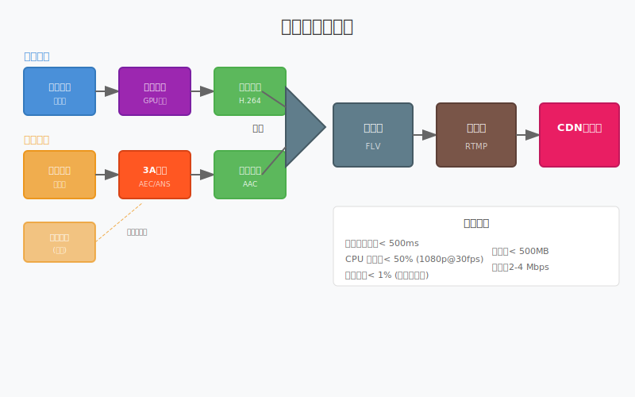
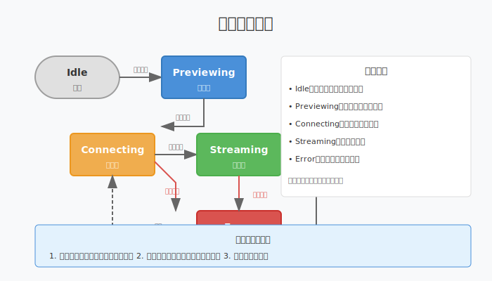
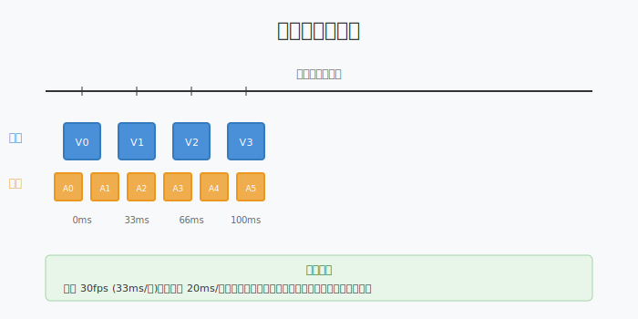

# 第十六章：主播端架构

> **本章目标**：整合采集、处理、编码、推流，实现完整的主播端 Pipeline。

前八章（Ch9-Ch15）完成了主播端的所有核心组件：
- Ch9：硬件解码优化（播放端）
- Ch10：音视频采集
- Ch11：音频 3A 处理
- Ch12：编码与推流
- Ch13：视频编码进阶
- Ch14：高级采集技术
- Ch15：美颜与滤镜

本章将这些组件**整合为一个完整的 Pipeline**，实现可开播的主播端。

**阅读指南**：
- 第 1-2 节：架构设计、模块划分
- 第 3-4 节：状态机、错误处理
- 第 5-6 节：音视频同步、性能优化
- 第 7 节：本章总结

---

## 目录

1. [主播端架构概览](#1-主播端架构概览)
2. [模块划分与接口设计](#2-模块划分与接口设计)
3. [状态机设计](#3-状态机设计)
4. [错误处理与恢复](#4-错误处理与恢复)
5. [音视频同步](#5-音视频同步)
6. [性能优化](#6-性能优化)
7. [本章总结](#7-本章总结)

---

## 1. 主播端架构概览

### 1.1 整体架构图



**数据流**：
```
视频采集 → 美颜滤镜 → 视频编码 ──┐
                                   ├──→ 封装 → 推流 → CDN
音频采集 → 3A处理 → 音频编码 ────┘
```

**各阶段说明**：

| 阶段 | 输入 | 处理 | 输出 | 所在章节 |
|:---|:---|:---|:---|:---:|
| 视频采集 | 摄像头/屏幕 | 帧缓冲读取 | YUV/RGB | Ch10/Ch14 |
| 美颜滤镜 | 原始视频帧 | GPU Shader 处理 | 处理后帧 | Ch15 |
| 视频编码 | 处理后帧 | H.264/H.265 编码 | 压缩数据 | Ch12/Ch13 |
| 音频采集 | 麦克风 | 音频设备读取 | PCM | Ch10 |
| 3A 处理 | 原始音频 | AEC/ANS/AGC | 处理后音频 | Ch11 |
| 音频编码 | 处理后音频 | AAC 编码 | 压缩数据 | Ch12 |
| 封装 | 音视频数据 | FLV 封装 | 流媒体包 | Ch12 |
| 推流 | 封装数据 | RTMP 传输 | 网络流 | Ch12 |

### 1.2 关键指标

| 指标 | 目标值 | 说明 |
|:---|:---|:---|
| 端到端延迟 | < 500ms | 采集到观众播放 |
| CPU 占用 | < 50% | 1080p@30fps |
| 内存占用 | < 500MB | 含缓冲 |
| 丢帧率 | < 1% | 网络正常时 |

---

## 2. 模块划分与接口设计

### 2.1 设计原则

**单一职责**：每个模块只做一件事
**依赖倒置**：模块间依赖接口，不依赖具体实现
**可测试性**：每个模块可独立单元测试

### 2.2 核心接口

```cpp
// 视频采集接口
class IVideoCapture {
public:
    virtual ~IVideoCapture() = default;
    virtual bool Init(const CaptureConfig& config) = 0;
    virtual bool Start() = 0;
    virtual void Stop() = 0;
    virtual void SetCallback(FrameCallback callback) = 0;
};

// 美颜处理接口
class IBeautyProcessor {
public:
    virtual ~IBeautyProcessor() = default;
    virtual bool Init(int width, int height) = 0;
    virtual void Process(GpuTexture* input, GpuTexture* output) = 0;
    virtual void SetParams(const BeautyParams& params) = 0;
};

// 编码器接口
class IEncoder {
public:
    virtual ~IEncoder() = default;
    virtual bool Init(const EncoderConfig& config) = 0;
    virtual bool Encode(Frame* frame) = 0;
    virtual EncodedPacket* GetPacket() = 0;
};

// 推流接口
class IRtmpPusher {
public:
    virtual ~IRtmpPusher() = default;
    virtual bool Connect(const std::string& url) = 0;
    virtual bool PushVideo(EncodedPacket* packet) = 0;
    virtual bool PushAudio(EncodedPacket* packet) = 0;
    virtual void Disconnect() = 0;
};
```

### 2.3 配置结构

```cpp
struct StreamerConfig {
    // 视频配置
    struct Video {
        int width = 1280;
        int height = 720;
        int fps = 30;
        int bitrate = 4000000;  // 4 Mbps
        std::string codec = "h264";
    } video;
    
    // 音频配置
    struct Audio {
        int sample_rate = 48000;
        int channels = 2;
        int bitrate = 128000;  // 128 kbps
    } audio;
    
    // 美颜配置
    struct Beauty {
        bool enabled = true;
        float smooth_strength = 0.5f;
        float brightness = 1.1f;
    } beauty;
    
    // 推流配置
    struct Stream {
        std::string rtmp_url;
        int reconnect_attempts = 3;
    } stream;
};
```

---

## 3. 状态机设计

### 3.1 为什么需要状态机

主播端是一个**生命周期复杂**的系统：
- 初始化 → 预览 → 连接 → 推流 → 停止 → 错误恢复
- 每个阶段允许的操作不同（如连接中不能调整分辨率）
- 需要处理各种异常（网络断开、编码失败等）

### 3.2 状态机图



### 3.3 状态机实现

```cpp
enum class StreamerState {
    Idle,        // 空闲
    Previewing,  // 预览中
    Connecting,  // 连接中
    Streaming,   // 推流中
    Error        // 错误
};

class StreamerStateMachine {
public:
    // 状态切换（线程安全）
    bool Transition(StreamerState new_state) {
        std::lock_guard<std::mutex> lock(mutex_);
        
        if (!IsValidTransition(state_, new_state)) {
            return false;
        }
        
        state_ = new_state;
        OnStateChanged(state_);
        return true;
    }
    
    StreamerState GetState() const {
        std::lock_guard<std::mutex> lock(mutex_);
        return state_;
    }
    
private:
    bool IsValidTransition(StreamerState from, StreamerState to) {
        switch (from) {
            case StreamerState::Idle:
                return to == StreamerState::Previewing;
            case StreamerState::Previewing:
                return to == StreamerState::Connecting || 
                       to == StreamerState::Idle;
            case StreamerState::Connecting:
                return to == StreamerState::Streaming || 
                       to == StreamerState::Error || 
                       to == StreamerState::Idle;
            case StreamerState::Streaming:
                return to == StreamerState::Idle || 
                       to == StreamerState::Error;
            case StreamerState::Error:
                return to == StreamerState::Connecting || 
                       to == StreamerState::Idle;
        }
        return false;
    }
    
    void OnStateChanged(StreamerState new_state) {
        // 触发回调通知 UI
        if (state_callback_) {
            state_callback_(new_state);
        }
    }
    
    StreamerState state_ = StreamerState::Idle;
    std::mutex mutex_;
    std::function<void(StreamerState)> state_callback_;
};
```

---

## 4. 错误处理与恢复

### 4.1 错误分类

| 错误类型 | 示例 | 处理策略 |
|:---|:---|:---|
| **临时错误** | 网络抖动、编码器繁忙 | 重试 |
| **配置错误** | 分辨率不支持、码率过高 | 降级 |
| **致命错误** | 硬件故障、内存不足 | 停止 |

### 4.2 重试策略

```cpp
class ErrorHandler {
public:
    void OnError(ErrorType type, const std::string& message) {
        switch (type) {
            case ErrorType::Network:
                HandleNetworkError();
                break;
            case ErrorType::Encoder:
                HandleEncoderError();
                break;
            default:
                HandleFatalError(message);
                break;
        }
    }
    
private:
    void HandleNetworkError() {
        if (retry_count_ < max_retries_) {
            retry_count_++;
            // 指数退避：1s, 2s, 4s
            int delay_ms = (1 << retry_count_) * 1000;
            ScheduleReconnect(delay_ms);
        } else {
            TransitionToError("网络重试次数耗尽");
        }
    }
    
    void HandleEncoderError() {
        // 尝试降级：高分辨率 → 低分辨率
        if (TryLowerResolution()) {
            return;
        }
        // 或切换到软件编码
        if (TrySoftwareEncoder()) {
            return;
        }
        TransitionToError("编码器初始化失败");
    }
    
    int retry_count_ = 0;
    const int max_retries_ = 3;
};
```

### 4.3 降级策略

当网络状况不佳时，自动降低质量以保证流畅：

```cpp
void AdaptiveBitrateController::OnNetworkReport(int rtt_ms, float loss_rate) {
    if (loss_rate > 0.05f) {
        // 丢包严重，降级
        DegradeQuality();
    } else if (loss_rate < 0.01f && rtt_ms < 100) {
        // 网络良好，尝试升级
        UpgradeQuality();
    }
}

void AdaptiveBitrateController::DegradeQuality() {
    if (current_config_.video.bitrate > 1000000) {
        // 降码率
        current_config_.video.bitrate *= 0.8;
        encoder_- > Reconfigure(current_config_.video);
    } else if (current_config_.video.fps > 15) {
        // 降帧率
        current_config_.video.fps = 15;
        capture_- > SetFrameRate(15);
    }
}
```

---

## 5. 音视频同步

### 5.1 为什么需要同步

视频和音频是**独立采集、独立编码**的：
- 视频：30fps，每帧 33ms
- 音频：20ms/帧（AAC 1024 采样 @ 48kHz）

如果没有同步，播放端会出现"音画不同步"。

### 5.2 同步原理



**PTS（Presentation Time Stamp）**：
- 每个音视频帧都打上时间戳
- 推流时按时间戳顺序发送
- 播放端按时间戳播放

**时间戳生成**：
```cpp
// 视频时间戳
int64_t video_pts = frame_index * (1000 / fps);  // ms

// 音频时间戳
int64_t audio_pts = sample_index * 1000 / sample_rate;  // ms
```

### 5.3 同步策略

**以视频为基准**：
```cpp
class AVSync {
public:
    // 获取当前应该播放的音频 PTS
    int64_t GetTargetAudioPts(int64_t video_pts) {
        // 音频 PTS 对齐到最近的视频帧
        return (video_pts / audio_frame_duration_) * audio_frame_duration_;
    }
    
    // 检查是否需要等待或丢弃
    SyncAction CheckSync(int64_t video_pts, int64_t audio_pts) {
        int64_t diff = video_pts - audio_pts;
        
        if (diff > 100) {
            return SyncAction::DropAudio;  // 音频太慢，丢弃一些
        } else if (diff < -100) {
            return SyncAction::WaitVideo;  // 视频太慢，等待
        }
        return SyncAction::Normal;
    }
    
private:
    const int64_t audio_frame_duration_ = 21;  // 20.833ms @ 48kHz
};
```

---

## 6. 性能优化

### 6.1 线程模型

```
┌─────────────────────────────────────────────────────────┐
│                      主线程（控制）                       │
├─────────────────────────────────────────────────────────┤
│  采集线程  │  处理线程  │  编码线程  │  封装线程  │  推流线程 │
│  摄像头    │  美颜滤镜  │  H.264    │  FLV      │  RTMP    │
│  麦克风    │  3A处理    │  AAC      │            │           │
└─────────────────────────────────────────────────────────┘
```

**线程间通信**：
- 使用无锁队列传递数据
- 每个线程独立，避免阻塞

### 6.2 零拷贝优化

**传统方式**：
```
GPU 显存 → CPU 内存 → 处理 → CPU 内存 → GPU 显存 → 编码
```

**零拷贝方式**：
```
GPU 显存 → GPU 处理 → GPU 编码
```

使用 GPU 纹理共享，全程不经过 CPU 内存。

### 6.3 性能监控

```cpp
class PerformanceMonitor {
public:
    void OnFrameProcessed(const std::string& stage, int64_t duration_ms) {
        stats_[stage].AddSample(duration_ms);
    }
    
    void PrintReport() {
        for (const auto& [stage, stat] : stats_) {
            printf("%s: avg=%.1fms, max=%.1fms\n",
                   stage.c_str(), stat.Average(), stat.Max());
        }
    }
    
private:
    std::map<std::string, Stat> stats_;
};

// 使用示例
void ProcessFrame() {
    Timer timer;
    beauty_processor_.Process(input, output);
    monitor_.OnFrameProcessed("beauty", timer.ElapsedMs());
}
```

---

## 7. 本章总结

### 核心概念

| 概念 | 一句话解释 |
|:---|:---|
| Pipeline | 采集→处理→编码→封装→推流的数据流 |
| 状态机 | 管理主播端生命周期，确保状态切换安全 |
| 错误恢复 | 临时错误重试，配置错误降级，致命错误停止 |
| 音视频同步 | 用 PTS 时间戳对齐音视频播放时间 |
| 零拷贝 | 数据不经过 CPU 内存，全程 GPU 处理 |

### 架构设计要点

1. **模块化**：每个组件职责单一，通过接口交互
2. **状态驱动**：状态机管理生命周期，防止非法操作
3. **容错性**：网络错误自动重连，编码失败自动降级
4. **高性能**：多线程并行，零拷贝传输

### 完整主播端功能清单

- [x] 视频采集（摄像头/屏幕）
- [x] 音频采集（麦克风）
- [x] 美颜滤镜（GPU 处理）
- [x] 音频 3A 处理（AEC/ANS/AGC）
- [x] 视频编码（H.264/H.265）
- [x] 音频编码（AAC）
- [x] 封装（FLV）
- [x] 推流（RTMP）
- [x] 状态管理
- [x] 错误恢复
- [x] 音视频同步

---

**恭喜！** 至此，你已经完成了直播系统主播端的完整学习。从采集到推流，从理论到实践，你掌握了构建直播应用的核心技术。

**下一步建议**：
1. 动手实现一个简单的主播端 Demo
2. 阅读 WebRTC 相关文档，了解现代直播技术
3. 学习 CDN、转码、录制等服务端知识
