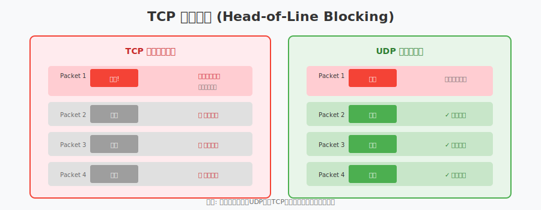
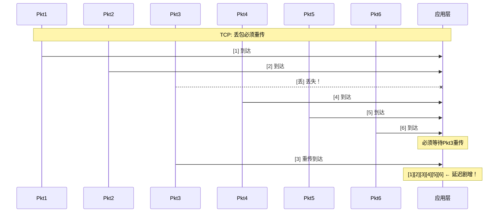
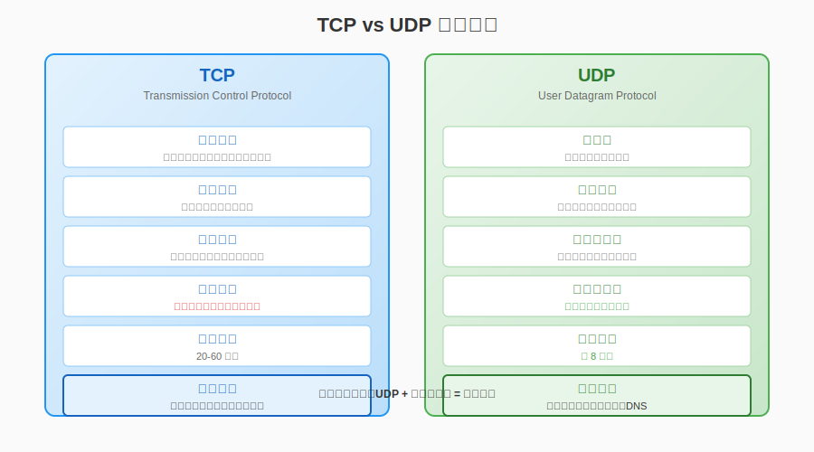
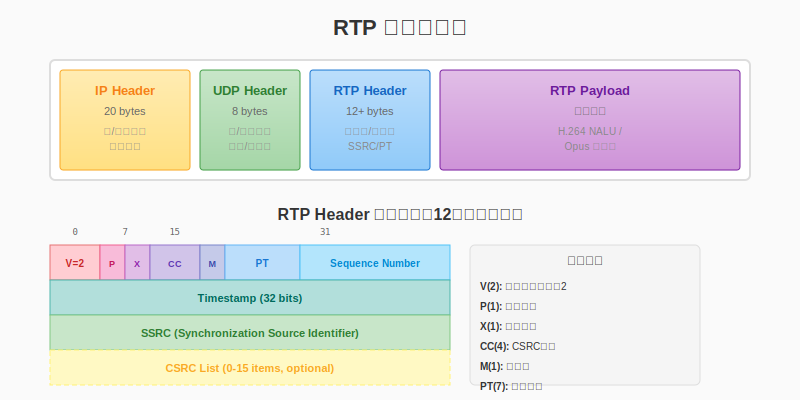
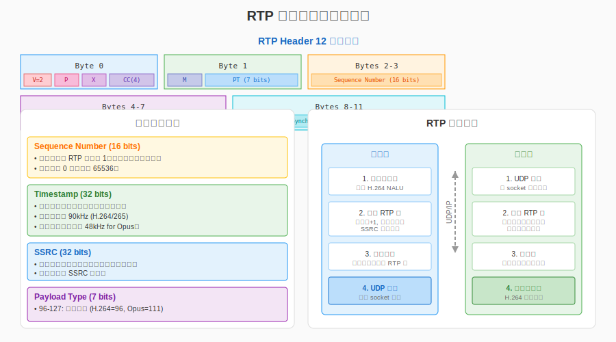
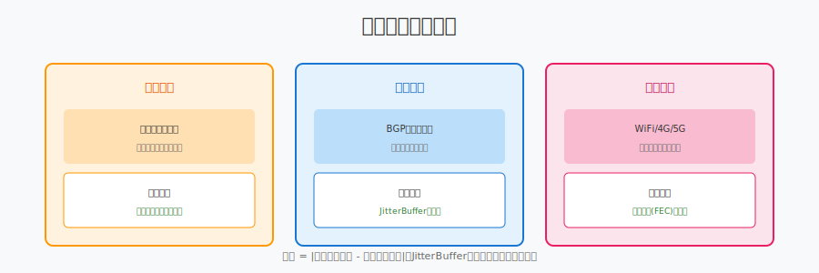
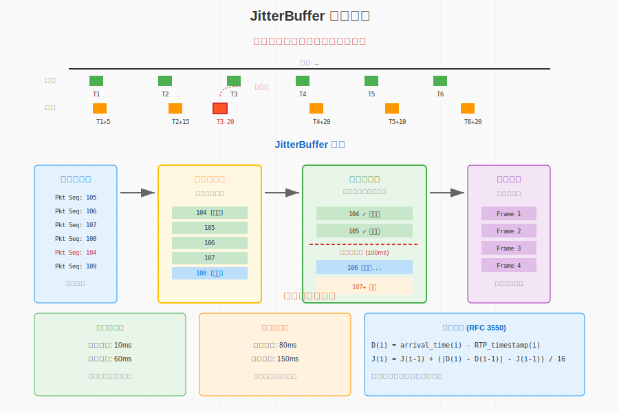

# 第18章：UDP与实时传输

> **本章目标**：掌握 UDP 协议的基础编程，理解 RTP/RTCP 协议，实现实时音视频传输。

在第17章中，我们构建了完整的主播端架构，使用 RTMP 协议进行推流。RTMP 基于 TCP 传输，虽然可靠但延迟较高（1-3秒），无法满足连麦互动的实时性需求。

本章将深入 **UDP 协议栈**，这是所有实时通信技术的基石。从 UDP 基础编程到 RTP/RTCP 协议，再到 JitterBuffer 抖动缓冲，你将建立起完整的实时传输知识体系。

**学习本章后，你将能够**：
- 理解为什么 UDP 比 TCP 更适合实时通信
- 掌握 UDP Socket 编程的核心 API
- 理解 RTP 协议头部结构和负载封装
- 使用 RTCP 进行质量反馈和带宽估计
- 实现 JitterBuffer 平滑网络抖动

**本章与第17章的关系**：
- Ch17 是 **网络编程基础** —— Socket API、UDP编程基础
- Ch18 是 **实时传输基础** —— 如何用 UDP 实现低延迟传输

---

## 目录

1. [为什么 UDP 更适合实时通信？](#1-为什么-udp-更适合实时通信)
2. [UDP 编程基础](#2-udp-编程基础)
3. [RTP 协议详解](#3-rtp-协议详解)
4. [RTCP 协议](#4-rtcp-协议)
5. [JitterBuffer 抖动缓冲](#5-jitterbuffer-抖动缓冲)
6. [本章总结](#6-本章总结)

---

## 1. 为什么 UDP 更适合实时通信？

### 1.1 TCP 的"可靠性"代价

TCP（Transmission Control Protocol）是互联网最常用的传输协议，它的设计目标是 **可靠传输**。但这份"可靠性"在实时通信场景下却成了负担：

**TCP 的可靠性机制**：

```
发送方: [Pkt1] [Pkt2] [Pkt3] [Pkt4] [Pkt5]
            ↓     ↓     ↓     ↓     ↓
接收方: [Pkt1] [Pkt2]       [Pkt4] [Pkt5]
                      ↑
                  Pkt3 丢失！
                      ↓
            [等待重传 Pkt3...]
                      ↓
            [Pkt3] 终于到达
                      ↓
        按序交付: [Pkt1] [Pkt2] [Pkt3] [Pkt4] [Pkt5]
```

TCP 为了保证可靠性，引入了三个关键机制：

| 机制 | 作用 | 实时通信中的问题 |
|:---|:---|:---|
| **重传机制** | 丢包后重发 | 重传增加延迟，过时数据无用 |
| **队头阻塞** | 保证数据顺序 | 一个丢包阻塞后续所有数据 |
| **拥塞控制** | 防止网络过载 | 过度保守，无法适应实时需求 |

### 1.2 队头阻塞：TCP 的致命伤

**队头阻塞（Head-of-Line Blocking）** 是 TCP 在实时场景下的最大问题：



```
时间线 →

**TCP 场景**：



**UDP 场景**：

```mermaid
sequenceDiagram
    participant Pkt1 as Pkt1
    participant Pkt2 as Pkt2
    participant Pkt3 as Pkt3
    participant Pkt4 as Pkt4
    participant Pkt5 as Pkt5
    participant Pkt6 as Pkt6
    participant App as 应用层
    
    Note over Pkt1,App: UDP: 无需等待，立即交付
    Pkt1->>App: [1] 到达
    Pkt2->>App: [2] 到达
    Pkt3--xApp: [丢] 丢失
    Pkt4->>App: [4] 到达
    Pkt5->>App: [5] 到达
    Pkt6->>App: [6] 到达
    Note over App: [1][2][4][5][6] ← 低延迟继续播放！
 [1]  [2]       [4]   [5]   [6]  ← 立即交付可用数据
```

在视频通话中，第3帧丢失后，第4、5、6帧可能已经到达。TCP 会强制等待第3帧重传，导致画面卡顿；而 UDP 可以立即显示第4、5、6帧，虽然少了第3帧，但画面是连续的。

### 1.3 实时通信的核心诉求

实时音视频通信有独特的需求：

**"快"比"全"更重要**：
- 视频会议：宁愿丢掉几帧，也不能让整个画面卡住
- 直播连麦：说话者的声音必须实时到达，晚到的数据毫无意义

**"适度丢包"是可接受的**：
- 视频帧率 30fps，丢掉 1 帧，用户几乎察觉不到
- 音频有丢包隐藏（PLC）技术，可以"伪造"丢失的采样

**需要应用层控制**：
- 何时重传、何时放弃，应该由应用决定
- 编码层可以主动降低码率，而非 TCP 强制降速

### 1.4 TCP vs UDP 对比



| 特性 | TCP | UDP | 实时场景偏好 |
|:---|:---|:---|:---:|
| **连接方式** | 面向连接 | 无连接 | UDP |
| **可靠性** | 可靠传输 | 尽力而为 | UDP |
| **顺序保证** | 有序交付 | 无序 | UDP |
| **拥塞控制** | 内置 | 无 | UDP |
| **头部开销** | 20-60 字节 | 8 字节 | UDP |
| **延迟** | 可变（重传延迟）| 稳定 | UDP |
| **适用场景** | 文件传输、网页 | 音视频、游戏 | - |

### 1.5 实时传输的正确姿势

使用 UDP 不代表放弃可靠性，而是 **把可靠性控制交给应用层**：

```
┌─────────────────────────────────────────┐
│           应用层（你的代码）              │
│  ┌─────────────┐    ┌─────────────┐    │
│  │  丢包恢复    │    │  拥塞控制   │    │
│  │  (NACK/PLC) │    │  (GCC)      │    │
│  └─────────────┘    └─────────────┘    │
│  ┌─────────────┐    ┌─────────────┐    │
│  │  抖动缓冲    │    │  前向纠错   │    │
│  │(JitterBuffer)│   │  (FEC)      │    │
│  └─────────────┘    └─────────────┘    │
└─────────────────────────────────────────┘
                   ↓
┌─────────────────────────────────────────┐
│              传输层 (UDP)               │
│         快速、无阻塞、低开销             │
└─────────────────────────────────────────┘
```

**关键设计原则**：
1. **快速发送**：UDP 不阻塞，数据准备好立即发送
2. **智能丢包处理**：关键帧必须重传，非关键帧可以丢
3. **自适应码率**：根据网络状况动态调整编码码率
4. **平滑抖动**：用 JitterBuffer 吸收网络时延波动

---

## 2. UDP 编程基础

### 2.1 UDP Socket 核心 API

UDP 编程比 TCP 简单得多，核心只有四个操作：

```cpp
// 1. 创建 UDP Socket
int sockfd = socket(AF_INET, SOCK_DGRAM, 0);

// 2. 绑定本地地址（服务器端必需）
bind(sockfd, (struct sockaddr*)&local_addr, sizeof(local_addr));

// 3. 发送数据
sendto(sockfd, buffer, len, 0, 
       (struct sockaddr*)&dest_addr, sizeof(dest_addr));

// 4. 接收数据
recvfrom(sockfd, buffer, max_len, 0,
         (struct sockaddr*)&from_addr, &addr_len);
```

### 2.2 UDP 服务器示例

```cpp
// ============================================
// 简单的 UDP Echo 服务器
// ============================================
#pragma once
#include <sys/socket.h>
#include <netinet/in.h>
#include <unistd.h>
#include <cstring>
#include <functional>

namespace live {

class UdpServer {
public:
    using PacketHandler = std::function<void(
        const uint8_t* data, size_t len,
        const sockaddr_in& from)>;

    UdpServer() : sockfd_(-1) {}
    
    ~UdpServer() { Stop(); }

    // 绑定本地端口
    bool Bind(uint16_t port) {
        sockfd_ = socket(AF_INET, SOCK_DGRAM, 0);
        if (sockfd_ < 0) return false;

        sockaddr_in addr{};
        addr.sin_family = AF_INET;
        addr.sin_port = htons(port);
        addr.sin_addr.s_addr = INADDR_ANY;

        if (bind(sockfd_, (sockaddr*)&addr, sizeof(addr)) < 0) {
            close(sockfd_);
            sockfd_ = -1;
            return false;
        }
        return true;
    }

    // 启动接收循环（阻塞模式）
    void StartBlocking(PacketHandler handler) {
        uint8_t buffer[2048];
        sockaddr_in from_addr;
        socklen_t addr_len = sizeof(from_addr);

        while (running_) {
            ssize_t n = recvfrom(sockfd_, buffer, sizeof(buffer), 0,
                                 (sockaddr*)&from_addr, &addr_len);
            if (n > 0 && handler) {
                handler(buffer, n, from_addr);
            }
        }
    }

    // 发送数据到指定地址
    void SendTo(const uint8_t* data, size_t len, 
                const sockaddr_in& to) {
        sendto(sockfd_, data, len, 0, 
               (sockaddr*)&to, sizeof(to));
    }

    void Stop() {
        running_ = false;
        if (sockfd_ >= 0) {
            close(sockfd_);
            sockfd_ = -1;
        }
    }

private:
    int sockfd_;
    bool running_ = true;
};

} // namespace live
```

### 2.3 UDP 客户端示例

```cpp
// ============================================
// UDP 客户端
// ============================================
#pragma once
#include "udp_server.hpp"

namespace live {

class UdpClient {
public:
    bool Connect(const char* ip, uint16_t port) {
        sockfd_ = socket(AF_INET, SOCK_DGRAM, 0);
        if (sockfd_ < 0) return false;

        server_addr_.sin_family = AF_INET;
        server_addr_.sin_port = htons(port);
        inet_pton(AF_INET, ip, &server_addr_.sin_addr);
        
        connected_ = true;
        return true;
    }

    // 发送数据
    bool Send(const uint8_t* data, size_t len) {
        if (!connected_) return false;
        ssize_t sent = sendto(sockfd_, data, len, 0,
                              (sockaddr*)&server_addr_, 
                              sizeof(server_addr_));
        return sent == (ssize_t)len;
    }

    // 接收数据（带超时）
    bool Receive(uint8_t* buffer, size_t max_len, 
                 size_t& received, int timeout_ms) {
        // 设置接收超时
        timeval tv{timeout_ms / 1000, 
                   (timeout_ms % 1000) * 1000};
        setsockopt(sockfd_, SOL_SOCKET, SO_RCVTIMEO, 
                   &tv, sizeof(tv));

        sockaddr_in from;
        socklen_t addr_len = sizeof(from);
        ssize_t n = recvfrom(sockfd_, buffer, max_len, 0,
                             (sockaddr*)&from, &addr_len);
        if (n > 0) {
            received = n;
            return true;
        }
        return false;
    }

private:
    int sockfd_ = -1;
    sockaddr_in server_addr_;
    bool connected_ = false;
};

} // namespace live
```

### 2.4 非阻塞 IO 与事件循环

生产环境必须使用 **非阻塞 IO + 事件驱动** 架构：

```cpp
// ============================================
// 非阻塞 UDP 服务器（基于 epoll）
// ============================================
#pragma once
#include <sys/epoll.h>
#include <fcntl.h>
#include <vector>

namespace live {

class UdpServerAsync {
public:
    bool Initialize(uint16_t port) {
        // 创建 socket
        sockfd_ = socket(AF_INET, SOCK_DGRAM, 0);
        if (sockfd_ < 0) return false;

        // 设置为非阻塞模式
        int flags = fcntl(sockfd_, F_GETFL, 0);
        fcntl(sockfd_, F_SETFL, flags | O_NONBLOCK);

        // 绑定地址
        sockaddr_in addr{};
        addr.sin_family = AF_INET;
        addr.sin_port = htons(port);
        addr.sin_addr.s_addr = INADDR_ANY;
        bind(sockfd_, (sockaddr*)&addr, sizeof(addr));

        // 创建 epoll 实例
        epollfd_ = epoll_create1(0);
        
        // 注册读事件
        epoll_event ev{};
        ev.events = EPOLLIN;
        ev.data.fd = sockfd_;
        epoll_ctl(epollfd_, EPOLL_CTL_ADD, sockfd_, &ev);

        return true;
    }

    // 事件循环
    void RunLoop() {
        epoll_event events[10];
        while (running_) {
            // 等待事件，最多阻塞 100ms
            int nfds = epoll_wait(epollfd_, events, 10, 100);
            
            for (int i = 0; i < nfds; i++) {
                if (events[i].data.fd == sockfd_) {
                    OnSocketReadable();
                }
            }
        }
    }

private:
    void OnSocketReadable() {
        uint8_t buffer[2048];
        sockaddr_in from;
        socklen_t addr_len = sizeof(from);

        // 循环读取所有可用数据（边缘触发模式需要）
        while (true) {
            ssize_t n = recvfrom(sockfd_, buffer, sizeof(buffer), 0,
                                 (sockaddr*)&from, &addr_len);
            if (n <= 0) {
                if (errno == EAGAIN || errno == EWOULDBLOCK) {
                    break; // 没有更多数据了
                }
                // 处理错误
                break;
            }
            // 处理数据包
            ProcessPacket(buffer, n, from);
        }
    }

    void ProcessPacket(const uint8_t* data, size_t len, 
                       const sockaddr_in& from) {
        // 实际业务逻辑
    }

    int sockfd_ = -1;
    int epollfd_ = -1;
    bool running_ = true;
};

} // namespace live
```

**非阻塞 IO 的优势**：
- 单个线程可以处理数万连接
- 没有线程切换开销
- 响应延迟低且可控

### 2.5 UDP 编程最佳实践

| 实践 | 说明 | 代码示例 |
|:---|:---|:---|
| **设置缓冲区大小** | 防止内核缓冲区溢出丢包 | `setsockopt(SO_RCVBUF/SO_SNDBUF)` |
| **启用端口复用** | 服务器快速重启 | `setsockopt(SO_REUSEADDR)` |
| **校验包大小** | UDP 包通常限制在 1500 字节以内 | 检查 MTU |
| **处理 EAGAIN** | 非阻塞模式下无数据可读 | `if (errno == EAGAIN)` |

---

## 3. RTP 协议详解

RTP（Real-time Transport Protocol）是实时音视频传输的事实标准，定义于 RFC 3550。它运行在 UDP 之上，为音视频数据提供时序信息和负载类型标识。

### 3.1 RTP 设计目标

RTP 不是凭空设计的，它要解决几个关键问题：

| 问题 | RTP 解决方案 |
|:---|:---|
| 如何知道包的发送顺序？ | 序列号（Sequence Number） |
| 如何同步音视频？ | 时间戳（Timestamp） |
| 如何区分不同来源？ | 同步源标识（SSRC） |
| 如何识别编码格式？ | 负载类型（Payload Type） |

### 3.2 RTP 包结构



```
┌─────────────────────────────────────────────────────────────┐
│                        IP 头部 (20 字节)                      │
├─────────────────────────────────────────────────────────────┤
│                       UDP 头部 (8 字节)                       │
├─────────────────────────────────────────────────────────────┤
│                       RTP 头部 (12+ 字节)                     │
├─────────────────────────────────────────────────────────────┤
│                      RTP 负载 (变长)                          │
│                  (H.264 NALU / Opus 帧等)                     │
└─────────────────────────────────────────────────────────────┘
```

### 3.3 RTP 头部详解



```
 0                   1                   2                   3
 0 1 2 3 4 5 6 7 8 9 0 1 2 3 4 5 6 7 8 9 0 1 2 3 4 5 6 7 8 9 0 1
+-+-+-+-+-+-+-+-+-+-+-+-+-+-+-+-+-+-+-+-+-+-+-+-+-+-+-+-+-+-+-+-+
|V=2|P|X|  CC   |M|     PT      |       序列号 (Sequence)        |
+-+-+-+-+-+-+-+-+-+-+-+-+-+-+-+-+-+-+-+-+-+-+-+-+-+-+-+-+-+-+-+-+
|                           时间戳 (Timestamp)                   |
+-+-+-+-+-+-+-+-+-+-+-+-+-+-+-+-+-+-+-+-+-+-+-+-+-+-+-+-+-+-+-+-+
|           同步源标识 (SSRC)                                    |
+-+-+-+-+-+-+-+-+-+-+-+-+-+-+-+-+-+-+-+-+-+-+-+-+-+-+-+-+-+-+-+-+
|           贡献源标识 (CSRC) 列表 (可选，0-15 项)               |
+-+-+-+-+-+-+-+-+-+-+-+-+-+-+-+-+-+-+-+-+-+-+-+-+-+-+-+-+-+-+-+-+
```

**字段详解**：

| 字段 | 位宽 | 说明 |
|:---|:---:|:---|
| **V** | 2 | 版本号，固定为 2 |
| **P** | 1 | 填充标志，负载末尾有填充字节 |
| **X** | 1 | 扩展标志，头部后有扩展头 |
| **CC** | 4 | CSRC 计数，0-15 |
| **M** | 1 | 标记位，视频表示关键帧，音频表示会话开始 |
| **PT** | 7 | 负载类型，标识编码格式 |
| **Sequence** | 16 | 序列号，每发一个包 +1，用于检测丢包和排序 |
| **Timestamp** | 32 | 时间戳，反映采样时刻，用于同步和抖动计算 |
| **SSRC** | 32 | 同步源标识，随机生成，唯一标识一个流 |
| **CSRC** | 32×N | 贡献源列表，混音时使用 |

### 3.4 负载类型（Payload Type）

PT 字段标识了负载的编码格式：

| PT 值 | 编码格式 | 时钟频率 |
|:---:|:---|:---:|
| 0 | PCMU (G.711 μ-law) | 8000 Hz |
| 8 | PCMA (G.711 A-law) | 8000 Hz |
| 96-127 | 动态分配 | 协商确定 |

**动态 PT 常见映射**：

| PT | 编码 | 说明 |
|:---:|:---|:---|
| 96 | H.264 | 视频编码 |
| 97 | H.265 | 视频编码 |
| 98 | VP8 | 视频编码 |
| 111 | Opus | 音频编码 |

### 3.5 RTP 打包实现

```cpp
// ============================================
// RTP 打包器
// ============================================
#pragma once
#include <cstdint>
#include <cstring>

namespace live {

// RTP 头部结构（固定 12 字节）
struct RtpHeader {
    uint8_t flags;        // V(2) + P(1) + X(1) + CC(4)
    uint8_t m_pt;         // M(1) + PT(7)
    uint16_t sequence;    // 序列号（网络字节序）
    uint32_t timestamp;   // 时间戳（网络字节序）
    uint32_t ssrc;        // 同步源（网络字节序）

    // 设置各个字段
    void SetVersion(uint8_t v) { flags = (flags & 0x3F) | (v << 6); }
    void SetPadding(bool p) { flags = p ? (flags | 0x20) : (flags & 0xDF); }
    void SetExtension(bool x) { flags = x ? (flags | 0x10) : (flags & 0xEF); }
    void SetCsrcCount(uint8_t cc) { flags = (flags & 0xF0) | (cc & 0x0F); }
    void SetMarker(bool m) { m_pt = m ? (m_pt | 0x80) : (m_pt & 0x7F); }
    void SetPayloadType(uint8_t pt) { m_pt = (m_pt & 0x80) | (pt & 0x7F); }
    
    // 网络字节序转换
    void SetSequence(uint16_t seq) { sequence = htons(seq); }
    void SetTimestamp(uint32_t ts) { timestamp = htonl(ts); }
    void SetSsrc(uint32_t s) { ssrc = htonl(s); }
};
static_assert(sizeof(RtpHeader) == 12, "RtpHeader size must be 12");

class RtpPacketizer {
public:
    RtpPacketizer(uint8_t payload_type, uint32_t ssrc)
        : payload_type_(payload_type), ssrc_(ssrc), sequence_(0) {}

    // 打包一帧数据
    bool Packetize(const uint8_t* frame, size_t frame_len,
                   uint32_t timestamp,
                   std::vector<std::vector<uint8_t>>& packets) {
        
        const size_t MAX_RTP_PAYLOAD = 1400; // 预留空间给头部
        size_t offset = 0;
        bool first_fragment = true;

        while (offset < frame_len) {
            size_t remaining = frame_len - offset;
            size_t payload_size = std::min(remaining, MAX_RTP_PAYLOAD);
            bool last_fragment = (offset + payload_size >= frame_len);

            // 创建 RTP 包
            std::vector<uint8_t> packet;
            packet.reserve(12 + payload_size + 2); // 头 + 负载 + FU 头

            // 写入 RTP 头部
            RtpHeader header{};
            header.SetVersion(2);
            header.SetPadding(false);
            header.SetExtension(false);
            header.SetCsrcCount(0);
            header.SetMarker(last_fragment); // 最后一个片段设置 M 位
            header.SetPayloadType(payload_type_);
            header.SetSequence(sequence_++);
            header.SetTimestamp(timestamp);
            header.SetSsrc(ssrc_);

            packet.insert(packet.end(), 
                         reinterpret_cast<uint8_t*>(&header),
                         reinterpret_cast<uint8_t*>(&header) + 12);

            // 写入负载（这里简化处理，实际需要根据编码格式添加分片头）
            packet.insert(packet.end(),
                         frame + offset,
                         frame + offset + payload_size);

            packets.push_back(std::move(packet));
            offset += payload_size;
        }

        return !packets.empty();
    }

private:
    uint8_t payload_type_;
    uint32_t ssrc_;
    uint16_t sequence_;
};

} // namespace live
```

### 3.6 H.264 over RTP

H.264 视频需要通过 RTP 分片传输，主要有两种方式：

**单 NAL 单元模式**（NALU < 1400 字节）：
```
RTP 头部 (12 字节) + H.264 NAL 头部 (1 字节) + NAL 负载
```

**FU-A 分片模式**（NALU >= 1400 字节）：
```
RTP 头部 (12 字节) + FU 指示器 (1 字节) + FU 头部 (1 字节) + 片段
```

```cpp
// H.264 NAL 单元类型
enum H264NalType {
    kNalSlice = 1,           // 非 IDR 片
    kNalDPA = 2,             // 数据分区 A
    kNalDPB = 3,             // 数据分区 B
    kNalDPC = 4,             // 数据分区 C
    kNalIDR = 5,             // IDR 片（关键帧）
    kNalSEI = 6,             // 补充增强信息
    kNalSPS = 7,             // 序列参数集
    kNalPPS = 8,             // 图像参数集
    kNalAUD = 9,             // 访问单元分隔符
    kNalEndOfSequence = 10,
    kNalEndOfStream = 11,
    kNalFiller = 12,
    kNalStapA = 24,          // 单时聚合包 A
    kNalFuA = 28,            // 分片单元 A
};

// FU-A 分片打包
void PackFuA(const uint8_t* nalu, size_t nalu_len, uint32_t timestamp,
             std::vector<std::vector<uint8_t>>& packets) {
    const size_t MAX_PAYLOAD = 1400;
    uint8_t nal_header = nalu[0]; // 原始 NAL 头部
    uint8_t nal_type = nal_header & 0x1F;
    uint8_t nri = nal_header & 0x60;

    size_t offset = 1; // 跳过 NAL 头部
    bool first = true;

    while (offset < nalu_len) {
        size_t remaining = nalu_len - offset;
        size_t payload_size = std::min(remaining, MAX_PAYLOAD);
        bool last = (offset + payload_size >= nalu_len);

        std::vector<uint8_t> packet;
        
        // 添加 RTP 头部（省略，同上）
        
        // FU 指示器：F(1) + NRI(2) + Type(5) = 28 (FU-A)
        uint8_t fu_indicator = nri | 28;
        packet.push_back(fu_indicator);

        // FU 头部：S(1) + E(1) + R(1) + Type(5)
        uint8_t fu_header = nal_type;
        if (first) fu_header |= 0x80; // S = 1
        if (last) fu_header |= 0x40;  // E = 1
        packet.push_back(fu_header);

        // 添加负载片段
        packet.insert(packet.end(), nalu + offset, 
                     nalu + offset + payload_size);

        packets.push_back(std::move(packet));
        
        offset += payload_size;
        first = false;
    }
}
```

---

## 4. RTCP 协议

RTP 只负责传输数据，质量反馈需要 **RTCP（RTP Control Protocol）** 协议。

### 4.1 RTCP 的作用


```
        发送端                                    接收端
    ┌──────────┐                             ┌──────────┐
    │  发送 RTP  │─────────────────────────────→│ 接收 RTP  │
    │  数据包   │                             │  数据包   │
    └──────────┘                             └──────────┘
         ↑                                        │
         │           定期发送 RTCP                  │
         │           报告 (RR)                      │
         │         ┌───────────────────────────────┘
         │         ↓
    ┌──────────┐  丢包率、抖动、延迟      ┌──────────┐
    │  解析 RTCP │←───────────────────────│ 生成 RTCP │
    │   报告    │                        │   报告    │
    └──────────┘                        └──────────┘
         │
         ↓
    ┌──────────────┐
    │  调整编码码率  │
    │  自适应网络   │
    └──────────────┘
```

**RTCP 五大功能**：

| 功能 | 说明 |
|:---|:---|
| **质量反馈** | 向发送端报告接收质量（丢包、抖动） |
| **源标识** | CNAME 提供持久标识，SSRC 可能变化 |
| **同步** | 关联不同源的时钟，实现音视频同步 |
| **会话控制** | BYE 消息表示离开 |
| **带宽控制** | 限制 RTCP 带宽占用（不超过 5%） |

### 4.2 RTCP 包类型

| 类型 | 名称 | 缩写 | 发送者 |
|:---:|:---|:---:|:---|
| 200 | 发送者报告 | SR | 发送端 |
| 201 | 接收者报告 | RR | 接收端 |
| 202 | 源描述 | SDES | 所有参与者 |
| 203 | 再见 | BYE | 离开者 |
| 204 | 应用特定 | APP | 应用自定义 |
| 205 | 传输层反馈 | RTPFB | 接收端 |
| 206 | 负载特定反馈 | PSFB | 接收端 |

### 4.3 发送者报告（SR）

```
 0                   1                   2                   3
 0 1 2 3 4 5 6 7 8 9 0 1 2 3 4 5 6 7 8 9 0 1 2 3 4 5 6 7 8 9 0 1
+-+-+-+-+-+-+-+-+-+-+-+-+-+-+-+-+-+-+-+-+-+-+-+-+-+-+-+-+-+-+-+-+
|V=2|P|    RC   |  PT=SR=200    |            长度               |
+-+-+-+-+-+-+-+-+-+-+-+-+-+-+-+-+-+-+-+-+-+-+-+-+-+-+-+-+-+-+-+-+
|                         同步源 (SSRC)                          |
+-+-+-+-+-+-+-+-+-+-+-+-+-+-+-+-+-+-+-+-+-+-+-+-+-+-+-+-+-+-+-+-+
|              NTP 时间戳高位 (秒)                |
+-+-+-+-+-+-+-+-+-+-+-+-+-+-+-+-+-+-+-+-+-+-+-+-+-+-+-+-+-+-+-+-+
|              NTP 时间戳低位 (秒的小数部分)      |
+-+-+-+-+-+-+-+-+-+-+-+-+-+-+-+-+-+-+-+-+-+-+-+-+-+-+-+-+-+-+-+-+
|                         RTP 时间戳                             |
+-+-+-+-+-+-+-+-+-+-+-+-+-+-+-+-+-+-+-+-+-+-+-+-+-+-+-+-+-+-+-+-+
|                 发送者包计数 (Sender's packet count)           |
+-+-+-+-+-+-+-+-+-+-+-+-+-+-+-+-+-+-+-+-+-+-+-+-+-+-+-+-+-+-+-+-+
|                 发送者字节计数 (Sender's octet count)          |
+-+-+-+-+-+-+-+-+-+-+-+-+-+-+-+-+-+-+-+-+-+-+-+-+-+-+-+-+-+-+-+-+
```

**关键字段**：
- **NTP 时间戳**：绝对时间，用于跨流同步
- **RTP 时间戳**：与数据包时间戳对应
- **包计数**：累计发送的 RTP 包数
- **字节计数**：累计发送的字节数

### 4.4 接收者报告（RR）

```
 0                   1                   2                   3
 0 1 2 3 4 5 6 7 8 9 0 1 2 3 4 5 6 7 8 9 0 1 2 3 4 5 6 7 8 9 0 1
+-+-+-+-+-+-+-+-+-+-+-+-+-+-+-+-+-+-+-+-+-+-+-+-+-+-+-+-+-+-+-+-+
|V=2|P|    RC   |  PT=RR=201    |            长度               |
+-+-+-+-+-+-+-+-+-+-+-+-+-+-+-+-+-+-+-+-+-+-+-+-+-+-+-+-+-+-+-+-+
|                     报告者 SSRC                                |
+-+-+-+-+-+-+-+-+-+-+-+-+-+-+-+-+-+-+-+-+-+-+-+-+-+-+-+-+-+-+-+-+
|  丢失率 (8)   |   累计丢失 (24)                                |
+-+-+-+-+-+-+-+-+-+-+-+-+-+-+-+-+-+-+-+-+-+-+-+-+-+-+-+-+-+-+-+-+
|           接收到的最高序列号          |   到达抖动 (Jitter)     |
+-+-+-+-+-+-+-+-+-+-+-+-+-+-+-+-+-+-+-+-+-+-+-+-+-+-+-+-+-+-+-+-+
|                  最后 SR 时间戳 (LSR)                           |
+-+-+-+-+-+-+-+-+-+-+-+-+-+-+-+-+-+-+-+-+-+-+-+-+-+-+-+-+-+-+-+-+
|                  自最后 SR 以来的延迟 (DLSR)                    |
+-+-+-+-+-+-+-+-+-+-+-+-+-+-+-+-+-+-+-+-+-+-+-+-+-+-+-+-+-+-+-+-+
```

**关键字段**：
- **丢包率（Fraction Lost）**：最近一个间隔的丢包比例
- **累计丢失**：整个会话的丢包总数
- **最高序列号**：已接收的最大 RTP 序列号
- **抖动（Jitter）**：接收时延的统计方差

### 4.5 丢包率和抖动计算

**丢包率计算**：

```cpp
// 计算丢包率
struct LossStats {
    uint32_t expected;      // 期望接收的包数
    uint32_t received;      // 实际接收的包数
    uint32_t lost;          // 丢失的包数
    uint8_t fraction_lost;  // 丢包率 (0-255, 255=100%)
};

LossStats CalculateLoss(uint16_t highest_seq, 
                        uint32_t cumulative_lost_prev,
                        uint32_t expected_prev) {
    LossStats stats;
    
    // 当前期望接收总数 = 最高序列号 - 初始序列号 + 1
    uint32_t expected_now = highest_seq + 1;
    uint32_t expected_interval = expected_now - expected_prev;
    
    // 实际接收数量（通过其他方式统计）
    uint32_t received_interval = /* 实际接收数 */;
    
    // 本周期丢包数
    int32_t lost_interval = expected_interval - received_interval;
    if (lost_interval < 0) lost_interval = 0;
    
    // 丢包率 (0-255)
    if (expected_interval > 0) {
        stats.fraction_lost = (lost_interval * 256) / expected_interval;
    }
    
    return stats;
}
```

**抖动计算**：

```cpp
// 抖动计算（RFC 3550 推荐算法）
class JitterCalculator {
public:
    void Update(uint32_t rtp_timestamp, 
                uint32_t arrival_time_ms) {
        // 传输时间差 = (到达时间 - RTP时间戳)
        int32_t transit = arrival_time_ms - 
                         (rtp_timestamp / 90); // 假设 90kHz
        
        if (first_packet_) {
            transit_prev_ = transit;
            first_packet_ = false;
            return;
        }
        
        // 本次与上次的差值
        int32_t d = transit - transit_prev_;
        if (d < 0) d = -d;
        
        // 指数加权移动平均：J = J + (|D| - J) / 16
        jitter_ += (d - jitter_) / 16;
        transit_prev_ = transit;
    }
    
    uint32_t GetJitter() const { return jitter_; }

private:
    bool first_packet_ = true;
    int32_t transit_prev_ = 0;
    uint32_t jitter_ = 0;
};
```

### 4.6 RTCP 实现代码

```cpp
// ============================================
// RTCP 接收报告生成器
// ============================================
#pragma once
#include <cstdint>
#include <vector>
#include <cstring>

namespace live {

// RTCP 头部
struct RtcpHeader {
    uint8_t flags;      // V(2) + P(1) + RC(5)
    uint8_t packet_type;
    uint16_t length;    // 长度（32位字为单位）- 1

    void SetVersion(uint8_t v) { flags = (flags & 0x3F) | (v << 6); }
    void SetCount(uint8_t c) { flags = (flags & 0xC0) | (c & 0x1F); }
    void SetLength(uint16_t len) { length = htons(len); }
};

// 接收报告块
struct ReceiverReportBlock {
    uint32_t ssrc;          // 被报告源的 SSRC
    uint8_t fraction_lost;  // 丢包率
    uint8_t cumulative_lost[3]; // 累计丢包（24位）
    uint32_t highest_seq;   // 最高序列号
    uint32_t jitter;        // 抖动
    uint32_t lsr;           // 最后 SR 时间戳
    uint32_t dlsr;          // 自最后 SR 的延迟
};

class RtcpSender {
public:
    std::vector<uint8_t> CreateReceiverReport(
        uint32_t reporter_ssrc,
        const std::vector<ReceiverReportBlock>& blocks) {
        
        std::vector<uint8_t> packet;
        
        // RTCP 头部
        RtcpHeader header{};
        header.SetVersion(2);
        header.SetCount(blocks.size());
        header.packet_type = 201; // RR
        // 长度 = (4 + blocks.size() * 6) / 4 - 1 = 3 + blocks.size() * 6 / 4
        header.SetLength(3 + blocks.size() * 6 - 1);
        
        packet.push_back(header.flags);
        packet.push_back(header.packet_type);
        packet.push_back(header.length & 0xFF);
        packet.push_back((header.length >> 8) & 0xFF);
        
        // 报告者 SSRC
        uint32_t ssrc_net = htonl(reporter_ssrc);
        packet.insert(packet.end(), 
                     reinterpret_cast<uint8_t*>(&ssrc_net),
                     reinterpret_cast<uint8_t*>(&ssrc_net) + 4);
        
        // 报告块
        for (const auto& block : blocks) {
            AddReportBlock(packet, block);
        }
        
        return packet;
    }

private:
    void AddReportBlock(std::vector<uint8_t>& packet,
                       const ReceiverReportBlock& block) {
        uint32_t val;
        
        // SSRC
        val = htonl(block.ssrc);
        packet.insert(packet.end(),
                     reinterpret_cast<const uint8_t*>(&val),
                     reinterpret_cast<const uint8_t*>(&val) + 4);
        
        // 丢包率 + 累计丢包
        packet.push_back(block.fraction_lost);
        packet.push_back(block.cumulative_lost[0]);
        packet.push_back(block.cumulative_lost[1]);
        packet.push_back(block.cumulative_lost[2]);
        
        // 最高序列号
        val = htonl(block.highest_seq);
        packet.insert(packet.end(),
                     reinterpret_cast<const uint8_t*>(&val),
                     reinterpret_cast<const uint8_t*>(&val) + 4);
        
        // 抖动
        val = htonl(block.jitter);
        packet.insert(packet.end(),
                     reinterpret_cast<const uint8_t*>(&val),
                     reinterpret_cast<const uint8_t*>(&val) + 4);
        
        // LSR
        val = htonl(block.lsr);
        packet.insert(packet.end(),
                     reinterpret_cast<const uint8_t*>(&val),
                     reinterpret_cast<const uint8_t*>(&val) + 4);
        
        // DLSR
        val = htonl(block.dlsr);
        packet.insert(packet.end(),
                     reinterpret_cast<const uint8_t*>(&val),
                     reinterpret_cast<const uint8_t*>(&val) + 4);
    }
};

} // namespace live
```

### 4.7 带宽估计基础

RTCP 提供的反馈是 **GCC（Google Congestion Control）** 等拥塞控制算法的基础：

```cpp
// 基于丢包的带宽估计
class LossBasedBandwidthEstimator {
public:
    void Update(uint8_t fraction_lost) {
        // 丢包率 < 2%：网络良好，增加码率
        if (fraction_lost < 5) { // 约 2%
            bitrate_bps_ = static_cast<uint32_t>(bitrate_bps_ * 1.08);
        }
        // 丢包率 2%-10%：保持当前码率
        else if (fraction_lost < 26) { // 约 10%
            // 码率不变
        }
        // 丢包率 > 10%：网络拥塞，降低码率
        else {
            bitrate_bps_ = static_cast<uint32_t>(bitrate_bps_ * 0.85);
        }
        
        // 限制在合理范围
        bitrate_bps_ = std::min(bitrate_bps_, max_bitrate_bps_);
        bitrate_bps_ = std::max(bitrate_bps_, min_bitrate_bps_);
    }
    
    uint32_t GetEstimate() const { return bitrate_bps_; }

private:
    uint32_t bitrate_bps_ = 1000000;     // 初始 1Mbps
    uint32_t min_bitrate_bps_ = 150000;  // 最低 150kbps
    uint32_t max_bitrate_bps_ = 5000000; // 最高 5Mbps
};
```

---

## 5. JitterBuffer 抖动缓冲

网络传输的延迟不是恒定的，会有 **抖动（Jitter）**。JitterBuffer 的作用是平滑这种抖动，保证解码器获得稳定的输入。

### 5.1 抖动的来源



| 来源 | 说明 | 典型值 |
|:---|:---|:---:|
| **网络排队** | 路由器缓冲区排队时间变化 | 0-100ms |
| **拥塞控制** | TCP/网络层主动降速 | 突发延迟 |
| **多路径** | 负载均衡导致不同路径延迟 | 差异可达 50ms |
| **无线干扰** | WiFi/4G 信号强度波动 | 0-200ms |

**抖动可视化**：
```
时间(ms)
  │
50├─────────┐
  │         │
40├────┐    │     ┌──────────┐
  │    │    │     │          │
30├────┼────┼─────┼─────┐    │
  │    │    │     │     │    │
20├────┼────┼─────┼─────┼────┼─── 期望延迟线
  │    │     ╲    │      ╲   │
10├────┼──────╲───┼───────╲──┘
  │    │        ╲ │         ╲
 0├────┴─────────┴───────────┴─── 发送时间
  │    A    B    C    D    E    F  → 数据包
```

### 5.2 JitterBuffer 工作原理



```
┌─────────────────────────────────────────────────────────────┐
│                      JitterBuffer                           │
├─────────────────────────────────────────────────────────────┤
│  到达数据包                                                   │
│     │                                                       │
│     ▼                                                       │
│  ┌───────────────────────────────────────────────────────┐  │
│  │              接收队列 (按序列号排序)                    │  │
│  │  [Pkt3] [Pkt4] [Pkt5] [Pkt6] [Pkt7] [Pkt8] [Pkt9]      │  │
│  │    ↑                                    ↑              │  │
│  │   已接收                               等待中           │  │
│  └───────────────────────────────────────────────────────┘  │
│     │                                                       │
│     │ 等待直到目标延迟                                       │
│     ▼                                                       │
│  ┌───────────────────────────────────────────────────────┐  │
│  │              播放缓冲区 (按时序输出)                    │  │
│  │       [Pkt3] [Pkt4] [Pkt5] → 解码器                    │  │
│  └───────────────────────────────────────────────────────┘  │
└─────────────────────────────────────────────────────────────┘
```

### 5.3 JitterBuffer 核心设计

```cpp
// ============================================
// JitterBuffer 实现
// ============================================
#pragma once
#include <map>
#include <queue>
#include <chrono>
#include <functional>

namespace live {

struct JitterPacket {
    uint16_t sequence;
    uint32_t timestamp;
    std::vector<uint8_t> payload;
    std::chrono::steady_clock::time_point arrival_time;
    bool is_keyframe;
};

class JitterBuffer {
public:
    using FrameCallback = std::function<void(
        const JitterPacket& packet)>;

    explicit JitterBuffer(FrameCallback callback)
        : callback_(callback), target_delay_ms_(100) {}

    // 插入收到的数据包
    void InsertPacket(JitterPacket packet) {
        // 计算当前抖动
        UpdateJitterEstimate(packet);
        
        // 存储到缓冲区
        buffer_[packet.sequence] = std::move(packet);
        
        // 尝试输出
        TryOutput();
    }

    // 定期调用（如每 10ms）
    void Process() {
        TryOutput();
        
        // 动态调整目标延迟
        AdaptTargetDelay();
    }

private:
    void UpdateJitterEstimate(const JitterPacket& packet) {
        auto now = std::chrono::steady_clock::now();
        
        // 计算传输时间（简化为到达时间差 - 时间戳差）
        if (!last_arrival_.time_since_epoch().count()) {
            last_arrival_ = now;
            last_timestamp_ = packet.timestamp;
            return;
        }
        
        auto arrival_delta = std::chrono::duration_cast<
            std::chrono::milliseconds>(now - last_arrival_).count();
        int32_t timestamp_delta = static_cast<int32_t>(
            packet.timestamp - last_timestamp_) / 90; // 假设 90kHz
        
        int32_t d = arrival_delta - timestamp_delta;
        if (d < 0) d = -d;
        
        // 指数加权移动平均
        jitter_estimate_ms_ += (d - jitter_estimate_ms_) / 16;
        
        last_arrival_ = now;
        last_timestamp_ = packet.timestamp;
    }

    void TryOutput() {
        auto now = std::chrono::steady_clock::now();
        
        while (!buffer_.empty()) {
            auto it = buffer_.begin();
            const auto& packet = it->second;
            
            // 计算包龄（到达后的等待时间）
            auto age_ms = std::chrono::duration_cast<
                std::chrono::milliseconds>(now - packet.arrival_time).count();
            
            // 如果已达到目标延迟，输出
            if (age_ms >= target_delay_ms_) {
                if (callback_) {
                    callback_(packet);
                }
                buffer_.erase(it);
            } else {
                break; // 还没到输出时间
            }
        }
    }

    void AdaptTargetDelay() {
        // 目标延迟 = 当前抖动估计 + 安全余量
        int32_t new_target = jitter_estimate_ms_ + 50;
        
        // 限制范围
        new_target = std::max(new_target, 30);   // 最小 30ms
        new_target = std::min(new_target, 500);  // 最大 500ms
        
        // 平滑调整
        target_delay_ms_ += (new_target - target_delay_ms_) / 4;
    }

    std::map<uint16_t, JitterPacket> buffer_;
    FrameCallback callback_;
    
    int32_t jitter_estimate_ms_ = 0;
    int32_t target_delay_ms_ = 100;
    
    std::chrono::steady_clock::time_point last_arrival_;
    uint32_t last_timestamp_ = 0;
};

} // namespace live
```

### 5.4 JitterBuffer 策略优化

| 策略 | 说明 | 适用场景 |
|:---|:---|:---|
| **固定延迟** | 延迟固定，简单但不够灵活 | 网络稳定的环境 |
| **自适应延迟** | 根据网络状况动态调整 | 移动网络、WiFi |
| **加速播放** | 缓冲区过大时加快播放 | 避免延迟累积 |
| **丢包隐藏** | 包超时未到，用 PLC 填充 | 音频场景 |

---

## 6. 本章总结

### 6.1 核心概念回顾

```
┌─────────────────────────────────────────────────────────────┐
│                    实时传输协议栈                             │
├─────────────────────────────────────────────────────────────┤
│  ┌───────────────────────────────────────────────────────┐  │
│  │  应用层：JitterBuffer、拥塞控制、丢包恢复、FEC          │  │
│  └───────────────────────────────────────────────────────┘  │
│                          ↓                                   │
│  ┌───────────────────────────────────────────────────────┐  │
│  │  RTP：实时传输协议，提供时序和负载类型                  │  │
│  │  RTCP：控制协议，提供质量反馈                           │  │
│  └───────────────────────────────────────────────────────┘  │
│                          ↓                                   │
│  ┌───────────────────────────────────────────────────────┐  │
│  │  UDP：无连接、无阻塞、低开销                            │  │
│  └───────────────────────────────────────────────────────┘  │
│                          ↓                                   │
│  ┌───────────────────────────────────────────────────────┐  │
│  │  IP：网络层路由                                          │  │
│  └───────────────────────────────────────────────────────┘  │
└─────────────────────────────────────────────────────────────┘
```

### 6.2 关键知识点

| 主题 | 核心要点 |
|:---|:---|
| **UDP vs TCP** | UDP 无队头阻塞，适合实时传输；可靠性由应用层控制 |
| **RTP** | 序列号保序、时间戳同步、SSRC 标识源流、PT 标识编码 |
| **RTCP** | SR/RR 报告质量、丢包率和抖动计算、带宽估计基础 |
| **JitterBuffer** | 平滑网络抖动、自适应目标延迟、平衡延迟与流畅 |

### 6.3 从本章走向实践

掌握了 UDP 和 RTP/RTCP，你已经具备了构建实时通信系统的 **传输层基础**。下一章，我们将在此基础上学习 **NAT 穿透和 P2P 连接建立**，解决"如何让两台内网主机直接通信"这一核心问题。

### 6.4 下一章预告

**第19章：NAT 穿透与 P2P 连接**

在下一章中，你将学习：
- **NAT 原理**：为什么内网主机无法直接被访问
- **STUN 协议**：发现自己的公网地址
- **TURN 协议**：中继转发作为兜底方案
- **ICE 框架**：系统化地建立 P2P 连接

这些技术是现代实时通信（WebRTC、视频会议、直播连麦）的核心基础，让我们能够穿透复杂的网络环境，实现端到端的直接通信。

---

## 参考资源

- **RFC 3550**：RTP: A Transport Protocol for Real-Time Applications
- **RFC 3551**：RTP Profile for Audio and Video Conferences
- **RFC 6184**：RTP Payload Format for H.264 Video
- **《WebRTC 权威指南》**：第 3-5 章

---

*本章完*
