# 第19章：NAT 穿透与 P2P 连接

> **本章目标**：理解网络地址转换（NAT）的原理，掌握 STUN/TURN/ICE 协议，实现低延迟的 P2P 连接。

在第18章中，我们掌握了 UDP 编程基础，理解了 RTP/RTCP 协议，并实现了 JitterBuffer 来平滑网络抖动。UDP 是实时通信的基石，但仅有 UDP 还不够——在复杂的网络环境下，大多数设备没有公网 IP 地址，无法直接建立 P2P 连接。

本章将介绍 **WebRTC 技术栈的核心基础** —— 如何在复杂的网络环境下建立点对点（P2P）连接，实现小于 500ms 的超低延迟通信。这是实时连麦、视频会议等互动场景的技术关键。

本章将介绍 **WebRTC 技术栈的核心基础** —— 如何在复杂的网络环境下建立点对点（P2P）连接，实现小于 500ms 的超低延迟通信。

**学习本章后，你将能够**：
- 理解 NAT 的工作原理和四种类型
- 使用 STUN 协议发现公网地址
- 使用 TURN 协议实现中继转发
- 掌握 ICE 框架的候选地址收集和连通性检测
- 设计完整的 P2P 连接建立流程

---

## 目录

1. [为什么需要 NAT 穿透？](#1-为什么需要-nat-穿透)
2. [NAT 是什么？](#2-nat-是什么)
3. [STUN 协议](#3-stun-协议)
4. [TURN 协议](#4-turn-协议)
5. [ICE 框架](#5-ice-框架)
6. [P2P 连接建立流程](#6-p2p-连接建立流程)
7. [本章总结](#7-本章总结)

---

## 1. 为什么需要 NAT 穿透？

### 1.1 直播延迟问题的根源

在传统 CDN 直播架构中，延迟主要来源于：

| 环节 | 延迟来源 | 时间消耗 |
|:---|:---|:---:|
| **采集编码** | H.264 编码缓冲、B帧延迟 | 100-300ms |
| **推流缓冲** | 累积一定数据后批量发送 | 200-500ms |
| **CDN 分发** | 边缘节点缓存、GOP对齐 | 500-2000ms |
| **播放缓冲** | 播放器为防卡顿预留缓冲 | 500-3000ms |
| **总计** | - | **1.3-6 秒** |

### 1.2 P2P 连接的优势

**点对点（P2P）连接** 让两个客户端直接通信，绕过中间服务器：

```mermaid
flowchart LR
    subgraph CDN["传统架构"]
        A1["A"] --> S["CDN服务器"] --> B1["B"]
    end
    
    subgraph P2P["P2P架构"]
        A2["A"] <--> B2["B"]
    end
    
    Note over CDN: 延迟: 1-3秒
    Note over P2P: 延迟: <500ms
```

**延迟对比**：

| 协议 | 典型延迟 | 适用场景 |
|:---|:---:|:---|
| RTMP | 1-3 秒 | 大规模直播、录播 |
| HLS/DASH | 5-30 秒 | 网页播放、兼容性优先 |
| **WebRTC (P2P)** | **< 500ms** | **实时互动、连麦** |

### 1.3 P2P 的挑战

然而，P2P 连接面临一个核心问题：**大多数设备没有公网 IP 地址**。

```
问题: 客户端A如何找到客户端B？

  客户端A (192.168.1.10)        客户端B (10.0.0.5)
      ↓                              ↓
  NAT路由器                      NAT路由器
      ↓                              ↓
  公网? (203.0.113.5)           公网? (198.51.100.8)
      ↓                              ↓
            ? ? ? 如何直接连接 ? ? ?
```

这就是 **NAT 穿透（NAT Traversal）** 要解决的问题。

---

## 2. NAT 是什么？

### 2.1 私有 IP 与公网 IP

**IPv4 地址枯竭**：全球约 40 亿个 IPv4 地址，远不足以给每台设备分配独立公网 IP。

**解决方案**：
- **公网 IP**：全球唯一，可直接访问（如 `203.0.113.5`）
- **私有 IP**：局域网内使用，不可直接访问（如 `192.168.x.x`、`10.x.x.x`）

**私有地址范围**（RFC 1918）：
| 类型 | 地址范围 | 常见场景 |
|:---|:---|:---|
| Class A | 10.0.0.0 ~ 10.255.255.255 | 大型企业 |
| Class B | 172.16.0.0 ~ 172.31.255.255 | 中型网络 |
| Class C | 192.168.0.0 ~ 192.168.255.255 | 家庭路由器 |

### 2.2 NAT 的工作原理

**网络地址转换（NAT）** 让多个内网设备共享一个公网 IP：

```mermaid
flowchart TB
    subgraph 内网["🏠 内网"]
        A["设备A\n192.168.1.10:5000"]
        B["设备B\n192.168.1.11:5000"]
    end
    
    subgraph NAT["NAT路由器"]
        M["端口映射表\nA:5000 ↔ 1.2.3.4:6000\nB:5000 ↔ 1.2.3.4:6001"]
    end
    
    subgraph 公网["🌐 公网"]
        S["服务器S\n203.0.113.1:80"]
        T["服务器T\n198.51.100.5"]
    end
    
    A --> NAT --> S
    B --> NAT --> T
    
    Note over NAT: 公网IP: 1.2.3.4
```

**NAT 映射表** 是核心：
| 内网地址 | 公网地址 | 目标 |
|:---|:---|:---|
| 192.168.1.10:5000 | 1.2.3.4:6000 | 服务器S |
| 192.168.1.11:5000 | 1.2.3.4:6001 | 服务器T |

### 2.3 四种 NAT 类型

NAT 的行为决定了 P2P 穿透的难度：

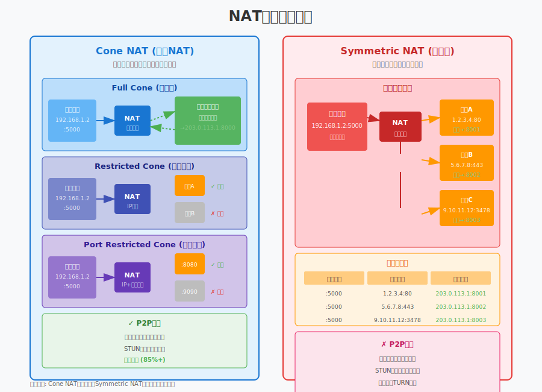

#### Full Cone（完全锥形）

**特点**：一旦内网地址被映射到公网地址，**任何外部主机**都可以通过该公网地址访问内网设备。

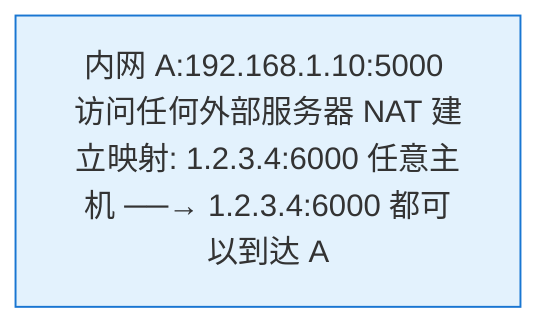

**穿透难度**：极易 ✓✓✓

#### Restricted Cone（地址限制锥形）

**特点**：只有 **A 先发过包的目标地址** 才能访问 A 的映射端口。

```
内网 A 先发包给服务器S
    ↓
NAT 建立映射: 1.2.3.4:6000 → S
    ↓
只有 S 的 IP 能访问 1.2.3.4:6000
其他主机 X 即使知道端口也无法访问
```

**穿透难度**：容易 ✓✓

#### Port Restricted Cone（端口限制锥形）

**特点**：更严格的限制，需要 **A 先发过包的特定 IP:端口** 才能访问。

```
内网 A 先发包给 S:80
    ↓
NAT 建立映射: 1.2.3.4:6000 → S:80
    ↓
只有 S:80 能访问 1.2.3.4:6000
S:443 或其他端口都无法访问
```

**穿透难度**：中等 ⚠

#### Symmetric（对称型）

**特点**：每个**不同的目标地址**都会分配**不同的公网端口**。

```
A → S:80     NAT分配: 1.2.3.4:6000
A → T:80     NAT分配: 1.2.3.4:6001  (不同端口!)

问题: B 知道 A→S 用的是 6000 端口
     但 B 无法用这个端口连接 A
     (因为 B 不是 S)
```

**穿透难度**：无法穿透 ✗

**企业级防火墙、移动网络（3G/4G/5G）** 通常使用 Symmetric NAT，此时必须使用 TURN 中继。

---

## 3. STUN 协议

### 3.1 STUN 是什么？

**Session Traversal Utilities for NAT（STUN）** 是一个简单的协议，让客户端能够发现自己的公网地址。

**核心问题**：客户端知道自己的私网地址（`192.168.1.10:5000`），但不知道 NAT 给它分配的公网地址是什么。

**STUN 解决方案**：
1. 客户端向 STUN 服务器发送请求
2. STUN 服务器从公网角度看到源地址
3. 服务器将该地址返回给客户端

### 3.2 STUN 工作流程

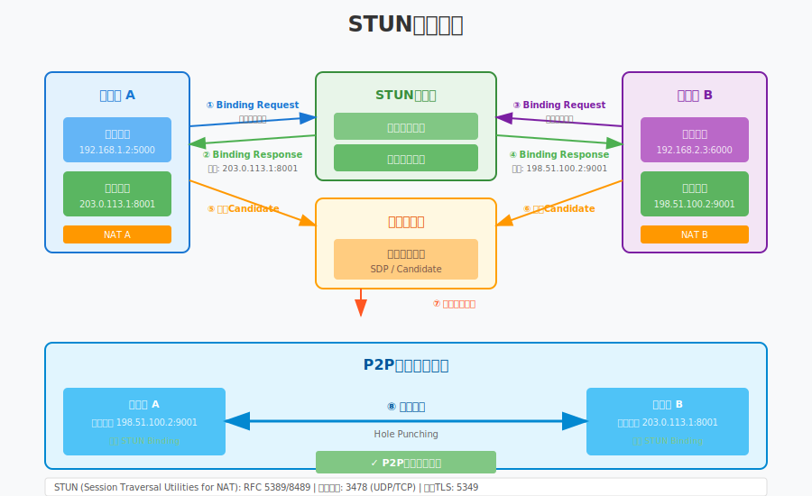

**协议细节**：

```mermaid
flowchart LR
    N0["STUN Message Header (20 bytes)"]
    N1["0               1               2               3"]
    N2["0 1 2 3 4 5 6 7 8 9 0 1 2 3 4 5 6 7 8 9 0 1 2 3 4 5 6 7 8 9"]
    N3["|  Message Type  |    Message Length (payload)"]
    N4["|    (2 bytes)   |       (2 bytes)"]
    N5["|              Magic Cookie (0x2112A442)"]
    N6["|                   (4 bytes)"]
    N7["|              Transaction ID (12 bytes)"]
    N8["|               (匹配 Request-Response)"]
    N0 --> N1
    N1 --> N2
    N2 --> N3
    N3 --> N4
    N4 --> N5
    N5 --> N6
    N6 --> N7
    N7 --> N8

    style N0 fill:#e3f2fd,stroke:#1976d2
    style N1 fill:#e8f5e9,stroke:#388e3c
    style N2 fill:#fff3e0,stroke:#f57c00
    style N3 fill:#fce4ec,stroke:#c2185b
    style N4 fill:#f3e5f5,stroke:#7b1fa2
    style N5 fill:#e3f2fd,stroke:#1976d2
    style N6 fill:#e8f5e9,stroke:#388e3c
    style N7 fill:#fff3e0,stroke:#f57c00
    style N8 fill:#fce4ec,stroke:#c2185b
```

### 3.3 Binding Request/Response

**Binding Request**（客户端发送）：
```
STUN Message Type: 0x0001 (Binding Request)
Attributes: (可选) USERNAME, MESSAGE-INTEGRITY
```

**Binding Response**（服务器返回）：
```
STUN Message Type: 0x0101 (Binding Response)
Attributes:
  - XOR-MAPPED-ADDRESS: 经过XOR混淆的公网地址
  - MAPPED-ADDRESS: (已弃用) 明文公网地址
  - SOURCE-ADDRESS: STUN服务器发送地址
```

### 3.4 XOR-MAPPED-ADDRESS

**为什么需要 XOR？**

防止中间网络设备篡改地址。某些 NAT 会检查并修改 STUN 响应中的 IP 地址，导致客户端获取错误的地址。

**XOR 算法**：
```
XOR-IP  = IP  XOR  Magic Cookie
XOR-Port = Port XOR (Magic Cookie >> 16)

Magic Cookie = 0x2112A442
```

**代码示例**：

```cpp
namespace live {

// STUN 属性类型
enum class StunAttributeType : uint16_t {
    MAPPED_ADDRESS = 0x0001,
    USERNAME = 0x0006,
    MESSAGE_INTEGRITY = 0x0008,
    ERROR_CODE = 0x0009,
    XOR_MAPPED_ADDRESS = 0x0020,
    PRIORITY = 0x0024,
    USE_CANDIDATE = 0x0025,
    FINGERPRINT = 0x8028
};

// STUN 消息类型
enum class StunMessageType : uint16_t {
    BINDING_REQUEST = 0x0001,
    BINDING_RESPONSE = 0x0101,
    BINDING_ERROR_RESPONSE = 0x0111
};

// 网络地址
struct SocketAddress {
    uint32_t ip;      // IPv4 网络字节序
    uint16_t port;    // 端口网络字节序
    
    std::string ToString() const;
};

// STUN 客户端
class StunClient {
public:
    // 发送 Binding Request 获取公网地址
    bool QueryPublicAddress(const SocketAddress& stun_server,
                           SocketAddress* public_addr);
    
    // 创建 Binding Request 消息
    std::vector<uint8_t> CreateBindingRequest();
    
    // 解析 Binding Response
    bool ParseBindingResponse(const uint8_t* data, size_t len,
                              SocketAddress* mapped_addr);
    
private:
    static constexpr uint32_t kMagicCookie = 0x2112A442;
    
    // XOR 解码地址
    SocketAddress DecodeXorMappedAddress(const uint8_t* data);
};

} // namespace live
```

---

## 4. TURN 协议

### 4.1 为什么需要 TURN？

当两端都在 **Symmetric NAT** 后面时，STUN 无法帮助建立 P2P 连接。此时需要 **中继服务器**。

**TURN（Traversal Using Relays around NAT）** 通过服务器转发所有数据，保证连接的可靠性。

### 4.2 TURN 中继原理

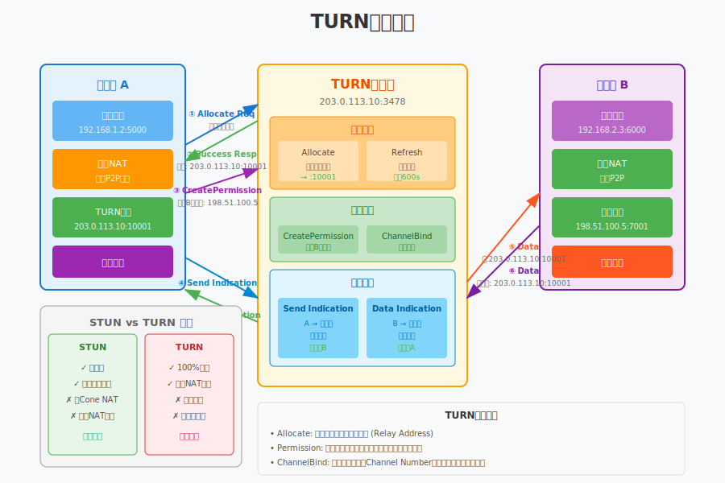

**工作流程**：

1. **Allocate 请求**：客户端向 TURN 服务器请求分配中继地址
2. **中继地址分配**：服务器分配一个公网 IP:端口作为客户端的"替身"
3. **数据转发**：所有数据通过 TURN 服务器中转

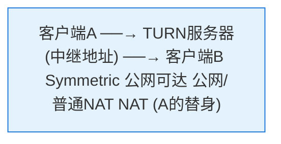

### 4.3 TURN 消息类型

| 方法 | 说明 | 方向 |
|:---|:---|:---|
| **Allocate** | 请求分配中继地址 | Client → Server |
| **Refresh** | 刷新分配（保活） | Client → Server |
| **CreatePermission** | 创建转发许可 | Client → Server |
| **ChannelBind** | 绑定通道（优化） | Client → Server |
| **Send** | 通过服务器发送数据 | Client → Server |
| **Data** | 服务器转发数据给客户端 | Server → Client |

### 4.4 Allocate 流程详解

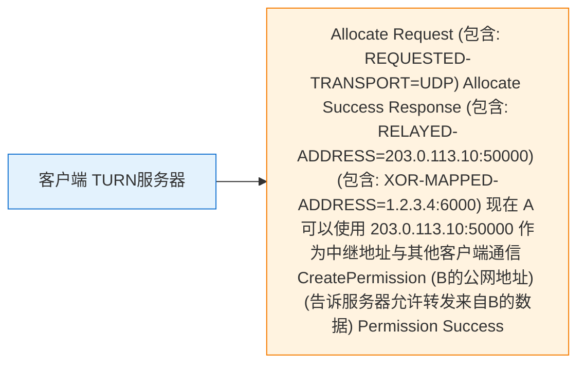

### 4.5 Refresh 与保活

TURN 分配有**有效期**（默认 10 分钟），需要定期刷新：

```cpp
namespace live {

// TURN 客户端
class TurnClient {
public:
    // 初始化并连接 TURN 服务器
    bool Initialize(const SocketAddress& turn_server,
                    const std::string& username,
                    const std::string& password);
    
    // 分配中继地址
    bool Allocate(SocketAddress* relayed_addr,
                  SocketAddress* mapped_addr);
    
    // 创建转发许可
    bool CreatePermission(const SocketAddress& peer_addr);
    
    // 通过中继发送数据
    bool SendToPeer(const SocketAddress& peer,
                    const uint8_t* data, size_t len);
    
    // 接收来自中继的数据
    bool ReceiveFromPeer(SocketAddress* peer,
                         uint8_t* buffer, size_t* len);
    
    // 定期刷新（需要在后台线程执行）
    void RefreshLoop();
    
    // 释放分配
    void Deallocate();
    
private:
    SocketAddress relayed_addr_;    // 分配的中继地址
    SocketAddress server_reflexive_; // 服务器反射地址
    int lifetime_seconds_ = 600;    // 分配有效期
    
    std::thread refresh_thread_;
    std::atomic<bool> running_{false};
};

} // namespace live
```

### 4.6 TURN 的开销

| 指标 | P2P直连 | TURN中继 | 说明 |
|:---|:---:|:---:|:---|
| **延迟** | 最低 | +20-100ms | 服务器中转增加延迟 |
| **带宽成本** | 0 | 2×流量 | 服务器双向转发 |
| **服务器压力** | 低 | 高 | 需要部署TURN集群 |
| **连接成功率** | ~85% | ~99% | TURN保证可达 |

**生产环境建议**：
- 优先尝试 P2P（成本低、延迟低）
- P2P 失败时回退到 TURN
- TURN 服务器按区域部署（降低延迟）

---

## 5. ICE 框架

### 5.1 ICE 是什么？

**Interactive Connectivity Establishment（ICE）** 是一个框架，整合了 STUN 和 TURN，自动化地完成 P2P 连接建立。

**ICE 的核心思想**：
1. 收集所有可能的连接地址（候选）
2. 对候选地址对进行连通性检测
3. 选择最佳可用路径

### 5.2 候选地址类型

| 类型 | 缩写 | 获取方式 | 优先级 |
|:---|:---:|:---|:---:|
| **Host** | H | 本地网络接口地址 | 最高 |
| **Server Reflexive** | Srflx | STUN 发现 | 中 |
| **Peer Reflexive** | Prflx | 对端检测发现 | 中 |
| **Relayed** | Relay | TURN 分配 | 最低 |

### 5.3 ICE 状态机

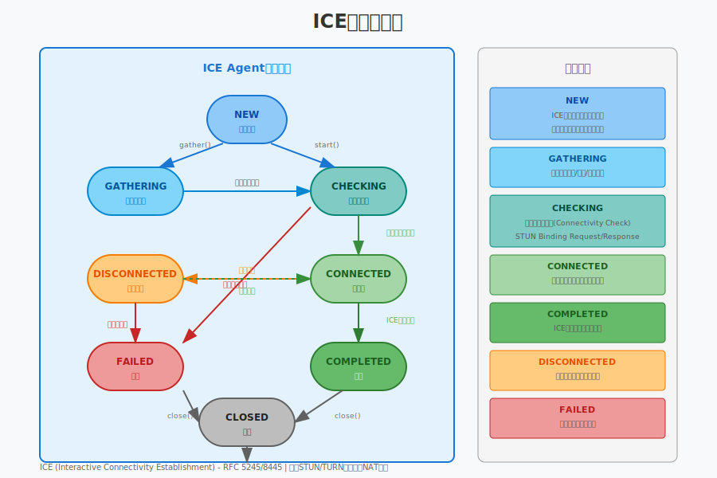

**状态说明**：
- **New**：初始状态，开始收集候选
- **Checking**：正在检测候选对连通性
- **Connected**：找到可用路径
- **Completed**：完成所有检测，选定最佳路径
- **Failed**：所有候选对都失败
- **Disconnected**：连接中断

### 5.4 候选地址优先级

ICE 使用公式计算候选地址优先级：

```
优先级 = (2^24 × type_pref) + (2^8 × local_pref) + (256 - component)

其中:
- type_pref: Host(126) > Srflx(100) > Prflx(110) > Relay(0)
- local_pref: 本地策略决定的优先级
- component: RTP=1, RTCP=2
```

**候选对优先级**（两端组合）：
```
pair_priority = 2^32 × min(G, D) + 2 × max(G, D) + (G > D ? 1 : 0)

G: 发起方的候选优先级
D: 响应方的候选优先级
```

### 5.5 连通性检测

**STUN 用于连通性检测**（不仅是发现公网地址）：

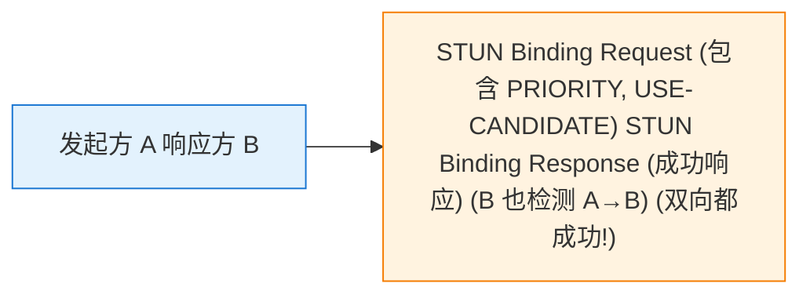

**检测成功条件**：
- A 收到 B 的响应 → A→B 路径可用
- B 收到 A 的响应 → B→A 路径可用
- **双向都成功** = 候选对可用

### 5.6 ICE 控制器与被控方

**冲突解决**：双方可能同时选择不同的候选对。

**角色分配**：
- **Controller（控制方）**：由 Offer 发起方担任
- **Controlled（被控方）**：由 Answer 方担任

**提名（Nomination）**：
- Controller 决定最终使用哪个候选对
- 在 Binding Request 中设置 `USE-CANDIDATE` 属性表示提名

```cpp
namespace live {

// ICE 候选
struct IceCandidate {
    std::string foundation;     // 标识同一网络接口
    uint32_t priority;          // 优先级
    std::string protocol;       // "udp" 或 "tcp"
    std::string type;           // "host", "srflx", "prflx", "relay"
    SocketAddress address;      // 地址
    std::string related_address; // 相关地址（Srflx/Relay用）
    uint16_t related_port;
};

// ICE Agent 角色
enum class IceRole {
    CONTROLLING,   // 控制方（Offer发起者）
    CONTROLLED     // 被控方（Answer方）
};

// ICE 状态
enum class IceState {
    NEW,           // 新建
    GATHERING,     // 收集候选中
    CHECKING,      // 检测连通性
    CONNECTED,     // 已连接
    COMPLETED,     // 完成
    FAILED,        // 失败
    DISCONNECTED   // 断开
};

// ICE Agent 接口
class IceAgent {
public:
    // 初始化
    bool Initialize(IceRole role,
                    const SocketAddress& stun_server,
                    const SocketAddress& turn_server);
    
    // 开始收集候选地址
    void StartGathering();
    
    // 添加远端候选（从信令服务器获取）
    void AddRemoteCandidate(const IceCandidate& candidate);
    
    // 开始连通性检测
    void StartChecking();
    
    // 获取当前选定地址
    bool GetSelectedPair(SocketAddress* local,
                         SocketAddress* remote);
    
    // 发送数据（通过选定的路径）
    bool Send(const uint8_t* data, size_t len);
    
    // 接收数据
    bool Receive(uint8_t* buffer, size_t* len);
    
    // 状态回调
    using StateCallback = std::function<void(IceState)>;
    void SetStateCallback(StateCallback cb);
    
    // 候选回调（用于发送到对端）
    using CandidateCallback = std::function<void(const IceCandidate&)>;
    void SetCandidateCallback(CandidateCallback cb);
    
private:
    IceRole role_;
    IceState state_ = IceState::NEW;
    
    std::vector<IceCandidate> local_candidates_;
    std::vector<IceCandidate> remote_candidates_;
    
    std::unique_ptr<StunClient> stun_client_;
    std::unique_ptr<TurnClient> turn_client_;
    
    // 选定的候选对
    IceCandidate selected_local_;
    IceCandidate selected_remote_;
};

} // namespace live
```

---

## 6. P2P 连接建立流程

### 6.1 完整流程概览

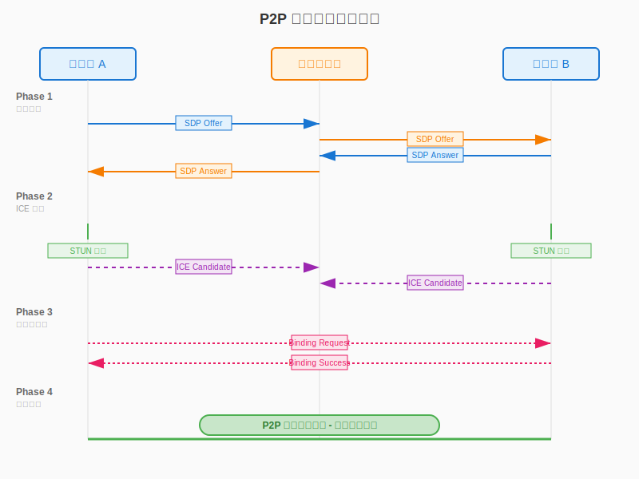

### 6.2 信令交换（Phase 1）

**SDP（Session Description Protocol）** 描述媒体能力：


**关键字段**：
- `ice-ufrag` / `ice-pwd`：ICE 认证凭据
- `fingerprint`：DTLS 证书指纹
- `candidate`：ICE 候选地址

### 6.3 ICE 协商（Phase 2）

**候选收集策略**：
1. **Host 候选**：本地所有网络接口
2. **Srflx 候选**：通过 STUN 服务器发现
3. **Relay 候选**：通过 TURN 服务器分配

**Trickle ICE**（优化）：
- 边收集边发送候选（不用等全部收集完）
- 大幅缩短连接建立时间

### 6.4 DTLS 握手（Phase 3）

在 ICE 选定路径后，通过 DTLS 协商加密密钥：

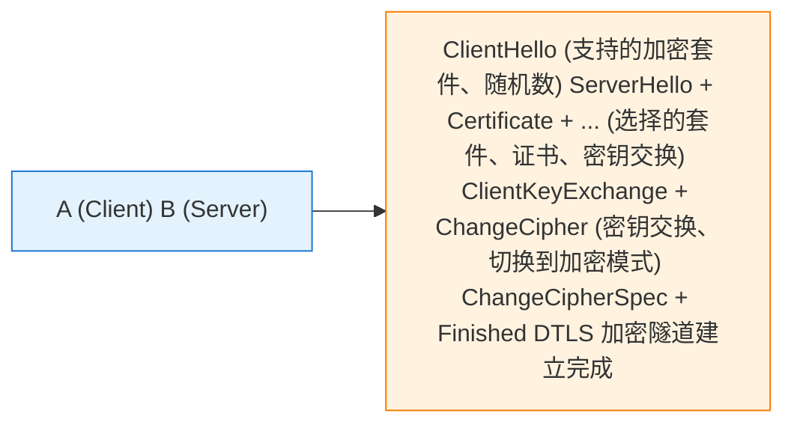

### 6.5 安全媒体传输（Phase 4）

- **SRTP**：DTLS 密钥派生，加密 RTP 媒体
- **SCTP over DTLS**：加密的数据通道

---

## 7. 本章总结

### 7.1 核心概念回顾

| 协议/概念 | 作用 | 类比 |
|:---|:---|:---|
| **NAT** | 让多设备共享公网 IP | 公寓楼的前台代收快递 |
| **STUN** | 发现自己的公网地址 | 问前台"我的快递地址是什么" |
| **TURN** | 中继转发，保证可达 | 前台帮忙转交快递 |
| **ICE** | 自动化选择最佳路径 | 智能快递路由系统 |

### 7.2 NAT 穿透策略

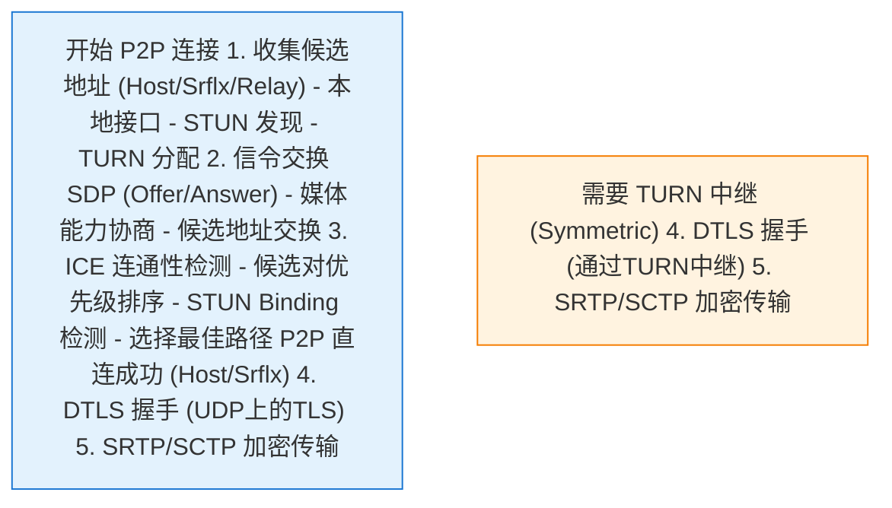

### 7.3 关键技术决策

| 场景 | 推荐方案 | 理由 |
|:---|:---|:---|
| 同一局域网 | Host 候选直连 | 延迟最低 |
| 普通家用路由器 | Srflx 穿透 | 成功率高，成本低 |
| 企业/移动网络 | TURN 中继 | 保证连通性 |
| 高安全要求 | DTLS+SRTP | 端到端加密 |

### 7.4 与下一章的关系

本章介绍了 P2P 连接的基础 —— NAT 穿透协议栈（STUN/TURN/ICE）。我们学习了如何在复杂网络环境下发现地址、建立连接，但这只是实时通信的第一步。

下一章（第20章）将深入讲解 **WebRTC 标准**，这是一个完整的实时通信解决方案，包括：
- WebRTC 的整体架构和三大引擎
- SDP 详细格式和 Offer/Answer 协商机制
- DTLS 握手协议和证书验证
- SRTP 安全传输和加密机制
- DataChannel 数据通道

WebRTC 将 ICE、DTLS、SRTP 等协议整合为一个标准化的技术栈，是工业级实时通信的首选方案。

---

**延伸阅读**：
- RFC 5389: STUN Protocol
- RFC 5766: TURN Protocol
- RFC 5245: ICE Protocol
- RFC 8445: ICE Negotiation
- WebRTC 规范: W3C WebRTC API
