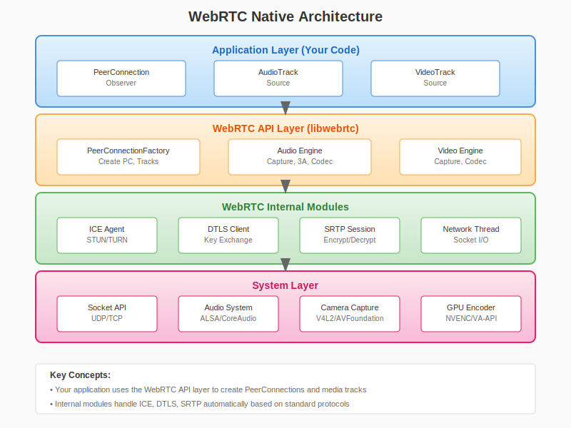
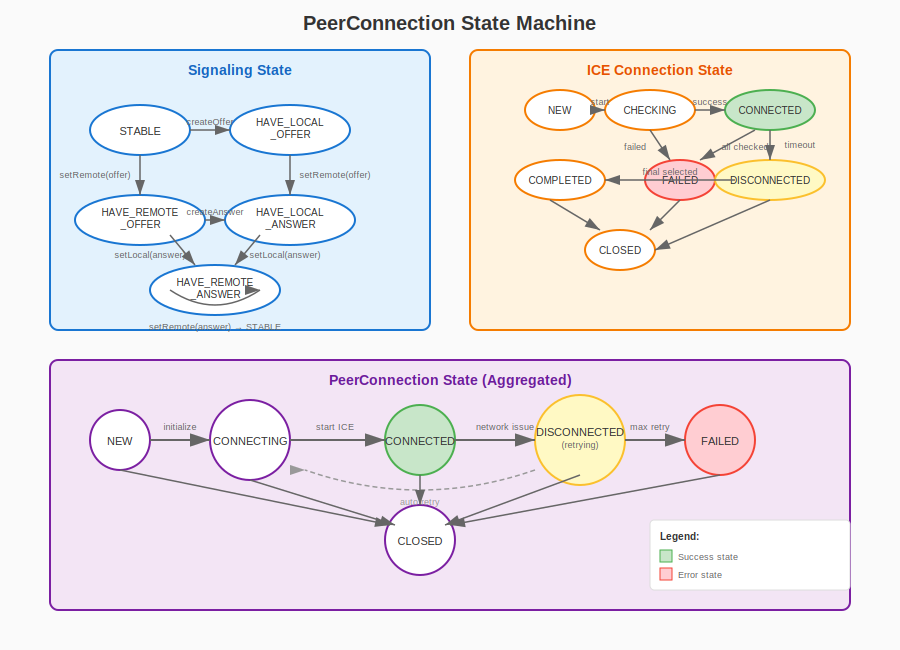
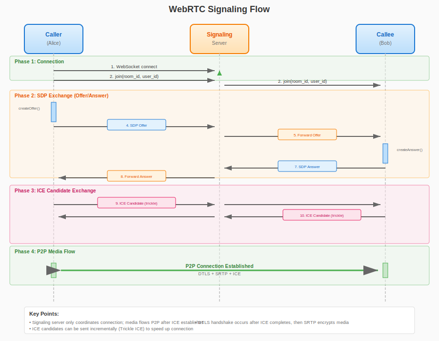

# 第二十章：WebRTC Native 开发

> **本章目标**：掌握 WebRTC Native 开发，使用 C++ 实现完整的实时通信客户端。

在上一章（第十九章）中，我们深入理解了 WebRTC 的协议栈，包括 SDP、DTLS、SRTP 和 DataChannel。理论知识为实践奠定了基础，但真正的工程师需要在代码中落地这些概念。

本章将带领你进入 **WebRTC Native 开发** 的世界。与浏览器中简单的 JavaScript API 不同，Native 开发让你能够：
- **深度定制**：修改编解码器参数、优化传输策略
- **跨平台部署**：从嵌入式设备到服务器端应用
- **性能优化**：充分利用硬件加速和系统资源
- **集成现有系统**：与 C/C++ 遗留代码无缝对接

**学习本章后，你将能够**：
- 获取和编译 WebRTC 源码
- 使用 PeerConnection API 建立连接
- 管理音视频轨道和设备
- 实现 WebSocket 信令交互
- 构建完整的 1v1 连麦客户端

---

## 目录

1. [WebRTC Native 简介](#1-webrtc-native-简介)
2. [编译 WebRTC](#2-编译-webrtc)
3. [PeerConnection API](#3-peerconnection-api)
4. [音视频轨道管理](#4-音视频轨道管理)
5. [信令集成](#5-信令集成)
6. [完整连麦客户端实现](#6-完整连麦客户端实现)
7. [本章总结](#7-本章总结)

---

## 1. WebRTC Native 简介

### 1.1 Native 与浏览器版的区别

WebRTC 最初是为浏览器设计的，但其核心库是用 C++ 编写的。Google 将这部分代码开源为 **WebRTC Native API**，让开发者能够在浏览器之外使用 WebRTC。

| 特性 | 浏览器版 (JavaScript) | Native 版 (C++) |
|:---|:---|:---|
| **API 复杂度** | 简单，高度封装 | 复杂，需要手动管理 |
| **灵活性** | 受限（浏览器决定） | 高（完全可控） |
| **性能** | 受浏览器沙箱限制 | 可直接优化系统资源 |
| **部署环境** | 仅限浏览器 | 任何支持 C++ 的平台 |
| **调试能力** | 受限 | 完整调试和性能分析 |
| **包大小** | 浏览器自带 | 需静态链接（~20MB） |

### 1.2 适用场景

**优先选择 Native WebRTC 的场景**：

1. **嵌入式设备**：IP 摄像头、可视门铃、智能眼镜
2. **服务器端**：SFU 转发服务器、录制服务、AI 处理节点
3. **桌面应用**：游戏语音、远程桌面、视频会议客户端
4. **性能敏感**：需要极致优化的实时通信场景

**优先选择浏览器版的场景**：

1. **快速原型**：无需编译，即写即测
2. **Web 应用**：无需用户安装，即点即用
3. **跨平台**：一次开发，多浏览器运行

### 1.3 Native 架构概览



**WebRTC Native 的核心组件**：

```
┌─────────────────────────────────────────────────────────────┐
│                    应用层 (你的代码)                         │
│  ┌──────────────┐  ┌──────────────┐  ┌──────────────┐       │
│  │ PeerConnection│  │   AudioTrack │  │   VideoTrack │       │
│  │   Observer   │  │   Source     │  │   Source     │       │
│  └──────────────┘  └──────────────┘  └──────────────┘       │
├─────────────────────────────────────────────────────────────┤
│                  WebRTC API 层 (libwebrtc)                  │
│  ┌──────────────┐  ┌──────────────┐  ┌──────────────┐       │
│  │  PeerConnection│  │  Audio Engine │  │ Video Engine │       │
│  │  Factory     │  │              │  │              │       │
│  └──────────────┘  └──────────────┘  └──────────────┘       │
├─────────────────────────────────────────────────────────────┤
│                  WebRTC 内部模块                             │
│  ┌──────────┐ ┌──────────┐ ┌──────────┐ ┌──────────────┐   │
│  │   ICE    │ │  DTLS    │ │  SRTP    │ │   Network    │   │
│  │  Agent   │ │  Client  │ │  Session │ │   Thread     │   │
│  └──────────┘ └──────────┘ └──────────┘ └──────────────┘   │
├─────────────────────────────────────────────────────────────┤
│                    系统层                                    │
│  ┌──────────┐ ┌──────────┐ ┌──────────┐ ┌──────────────┐   │
│  │  Socket  │ │  ALSA/   │ │  Camera  │ │   GPU        │   │
│  │  API     │ │  CoreAudio│ │  Capture │ │   Encoder    │   │
│  └──────────┘ └──────────┘ └──────────┘ └──────────────┘   │
└─────────────────────────────────────────────────────────────┘
```

### 1.4 开发环境准备

**系统要求**：
- Linux: Ubuntu 18.04+ / Debian 9+ / CentOS 7+
- macOS: 10.14+ (Mojave)
- Windows: Windows 10 + Visual Studio 2019+

**依赖工具**：
- Python 3.8+（depot_tools 要求）
- Git
- CMake 3.16+（构建示例项目）

---

## 2. 编译 WebRTC

### 2.1 获取源码

WebRTC 使用 Chromium 的 `depot_tools` 进行代码管理：

```bash
# 1. 安装 depot_tools
git clone https://chromium.googlesource.com/chromium/tools/depot_tools.git
export PATH="$PWD/depot_tools:$PATH"

# 2. 创建工作目录
mkdir webrtc-checkout
cd webrtc-checkout

# 3. 获取代码（约 10GB，需要稳定网络）
fetch --nohooks webrtc
cd src

# 4. 同步依赖
gclient sync
```

**国内镜像加速**：
由于网络原因，国内开发者可以使用镜像：
```bash
# 使用清华大学镜像
export DEPOT_TOOLS_UPDATE=0
export GYP_GENERATORS=ninja
```

### 2.2 GN 构建系统

WebRTC 使用 **GN**（Generate Ninja）作为元构建系统，生成 **Ninja** 构建文件。

**GN 基础概念**：
- `.gn` 文件：定义构建根和默认参数
- `BUILD.gn` 文件：定义构建目标
- `args.gn` 文件：存储构建参数

**常用构建参数**：

| 参数 | 说明 | 常用值 |
|:---|:---|:---|
| `target_os` | 目标操作系统 | `"linux"`, `"mac"`, `"win"` |
| `target_cpu` | 目标架构 | `"x64"`, `"arm64"`, `"arm"` |
| `is_debug` | 调试构建 | `true` / `false` |
| `is_component_build` | 动态库构建 | `true` / `false` |
| `rtc_use_h264` | 启用 H.264 | `true` / `false` |
| `rtc_include_tests` | 包含测试 | `true` / `false` |

### 2.3 编译步骤

```bash
# 1. 生成构建配置
gn gen out/Default --args='
    target_os="linux"
    target_cpu="x64"
    is_debug=false
    is_component_build=false
    rtc_use_h264=true
    rtc_include_tests=false
'

# 2. 开始编译（约需 30-60 分钟）
ninja -C out/Default

# 3. 验证编译结果
ls out/Default/libwebrtc.a  # 静态库
ls out/Default/peerconnection_client  # 示例程序
```

### 2.4 提取所需模块

完整的 WebRTC 库很大（~20MB），实际项目中可能只需要部分功能。

**最小化提取**：
```bash
# 创建提取脚本
mkdir -p webrtc-minimal/include
mkdir -p webrtc-minimal/lib

# 复制头文件（关键模块）
rsync -av --include='*/' --include='*.h' --exclude='*' \
    api/ webrtc-minimal/include/api/
rsync -av --include='*/' --include='*.h' --exclude='*' \
    pc/ webrtc-minimal/include/pc/
rsync -av --include='*/' --include='*.h' --exclude='*' \
    media/ webrtc-minimal/include/media/

# 复制库文件
cp out/Default/libwebrtc.a webrtc-minimal/lib/
```

---

## 3. PeerConnection API

### 3.1 核心概念

**PeerConnection** 是 WebRTC Native 的核心类，代表与对端的连接。

**主要组件**：
- **PeerConnectionFactory**：创建 PeerConnection 的工厂
- **PeerConnectionInterface**：连接接口
- **Observer**：异步事件回调

### 3.2 PeerConnection 状态机



```cpp
namespace live {

// 信令状态
enum class SignalingState {
    STABLE,              // 稳定状态
    HAVE_LOCAL_OFFER,    // 已创建本地 Offer
    HAVE_REMOTE_OFFER,   // 收到远端 Offer
    HAVE_LOCAL_ANSWER,   // 已创建本地 Answer
    HAVE_REMOTE_ANSWER   // 收到远端 Answer
};

// ICE 连接状态
enum class IceConnectionState {
    NEW,           // 初始状态
    CHECKING,      // 检测连通性
    CONNECTED,     // 已连接
    COMPLETED,     // ICE 完成
    FAILED,        // 连接失败
    DISCONNECTED,  // 连接断开
    CLOSED         // 连接关闭
};

// 连接状态
enum class PeerConnectionState {
    NEW,
    CONNECTING,
    CONNECTED,
    DISCONNECTED,
    FAILED,
    CLOSED
};

} // namespace live
```

### 3.3 初始化与创建

```cpp
namespace live {

// PeerConnection 观察者接口
class PeerConnectionObserver {
public:
    virtual ~PeerConnectionObserver() = default;
    
    // ICE 候选收集完成回调
    virtual void OnIceCandidate(const std::string& sdp_mid,
                                int sdp_mline_index,
                                const std::string& candidate) = 0;
    
    // 连接状态变化回调
    virtual void OnIceConnectionStateChange(IceConnectionState state) = 0;
    
    // 数据通道创建回调
    virtual void OnDataChannel(std::shared_ptr<DataChannel> channel) = 0;
    
    // 远端轨道添加回调
    virtual void OnTrack(std::shared_ptr<RtpTransceiver> transceiver) = 0;
    
    // 重协商需要回调
    virtual void OnRenegotiationNeeded() = 0;
};

// PeerConnection 封装类
class PeerConnectionClient {
public:
    PeerConnectionClient();
    ~PeerConnectionClient();
    
    // 初始化（必须在任何其他操作之前调用）
    bool Initialize();
    
    // 创建 PeerConnection
    bool CreatePeerConnection(const IceServers& ice_servers,
                              PeerConnectionObserver* observer);
    
    // 创建 Offer
    void CreateOffer(std::function<void(const std::string& sdp,
                                        const std::string& type)> callback);
    
    // 创建 Answer
    void CreateAnswer(std::function<void(const std::string& sdp,
                                         const std::string& type)> callback);
    
    // 设置本地描述
    void SetLocalDescription(const std::string& sdp,
                             const std::string& type,
                             std::function<void(bool)> callback);
    
    // 设置远端描述
    void SetRemoteDescription(const std::string& sdp,
                              const std::string& type,
                              std::function<void(bool)> callback);
    
    // 添加 ICE 候选
    void AddIceCandidate(const std::string& sdp_mid,
                         int sdp_mline_index,
                         const std::string& candidate);
    
    // 添加媒体轨道
    void AddTrack(std::shared_ptr<MediaStreamTrack> track,
                  const std::vector<std::string>& stream_ids);
    
    // 关闭连接
    void Close();
    
private:
    class Impl;
    std::unique_ptr<Impl> impl_;
};

} // namespace live
```

### 3.4 ICE 服务器配置

```cpp
namespace live {

// ICE 服务器配置
struct IceServer {
    std::string uri;              // STUN/TURN 服务器地址
    std::string username;         // TURN 用户名
    std::string password;         // TURN 密码
};

using IceServers = std::vector<IceServer>;

// 创建默认 ICE 配置
inline IceServers CreateDefaultIceServers() {
    return {
        // Google 公共 STUN 服务器
        {"stun:stun.l.google.com:19302", "", ""},
        {"stun:stun1.l.google.com:19302", "", ""},
        
        // 自定义 TURN 服务器（生产环境必须部署）
        // {"turn:your-turn-server.com:3478", "user", "pass"}
    };
}

} // namespace live
```

### 3.5 CreateOffer/Answer 流程

```cpp
namespace live {

// SDP 描述封装
struct SessionDescription {
    std::string type;    // "offer" 或 "answer"
    std::string sdp;     // SDP 文本
    
    bool IsValid() const {
        return !type.empty() && !sdp.empty();
    }
};

// Offer/Answer 协商流程
class SdpNegotiator {
public:
    // 创建 Offer（发起方调用）
    void CreateOffer(PeerConnectionClient* pc,
                     std::function<void(const SessionDescription&)> callback) {
        pc->CreateOffer([callback](const std::string& sdp,
                                   const std::string& type) {
            callback(SessionDescription{type, sdp});
        });
    }
    
    // 创建 Answer（接收方调用）
    void CreateAnswer(PeerConnectionClient* pc,
                      const SessionDescription& remote_offer,
                      std::function<void(const SessionDescription&)> callback) {
        // 1. 先设置远端 Offer
        pc->SetRemoteDescription(remote_offer.sdp, remote_offer.type,
            [pc, callback](bool success) {
                if (!success) {
                    callback(SessionDescription{});
                    return;
                }
                // 2. 创建 Answer
                pc->CreateAnswer([callback](const std::string& sdp,
                                            const std::string& type) {
                    callback(SessionDescription{type, sdp});
                });
            });
    }
    
    // 完成协商（双方都调用）
    void CompleteNegotiation(PeerConnectionClient* pc,
                             const SessionDescription& remote_desc,
                             std::function<void(bool)> callback) {
        pc->SetRemoteDescription(remote_desc.sdp, remote_desc.type, callback);
    }
};

} // namespace live
```

---

## 4. 音视频轨道管理

### 4.1 MediaStream 与 Track

**核心概念**：
- **MediaStream**：媒体流的容器，包含多个 Track
- **AudioTrack**：音频轨道
- **VideoTrack**：视频轨道
- **TrackSource**：轨道数据源（采集设备或自定义数据）

### 4.2 音频轨道管理

```cpp
namespace live {

// 音频设备管理
class AudioDeviceManager {
public:
    // 获取可用设备列表
    std::vector<AudioDevice> GetRecordingDevices();
    std::vector<AudioDevice> GetPlayoutDevices();
    
    // 选择设备
    bool SetRecordingDevice(int index);
    bool SetPlayoutDevice(int index);
    
    // 创建音频轨道
    std::shared_ptr<AudioTrack> CreateAudioTrack(
        const std::string& track_id,
        std::shared_ptr<PeerConnectionFactory> factory);
};

// 音频轨道配置
struct AudioTrackConfig {
    int sample_rate_hz = 48000;      // 采样率
    int channels = 2;                 // 声道数
    bool echo_cancellation = true;    // 回声消除
    bool noise_suppression = true;    // 噪声抑制
    bool auto_gain_control = true;    // 自动增益
};

// 音频轨道封装
class AudioTrackWrapper {
public:
    AudioTrackWrapper(const std::string& track_id,
                      std::shared_ptr<PeerConnectionFactory> factory);
    
    // 初始化
    bool Initialize(const AudioTrackConfig& config);
    
    // 获取底层轨道
    std::shared_ptr<AudioTrack> GetTrack() const { return track_; }
    
    // 静音控制
    void SetMuted(bool muted);
    bool IsMuted() const;
    
    // 音量控制 (0.0 - 1.0)
    void SetVolume(double volume);
    double GetVolume() const;
    
private:
    std::string track_id_;
    std::shared_ptr<AudioTrack> track_;
    std::shared_ptr<AudioSource> source_;
};

} // namespace live
```

### 4.3 视频轨道管理

```cpp
namespace live {

// 视频捕获设备
struct VideoCaptureDevice {
    std::string device_id;
    std::string friendly_name;
    std::vector<VideoFormat> supported_formats;
};

// 视频格式
struct VideoFormat {
    int width;
    int height;
    int fps;
    VideoCodecType codec;  // I420, NV12, etc.
};

// 视频轨道配置
struct VideoTrackConfig {
    int width = 1280;
    int height = 720;
    int fps = 30;
    VideoCodecType capture_format = VideoCodecType::kI420;
};

// 视频轨道封装
class VideoTrackWrapper {
public:
    VideoTrackWrapper(const std::string& track_id,
                      std::shared_ptr<PeerConnectionFactory> factory);
    
    // 初始化摄像头
    bool InitializeCamera(const std::string& device_id,
                          const VideoTrackConfig& config);
    
    // 初始化屏幕捕获
    bool InitializeScreenCapture(int screen_index,
                                 const VideoTrackConfig& config);
    
    // 使用自定义视频源
    bool InitializeCustomSource(std::shared_ptr<VideoSource> source);
    
    // 获取底层轨道
    std::shared_ptr<VideoTrack> GetTrack() const { return track_; }
    
    // 启用/禁用
    void SetEnabled(bool enabled);
    
    // 添加渲染器
    void AddRenderer(std::shared_ptr<VideoRenderer> renderer);
    void RemoveRenderer(std::shared_ptr<VideoRenderer> renderer);
    
private:
    std::string track_id_;
    std::shared_ptr<VideoTrack> track_;
    std::shared_ptr<VideoSource> source_;
    std::shared_ptr<VideoCapturer> capturer_;
};

} // namespace live
```

### 4.4 自定义视频源

```cpp
namespace live {

// 自定义视频源（用于推送编码后的数据）
class CustomVideoSource : public VideoSource {
public:
    CustomVideoSource(int width, int height, int fps);
    
    // 推送帧数据
    void PushFrame(const uint8_t* data, size_t len,
                   int64_t timestamp_us);
    
    // 推送 I420 格式的帧
    void PushI420Frame(const uint8_t* y_plane, int y_stride,
                       const uint8_t* u_plane, int u_stride,
                       const uint8_t* v_plane, int v_stride,
                       int width, int height,
                       int64_t timestamp_us);
    
    // 推送 NV12 格式的帧
    void PushNV12Frame(const uint8_t* y_plane, int y_stride,
                       const uint8_t* uv_plane, int uv_stride,
                       int width, int height,
                       int64_t timestamp_us);
    
private:
    int width_;
    int height_;
    int fps_;
    std::atomic<int64_t> last_timestamp_{0};
};

} // namespace live
```

### 4.5 远端轨道接收

```cpp
namespace live {

// 远端音频轨道处理
class RemoteAudioTrackHandler {
public:
    void OnRemoteAudioTrack(std::shared_ptr<AudioTrack> track) {
        track_ = track;
        
        // 添加音频接收回调
        track->AddSink(this);
    }
    
    // 音频数据回调
    void OnData(const void* audio_data,
                int bits_per_sample,
                int sample_rate,
                size_t number_of_channels,
                size_t number_of_frames) {
        // 处理接收到的音频数据
        // 例如：播放、录制、分析
        ProcessAudio(audio_data, bits_per_sample, sample_rate,
                     number_of_channels, number_of_frames);
    }
    
private:
    std::shared_ptr<AudioTrack> track_;
    
    void ProcessAudio(const void* data, int bits_per_sample,
                      int sample_rate, size_t channels, size_t frames);
};

// 远端视频轨道处理
class RemoteVideoTrackHandler {
public:
    void OnRemoteVideoTrack(std::shared_ptr<VideoTrack> track) {
        track_ = track;
        
        // 添加视频渲染器
        renderer_ = std::make_shared<CustomVideoRenderer>();
        track->AddOrUpdateSink(renderer_.get(), rtc::VideoSinkWants());
    }
    
private:
    std::shared_ptr<VideoTrack> track_;
    std::shared_ptr<CustomVideoRenderer> renderer_;
};

} // namespace live
```

---

## 5. 信令集成

### 5.1 信令流程概览



**信令的核心作用**：
1. 交换 SDP（Offer/Answer）
2. 交换 ICE 候选
3. 传递控制消息（静音、挂断等）

### 5.2 WebSocket 信令客户端

```cpp
namespace live {

// WebSocket 信令客户端
class WebSocketSignalingClient : public PeerConnectionObserver {
public:
    WebSocketSignalingClient();
    ~WebSocketSignalingClient();
    
    // 连接到信令服务器
    bool Connect(const std::string& url);
    void Disconnect();
    
    // 加入房间
    void JoinRoom(const std::string& room_id, const std::string& user_id);
    
    // 离开房间
    void LeaveRoom();
    
    // 发送 SDP
    void SendSdp(const std::string& type, const std::string& sdp);
    
    // 发送 ICE 候选
    void SendIceCandidate(const std::string& sdp_mid,
                          int sdp_mline_index,
                          const std::string& candidate);
    
    // 设置事件回调
    using SdpCallback = std::function<void(const std::string& type,
                                           const std::string& sdp)>;
    using IceCallback = std::function<void(const std::string& sdp_mid,
                                           int sdp_mline_index,
                                           const std::string& candidate)>;
    using PeerCallback = std::function<void(const std::string& peer_id,
                                            bool joined)>;
    
    void SetSdpCallback(SdpCallback cb) { sdp_callback_ = cb; }
    void SetIceCallback(IceCallback cb) { ice_callback_ = cb; }
    void SetPeerCallback(PeerCallback cb) { peer_callback_ = cb; }

private:
    // WebSocket 回调
    void OnWebSocketMessage(const std::string& message);
    void OnWebSocketConnected();
    void OnWebSocketDisconnected();
    
    // 信令消息处理
    void HandleSignalingMessage(const json& msg);
    void HandleSdpMessage(const json& msg);
    void HandleIceMessage(const json& msg);
    void HandlePeerEvent(const json& msg);
    
    std::unique_ptr<WebSocketClient> ws_client_;
    std::string room_id_;
    std::string user_id_;
    
    SdpCallback sdp_callback_;
    IceCallback ice_callback_;
    PeerCallback peer_callback_;
};

} // namespace live
```

### 5.3 信令消息格式

```cpp
namespace live {

// 信令消息类型
enum class SignalingMessageType {
    JOIN,           // 加入房间
    LEAVE,          // 离开房间
    OFFER,          // SDP Offer
    ANSWER,         // SDP Answer
    ICE_CANDIDATE,  // ICE 候选
    PEER_JOINED,    // 对端加入
    PEER_LEFT,      // 对端离开
    ERROR           // 错误
};

// 消息结构定义
/*
// 加入房间
{
    "type": "join",
    "room_id": "room-123",
    "user_id": "user-abc"
}

// SDP 交换
{
    "type": "offer",  // 或 "answer"
    "sdp": "v=0\r\no=- 123...",
    "from": "user-abc",
    "to": "user-xyz"
}

// ICE 候选
{
    "type": "ice_candidate",
    "sdp_mid": "audio",
    "sdp_mline_index": 0,
    "candidate": "candidate:1 1 UDP 2122252543 192.168.1.10 5000 typ host",
    "from": "user-abc",
    "to": "user-xyz"
}

// 对端事件
{
    "type": "peer_joined",
    "peer_id": "user-xyz"
}
*/

// 消息序列化/反序列化
class SignalingMessageParser {
public:
    static std::string SerializeJoin(const std::string& room_id,
                                      const std::string& user_id);
    
    static std::string SerializeSdp(const std::string& type,
                                     const std::string& sdp,
                                     const std::string& to);
    
    static std::string SerializeIceCandidate(const std::string& sdp_mid,
                                              int sdp_mline_index,
                                              const std::string& candidate,
                                              const std::string& to);
    
    static bool ParseMessage(const std::string& json_str,
                             SignalingMessageType* type,
                             json* payload);
};

} // namespace live
```

### 5.4 SDP 交换流程实现

```cpp
namespace live {

// 完整的信令协调器
class SignalingCoordinator : public PeerConnectionObserver {
public:
    SignalingCoordinator(std::shared_ptr<WebSocketSignalingClient> signaling,
                         std::shared_ptr<PeerConnectionClient> pc)
        : signaling_(signaling), pc_(pc) {
        
        // 注册信令回调
        signaling_->SetSdpCallback(
            [this](const std::string& type, const std::string& sdp) {
                OnRemoteSdp(type, sdp);
            });
        
        signaling_->SetIceCallback(
            [this](const std::string& sdp_mid, int index,
                   const std::string& candidate) {
                pc_->AddIceCandidate(sdp_mid, index, candidate);
            });
    }
    
    // 发起通话
    void StartCall() {
        // 1. 添加本地轨道
        AddLocalTracks();
        
        // 2. 创建 Offer
        pc_->CreateOffer([this](const std::string& sdp,
                                const std::string& type) {
            // 3. 设置本地描述
            pc_->SetLocalDescription(sdp, type, [this, sdp](bool success) {
                if (success) {
                    // 4. 发送 Offer
                    signaling_->SendSdp("offer", sdp);
                }
            });
        });
    }
    
    // 收到远端 SDP
    void OnRemoteSdp(const std::string& type, const std::string& sdp) {
        if (type == "offer") {
            // 作为 Answer 方
            HandleRemoteOffer(sdp);
        } else if (type == "answer") {
            // 作为 Offer 方，收到 Answer
            pc_->SetRemoteDescription(sdp, "answer",
                [](bool success) {
                    LOG_INFO("Answer set: {}", success);
                });
        }
    }
    
    // PeerConnectionObserver 回调
    void OnIceCandidate(const std::string& sdp_mid,
                        int sdp_mline_index,
                        const std::string& candidate) override {
        // 发送 ICE 候选到对端
        signaling_->SendIceCandidate(sdp_mid, sdp_mline_index, candidate);
    }
    
    void OnIceConnectionStateChange(IceConnectionState state) override {
        LOG_INFO("ICE state: {}", static_cast<int>(state));
        
        switch (state) {
            case IceConnectionState::CONNECTED:
            case IceConnectionState::COMPLETED:
                LOG_INFO("Connected!");
                break;
            case IceConnectionState::FAILED:
                LOG_ERROR("Connection failed");
                break;
            default:
                break;
        }
    }
    
private:
    void AddLocalTracks() {
        // 添加音频轨道
        auto audio_track = audio_device_->CreateAudioTrack("audio", factory_);
        pc_->AddTrack(audio_track, {"stream-1"});
        
        // 添加视频轨道
        auto video_track = video_device_->CreateVideoTrack("video", factory_);
        pc_->AddTrack(video_track, {"stream-1"});
    }
    
    void HandleRemoteOffer(const std::string& sdp) {
        // 1. 设置远端 Offer
        pc_->SetRemoteDescription(sdp, "offer", [this](bool success) {
            if (!success) {
                LOG_ERROR("Failed to set remote offer");
                return;
            }
            
            // 2. 添加本地轨道
            AddLocalTracks();
            
            // 3. 创建 Answer
            pc_->CreateAnswer([this](const std::string& sdp,
                                     const std::string& type) {
                // 4. 设置本地 Answer
                pc_->SetLocalDescription(sdp, type, [this, sdp](bool success) {
                    if (success) {
                        // 5. 发送 Answer
                        signaling_->SendSdp("answer", sdp);
                    }
                });
            });
        });
    }
    
    std::shared_ptr<WebSocketSignalingClient> signaling_;
    std::shared_ptr<PeerConnectionClient> pc_;
    std::shared_ptr<AudioDeviceManager> audio_device_;
    std::shared_ptr<VideoDeviceManager> video_device_;
    std::shared_ptr<PeerConnectionFactory> factory_;
};

} // namespace live
```

---

## 6. 完整连麦客户端实现

### 6.1 项目结构

```
webrtc-call-client/
├── CMakeLists.txt
├── src/
│   ├── main.cpp
│   ├── peer_connection_client.{h,cpp}
│   ├── websocket_signaling.{h,cpp}
│   ├── audio_device.{h,cpp}
│   ├── video_device.{h,cpp}
│   └── signaling_coordinator.{h,cpp}
└── include/
    └── live/
        └── webrtc/
```

### 6.2 CMakeLists.txt

```cmake
cmake_minimum_required(VERSION 3.16)
project(webrtc_call_client VERSION 1.0.0 LANGUAGES CXX)

set(CMAKE_CXX_STANDARD 14)
set(CMAKE_CXX_STANDARD_REQUIRED ON)

# 查找 WebRTC
find_package(WebRTC REQUIRED)

# 查找其他依赖
find_package(Threads REQUIRED)
find_package(OpenSSL REQUIRED)

# 可执行文件
add_executable(webrtc_call_client
    src/main.cpp
    src/peer_connection_client.cpp
    src/websocket_signaling.cpp
    src/audio_device.cpp
    src/video_device.cpp
    src/signaling_coordinator.cpp
)

target_include_directories(webrtc_call_client PRIVATE
    ${CMAKE_SOURCE_DIR}/include
    ${WEBRTC_INCLUDE_DIRS}
)

target_link_libraries(webrtc_call_client PRIVATE
    ${WEBRTC_LIBRARIES}
    Threads::Threads
    OpenSSL::SSL
    OpenSSL::Crypto
)

# 编译选项
target_compile_options(webrtc_call_client PRIVATE
    -Wall
    -Wextra
    -O2
)
```

### 6.3 主程序

```cpp
// src/main.cpp
#include <iostream>
#include <string>
#include <memory>
#include <signal.h>

#include "live/webrtc/peer_connection_client.h"
#include "live/webrtc/websocket_signaling.h"
#include "live/webrtc/signaling_coordinator.h"

using namespace live;

static std::atomic<bool> g_running{true};

void SignalHandler(int sig) {
    g_running = false;
}

void PrintUsage(const char* program) {
    std::cout << "Usage: " << program << " [options]\n"
              << "Options:\n"
              << "  --server <url>    Signaling server URL (ws://host:port)\n"
              << "  --room <id>       Room ID to join\n"
              << "  --user <id>       User ID\n"
              << "  --help            Show this help\n";
}

int main(int argc, char* argv[]) {
    // 解析命令行参数
    std::string server_url = "ws://localhost:8080";
    std::string room_id = "test-room";
    std::string user_id = "user-" + std::to_string(getpid());
    
    for (int i = 1; i < argc; ++i) {
        std::string arg = argv[i];
        if (arg == "--server" && i + 1 < argc) {
            server_url = argv[++i];
        } else if (arg == "--room" && i + 1 < argc) {
            room_id = argv[++i];
        } else if (arg == "--user" && i + 1 < argc) {
            user_id = argv[++i];
        } else if (arg == "--help") {
            PrintUsage(argv[0]);
            return 0;
        }
    }
    
    // 设置信号处理
    signal(SIGINT, SignalHandler);
    signal(SIGTERM, SignalHandler);
    
    std::cout << "WebRTC Call Client\n"
              << "Server: " << server_url << "\n"
              << "Room: " << room_id << "\n"
              << "User: " << user_id << "\n\n";
    
    // 初始化 PeerConnection
    auto pc_client = std::make_shared<PeerConnectionClient>();
    if (!pc_client->Initialize()) {
        std::cerr << "Failed to initialize PeerConnection\n";
        return 1;
    }
    
    // 配置 ICE 服务器
    auto ice_servers = CreateDefaultIceServers();
    if (!pc_client->CreatePeerConnection(ice_servers, nullptr)) {
        std::cerr << "Failed to create PeerConnection\n";
        return 1;
    }
    
    // 连接信令服务器
    auto signaling = std::make_shared<WebSocketSignalingClient>();
    if (!signaling->Connect(server_url)) {
        std::cerr << "Failed to connect to signaling server\n";
        return 1;
    }
    
    // 创建信令协调器
    auto coordinator = std::make_shared<SignalingCoordinator>(
        signaling, pc_client);
    
    // 加入房间
    signaling->JoinRoom(room_id, user_id);
    
    // 主循环
    std::cout << "Press Ctrl+C to exit\n";
    while (g_running) {
        std::this_thread::sleep_for(std::chrono::milliseconds(100));
    }
    
    // 清理
    signaling->LeaveRoom();
    signaling->Disconnect();
    pc_client->Close();
    
    std::cout << "\nBye!\n";
    return 0;
}
```

---

## 7. 本章总结

### 7.1 核心知识点回顾

| 概念 | 作用 | 关键 API |
|:---|:---|:---|
| **PeerConnectionFactory** | 创建所有 WebRTC 对象 | `CreatePeerConnectionFactory()` |
| **PeerConnection** | 管理连接生命周期 | `CreateOffer()`, `SetLocalDescription()` |
| **MediaStreamTrack** | 音视频数据传输 | `AddTrack()`, `OnTrack()` |
| **SDP** | 媒体协商 | `CreateOffer()`, `CreateAnswer()` |
| **ICE** | 连接建立 | `OnIceCandidate()`, `AddIceCandidate()` |
| **信令** | 协调连接建立 | WebSocket 交换 SDP/ICE |

### 7.2 WebRTC Native 开发流程

```
1. 获取源码 → 2. 编译 → 3. 初始化 Factory → 4. 创建 PC → 5. 添加轨道
                              ↓
6. 信令连接 → 7. 交换 SDP → 8. ICE 协商 → 9. DTLS 握手 → 10. 媒体传输
```

### 7.3 常见问题与解决

| 问题 | 原因 | 解决方案 |
|:---|:---|:---|
| 编译失败 | 依赖缺失 | 检查 depot_tools，使用 `gclient sync` |
| 连接失败 | ICE 不通 | 部署 TURN 服务器，检查防火墙 |
| 无视频 | 权限/设备 | 检查摄像头权限，确认设备 ID 正确 |
| 回声 | 3A 未启用 | 确保 AEC/ANS/AGC 开启 |
| 延迟高 | 编码参数 | 降低分辨率/帧率，调整 buffer 大小 |

### 7.4 与下一章的衔接

本章我们掌握了 WebRTC Native 开发，实现了 1v1 连麦客户端。但在实际生产环境中，1v1 只是基础场景。

下一章（第二十一章）**SFU 转发服务器** 将学习：
- P2P 的局限性：为什么需要服务器中转
- SFU（Selective Forwarding Unit）架构设计
- Simulcast 多路质量转发
- GCC 拥塞控制和带宽估计
- 实现一个简单的 SFU 服务器

SFU 是多人视频会议的核心技术，它将让我们从 1v1 走向 1vN 的实时通信世界。

---

## 课后实践

1. **修改示例代码**，实现一个简单的文件传输功能（使用 DataChannel）

2. **添加统计功能**，定期打印连接状态、码率、丢包率等信息

3. **实现屏幕共享**，将摄像头替换为屏幕捕获源

4. **部署信令服务器**，使用 Node.js + WebSocket 实现一个支持多房间的简单信令服务
