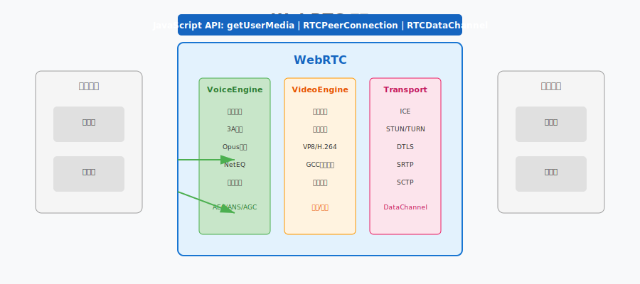
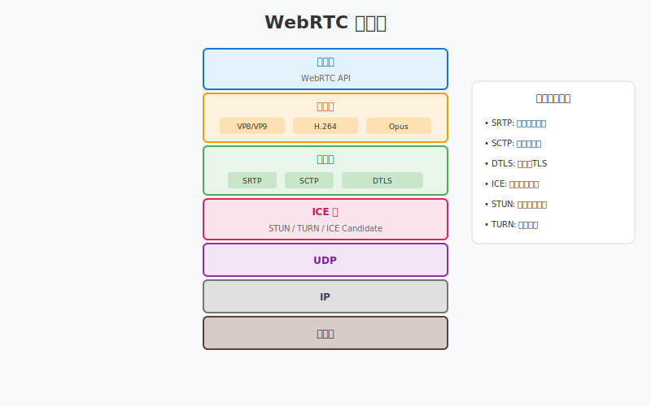
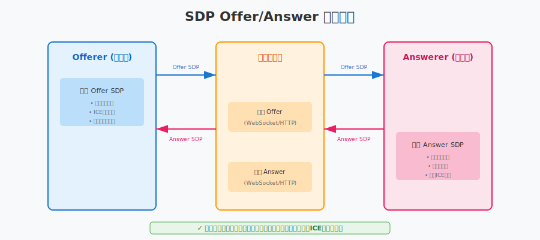
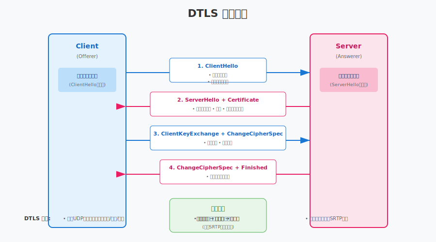
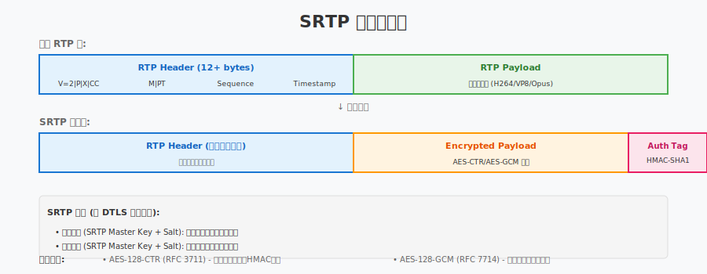

# 第20章：WebRTC 标准详解

> **本章目标**：深入理解 WebRTC 协议栈，掌握实时通信的工业标准。

上一章（第19章）我们深入学习了 **NAT 穿透** 和 **P2P 连接建立**，掌握了 STUN/TURN/ICE 协议栈。虽然使用这些协议可以实现 P2P 连接，但工业级的实时通信还需要解决更多问题：
- **加密传输**：如何防止窃听？
- **媒体协商**：如何确定双方支持的编解码格式？
- **网络适应**：如何应对丢包和带宽变化？
- **数据通道**：除了音视频，如何传输其他数据？

**WebRTC（Web Real-Time Communication）** 是一个开源项目，也是一个 W3C 标准，提供了完整的实时通信解决方案。

**本章学习路线**：
1. 理解 WebRTC 的架构和核心组件
2. 深入协议栈：从 ICE 到 SRTP 的四层架构
3. 掌握 SDP 会话描述和 Offer/Answer 协商
4. 理解 DTLS 加密握手和 SRTP 安全传输
5. 学习 DataChannel 数据通道

**学习本章后，你将能够**：
- 理解 WebRTC 的协议栈架构
- 解析和生成 SDP 描述
- 理解 DTLS/SRTP 的加密流程
- 使用 DataChannel 传输任意数据

---

## 目录

1. [WebRTC 是什么？](#1-webrtc-是什么)
2. [WebRTC 协议栈](#2-webrtc-协议栈)
3. [SDP 会话描述](#3-sdp-会话描述)
4. [DTLS 加密握手](#4-dtls-加密握手)
5. [SRTP 安全传输](#5-srtp-安全传输)
6. [DataChannel](#6-datachannel)
7. [本章总结](#7-本章总结)

---

## 1. WebRTC 是什么？

### 1.1 WebRTC 的历史与背景

**WebRTC 由 Google 于 2011 年开源**，目的是让浏览器无需插件就能进行实时音视频通信。

**核心诉求**：
- **标准化**：统一的 API，跨浏览器兼容
- **安全性**：端到端加密
- **低延迟**：适合实时通话
- **P2P 优先**：直接通信，降低服务器成本

**WebRTC 不是单一协议**，而是一套技术栈，包括：
- 音视频采集和处理
- 编解码（VP8/VP9/H.264/Opus）
- 网络传输（ICE/DTLS/SRTP）
- 数据通道（SCTP）

### 1.2 WebRTC 三大引擎



**VoiceEngine（音频引擎）**：
- 音频采集和播放
- 3A 处理（AEC/ANS/AGC）
- Opus 编解码
- JitterBuffer 和 NetEQ

**VideoEngine（视频引擎）**：
- 视频采集和渲染
- VP8/VP9/H.264 编解码
- 拥塞控制（GCC）
- 图像处理（降噪、美颜等）

**Transport（传输层）**：
- ICE 连接管理
- DTLS 加密
- SRTP 安全传输
- SCTP 数据通道

### 1.3 WebRTC vs 自研方案

| 特性 | 自研 P2P | WebRTC |
|:---|:---|:---|
| 开发成本 | 高（需处理所有细节） | 低（标准库封装） |
| 跨平台 | 需自行适配 | 浏览器原生支持 |
| 安全性 | 需自行实现加密 | 内置 DTLS/SRTP |
| 编解码 | 需自行集成 | 内置多种编解码器 |
| 网络适应 | 需自行实现 | 内置 GCC 拥塞控制 |
| 生态支持 | 有限 | 丰富的开源项目 |

**结论**：除非有特殊需求，否则生产环境优先选择 WebRTC。

---

## 2. WebRTC 协议栈

### 2.1 四层协议架构



WebRTC 的传输层采用四层协议栈：

```
┌─────────────────────────────────────────┐
│  应用层 (Application)                    │
│  - 音视频数据 (RTP)                      │
│  - 数据通道 (SCTP)                       │
├─────────────────────────────────────────┤
│  SRTP (Secure RTP)                      │
│  - RTP 加密传输                          │
│  - 认证和完整性保护                       │
├─────────────────────────────────────────┤
│  DTLS (Datagram TLS)                    │
│  - 密钥交换                              │
│  - 证书验证                              │
├─────────────────────────────────────────┤
│  ICE/STUN/TURN                          │
│  - 连接建立                              │
│  - NAT 穿透                              │
│  - 中继 fallback                        │
├─────────────────────────────────────────┤
│  UDP                                    │
│  - 底层传输                              │
└─────────────────────────────────────────┘
```

### 2.2 每层的作用

**第 1 层：ICE/STUN/TURN**
- 解决连接建立问题
- NAT 穿透
- 已在第 17 章详细讲解

**第 2 层：DTLS**
- 解决密钥交换问题
- 协商 SRTP 加密密钥
- 证书验证，防止中间人攻击

**第 3 层：SRTP**
- 解决媒体加密问题
- RTP 包加密
- 认证标签防止篡改

**第 4 层：应用层**
- RTP：音视频数据传输
- SCTP：数据通道传输

### 2.3 为什么是这种分层？

**分层的好处**：
1. **职责分离**：每层只解决一个问题
2. **可替换**：可以替换某一层而不影响其他层
3. **标准化**：每层都有标准 RFC 文档

**与其他协议的对比**：

| 协议 | 分层 | 特点 |
|:---|:---|:---|
| HTTPS | TLS → HTTP | 可靠流传输 |
| WebRTC | ICE → DTLS → SRTP → RTP | 不可靠数据报 |
| RTMP | TCP → RTMP | 简单但延迟高 |

---

## 3. SDP 会话描述

### 3.1 什么是 SDP？

**SDP（Session Description Protocol，会话描述协议）** 是一种文本格式，用于描述多媒体会话的参数。

**为什么需要 SDP？**
在建立连接之前，双方需要交换以下信息：
- 支持的编解码格式（H.264? VP8? Opus?）
- 传输地址（IP:Port）
- ICE 候选
- DTLS 指纹
- SSRC（同步源标识）

### 3.2 SDP 格式

SDP 是纯文本格式，由多行组成，每行格式为：
```
<type>=<value>
```

**常见字段**：

| 字段 | 含义 | 示例 |
|:---|:---|:---|
| v= | 协议版本 | `v=0` |
| o= | 会话所有者 | `o=- 123456 2 IN IP4 127.0.0.1` |
| s= | 会话名称 | `s=-` |
| t= | 时间 | `t=0 0`（永久） |
| m= | 媒体描述 | `m=audio 9 UDP/TLS/RTP/SAVPF 111` |
| c= | 连接信息 | `c=IN IP4 0.0.0.0` |
| a= | 属性 | `a=rtpmap:111 opus/48000/2` |

### 3.3 WebRTC SDP 示例

```sdp
v=0
o=- 1234567890 2 IN IP4 127.0.0.1
s=-
t=0 0

// DTLS 指纹（用于证书验证）
a=fingerprint:sha-256 4A:79:94:...:B6:71
a=setup:actpass

// ICE 候选（简化示例）
a=candidate:1 1 UDP 2130706431 192.168.1.2 5000 typ host
a=candidate:2 1 UDP 1694498815 1.2.3.4 60001 typ srflx

// 音频媒体
m=audio 9 UDP/TLS/RTP/SAVPF 111 103 104
a=mid:audio
a=sendrecv
a=rtpmap:111 opus/48000/2
a=rtpmap:103 ISAC/16000
a=ssrc:12345678 cname:user@host

// 视频媒体
m=video 9 UDP/TLS/RTP/SAVPF 96 97
a=mid:video
a=sendrecv
a=rtpmap:96 VP8/90000
a=rtpmap:97 H264/90000
a=ssrc:87654321 cname:user@host
```

### 3.4 Offer/Answer 模型



**协商流程**：

```
主播端 (Offerer)              观众端 (Answerer)
     │                              │
     │ 1. CreateOffer()             │
     │    生成 SDP Offer            │
     │                              │
     │──SDP Offer──────────────────→│
     │    包含: 支持的所有编解码      │
     │         所有 ICE 候选         │
     │         DTLS 指纹            │
     │                              │
     │                              │ 2. CreateAnswer()
     │                              │    选择合适的配置
     │                              │    生成 SDP Answer
     │                              │
     │←─SDP Answer──────────────────│
     │    包含: 选定的编解码          │
     │         对方的 ICE 候选       │
     │         对方的 DTLS 指纹      │
     │                              │
     │ 3. SetLocal/RemoteDescription│
     │    双方配置生效              │
```

**关键点**：
- **Offer**：发起方提供的 "我能支持什么"
- **Answer**：接收方选择的 "我们用什么"
- **协商是双向的**：双方都要设置本地和远端的 SDP

### 3.5 SDP 的演进：Trickle ICE

**问题**：ICE 候选收集可能需要几秒时间，阻塞 SDP 交换。

**Trickle ICE 解决方案**：
- 先交换不含候选的 SDP
- 候选收集完成后，**单独发送**（ICE Candidate Trickling）

```
主播端                          观众端
  │                              │
  │ SDP Offer (无候选)           │
  │─────────────────────────────→│
  │                              │
  │ Candidate: host 192.168.1.2  │
  │─────────────────────────────→│
  │ Candidate: srflx 1.2.3.4     │
  │─────────────────────────────→│
  │ Candidate: relay 5.6.7.8     │
  │─────────────────────────────→│
```

**好处**：连接建立更快，用户体验更好。

---

## 4. DTLS 加密握手

### 4.1 为什么需要 DTLS？

**SRTP 需要加密密钥**，但密钥如何安全地交换？

**DTLS（Datagram Transport Layer Security）** 是 TLS 的 UDP 版本，用于：
1. **密钥交换**：协商 SRTP 加密密钥
2. **证书验证**：确认对方身份，防止中间人攻击
3. **加密传输**：握手完成前，所有数据都加密

### 4.2 DTLS 握手流程



**简化流程**：

```
主播端                              观众端
  │                                  │
  │ 1. ClientHello                   │
  │    - 支持的加密套件               │
  │    - 随机数                       │
  │─────────────────────────────────→│
  │                                  │
  │                                  │ 2. ServerHello
  │                                  │    - 选择的加密套件
  │                                  │    - 随机数
  │                                  │ 3. Certificate
  │                                  │    - 服务器证书
  │                                  │ 4. ServerHelloDone
  │←─────────────────────────────────│
  │                                  │
  │ 5. ClientKeyExchange             │
  │    - 预主密钥 (用服务器公钥加密)   │
  │ 6. ChangeCipherSpec              │
  │ 7. Finished                      │
  │─────────────────────────────────→│
  │                                  │
  │                                  │ 8. ChangeCipherSpec
  │                                  │ 9. Finished
  │←─────────────────────────────────│
  │                                  │
  │ [加密通道建立]                    │ [加密通道建立]
  │ 导出 SRTP 密钥                    │ 导出 SRTP 密钥
```

### 4.3 DTLS 与 TLS 的区别

| 特性 | TLS (HTTPS) | DTLS (WebRTC) |
|:---|:---|:---|
| 传输层 | TCP | UDP |
| 可靠性 | 内置重传 | 应用层处理重传 |
| 队头阻塞 | 有 | 无 |
| 适用场景 | 网页、API | 实时音视频 |

**为什么 WebRTC 用 DTLS 而不是 TLS？**
- UDP 无连接，延迟更低
- 无队头阻塞，丢包不影响其他数据
- 适合实时性要求高的场景

### 4.4 证书与指纹验证

**如何防止中间人攻击？**

WebRTC 使用 **自签名证书** + **指纹验证**：

```
1. 每个端生成自签名证书
2. 计算证书指纹 (SHA-256)
3. 将指纹放入 SDP: a=fingerprint:sha-256 ...
4. 通过信令服务器交换 SDP
5. DTLS 握手时验证对方证书指纹
```

**好处**：
- 不需要 CA 证书
- 信令服务器的安全性保证 WebRTC 的安全性
- 即使媒体路径被劫持，也无法解密

---

## 5. SRTP 安全传输

### 5.1 什么是 SRTP？

**SRTP（Secure Real-time Transport Protocol）** 是 RTP 的安全版本，提供：
- **加密**：防止窃听
- **认证**：防止篡改
- **重放保护**：防止重放攻击

### 5.2 SRTP 包结构



```
RTP Header (12 bytes+)
┌─────────────────────────────────────────────────────────────┐
│ V |P|X|  CC   |M|     PT      │       Sequence Number      │
├─────────────────────────────────────────────────────────────┤
│                         Timestamp                           │
├─────────────────────────────────────────────────────────────┤
│                         SSRC                                │
├─────────────────────────────────────────────────────────────┤
│                     CSRC (可选)                              │
└─────────────────────────────────────────────────────────────┘

Encrypted Payload
┌─────────────────────────────────────────────────────────────┐
│                    加密后的音视频数据                        │
└─────────────────────────────────────────────────────────────┘

Authentication Tag (10 bytes)
┌─────────────────────────────────────────────────────────────┐
│                    认证标签 (HMAC)                           │
└─────────────────────────────────────────────────────────────┘
```

**加密范围**：
- **加密**：Payload（音视频数据）
- **不加密**：RTP Header（需要路由信息）
- **附加**：认证标签（验证数据完整性）

### 5.3 密钥派生

SRTP 密钥从 DTLS 握手导出：

```
DTLS 握手完成
    │
    ▼
导出密钥材料 (Exporter)
    │
    ├──> SRTP 加密密钥
    ├──> SRTP 认证密钥
    └──> SRTP Salt
```

**不同流的独立密钥**：
- 音频发送密钥
- 音频接收密钥
- 视频发送密钥
- 视频接收密钥

### 5.4 ROC（Roll-Over Counter）

**问题**：RTP 序列号只有 16 位（0-65535），会回绕。

**解决方案**：ROC 记录序列号回绕次数。

```
实际包序号 = ROC × 65536 + Sequence Number

示例：
- 第 1 个包: ROC=0, Seq=0 → 实际序号 0
- 第 65536 个包: ROC=0, Seq=65535 → 实际序号 65535
- 第 65537 个包: ROC=1, Seq=0 → 实际序号 65536
```

ROC 用于 SRTP 的加密 IV（初始化向量）计算，确保即使序列号回绕，加密依然安全。

---

## 6. DataChannel

### 6.1 什么是 DataChannel？

**DataChannel** 允许在 WebRTC 连接上传输**任意数据**，不仅仅是音视频。

**应用场景**：
- 文字消息
- 文件传输
- 游戏状态同步
- 远程控制指令

### 6.2 DataChannel 协议栈

DataChannel 基于 **SCTP（Stream Control Transmission Protocol）** over DTLS：

```
应用层数据
    │
    ▼
SCTP (数据分片、流控制、拥塞控制)
    │
    ▼
DTLS (加密)
    │
    ▼
UDP
```

**为什么选择 SCTP 而不是直接使用 DTLS？**
- **多流**：一个连接可以有多个独立的数据通道
- **可靠性可选**：可靠传输或不可靠传输
- **有序性可选**：有序或无序传输
- **拥塞控制**：内置流量控制

### 6.3 DataChannel API

```cpp
// 创建 DataChannel
auto data_channel = peer_connection->CreateDataChannel(
    "chat",  // 标签
    {
        .ordered = true,           // 有序传输
        .maxRetransmits = nullptr, // 可靠传输
        .protocol = ""             // 子协议
    }
);

// 发送消息
data_channel->Send(DataBuffer("Hello, WebRTC!"));

// 接收回调
data_channel->RegisterObserver({
    .OnMessage = [](const DataBuffer& buffer) {
        std::string msg(buffer.data.data(), buffer.data.size());
        std::cout << "Received: " << msg << std::endl;
    }
});
```

### 6.4 传输模式对比

| 模式 | 可靠性 | 有序性 | 适用场景 |
|:---|:---:|:---:|:---|
| 可靠有序 | ✓ | ✓ | 文字消息、文件传输 |
| 可靠无序 | ✓ | ✗ | 多文件并行传输 |
| 不可靠有序 | ✗ | ✓ | 实时位置更新 |
| 不可靠无序 | ✗ | ✗ | 游戏状态同步 |

### 6.5 DataChannel vs WebSocket

| 特性 | DataChannel | WebSocket |
|:---|:---|:---|
| 传输路径 | P2P 直连 | 通过服务器 |
| 延迟 | < 50ms | 50-200ms |
| 服务器成本 | 低 | 高 |
| 建立复杂度 | 高（需 ICE 协商） | 低 |
| 适用场景 | 实时游戏、文件传输 | 聊天、通知 |

---

## 7. 本章总结

### 7.1 WebRTC 协议栈总览

```
┌─────────────────────────────────────────────────────────────┐
│                     WebRTC 技术栈                           │
├─────────────────────────────────────────────────────────────┤
│  应用层                                                       │
│  ├─ RTP (音视频)                                             │
│  └─ SCTP (DataChannel)                                       │
├─────────────────────────────────────────────────────────────┤
│  SRTP ── 媒体加密 (AES)                                      │
├─────────────────────────────────────────────────────────────┤
│  DTLS ── 密钥交换 + 证书验证                                  │
├─────────────────────────────────────────────────────────────┤
│  ICE/STUN/TURN ── 连接建立 + NAT 穿透                        │
├─────────────────────────────────────────────────────────────┤
│  UDP ── 底层传输                                             │
└─────────────────────────────────────────────────────────────┘
```

### 7.2 关键概念回顾

| 概念 | 作用 | 类比 |
|:---|:---|:---|
| SDP | 描述会话参数 | 菜单（列出所有选项） |
| Offer/Answer | 协商媒体格式 | 点菜（从菜单中选择） |
| DTLS | 加密握手 | SSL 证书验证 |
| SRTP | 媒体加密 | HTTPS 加密 |
| DataChannel | 传输任意数据 | WebSocket 的 P2P 版本 |

### 7.3 与下一章的衔接

本章我们深入理解了 WebRTC 的协议栈和核心概念，掌握了 SDP、DTLS、SRTP、DataChannel 等关键协议的工作原理。理论知识是基础，但真正的能力来自于实践。

下一章（第21章）**WebRTC Native 开发** 将带你进入实战：
- 获取和编译 WebRTC 源码（GN + Ninja 构建系统）
- 使用 Native PeerConnection API
- 管理音视频轨道和设备
- 实现完整的信令交互流程
- 构建可运行的 1v1 连麦客户端

通过 Native 开发，你将真正掌握 WebRTC 的实战应用，为后续学习 SFU 服务器和多人房间架构打下坚实基础。

---

## 课后思考

1. **为什么 WebRTC 使用自签名证书而不是传统 CA 证书？** 这种设计有什么优缺点？

2. **SRTP 只加密 Payload 不加密 Header，会有什么安全隐患？** 攻击者能从 Header 中获取什么信息？

3. **对比 WebRTC DataChannel 和 QUIC**：两者都基于 UDP，都提供可靠传输，设计上有何异同？

4. **如果你的应用需要同时传输音视频和文件**，你会如何设计？使用一个 PeerConnection 还是多个？DataChannel 和 RTP 如何配合？
