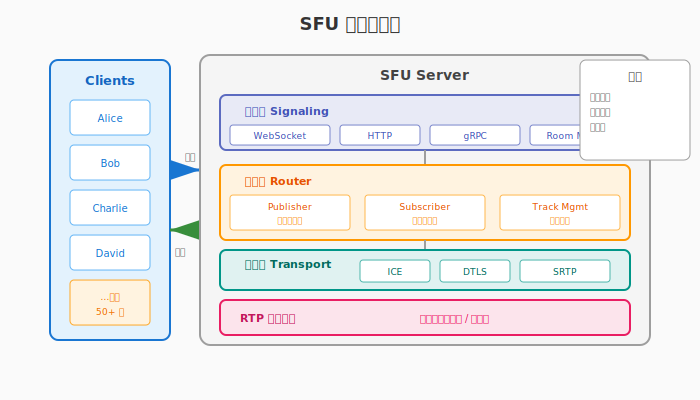
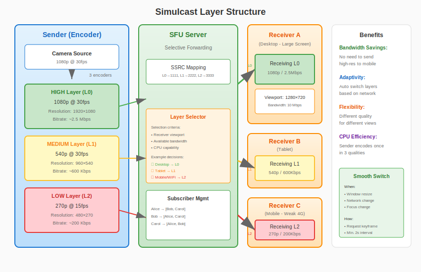

# 第22章：SFU 转发服务器

> **本章目标**：理解 SFU 架构原理，掌握多人实时通信的服务器端技术。

在上一章（第21章）中，我们使用 WebRTC Native API 实现了 1v1 连麦客户端。P2P 连接在两人通信时非常高效，但当参与者超过两人时，纯 P2P 架构会遇到严重的可扩展性问题。

本章将学习 **SFU（Selective Forwarding Unit，选择性转发单元）** 架构，这是现代多人视频会议的核心技术。通过 SFU，我们可以支持数十人甚至上百人同时参与的实时音视频通话。

**学习本章后，你将能够**：
- 理解 P2P 的局限性，掌握 SFU vs MCU 的技术选型
- 设计 Publish/Subscribe 媒体转发模型
- 实现 Simulcast 多路质量转发
- 理解 GCC 拥塞控制算法
- 编写一个简单的 SFU 服务器

---

## 目录

1. [为什么需要 SFU？](#1-为什么需要-sfu)
2. [SFU 架构设计](#2-sfu-架构设计)
3. [Simulcast 多路质量](#3-simulcast-多路质量)
4. [GCC 拥塞控制](#4-gcc-拥塞控制)
5. [简单 SFU 实现](#5-简单-sfu-实现)
6. [本章总结](#6-本章总结)

---

## 1. 为什么需要 SFU？

### 1.1 P2P 的局限性

当通话人数超过两人时，纯 P2P 架构面临三个严重问题：

**问题 1：上传带宽爆炸**

每个参与者需要向其他所有参与者发送媒体流：

```
┌─────────────────────────────────────────────────────────────┐
│                    3 人 P2P 通话                             │
├─────────────────────────────────────────────────────────────┤
│                                                             │
│           ┌─────────┐                                       │
│           │  Alice  │                                       │
│           │ 2 Mbps  │                                       │
│           └────┬────┘                                       │
│                │                                            │
│      ┌─────────┼─────────┐                                  │
│      ↓         ↓         ↓                                  │
│ ┌─────────┐ ┌─────────┐ ┌─────────┐                         │
│ │  Bob    │ │ Charlie │ │  Alice  │                         │
│ └─────────┘ └─────────┘ └─────────┘                         │
│                                                             │
│ Alice 的上行: 2 Mbps × 2 = 4 Mbps (发给 Bob 和 Charlie)      │
│ 总带宽消耗: 每个人 4 Mbps 上行 + 4 Mbps 下行 = 8 Mbps         │
└─────────────────────────────────────────────────────────────┘
```

对于 N 人通话，每个参与者需要：
- **上行带宽**：(N-1) × 个人码率
- **下行带宽**：(N-1) × 个人码率

| 人数 | 每人上行 (1080p@2Mbps) | 每人下行 | 总带宽/人 |
|:---:|:---:|:---:|:---:|
| 2 | 2 Mbps | 2 Mbps | 4 Mbps |
| 4 | 6 Mbps | 6 Mbps | 12 Mbps |
| 8 | 14 Mbps | 14 Mbps | 28 Mbps |
| 16 | 30 Mbps | 30 Mbps | 60 Mbps |

普通家庭宽带（通常 20-100 Mbps）难以支持 4 人以上的高清通话。

**问题 2：设备性能瓶颈**

每个参与者需要：
- 编码 N-1 路视频（发给其他人）
- 解码 N-1 路视频（接收其他人）

对于 4 人 1080p@30fps 通话，设备需要同时：
- 编码 3 路 1080p
- 解码 3 路 1080p

这对移动设备是巨大负担，发热、掉帧、卡顿随之而来。

**问题 3：连接可靠性**

P2P 需要建立 N×(N-1)/2 条连接：
- 4 人通话：6 条连接
- 8 人通话：28 条连接
- 16 人通话：120 条连接

任何一条连接失败都会影响通信质量。

### 1.2 SFU vs MCU vs Mesh


**Mesh（网状，纯 P2P）**：
```
A ←──→ B
↑  ↘   ↑
└──→ C ←─┘
```
- 优点：服务器不参与媒体处理，隐私性好
- 缺点：带宽和 CPU 消耗随人数平方增长
- 适用：2-3 人小规模通话

**MCU（Multipoint Control Unit）**：
```
    ┌─────────────┐
A ──→│   Server    │──→ A看到B+C的合屏
B ──→│  (Mixing)   │──→ B看到A+C的合屏
C ──→│  合成一路   │──→ C看到A+B的合屏
    └─────────────┘
```
- 优点：客户端消耗最小，只收 1 路
- 缺点：服务器 CPU 消耗大（需要解码+合成+编码），延迟高（100-500ms）
- 适用：Webinar（ webinar 只需看主讲人），大规模直播

**SFU（Selective Forwarding Unit）**：
```
    ┌─────────────┐
A ──→│   Server    │──→ 转发 B 给 A
B ──→│  (Routing)  │──→ 转发 C 给 A
C ──→│  只转发不处理 │──→ 转发 A 给 B/C
    └─────────────┘
```
- 优点：服务器只转发不处理，延迟低（10-50ms），灵活控制订阅
- 缺点：客户端需要解码多路，带宽消耗中等
- 适用：多人视频会议（4-50 人）

### 1.3 三种架构对比

| 特性 | Mesh (P2P) | MCU | SFU |
|:---|:---:|:---:|:---:|
| **服务器角色** | 仅信令 | 混音合成 | 转发 |
| **服务器 CPU** | 低 | 极高 | 低 |
| **服务器带宽** | 低 | 中等 | 高 |
| **客户端上行** | 高 | 低 | 低 |
| **客户端下行** | 高 | 极低 | 中等 |
| **客户端 CPU** | 高 | 极低 | 中等 |
| **延迟** | 低 | 高 | 低 |
| **布局灵活性** | 高 | 低 | 高 |
| **最大人数** | 3-4 | 100+ | 50+ |

**现代会议系统的主流选择**：SFU 为主，MCU 为辅（用于录制或超大会议室）。

---

## 2. SFU 架构设计

### 2.1 整体架构



```
┌─────────────────────────────────────────────────────────────────┐
│                        SFU Server                               │
│  ┌─────────────────────────────────────────────────────────┐   │
│  │                    Signaling Layer                       │   │
│  │   (WebSocket / HTTP / gRPC - Room Management)            │   │
│  └─────────────────────────────────────────────────────────┘   │
│                            ↓                                    │
│  ┌─────────────────────────────────────────────────────────┐   │
│  │                    Router Layer                          │   │
│  │   (Track Management - Publisher/Subscriber Model)        │   │
│  └─────────────────────────────────────────────────────────┘   │
│                            ↓                                    │
│  ┌─────────────────────────────────────────────────────────┐   │
│  │                    Transport Layer                       │   │
│  │   (ICE/DTLS/SRTP - Per-participant PeerConnection)       │   │
│  └─────────────────────────────────────────────────────────┘   │
│                            ↓                                    │
│  ┌─────────────────────────────────────────────────────────┐   │
│  │                    RTP Routing Engine                    │   │
│  │   (Packet Forwarding - No Decoding/Encoding)             │   │
│  └─────────────────────────────────────────────────────────┘   │
└─────────────────────────────────────────────────────────────────┘
                              ↑↓
                        ┌───────────┐
                        │  Clients  │
                        └───────────┘
```

### 2.2 Publish/Subscribe 模型

SFU 采用 **发布/订阅** 模式管理媒体流：

```cpp
namespace live {

// 发布者：向 SFU 发送媒体
class Publisher {
public:
    // 发布音频轨道
    void PublishAudio(const std::string& track_id,
                      std::shared_ptr<RtpSender> sender);
    
    // 发布视频轨道（支持 Simulcast）
    void PublishVideo(const std::string& track_id,
                      const std::vector<RtpSender>& simulcast_senders);
    
    // 停止发布
    void Unpublish(const std::string& track_id);
};

// 订阅者：从 SFU 接收媒体
class Subscriber {
public:
    // 订阅某人的音频
    void SubscribeAudio(const std::string& publisher_id,
                        const std::string& track_id);
    
    // 订阅某人的视频（指定质量层）
    void SubscribeVideo(const std::string& publisher_id,
                        const std::string& track_id,
                        VideoQualityLayer layer);
    
    // 取消订阅
    void Unsubscribe(const std::string& publisher_id,
                     const std::string& track_id);
};

} // namespace live
```

**关键设计决策**：
1. **每个参与者维护一个 PeerConnection** 与 SFU 通信
2. **上行（Publish）**：发送者将自己的音视频推送到 SFU
3. **下行（Subscribe）**：接收者从 SFU 拉取其他人的音视频
4. **SFU 不解码媒体**：只解析 RTP 头部，根据 SSRC 路由

### 2.3 RTP 路由引擎

```cpp
namespace live {

// RTP 包路由表条目
struct RoutingEntry {
    uint32_t ssrc;                    // 源 SSRC
    std::string publisher_id;          // 发布者 ID
    std::string track_id;              // 轨道 ID
    VideoQualityLayer layer;          // 质量层（用于 Simulcast）
    std::vector<std::string> subscribers;  // 订阅者列表
};

// RTP 路由器
class RtpRouter {
public:
    // 注册发布流
    void RegisterPublisher(const std::string& publisher_id,
                           const std::string& track_id,
                           uint32_t ssrc);
    
    // 添加订阅关系
    void AddSubscription(uint32_t ssrc, const std::string& subscriber_id);
    void RemoveSubscription(uint32_t ssrc, const std::string& subscriber_id);
    
    // 路由 RTP 包（核心转发逻辑）
    void RouteRtpPacket(const std::string& publisher_id,
                        const uint8_t* rtp_packet,
                        size_t len);
    
    // 处理 RTCP（反馈控制）
    void ProcessRtcpPacket(const std::string& subscriber_id,
                           const uint8_t* rtcp_packet,
                           size_t len);

private:
    // SSRC → 路由条目
    std::unordered_map<uint32_t, RoutingEntry> routing_table_;
    
    // Subscriber ID → PeerConnection
    std::unordered_map<std::string, std::shared_ptr<PeerConnection>> subscribers_;
    
    // 转发统计
    struct ForwardStats {
        uint64_t packets_forwarded = 0;
        uint64_t bytes_forwarded = 0;
        uint64_t packets_dropped = 0;
    };
    std::unordered_map<uint32_t, ForwardStats> stats_;
};

} // namespace live
```

### 2.4 房间管理

```cpp
namespace live {

// 参与者信息
struct Participant {
    std::string id;
    std::string name;
    bool audio_muted = false;
    bool video_muted = false;
    std::shared_ptr<PeerConnection> pc;
    
    // 发布的轨道
    std::unordered_map<std::string, std::shared_ptr<MediaStreamTrack>> published_tracks;
    
    // 订阅的轨道
    std::unordered_set<std::string> subscribed_tracks;
};

// 房间
class Room {
public:
    Room(const std::string& room_id, size_t max_participants = 50);
    
    // 参与者管理
    bool Join(const std::string& participant_id,
              std::shared_ptr<PeerConnection> pc);
    void Leave(const std::string& participant_id);
    
    // 发布/订阅管理
    void PublishTrack(const std::string& participant_id,
                      const std::string& track_id,
                      std::shared_ptr<MediaStreamTrack> track);
    void UnpublishTrack(const std::string& participant_id,
                        const std::string& track_id);
    
    void SubscribeTrack(const std::string& subscriber_id,
                        const std::string& publisher_id,
                        const std::string& track_id);
    void UnsubscribeTrack(const std::string& subscriber_id,
                          const std::string& publisher_id,
                          const std::string& track_id);
    
    // 获取房间信息
    size_t GetParticipantCount() const;
    std::vector<std::string> GetParticipantList() const;
    
    // 广播控制消息
    void BroadcastMessage(const std::string& from,
                          const json& message);

private:
    std::string room_id_;
    size_t max_participants_;
    
    std::unordered_map<std::string, std::unique_ptr<Participant>> participants_;
    std::shared_mutex mutex_;
    
    // RTP 路由器
    std::unique_ptr<RtpRouter> router_;
};

// 房间管理器
class RoomManager {
public:
    std::shared_ptr<Room> CreateRoom(const std::string& room_id);
    void DestroyRoom(const std::string& room_id);
    std::shared_ptr<Room> GetRoom(const std::string& room_id);
    
private:
    std::unordered_map<std::string, std::shared_ptr<Room>> rooms_;
    std::mutex mutex_;
};

} // namespace live
```

---

## 3. Simulcast 多路质量

### 3.1 为什么需要 Simulcast？

在多人会议中，不同参与者有不同的：
- **屏幕尺寸**：手机小屏 vs 电脑大屏
- **网络条件**：WiFi vs 4G vs 弱网
- **关注重点**：主讲人大窗口 vs 其他人小窗口

**Simulcast（多播）** 让发送者同时发送多路不同质量的视频：

```
发送者 (Alice)
    │
    ├─→ 高清层 (1080p @ 2Mbps) ──→ 大屏显示、主讲人
    ├─→ 标清层 (540p @ 500Kbps) ──→ 中等窗口
    └─→ 低清层 (270p @ 150Kbps) ──→ 小窗口、弱网用户
```

### 3.2 Simulcast 分层结构



```cpp
namespace live {

// 视频质量层
enum class VideoQualityLayer {
    HIGH,      // 高清 (1080p)
    MEDIUM,    // 标清 (540p)
    LOW        // 低清 (270p)
};

// Simulcast 配置
struct SimulcastConfig {
    bool enabled = true;
    
    struct LayerConfig {
        int width;
        int height;
        int max_framerate;
        int max_bitrate_bps;
        double scale_resolution_down_by;
    };
    
    std::array<LayerConfig, 3> layers = {{
        // High layer (L0) - original resolution
        {1920, 1080, 30, 2500000, 1.0},
        // Medium layer (L1) - 1/2 resolution
        {960, 540, 30, 600000, 2.0},
        // Low layer (L2) - 1/4 resolution
        {480, 270, 15, 200000, 4.0}
    }};
};

// Simulcast 流管理
class SimulcastManager {
public:
    // 解析 SSRC 对应的层
    VideoQualityLayer GetLayerBySSRC(uint32_t ssrc) const;
    
    // 为订阅者选择最佳层
    VideoQualityLayer SelectOptimalLayer(
        const std::string& subscriber_id,
        int target_width,
        int target_height,
        int available_bandwidth_bps);
    
    // 层切换（平滑过渡）
    void SwitchLayer(const std::string& subscriber_id,
                     uint32_t from_ssrc,
                     uint32_t to_ssrc);

private:
    // SSRC 到层的映射
    std::unordered_map<uint32_t, VideoQualityLayer> ssrc_to_layer_;
    
    // 当前订阅状态
    struct SubscriptionState {
        uint32_t current_ssrc;
        VideoQualityLayer current_layer;
        uint64_t switch_timestamp;
    };
    std::unordered_map<std::string, SubscriptionState> subscriptions_;
};

} // namespace live
```

### 3.3 层选择策略

```cpp
namespace live {

// 基于窗口大小的层选择
VideoQualityLayer SelectLayerByViewport(
    int viewport_width,
    int viewport_height,
    const SimulcastConfig& config) {
    
    // 根据显示区域大小选择最合适的层
    // 避免过度采样（小窗口看高清是浪费）
    
    if (viewport_width >= config.layers[0].width * 0.8 ||
        viewport_height >= config.layers[0].height * 0.8) {
        return VideoQualityLayer::HIGH;
    }
    
    if (viewport_width >= config.layers[1].width * 0.8 ||
        viewport_height >= config.layers[1].height * 0.8) {
        return VideoQualityLayer::MEDIUM;
    }
    
    return VideoQualityLayer::LOW;
}

// 基于带宽的层选择
VideoQualityLayer SelectLayerByBandwidth(
    int available_bandwidth_bps,
    const SimulcastConfig& config) {
    
    // 预留 20% 缓冲
    int safe_bandwidth = available_bandwidth_bps * 0.8;
    
    if (safe_bandwidth >= config.layers[0].max_bitrate_bps) {
        return VideoQualityLayer::HIGH;
    }
    
    if (safe_bandwidth >= config.layers[1].max_bitrate_bps) {
        return VideoQualityLayer::MEDIUM;
    }
    
    return VideoQualityLayer::LOW;
}

// 综合选择（考虑窗口和带宽）
VideoQualityLayer SelectOptimalLayer(
    int viewport_width,
    int viewport_height,
    int available_bandwidth_bps,
    const SimulcastConfig& config) {
    
    auto layer_by_viewport = SelectLayerByViewport(
        viewport_width, viewport_height, config);
    auto layer_by_bandwidth = SelectLayerByBandwidth(
        available_bandwidth_bps, config);
    
    // 取两者中较低的（受限因素决定）
    return std::min(layer_by_viewport, layer_by_bandwidth);
}

} // namespace live
```

### 3.4 平滑层切换

```cpp
namespace live {

// 层切换管理器（防止频繁切换）
class LayerSwitchManager {
public:
    static constexpr int64_t kMinSwitchIntervalMs = 2000;  // 最少 2 秒切换一次
    static constexpr int kQualityHysteresis = 10;  // 10% 缓冲避免抖动
    
    bool ShouldSwitchLayer(VideoQualityLayer current,
                           VideoQualityLayer proposed,
                           int64_t last_switch_time_ms,
                           int current_bandwidth_bps,
                           int proposed_layer_bitrate) {
        
        int64_t now = GetCurrentTimeMs();
        if (now - last_switch_time_ms < kMinSwitchIntervalMs) {
            return false;  // 切换太频繁
        }
        
        if (proposed > current) {
            // 升层：需要足够带宽（+缓冲）
            return current_bandwidth_bps > proposed_layer_bitrate * (100 + kQualityHysteresis) / 100;
        } else if (proposed < current) {
            // 降层：带宽不足（-缓冲）
            return current_bandwidth_bps < proposed_layer_bitrate * (100 - kQualityHysteresis) / 100;
        }
        
        return false;
    }
    
    // 关键帧请求（切换后需要立即刷新）
    void RequestKeyframe(uint32_t ssrc);
};

} // namespace live
```

---

## 4. GCC 拥塞控制

### 4.1 为什么需要拥塞控制？

网络带宽是动态变化的：
- WiFi 信号强弱变化
- 其他应用占用带宽
- 网络拥堵时段

**拥塞控制的目标**：
1. 充分利用可用带宽
2. 避免网络拥塞导致丢包
3. 快速适应带宽变化

### 4.2 GCC 算法概述

**GCC（Google Congestion Control）** 是 WebRTC 默认的拥塞控制算法，结合发送端和接收端估计：

```
┌─────────────────────────────────────────────────────────────┐
│                    GCC 架构                                  │
├─────────────────────────────────────────────────────────────┤
│                                                             │
│   发送端                        接收端                       │
│  ┌──────────────┐              ┌──────────────┐            │
│  │  发送码率控制  │              │  延迟变化检测  │            │
│  │  (基于丢包)   │              │  (基于到达时间)│            │
│  └──────┬───────┘              └──────┬───────┘            │
│         │                             │                    │
│         │      带宽估计 ←─────────────┘                    │
│         │      (通过 RTCP TransportCC)                     │
│         ↓                                                   │
│  ┌──────────────┐                                           │
│  │  最终目标码率  │ ← 取两者最小值                            │
│  │  = min(丢包,  │                                           │
│  │         延迟) │                                           │
│  └──────┬───────┘                                           │
│         ↓                                                   │
│    编码器码率调整                                              │
└─────────────────────────────────────────────────────────────┘
```

### 4.3 GCC 算法流程


**发送端估计（基于丢包）**：

```cpp
namespace live {

// 发送端带宽估计器
class SendSideBandwidthEstimator {
public:
    // 处理 RTCP Receiver Report
    void OnReceiverReport(const ReceiverReport& report);
    
    // 计算目标码率
    int64_t GetTargetBitrateBps() const { return target_bitrate_bps_; }

private:
    // 丢包率 → 码率调整
    void UpdateTargetBitrate(float loss_rate);
    
    static constexpr float kLossLowThreshold = 0.02f;   // 2%
    static constexpr float kLossHighThreshold = 0.10f;  // 10%
    
    // 码率调整规则：
    // loss < 2%:   增加码率 (带宽充足)
    // 2% < loss < 10%: 保持当前码率
    // loss > 10%:   降低码率 (拥塞)
    
    int64_t target_bitrate_bps_ = 1000000;  // 初始 1 Mbps
    float loss_rate_ = 0.0f;
};

void SendSideBandwidthEstimator::UpdateTargetBitrate(float loss_rate) {
    if (loss_rate < kLossLowThreshold) {
        // 丢包率低，增加码率
        target_bitrate_bps_ = static_cast<int64_t>(
            target_bitrate_bps_ * 1.05);  // 增加 5%
    } else if (loss_rate > kLossHighThreshold) {
        // 丢包率高，降低码率
        target_bitrate_bps_ = static_cast<int64_t>(
            target_bitrate_bps_ * (1 - 0.5f * loss_rate));
    }
    // 否则保持当前码率
    
    // 限制范围
    target_bitrate_bps_ = std::clamp(target_bitrate_bps_,
                                      kMinBitrateBps,
                                      kMaxBitrateBps);
}

} // namespace live
```

**接收端估计（基于延迟）**：

```cpp
namespace live {

// 到达时间过滤器（卡尔曼滤波）
class ArrivalTimeFilter {
public:
    // 处理包到达事件
    void OnPacketArrival(int64_t send_time_ms,
                         int64_t arrival_time_ms,
                         size_t payload_size);
    
    // 获取延迟变化趋势
    double GetDelayTrend() const;

private:
    // 卡尔曼滤波状态
    double slope_;      // 延迟变化斜率
    double offset_;     // 偏移
    
    // 状态噪声协方差
    double process_noise_cov_[2][2];
    double measurement_noise_var_;
};

// 接收端带宽估计器
class ReceiveSideBandwidthEstimator {
public:
    void OnReceivedPacket(const RtpPacket& packet,
                          int64_t arrival_time_ms);
    
    // 生成 TransportCC 反馈（通过 RTCP）
    std::vector<uint8_t> BuildTransportCcFeedback();
    
    int64_t GetEstimatedBitrateBps() const;

private:
    ArrivalTimeFilter arrival_filter_;
    
    // 基于延迟趋势的码率调整
    void UpdateEstimate(double delay_trend);
    
    // 自适应阈值
    double threshold_ = 12.5;  // 初始阈值 (ms)
    bool overusing_ = false;
    
    int64_t estimated_bitrate_bps_ = 1000000;
};

void ReceiveSideBandwidthEstimator::UpdateEstimate(double delay_trend) {
    if (delay_trend > threshold_) {
        // 延迟增加，网络拥塞
        if (!overusing_) {
            overusing_ = true;
            // 开始降速
            estimated_bitrate_bps_ *= 0.85;
        }
    } else if (delay_trend < -threshold_) {
        // 延迟减少，网络空闲
        overusing_ = false;
        // 可以提速
        estimated_bitrate_bps_ *= 1.05;
    } else {
        overusing_ = false;
    }
}

} // namespace live
```

### 4.4 码率分配

```cpp
namespace live {

// 码率分配器（处理多轨道）
class BitrateAllocator {
public:
    struct TrackConfig {
        std::string track_id;
        int64_t min_bitrate_bps;
        int64_t max_bitrate_bps;
        int priority;  // 优先级（音频 > 主讲人视频 > 其他视频）
    };
    
    // 分配码率给各个轨道
    std::map<std::string, int64_t> Allocate(
        int64_t total_bitrate_bps,
        const std::vector<TrackConfig>& tracks);

private:
    // 优先保证最低码率
    // 剩余带宽按优先级分配
};

std::map<std::string, int64_t> BitrateAllocator::Allocate(
    int64_t total_bitrate_bps,
    const std::vector<TrackConfig>& tracks) {
    
    std::map<std::string, int64_t> allocation;
    int64_t remaining = total_bitrate_bps;
    
    // 第一步：分配最低码率
    for (const auto& track : tracks) {
        int64_t allocated = std::min(track.min_bitrate_bps, remaining);
        allocation[track.track_id] = allocated;
        remaining -= allocated;
    }
    
    // 第二步：按优先级分配剩余带宽
    if (remaining > 0) {
        // 按优先级排序
        auto sorted_tracks = tracks;
        std::sort(sorted_tracks.begin(), sorted_tracks.end(),
                  [](const auto& a, const auto& b) {
                      return a.priority > b.priority;
                  });
        
        for (const auto& track : sorted_tracks) {
            int64_t current = allocation[track.track_id];
            int64_t desired = track.max_bitrate_bps;
            int64_t additional = std::min(desired - current, remaining);
            
            allocation[track.track_id] += additional;
            remaining -= additional;
            
            if (remaining <= 0) break;
        }
    }
    
    return allocation;
}

} // namespace live
```

---

## 5. 简单 SFU 实现

### 5.1 项目结构

```
simple-sfu/
├── CMakeLists.txt
├── src/
│   ├── main.cpp
│   ├── sfu_server.{h,cpp}
│   ├── room.{h,cpp}
│   ├── rtp_router.{h,cpp}
│   ├── signaling_handler.{h,cpp}
│   └── bandwidth_controller.{h,cpp}
└── include/
    └── live/
        └── sfu/
```

### 5.2 CMakeLists.txt

```cmake
cmake_minimum_required(VERSION 3.16)
project(simple_sfu VERSION 1.0.0 LANGUAGES CXX)

set(CMAKE_CXX_STANDARD 14)
set(CMAKE_CXX_STANDARD_REQUIRED ON)

# 依赖
find_package(WebRTC REQUIRED)
find_package(Threads REQUIRED)
find_package(Boost REQUIRED COMPONENTS system)

# SFU 可执行文件
add_executable(simple_sfu
    src/main.cpp
    src/sfu_server.cpp
    src/room.cpp
    src/rtp_router.cpp
    src/signaling_handler.cpp
    src/bandwidth_controller.cpp
)

target_include_directories(simple_sfu PRIVATE
    ${CMAKE_SOURCE_DIR}/include
    ${WEBRTC_INCLUDE_DIRS}
    ${Boost_INCLUDE_DIRS}
)

target_link_libraries(simple_sfu PRIVATE
    ${WEBRTC_LIBRARIES}
    Threads::Threads
    Boost::system
)

target_compile_options(simple_sfu PRIVATE -O2 -Wall)
```

### 5.3 SFU 服务器主类

```cpp
// include/live/sfu/sfu_server.h
#pragma once

#include <memory>
#include <unordered_map>
#include <boost/asio.hpp>

namespace live {

class Room;
class SignalingHandler;

// SFU 服务器配置
struct SfuServerConfig {
    std::string bind_address = "0.0.0.0";
    uint16_t signaling_port = 8080;
    uint16_t media_port_min = 10000;
    uint16_t media_port_max = 20000;
    size_t max_rooms = 100;
    size_t max_participants_per_room = 50;
};

// SFU 服务器
class SfuServer {
public:
    explicit SfuServer(const SfuServerConfig& config);
    ~SfuServer();
    
    // 启动/停止
    bool Start();
    void Stop();
    
    // 获取统计信息
    struct Stats {
        size_t active_rooms;
        size_t total_participants;
        uint64_t packets_forwarded;
        uint64_t bytes_forwarded;
    };
    Stats GetStats() const;

private:
    SfuServerConfig config_;
    
    // IO 服务
    boost::asio::io_context io_context_;
    std::unique_ptr<boost::asio::io_context::work> work_;
    std::vector<std::thread> worker_threads_;
    
    // 房间管理
    std::unordered_map<std::string, std::shared_ptr<Room>> rooms_;
    std::mutex rooms_mutex_;
    
    // 信令处理器
    std::unique_ptr<SignalingHandler> signaling_handler_;
    
    void WorkerThread();
    std::shared_ptr<Room> GetOrCreateRoom(const std::string& room_id);
};

} // namespace live
```

### 5.4 主程序

```cpp
// src/main.cpp
#include <iostream>
#include <signal.h>
#include "live/sfu/sfu_server.h"

using namespace live;

static std::atomic<bool> g_running{true};

void SignalHandler(int sig) {
    std::cout << "\nReceived signal " << sig << ", shutting down...\n";
    g_running = false;
}

int main(int argc, char* argv[]) {
    // 配置
    SfuServerConfig config;
    config.signaling_port = 8080;
    config.max_participants_per_room = 50;
    
    // 解析命令行参数
    for (int i = 1; i < argc; ++i) {
        std::string arg = argv[i];
        if (arg == "--port" && i + 1 < argc) {
            config.signaling_port = std::stoi(argv[++i]);
        } else if (arg == "--max-participants" && i + 1 < argc) {
            config.max_participants_per_room = std::stoi(argv[++i]);
        } else if (arg == "--help") {
            std::cout << "Usage: simple_sfu [options]\n"
                      << "Options:\n"
                      << "  --port <port>       Signaling port (default: 8080)\n"
                      << "  --max-participants <n>  Max participants per room\n"
                      << "  --help              Show this help\n";
            return 0;
        }
    }
    
    // 设置信号处理
    signal(SIGINT, SignalHandler);
    signal(SIGTERM, SignalHandler);
    
    std::cout << "Starting Simple SFU Server...\n"
              << "Signaling port: " << config.signaling_port << "\n"
              << "Max participants per room: " << config.max_participants_per_room << "\n\n";
    
    // 创建并启动服务器
    SfuServer server(config);
    if (!server.Start()) {
        std::cerr << "Failed to start server\n";
        return 1;
    }
    
    std::cout << "SFU Server running. Press Ctrl+C to stop.\n";
    
    // 主循环：定期打印统计
    while (g_running) {
        std::this_thread::sleep_for(std::chrono::seconds(10));
        
        auto stats = server.GetStats();
        std::cout << "[Stats] Rooms: " << stats.active_rooms
                  << ", Participants: " << stats.total_participants
                  << ", Packets forwarded: " << stats.packets_forwarded
                  << "\n";
    }
    
    // 停止服务器
    server.Stop();
    std::cout << "Server stopped.\n";
    
    return 0;
}
```

### 5.5 RTP 转发核心实现

```cpp
// src/rtp_router.cpp
#include "live/sfu/rtp_router.h"

namespace live {

void RtpRouter::RouteRtpPacket(const std::string& publisher_id,
                                const uint8_t* rtp_packet,
                                size_t len) {
    if (len < 12) return;  // RTP 头至少 12 字节
    
    // 解析 RTP 头
    uint8_t version = (rtp_packet[0] >> 6) & 0x03;
    if (version != 2) return;  // 只支持 RTPv2
    
    uint8_t payload_type = rtp_packet[1] & 0x7F;
    uint16_t seq_num = (rtp_packet[2] << 8) | rtp_packet[3];
    uint32_t ssrc = (rtp_packet[8] << 24) |
                    (rtp_packet[9] << 16) |
                    (rtp_packet[10] << 8) |
                    rtp_packet[11];
    
    std::lock_guard<std::mutex> lock(mutex_);
    
    // 查找路由表
    auto it = routing_table_.find(ssrc);
    if (it == routing_table_.end()) {
        // 新 SSRC，注册到路由表
        RegisterSsrcInternal(publisher_id, ssrc, payload_type);
        it = routing_table_.find(ssrc);
        if (it == routing_table_.end()) return;
    }
    
    const auto& entry = it->second;
    
    // 转发给所有订阅者
    for (const auto& subscriber_id : entry.subscribers) {
        auto sub_it = subscribers_.find(subscriber_id);
        if (sub_it != subscribers_.end()) {
            sub_it->second->SendRtp(rtp_packet, len);
            stats_[ssrc].packets_forwarded++;
            stats_[ssrc].bytes_forwarded += len;
        }
    }
}

void RtpRouter::AddSubscription(uint32_t ssrc, const std::string& subscriber_id) {
    std::lock_guard<std::mutex> lock(mutex_);
    
    auto it = routing_table_.find(ssrc);
    if (it != routing_table_.end()) {
        auto& subscribers = it->second.subscribers;
        if (std::find(subscribers.begin(), subscribers.end(), subscriber_id) 
            == subscribers.end()) {
            subscribers.push_back(subscriber_id);
        }
    }
}

} // namespace live
```

---

## 6. 本章总结

### 6.1 核心知识点

| 概念 | 作用 | 关键决策 |
|:---|:---|:---|
| **SFU** | 服务器转发媒体 | 不解码，只路由 |
| **Publish/Subscribe** | 媒体流管理 | 灵活订阅，按需转发 |
| **Simulcast** | 多质量适配 | 根据带宽/窗口选择层 |
| **GCC** | 拥塞控制 | 发送端+接收端联合估计 |
| **RTP 路由** | 包转发 | 基于 SSRC 查表转发 |

### 6.2 SFU 设计要点

```
1. 每个参与者一个 PeerConnection 与 SFU 通信
2. SFU 只解析 RTP 头，不解码媒体 payload
3. Simulcast 发送多路，SFU 根据订阅选择转发
4. GCC 动态调整码率，适应网络变化
5. RTCP 反馈闭环，保证服务质量
```

### 6.3 与下一章的衔接

本章我们学习了 SFU 服务器的设计与实现，实现了媒体流的转发。但在客户端侧，多人房间还有许多挑战：

- 多路视频的渲染布局
- 音频混音和音量检测
- 动态订阅管理（只看主讲人 vs 看所有人）
- 房间事件处理（进出、静音等）

下一章（第23章）**多人房间客户端** 将带你完成最后一块拼图，实现完整的多人视频会议客户端。

---

## 课后实践

1. **实现完整的 SFU 服务器**：基于本章代码框架，实现剩余模块

2. **添加录制功能**：将某个房间的所有视频合成为一路文件

3. **优化层切换**：实现预测性层切换，提前准备更高质量流

4. **压力测试**：测试 SFU 在 50 人、100 人场景下的性能表现
