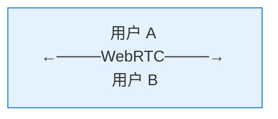
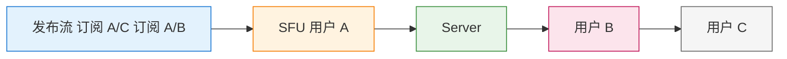
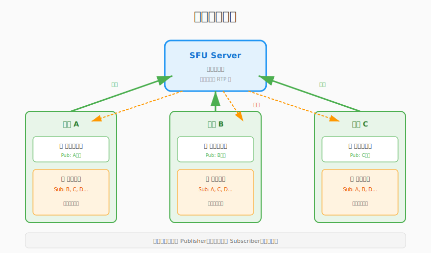
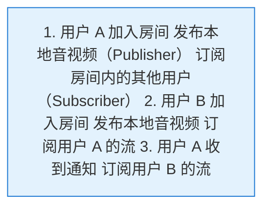
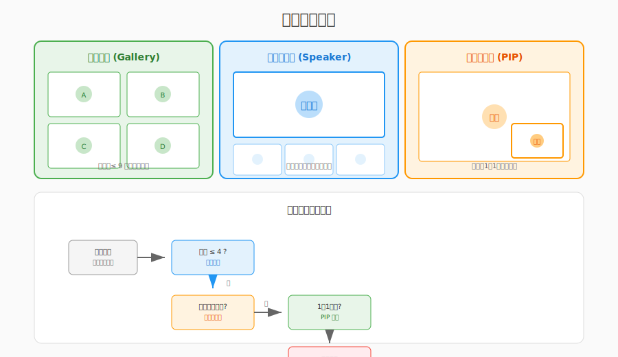
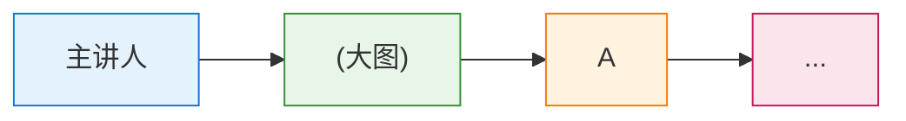
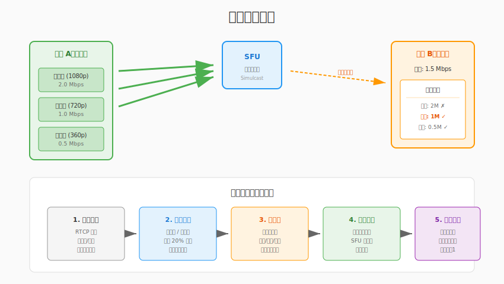
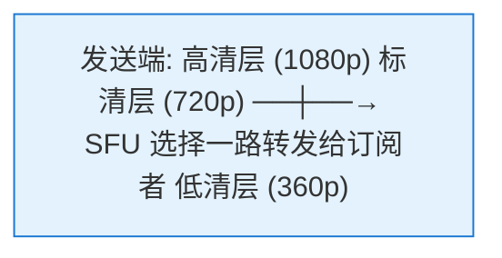
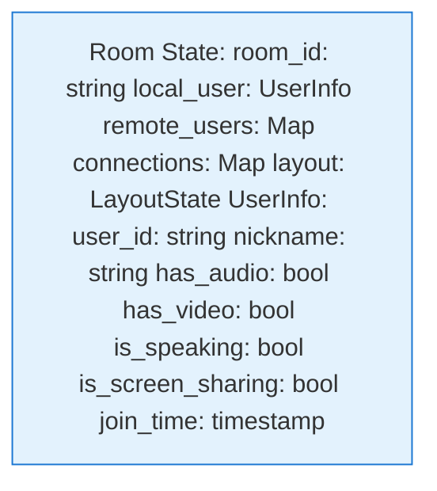
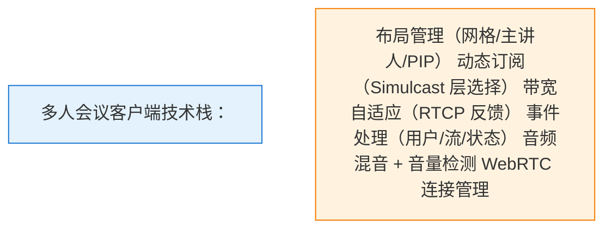

# 第23章：多人房间客户端

> **本章目标**：实现多人视频会议客户端，掌握多路视频管理、动态订阅和房间状态处理。

在前面的章节中，我们已经掌握了 P2P 通话（Ch18）、WebRTC 连接（Ch19-Ch20）和 SFU 服务器（Ch21）。现在要把这些技术组合起来，实现一个**真正的多人会议系统**。

本章你将学习：
- 多人房间的架构设计（发布/订阅模型）
- 多路视频的渲染布局（网格/主讲人模式）
- 动态订阅策略（按需接收、带宽管理）
- 房间事件处理（用户进出、音视频状态变化）

**学习本章后，你将能够**：
- 设计多人会议的客户端架构
- 实现自适应的视频布局
- 优化多路视频的带宽使用
- 处理复杂的房间状态同步

---

## 目录

1. [多人房间架构](#1-多人房间架构)
2. [多路视频渲染](#2-多路视频渲染)
3. [动态订阅策略](#3-动态订阅策略)
4. [房间事件处理](#4-房间事件处理)
5. [音频管理](#5-音频管理)
6. [本章总结](#6-本章总结)

---

## 1. 多人房间架构

### 1.1 从 P2P 到多人

**P2P（一对一）**：


**多人会议（SFU 架构）**：


**关键区别**：
- P2P：每个连接只有一个远端
- 多人：每个连接有多个远端，需要管理多路流

### 1.2 发布/订阅模型



**角色定义**：
- **Publisher（发布者）**：发送音视频流到 SFU
- **Subscriber（订阅者）**：从 SFU 接收其他用户的流
- **一个用户可以同时是发布者和订阅者**

**工作流程**：


### 1.3 客户端架构设计


**核心模块职责**：

| 模块 | 职责 |
|:---|:---|
| RoomManager | 房间生命周期、成员管理 |
| Layout | 视频布局计算、窗口分配 |
| TrackMgr | 音视频轨道管理、设备控制 |
| Subscribe | 订阅管理、带宽分配 |
| EventHandler | 房间事件处理、状态同步 |

---

## 2. 多路视频渲染

### 2.1 视频布局策略



**常见布局模式**：

#### 1) 网格布局（Gallery View）

**适用**：平等会议，所有人可见

#### 2) 主讲人模式（Speaker View）

**适用**：讲座、培训

#### 3) 画中画模式（PIP）

**适用**：自己也需要看到

### 2.2 布局计算算法

```cpp
// layout_manager.h
#pragma once

#include <vector>
#include <math>

namespace live {

struct VideoCell {
    int x, y;           // 位置
    int width, height;  // 大小
    std::string user_id; // 用户ID
    bool is_speaking;   // 是否正在说话
};

enum class LayoutMode {
    GRID,       // 网格
    SPEAKER,    // 主讲人
    PIP         // 画中画
};

class LayoutManager {
public:
    LayoutManager(int container_width, int container_height);
    
    // 设置布局模式
    void SetMode(LayoutMode mode);
    
    // 计算布局
    std::vector<VideoCell> CalculateLayout(
        const std::vector<std::string>& user_ids,
        const std::string& speaker_id);
    
    // 获取最佳行列数
    static void GetGridSize(int count, int* rows, int* cols);
    
private:
    std::vector<VideoCell> CalculateGrid(
        const std::vector<std::string>& user_ids);
    
    std::vector<VideoCell> CalculateSpeaker(
        const std::vector<std::string>& user_ids,
        const std::string& speaker_id);
    
    std::vector<VideoCell> CalculatePIP(
        const std::vector<std::string>& user_ids);
    
    int container_width_;
    int container_height_;
    LayoutMode mode_;
    static constexpr int kMinCellWidth = 200;
    static constexpr int kMinCellHeight = 150;
};

} // namespace live
```

```cpp
// layout_manager.cpp

#include "layout_manager.h"

namespace live {

LayoutManager::LayoutManager(int container_width, int container_height)
    : container_width_(container_width)
    , container_height_(container_height)
    , mode_(LayoutMode::GRID) {}

void LayoutManager::SetMode(LayoutMode mode) {
    mode_ = mode;
}

std::vector<VideoCell> LayoutManager::CalculateLayout(
    const std::vector<std::string>& user_ids,
    const std::string& speaker_id) {
    
    switch (mode_) {
    case LayoutMode::GRID:
        return CalculateGrid(user_ids);
    case LayoutMode::SPEAKER:
        return CalculateSpeaker(user_ids, speaker_id);
    case LayoutMode::PIP:
        return CalculatePIP(user_ids);
    }
    return {};
}

void LayoutManager::GetGridSize(int count, int* rows, int* cols) {
    // 计算最接近正方形的行列数
    *cols = static_cast<int>(std::ceil(std::sqrt(count)));
    *rows = static_cast<int>(std::ceil(static_cast<double>(count) / *cols));
}

std::vector<VideoCell> LayoutManager::CalculateGrid(
    const std::vector<std::string>& user_ids) {
    
    std::vector<VideoCell> cells;
    int count = static_cast<int>(user_ids.size());
    if (count == 0) return cells;
    
    int rows, cols;
    GetGridSize(count, &rows, &cols);
    
    // 计算每个单元格大小
    int cell_width = container_width_ / cols;
    int cell_height = container_height_ / rows;
    
    // 确保最小尺寸
    if (cell_width < kMinCellWidth || cell_height < kMinCellHeight) {
        // 需要滚动，这里简化处理
        cell_width = std::max(cell_width, kMinCellWidth);
        cell_height = std::max(cell_height, kMinCellHeight);
    }
    
    // 分配位置
    for (int i = 0; i < count; ++i) {
        VideoCell cell;
        cell.user_id = user_ids[i];
        cell.col = i % cols;
        cell.row = i / cols;
        cell.x = cell.col * cell_width;
        cell.y = cell.row * cell_height;
        cell.width = cell_width;
        cell.height = cell_height;
        cell.is_speaking = false;
        cells.push_back(cell);
    }
    
    return cells;
}

std::vector<VideoCell> LayoutManager::CalculateSpeaker(
    const std::vector<std::string>& user_ids,
    const std::string& speaker_id) {
    
    std::vector<VideoCell> cells;
    if (user_ids.empty()) return cells;
    
    // 主讲人占 70% 高度
    int main_height = static_cast<int>(container_height_ * 0.7);
    int thumb_height = container_height_ - main_height;
    
    // 主讲人
    auto speaker_it = std::find(user_ids.begin(), user_ids.end(), speaker_id);
    if (speaker_it != user_ids.end()) {
        VideoCell main;
        main.user_id = speaker_id;
        main.x = 0;
        main.y = 0;
        main.width = container_width_;
        main.height = main_height;
        main.is_speaking = true;
        cells.push_back(main);
    }
    
    // 缩略图
    int other_count = static_cast<int>(user_ids.size()) - 1;
    if (other_count > 0) {
        int thumb_width = container_width_ / other_count;
        int idx = 0;
        for (const auto& user_id : user_ids) {
            if (user_id == speaker_id) continue;
            
            VideoCell thumb;
            thumb.user_id = user_id;
            thumb.x = idx * thumb_width;
            thumb.y = main_height;
            thumb.width = thumb_width;
            thumb.height = thumb_height;
            thumb.is_speaking = false;
            cells.push_back(thumb);
            ++idx;
        }
    }
    
    return cells;
}

} // namespace live
```

### 2.3 SDL2 多窗口渲染

```cpp
// multi_video_renderer.h
#pragma once

#include <SDL2/SDL.h>
#include <map>
#include <string>
#include "layout_manager.h"

namespace live {

class MultiVideoRenderer {
public:
    MultiVideoRenderer(int width, int height);
    ~MultiVideoRenderer();
    
    bool Initialize();
    void Shutdown();
    
    // 更新布局
    void UpdateLayout(const std::vector<VideoCell>& cells);
    
    // 渲染视频帧
    void RenderFrame(const std::string& user_id,
                     const uint8_t* y_plane, const uint8_t* u_plane, 
                     const uint8_t* v_plane,
                     int y_pitch, int u_pitch, int v_pitch,
                     int width, int height);
    
    // 渲染所有（包括背景、边框等）
    void Render();
    
private:
    struct VideoTexture {
        SDL_Texture* texture = nullptr;
        int width = 0;
        int height = 0;
        std::string user_id;
        VideoCell cell;
    };
    
    SDL_Window* window_ = nullptr;
    SDL_Renderer* renderer_ = nullptr;
    std::map<std::string, VideoTexture> textures_;
    std::vector<VideoCell> current_layout_;
    
    int container_width_;
    int container_height_;
};

} // namespace live
```

---

## 3. 动态订阅策略

### 3.1 为什么需要动态订阅？

**问题**：
- 10 人会议，每人发送 2Mbps
- 如果订阅所有 9 路流，需要 18Mbps 下行带宽
- 大部分用户没有这么高的带宽

**解决方案**：动态订阅



### 3.2 订阅策略类型

| 策略 | 描述 | 适用场景 |
|:---|:---|:---|
| **全订阅** | 订阅所有参与者的流 | ≤4 人会议 |
| **按需订阅** | 只订阅正在说话的人 | 大型会议 |
| **分页订阅** | 订阅当前页的人 |  webinars |
| **分层订阅** | 根据 Simulcast 层选择质量 | 自适应带宽 |

### 3.3 Simulcast 分层订阅

SFU 支持 Simulcast（分层编码），发送端同时发送多路质量：


**订阅决策**：
```cpp
enum class SimulcastLayer {
    HIGH,   // 1080p, 2Mbps
    MEDIUM, // 720p, 1Mbps
    LOW     // 360p, 0.5Mbps
};

class SubscriptionManager {
public:
    // 根据带宽和窗口大小选择层
    SimulcastLayer SelectLayer(
        int available_bandwidth,  // kbps
        int video_width,          // 渲染窗口宽度
        const std::string& user_id
    ) {
        // 1. 带宽检查
        if (available_bandwidth < 600) {
            return SimulcastLayer::LOW;
        } else if (available_bandwidth < 1200) {
            return SimulcastLayer::MEDIUM;
        }
        
        // 2. 窗口大小检查
        if (video_width < 480) {
            return SimulcastLayer::LOW;
        } else if (video_width < 960) {
            return SimulcastLayer::MEDIUM;
        }
        
        return SimulcastLayer::HIGH;
    }
    
    // 订阅指定层
    void SubscribeLayer(const std::string& user_id, SimulcastLayer layer);
    
    // 取消订阅
    void Unsubscribe(const std::string& user_id);
    
private:
    struct Subscription {
        std::string user_id;
        SimulcastLayer current_layer;
        bool audio_enabled;
        bool video_enabled;
    };
    
    std::map<std::string, Subscription> subscriptions_;
    int total_bandwidth_used_ = 0;
    static constexpr int kBandwidthReserve = 200; // 保留 200kbps
};
```

### 3.4 带宽自适应

```cpp
class BandwidthEstimator {
public:
    // 基于 RTCP Receiver Report 估计带宽
    void OnReceiverReport(const ReceiverReport& rr);
    
    // 获取估计带宽 (kbps)
    int GetEstimatedBandwidth() const {
        return estimated_bandwidth_;
    }
    
    // 检测拥塞
    bool IsCongested() const {
        return packet_loss_rate_ > 0.05; // 5% 丢包视为拥塞
    }
    
private:
    int estimated_bandwidth_ = 2000; // 初始估计 2Mbps
    float packet_loss_rate_ = 0.0;
    int rtt_ms_ = 50;
    
    // 指数移动平均系数
    static constexpr float kAlpha = 0.8;
};

void BandwidthEstimator::OnReceiverReport(const ReceiverReport& rr) {
    // 更新丢包率
    packet_loss_rate_ = rr.fraction_lost / 255.0f;
    
    // 基于丢包调整带宽估计
    if (packet_loss_rate_ > 0.1) {
        // 严重拥塞，大幅降低
        estimated_bandwidth_ = static_cast<int>(
            estimated_bandwidth_ * 0.7);
    } else if (packet_loss_rate_ > 0.02) {
        // 轻微拥塞，适当降低
        estimated_bandwidth_ = static_cast<int>(
            estimated_bandwidth_ * 0.9);
    } else {
        // 网络良好，可以尝试增加
        estimated_bandwidth_ = static_cast<int>(
            estimated_bandwidth_ * 1.05);
    }
    
    // 限制范围
    estimated_bandwidth_ = std::clamp(estimated_bandwidth_, 200, 10000);
}
```

---

## 4. 房间事件处理

### 4.1 房间状态模型



### 4.2 事件类型

| 事件 | 描述 | 处理动作 |
|:---|:---|:---|
| `user-joined` | 新用户加入 | 创建订阅、添加视频格子 |
| `user-left` | 用户离开 | 关闭订阅、移除视频格子 |
| `stream-added` | 用户发布流 | 订阅流、绑定渲染 |
| `stream-removed` | 用户停止发布 | 取消订阅 |
| `audio-status-changed` | 音频开关 | 更新 UI 状态 |
| `video-status-changed` | 视频开关 | 更新 UI 状态 |
| `speaking-changed` | 说话状态 | 高亮显示 |
| `active-speaker` | 当前主讲人 | 切换布局 |

### 4.3 事件处理器实现

```cpp
// room_event_handler.h
#pragma once

#include <functional>
#include <json/json.h>

namespace live {

enum class RoomEventType {
    USER_JOINED,
    USER_LEFT,
    STREAM_ADDED,
    STREAM_REMOVED,
    AUDIO_STATUS_CHANGED,
    VIDEO_STATUS_CHANGED,
    SPEAKING_CHANGED,
    ACTIVE_SPEAKER_CHANGED,
    CONNECTION_STATE_CHANGED,
    ERROR
};

struct RoomEvent {
    RoomEventType type;
    std::string user_id;
    Json::Value data;
};

class RoomEventHandler {
public:
    using EventCallback = std::function<void(const RoomEvent&)>;
    
    void RegisterCallback(RoomEventType type, EventCallback callback);
    void HandleEvent(const RoomEvent& event);
    
    // 具体事件处理
    void OnUserJoined(const std::string& user_id, const Json::Value& user_info);
    void OnUserLeft(const std::string& user_id);
    void OnStreamAdded(const std::string& user_id, const std::string& stream_type);
    void OnStreamRemoved(const std::string& user_id);
    void OnSpeakingChanged(const std::string& user_id, bool is_speaking);
    void OnActiveSpeakerChanged(const std::string& user_id);
    
private:
    std::map<RoomEventType, std::vector<EventCallback>> callbacks_;
};

} // namespace live
```

```cpp
// room_event_handler.cpp

#include "room_event_handler.h"

namespace live {

void RoomEventHandler::RegisterCallback(RoomEventType type, 
                                         EventCallback callback) {
    callbacks_[type].push_back(callback);
}

void RoomEventHandler::HandleEvent(const RoomEvent& event) {
    auto it = callbacks_.find(event.type);
    if (it != callbacks_.end()) {
        for (const auto& callback : it->second) {
            callback(event);
        }
    }
}

void RoomEventHandler::OnUserJoined(const std::string& user_id,
                                     const Json::Value& user_info) {
    RoomEvent event;
    event.type = RoomEventType::USER_JOINED;
    event.user_id = user_id;
    event.data = user_info;
    HandleEvent(event);
    
    LOG_INFO("User joined: %s, nickname: %s", 
             user_id.c_str(), 
             user_info["nickname"].asString().c_str());
}

void RoomEventHandler::OnUserLeft(const std::string& user_id) {
    RoomEvent event;
    event.type = RoomEventType::USER_LEFT;
    event.user_id = user_id;
    HandleEvent(event);
    
    LOG_INFO("User left: %s", user_id.c_str());
}

void RoomEventHandler::OnSpeakingChanged(const std::string& user_id,
                                          bool is_speaking) {
    RoomEvent event;
    event.type = RoomEventType::SPEAKING_CHANGED;
    event.user_id = user_id;
    event.data["is_speaking"] = is_speaking;
    HandleEvent(event);
    
    LOG_DEBUG("User %s speaking state: %s",
              user_id.c_str(), is_speaking ? "true" : "false");
}

void RoomEventHandler::OnActiveSpeakerChanged(const std::string& user_id) {
    RoomEvent event;
    event.type = RoomEventType::ACTIVE_SPEAKER_CHANGED;
    event.user_id = user_id;
    HandleEvent(event);
    
    LOG_INFO("Active speaker changed to: %s", user_id.c_str());
}

} // namespace live
```

### 4.4 信令消息格式

```json
// 用户加入通知
{
  "type": "user-joined",
  "user_id": "user_123",
  "nickname": "张三",
  "timestamp": 1699000000000
}

// 流发布通知
{
  "type": "stream-added",
  "user_id": "user_123",
  "stream_id": "stream_456",
  "audio": true,
  "video": true,
  "simulcast": ["high", "medium", "low"]
}

// 说话检测通知
{
  "type": "speaking-changed",
  "user_id": "user_123",
  "is_speaking": true,
  "audio_level": 0.75
}

// 订阅请求
{
  "type": "subscribe",
  "target_user_id": "user_123",
  "audio": true,
  "video": true,
  "layer": "medium"
}
```

---

## 5. 音频管理

### 5.1 客户端音频混音

多人会议中，如果同时播放多个远端音频，需要混音处理：

```cpp
class AudioMixer {
public:
    // 添加音频源
    void AddSource(const std::string& user_id);
    
    // 移除音频源
    void RemoveSource(const std::string& user_id);
    
    // 输入音频帧
    void PushAudio(const std::string& user_id, 
                   const int16_t* pcm_data, 
                   int samples);
    
    // 获取混音后的音频
    void GetMixedAudio(int16_t* output, int samples);
    
private:
    struct AudioSource {
        std::queue<std::vector<int16_t>> buffer;
        float volume = 1.0f;
        bool muted = false;
    };
    
    std::map<std::string, AudioSource> sources_;
    std::mutex mutex_;
};

void AudioMixer::GetMixedAudio(int16_t* output, int samples) {
    std::lock_guard<std::mutex> lock(mutex_);
    
    // 清零输出
    std::fill(output, output + samples, 0);
    
    // 混音
    for (auto& [user_id, source] : sources_) {
        if (source.muted || source.buffer.empty()) continue;
        
        auto& frame = source.buffer.front();
        int frame_samples = static_cast<int>(frame.size());
        int mix_samples = std::min(samples, frame_samples);
        
        for (int i = 0; i < mix_samples; ++i) {
            // 简单叠加（实际需要溢出处理）
            int32_t sum = output[i] + static_cast<int32_t>(
                frame[i] * source.volume);
            output[i] = static_cast<int16_t>(
                std::clamp(sum, -32768, 32767));
        }
        
        source.buffer.pop();
    }
}
```

### 5.2 音量检测（VU Meter）

```cpp
class VolumeDetector {
public:
    // 计算音频帧的 RMS 音量
    float CalculateVolume(const int16_t* pcm_data, int samples) {
        double sum_squares = 0.0;
        for (int i = 0; i < samples; ++i) {
            sum_squares += pcm_data[i] * pcm_data[i];
        }
        double rms = std::sqrt(sum_squares / samples);
        
        // 归一化到 0-1
        return static_cast<float>(
            std::min(rms / 32768.0, 1.0));
    }
    
    // 检测是否正在说话（阈值检测）
    bool IsSpeaking(const int16_t* pcm_data, int samples) {
        float volume = CalculateVolume(pcm_data, samples);
        
        // 应用平滑
        smoothed_volume_ = smoothed_volume_ * 0.8f + volume * 0.2f;
        
        // 迟滞比较，避免抖动
        if (smoothed_volume_ > kSpeakingThreshold) {
            is_speaking_ = true;
        } else if (smoothed_volume_ < kSpeakingThreshold * 0.7f) {
            is_speaking_ = false;
        }
        
        return is_speaking_;
    }
    
private:
    float smoothed_volume_ = 0.0f;
    bool is_speaking_ = false;
    static constexpr float kSpeakingThreshold = 0.05f;
};
```

---

## 6. 本章总结

### 6.1 核心概念回顾



### 6.2 关键学习点

1. **发布/订阅模型**：灵活控制接收哪些流
2. **动态布局**：根据人数和模式自动调整
3. **带宽管理**：Simulcast + 自适应层选择
4. **事件驱动**：房间状态变化及时响应
5. **音频处理**：混音 + 说话检测

### 6.3 与下一章的衔接

本章完成了**客户端**的多人会议功能。但要支持更多用户（如 100+ 人），单靠 SFU 还不够，需要考虑 **MCU 混音混画** 来降低下行带宽。

下一章 **MCU 混音混画详解** 将介绍服务端如何混合多路音视频，让每个人都能以较低带宽观看统一画面。

---

## 课后思考

1. **布局算法优化**：当用户超过 16 人时，网格布局需要分页或滚动。如何设计合理的分页策略？

2. **带宽分配**：假设总带宽 2Mbps，房间内 6 个远端用户，如何分配每个人的订阅质量？是平均分配还是按需分配？

3. **说话检测延迟**：说话检测通常有 100-200ms 的检测延迟，如何让用户感知不到切换主讲人的延迟？

4. **音频混音性能**：10 人会议意味着 10 路音频混音。如何优化混音算法以降低 CPU 占用？（提示：只混活跃说话者）
