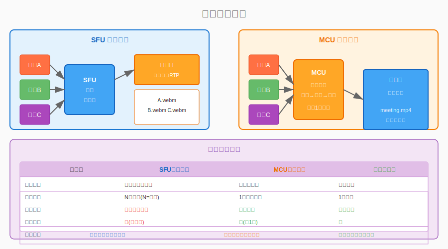
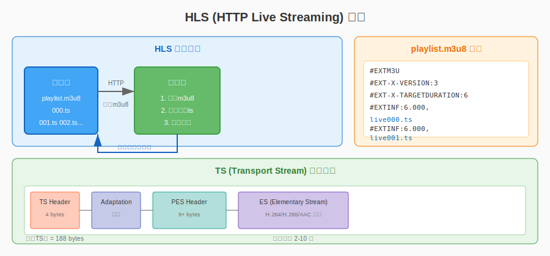
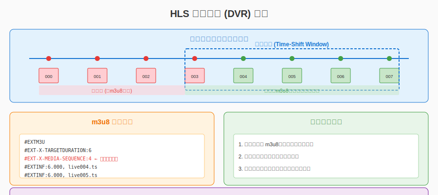
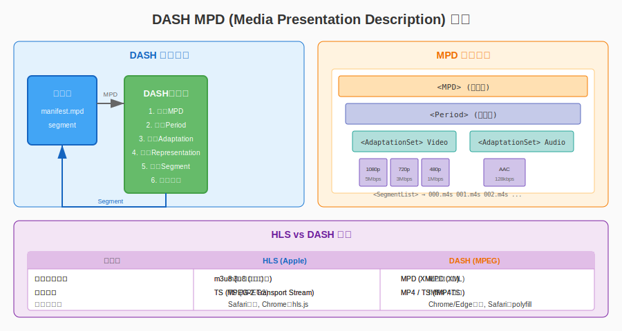

# 第二十四章：录制与回放

> **本章目标**：掌握直播系统的录制与回放技术，实现云端录制、时移回放和多码率自适应播放。

在上一章（第二十三章）中，我们学习了 MCU 混音混画技术，理解了如何将多路音视频合成为一路。MCU 的一个重要应用场景就是**云端录制**——将混合后的音视频流直接存储，便于后期回放和处理。

录制与回放是直播系统的核心功能之一，无论是教育直播的课程回放、会议系统的存档、还是直播平台的违规审核，都离不开完善的录制方案。

**学习本章后，你将能够**：
- 设计单流录制和合流录制的架构
- 实现服务端录制和客户端录制
- 使用 HLS 实现直播时移回放
- 理解 DASH 协议和自适应码率
- 构建完整的录制服务

---

## 目录

1. [录制需求分析](#1-录制需求分析)
2. [服务端录制](#2-服务端录制)
3. [HLS 时移回放](#3-hls-时移回放)
4. [DASH 协议](#4-dash-协议)
5. [录制服务实现](#5-录制服务实现)
6. [本章总结](#6-本章总结)

---

## 1. 录制需求分析

### 1.1 为什么需要录制？

录制功能在直播系统中扮演着重要角色：

**业务场景**：
- **课程回放**：教育直播结束后，学生可以回看课程内容
- **会议存档**：企业会议录制后供缺席人员查看
- **内容审核**：直播平台需要录制内容用于违规审查
- **精彩剪辑**：体育赛事、游戏直播的精彩片段提取
- **合规要求**：金融直播等需要完整存档备查

**技术要求**：
- **可靠性**：录制不能丢失数据
- **实时性**：延迟不能太高（相对于直播）
- **可回放性**：录制的文件要易于播放
- **存储效率**：合理的文件大小和存储成本

### 1.2 单流录制 vs 合流录制

根据录制时机和内容的不同，录制方案可以分为两大类：



#### 方案 1：单流录制 (SFU 录制)

**原理**：在 SFU 服务器上，直接存储每个参与者发来的原始流，不进行混音混画。

```
┌─────────────────────────────────────────────────────────┐
│                    SFU 单流录制                         │
├─────────────────────────────────────────────────────────┤
│                                                         │
│   用户 A ──→┌─────────┐                                 │
│             │   SFU   │──→ 存储 A.webm (用户A的原始流)  │
│   用户 B ──→│ Server  │                                 │
│             │(不解码) │──→ 存储 B.webm (用户B的原始流)  │
│   用户 C ──→└─────────┘                                 │
│                                                         │
│   录制结果: 多个独立文件，需要后期合成                    │
└─────────────────────────────────────────────────────────┘
```

**优点**：
- 实现简单：直接存储 RTP 包，不解码
- 数据完整：每路流都是原始质量
- 后期灵活：可以重新选择布局、单独导出某人

**缺点**：
- 文件多：N 人会议产生 N 个文件
- 回放复杂：需要专门的播放器同步播放多路流
- 后期工作量大：需要离线合成才能生成合流视频

#### 方案 2：合流录制 (MCU 录制)

**原理**：在 MCU 服务器上，将多路音视频混音混画后，存储合成的一路流。

```
┌─────────────────────────────────────────────────────────┐
│                    MCU 合流录制                         │
├─────────────────────────────────────────────────────────┤
│                                                         │
│   用户 A ──┐                                            │
│   用户 B ──→┌─────────┐                                 │
│   用户 C ──→│   MCU   │──混音混画──→ 存储 meeting.mp4  │
│   用户 D ──→│ Server  │                                 │
│             │(解码→合成→编码)│                          │
│             └─────────┘                                 │
│                                                         │
│   录制结果: 单个文件，可直接播放                        │
└─────────────────────────────────────────────────────────┘
```

**优点**：
- 文件单一：一个会议对应一个文件
- 即录即用：录制完成即可播放，无需后期处理
- 兼容性好：标准 MP4 文件，任何播放器都能播放
- 适合直播：可以直接推流到 CDN

**缺点**：
- 布局固定：录制时的布局无法改变
- 质量损失：混音混画、重新编码会损失一些质量
- 服务器压力大：MCU 本身消耗大量 CPU

#### 方案 3：客户端录制

**原理**：在用户的客户端本地进行录制，录制自己的音视频或合流。

```
┌─────────────────────────────────────────────────────────┐
│                    客户端录制                           │
├─────────────────────────────────────────────────────────┤
│                                                         │
│   浏览器/客户端                                          │
│   ┌─────────────────────────────────────┐              │
│   │  getUserMedia ──→ MediaRecorder   │              │
│   │                    ↓               │              │
│   │                 存储为 WebM/MP4    │              │
│   └─────────────────────────────────────┘              │
│                                                         │
│   录制结果: 本地文件，不上传到服务器                    │
└─────────────────────────────────────────────────────────┘
```

**优点**：
- 服务器无压力：不占用服务端资源
- 隐私性好：敏感数据不会离开用户设备
- 实时预览：用户可以立即看到录制效果

**缺点**：
- 可靠性差：客户端崩溃可能导致录制失败
- 存储分散：每个用户本地有一份，难以集中管理
- 无法录制他人：只能录制自己看到的画面

### 1.3 录制格式选择

#### 格式 1：WebM

**特点**：
- 开源免费，无专利费
- 支持 VP8/VP9 视频 + Opus 音频
- 浏览器原生支持（MediaRecorder 默认输出）
- 适合 WebRTC 场景

**适用**：浏览器录制、WebRTC 服务端录制

#### 格式 2：MP4 (H.264/AAC)

**特点**：
- 兼容性最好，几乎所有设备都支持
- H.264 有专利费（但浏览器已包含授权）
- 适合长期存档和播放
- 支持流式写入（moov atom 前置）

**适用**：服务端合流录制、需要广泛兼容的场景

#### 格式 3：MKV

**特点**：
- 开源容器格式，功能强大
- 支持几乎所有音视频编码
- 文件较大，兼容性不如 MP4

**适用**：需要保存多音轨、字幕的复杂场景

#### 格式 4：TS (Transport Stream)

**特点**：
- MPEG-2 标准，广播电视使用
- 支持边录边播（切片存储）
- HLS 协议的基础格式

**适用**：直播切片、时移回放

### 1.4 方案对比总结

| 方案 | 文件数 | 后期处理 | 服务器压力 | 适用场景 |
|:---|:---:|:---:|:---:|:---|
| SFU 单流录制 | N | 需要离线合成 | 低 | 需要后期编辑、多视角回放 |
| MCU 合流录制 | 1 | 直接可用 | 高 | 常规会议录制、直播存档 |
| 客户端录制 | 1/N | 视情况而定 | 无 | 本地存档、合规要求 |

---

## 2. 服务端录制

### 2.1 从 SFU 录制原始流

SFU 录制的核心思想是"不解码直接存储"——服务器收到 RTP 包后，直接写入文件，不做任何处理。

```cpp
namespace live {

// SFU 录制器
class SfuRecorder {
public:
    // 开始录制某路流
    bool StartRecording(const std::string& stream_id,
                       const std::string& output_path);
    
    // 停止录制
    void StopRecording(const std::string& stream_id);
    
    // 收到 RTP 包时调用
    void OnRtpPacket(const std::string& stream_id,
                    const uint8_t* rtp_data,
                    size_t len);
    
private:
    struct RecordingSession {
        std::string stream_id;
        std::ofstream file;
        std::string output_path;
        int64_t start_time;
        uint64_t bytes_written = 0;
    };
    
    std::unordered_map<std::string, 
                       std::unique_ptr<RecordingSession>> sessions_;
    std::mutex mutex_;
};

// 简单的 WebM 写入器 (简化版)
class WebMWriter {
public:
    bool Open(const std::string& path);
    void Close();
    
    // 写入 RTP 包 (需要解析并重新打包为 WebM)
    void WriteRtpPacket(const uint8_t* rtp_data, size_t len);
    
private:
    std::ofstream file_;
    // WebM 相关的写入状态...
};

} // namespace live
```

**SFU 录制的技术要点**：

1. **RTP 到文件的转换**：
   - RTP 包需要按照时间戳排序
   - 需要解析 RTP 头部，提取 payload
   - 将 payload 写入 WebM/MP4 容器

2. **时间戳处理**：
   - RTP 时间戳是相对的，需要转换为绝对时间
   - 处理时间戳回绕 (wrap around)
   - 确保音画同步

3. **文件格式选择**：
   - WebRTC 通常使用 WebM (VP8/Opus)
   - 也可以转封装为 MP4 (H.264/AAC)

### 2.2 从 MCU 录制合流

MCU 录制相对简单，因为 MCU 已经输出了混合编码后的流，只需要直接存储即可。

```cpp
namespace live {

// MCU 录制器
class McuRecorder {
public:
    // 开始录制
    bool StartRecording(const std::string& room_id,
                       const std::string& output_dir);
    
    // 停止录制
    void StopRecording(const std::string& room_id);
    
    // 写入混音后的音频帧
    void WriteAudioFrame(const std::string& room_id,
                        const EncodedFrame& frame);
    
    // 写入混画后的视频帧
    void WriteVideoFrame(const std::string& room_id,
                        const EncodedFrame& frame);
    
private:
    struct RecordingContext {
        std::string room_id;
        std::unique_ptr<MP4Muxer> muxer;
        int64_t start_time;
        int64_t duration_ms = 0;
    };
    
    std::unordered_map<std::string,
                       std::unique_ptr<RecordingContext>> contexts_;
};

// MP4 封装器
class MP4Muxer {
public:
    bool Initialize(const std::string& output_path,
                   int video_width, int video_height,
                   int video_fps,
                   int audio_sample_rate,
                   int audio_channels);
    
    // 写入编码后的视频帧
    void WriteVideoFrame(const uint8_t* data, size_t len,
                        int64_t pts, bool is_keyframe);
    
    // 写入编码后的音频帧
    void WriteAudioFrame(const uint8_t* data, size_t len,
                        int64_t pts);
    
    // 结束录制，写入文件尾
    void Finalize();
    
private:
    // 使用 FFmpeg 的 libavformat 实现
    AVFormatContext* format_ctx_ = nullptr;
    AVStream* video_stream_ = nullptr;
    AVStream* audio_stream_ = nullptr;
    bool initialized_ = false;
};

} // namespace live
```

**MCU 录制的技术要点**：

1. **容器格式选择**：
   - MP4：兼容性最好，但需要结束时写入 moov atom
   - TS：支持边录边播，适合直播场景
   - WebM：开源免费，适合 VP8/VP9

2. **流式写入优化**：
   - 传统 MP4 需要结束时才能确定文件头
   - 可以使用 fragmented MP4 (fMP4) 支持流式
   - 或者使用 `-movflags faststart` 让 moov 前置

3. **关键帧对齐**：
   - 录制的视频需要定期产生关键帧 (IDR)
   - 通常每 2-4 秒一个关键帧
   - 方便后期剪辑和拖动

### 2.3 文件分段策略

长时间录制会产生巨大的文件，需要进行分段存储：

**方案 1：按时间分段**

```cpp
namespace live {

class SegmentedRecorder {
public:
    void SetSegmentDuration(int64_t duration_ms) {
        segment_duration_ms_ = duration_ms;
    }
    
    void WriteFrame(const EncodedFrame& frame) {
        // 检查是否需要开启新分段
        if (current_segment_duration_ >= segment_duration_ms_) {
            if (current_writer_) {
                current_writer_->Finalize();
            }
            StartNewSegment();
        }
        
        current_writer_->WriteFrame(frame);
        current_segment_duration_ += frame.duration_ms;
    }
    
private:
    int64_t segment_duration_ms_ = 3600000;  // 默认 1 小时
    int64_t current_segment_duration_ = 0;
    std::unique_ptr<MP4Muxer> current_writer_;
    int segment_index_ = 0;
};

} // namespace live
```

**方案 2：按文件大小分段**

```cpp
// 当文件大小超过阈值时开启新分段
static constexpr size_t kMaxFileSize = 2ULL * 1024 * 1024 * 1024;  // 2GB

void CheckAndRotate() {
    if (current_file_size_ >= kMaxFileSize) {
        StartNewSegment();
    }
}
```

**方案 3：切片录制 (HLS)**

将录制内容切分为固定时长的 TS 切片：

```cpp
namespace live {

class HlsRecorder {
public:
    bool Initialize(const std::string& output_dir,
                   int segment_duration_sec);
    
    // 写入视频帧
    void WriteVideoFrame(const uint8_t* data, size_t len,
                        int64_t pts, bool is_keyframe);
    
    // 写入音频帧
    void WriteAudioFrame(const uint8_t* data, size_t len,
                        int64_t pts);
    
private:
    void FlushSegment();  // 结束当前切片
    void UpdatePlaylist(); // 更新 m3u8 文件
    
    std::string output_dir_;
    int segment_duration_sec_;
    int current_segment_index_ = 0;
    std::unique_ptr<TSWriter> current_ts_writer_;
    std::vector<SegmentInfo> segments_;
};

} // namespace live
```

### 2.4 录制可靠性保障

录制是核心业务功能，需要保证高可靠性：

**1. 磁盘空间监控**

```cpp
class DiskMonitor {
public:
    // 检查磁盘空间
    bool CheckSpace(const std::string& path, size_t min_free_mb);
    
    // 清理旧录制
    void CleanupOldRecordings(const std::string& dir,
                             int max_age_days);
};
```

**2. 录制状态监控**

```cpp
struct RecordingMetrics {
    int64_t start_time;
    int64_t duration_ms;
    uint64_t bytes_written;
    uint64_t packets_received;
    uint64_t packets_dropped;
    float disk_usage_percent;
};
```

**3. 异常恢复**

```cpp
class ResumableRecorder {
public:
    // 自动恢复录制
    void OnError(const std::string& error);
    bool TryResume();
    
private:
    int retry_count_ = 0;
    static constexpr int kMaxRetries = 3;
};
```

---

## 3. HLS 时移回放

### 3.1 HLS 原理

HLS（HTTP Live Streaming）是 Apple 提出的基于 HTTP 的流媒体协议，广泛应用于直播和点播场景。



**核心组件**：

1. **m3u8 索引文件**：文本格式的播放列表，包含切片列表
2. **TS 切片文件**：实际的音视频数据，通常 2-10 秒一个

**播放流程**：

```
1. 播放器请求 m3u8 索引文件
2. 解析 m3u8，获取 TS 切片列表
3. 按顺序下载 TS 切片
4. 解码并播放
5. 定期重新请求 m3u8 获取新切片（直播场景）
```

### 3.2 m3u8 索引详解

**直播 m3u8 示例**：

```m3u8
#EXTM3U
#EXT-X-VERSION:3
#EXT-X-TARGETDURATION:6          // 最大切片时长
#EXT-X-MEDIA-SEQUENCE:0          // 第一个切片的序列号

#EXTINF:6.000,                   // 切片时长
live000.ts
#EXTINF:6.000,
live001.ts
#EXTINF:6.000,
live002.ts
#EXTINF:6.000,
live003.ts
```

**关键字段解释**：

| 字段 | 说明 |
|:---|:---|
| `#EXTM3U` | 文件头，标识这是 m3u8 文件 |
| `#EXT-X-VERSION` | HLS 版本，3 支持浮点时长 |
| `#EXT-X-TARGETDURATION` | 切片最大时长（秒） |
| `#EXT-X-MEDIA-SEQUENCE` | 第一个切片的序列号 |
| `#EXTINF` | 当前切片的精确时长 |

**点播 m3u8 示例**：

```m3u8
#EXTM3U
#EXT-X-VERSION:3
#EXT-X-TARGETDURATION:6
#EXT-X-PLAYLIST-TYPE:VOD       // VOD = 点播，不滑动
#EXT-X-MEDIA-SEQUENCE:0

#EXTINF:6.000,
segment0.ts
#EXTINF:6.000,
segment1.ts
...

#EXT-X-ENDLIST                  // 文件结束标记
```

### 3.3 实时切片

**切片时机**：

```
编码器输出 ──→ 切片器 ──→ 000.ts ──→ 001.ts ──→ 002.ts
                 ↓
              更新 m3u8
```

**关键帧对齐**：
- 切片必须在关键帧处切割
- 否则播放器无法独立解码该切片
- 通常设置 GOP 大小 = 切片时长

```cpp
namespace live {

class HlsSegmenter {
public:
    bool Initialize(const std::string& output_dir,
                   int segment_duration_sec);
    
    // 写入编码后的视频帧
    void WriteVideoFrame(const EncodedFrame& frame);
    
    // 写入编码后的音频帧
    void WriteAudioFrame(const EncodedFrame& frame);
    
private:
    void MaybeCutSegment(bool force_keyframe);
    void WritePlaylist();
    
    std::string output_dir_;
    int segment_duration_sec_;
    int segment_index_ = 0;
    
    int64_t current_segment_pts_ = 0;
    int64_t current_segment_duration_ = 0;
    
    std::unique_ptr<TSWriter> current_writer_;
    std::vector<SegmentInfo> segments_;
    static constexpr size_t kMaxSegments = 6;  // 滑动窗口大小
};

} // namespace live
```

### 3.4 时移窗口



**滑动窗口机制**：

直播时，m3u8 只保留最近 N 个切片，旧的切片从索引中移除：

```m3u8
# 第1秒时的 m3u8
#EXT-X-MEDIA-SEQUENCE:0
000.ts
001.ts
002.ts
003.ts

# 第7秒时的 m3u8 (窗口滑动)
#EXT-X-MEDIA-SEQUENCE:1
001.ts
002.ts
003.ts
004.ts
```

**时移回放的实现**：

1. **增大窗口**：保留更多切片（如 4 小时）
2. **播放器支持**：播放器可以拖动进度条选择时间点
3. **从指定点开始播放**：计算时间点对应的切片，从该切片开始播放

```cpp
namespace live {

// 支持时移的 HLS 录制器
class HlsDvrRecorder {
public:
    // 设置时移窗口大小（秒）
    void SetDvrWindow(int window_seconds) {
        dvr_window_seconds_ = window_seconds;
        max_segments_ = window_seconds / segment_duration_sec_;
    }
    
    // 获取时移 m3u8（包含更多历史切片）
    std::string GetDvrPlaylist(int start_time_offset);
    
private:
    int dvr_window_seconds_ = 14400;  // 默认 4 小时
    size_t max_segments_ = 2400;      // 4小时 / 6秒切片
    
    // 保存所有历史切片信息
    std::deque<SegmentInfo> all_segments_;
};

} // namespace live
```

---

## 4. DASH 协议

### 4.1 DASH vs HLS

DASH（Dynamic Adaptive Streaming over HTTP）是 MPEG 制定的国际标准，与 HLS 类似，但在某些方面更先进。



| 特性 | HLS | DASH |
|:---|:---|:---|
| **标准化组织** | Apple | MPEG |
| **索引文件** | m3u8 (文本) | MPD (XML) |
| **切片格式** | TS (MPEG-2) | fMP4 / TS |
| **自适应码率** | 支持 | 原生支持，更灵活 |
| **浏览器支持** | Safari 原生 | Chrome/Edge 原生 |
| **直播延迟** | 较高 (10-30s) | 可配置，支持低延迟 DASH |

### 4.2 MPD 描述文件

MPD（Media Presentation Description）是 DASH 的索引文件，使用 XML 格式：

```xml
<?xml version="1.0" encoding="UTF-8"?>
<MPD xmlns="urn:mpeg:dash:schema:mpd:2011"
     type="dynamic"
     minimumUpdatePeriod="PT6S"
     minBufferTime="PT2S"
     profiles="urn:mpeg:dash:profile:isoff-live:2011">
  
  <Period id="1" start="PT0S">
    <!-- 视频 AdaptationSet -->
    <AdaptationSet mimeType="video/mp4" 
                    codecs="avc1.42c01e"
                    frameRate="30">
      <Representation id="720p" 
                      bandwidth="3000000"
                      width="1280"
                      height="720">
        <SegmentTemplate 
          initialization="init-video.mp4"
          media="video_$Number$.m4s"
          startNumber="1"
          timescale="1000"
          duration="6000" />
      </Representation>
      
      <Representation id="480p" 
                      bandwidth="1500000"
                      width="854"
                      height="480">
        <SegmentTemplate 
          initialization="init-video-480p.mp4"
          media="video-480p_$Number$.m4s"
          duration="6000" />
      </Representation>
    </AdaptationSet>
    
    <!-- 音频 AdaptationSet -->
    <AdaptationSet mimeType="audio/mp4"
                    codecs="mp4a.40.2">
      <Representation id="audio"
                      bandwidth="128000">
        <SegmentTemplate
          initialization="init-audio.mp4"
          media="audio_$Number$.m4s"
          duration="6000" />
      </Representation>
    </AdaptationSet>
  </Period>
</MPD>
```

**关键概念**：

| 概念 | 说明 |
|:---|:---|
| **Period** | 一个时间段，直播通常只有一个 Period |
| **AdaptationSet** | 一组可以切换的 Representation，通常视频、音频各一个 |
| **Representation** | 一个具体的码率/分辨率版本 |
| **Segment** | 切片，类似 HLS 的 TS 文件 |
| **SegmentTemplate** | 切片命名模板，用于生成切片 URL |

### 4.3 多码率自适应

DASH 原生支持根据网络状况自动切换码率：

```cpp
namespace live {

// DASH 自适应码率控制器 (简化概念)
class DashAbrController {
public:
    // 根据当前网络状况选择最佳 Representation
    std::string SelectRepresentation(
        const std::vector<Representation>& reps,
        int current_bandwidth_kbps);
    
private:
    // 带宽估计
    int EstimateBandwidth();
    
    // 缓冲区管理
    double buffer_level_sec_ = 0.0;
    static constexpr double kMinBufferSec = 10.0;
    static constexpr double kMaxBufferSec = 30.0;
};

// ABR 算法示意
std::string DashAbrController::SelectRepresentation(
    const std::vector<Representation>& reps,
    int current_bandwidth_kbps) {
    
    // 按带宽排序
    std::vector<Representation> sorted = reps;
    std::sort(sorted.begin(), sorted.end(),
             [](const Representation& a, const Representation& b) {
                 return a.bandwidth < b.bandwidth;
             });
    
    // 选择不超过当前带宽 80% 的最高码率
    int target_bandwidth = current_bandwidth_kbps * 0.8;
    
    // 根据缓冲区状态调整
    if (buffer_level_sec_ < kMinBufferSec) {
        // 缓冲区低，降一档
        target_bandwidth *= 0.7;
    }
    
    for (auto it = sorted.rbegin(); it != sorted.rend(); ++it) {
        if (it->bandwidth <= target_bandwidth) {
            return it->id;
        }
    }
    
    return sorted.front().id;  // 最低码率兜底
}

} // namespace live
```

**ABR 策略**：

1. **保守策略**：优先保证流畅，低带宽时快速降码率
2. **激进策略**：优先保证画质，高带宽时尝试升码率
3. **缓冲区感知**：缓冲区低时降码率，高时可尝试升码率

---

## 5. 录制服务实现

### 5.1 整体架构

```
┌─────────────────────────────────────────────────────────────────┐
│                     Recording Service                           │
├─────────────────────────────────────────────────────────────────┤
│                                                                 │
│   ┌──────────────┐  ┌──────────────┐  ┌──────────────┐        │
│   │   Web API    │  │   Recorder   │  │   Storage    │        │
│   │   (REST)     │  │   Engine     │  │   Manager    │        │
│   └──────┬───────┘  └──────┬───────┘  └──────┬───────┘        │
│          │                 │                 │                 │
│          └─────────────────┼─────────────────┘                 │
│                            ↓                                   │
│                   ┌──────────────────┐                         │
│                   │   Recording Job  │                         │
│                   │   Scheduler      │                         │
│                   └────────┬─────────┘                         │
│                            ↓                                   │
│   ┌──────────────────────────────────────────────────────┐   │
│   │                    Output Storage                     │   │
│   │  ┌──────────┐  ┌──────────┐  ┌──────────────────┐   │   │
│   │  │   MP4    │  │   HLS    │  │   Cloud Storage  │   │   │
│   │  │  Files   │  │  Segments│  │  (S3/OSS/etc)   │   │   │
│   │  └──────────┘  └──────────┘  └──────────────────┘   │   │
│   └──────────────────────────────────────────────────────┘   │
│                                                                 │
└─────────────────────────────────────────────────────────────────┘
```

### 5.2 录制控制 API

```cpp
namespace live {

// 录制控制服务
class RecordingService {
public:
    // REST API 接口
    
    // 开始录制
    // POST /api/recordings/start
    // Request: { room_id, layout, output_format }
    // Response: { recording_id, status }
    struct StartRecordingRequest {
        std::string room_id;
        std::string layout;        // "grid" | "speaker" | "pip"
        std::string output_format; // "mp4" | "hls" | "webm"
        int max_duration_sec = 3600;
    };
    
    struct StartRecordingResponse {
        std::string recording_id;
        std::string status;        // "starting" | "recording"
        int64_t start_time;
    };
    
    StartRecordingResponse StartRecording(
        const StartRecordingRequest& request);
    
    // 停止录制
    // POST /api/recordings/{id}/stop
    void StopRecording(const std::string& recording_id);
    
    // 查询录制状态
    // GET /api/recordings/{id}
    struct RecordingInfo {
        std::string recording_id;
        std::string room_id;
        std::string status;        // "recording" | "completed" | "failed"
        int64_t start_time;
        int64_t duration_ms;
        uint64_t file_size;
        std::string output_url;
    };
    
    RecordingInfo GetRecordingInfo(const std::string& recording_id);
    
    // 获取录制列表
    // GET /api/recordings?room_id=xxx&start_date=xxx&end_date=xxx
    std::vector<RecordingInfo> ListRecordings(
        const std::string& room_id,
        int64_t start_time,
        int64_t end_time);
    
private:
    std::unordered_map<std::string, 
                       std::unique_ptr<RecordingJob>> active_jobs_;
};

} // namespace live
```

### 5.3 录制器设计

```cpp
namespace live {

// 录制器接口
class IRecorder {
public:
    virtual ~IRecorder() = default;
    
    virtual bool Initialize(const RecordingConfig& config) = 0;
    virtual void Finalize() = 0;
    
    virtual void WriteAudioFrame(const EncodedFrame& frame) = 0;
    virtual void WriteVideoFrame(const EncodedFrame& frame) = 0;
};

// MP4 录制器
class MP4Recorder : public IRecorder {
public:
    bool Initialize(const RecordingConfig& config) override;
    void Finalize() override;
    void WriteAudioFrame(const EncodedFrame& frame) override;
    void WriteVideoFrame(const EncodedFrame& frame) override;
    
private:
    std::unique_ptr<MP4Muxer> muxer_;
    std::ofstream file_;
};

// HLS 录制器
class HLSRecorder : public IRecorder {
public:
    bool Initialize(const RecordingConfig& config) override;
    void Finalize() override;
    void WriteAudioFrame(const EncodedFrame& frame) override;
    void WriteVideoFrame(const EncodedFrame& frame) override;
    
private:
    std::unique_ptr<HlsSegmenter> segmenter_;
};

// 录制器工厂
class RecorderFactory {
public:
    static std::unique_ptr<IRecorder> Create(
        const std::string& format) {
        if (format == "mp4") {
            return std::make_unique<MP4Recorder>();
        } else if (format == "hls") {
            return std::make_unique<HLSRecorder>();
        }
        return nullptr;
    }
};

} // namespace live
```

### 5.4 文件管理

```cpp
namespace live {

// 录制文件管理器
class RecordingFileManager {
public:
    // 生成录制文件路径
    std::string GenerateFilePath(const std::string& room_id,
                                 const std::string& format);
    
    // 上传文件到云存储
    bool UploadToCloud(const std::string& local_path,
                      const std::string& remote_path);
    
    // 清理过期文件
    void CleanupExpiredFiles(int max_age_days);
    
    // 获取文件访问 URL
    std::string GetFileUrl(const std::string& recording_id);
    
private:
    std::string base_path_;
    std::string cloud_bucket_;
};

} // namespace live
```

---

## 6. 本章总结

### 6.1 核心知识点回顾

本章我们学习了录制与回放的核心技术：

**1. 录制方案**：
- SFU 单流录制：不解码直接存储，文件多、后期复杂
- MCU 合流录制：混音混画后存储，文件单一、即录即用
- 客户端录制：本地录制，适合存档但可靠性差

**2. 录制格式**：
- WebM：开源免费，适合 WebRTC
- MP4：兼容性好，适合长期存档
- TS：支持边录边播，适合 HLS

**3. HLS 时移回放**：
- m3u8 索引文件管理切片列表
- 滑动窗口实现直播时移
- 切片时长影响时移精度和延迟

**4. DASH 协议**：
- MPD XML 描述文件
- AdaptationSet + Representation 实现多码率
- 原生支持自适应码率 (ABR)

### 6.2 方案选型建议

| 场景 | 推荐方案 |
|:---|:---|
| 常规会议录制 | MCU + MP4 |
| 直播存档 | MCU + HLS |
| 需要后期编辑 | SFU 单流录制 |
| 移动端直播 | 客户端录制 + 上传 |
| 大规模直播 | MCU + HLS/DASH + CDN |

### 6.3 常见陷阱

**陷阱 1：录制文件损坏**

```
问题：录制过程中服务器崩溃，MP4 文件无法播放
原因：MP4 的 moov atom 在文件尾部，异常退出未写入
解决：使用 -movflags faststart 或 fragmented MP4
```

**陷阱 2：音画不同步**

```
问题：录制的视频音频不同步
原因：时间戳计算错误或未对齐
解决：统一时间基准，处理时间戳回绕
```

**陷阱 3：磁盘空间不足**

```
问题：长时间录制导致磁盘写满
解决：监控磁盘空间，自动清理旧文件，或转存到云存储
```

### 6.4 课后练习

1. **思考题**：
   - 为什么 MCU 录制比 SFU 录制更适合常规会议场景？
   - HLS 和 DASH 的主要区别是什么？各有什么优势？
   - 如何设计一个支持 7x24 小时连续录制的系统？

2. **编程题**：
   - 实现一个简单的 HLS segmenter，将编码后的视频切分为 TS 文件
   - 实现 m3u8 索引文件的生成和滑动窗口更新
   - 使用 FFmpeg 命令行实现从 WebRTC 流到 HLS 的转码

3. **拓展阅读**：
   - 研究 Low-Latency HLS (LL-HLS) 的实现原理
   - 了解 CMAF (Common Media Application Format) 统一 HLS/DASH
   - 学习 WebRTC 的 Insertable Streams API 实现端到端加密录制

### 6.5 下一章预告

在第二十五章《WebTransport 与 WHEP/WHIP》中，我们将探索最新的 Web 实时通信技术：

- **WebTransport**：基于 QUIC 的下一代传输协议
- **WHIP**：WebRTC HTTP Ingestion Protocol，标准化的推流协议
- **WHEP**：WebRTC HTTP Egress Protocol，标准化的播放协议
- **未来展望**：WebCodecs + WebTransport 的组合

这些新技术正在改变实时通信的格局，提前了解它们将帮助你把握行业趋势。

---

**课后思考**：如果你要设计一个支持百万级并发的直播录制系统，你会如何设计架构来处理海量录制请求？