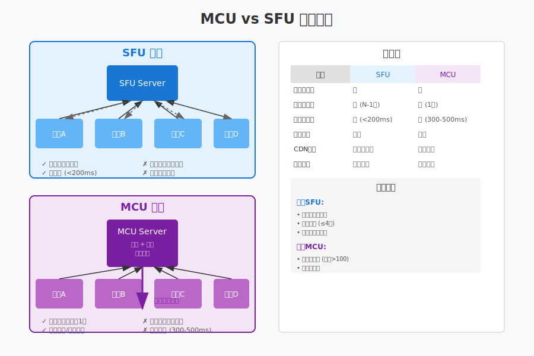
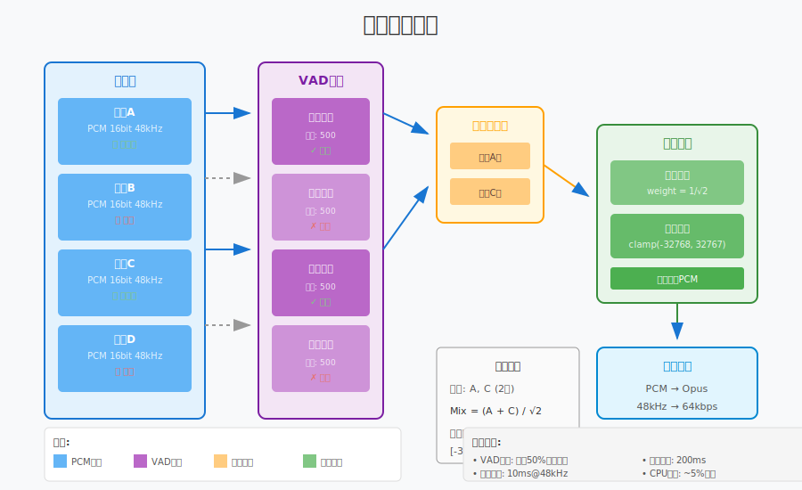
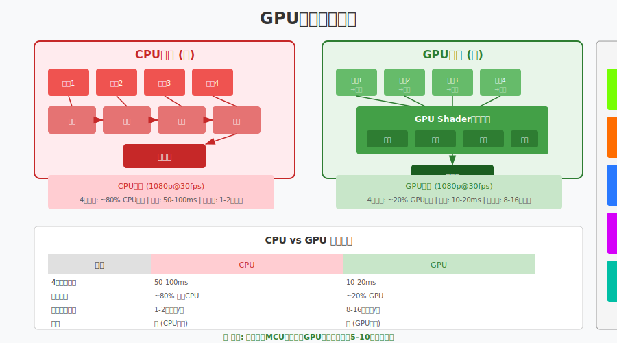
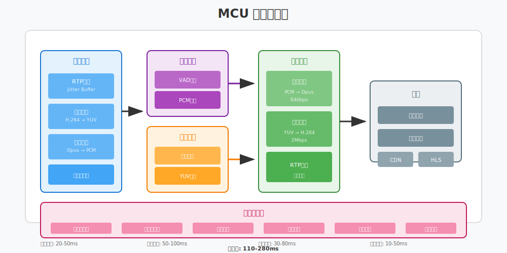

# 第24章：MCU 混音混画详解

> **本章目标**：理解 MCU 架构原理，掌握音频混音和视频混画的核心技术。

在上一章（第23章）中，我们实现了多人房间的客户端，使用 SFU 架构实现了灵活的多路视频管理。但是，当会议人数增加到一定规模，或者需要进行云端录制时，SFU 的局限性就开始显现。

本章将学习 **MCU（Multipoint Control Unit，多点控制单元）** 架构，这是处理大规模会议和云端录制的核心技术。通过 MCU，服务器可以将多路音视频流混合成一路合流，大幅降低客户端的带宽和性能消耗。

**学习本章后，你将能够**：
- 理解 MCU 与 SFU 的区别和适用场景
- 掌握音频混音的数学原理和溢出处理
- 理解视频混画的布局设计和 GPU 加速
- 设计 MCU 的完整处理流水线
- 实现一个简单的 MCU 服务器

---

## 目录

1. [为什么需要 MCU？](#1-为什么需要-mcu)
2. [音频混音原理](#2-音频混音原理)
3. [视频混画原理](#3-视频混画原理)
4. [MCU 流水线设计](#4-mcu-流水线设计)
5. [简单 MCU 实现](#5-简单-mcu-实现)
6. [本章总结](#6-本章总结)

---

## 1. 为什么需要 MCU？

### 1.1 SFU 的局限性

在第22章中，我们学习了 SFU 架构，它的核心优势是服务器只转发不解码，延迟低、性能好。但当遇到以下场景时，SFU 就显得力不从心了：

**场景 1：大规模会议（50+ 人）**

使用 SFU 时，每个参与者需要接收其他所有参与者的视频流：

```
50 人会议，每人需要接收 49 路视频
假设每路 500kbps，每人下行带宽 = 49 × 500kbps = 24.5 Mbps
```

普通家庭宽带（通常 20-100 Mbps）根本无法支撑这样的带宽需求。

**场景 2：移动端弱网环境**

移动设备的网络环境复杂，4G/5G 信号不稳定，WiFi 质量参差不齐。SFU 要求客户端接收多路流，在弱网环境下很容易出现卡顿、花屏。

**场景 3：云端录制需求**

如果要将整场会议录制下来，使用 SFU 需要：
- 同时录制每一路单独的流
- 录制后再进行离线混流合成
- 流程复杂，实时性差

### 1.2 MCU vs SFU 对比



**SFU（选择性转发单元）**：

```
┌─────────────────────────────────────────────────────────┐
│                    SFU 架构                             │
├─────────────────────────────────────────────────────────┤
│                                                         │
│   用户 A ──→┌─────────┐←── 用户 B                       │
│   发送1路    │  Server  │    收到1路 (A的)               │
│             │ (转发)   │                               │
│   用户 B ──→│ 不解码   │←── 用户 A                       │
│   发送1路    │ 不编码   │    收到1路 (B的)               │
│             └─────────┘                               │
│                                                         │
│  特点: N人会议，每人接收 N-1 路流                       │
│  延迟: 极低 (< 50ms)                                    │
│  适用: 小型会议 (4-20人)                                │
└─────────────────────────────────────────────────────────┘
```

**MCU（多点控制单元）**：

```
┌─────────────────────────────────────────────────────────┐
│                    MCU 架构                             │
├─────────────────────────────────────────────────────────┤
│                                                         │
│   用户 A ──┐                                          │
│             ↓                                          │
│   用户 B ──→┌─────────┐                               │
│             │  Server  │                               │
│   用户 C ──→│ (混音   │──→ 所有用户收到 1 路合流        │
│             │  混画)   │      包含 A+B+C               │
│   用户 D ──→│ 解码→合成→编码│                               │
│             └─────────┘                               │
│                                                         │
│  特点: N人会议，每人只接收 1 路合流                     │
│  延迟: 较高 (100-500ms)                                 │
│  适用: 大型会议、直播、录制                             │
└─────────────────────────────────────────────────────────┘
```

### 1.3 三种架构详细对比

| 特性 | Mesh (P2P) | SFU | MCU |
|:---|:---:|:---:|:---:|
| **服务器角色** | 仅信令 | 转发 | 混音混画 |
| **服务器 CPU** | 极低 | 低 | 高 |
| **服务器带宽** | 低 | 高 | 低 |
| **客户端上行** | 高 | 低 | 低 |
| **客户端下行** | 高 | 高 | 极低 |
| **客户端 CPU** | 高 | 中等 | 低 |
| **延迟** | 低 | 极低 (<50ms) | 高 (100-500ms) |
| **布局灵活性** | 高 | 高 | 低 |
| **最大人数** | 3-4 | 20-50 | 100+ |
| **云端录制** | 困难 | 复杂 | 简单 |

### 1.4 适用场景分析

**选择 SFU 的场景**：
- 视频会议（4-20 人）
- 需要灵活布局（用户可以自定义谁大谁小）
- 对延迟敏感（远程协作、在线教育）
- 参与者的设备和网络较好

**选择 MCU 的场景**：
- 大型会议（50+ 人）
- Webinar / 大型直播
- 移动端弱网环境
- 需要云端录制存档
- 需要向 CDN 推流（HLS/DASH）

**混合架构（SFU + MCU）**：

现代大型会议系统通常采用混合架构：

```
┌─────────────────────────────────────────────────────────┐
│                    混合架构                             │
├─────────────────────────────────────────────────────────┤
│                                                         │
│    ┌─────────┐                                         │
│    │   SFU   │←── 互动参与者 (10-20人)                 │
│    │  Server │    低延迟、灵活布局                     │
│    └────┬────┘                                         │
│         │                                              │
│         ↓ 转发                                         │
│    ┌─────────┐                                         │
│    │   MCU   │←── 大规模观众 (1000+人)                │
│    │  Server │    接收合流，也可录制成 HLS             │
│    └────┬────┘                                         │
│         │                                              │
│         ↓ CDN                                          │
│    ┌─────────┐                                         │
│    │  HLS/CDN│←── 仅观看用户                          │
│    └─────────┘                                         │
└─────────────────────────────────────────────────────────┘
```

**核心参与者**使用 SFU 进行实时互动，**普通观众**通过 MCU 接收合流或 CDN 直播。

---

## 2. 音频混音原理

### 2.1 为什么需要混音？

在多路通话中，每个参与者需要同时听到其他所有参与者的声音。如果不进行混音，就需要在客户端同时播放多个独立的音频流，这会带来两个问题：

1. **同步问题**：多个独立流的播放难以精确同步，会产生回声或重叠
2. **资源消耗**：同时解码和播放多路音频，对移动端是负担

**混音的本质**：将多路音频的 PCM 数据按采样点相加，生成一路混合后的音频。

### 2.2 PCM 数据相加原理

音频混音的核心是数学上的**采样点相加**：



**基本原理**：

```
假设有两个音频流：
- 流 A 的采样点序列: [a₁, a₂, a₃, ...]
- 流 B 的采样点序列: [b₁, b₂, b₃, ...]

混音后的采样点序列: [a₁+b₁, a₂+b₂, a₃+b₃, ...]
```

**用代码表示**：

```cpp
namespace live {

// 简单的两路混音 (16-bit PCM)
void MixAudioSimple(const int16_t* input1, 
                    const int16_t* input2,
                    int16_t* output,
                    size_t sample_count) {
    for (size_t i = 0; i < sample_count; ++i) {
        int32_t mixed = static_cast<int32_t>(input1[i]) 
                      + static_cast<int32_t>(input2[i]);
        
        // 溢出保护：硬限幅
        if (mixed > INT16_MAX) {
            output[i] = INT16_MAX;
        } else if (mixed < INT16_MIN) {
            output[i] = INT16_MIN;
        } else {
            output[i] = static_cast<int16_t>(mixed);
        }
    }
}

} // namespace live
```

### 2.3 溢出处理策略

当多路音频叠加时，很容易出现**溢出问题**。例如，两路音量都接近最大值的音频相加，结果会超出 16-bit PCM 的范围（-32768 ~ 32767）。

#### 策略 1：硬限幅 (Hard Clipping)

最简单的溢出处理，超出范围直接截断：

```cpp
// 硬限幅
int16_t Clip(int32_t value) {
    if (value > INT16_MAX) return INT16_MAX;
    if (value < INT16_MIN) return INT16_MIN;
    return static_cast<int16_t>(value);
}
```

**优点**：简单、计算量小  
**缺点**：会产生削波失真，音质下降

#### 策略 2：动态压缩 (Dynamic Compression)

根据总音量动态调整混音系数：

```cpp
namespace live {

class AudioMixer {
public:
    // 动态压缩混音
    void MixWithCompression(const std::vector<const int16_t*>& inputs,
                           int16_t* output,
                           size_t sample_count);
    
private:
    // 计算自适应增益
    float CalculateAttenuation(size_t active_stream_count) {
        // 经验公式：增益 = 1 / sqrt(N)
        // N 越大，每路的音量衰减越多
        if (active_stream_count <= 1) return 1.0f;
        return 1.0f / std::sqrt(static_cast<float>(active_stream_count));
    }
};

void AudioMixer::MixWithCompression(
    const std::vector<const int16_t*>& inputs,
    int16_t* output,
    size_t sample_count) {
    
    const size_t stream_count = inputs.size();
    const float attenuation = CalculateAttenuation(stream_count);
    
    for (size_t i = 0; i < sample_count; ++i) {
        float mixed = 0.0f;
        
        for (const auto* input : inputs) {
            mixed += static_cast<float>(input[i]) * attenuation;
        }
        
        // 最终限幅
        output[i] = Clip(static_cast<int32_t>(mixed));
    }
}

} // namespace live
```

**优点**：音质较好，多人混音时自动降低音量  
**缺点**：计算量稍大，需要浮点运算

#### 策略 3：自适应归一化 (AGC - Automatic Gain Control)

实时监测音频峰值，动态调整混音系数：

```cpp
namespace live {

class AdaptiveMixer {
public:
    // 自适应混音
    void MixAdaptive(const std::vector<AudioStream>& inputs,
                    int16_t* output,
                    size_t sample_count);
    
private:
    // 计算当前帧的峰值
    int16_t CalculatePeak(const int16_t* data, size_t count);
    
    // 自适应增益 (平滑调整)
    float current_gain_ = 1.0f;
    static constexpr float kGainAttack = 0.9f;   // 快速降低
    static constexpr float kGainDecay = 0.999f;  // 缓慢恢复
};

void AdaptiveMixer::MixAdaptive(
    const std::vector<AudioStream>& inputs,
    int16_t* output,
    size_t sample_count) {
    
    // 第一遍：计算原始混音和峰值
    std::vector<int32_t> mixed(sample_count, 0);
    int32_t max_abs_value = 0;
    
    for (const auto& stream : inputs) {
        if (!stream.is_muted && stream.is_active) {
            for (size_t i = 0; i < sample_count; ++i) {
                mixed[i] += stream.data[i];
                max_abs_value = std::max(max_abs_value, 
                    std::abs(mixed[i]));
            }
        }
    }
    
    // 计算需要的增益
    float target_gain = 1.0f;
    if (max_abs_value > INT16_MAX) {
        target_gain = static_cast<float>(INT16_MAX) / max_abs_value;
    }
    
    // 平滑调整增益
    if (target_gain < current_gain_) {
        current_gain_ = target_gain * kGainAttack 
                       + current_gain_ * (1 - kGainAttack);
    } else {
        current_gain_ = target_gain * (1 - kGain_decay)
                       + current_gain_ * kGainDecay;
    }
    
    // 应用增益输出
    for (size_t i = 0; i < sample_count; ++i) {
        output[i] = Clip(static_cast<int32_t>(mixed[i] * current_gain_));
    }
}

} // namespace live
```

### 2.4 VAD 语音检测优化

在多人会议中，通常只有少数人同时说话。我们可以使用 **VAD（Voice Activity Detection，语音活动检测）** 来识别谁在说话，只对活跃的音频流进行混音。

**VAD 的基本原理**：

```
1. 计算音频帧的能量（采样点的平方和）
2. 与阈值比较：能量 > 阈值 → 有语音
3. 添加迟滞：避免在静音边界频繁切换
```

```cpp
namespace live {

class VadDetector {
public:
    // 检测是否有语音活动
    bool Detect(const int16_t* pcm_data, size_t sample_count);
    
    // 设置阈值 (默认 -40dB)
    void SetThreshold(float db_threshold);
    
private:
    float energy_threshold_ = 0.01f;  // -40dB
    int hold_frames_ = 0;              // 保持计数
    static constexpr int kHoldFrames = 10;  // 保持10帧
};

bool VadDetector::Detect(const int16_t* pcm_data, size_t sample_count) {
    // 计算帧能量
    float energy = 0.0f;
    for (size_t i = 0; i < sample_count; ++i) {
        float sample = static_cast<float>(pcm_data[i]) / INT16_MAX;
        energy += sample * sample;
    }
    energy /= sample_count;
    
    if (energy > energy_threshold_) {
        hold_frames_ = kHoldFrames;
        return true;
    }
    
    // 迟滞：保持一段时间
    if (hold_frames_ > 0) {
        --hold_frames_;
        return true;
    }
    
    return false;
}

// 在混音器中使用 VAD
class SmartMixer {
public:
    void AddStream(const std::string& stream_id, 
                   const int16_t* pcm_data,
                   size_t sample_count);
    
    void Mix(int16_t* output, size_t sample_count);
    
private:
    struct StreamInfo {
        std::vector<int16_t> buffer;
        VadDetector vad;
        bool is_active = false;
    };
    std::unordered_map<std::string, StreamInfo> streams_;
};

} // namespace live
```

**VAD 的优化效果**：
- 减少计算量：只混音活跃的流
- 降低底噪：静音流不混入噪声
- 提升音质：避免无效音频的叠加

---

## 3. 视频混画原理

### 3.1 混画的基本概念

视频混画（Video Composition）是将多路视频按照一定布局合并成一路视频的过程。与音频混音不同，视频混画涉及**二维空间的操作**，需要考虑：

1. **布局设计**：每个视频放在什么位置，多大尺寸
2. **图像处理**：缩放、裁剪、格式转换
3. **合成算法**：多路视频的叠加、Alpha 混合

### 3.2 常见布局类型


#### 布局 1：网格布局 (Grid)

```
┌─────────┬─────────┬─────────┐
│    A    │    B    │    C    │
├─────────┼─────────┼─────────┤
│    D    │    E    │    F    │
└─────────┴─────────┴─────────┘

特点：所有参与者平等显示
适用：小型会议、讨论模式
计算：自动计算行列数，均匀分配空间
```

**网格布局计算算法**：

```cpp
namespace live {

struct VideoCell {
    int x, y;           // 左上角坐标
    int width, height;  // 尺寸
    std::string stream_id;
};

class GridLayout {
public:
    // 计算网格布局
    std::vector<VideoCell> Calculate(int stream_count,
                                      int canvas_width,
                                      int canvas_height);
    
private:
    // 计算最佳行列数
    void GetGridSize(int count, int* rows, int* cols) {
        *cols = static_cast<int>(std::ceil(std::sqrt(count)));
        *rows = static_cast<int>(std::ceil(
            static_cast<double>(count) / *cols));
    }
};

std::vector<VideoCell> GridLayout::Calculate(
    int stream_count,
    int canvas_width,
    int canvas_height) {
    
    std::vector<VideoCell> cells;
    
    int rows, cols;
    GetGridSize(stream_count, &rows, &cols);
    
    int cell_width = canvas_width / cols;
    int cell_height = canvas_height / rows;
    
    // 保持 16:9 比例
    float target_aspect = 16.0f / 9.0f;
    float cell_aspect = static_cast<float>(cell_width) / cell_height;
    
    int final_width, final_height;
    if (cell_aspect > target_aspect) {
        // 太宽，以高度为基准
        final_height = cell_height;
        final_width = static_cast<int>(cell_height * target_aspect);
    } else {
        // 太高，以宽度为基准
        final_width = cell_width;
        final_height = static_cast<int>(cell_width / target_aspect);
    }
    
    // 居中计算
    for (int i = 0; i < stream_count; ++i) {
        int row = i / cols;
        int col = i % cols;
        
        int x = col * cell_width + (cell_width - final_width) / 2;
        int y = row * cell_height + (cell_height - final_height) / 2;
        
        cells.push_back({x, y, final_width, final_height, ""});
    }
    
    return cells;
}

} // namespace live
```

#### 布局 2：主讲人模式 (Speaker View)

```
┌─────────────────────────────────────┐
│                                     │
│              主讲人                 │
│            (大图 70%)               │
│                                     │
├───────────┬───────────┬─────────────┤
│    A      │     B     │      C      │
│  (小图)   │   (小图)  │    (小图)   │
└───────────┴───────────┴─────────────┘

特点：主讲人占据主要区域，其他人小图显示
适用：讲座、培训、直播
动态：根据语音活动自动切换主讲人
```

#### 布局 3：画中画模式 (PIP - Picture In Picture)

```
┌─────────────────────────────────────┐
│                                     │
│                                     │
│           主画面                    │
│        (对方视频)                   │
│                                     │
│    ┌──────────────┐                 │
│    │              │                 │
│    │    小窗      │                 │
│    │  (自己画面)  │                 │
│    └──────────────┘                 │
│                                     │
└─────────────────────────────────────┘

特点：小窗悬浮在主画面上
适用：1v1 通话、小班课
位置：通常右下角，可拖动
```

### 3.3 YUV 图像处理

视频混画需要对图像进行缩放、裁剪和格式转换。在 MCU 中，通常使用 **YUV420P** 格式进行处理。

**YUV420P 格式回顾**：

```
YUV420P 是一种平面格式：
- Y 平面：亮度信息，分辨率 = width × height
- U 平面：色度信息，分辨率 = width/2 × height/2
- V 平面：色度信息，分辨率 = width/2 × height/2

总大小 = width × height × 1.5
```

**YUV 缩放算法**：

```cpp
namespace live {

// YUV420P 图像缩放 (双线性插值)
class YuvScaler {
public:
    // 缩放 YUV420P 图像
    void Scale(const uint8_t* src_y, const uint8_t* src_u, 
               const uint8_t* src_v,
               int src_width, int src_height,
               uint8_t* dst_y, uint8_t* dst_u, uint8_t* dst_v,
               int dst_width, int dst_height);
    
private:
    // 缩放单平面
    void ScalePlane(const uint8_t* src, int src_width, 
                    int src_height,
                    uint8_t* dst, int dst_width, int dst_height);
};

void YuvScaler::ScalePlane(const uint8_t* src, int src_width,
                           int src_height,
                           uint8_t* dst, int dst_width, 
                           int dst_height) {
    const float x_ratio = static_cast<float>(src_width) / dst_width;
    const float y_ratio = static_cast<float>(src_height) / dst_height;
    
    for (int y = 0; y < dst_height; ++y) {
        for (int x = 0; x < dst_width; ++x) {
            // 源坐标
            float src_x = x * x_ratio;
            float src_y = y * y_ratio;
            
            // 双线性插值
            int x0 = static_cast<int>(src_x);
            int y0 = static_cast<int>(src_y);
            int x1 = std::min(x0 + 1, src_width - 1);
            int y1 = std::min(y0 + 1, src_height - 1);
            
            float fx = src_x - x0;
            float fy = src_y - y0;
            
            // 四个角的像素值
            uint8_t p00 = src[y0 * src_width + x0];
            uint8_t p01 = src[y0 * src_width + x1];
            uint8_t p10 = src[y1 * src_width + x0];
            uint8_t p11 = src[y1 * src_width + x1];
            
            // 插值计算
            float val = p00 * (1-fx) * (1-fy)
                      + p01 * fx * (1-fy)
                      + p10 * (1-fx) * fy
                      + p11 * fx * fy;
            
            dst[y * dst_width + x] = static_cast<uint8_t>(val);
        }
    }
}

} // namespace live
```

**注意**：实际生产环境通常使用 FFmpeg 的 `libswscale` 或 GPU 加速，而不是纯 CPU 实现。

### 3.4 Alpha 混合与边框

为了让混画效果更好看，通常会在视频之间添加边框，并可能使用圆角或阴影效果。

```cpp
namespace live {

// 将一路视频复制到画布指定位置
void CopyToCanvas(const uint8_t* src_y, const uint8_t* src_u,
                  const uint8_t* src_v,
                  int src_width, int src_height,
                  uint8_t* canvas_y, uint8_t* canvas_u, 
                  uint8_t* canvas_v,
                  int canvas_width, int canvas_height,
                  int pos_x, int pos_y) {
    
    // 计算实际复制区域
    int copy_width = std::min(src_width, canvas_width - pos_x);
    int copy_height = std::min(src_height, canvas_height - pos_y);
    
    // 复制 Y 平面
    for (int y = 0; y < copy_height; ++y) {
        memcpy(canvas_y + (pos_y + y) * canvas_width + pos_x,
               src_y + y * src_width,
               copy_width);
    }
    
    // 复制 U/V 平面 (注意 UV 是半分辨率)
    int copy_uv_width = copy_width / 2;
    int copy_uv_height = copy_height / 2;
    int uv_canvas_width = canvas_width / 2;
    int uv_src_width = src_width / 2;
    int uv_pos_x = pos_x / 2;
    int uv_pos_y = pos_y / 2;
    
    for (int y = 0; y < copy_uv_height; ++y) {
        memcpy(canvas_u + (uv_pos_y + y) * uv_canvas_width + uv_pos_x,
               src_u + y * uv_src_width,
               copy_uv_width);
        memcpy(canvas_v + (uv_pos_y + y) * uv_canvas_width + uv_pos_x,
               src_v + y * uv_src_width,
               copy_uv_width);
    }
}

// 绘制边框
void DrawBorder(uint8_t* canvas_y, uint8_t* canvas_u, uint8_t* canvas_v,
                int canvas_width, int canvas_height,
                int x, int y, int width, int height,
                int border_width, uint8_t y_val, uint8_t u_val, 
                uint8_t v_val) {
    // 白色边框 YUV 值 (近似)
    // Y=255, U=128, V=128 为白色
    
    // 上边框
    for (int by = 0; by < border_width; ++by) {
        memset(canvas_y + (y + by) * canvas_width + x, y_val, width);
    }
    
    // 下边框
    for (int by = 0; by < border_width; ++by) {
        memset(canvas_y + (y + height - border_width + by) * canvas_width + x, 
               y_val, width);
    }
    
    // 左右边框
    for (int by = border_width; by < height - border_width; ++by) {
        memset(canvas_y + (y + by) * canvas_width + x, y_val, border_width);
        memset(canvas_y + (y + by) * canvas_width + x + width - border_width,
               y_val, border_width);
    }
}

} // namespace live
```

### 3.5 GPU 加速混画

对于高分辨率、多路视频的混画，CPU 处理会非常吃力。现代 MCU 都使用 GPU 进行加速。



**GPU 混画的核心流程**：

```
1. 解码后的视频帧作为 GPU 纹理 (Texture)
2. 使用 Fragment Shader 进行多纹理采样
3. 在 Shader 中完成缩放、位置计算、Alpha 混合
4. 输出到帧缓冲 (FBO - Frame Buffer Object)
5. 直接从 FBO 进行硬件编码
```

**OpenGL ES Shader 示例**：

```glsl
// 顶点着色器 (vertex shader)
attribute vec2 a_position;
attribute vec2 a_texCoord;
varying vec2 v_texCoord;

void main() {
    gl_Position = vec4(a_position, 0.0, 1.0);
    v_texCoord = a_texCoord;
}

// 片段着色器 (fragment shader)
precision mediump float;
varying vec2 v_texCoord;

uniform sampler2D u_texture0;  // 视频1
uniform sampler2D u_texture1;  // 视频2
uniform sampler2D u_texture2;  // 视频3
uniform sampler2D u_texture3;  // 视频4

uniform vec4 u_rect0;  // x, y, w, h (归一化 0-1)
uniform vec4 u_rect1;
uniform vec4 u_rect2;
uniform vec4 u_rect3;

void main() {
    vec2 coord = v_texCoord;
    vec4 color = vec4(0.0, 0.0, 0.0, 1.0);  // 黑色背景
    
    // 判断当前像素属于哪个视频区域
    if (coord.x >= u_rect0.x && coord.x <= u_rect0.x + u_rect0.z &&
        coord.y >= u_rect0.y && coord.y <= u_rect0.y + u_rect0.w) {
        // 计算在视频1中的相对坐标
        vec2 localCoord = (coord - u_rect0.xy) / u_rect0.zw;
        color = texture2D(u_texture0, localCoord);
    }
    else if (coord.x >= u_rect1.x && coord.x <= u_rect1.x + u_rect1.z) {
        vec2 localCoord = (coord - u_rect1.xy) / u_rect1.zw;
        color = texture2D(u_texture1, localCoord);
    }
    // ... 其他视频
    
    gl_FragColor = color;
}
```

**GPU vs CPU 性能对比**：

| 场景 | CPU (软混画) | GPU (硬混画) | 提升 |
|:---|:---:|:---:|:---:|
| 4路 1080p → 1080p | 100ms | 2ms | 50x |
| 16路 1080p → 720p | 500ms | 5ms | 100x |
| CPU/GPU 占用 | 80-100% | 20-30% | - |

---

## 4. MCU 流水线设计

### 4.1 整体架构

一个完整的 MCU 服务器由多个处理模块组成，形成流水线式处理：



```
┌─────────────────────────────────────────────────────────────────┐
│                        MCU Pipeline                             │
├─────────────────────────────────────────────────────────────────┤
│                                                                 │
│   Input → JitterBuffer → Decode → Mixer/Compositor → Encode → Output
│   (RTP)      (5-20ms)    (10ms)    (10-100ms)      (30ms)   (5ms)
│                                                                 │
│   ├─ Audio ─→ PCM Mixing ───────────────────→ Audio Encode ─┤  │
│   │                                                           │  │
│   └─ Video ─→ YUV Compositing (GPU) ────────→ Video Encode ─┘  │
│                                                                 │
└─────────────────────────────────────────────────────────────────┘
                         Total Latency: 100-300ms
```

### 4.2 输入处理模块

**职责**：
- 接收来自各参与者的 RTP 包
- 使用 JitterBuffer 消除网络抖动
- 将 RTP 包交给解码器

```cpp
namespace live {

class InputProcessor {
public:
    // 添加 RTP 包
    void OnRtpPacket(const std::string& stream_id,
                    const uint8_t* rtp_data,
                    size_t len);
    
    // 获取解码后的帧
    std::unique_ptr<AudioFrame> GetNextAudioFrame(
        const std::string& stream_id);
    std::unique_ptr<VideoFrame> GetNextVideoFrame(
        const std::string& stream_id);
    
private:
    // stream_id -> JitterBuffer
    std::unordered_map<std::string, 
                       std::unique_ptr<JitterBuffer>> jitter_buffers_;
    
    // stream_id -> Decoder
    std::unordered_map<std::string, 
                       std::unique_ptr<AudioDecoder>> audio_decoders_;
    std::unordered_map<std::string,
                       std::unique_ptr<VideoDecoder>> video_decoders_;
};

} // namespace live
```

### 4.3 混音模块

**职责**：
- 收集各路音频的 PCM 数据
- 进行混音处理
- 输出混合后的 PCM

```cpp
namespace live {

class AudioMixerModule {
public:
    struct MixedResult {
        std::vector<int16_t> pcm_data;
        int sample_rate;
        int channels;
    };
    
    // 添加一路音频帧
    void AddFrame(const std::string& stream_id,
                  const AudioFrame& frame);
    
    // 执行混音
    MixedResult Mix();
    
    // 设置混音参数
    void SetMaxStreams(size_t max_streams) { max_streams_ = max_streams; }
    
private:
    struct StreamBuffer {
        std::queue<AudioFrame> frames;
        VadDetector vad;
        float volume_level = 1.0f;
    };
    
    std::unordered_map<std::string, StreamBuffer> streams_;
    AdaptiveMixer mixer_;
    size_t max_streams_ = 16;
    
    // 选择最活跃的 N 路进行混音
    std::vector<std::string> SelectActiveStreams();
};

} // namespace live
```

### 4.4 混画模块

**职责**：
- 收集各路视频帧
- 按布局进行合成
- 输出合成后的视频帧

```cpp
namespace live {

class VideoCompositorModule {
public:
    struct CompositedResult {
        std::vector<uint8_t> yuv_data;
        int width;
        int height;
    };
    
    // 设置布局模式
    void SetLayout(LayoutMode mode);
    
    // 添加视频帧
    void AddFrame(const std::string& stream_id,
                  const VideoFrame& frame);
    
    // 执行合成
    CompositedResult Composite();
    
private:
    LayoutMode layout_mode_ = LayoutMode::GRID;
    std::unordered_map<std::string, VideoFrame> current_frames_;
    
    // GPU 合成器
    std::unique_ptr<GpuCompositor> gpu_compositor_;
    
    // 合成画布尺寸
    static constexpr int kCanvasWidth = 1280;
    static constexpr int kCanvasHeight = 720;
};

} // namespace live
```

### 4.5 编码输出模块

**职责**：
- 对混音后的音频进行编码
- 对混画后的视频进行编码
- 打包成 RTP 发送给订阅者

```cpp
namespace live {

class EncoderModule {
public:
    // 初始化编码器
    bool Initialize(AudioCodec audio_codec, 
                    VideoCodec video_codec);
    
    // 编码音频
    std::vector<RtpPacket> EncodeAudio(const AudioFrame& frame);
    
    // 编码视频
    std::vector<RtpPacket> EncodeVideo(const VideoFrame& frame);
    
private:
    std::unique_ptr<AudioEncoder> audio_encoder_;
    std::unique_ptr<VideoEncoder> video_encoder_;
    uint32_t audio_ssrc_;
    uint32_t video_ssrc_;
    uint16_t audio_seq_ = 0;
    uint16_t video_seq_ = 0;
    uint32_t audio_timestamp_ = 0;
    uint32_t video_timestamp_ = 0;
};

} // namespace live
```

### 4.6 延迟分析

MCU 的延迟是不可避免的，我们需要理解延迟的来源并尽量优化：

| 阶段 | 延迟 | 优化方法 |
|:---|:---:|:---|
| JitterBuffer | 5-20ms | 动态调整缓冲区大小 |
| 解码 | 5-10ms | 使用硬件解码 |
| 混音 | 1-5ms | 使用优化的算法 |
| 混画 | 2-10ms | **必须使用 GPU 加速** |
| 编码 | 10-50ms | 使用硬件编码 |
| 网络传输 | 5-20ms | 选择优质的机房和网络 |
| **总计** | **50-150ms** | - |

**延迟优化技巧**：

1. **零拷贝传输**：从解码到混画到编码，数据始终留在 GPU 内存
2. **并行处理**：音频和视频可以并行处理
3. **流水线优化**：当前帧处理的同时，预取下一帧数据
4. **快速编码器参数**：使用低延迟编码模式（x264 的 `tune=zerolatency`）

---

## 5. 简单 MCU 实现

### 5.1 整体设计

让我们设计一个简化的 MCU 服务器，支持基本的混音混画功能：

```cpp
// mcu_server.h
#pragma once

#include <memory>
#include <string>
#include <vector>
#include <unordered_map>
#include <functional>

namespace live {

// 前向声明
class InputProcessor;
class AudioMixerModule;
class VideoCompositorModule;
class EncoderModule;

// MCU 配置
struct McuConfig {
    // 音频配置
    int audio_sample_rate = 48000;
    int audio_channels = 2;
    
    // 视频配置
    int video_width = 1280;
    int video_height = 720;
    int video_fps = 30;
    
    // 混音配置
    size_t max_audio_streams = 16;
    
    // 混画配置
    LayoutMode layout_mode = LayoutMode::GRID;
    size_t max_video_streams = 16;
};

// MCU 房间
class McuRoom {
public:
    explicit McuRoom(const std::string& room_id, 
                     const McuConfig& config);
    ~McuRoom();
    
    // 参与者管理
    bool AddParticipant(const std::string& participant_id);
    void RemoveParticipant(const std::string& participant_id);
    
    // 接收 RTP 包
    void OnAudioRtp(const std::string& participant_id,
                   const uint8_t* data, size_t len);
    void OnVideoRtp(const std::string& participant_id,
                   const uint8_t* data, size_t len);
    
    // 设置输出回调
    using OutputCallback = std::function<void(
        const std::vector<uint8_t>& rtp_data,
        bool is_audio)>;
    void SetOutputCallback(const OutputCallback& callback);
    
    // 开始/停止处理
    void Start();
    void Stop();
    
private:
    void ProcessLoop();  // 处理线程
    
    std::string room_id_;
    McuConfig config_;
    
    std::unique_ptr<InputProcessor> input_processor_;
    std::unique_ptr<AudioMixerModule> audio_mixer_;
    std::unique_ptr<VideoCompositorModule> video_compositor_;
    std::unique_ptr<EncoderModule> encoder_;
    
    std::unordered_set<std::string> participants_;
    OutputCallback output_callback_;
    
    std::atomic<bool> running_{false};
    std::thread process_thread_;
};

// MCU 服务器
class McuServer {
public:
    bool Initialize(const McuConfig& default_config);
    
    // 创建房间
    std::shared_ptr<McuRoom> CreateRoom(const std::string& room_id);
    void DestroyRoom(const std::string& room_id);
    
    // 获取房间
    std::shared_ptr<McuRoom> GetRoom(const std::string& room_id);
    
private:
    McuConfig default_config_;
    std::unordered_map<std::string, std::shared_ptr<McuRoom>> rooms_;
    std::shared_mutex rooms_mutex_;
};

} // namespace live
```

### 5.2 音频混音实现

```cpp
// audio_mixer_impl.cpp
#include "audio_mixer.h"
#include <math>
#include <algorithm>

namespace live {

// 混音实现
std::vector<int16_t> AudioMixerImpl::Mix(
    const std::vector<StreamData>& inputs,
    size_t sample_count) {
    
    std::vector<int16_t> output(sample_count, 0);
    
    if (inputs.empty()) {
        return output;
    }
    
    // 计算自适应增益
    const float attenuation = CalculateAttenuation(inputs.size());
    
    // 逐采样点混音
    for (size_t i = 0; i < sample_count; ++i) {
        float mixed = 0.0f;
        
        for (const auto& input : inputs) {
            mixed += static_cast<float>(input.pcm[i]) * attenuation;
        }
        
        // 限幅
        output[i] = static_cast<int16_t>(
            std::max(std::min(mixed, 32767.0f), -32768.0f));
    }
    
    return output;
}

// 选择最活跃的流
std::vector<AudioMixerImpl::StreamData> 
AudioMixerImpl::SelectActiveStreams(
    const std::unordered_map<std::string, StreamInfo>& streams,
    size_t max_count) {
    
    std::vector<StreamData> active_streams;
    
    for (const auto& [id, info] : streams) {
        if (info.vad.IsActive() && !info.pcm_buffer.empty()) {
            active_streams.push_back({id, info.pcm_buffer});
        }
    }
    
    // 如果太多，按音量排序取前 N 个
    if (active_streams.size() > max_count) {
        std::partial_sort(active_streams.begin(),
                         active_streams.begin() + max_count,
                         active_streams.end(),
                         [](const StreamData& a, const StreamData& b) {
                             return a.volume > b.volume;
                         });
        active_streams.resize(max_count);
    }
    
    return active_streams;
}

} // namespace live
```

### 5.3 视频混画实现

```cpp
// video_compositor_impl.cpp
#include "video_compositor.h"

namespace live {

// 网格布局计算
std::vector<VideoLayout> VideoCompositorImpl::CalculateGridLayout(
    size_t stream_count,
    int canvas_width,
    int canvas_height) {
    
    std::vector<VideoLayout> layouts;
    
    if (stream_count == 0) return layouts;
    
    // 计算行列
    int cols = static_cast<int>(std::ceil(std::sqrt(stream_count)));
    int rows = static_cast<int>(
        std::ceil(static_cast<double>(stream_count) / cols));
    
    int cell_w = canvas_width / cols;
    int cell_h = canvas_height / rows;
    
    // 保持 16:9
    float target_ratio = 16.0f / 9.0f;
    int video_w, video_h;
    
    if (static_cast<float>(cell_w) / cell_h > target_ratio) {
        video_h = cell_h - 4;  // 留2像素边框
        video_w = static_cast<int>(video_h * target_ratio);
    } else {
        video_w = cell_w - 4;
        video_h = static_cast<int>(video_w / target_ratio);
    }
    
    // 计算每个视频的位置
    for (size_t i = 0; i < stream_count; ++i) {
        int row = static_cast<int>(i) / cols;
        int col = static_cast<int>(i) % cols;
        
        int x = col * cell_w + (cell_w - video_w) / 2;
        int y = row * cell_h + (cell_h - video_h) / 2;
        
        layouts.push_back({x, y, video_w, video_h});
    }
    
    return layouts;
}

// CPU 软合成 (简化版)
void VideoCompositorImpl::CompositeCPU(
    const std::vector<VideoFrame>& frames,
    const std::vector<VideoLayout>& layouts,
    uint8_t* output_yuv,
    int canvas_width,
    int canvas_height) {
    
    size_t y_size = canvas_width * canvas_height;
    uint8_t* y_plane = output_yuv;
    uint8_t* u_plane = output_yuv + y_size;
    uint8_t* v_plane = output_yuv + y_size + y_size / 4;
    
    // 清空画布 (黑色)
    memset(y_plane, 0, y_size);
    memset(u_plane, 128, y_size / 4);
    memset(v_plane, 128, y_size / 4);
    
    // 合成每个视频
    for (size_t i = 0; i < frames.size() && i < layouts.size(); ++i) {
        const auto& frame = frames[i];
        const auto& layout = layouts[i];
        
        // 缩放并复制到画布 (简化版，实际应使用更好的缩放算法)
        ScaleAndCopy(frame, layout, 
                    y_plane, u_plane, v_plane,
                    canvas_width, canvas_height);
    }
}

} // namespace live
```

### 5.4 主流程实现

```cpp
// mcu_room.cpp
#include "mcu_room.h"

namespace live {

void McuRoom::ProcessLoop() {
    const auto frame_duration = std::chrono::milliseconds(1000 / 30);  // 30fps
    
    while (running_) {
        auto start = std::chrono::steady_clock::now();
        
        // 1. 从输入模块获取解码后的帧
        auto audio_frames = input_processor_->GetAudioFrames();
        auto video_frames = input_processor_->GetVideoFrames();
        
        // 2. 音频混音
        if (!audio_frames.empty()) {
            for (const auto& frame : audio_frames) {
                audio_mixer_->AddFrame(frame.stream_id, frame);
            }
            auto mixed_audio = audio_mixer_->Mix();
            
            // 编码并输出
            auto rtp_packets = encoder_->EncodeAudio(mixed_audio);
            for (const auto& packet : rtp_packets) {
                if (output_callback_) {
                    output_callback_(packet.data, true);
                }
            }
        }
        
        // 3. 视频混画
        if (!video_frames.empty()) {
            for (const auto& frame : video_frames) {
                video_compositor_->AddFrame(frame.stream_id, frame);
            }
            auto composited_video = video_compositor_->Composite();
            
            // 编码并输出
            auto rtp_packets = encoder_->EncodeVideo(composited_video);
            for (const auto& packet : rtp_packets) {
                if (output_callback_) {
                    output_callback_(packet.data, false);
                }
            }
        }
        
        // 4. 控制帧率
        auto elapsed = std::chrono::steady_clock::now() - start;
        if (elapsed < frame_duration) {
            std::this_thread::sleep_for(frame_duration - elapsed);
        }
    }
}

} // namespace live
```

---

## 6. 本章总结

### 6.1 核心知识点回顾

本章我们学习了 MCU 混音混画的核心技术：

**1. MCU vs SFU**：
- SFU：选择性转发，低延迟，客户端接收多路流
- MCU：混音混画，高延迟，客户端只接收 1 路合流
- 选择依据：会议规模、网络环境、录制需求

**2. 音频混音**：
- 核心原理：PCM 采样点相加
- 溢出处理：硬限幅、动态压缩、自适应归一化
- VAD 优化：只混音活跃的音频流

**3. 视频混画**：
- 布局设计：网格、主讲人、画中画
- 图像处理：YUV 缩放、裁剪、格式转换
- GPU 加速：使用 Shader 进行并行合成

**4. MCU 流水线**：
- 输入处理 → 混音/混画 → 编码 → 输出
- 延迟来源：JitterBuffer、解码、合成、编码
- 优化方向：GPU 加速、零拷贝、流水线并行

### 6.2 MCU 选型建议

| 场景 | 推荐方案 | 原因 |
|:---|:---|:---|
| 小型会议 (4-20人) | 纯 SFU | 低延迟、布局灵活 |
| 中型会议 (20-50人) | SFU + 可选 MCU | 参与者用 SFU，观众用 MCU |
| 大型会议 (50+人) | 纯 MCU 或 CDN | 客户端只需接收 1 路 |
| 需要录制 | MCU | 直接录制合流 |
| 移动优先 | MCU | 弱网环境下更稳定 |

### 6.3 常见陷阱

**陷阱 1：CPU 软混画**

```
错误：使用纯 CPU 进行 16 路 1080p 混画
结果：单帧处理 500ms，完全不可用
正确：必须使用 GPU 加速
```

**陷阱 2：忽略音频同步**

```
问题：视频和音频处理延迟不同步
结果：口型对不上，用户体验差
解决：统一时间戳，保持同步
```

**陷阱 3：混音溢出**

```
问题：多路音频直接相加导致削波失真
结果：音质严重下降
解决：使用动态压缩或自适应归一化
```

### 6.4 课后练习

1. **思考题**：
   - 为什么 MCU 的延迟比 SFU 高？延迟主要来自哪些环节？
   - 如果要支持 100 人会议，你会如何设计 MCU 的混音策略？
   - GPU 混画相比 CPU 混画有哪些优势？实现难点在哪里？

2. **编程题**：
   - 实现一个简单的双路音频混音器，支持溢出保护
   - 实现网格布局计算算法，支持 1-16 路视频
   - 使用 OpenGL 编写一个简单的双路视频混画 Shader

3. **拓展阅读**：
   - 研究 FFmpeg 的 `libswscale` 库，了解 YUV 缩放的高效实现
   - 学习 OpenGL FBO（Frame Buffer Object）的使用方法
   - 了解现代 GPU 的 NVENC/VA-API 硬件编码

### 6.5 下一章预告

在第25章《录制与回放》中，我们将学习：

- **录制需求分析**：单流录制 vs 合流录制，格式选择
- **服务端录制**：从 SFU/MCU 录制，文件分段策略
- **HLS 时移回放**：实现直播的时移功能
- **DASH 协议**：多码率自适应播放

录制是直播系统的核心功能之一，云端录制可以为业务提供回放、审核、剪辑等能力。下一章将带你深入理解录制的技术原理和实现方法。

---

**课后思考**：如果你要设计一个支持 1000 人同时在线的大型直播系统，你会如何组合使用 SFU、MCU 和 CDN？