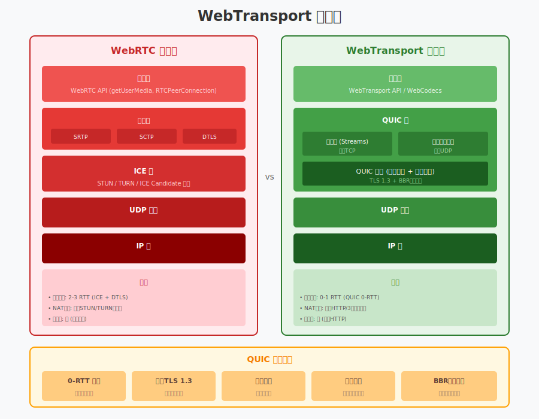
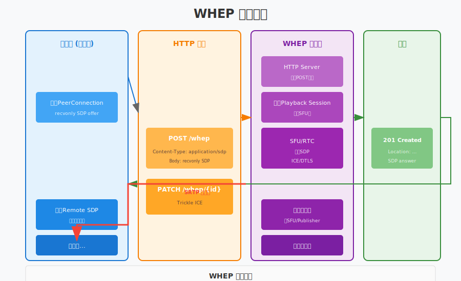

# 第26章：WebTransport 与 WHEP/WHIP

> **本章目标**：了解下一代Web实时通信技术，掌握WebTransport协议和WHEP/WHIP协议的基本原理与应用场景。

WebRTC虽然是当前实时通信的主流技术，但其复杂的信令流程和协议栈也带来了一些挑战。近年来，新的标准如WebTransport、WHEP和WHIP正在兴起，它们旨在简化实时通信的部署和使用。本章将介绍这些新兴技术，帮助你了解实时通信的未来发展方向。

**本章你将学习**：
- WebTransport协议及其与WebRTC的对比
- WHIP协议（WebRTC-HTTP Ingestion Protocol）
- WHEP协议（WebRTC-HTTP Egress Protocol）
- WebTransport在实时通信中的应用
- 下一代Web实时通信技术展望

**学习本章后，你将能够**：
- 理解WebTransport的核心优势
- 使用WHIP协议简化推流开发
- 使用WHEP协议简化拉流开发
- 评估新技术在项目中的适用性

---

## 目录

1. [WebTransport 简介](#1-webtransport-简介)
2. [WHIP 协议](#2-whip-协议)
3. [WHEP 协议](#3-whep-协议)
4. [SRT 协议详解](#4-srt-协议详解) ⭐ 新增
5. [WebTransport 实时通信](#5-webtransport-实时通信)
6. [实战：多协议网关](#6-实战多协议网关) ⭐ 新增
7. [未来展望](#7-未来展望)
8. [本章总结](#8-本章总结)

---

## 1. WebTransport 简介

### 1.1 什么是WebTransport？

**WebTransport**是一个新的Web API，基于HTTP/3和QUIC协议，为客户端和服务器之间提供双向、多路复用的传输能力。

**核心特点**：
| 特性 | 说明 |
|:---|:---|
| **基于QUIC** | 使用HTTP/3底层协议，内建多路复用 |
| **低延迟** | 减少握手时间，0-RTT或1-RTT建立连接 |
| **可靠/不可靠传输** | 同时支持可靠流和不可靠数据报 |
| **拥塞控制** | 现代化的拥塞控制算法（BBR） |
| **易于部署** | 基于HTTP，更容易穿透防火墙/NAT |

### 1.2 WebTransport 协议栈



```
┌─────────────────────────────────────────────────────────┐
│                    应用层                                │
│  ┌──────────┐  ┌──────────┐  ┌──────────────────────┐  │
│  │ WebSocket│  │  HTTP/2  │  │    WebTransport      │  │
│  │   API    │  │  Server  │  │        API           │  │
│  └────┬─────┘  └────┬─────┘  └──────────┬───────────┘  │
├───────┼─────────────┼────────────────────┼──────────────┤
│       │             │                    │              │
│  ┌────┴─────┐  ┌────┴─────┐  ┌──────────┴──────────┐   │
│  │   TCP    │  │   TCP    │  │       QUIC          │   │
│  │          │  │          │  │  (基于UDP)          │   │
│  └────┬─────┘  └────┬─────┘  └──────────┬──────────┘   │
│       │             │                    │              │
│  ┌────┴─────────────┴────────────────────┴──────────┐   │
│  │                      IP                           │   │
│  └───────────────────────────────────────────────────┘   │
└─────────────────────────────────────────────────────────┘
```

### 1.3 WebTransport vs WebRTC

| 维度 | WebRTC | WebTransport |
|:---|:---|:---|
| **传输协议** | SCTP/DTLS over UDP | QUIC over UDP |
| **连接建立** | ICE + DTLS + SCTP (2-3 RTT) | QUIC (0-1 RTT) |
| **NAT穿透** | 需要STUN/TURN | 类似HTTP/3，相对简单 |
| **可靠性** | 可配置 (SRTP/SCTP) | 可配置 (流/数据报) |
| **API复杂度** | 高 | 低 |
| **音视频** | 内置支持 | 需要配合WebCodecs |
| **浏览器支持** | 广泛 | 逐渐普及 |
| **服务端部署** | 复杂 | 相对简单 |

### 1.4 WebTransport 核心API

```javascript
// 客户端 JavaScript API

// 1. 创建 WebTransport 连接
const transport = new WebTransport('https://example.com:4433/endpoint');

// 2. 等待连接就绪
await transport.ready;
console.log('WebTransport connected');

// 3. 创建双向流（可靠传输）
const stream = await transport.createBidirectionalStream();
const reader = stream.readable.getReader();
const writer = stream.writable.getWriter();

// 发送数据
await writer.write(new Uint8Array([1, 2, 3, 4]));

// 接收数据
const { value, done } = await reader.read();
if (!done) {
    console.log('Received:', value);
}

// 4. 发送不可靠数据报
const datagramWriter = transport.datagrams.writable.getWriter();
await datagramWriter.write(new Uint8Array([5, 6, 7, 8]));

// 5. 接收数据报
const datagramReader = transport.datagrams.readable.getReader();
const { value: datagram } = await datagramReader.read();

// 6. 关闭连接
await transport.close();
```

### 1.5 C++ 服务端实现

```cpp
// webtransport_server.h
#pragma once

#include <string>
#include <memory>
#include <functional>

namespace live {

// WebTransport 会话
class WebTransportSession {
public:
    using StreamCallback = std::function<void(uint64_t stream_id)>;
    using DataCallback = std::function<void(uint64_t stream_id, 
                                               const uint8_t* data, 
                                               size_t len)>;
    
    WebTransportSession(uint64_t session_id);
    ~WebTransportSession();
    
    // 设置回调
    void SetStreamCallback(StreamCallback callback);
    void SetDatagramCallback(DataCallback callback);
    
    // 创建双向流
    uint64_t CreateBidirectionalStream();
    
    // 发送数据（流）
    bool SendStreamData(uint64_t stream_id, 
                        const uint8_t* data, 
                        size_t len);
    
    // 发送数据报
    bool SendDatagram(const uint8_t* data, size_t len);
    
    // 关闭会话
    void Close();
    
    uint64_t GetSessionId() const { return session_id_; }
    
private:
    uint64_t session_id_;
    StreamCallback stream_callback_;
    DataCallback datagram_callback_;
    
    uint64_t next_stream_id_ = 0;
    std::atomic<bool> closed_{false};
};

// WebTransport 服务器
class WebTransportServer {
public:
    struct Config {
        std::string bind_address = "0.0.0.0";
        int port = 4433;
        std::string certificate_path;
        std::string private_key_path;
        int max_sessions = 10000;
    };
    
    bool Initialize(const Config& config);
    void Shutdown();
    
    // 设置会话回调
    using SessionCallback = std::function<void(std::shared_ptr<WebTransportSession>)>;
    void SetNewSessionCallback(SessionCallback callback);
    void SetSessionClosedCallback(SessionCallback callback);
    
    // 启动/停止
    bool Start();
    void Stop();
    
    // 获取统计
    struct Stats {
        int active_sessions;
        int total_streams;
        int64_t bytes_sent;
        int64_t bytes_received;
    };
    Stats GetStats() const;
    
private:
    void AcceptLoop();
    void HandleQUICConnection(struct quic_connection_t* conn);
    
    Config config_;
    SessionCallback new_session_callback_;
    SessionCallback closed_session_callback_;
    
    std::atomic<bool> running_{false};
    std::thread accept_thread_;
    
    // QUIC 上下文
    void* quic_context_ = nullptr;
    int listen_socket_ = -1;
    
    std::mutex sessions_mutex_;
    std::map<uint64_t, std::shared_ptr<WebTransportSession>> sessions_;
};

} // namespace live
```

---

## 2. WHIP 协议

### 2.1 什么是WHIP？

**WHIP（WebRTC-HTTP Ingestion Protocol）**是一个基于HTTP的协议，用于简化WebRTC推流（Ingestion）过程。

**传统WebRTC推流的痛点**：
```
传统流程 (复杂):
浏览器 ←──SDP offer/answer──→ 信令服务器 ←──复杂信令──→ SFU
     ←──ICE candidate交换──→
     ←──DTLS握手───────────→
     ←──媒体传输────────────→
```

**WHIP简化后的流程**：
```
WHIP流程 (简单):
浏览器 ──HTTP POST (SDP offer)──→ WHIP服务器
       ←──SDP answer────────────┘
     
直接开始媒体传输 (ICE/DTLS自动处理)
```

### 2.2 WHIP 协议流程


**WHIP核心思想**：
1. 客户端发送HTTP POST请求，包含SDP offer
2. 服务器返回SDP answer
3. ICE和DTLS在后台自动完成
4. 开始媒体传输

### 2.3 WHIP API 设计

```
WHIP 端点: https://whip.example.com/session

1. 创建会话:
POST /session HTTP/1.1
Content-Type: application/sdp

v=0
o=- 0 0 IN IP4 127.0.0.1
s=-
t=0 0
a=group:BUNDLE 0 1
m=audio 9 UDP/TLS/RTP/SAVPF 111
...

响应:
HTTP/1.1 201 Created
Location: https://whip.example.com/session/abc123
Content-Type: application/sdp

v=0
...

2. 更新/修改会话:
PATCH /session/abc123
Content-Type: application/trickle-ice-sdpfrag

3. 结束会话:
DELETE /session/abc123
```

### 2.4 WHIP 客户端实现

```cpp
// whip_client.h
#pragma once

#include <string>
#include <memory>

namespace live {

// WHIP 客户端
class WHIPClient {
public:
    struct Config {
        std::string whip_endpoint;  // WHIP服务器URL
        int timeout_ms = 30000;
    };
    
    WHIPClient(const Config& config);
    ~WHIPClient();
    
    // 初始化本地PeerConnection
    bool InitializePeerConnection();
    
    // 创建推流会话
    struct SessionInfo {
        std::string session_id;
        std::string resource_url;  // 用于后续PATCH/DELETE
        std::string remote_sdp;
    };
    
    // 开始推流
    // local_sdp: 本地SDP offer
    std::pair<bool, SessionInfo> StartPublishing(const std::string& local_sdp);
    
    // 更新ICE candidate (Trickle ICE)
    bool SendIceCandidate(const std::string& candidate,
                          const std::string& mid);
    
    // 停止推流
    bool StopPublishing();
    
    // 获取状态
    bool IsPublishing() const { return is_publishing_; }
    
private:
    bool SendHttpPost(const std::string& url,
                      const std::string& body,
                      const std::string& content_type,
                      std::string& response);
    
    bool SendHttpDelete(const std::string& url);
    
    bool SendHttpPatch(const std::string& url,
                       const std::string& body);
    
    Config config_;
    bool is_publishing_ = false;
    SessionInfo current_session_;
};

// 简化的WHIP客户端实现
bool WHIPClient::StartPublishing(const std::string& local_sdp) {
    // 发送POST请求到WHIP端点
    std::string response;
    bool success = SendHttpPost(
        config_.whip_endpoint,
        local_sdp,
        "application/sdp",
        response
    );
    
    if (!success) {
        return false;
    }
    
    // 解析响应
    // 1. 获取SDP answer
    current_session_.remote_sdp = response;
    
    // 2. 解析Location头获取资源URL
    // current_session_.resource_url = ...
    
    is_publishing_ = true;
    return true;
}

bool WHIPClient::SendIceCandidate(const std::string& candidate,
                                   const std::string& mid) {
    if (!is_publishing_) return false;
    
    // 构建trickle ICE SDP片段
    std::string body = "a=" + candidate + "\r\n";
    
    return SendHttpPatch(
        current_session_.resource_url,
        body
    );
}

bool WHIPClient::StopPublishing() {
    if (!is_publishing_) return true;
    
    bool success = SendHttpDelete(current_session_.resource_url);
    
    is_publishing_ = false;
    current_session_ = SessionInfo{};
    
    return success;
}

} // namespace live
```

### 2.5 WHIP 服务端实现

```cpp
// whip_server.h
#pragma once

#include <memory>
#include <map>

namespace live {

// WHIP 会话
class WHIPSession {
public:
    WHIPSession(const std::string& session_id,
                const std::string& local_sdp);
    
    // 处理远端SDP offer
    std::string ProcessOffer(const std::string& remote_sdp);
    
    // 添加ICE candidate
    void AddRemoteIceCandidate(const std::string& candidate);
    
    // 获取本地ICE candidates
    std::vector<std::string> GetLocalIceCandidates();
    
    // 关闭会话
    void Close();
    
    std::string GetSessionId() const { return session_id_; }
    
private:
    std::string session_id_;
    std::string local_sdp_;
    std::unique_ptr<PeerConnection> pc_;
};

// WHIP HTTP服务器
class WHIPServer {
public:
    struct Config {
        std::string bind_address = "0.0.0.0";
        int port = 8080;
        std::string whip_path = "/whip";
        
        // ICE服务器配置
        std::vector<std::string> ice_servers;
        
        // 证书配置
        std::string certificate_path;
        std::string private_key_path;
    };
    
    bool Initialize(const Config& config);
    void Shutdown();
    
    // HTTP请求处理
    void HandlePost(const std::string& path,
                    const std::map<std::string, std::string>& headers,
                    const std::string& body,
                    HttpResponse& response);
    
    void HandlePatch(const std::string& path,
                     const std::map<std::string, std::string>& headers,
                     const std::string& body,
                     HttpResponse& response);
    
    void HandleDelete(const std::string& path,
                      HttpResponse& response);
    
    bool Start();
    void Stop();
    
private:
    std::string GenerateSessionId();
    
    Config config_;
    std::mutex sessions_mutex_;
    std::map<std::string, std::shared_ptr<WHIPSession>> sessions_;
    
    std::unique_ptr<HttpServer> http_server_;
};

} // namespace live
```

---

## 3. WHEP 协议

### 3.1 什么是WHEP？

**WHEP（WebRTC-HTTP Egress Protocol）**是WHIP的"对称"协议，用于简化WebRTC拉流（Playback/Egress）过程。

**WHEP与WHIP的关系**：
| 协议 | 方向 | 用途 |
|:---|:---|:---|
| WHIP | 客户端 → 服务端 | 推流（Ingestion） |
| WHEP | 客户端 ← 服务端 | 拉流（Egress/Playback） |

### 3.2 WHEP 协议流程



### 3.3 WHEP API 设计

```
WHEP 端点: https://whep.example.com/endpoint

1. 请求播放:
POST /endpoint HTTP/1.1
Content-Type: application/sdp

v=0
o=- 0 0 IN IP4 127.0.0.1
s=-
t=0 0
... (SDP offer with receive-only)

响应:
HTTP/1.1 201 Created
Location: https://whep.example.com/endpoint/xyz789
Content-Type: application/sdp

v=0
... (SDP answer)

2. ICE candidate交换 (Trickle ICE):
PATCH /endpoint/xyz789
Content-Type: application/trickle-ice-sdpfrag

3. 停止播放:
DELETE /endpoint/xyz789
```

### 3.4 WHEP 客户端实现

```cpp
// whep_client.h
#pragma once

#include <string>

namespace live {

// WHEP 客户端 (拉流)
class WHEPClient {
public:
    struct Config {
        std::string whep_endpoint;
        int timeout_ms = 30000;
    };
    
    WHEPClient(const Config& config);
    ~WHEPClient();
    
    // 开始拉流
    struct PlaybackInfo {
        std::string session_id;
        std::string resource_url;
        std::string remote_sdp;
    };
    
    // local_sdp: receive-only SDP offer
    std::pair<bool, PlaybackInfo> StartPlayback(const std::string& local_sdp);
    
    // 发送ICE candidate
    bool SendIceCandidate(const std::string& candidate,
                          const std::string& mid);
    
    // 停止拉流
    bool StopPlayback();
    
    bool IsPlaying() const { return is_playing_; }
    
private:
    bool SendHttpPost(const std::string& url,
                      const std::string& body,
                      std::string& response);
    
    bool SendHttpDelete(const std::string& url);
    bool SendHttpPatch(const std::string& url,
                       const std::string& body);
    
    Config config_;
    bool is_playing_ = false;
    PlaybackInfo current_session_;
};

} // namespace live
```

---

## 4. SRT 协议详解 ⭐ 新增

### 4.1 什么是 SRT

**SRT（Secure Reliable Transport）**是一种开源的音视频传输协议，专为高质量、低延迟的实时传输设计。由 Haivision 开发并开源，现已成为广播行业的标准协议之一。

**核心优势**：
| 特性 | 说明 |
|:---|:---|
| **低延迟** | 可配置延迟（默认 120ms），远低于 TCP |
| **抗丢包** | ARQ（自动重传请求）机制，精准重传 |
| **安全** | 内置 AES-128/256 加密 |
| **跨平台** | Windows/Linux/macOS，FFmpeg 原生支持 |
| **防火墙友好** | 单向出站连接，易于穿透 |

### 4.2 SRT vs RTMP 对比

```
延迟对比（典型值）：

RTMP:  建立连接(3 RTT) + 缓冲区(2-5s) = 3-6秒延迟
       ████████████████████████████████████

SRT:   握手(1 RTT) + 配置延迟(120ms) = 200-500ms延迟
       ████

WebRTC: ICE(2-3 RTT) + DTLS + 缓冲 = 300-800ms延迟
       ██████
```

| 协议 | 延迟 | 抗丢包 | 加密 | 适用场景 |
|:---:|:---:|:---:|:---:|:---|
| RTMP | 3-6s | 弱（TCP） | 无 | 传统直播、CDN |
| SRT | 200-500ms | 强（ARQ） | AES | 广播级传输、跨地域 |
| WebRTC | 200-800ms | 中（NACK/FEC） | DTLS/SRTP | 实时连麦 |
| WHIP | 300-800ms | 中 | DTLS/SRTP | 浏览器推流 |

### 4.3 SRT 核心机制

#### ARQ 精准重传

```
传统 TCP 重传：
发送:  [1][2][3][4][5]  →  [3]丢失
重传:  整个窗口 [3][4][5]  ❌ 浪费带宽

SRT ARQ 重传：
发送:  [1][2][3][4][5]  →  [3]丢失
重传:  仅 [3]              ✓ 精准高效

        ↓
发送端维护一个滑动窗口，接收端通过 ACK/NAK 反馈
只有丢失的包才会被重传
```

#### 延迟控制

```
SRT 延迟模型：

发送端缓冲          网络传输          接收端缓冲
┌─────────┐        ┌───────┐        ┌─────────┐
│ T+120ms │───────→│       │───────→│ T+0ms   │ 播放
│ T+100ms │        │  jitter      ││ T-20ms  │ 缓冲
│ T+80ms  │        │       │        │ T-40ms  │ 缓冲
│ ...     │        └───────┘        │ ...     │
└─────────┘                          └─────────┘

延迟 = 发送缓冲 + 网络抖动 + 解码延迟
     ≈ 120ms + 30ms + 50ms = 200ms
```

### 4.4 SRT 编程实战

#### SRT 推流端

```cpp
// srt_publisher.cpp - SRT 推流示例
#include <srt/srt.h>
#include <stdio.h>
#include <string.h>
#include <unistd.h>

class SRTPublisher {
public:
    SRTPublisher() : sock_(SRT_INVALID_SOCK) {
        srt_startup();
    }
    
    ~SRTPublisher() {
        Close();
        srt_cleanup();
    }
    
    bool Connect(const char* host, int port) {
        sock_ = srt_create_socket();
        if (sock_ == SRT_INVALID_SOCK) {
            fprintf(stderr, "srt_create_socket: %s\n", srt_getlasterror_str());
            return false;
        }
        
        // 设置模式为 CALLER（主动连接）
        int mode = SRTT_LIVE;
        srt_setsockopt(sock_, 0, SRTO_TRANSTYPE, &mode, sizeof(mode));
        
        // 设置延迟（毫秒）
        int latency = 120;
        srt_setsockopt(sock_, 0, SRTO_LATENCY, &latency, sizeof(latency));
        
        // 设置超时
        int timeout = 5000;
        srt_setsockopt(sock_, 0, SRTO_CONNTIMEO, &timeout, sizeof(timeout));
        
        // 设置地址
        sockaddr_in addr;
        memset(&addr, 0, sizeof(addr));
        addr.sin_family = AF_INET;
        addr.sin_port = htons(port);
        inet_pton(AF_INET, host, &addr.sin_addr);
        
        // 连接
        if (srt_connect(sock_, (sockaddr*)&addr, sizeof(addr)) == SRT_ERROR) {
            fprintf(stderr, "srt_connect: %s\n", srt_getlasterror_str());
            return false;
        }
        
        printf("SRT connected to %s:%d, latency=%dms\n", host, port, latency);
        return true;
    }
    
    bool Send(const uint8_t* data, size_t len) {
        if (sock_ == SRT_INVALID_SOCK) return false;
        
        int sent = srt_sendmsg2(sock_, (const char*)data, len, nullptr);
        if (sent == SRT_ERROR) {
            fprintf(stderr, "srt_sendmsg2: %s\n", srt_getlasterror_str());
            return false;
        }
        return sent == (int)len;
    }
    
    void Close() {
        if (sock_ != SRT_INVALID_SOCK) {
            srt_close(sock_);
            sock_ = SRT_INVALID_SOCK;
        }
    }
    
    // 获取统计信息
    void PrintStats() {
        SRT_TRACEBSTATS stats;
        if (srt_bistats(sock_, &stats, 0, 0) == 0) {
            printf("SRT Stats: pktSent=%d, pktRetrans=%d, msRTT=%.2f, mbpsBandwidth=%.2f\n",
                   stats.pktSent, stats.pktRetrans, stats.msRTT, stats.mbpsBandwidth);
        }
    }

private:
    SRTSOCKET sock_;
};

// 使用示例
int main(int argc, char* argv[]) {
    SRTPublisher publisher;
    
    if (!publisher.Connect("127.0.0.1", 10000)) {
        return 1;
    }
    
    // 模拟发送 TS 数据包
    uint8_t packet[1316];  // 7×188 MPEG-TS packets
    for (int i = 0; i < 1000; i++) {
        // 填充测试数据
        memset(packet, 0x47, sizeof(packet));  // TS sync byte
        
        if (!publisher.Send(packet, sizeof(packet))) {
            fprintf(stderr, "Send failed at packet %d\n", i);
            break;
        }
        
        // 模拟 7×188×8 / 4Mbps = 2.6ms 间隔 (4Mbps 码率)
        usleep(2600);
        
        if (i % 100 == 0) {
            publisher.PrintStats();
        }
    }
    
    return 0;
}
```

#### SRT 播放端

```cpp
// srt_player.cpp - SRT 播放示例
#include <srt/srt.h>
#include <stdio.h>
#include <string.h>
#include <unistd.h>
#include <fcntl.h>

class SRTPlayer {
public:
    SRTPlayer() : sock_(SRT_INVALID_SOCK) {
        srt_startup();
    }
    
    ~SRTPlayer() {
        Close();
        srt_cleanup();
    }
    
    bool Listen(int port) {
        sock_ = srt_create_socket();
        if (sock_ == SRT_INVALID_SOCK) return false;
        
        // 设置模式
        int mode = SRTT_LIVE;
        srt_setsockopt(sock_, 0, SRTO_TRANSTYPE, &mode, sizeof(mode));
        
        // 设置延迟
        int latency = 120;
        srt_setsockopt(sock_, 0, SRTO_LATENCY, &latency, sizeof(latency));
        
        // 绑定
        sockaddr_in addr;
        memset(&addr, 0, sizeof(addr));
        addr.sin_family = AF_INET;
        addr.sin_port = htons(port);
        addr.sin_addr.s_addr = INADDR_ANY;
        
        if (srt_bind(sock_, (sockaddr*)&addr, sizeof(addr)) == SRT_ERROR) {
            fprintf(stderr, "srt_bind: %s\n", srt_getlasterror_str());
            return false;
        }
        
        if (srt_listen(sock_, 1) == SRT_ERROR) {
            fprintf(stderr, "srt_listen: %s\n", srt_getlasterror_str());
            return false;
        }
        
        printf("SRT listening on port %d, latency=%dms\n", port, latency);
        
        // 接受连接
        sockaddr_in client_addr;
        int addr_len = sizeof(client_addr);
        SRTSOCKET client = srt_accept(sock_, (sockaddr*)&client_addr, &addr_len);
        
        if (client == SRT_INVALID_SOCK) {
            fprintf(stderr, "srt_accept: %s\n", srt_getlasterror_str());
            return false;
        }
        
        srt_close(sock_);  // 关闭监听 socket
        sock_ = client;    // 使用连接 socket
        
        char ip[INET_ADDRSTRLEN];
        inet_ntop(AF_INET, &client_addr.sin_addr, ip, sizeof(ip));
        printf("SRT connection from %s:%d\n", ip, ntohs(client_addr.sin_port));
        
        return true;
    }
    
    // 接收数据并写入文件
    bool ReceiveToFile(const char* filename) {
        FILE* fp = fopen(filename, "wb");
        if (!fp) return false;
        
        uint8_t buffer[1316];
        int64_t total = 0;
        
        while (true) {
            int received = srt_recvmsg(sock_, (char*)buffer, sizeof(buffer));
            
            if (received > 0) {
                fwrite(buffer, 1, received, fp);
                total += received;
                
                if (total % (1024*1024) == 0) {
                    printf("Received %.2f MB\n", total / (1024.0 * 1024.0));
                }
            } else if (received == 0) {
                printf("Connection closed\n");
                break;
            } else {
                fprintf(stderr, "srt_recvmsg: %s\n", srt_getlasterror_str());
                break;
            }
        }
        
        fclose(fp);
        printf("Total received: %.2f MB\n", total / (1024.0 * 1024.0));
        return true;
    }
    
    void Close() {
        if (sock_ != SRT_INVALID_SOCK) {
            srt_close(sock_);
            sock_ = SRT_INVALID_SOCK;
        }
    }

private:
    SRTSOCKET sock_;
};

int main(int argc, char* argv[]) {
    SRTPlayer player;
    
    if (!player.Listen(10000)) {
        return 1;
    }
    
    player.ReceiveToFile("received.ts");
    
    return 0;
}
```

#### 编译运行

```bash
# 安装 SRT 库
# macOS: brew install srt
# Ubuntu: apt install libsrt-dev

# 编译
g++ -o srt_publisher srt_publisher.cpp -lsrt
g++ -o srt_player srt_player.cpp -lsrt

# 终端 1：启动播放器
./srt_player

# 终端 2：启动推流
./srt_publisher
```

### 4.5 SRT 与 FFmpeg 集成

```bash
# SRT 推流（FFmpeg 原生支持）
ffmpeg -re -i input.mp4 -c copy -f mpegts 'srt://127.0.0.1:10000?mode=caller&latency=120'

# SRT 播放
ffplay 'srt://127.0.0.1:10000?mode=listener&latency=120'

# SRT 转 RTMP（网关功能）
ffmpeg -i 'srt://127.0.0.1:10000?mode=listener' -c copy -f flv rtmp://localhost/live/stream
```

---

## 5. WebTransport 实时通信


### 4.1 为什么选择 WebTransport？

**WebTransport + WebCodecs 组合**：

```
┌─────────────────────────────────────────┐
│           应用层 (Application)           │
│  ┌──────────────┐  ┌────────────────┐  │
│  │  信令/控制    │  │  音视频处理     │  │
│  └──────────────┘  └────────────────┘  │
├─────────────────────────────────────────┤
│         WebTransport API                │
│  ┌──────────┐  ┌──────────┐            │
│  │  可靠流   │  │ 不可靠数据报│            │
│  └──────────┘  └──────────┘            │
├─────────────────────────────────────────┤
│              QUIC 协议                  │
└─────────────────────────────────────────┘
```

**WebCodecs API**（用于音视频编解码）：
```javascript
// 视频编码
const encoder = new VideoEncoder({
    output: (chunk, metadata) => {
        // 发送编码后的数据
        sendVideoChunk(chunk);
    },
    error: (e) => console.error(e)
});

encoder.configure({
    codec: 'vp09.00.10.08',
    width: 1920,
    height: 1080,
    bitrate: 2_000_000,
    framerate: 30
});

// 编码视频帧
const frame = new VideoFrame(videoElement);
encoder.encode(frame);

// 视频解码
const decoder = new VideoDecoder({
    output: (frame) => {
        // 渲染解码后的帧
        canvasContext.drawImage(frame, 0, 0);
    },
    error: (e) => console.error(e)
});

decoder.configure({
    codec: 'vp09.00.10.08',
    codedWidth: 1920,
    codedHeight: 1080
});
```

### 4.2 基于 WebTransport 的实时通信系统

```cpp
// wt_media_server.h
#pragma once

#include <memory>
#include <map>

namespace live {

// WebTransport 媒体流
class WTMediaStream {
public:
    enum class Type {
        PUBLISH,    // 推流
        PLAYBACK    // 拉流
    };
    
    WTMediaStream(uint64_t stream_id, Type type);
    
    // 处理视频帧
    void OnVideoFrame(const EncodedVideoFrame& frame);
    
    // 处理音频帧
    void OnAudioFrame(const EncodedAudioFrame& frame);
    
    // 转发到订阅者
    void ForwardTo(WTMediaStream* subscriber);
    
    // 设置编解码参数
    void SetVideoCodec(const std::string& codec,
                       int width, int height,
                       int bitrate);
    void SetAudioCodec(const std::string& codec,
                       int sample_rate,
                       int channels);
    
private:
    uint64_t stream_id_;
    Type type_;
    
    std::string video_codec_;
    std::string audio_codec_;
    
    std::vector<WTMediaStream*> subscribers_;
};

// WebTransport 媒体服务器
class WTMediaServer {
public:
    struct Config {
        std::string bind_address = "0.0.0.0";
        int port = 4433;
        std::string cert_path;
        std::string key_path;
    };
    
    bool Initialize(const Config& config);
    void Shutdown();
    
    // 启动服务器
    bool Start();
    void Stop();
    
    // 处理新的WebTransport会话
    void OnNewSession(std::shared_ptr<WebTransportSession> session);
    
    // 创建发布流
    std::shared_ptr<WTMediaStream> CreatePublishStream(
        const std::string& stream_id,
        std::shared_ptr<WebTransportSession> session);
    
    // 创建播放流
    std::shared_ptr<WTMediaStream> CreatePlaybackStream(
        const std::string& stream_id,
        std::shared_ptr<WebTransportSession> session);
    
    // 获取统计
    struct Stats {
        int active_sessions;
        int publish_streams;
        int playback_streams;
        int64_t bytes_sent;
        int64_t bytes_received;
    };
    Stats GetStats() const;
    
private:
    void HandleControlMessage(std::shared_ptr<WebTransportSession> session,
                               const uint8_t* data, size_t len);
    
    void HandleMediaData(std::shared_ptr<WebTransportSession> session,
                         const uint8_t* data, size_t len);
    
    Config config_;
    std::unique_ptr<WebTransportServer> wt_server_;
    
    std::mutex streams_mutex_;
    std::map<std::string, std::shared_ptr<WTMediaStream>> publish_streams_;
    std::map<std::string, std::vector<std::shared_ptr<WTMediaStream>>> stream_subscribers_;
};

} // namespace live
```

---

## 6. 实战：多协议网关 ⭐ 新增

### 6.1 网关架构设计

在实际生产环境中，常常需要同时支持多种协议：

```
                    ┌─────────────────────────────────────┐
                    │         多协议网关                  │
                    │  ┌─────────┐  ┌─────────┐          │
  浏览器 ──WHIP──→  │  │ WHIP    │  │ 转码    │          │
                    │  │ Handler │──│ 模块    │          │
  OBS ────RTMP───→  │  ├─────────┤  │  ┌─────┴─────┐     │
                    │  │ RTMP    │  │  │  核心转发  │     │
  编码器 ──SRT────→  │  │ Handler │  └──│   引擎    │     │
                    │  ├─────────┤     └─────┬─────┘     │
  工具 ────RTP────→  │  │ RTP     │           │           │
                    │  │ Handler │  ┌────────┼────────┐  │
                    │  └─────────┘  │        │        │  │
                    │               ▼        ▼        ▼  │
                    │            ┌─────┐  ┌─────┐  ┌────┐ │
                    │            │HLS  │  │WebRTC│  │SRT │ │
                    │            └─────┘  └─────┘  └────┘ │
                    └─────────────────────────────────────┘
```

### 6.2 协议转换核心代码

```cpp
// protocol_gateway.hpp - 多协议网关核心
#pragma once

#include <memory>
#include <string>
#include <functional>
#include <map>

namespace gateway {

// 媒体数据包
struct MediaPacket {
    enum Type { VIDEO, AUDIO, META };
    Type type;
    uint8_t* data;
    size_t size;
    int64_t pts;      // 显示时间戳
    int64_t dts;      // 解码时间戳
    bool key_frame;   // 是否关键帧
};

// 协议处理器接口
class ProtocolHandler {
public:
    virtual ~ProtocolHandler() = default;
    virtual bool Start(const std::string& bind_addr) = 0;
    virtual void Stop() = 0;
    
    // 设置数据回调
    void SetDataCallback(std::function<void(const MediaPacket&)> callback) {
        on_data_ = callback;
    }
    
protected:
    std::function<void(const MediaPacket&)> on_data_;
};

// 协议转换器
class ProtocolGateway {
public:
    // 注册输入协议
    void RegisterInput(const std::string& protocol,
                       std::shared_ptr<ProtocolHandler> handler);
    
    // 注册输出协议
    void RegisterOutput(const std::string& protocol,
                        std::shared_ptr<ProtocolHandler> handler);
    
    // 启动网关
    bool Start();
    void Stop();
    
    // 获取统计信息
    struct Stats {
        uint64_t packets_in;
        uint64_t packets_out;
        uint64_t bytes_in;
        uint64_t bytes_out;
        std::map<std::string, uint64_t> protocol_stats;
    };
    Stats GetStats() const;

private:
    void OnInputData(const std::string& protocol, const MediaPacket& packet);
    void DistributeToOutputs(const MediaPacket& packet);
    
    std::map<std::string, std::shared_ptr<ProtocolHandler>> inputs_;
    std::map<std::string, std::shared_ptr<ProtocolHandler>> outputs_;
    Stats stats_;
};

} // namespace gateway
```

### 6.3 WHIP 输入处理器

```cpp
// whip_handler.cpp - WHIP 协议输入处理器
#include "protocol_gateway.hpp"
#include <curl/curl.h>
#include <json/json.h>

namespace gateway {

class WHIPHandler : public ProtocolHandler {
public:
    bool Start(const std::string& bind_addr) override {
        // 启动 HTTP 服务器接收 WHIP 请求
        // 实际实现需要集成 HTTP 库（如 libmicrohttpd 或 cpp-httplib）
        
        printf("WHIP handler started on %s\n", bind_addr.c_str());
        return true;
    }
    
    void Stop() override {
        // 停止 HTTP 服务器
    }
    
    // 处理 WHIP POST 请求（Offer）
    std::string HandlePost(const std::string& offer_sdp) {
        // 1. 解析 Offer SDP
        // 2. 创建 Answer SDP
        // 3. 建立 WebRTC 连接
        // 4. 开始接收 RTP 数据
        
        return GenerateAnswerSDP(offer_sdp);
    }
    
private:
    std::string GenerateAnswerSDP(const std::string& offer) {
        // 简化的 SDP 生成
        std::string answer = 
            "v=0\r\n"
            "o=- 0 0 IN IP4 127.0.0.1\r\n"
            "s=-\r\n"
            "t=0 0\r\n"
            "a=group:BUNDLE 0\r\n"
            "m=video 9 UDP/TLS/RTP/SAVPF 96\r\n"
            "c=IN IP4 0.0.0.0\r\n"
            "a=rtpmap:96 H264/90000\r\n"
            "a=sendonly\r\n";
        return answer;
    }
};

} // namespace gateway
```

### 6.4 SRT 输出处理器

```cpp
// srt_output.cpp - SRT 协议输出处理器
#include "protocol_gateway.hpp"
#include <srt/srt.h>
#include <thread>
#include <queue>
#include <mutex>
#include <condition_variable>

namespace gateway {

class SRTOutputHandler : public ProtocolHandler {
public:
    SRTOutputHandler() : running_(false) {
        srt_startup();
    }
    
    ~SRTOutputHandler() {
        Stop();
        srt_cleanup();
    }
    
    bool Start(const std::string& bind_addr) override {
        // 解析 bind_addr (格式: "0.0.0.0:10000")
        size_t colon = bind_addr.find(':');
        std::string ip = bind_addr.substr(0, colon);
        int port = std::stoi(bind_addr.substr(colon + 1));
        
        // 创建 SRT 监听 socket
        sock_ = srt_create_socket();
        if (sock_ == SRT_INVALID_SOCK) return false;
        
        int mode = SRTT_LIVE;
        srt_setsockopt(sock_, 0, SRTO_TRANSTYPE, &mode, sizeof(mode));
        
        int latency = 120;
        srt_setsockopt(sock_, 0, SRTO_LATENCY, &latency, sizeof(latency));
        
        sockaddr_in addr;
        memset(&addr, 0, sizeof(addr));
        addr.sin_family = AF_INET;
        addr.sin_port = htons(port);
        addr.sin_addr.s_addr = INADDR_ANY;
        
        if (srt_bind(sock_, (sockaddr*)&addr, sizeof(addr)) == SRT_ERROR) {
            return false;
        }
        
        srt_listen(sock_, 5);
        
        running_ = true;
        accept_thread_ = std::thread(&SRTOutputHandler::AcceptLoop, this);
        send_thread_ = std::thread(&SRTOutputHandler::SendLoop, this);
        
        printf("SRT output listening on %s, latency=%dms\n", bind_addr.c_str(), latency);
        return true;
    }
    
    void Stop() override {
        running_ = false;
        
        if (accept_thread_.joinable()) accept_thread_.join();
        if (send_thread_.joinable()) send_thread_.join();
        
        for (auto sock : clients_) {
            srt_close(sock);
        }
        srt_close(sock_);
    }
    
    // 接收来自网关的数据
    void OnData(const MediaPacket& packet) {
        std::lock_guard<std::mutex> lock(queue_mutex_);
        send_queue_.push(packet);
        cv_.notify_one();
    }

private:
    void AcceptLoop() {
        while (running_) {
            sockaddr_in client_addr;
            int addr_len = sizeof(client_addr);
            SRTSOCKET client = srt_accept(sock_, (sockaddr*)&client_addr, &addr_len);
            
            if (client != SRT_INVALID_SOCK) {
                std::lock_guard<std::mutex> lock(clients_mutex_);
                clients_.push_back(client);
                
                char ip[INET_ADDRSTRLEN];
                inet_ntop(AF_INET, &client_addr.sin_addr, ip, sizeof(ip));
                printf("SRT client connected: %s:%d\n", ip, ntohs(client_addr.sin_port));
            }
        }
    }
    
    void SendLoop() {
        while (running_) {
            std::unique_lock<std::mutex> lock(queue_mutex_);
            cv_.wait(lock, [this] { return !send_queue_.empty() || !running_; });
            
            if (!running_) break;
            
            MediaPacket packet = send_queue_.front();
            send_queue_.pop();
            lock.unlock();
            
            // 发送给所有客户端
            std::lock_guard<std::mutex> clients_lock(clients_mutex_);
            for (auto it = clients_.begin(); it != clients_.end();) {
                int sent = srt_sendmsg2(*it, (const char*)packet.data, packet.size, nullptr);
                if (sent == SRT_ERROR) {
                    srt_close(*it);
                    it = clients_.erase(it);
                } else {
                    ++it;
                }
            }
        }
    }
    
    SRTSOCKET sock_;
    std::vector<SRTSOCKET> clients_;
    std::mutex clients_mutex_;
    
    std::queue<MediaPacket> send_queue_;
    std::mutex queue_mutex_;
    std::condition_variable cv_;
    
    std::thread accept_thread_;
    std::thread send_thread_;
    bool running_;
};

} // namespace gateway
```

### 6.5 网关使用示例

```cpp
// gateway_main.cpp - 多协议网关主程序
#include "protocol_gateway.hpp"
#include <signal.h>

static volatile bool running = true;

void signal_handler(int sig) {
    running = false;
}

int main() {
    signal(SIGINT, signal_handler);
    
    gateway::ProtocolGateway gateway;
    
    // 注册 WHIP 输入
    auto whip_input = std::make_shared<gateway::WHIPHandler>();
    gateway.RegisterInput("whip", whip_input);
    
    // 注册 RTMP 输入
    // auto rtmp_input = std::make_shared<gateway::RTMPHandler>();
    // gateway.RegisterInput("rtmp", rtmp_input);
    
    // 注册 SRT 输入
    // auto srt_input = std::make_shared<gateway::SRTHandler>();
    // gateway.RegisterInput("srt", srt_input);
    
    // 注册 SRT 输出
    auto srt_output = std::make_shared<gateway::SRTOutputHandler>();
    gateway.RegisterOutput("srt", srt_output);
    
    // 注册 HLS 输出
    // auto hls_output = std::make_shared<gateway::HLSHandler>();
    // gateway.RegisterOutput("hls", hls_output);
    
    // 启动网关
    if (!gateway.Start()) {
        fprintf(stderr, "Failed to start gateway\n");
        return 1;
    }
    
    printf("Protocol Gateway started\n");
    printf("Press Ctrl+C to stop\n");
    
    // 主循环
    while (running) {
        auto stats = gateway.GetStats();
        printf("Stats: in=%lu/%lu MB, out=%lu/%lu MB\n",
               stats.packets_in, stats.bytes_in / (1024*1024),
               stats.packets_out, stats.bytes_out / (1024*1024));
        sleep(5);
    }
    
    printf("\nStopping gateway...\n");
    gateway.Stop();
    
    return 0;
}
```

### 6.6 协议选型决策树

```
协议选择决策：

开始
  │
  ├─ 浏览器推流？ ──Yes──→ WHIP
  │                         (原生WebRTC，无插件)
  │
  ├─ 广播级质量？ ──Yes──→ SRT
  │                         (低延迟、抗丢包、AES加密)
  │
  ├─ 延迟要求 < 500ms？ ──Yes──→ WebRTC/WHIP
  │                               (实时连麦、互动直播)
  │
  ├─ CDN 分发？ ──Yes──→ RTMP/HLS
  │                       (生态成熟、成本低廉)
  │
  └─ 自定义应用？ ──Yes──→ WebTransport
                          (灵活控制、现代协议)
```

---

## 7. 未来展望


### 5.1 技术演进路线图


**2020-2023**: WebRTC成熟，SFU/MCU广泛应用
**2023-2025**: WHIP/WHEP标准化，简化信令
**2025+**: WebTransport + WebCodecs成为新选择

### 5.2 WebTransport vs WebRTC 选择指南

| 场景 | 推荐技术 | 理由 |
|:---|:---|:---|
| 视频会议 | WebRTC | 成熟、浏览器原生支持 |
| 低延迟直播 | WHIP/WHEP + WebRTC | 简化部署、兼容性好 |
| 游戏/控制 | WebTransport | 超低延迟、可靠/不可靠灵活选择 |
| 自定义编解码 | WebTransport + WebCodecs | 完全控制媒体处理 |
| IoT数据传输 | WebTransport | 轻量、易部署 |
| 大规模广播 | WebTransport | 更好的拥塞控制 |

### 5.3 迁移策略

```
现有系统演进路线:

阶段1: 保留WebRTC核心
┌─────────────────┐
│   WebRTC SFU    │
│  (保持稳定)     │
└────────┬────────┘
         │
阶段2: 添加WHIP/WHEP支持
┌─────────────────┐
│   WHIP/WHEP     │
│   接口层        │
├─────────────────┤
│   WebRTC SFU    │
└─────────────────┘

阶段3: 实验性WebTransport
┌─────────────────┐
│  WebTransport   │
│   (部分场景)    │
├─────────────────┤
│  WHIP/WHEP      │
├─────────────────┤
│   WebRTC SFU    │
└─────────────────┘

阶段4: 全面迁移(视情况)
┌─────────────────┐
│  WebTransport   │
│  + WebCodecs    │
└─────────────────┘
```

---

## 8. 本章总结

### 8.1 核心知识点

**WebTransport**：
- 基于 QUIC 的新一代 Web 传输 API
- 支持可靠流和不可靠数据报
- 0-RTT 快速连接建立
- 更简单的部署（类似 HTTP）

**WHIP 协议**：
- 简化 WebRTC 推流，基于 HTTP POST/DELETE
- 自动处理 ICE/DTLS 协商
- 适合浏览器原生推流场景

**WHEP 协议**：
- WHIP 的对称协议，用于拉流
- 统一 HTTP 接口，简化播放器开发

**SRT 协议**：
- 广播级传输协议，开源免费
- ARQ 精准重传，抗丢包能力强
- 低延迟（200-500ms），AES 加密
- FFmpeg 原生支持，生态成熟

**多协议网关**：
- 统一抽象层处理多种输入输出协议
- 协议转换的核心架构
- 实际生产环境的多协议支持方案

### 8.2 技术选型指南

| 场景 | 推荐协议 | 延迟 | 特点 |
|:---|:---:|:---:|:---|
| 浏览器推流 | WHIP | 300-800ms | 原生 WebRTC，无需插件 |
| 浏览器播放 | WHEP | 300-800ms | 低延迟，优于 HLS |
| 跨地域传输 | SRT | 200-500ms | 抗丢包，广播级质量 |
| 广播级直播 | SRT | 200-500ms | AES 加密，专业可控 |
| 实时连麦 | WebRTC | 200-800ms | 完整栈，P2P/SFU 支持 |
| 传统直播 | RTMP | 3-6s | 生态完善，CDN 支持好 |
| 自定义传输 | WebTransport | 100-500ms | 灵活，现代协议 |

### 8.3 实战代码总结

| 文件 | 功能 | 技术点 |
|:---|:---|:---|
| `webtransport_client.js` | WebTransport 客户端 | QUIC、双向流 |
| `webtransport_server.cpp` | WebTransport 服务端 | aioquic、C++ |
| `whip_client.cpp` | WHIP 推流客户端 | HTTP POST、SDP 协商 |
| `srt_publisher.cpp` | SRT 推流端 | libsrt、ARQ |
| `srt_player.cpp` | SRT 播放端 | SRT 监听、接收 |
| `protocol_gateway.hpp` | 多协议网关接口 | 抽象设计 |
| `srt_output.cpp` | SRT 输出处理器 | 多客户端分发 |

### 8.4 课后思考

1. **协议选择**：设计一个跨国直播系统，源站在中国，观众分布在欧美，分析 SRT、WHIP、RTMP 各自的优缺点。

2. **SRT 优化**：如何调整 SRT 的延迟和重传参数，在 5% 丢包网络下保持流畅传输？

3. **网关设计**：多协议网关在高并发场景下有哪些性能瓶颈？如何优化？

4. **迁移路径**：假设你有一个 RTMP 系统，如何逐步引入 SRT 支持而不影响现有用户？

5. **未来趋势**：WebCodecs + WebTransport 组合会取代 WebRTC 吗？分析各自的生存空间。

### 8.5 扩展阅读

- WebTransport W3C草案: https://w3c.github.io/webtransport/
- WHIP IETF草案: https://datatracker.ietf.org/doc/draft-ietf-wish-whip/
- WHEP IETF草案: https://datatracker.ietf.org/doc/draft-murillo-whep/
- SRT 官方文档: https://github.com/Haivision/srt/blob/master/docs/API/API.md
- WebCodecs API: https://w3c.github.io/webcodecs/

---

**本章结束。下一部分将进入生产部署相关内容，学习如何构建可靠的监控系统。**
