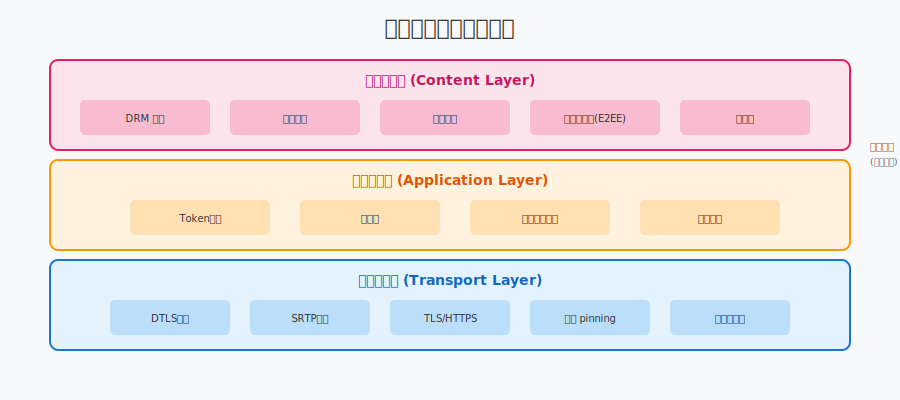
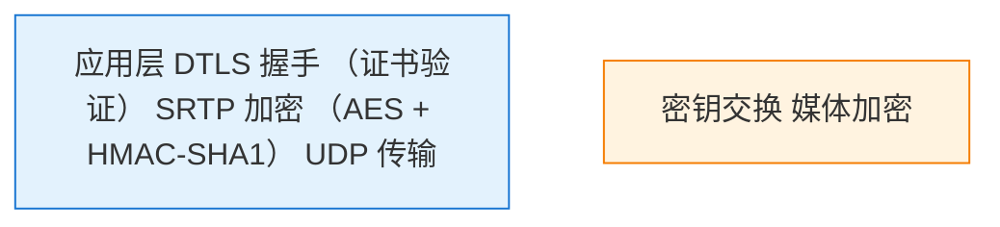
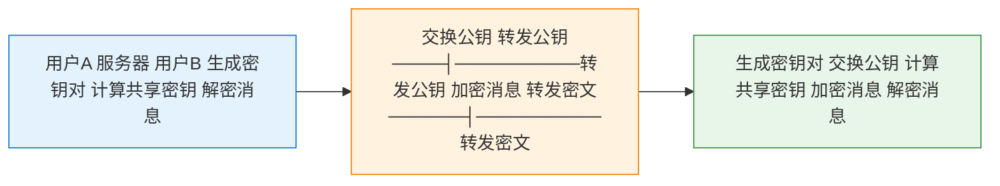

# 第28章：安全防护

> **本章目标**：掌握直播系统的安全防护体系，包括信令安全、媒体安全、内容安全和DDoS防护。

实时通信系统面临多种安全威胁：信令劫持、媒体流窃听、内容违规、DDoS攻击等。本章将系统介绍直播系统的安全防护体系。

---

## 目录

1. [安全威胁概览](#1-安全威胁概览)
2. [信令安全](#2-信令安全)
3. [媒体安全](#3-媒体安全)
4. [内容安全](#4-内容安全)
5. [DDoS防护](#5-ddos防护)
6. [隐私保护](#6-隐私保护)
7. [本章总结](#7-本章总结)

---

## 1. 安全威胁概览

### 1.1 直播系统面临的威胁



| 层次 | 威胁 | 风险等级 |
|:---|:---|:---:|
| **应用层** | 越权访问、身份伪造、数据篡改 | 高 |
| **信令层** | 信令劫持、中间人攻击、重放攻击 | 高 |
| **媒体层** | 媒体流窃听、注入攻击、Relay滥用 | 中 |
| **内容层** | 色情/暴恐内容、垃圾广告、版权侵权 | 高 |
| **网络层** | DDoS攻击、SYN洪水、带宽耗尽 | 高 |

### 1.2 安全设计原则

1. **纵深防御**：多层防护，单层失效不影响整体
2. **最小权限**：只授予必要的权限
3. **默认安全**：安全机制默认开启
4. **零信任**：不信任任何客户端，服务端验证一切

---

## 2. 信令安全

### 2.1 Token认证机制


**JWT Token 结构**：
```
Header.Payload.Signature

Header: {"alg":"HS256","typ":"JWT"}
Payload: {"user_id":"u123","room_id":"r456","iat":1699000000,"exp":1699003600}
Signature: HMACSHA256(base64(header)+"."+base64(payload), secret)
```

```cpp
namespace live {

// Token管理器
class TokenManager {
public:
    // 生成Token
    std::string GenerateToken(const std::string& user_id,
                               const std::string& room_id,
                               int expire_seconds = 3600) {
        JWTPayload payload;
        payload.user_id = user_id;
        payload.room_id = room_id;
        payload.iat = GetCurrentTimestamp();
        payload.exp = payload.iat + expire_seconds;
        payload.nonce = GenerateNonce();
        
        return EncodeJWT(payload, secret_key_);
    }
    
    // 验证Token
    bool VerifyToken(const std::string& token,
                     std::string& out_user_id,
                     std::string& out_room_id) {
        // 1. 检查是否被吊销
        if (revoked_tokens_.count(token)) {
            return false;
        }
        
        // 2. 解码并验证签名
        JWTPayload payload;
        if (!DecodeAndVerifyJWT(token, secret_key_, payload)) {
            return false;
        }
        
        // 3. 检查过期时间
        if (GetCurrentTimestamp() > payload.exp) {
            return false;
        }
        
        out_user_id = payload.user_id;
        out_room_id = payload.room_id;
        return true;
    }
    
    // 吊销Token（用户退出或权限变更）
    void RevokeToken(const std::string& token) {
        revoked_tokens_.insert(token);
        // 定期清理过期token
    }
    
private:
    std::string secret_key_;  // JWT密钥，应定期轮换
    std::set<std::string> revoked_tokens_;
    mutable std::mutex mutex_;
};

} // namespace live
```

### 2.2 房间权限管理

**角色权限矩阵**：

| 权限 | 房主 | 主播 | 观众 | 游客 |
|:---|:---:|:---:|:---:|:---:|
| 发布音视频 | ✅ | ✅ | ❌ | ❌ |
| 订阅其他流 | ✅ | ✅ | ✅ | ✅ |
| 屏幕共享 | ✅ | ✅ | ❌ | ❌ |
| 踢出用户 | ✅ | ❌ | ❌ | ❌ |
| 静音他人 | ✅ | ❌ | ❌ | ❌ |
| 开启录制 | ✅ | ❌ | ❌ | ❌ |
| 发送消息 | ✅ | ✅ | ✅ | ❌ |
| 修改布局 | ✅ | ❌ | ❌ | ❌ |

```cpp
// 权限检查
enum class Permission {
    PUBLISH_AUDIO,
    PUBLISH_VIDEO,
    SUBSCRIBE,
    SCREEN_SHARE,
    KICK_USER,
    MUTE_OTHERS,
    START_RECORDING,
    SEND_MESSAGE
};

class RoomPermissions {
public:
    bool CheckPermission(const std::string& user_id,
                         Permission permission) {
        auto role = GetUserRole(user_id);
        
        switch (permission) {
        case Permission::PUBLISH_VIDEO:
        case Permission::SCREEN_SHARE:
            return role == Role::HOST || role == Role::STREAMER;
        case Permission::KICK_USER:
        case Permission::MUTE_OTHERS:
        case Permission::START_RECORDING:
            return role == Role::HOST;
        case Permission::SEND_MESSAGE:
            return role != Role::GUEST;
        default:
            return true;
        }
    }
    
private:
    enum class Role { HOST, STREAMER, AUDIENCE, GUEST };
    std::map<std::string, Role> user_roles_;
};
```

### 2.3 防重放攻击

```cpp
// 请求签名验证
class RequestSigner {
public:
    // 生成请求签名
    std::string SignRequest(const std::string& method,
                            const std::string& path,
                            const std::string& body,
                            int64_t timestamp,
                            const std::string& nonce) {
        std::string data = method + path + body + 
                          std::to_string(timestamp) + nonce;
        return HMAC_SHA256(data, api_secret_);
    }
    
    // 验证请求
    bool VerifyRequest(const std::string& method,
                       const std::string& path,
                       const std::string& body,
                       int64_t timestamp,
                       const std::string& nonce,
                       const std::string& signature) {
        // 1. 检查时间戳（允许5分钟误差）
        if (std::abs(GetCurrentTimestamp() - timestamp) > 300) {
            return false;
        }
        
        // 2. 检查nonce是否已使用
        if (used_nonces_.count(nonce)) {
            return false;
        }
        used_nonces_.insert(nonce);
        
        // 3. 验证签名
        std::string expected = SignRequest(method, path, body, 
                                          timestamp, nonce);
        return signature == expected;
    }
    
private:
    std::string api_secret_;
    std::set<std::string> used_nonces_;
};
```

---

## 3. 媒体安全

### 3.1 WebRTC默认安全机制

**DTLS（Datagram TLS）**：
- 用于密钥交换
- 基于UDP的TLS
- 证书指纹验证

**SRTP（Secure RTP）**：
- 媒体流加密
- AES加密 + HMAC认证
- 防止窃听和篡改



### 3.2 TURN认证机制

**长期认证机制**：
```
1. 客户端发送 Allocate 请求（无认证）
2. 服务器返回 401 Unauthorized，附带 REALM 和 NONCE
3. 客户端计算：
   password = HMAC-SHA1(shared_secret, username)
   message_integrity = HMAC-SHA1(password, request)
4. 客户端重发请求，附带 MESSAGE-INTEGRITY
5. 服务器验证 MESSAGE-INTEGRITY
```

```cpp
class TURNAuth {
public:
    struct Credentials {
        std::string username;  // 格式: timestamp:user_id
        std::string password;
    };
    
    Credentials GenerateCredentials(const std::string& user_id) {
        Credentials creds;
        int64_t timestamp = GetCurrentTimestamp();
        creds.username = std::to_string(timestamp) + ":" + user_id;
        
        // password = HMAC-SHA1(shared_secret, username)
        creds.password = HMAC_SHA1(shared_secret_, creds.username);
        
        return creds;
    }
    
    bool VerifyCredentials(const std::string& username,
                           const std::string& password) {
        // 解析username
        auto pos = username.find(':');
        if (pos == std::string::npos) return false;
        
        int64_t timestamp = std::stoll(username.substr(0, pos));
        
        // 检查时间戳（24小时有效）
        if (GetCurrentTimestamp() - timestamp > 86400) {
            return false;
        }
        
        // 验证password
        std::string expected = HMAC_SHA1(shared_secret_, username);
        return password == expected;
    }
    
private:
    std::string shared_secret_;  // TURN服务器密钥
};
```

### 3.3 证书指纹验证

```cpp
// DTLS证书指纹验证
class DTLSCertificateVerifier {
public:
    // 计算证书指纹
    std::string ComputeFingerprint(const X509* cert,
                                    const std::string& hash_algo = "SHA-256") {
        unsigned char digest[SHA256_DIGEST_LENGTH];
        unsigned int len;
        
        X509_digest(cert, EVP_sha256(), digest, &len);
        
        // 格式: SHA-256 AA:BB:CC:...
        std::string fingerprint = hash_algo + " ";
        for (unsigned int i = 0; i < len; ++i) {
            if (i > 0) fingerprint += ":";
            char buf[3];
            sprintf(buf, "%02X", digest[i]);
            fingerprint += buf;
        }
        
        return fingerprint;
    }
    
    // 验证SDP中的指纹
    bool VerifyFingerprint(const X509* cert,
                           const std::string& expected_fingerprint) {
        std::string actual = ComputeFingerprint(cert);
        return actual == expected_fingerprint;
    }
};
```

---

## 4. 内容安全

### 4.1 内容审核架构

```
媒体流 → 抽帧/转码 → AI审核服务 → 结果处理
              ↓
         人工审核平台（可疑内容）
              ↓
         封禁/告警/记录
```

### 4.2 视频内容审核

```cpp
// 视频内容审核器
class VideoContentModerator {
public:
    VideoContentModerator() : running_(false) {}
    
    void StartMonitoring(const std::string& stream_id,
                         int check_interval_sec = 5) {
        running_ = true;
        monitor_thread_ = std::thread([this, stream_id, check_interval_sec]() {
            while (running_) {
                // 获取当前帧
                auto frame = CaptureFrame(stream_id);
                
                // AI审核
                ModerationResult result;
                if (ai_client_.CheckImage(frame.data, frame.len, result)) {
                    if (result.porn_score > 0.8 || 
                        result.terror_score > 0.7) {
                        // 高风险，立即处理
                        HandleViolation(stream_id, result);
                    } else if (result.porn_score > 0.5) {
                        // 中风险，送人工审核
                        SendToHumanReview(stream_id, frame, result);
                    }
                }
                
                std::this_thread::sleep_for(
                    std::chrono::seconds(check_interval_sec));
            }
        });
    }
    
    void Stop() {
        running_ = false;
        if (monitor_thread_.joinable()) {
            monitor_thread_.join();
        }
    }
    
private:
    struct ModerationResult {
        float porn_score;    // 色情分数 0-1
        float terror_score;  // 暴恐分数 0-1
        float ad_score;      // 广告分数 0-1
    };
    
    void HandleViolation(const std::string& stream_id,
                         const ModerationResult& result);
    void SendToHumanReview(const std::string& stream_id,
                           const Frame& frame,
                           const ModerationResult& result);
    
    std::atomic<bool> running_;
    std::thread monitor_thread_;
    AIClient ai_client_;
};
```

### 4.3 音频内容审核

```cpp
// 音频审核（ASR + 敏感词检测）
class AudioContentModerator {
public:
    void ProcessAudio(const std::string& stream_id,
                      const int16_t* pcm_data,
                      int samples,
                      int sample_rate) {
        // 1. 语音转文字
        std::string text = asr_engine_.Recognize(pcm_data, samples, sample_rate);
        
        // 2. 敏感词检测
        std::vector<std::string> detected_words;
        for (const auto& word : sensitive_words_) {
            if (text.find(word) != std::string::npos) {
                detected_words.push_back(word);
            }
        }
        
        // 3. 处理违规
        if (!detected_words.empty()) {
            ReportViolation(stream_id, text, detected_words);
        }
    }
    
private:
    ASREngine asr_engine_;
    std::vector<std::string> sensitive_words_;
};
```

### 4.4 审核策略配置

| 内容类型 | 自动封禁阈值 | 人工审核阈值 | 检测频率 |
|:---|:---:|:---:|:---:|
| 色情 | ≥0.8 | ≥0.5 | 每秒1帧 |
| 暴恐 | ≥0.7 | ≥0.5 | 每秒1帧 |
| 政治敏感 | ≥0.9 | ≥0.6 | 每5秒1帧 |
| 垃圾广告 | ≥0.8 | ≥0.6 | 每10秒1帧 |
| 版权问题 | ≥0.85 | - | 实时（音频指纹）|

---

## 5. DDoS防护

### 5.1 限流算法

**漏桶算法**：
```cpp
class LeakyBucketLimiter {
public:
    LeakyBucketLimiter(int capacity, int leak_rate_per_sec)
        : capacity_(capacity)
        , leak_rate_(leak_rate_per_sec)
        , water_(0)
        , last_leak_time_(GetCurrentTimeMs()) {}
    
    bool AllowRequest() {
        std::lock_guard<std::mutex> lock(mutex_);
        
        // 计算漏出量
        int64_t now = GetCurrentTimeMs();
        int leaked = static_cast<int>(
            (now - last_leak_time_) * leak_rate_ / 1000);
        water_ = std::max(0, water_ - leaked);
        last_leak_time_ = now;
        
        // 检查是否还有容量
        if (water_ < capacity_) {
            water_++;
            return true;
        }
        
        return false;  // 桶已满，拒绝请求
    }
    
private:
    int capacity_;      // 桶容量
    int leak_rate_;     // 漏出速率（每秒）
    int water_;         // 当前水量
    int64_t last_leak_time_;
    std::mutex mutex_;
};
```

**令牌桶算法**（支持突发）：
```cpp
class TokenBucketLimiter {
public:
    TokenBucketLimiter(int capacity, int fill_rate_per_sec)
        : capacity_(capacity)
        , fill_rate_(fill_rate_per_sec)
        , tokens_(capacity)
        , last_fill_time_(GetCurrentTimeMs()) {}
    
    bool AllowRequest(int tokens_needed = 1) {
        std::lock_guard<std::mutex> lock(mutex_);
        
        // 填充令牌
        int64_t now = GetCurrentTimeMs();
        int new_tokens = static_cast<int>(
            (now - last_fill_time_) * fill_rate_ / 1000);
        tokens_ = std::min(capacity_, tokens_ + new_tokens);
        last_fill_time_ = now;
        
        // 消费令牌
        if (tokens_ >= tokens_needed) {
            tokens_ -= tokens_needed;
            return true;
        }
        
        return false;
    }
    
private:
    int capacity_;
    int fill_rate_;
    int tokens_;
    int64_t last_fill_time_;
    std::mutex mutex_;
};
```

### 5.2 IP黑名单

```cpp
class IPBlacklist {
public:
    void AddToBlacklist(const std::string& ip, int ban_minutes) {
        std::lock_guard<std::mutex> lock(mutex_);
        int64_t expire_time = GetCurrentTimeMs() + ban_minutes * 60 * 1000;
        banned_ips_[ip] = expire_time;
    }
    
    bool IsBlacklisted(const std::string& ip) {
        std::lock_guard<std::mutex> lock(mutex_);
        
        auto it = banned_ips_.find(ip);
        if (it == banned_ips_.end()) {
            return false;
        }
        
        // 检查是否过期
        if (GetCurrentTimeMs() > it->second) {
            banned_ips_.erase(it);
            return false;
        }
        
        return true;
    }
    
    // 自动检测异常行为并封禁
    void RecordRequest(const std::string& ip) {
        std::lock_guard<std::mutex> lock(mutex_);
        
        auto& stat = ip_stats_[ip];
        stat.count++;
        
        int64_t now = GetCurrentTimeMs();
        if (now - stat.window_start > 60000) {  // 1分钟窗口
            stat.count = 1;
            stat.window_start = now;
        }
        
        // 超过阈值则封禁
        if (stat.count > 1000) {  // 每分钟1000请求
            AddToBlacklist(ip, 60);  // 封禁1小时
        }
    }
    
private:
    struct IPStat {
        int count = 0;
        int64_t window_start = 0;
    };
    
    std::map<std::string, int64_t> banned_ips_;
    std::map<std::string, IPStat> ip_stats_;
    std::mutex mutex_;
};
```

### 5.3 WAF规则

```cpp
// Web应用防火墙
class WAF {
public:
    bool CheckRequest(const HTTPRequest& req) {
        // 1. SQL注入检测
        if (ContainsSQLInjection(req.body) || 
            ContainsSQLInjection(req.query)) {
            LOG_WARNING("SQL injection detected from %s", 
                       req.client_ip.c_str());
            return false;
        }
        
        // 2. XSS检测
        if (ContainsXSS(req.body)) {
            LOG_WARNING("XSS detected from %s", req.client_ip.c_str());
            return false;
        }
        
        // 3. 路径遍历检测
        if (req.path.find("..") != std::string::npos) {
            LOG_WARNING("Path traversal detected from %s", 
                       req.client_ip.c_str());
            return false;
        }
        
        return true;
    }
    
private:
    bool ContainsSQLInjection(const std::string& input);
    bool ContainsXSS(const std::string& input);
};
```

---

## 6. 隐私保护

### 6.1 端到端加密(E2EE)


**E2EE 流程**：


**重要**：服务器只转发密文，无法解密内容。

```cpp
// 端到端加密实现
class E2EEncryption {
public:
    // 生成ECDH密钥对
    void GenerateKeyPair(std::vector<uint8_t>& public_key,
                         std::vector<uint8_t>& private_key) {
        EVP_PKEY* pkey = EVP_PKEY_new();
        EVP_PKEY_CTX* ctx = EVP_PKEY_CTX_new_id(EVP_PKEY_EC, nullptr);
        
        EVP_PKEY_keygen_init(ctx);
        EVP_PKEY_CTX_set_ec_paramgen_curve_nid(ctx, NID_X9_62_prime256v1);
        EVP_PKEY_keygen(ctx, &pkey);
        
        // 导出公私钥...
        
        EVP_PKEY_CTX_free(ctx);
    }
    
    // 计算共享密钥
    std::vector<uint8_t> DeriveSharedSecret(
        const std::vector<uint8_t>& my_private_key,
        const std::vector<uint8_t>& peer_public_key) {
        
        // ECDH密钥交换
        EVP_PKEY* priv = LoadPrivateKey(my_private_key);
        EVP_PKEY* pub = LoadPublicKey(peer_public_key);
        
        EVP_PKEY_CTX* ctx = EVP_PKEY_CTX_new(priv, nullptr);
        EVP_PKEY_derive_init(ctx);
        EVP_PKEY_derive_set_peer(ctx, pub);
        
        size_t secret_len;
        EVP_PKEY_derive(ctx, nullptr, &secret_len);
        
        std::vector<uint8_t> secret(secret_len);
        EVP_PKEY_derive(ctx, secret.data(), &secret_len);
        
        // HKDF派生加密密钥
        return HKDF(secret, "webrtc-e2ee-key");
    }
    
    // AES-GCM加密
    std::vector<uint8_t> Encrypt(const std::vector<uint8_t>& plaintext,
                                   const std::vector<uint8_t>& key) {
        // 生成随机IV
        std::vector<uint8_t> iv(12);
        RAND_bytes(iv.data(), iv.size());
        
        std::vector<uint8_t> ciphertext(plaintext.size() + 16);  // +tag
        int len;
        
        EVP_CIPHER_CTX* ctx = EVP_CIPHER_CTX_new();
        EVP_EncryptInit_ex(ctx, EVP_aes_256_gcm(), nullptr, 
                          key.data(), iv.data());
        EVP_EncryptUpdate(ctx, ciphertext.data(), &len,
                         plaintext.data(), plaintext.size());
        
        int final_len;
        EVP_EncryptFinal_ex(ctx, ciphertext.data() + len, &final_len);
        
        // 获取认证tag
        std::vector<uint8_t> tag(16);
        EVP_CIPHER_CTX_ctrl(ctx, EVP_CTRL_GCM_GET_TAG, 16, tag.data());
        
        EVP_CIPHER_CTX_free(ctx);
        
        // 组合: IV + ciphertext + tag
        std::vector<uint8_t> result;
        result.insert(result.end(), iv.begin(), iv.end());
        result.insert(result.end(), ciphertext.begin(), 
                     ciphertext.begin() + len + final_len);
        result.insert(result.end(), tag.begin(), tag.end());
        
        return result;
    }
    
private:
    std::vector<uint8_t> HKDF(const std::vector<uint8_t>& ikm,
                               const std::string& info);
};
```

### 6.2 数据脱敏

```cpp
class DataMasking {
public:
    // 手机号脱敏: 138****8888
    static std::string MaskPhone(const std::string& phone) {
        if (phone.length() < 7) return "****";
        return phone.substr(0, 3) + "****" + 
               phone.substr(phone.length() - 4);
    }
    
    // 身份证号脱敏: 110101********1234
    static std::string MaskIdCard(const std::string& idcard) {
        if (idcard.length() < 8) return "********";
        return idcard.substr(0, 6) + std::string(idcard.length() - 10, '*') +
               idcard.substr(idcard.length() - 4);
    }
    
    // 邮箱脱敏: a***@example.com
    static std::string MaskEmail(const std::string& email) {
        auto at_pos = email.find('@');
        if (at_pos == std::string::npos) return "***";
        
        std::string local = email.substr(0, at_pos);
        std::string domain = email.substr(at_pos);
        
        if (local.length() <= 1) return "***" + domain;
        return local.substr(0, 1) + std::string(local.length() - 1, '*') + domain;
    }
    
    // 日志脱敏（正则替换敏感信息）
    static std::string MaskLog(const std::string& log) {
        std::string result = log;
        
        // 手机号
        std::regex phone_regex("(1[3-9]\\d)\\d{4}(\\d{4})");
        result = std::regex_replace(result, phone_regex, "$1****$2");
        
        // 身份证号
        std::regex idcard_regex("(\\d{6})\\d{8,10}(\\d{2}[\\dXx])");
        result = std::regex_replace(result, idcard_regex, "$1********$2");
        
        return result;
    }
};
```

---

## 7. 本章总结

### 7.1 安全防护体系

| 层次 | 防护措施 | 关键技术 |
|:---|:---|:---|
| **应用层** | Token认证、权限控制 | JWT、RBAC |
| **信令层** | WSS加密、防重放 | TLS、签名验证 |
| **媒体层** | DTLS/SRTP、TURN认证 | 证书指纹、HMAC |
| **内容层** | AI审核、敏感词过滤 | 图像识别、ASR |
| **网络层** | DDoS防护、限流 | 令牌桶、IP黑名单 |
| **隐私层** | E2EE、数据脱敏 | ECDH、AES-GCM |

### 7.2 课后思考

1. **Token安全**：JWT Token泄露后如何快速吊销？设计一个Token刷新机制。

2. **E2EE权衡**：端到端加密保护了隐私，但也给内容审核带来困难。如何在安全和合规之间取得平衡？

3. **DDoS防御**：TURN服务器容易被滥用为DDoS放大器。如何设计TURN认证和限流策略防止滥用？

4. **隐私法规**：欧盟GDPR要求"被遗忘权"（Right to be Forgotten）。实时通信系统如何实现对历史数据的删除？
