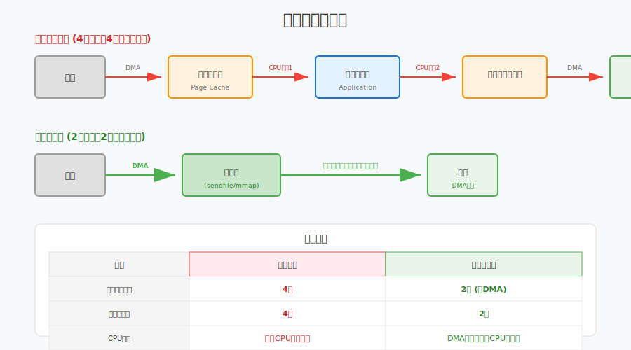

# 第二十八章：性能调优

> **本章目标**：掌握直播系统的性能优化技巧，包括服务端优化、客户端优化和网络优化。

性能直接影响用户体验。本章从服务端、客户端、网络三个维度介绍性能优化方法。

---

## 目录

1. [性能指标定义](#1-性能指标定义)
2. [服务端性能优化](#2-服务端性能优化)
3. [客户端性能优化](#3-客户端性能优化)
4. [网络优化](#4-网络优化)
5. [编解码优化](#5-编解码优化)
6. [压力测试](#6-压力测试)
7. [本章总结](#7-本章总结)

---

## 1. 性能指标定义

### 1.1 关键性能指标（KPI）

| 指标 | 目标值 | 测量方法 |
|:---|:---:|:---|
| **端到端延迟** | < 400ms | 发送时间戳 - 接收时间戳 |
| **首帧时间** | < 2s | 加入房间到看到画面 |
| **卡顿率** | < 3% | 卡顿次数 / 总播放时长 |
| **CPU占用** | < 50% | 系统监控 |
| **内存占用** | < 500MB | 系统监控 |
| **电池消耗** | < 10%/小时 | 移动设备 |

### 1.2 性能分析工具

```cpp
// 性能分析器
class PerformanceProfiler {
public:
    void StartTrace(const std::string& name) {
        traces_[name] = GetCurrentTimeUs();
    }
    
    void EndTrace(const std::string& name) {
        auto it = traces_.find(name);
        if (it != traces_.end()) {
            int64_t elapsed = GetCurrentTimeUs() - it->second;
            LOG_INFO("[%s] took %ld us", name.c_str(), elapsed);
            
            // 记录统计
            stats_[name].AddSample(elapsed);
        }
    }
    
    void PrintStats() {
        for (const auto& [name, stat] : stats_) {
            LOG_INFO("[%s] avg=%ld, min=%ld, max=%ld, p99=%ld",
                     name.c_str(), stat.Average(), stat.Min(),
                     stat.Max(), stat.P99());
        }
    }
    
private:
    std::map<std::string, int64_t> traces_;
    std::map<std::string, Statistics> stats_;
};
```

---

## 2. 服务端性能优化

### 2.1 零拷贝技术原理详解

#### 2.1.1 传统数据拷贝的开销



**传统数据传输（以文件发送为例）**：
```
磁盘 → 页缓存 → 用户缓冲区 → Socket缓冲区 → 网卡
      [CPU拷贝1]  [CPU拷贝2]   [CPU拷贝3]
      
总开销：4次上下文切换，4次数据拷贝（其中3次CPU拷贝）
```

**数据拷贝流程详解**：

| 步骤 | 操作 | 执行者 | 开销 |
|:---:|:---|:---|:---:|
| 1 | 磁盘 → 内核页缓存 | DMA | 低 |
| 2 | 页缓存 → 用户缓冲区 | CPU | 高 |
| 3 | 用户缓冲区 → Socket缓冲区 | CPU | 高 |
| 4 | Socket缓冲区 → 网卡 | DMA | 低 |

**CPU拷贝的代价**：
- 消耗CPU周期（现代CPU约1-5 GB/s每核）
- 占用内存带宽
- 污染CPU缓存（Cache Pollution）

#### 2.1.2 DMA与页缓存机制

**DMA（Direct Memory Access）**：

DMA允许外设直接与内存交换数据，无需CPU参与：

```
┌─────────┐    DMA传输     ┌─────────┐
│  磁盘   │ ←────────────→ │  内存   │
│  网卡   │   （无需CPU）   │（页缓存）│
└─────────┘                └─────────┘
```

**页缓存（Page Cache）**：

Linux内核使用页缓存来优化文件I/O：

```cpp
// 页缓存的核心数据结构
struct page {
    unsigned long flags;        // 页状态标志
    struct address_space *mapping;  // 所属文件
    pgoff_t index;              // 在文件中的偏移
    void *virtual;              // 内核虚拟地址
    // ...
};

// 文件读取时的页缓存流程
ssize_t read_page_cache(struct file *file, char __user *buf, size_t count) {
    // 1. 检查页缓存是否命中
    page = find_get_page(mapping, index);
    if (page) {
        // 缓存命中：直接复制到用户空间
        copy_to_user(buf, page_address(page), count);
    } else {
        // 缓存未命中：从磁盘读取
        page = alloc_page(GFP_KERNEL);
        // 发起DMA读取
        submit_bio(READ, page, sector);
        // 等待DMA完成
        wait_on_page_locked(page);
        copy_to_user(buf, page_address(page), count);
    }
}
```

#### 2.1.3 mmap内存映射机制

**mmap原理**：

将文件直接映射到进程虚拟地址空间，避免显式拷贝：

```
进程虚拟地址空间
├─ 代码段
├─ 数据段  
├─ 堆
├─ mmap区域 ←── 映射文件（共享页缓存）
│              ┌─────────┐
└─ 栈          │ 页缓存  │ ←── 物理内存
               │（共享）  │
               └────┬────┘
                    │
               ┌────┴────┐
               │  磁盘   │
               └─────────┘
```

```cpp
// mmap使用示例
class MmapFile {
public:
    bool Open(const char* path, size_t size) {
        fd_ = open(path, O_RDONLY);
        if (fd_ < 0) return false;
        
        // 将文件映射到内存
        addr_ = mmap(nullptr, size, PROT_READ, MAP_SHARED, fd_, 0);
        if (addr_ == MAP_FAILED) {
            close(fd_);
            return false;
        }
        size_ = size;
        return true;
    }
    
    // 直接访问内存，无需read()拷贝
    const void* Data() const { return addr_; }
    
    // 发送数据 - 可以配合sendfile或splice实现零拷贝
    ssize_t SendToSocket(int sock_fd) {
        // 方法1: 使用sendfile（内核内部零拷贝）
        return sendfile(sock_fd, fd_, nullptr, size_);
        
        // 方法2: 使用splice（管道零拷贝）
        // return SpliceToSocket(sock_fd);
    }
    
private:
    int fd_ = -1;
    void* addr_ = nullptr;
    size_t size_ = 0;
};
```

**mmap的优势**：
1. **减少拷贝**：用户空间直接访问内核页缓存
2. **节省内存**：多个进程共享同一物理页
3. **按需加载**：缺页中断时才从磁盘读取

#### 2.1.4 零拷贝技术实现方式

**四种零拷贝技术对比**：

| 技术 | API | 适用场景 | 限制 |
|:---|:---|:---|:---|
| **sendfile** | `sendfile()` | 文件→Socket | Linux 2.1+，文件到网络 |
| **splice** | `splice()` | 管道/文件描述符间 | Linux 2.6.17+，至少一端是管道 |
| **mmap+write** | `mmap()` + `write()` | 需要处理文件内容 | 页表开销，大文件需要分页 |
| **DPDK** | 用户态驱动 | 极高性能网络 | 需要专门支持，绕过了内核 |

```cpp
// 完整零拷贝实现示例
class ZeroCopyTransmitter {
public:
    // 方法1: sendfile（最简单）
    ssize_t SendFile(int out_fd, int in_fd, off_t offset, size_t count) {
        off_t off = offset;
        return sendfile(out_fd, in_fd, &off, count);
    }
    
    // 方法2: splice（更灵活，支持管道）
    ssize_t SpliceTransfer(int in_fd, int out_fd, size_t count) {
        int pipefd[2];
        pipe(pipefd);
        
        ssize_t total = 0;
        while (total < count) {
            // 从输入到管道
            ssize_t n = splice(in_fd, nullptr, pipefd[1], nullptr,
                               count - total, SPLICE_F_MOVE);
            if (n <= 0) break;
            
            // 从管道到输出
            ssize_t m = splice(pipefd[0], nullptr, out_fd, nullptr,
                               n, SPLICE_F_MOVE);
            if (m <= 0) break;
            
            total += m;
        }
        
        close(pipefd[0]);
        close(pipefd[1]);
        return total;
    }
    
    // 方法3: DPDK（用户态网络栈）
    #ifdef USE_DPDK
    ssize_t DPDKSend(void* data, size_t len) {
        // 使用rte_eth_tx_burst直接发送
        struct rte_mbuf* pkt = rte_pktmbuf_alloc(mbuf_pool);
        rte_memcpy(rte_pktmbuf_mtod(pkt, void*), data, len);
        rte_eth_tx_burst(port_id, queue_id, &pkt, 1);
    }
    #endif
};
```

### 2.2 内存池设计理论

#### 2.2.1 内存碎片问题

**内存碎片的两种类型**：

| 类型 | 描述 | 产生原因 | 影响 |
|:---|:---|:---|:---|
| **外部碎片** | 空闲内存总量足够，但分散在不连续的块中 | 频繁的分配/释放不同大小的内存 | 无法满足大内存分配请求 |
| **内部碎片** | 分配的内存块大于请求的大小 | 对齐要求、固定大小分配 | 浪费内存空间 |

**碎片化的数学模型**：

假设系统有 $M$ 字节内存，经过 $n$ 次分配/释放后，可用内存碎片化程度可以用以下指标衡量：

$$Fragmentation = 1 - \frac{LargestFreeBlock}{TotalFreeMemory}$$

- 碎片化=0：所有空闲内存连续
- 碎片化接近1：空闲内存极度分散

```
初始状态: [██████████████████████████████] 30MB连续

多次分配释放后:
[███░░░███░░░░░░███░░░███░░░░███░░░] 
 已用 空闲  已用  空闲  已用 空闲  已用  空闲
 
外部碎片: 总空闲=12MB, 最大连续块=3MB → 无法分配5MB对象
```

#### 2.2.2 内存分配策略

**常见分配策略对比**：

| 策略 | 算法 | 优点 | 缺点 | 适用场景 |
|:---|:---|:---|:---|:---|
| **首次适应** | 找到第一个足够大的块 | 速度快 | 低地址碎片多 | 小对象快速分配 |
| **最佳适应** | 找到最小的足够大的块 | 碎片较少 | 搜索开销大 | 内存紧张场景 |
| **伙伴系统** | 2的幂次分块，合并时寻找伙伴 | 合并效率高 | 内部碎片 | 内核内存管理 |
| **slab分配** | 按对象类型缓存 | 无碎片、快速 | 类型固定 | 内核对象、固定大小 |

**伙伴系统原理**：

```
初始化: 一个64KB的大块

分配8KB:
64KB → 分裂为 32KB + 32KB
32KB → 分裂为 16KB + 16KB  
16KB → 分裂为 8KB + 8KB
分配其中一个8KB

释放时:
检查相邻的"伙伴"是否空闲
如果空闲，合并为更大的块
```

```cpp
// 伙伴系统实现示例
class BuddyAllocator {
public:
    static constexpr size_t MIN_BLOCK_SIZE = 4096;  // 4KB
    static constexpr size_t MAX_BLOCK_SIZE = 1024 * 1024;  // 1MB
    static constexpr int NUM_LEVELS = 9;  // log2(1M/4K) + 1
    
    BuddyAllocator() {
        // 初始化：整个内存作为一个大块
        free_lists_[NUM_LEVELS - 1].push_back(memory_start_);
    }
    
    void* Allocate(size_t size) {
        int level = SizeToLevel(size);
        
        // 查找可用块
        for (int i = level; i < NUM_LEVELS; ++i) {
            if (!free_lists_[i].empty()) {
                void* block = free_lists_[i].back();
                free_lists_[i].pop_back();
                
                // 分裂大块直到合适大小
                while (i > level) {
                    i--;
                    void* buddy = SplitBlock(block, i);
                    free_lists_[i].push_back(buddy);
                }
                return block;
            }
        }
        return nullptr;  // 内存不足
    }
    
    void Deallocate(void* ptr, size_t size) {
        int level = SizeToLevel(size);
        
        // 尝试合并伙伴
        while (level < NUM_LEVELS - 1) {
            void* buddy = GetBuddy(ptr, level);
            auto& list = free_lists_[level];
            
            auto it = std::find(list.begin(), list.end(), buddy);
            if (it == list.end()) break;  // 伙伴未释放
            
            // 合并
            list.erase(it);
            ptr = MergeBlocks(ptr, buddy);
            level++;
        }
        
        free_lists_[level].push_back(ptr);
    }
    
private:
    int SizeToLevel(size_t size) {
        int level = 0;
        size_t block_size = MIN_BLOCK_SIZE;
        while (block_size < size && level < NUM_LEVELS) {
            block_size *= 2;
            level++;
        }
        return level;
    }
    
    void* SplitBlock(void* block, int level);
    void* GetBuddy(void* block, int level);
    void* MergeBlocks(void* block1, void* block2);
    
    std::vector<void*> free_lists_[NUM_LEVELS];
    char* memory_start_;
};
```

#### 2.2.3 固定大小内存池设计

**直播系统中的内存池应用**：

```cpp
// 固定大小内存池 - 适合RTP包等固定大小对象
template<size_t BlockSize, size_t NumBlocksPerChunk = 1024>
class FixedMemoryPool {
public:
    FixedMemoryPool() {
        static_assert(BlockSize >= sizeof(void*), "BlockSize too small");
        AllocateChunk();
    }
    
    ~FixedMemoryPool() {
        for (auto chunk : chunks_) {
            delete[] chunk;
        }
    }
    
    // 禁止拷贝
    FixedMemoryPool(const FixedMemoryPool&) = delete;
    FixedMemoryPool& operator=(const FixedMemoryPool&) = delete;
    
    void* Allocate() {
        std::lock_guard<std::mutex> lock(mutex_);
        
        if (free_list_ == nullptr) {
            AllocateChunk();
        }
        
        // 从空闲链表弹出
        void* ptr = free_list_;
        free_list_ = *reinterpret_cast<void**>(free_list_);
        
        allocated_count_++;
        return ptr;
    }
    
    void Deallocate(void* ptr) {
        if (!ptr) return;
        
        std::lock_guard<std::mutex> lock(mutex_);
        
        // 推入空闲链表
        *reinterpret_cast<void**>(ptr) = free_list_;
        free_list_ = ptr;
        
        allocated_count_--;
    }
    
    size_t GetAllocatedCount() const {
        return allocated_count_;
    }
    
    size_t GetTotalBlocks() const {
        return chunks_.size() * NumBlocksPerChunk;
    }
    
private:
    void AllocateChunk() {
        // 分配一大块内存
        char* chunk = new char[BlockSize * NumBlocksPerChunk];
        chunks_.push_back(chunk);
        
        // 将新块分割并加入空闲链表
        for (size_t i = 0; i < NumBlocksPerChunk; ++i) {
            void* ptr = chunk + i * BlockSize;
            *reinterpret_cast<void**>(ptr) = free_list_;
            free_list_ = ptr;
        }
    }
    
    std::vector<char*> chunks_;
    void* free_list_ = nullptr;
    std::mutex mutex_;
    size_t allocated_count_ = 0;
};

// 使用示例：RTP包内存池
using RtpPacketPool = FixedMemoryPool<1500, 2048>;  // MTU大小

// 智能指针包装，自动回收
class PooledRtpPacket {
public:
    static std::shared_ptr<PooledRtpPacket> Create(RtpPacketPool& pool) {
        void* mem = pool.Allocate();
        auto deleter = [&pool](PooledRtpPacket* p) {
            p->~PooledRtpPacket();
            pool.Deallocate(p);
        };
        return std::shared_ptr<PooledRtpPacket>(
            new (mem) PooledRtpPacket(), deleter);
    }
    
    uint8_t data[1400];
    size_t length;
    // ... 其他字段
};
```

### 2.3 无锁编程理论

#### 2.3.1 内存序（Memory Order）

**为什么需要内存序？**

现代CPU和编译器会对指令进行重排序以优化性能，但这可能导致多线程程序出现意外行为：

```cpp
// 问题示例（无同步）
int data = 0;
bool ready = false;

// 线程1
void Producer() {
    data = 42;          // A
    ready = true;       // B - 可能被重排到A之前！
}

// 线程2
void Consumer() {
    while (!ready);     // C
    assert(data == 42); // D - 可能失败！
}
```

**C++11内存序选项**：

| 内存序 | 含义 | 使用场景 |
|:---|:---|:---|
| `memory_order_relaxed` | 无同步或顺序约束 | 单纯的原子计数器 |
| `memory_order_consume` | 依赖同步（较少使用） | 数据依赖的读取 |
| `memory_order_acquire` | 后续读不能重排到前面 | 锁的获取、消费者 |
| `memory_order_release` | 前面写不能重排到后面 | 锁的释放、生产者 |
| `memory_order_acq_rel` | 同时是acquire和release | 读-修改-写操作 |
| `memory_order_seq_cst` | 顺序一致性（最强） | 默认，最安全的选项 |

**Acquire-Release语义详解**：

```cpp
// 正确使用acquire-release实现同步
class LockFreeQueue {
    std::atomic<int*> data_{nullptr};
    std::atomic<bool> ready_{false};
    
public:
    void Produce(int value) {
        int* p = new int(value);
        
        // release: 确保p的写入在ready之前对其他线程可见
        data_.store(p, std::memory_order_release);
        ready_.store(true, std::memory_order_release);
    }
    
    int* Consume() {
        // acquire: 确保看到ready=true后，能看到data的写入
        while (!ready_.load(std::memory_order_acquire)) {
            // 自旋等待
        }
        
        return data_.load(std::memory_order_acquire);
    }
};
```

#### 2.3.2 ABA问题

**什么是ABA问题？**

```
时间线：
T1: 线程A读取值X，准备CAS
    ↓
T2: 线程B将X改为Y
    ↓
T3: 线程B将Y改回X
    ↓
T4: 线程A执行CAS，成功！（但实际中间有变化）
```

**ABA问题示例**：

```cpp
// 有问题的无锁栈实现
template<typename T>
class LockFreeStack {
    struct Node {
        T data;
        Node* next;
    };
    
    std::atomic<Node*> head_{nullptr};
    
public:
    void Push(T value) {
        Node* new_node = new Node{value, head_.load()};
        while (!head_.compare_exchange_weak(new_node->next, new_node));
    }
    
    bool Pop(T& value) {
        Node* old_head = head_.load();
        if (!old_head) return false;
        
        // ABA问题在这里：
        // 如果此时其他线程pop了又push了相同的指针值
        // compare_exchange会成功，但old_head->next可能已失效！
        while (!head_.compare_exchange_weak(old_head, old_head->next));
        
        value = old_head->data;
        delete old_head;  // 危险：可能已经被其他线程释放
        return true;
    }
};
```

**解决方案**：

| 方案 | 原理 | 实现 | 开销 |
|:---|:---|:---|:---:|
| ** Hazard Pointers** | 延迟回收，标记正在使用的指针 | 复杂 | 中等 |
| **引用计数** | 原子引用计数，计数为0才释放 | 中等 | 较高 |
| **Tagged Pointer** | 在指针低位存储版本号 | 简单 | 低 |

```cpp
// 使用Tagged Pointer解决ABA
class TaggedPointer {
    std::atomic<uint64_t> ptr_{0};  // 高48位指针，低16位版本号
    
public:
    void* GetPointer() const {
        return reinterpret_cast<void*>(ptr_.load() & ~0xFFFFULL);
    }
    
    uint16_t GetTag() const {
        return static_cast<uint16_t>(ptr_.load() & 0xFFFFULL);
    }
    
    bool CompareAndSwap(void* expected_ptr, uint16_t expected_tag,
                        void* new_ptr, uint16_t new_tag) {
        uint64_t expected = reinterpret_cast<uint64_t>(expected_ptr) | expected_tag;
        uint64_t desired = reinterpret_cast<uint64_t>(new_ptr) | new_tag;
        return ptr_.compare_exchange_strong(expected, desired);
    }
};
```

#### 2.3.3 无锁队列实现

```cpp
// 单生产者单消费者(SPSC)无锁队列
template<typename T, size_t Size>
class LockFreeSPSCQueue {
public:
    static_assert((Size & (Size - 1)) == 0, "Size must be power of 2");
    
    LockFreeSPSCQueue() : head_(0), tail_(0) {}
    
    // 生产者调用（单线程）
    bool Push(const T& item) {
        const size_t current_tail = tail_.load(std::memory_order_relaxed);
        const size_t next_tail = (current_tail + 1) & (Size - 1);
        
        // 检查队列满
        if (next_tail == head_.load(std::memory_order_acquire)) {
            return false;  // 队列满
        }
        
        buffer_[current_tail] = item;
        
        // release: 确保item写入在tail更新前可见
        tail_.store(next_tail, std::memory_order_release);
        return true;
    }
    
    // 消费者调用（单线程）
    bool Pop(T& item) {
        const size_t current_head = head_.load(std::memory_order_relaxed);
        
        // 检查队列空
        if (current_head == tail_.load(std::memory_order_acquire)) {
            return false;  // 队列空
        }
        
        item = buffer_[current_head];
        
        // release: 确保item读取在head更新后完成
        head_.store((current_head + 1) & (Size - 1), 
                    std::memory_order_release);
        return true;
    }
    
    bool Empty() const {
        return head_.load(std::memory_order_acquire) == 
               tail_.load(std::memory_order_acquire);
    }
    
private:
    T buffer_[Size];
    alignas(64) std::atomic<size_t> head_;
    alignas(64) std::atomic<size_t> tail_;
};

// 多生产者多消费者(MPMC)无锁队列（基于DPDK的ring实现）
template<typename T, size_t Size>
class LockFreeMPMCQueue {
    struct Slot {
        std::atomic<size_t> turn{0};
        T data;
    };
    
    std::vector<Slot> buffer_;
    alignas(64) std::atomic<size_t> head_{0};
    alignas(64) std::atomic<size_t> tail_{0};
    
public:
    LockFreeMPMCQueue() : buffer_(Size) {}
    
    bool Push(const T& item) {
        const size_t slot = tail_.fetch_add(1, std::memory_order_relaxed);
        Slot& s = buffer_[slot % Size];
        
        // 等待slot可用（turn == slot/Size）
        while (s.turn.load(std::memory_order_acquire) != slot / Size) {
            // 自旋或yield
        }
        
        s.data = item;
        s.turn.store(slot / Size + 1, std::memory_order_release);
        return true;
    }
    
    bool Pop(T& item) {
        const size_t slot = head_.fetch_add(1, std::memory_order_relaxed);
        Slot& s = buffer_[slot % Size];
        
        // 等待数据就绪
        while (s.turn.load(std::memory_order_acquire) != slot / Size + 1) {
            // 自旋或yield
        }
        
        item = s.data;
        s.turn.store(slot / Size + 1 + Size, std::memory_order_release);
        return true;
    }
};
```

### 2.4 CPU亲和性

```cpp
// 绑定线程到特定CPU核心
void SetThreadAffinity(int cpu_core) {
    cpu_set_t cpuset;
    CPU_ZERO(&cpuset);
    CPU_SET(cpu_core, &cpuset);
    
    pthread_setaffinity_np(pthread_self(), sizeof(cpu_set_t), &cpuset);
}

// 为不同工作负载分配CPU核心
void SetupCPUAffinity() {
    // 网络接收线程 → CPU 0-1
    // 编码线程 → CPU 2-3
    // 业务逻辑 → CPU 4-5
    // 其他 → CPU 6-7
}
```

---

## 3. 客户端性能优化

### 3.1 渲染优化

```cpp
// 视频渲染优化
class OptimizedVideoRenderer {
public:
    void RenderFrame(const VideoFrame& frame) {
        // 1. 检查是否需要渲染（可见性检测）
        if (!IsVisible(frame.target_rect)) {
            return;  // 跳过不可见的帧
        }
        
        // 2. 检查尺寸变化
        if (frame.width != last_width_ || frame.height != last_height_) {
            RecreateTexture(frame.width, frame.height);
            last_width_ = frame.width;
            last_height_ = frame.height;
        }
        
        // 3. 批量更新纹理（减少GPU上传次数）
        if (pending_frames_.size() >= batch_size_) {
            FlushBatch();
        }
        pending_frames_.push_back(frame);
    }
    
private:
    void RecreateTexture(int width, int height) {
        // 使用2的幂次尺寸，提高GPU效率
        int tex_width = NextPowerOfTwo(width);
        int tex_height = NextPowerOfTwo(height);
        
        // 创建纹理...
    }
    
    bool IsVisible(const Rect& rect) {
        // 检测是否在屏幕范围内
        return rect.Intersects(screen_rect_);
    }
    
    std::vector<VideoFrame> pending_frames_;
    static constexpr int batch_size_ = 3;
    int last_width_ = 0;
    int last_height_ = 0;
};
```

### 3.2 功耗管理

```cpp
// 电池感知优化
class PowerManager {
public:
    void OnBatteryStatusChanged(bool is_ac_power, int battery_percent) {
        is_ac_power_ = is_ac_power;
        battery_percent_ = battery_percent;
        
        if (!is_ac_power && battery_percent < 20) {
            // 低电量模式
            EnterLowPowerMode();
        } else if (!is_ac_power) {
            // 电池模式
            EnterBatteryMode();
        } else {
            // 插电模式
            EnterPerformanceMode();
        }
    }
    
    void EnterLowPowerMode() {
        // 降低编码分辨率
        video_encoder_.SetResolution(640, 360);
        
        // 降低帧率
        video_encoder_.SetFrameRate(15);
        
        // 降低码率
        video_encoder_.SetBitrate(500000);  // 500kbps
        
        // 减少视频预览帧率
        preview_fps_ = 15;
    }
    
    void EnterBatteryMode() {
        video_encoder_.SetResolution(1280, 720);
        video_encoder_.SetFrameRate(24);
        video_encoder_.SetBitrate(1500000);  // 1.5Mbps
        preview_fps_ = 24;
    }
    
    void EnterPerformanceMode() {
        video_encoder_.SetResolution(1920, 1080);
        video_encoder_.SetFrameRate(30);
        video_encoder_.SetBitrate(2500000);  // 2.5Mbps
        preview_fps_ = 30;
    }
    
private:
    bool is_ac_power_ = true;
    int battery_percent_ = 100;
    VideoEncoder video_encoder_;
    int preview_fps_ = 30;
};
```

---

## 4. 网络优化

### 4.1 BBR拥塞控制算法原理

#### 4.1.1 传统拥塞控制的局限

**Reno/Cubic的问题**：

| 问题 | 原因 | 后果 |
|:---|:---|:---|
| **高延迟** | 填满缓冲区才检测到拥塞 | Bufferbloat，延迟激增 |
| **丢包敏感** | 将丢包视为拥塞信号 | 高丢包网络性能差 |
| **启动慢** | 保守的慢启动 | 延迟敏感应用体验差 |

**Bufferbloat现象**：
```
发送方: ████████████████████
              ↓
路由器缓冲区: ████████████████████ （100%占用）
              ↓
接收方: ░░░░░░░░░░░░░░░░░░░░ （延迟500ms+）

问题: 虽然吞吐量高，但延迟不可接受
```

#### 4.1.2 BBR核心原理

**BBR (Bottleneck Bandwidth and RTT)** 由Google开发，核心思想：

> **不依赖丢包判断拥塞，而是主动测量网络带宽和延迟**

**两个核心测量值**：

| 测量值 | 符号 | 含义 | 测量方法 |
|:---|:---:|:---|:---|
| **瓶颈带宽** | $BtlBw$ | 路径上的最小带宽 | 测量ACK接收速率 |
| **传播时延** | $RTprop$ | 往返传播时间（不含排队） | 测量最小RTT |

**BBR状态机**：

```
        ┌─────────────┐
        │   STARTUP   │ ← 快速探测带宽（类似慢启动，但2x/RTT）
        └──────┬──────┘
               │ 带宽增长<25%
               ▼
        ┌─────────────┐
        │    DRAIN    │ ← 排空队列中多余数据
        └──────┬──────┘
               │
               ▼
        ┌─────────────┐     周期: 8×RTprop
   ┌───→│  PROBE_BW   │ ← 大部分时间在此状态
   │    │  (98%带宽)  │     周期内: 1.25×带宽 → 0.75×带宽
   │    └──────┬──────┘
   │           │ 10秒无变化
   │           ▼
   │    ┌─────────────┐
   └────┤  PROBE_RTT  │ ← 降低窗口测量最小RTT
        │  (0.5s)     │
        └─────────────┘
```

**BBR发送速率计算**：

$$SendingRate = pacing_gain \times BtlBw$$

$$CongestionWindow = max(cwnd_gain \times BtlBw \times RTprop, 4 \times MSS)$$

| 状态 | pacing_gain | cwnd_gain | 目的 |
|:---|:---:|:---:|:---|
| STARTUP | 2.77 | 2 | 快速探测 |
| DRAIN | 0.35 | 2 | 排空队列 |
| PROBE_BW | [1.25, 0.75, 1, 1, 1, 1, 1, 1] | 2 | 持续探测 |
| PROBE_RTT | 1 | 0 | 测量真实RTT |

```cpp
// BBR核心逻辑伪代码
class BbrCongestionControl {
    // 核心测量
    double btl_bw_;      // 瓶颈带宽（字节/秒）
    double rt_prop_;     // 最小RTT（秒）
    
    // 窗口和速率
    double pacing_rate_; // 发送速率
    size_t cwnd_;        // 拥塞窗口
    
    // 状态
    enum State { STARTUP, DRAIN, PROBE_BW, PROBE_RTT } state_;
    int round_count_;
    
public:
    void OnAck(size_t bytes_acked, double rtt) {
        // 更新最小RTT
        rt_prop_ = std::min(rt_prop_, rtt);
        
        // 更新带宽估计（使用窗口最大值）
        double delivery_rate = bytes_acked / rtt;
        btl_bw_ = UpdateMaxFilter(btl_bw_, delivery_rate);
        
        // 更新发送速率
        UpdatePacingRate();
        
        // 更新拥塞窗口
        UpdateCongestionWindow();
        
        // 状态机转换
        HandleStateTransitions();
    }
    
private:
    void UpdatePacingRate() {
        double gain = GetPacingGain();
        pacing_rate_ = gain * btl_bw_;
    }
    
    void UpdateCongestionWindow() {
        double gain = (state_ == PROBE_RTT) ? 0 : 2;
        cwnd_ = std::max(gain * btl_bw_ * rt_prop_, 4.0 * kMSS);
    }
    
    double GetPacingGain() {
        switch (state_) {
            case STARTUP: return 2.77;
            case DRAIN: return 0.35;
            case PROBE_RTT: return 1.0;
            case PROBE_BW:
                // 8相周期：[1.25, 0.75, 1, 1, 1, 1, 1, 1]
                static const double kProbeGain[] = 
                    {1.25, 0.75, 1, 1, 1, 1, 1, 1};
                return kProbeGain[round_count_ % 8];
        }
        return 1.0;
    }
};
```

#### 4.1.3 BBR vs Cubic对比

| 场景 | Cubic | BBR | BBR优势 |
|:---|:---:|:---:|:---|
| 低延迟网络 (<10ms) | 良好 | 优秀 | 减少Bufferbloat |
| 高丢包网络 (1-5%) | 差 | 优秀 | 不将丢包视为拥塞 |
| 长肥管道 (高BDP) | 启动慢 | 启动快 | 更好的带宽探测 |
| 无线网络 | 一般 | 优秀 | 适应变化的链路 |
| 多路竞争 | 公平性一般 | 公平性好 | 更稳定的带宽分配 |

```cpp
// Linux启用BBR
void EnableBBR() {
    // 检查内核支持
    if (access("/proc/sys/net/ipv4/tcp_available_congestion_control", F_OK) == 0) {
        std::ifstream file("/proc/sys/net/ipv4/tcp_available_congestion_control");
        std::string available;
        file >> available;
        
        if (available.find("bbr") != std::string::npos) {
            // 启用BBR
            system("echo 'net.ipv4.tcp_congestion_control=bbr' >> /etc/sysctl.conf");
            system("sysctl -p");
            LOG_INFO("BBR enabled");
        } else {
            LOG_WARN("BBR not available in kernel");
        }
    }
}
```

### 4.2 QUIC协议详细设计

#### 4.2.1 QUIC vs TCP+TLS对比

**连接建立延迟对比**：

| 场景 | TCP+TLS 1.2 | TCP+TLS 1.3 | QUIC |
|:---|:---:|:---:|:---:|
| **首次连接** | 2-3 RTT | 2 RTT | 1 RTT |
| **恢复连接** | 2-3 RTT | 2 RTT | **0-RTT** |

```
TCP+TLS 1.3 握手:
客户端: SYN --
服务端: -- SYN-ACK (1 RTT)
客户端: ACK, ClientHello --
服务端: -- ServerHello, {EncryptedExtensions} (2 RTT)
客户端: {Finished}, Application Data --
服务端: -- {Finished}, Application Data (3 RTT)

QUIC 首次握手:
客户端: Initial[ClientHello] --
服务端: -- Initial[ServerHello], Handshake[EE, Cert, CV, Fin] (1 RTT)
客户端: Handshake[Fin], 1-RTT[Application] --
服务端: -- 1-RTT[Application] (已可发送应用数据！)

QUIC 恢复连接 (0-RTT):
客户端: Initial, 0-RTT[Application] --  ← 携带之前的session ticket，直接发送数据
服务端: -- Initial, Handshake, 1-RTT[Application]
```

#### 4.2.2 QUIC协议栈架构

```
┌─────────────────────────────────────────┐
│           HTTP/3 (HTTP over QUIC)       │
├─────────────────────────────────────────┤
│           QUIC Transport Layer          │
│  ┌─────────┐ ┌─────────┐ ┌───────────┐  │
│  │ Stream  │ │ Stream  │ │ Datagram  │  │ ← 多路复用，无队头阻塞
│  │  (可靠)  │ │  (可靠)  │ │  (不可靠)  │  │
│  └────┬────┘ └────┬────┘ └─────┬─────┘  │
│       └───────────┴────────────┘        │
│              Flow Control               │ ← 连接级+流级流控
├─────────────────────────────────────────┤
│              TLS 1.3                    │ ← 内置加密，1-RTT握手
│         (使用QUIC专用扩展)               │
├─────────────────────────────────────────┤
│              UDP                        │ ← 基于UDP，穿透性好
└─────────────────────────────────────────┘
```

**QUIC核心特性**：

| 特性 | 说明 | 对直播的意义 |
|:---|:---|:---|
| **内置TLS** | 加密与传输层集成 | 更快的安全连接建立 |
| **多路复用** | 多个Stream共享连接 | 信令和数据复用，减少连接数 |
| **无队头阻塞** | Stream独立传输 | 一个流丢包不影响其他流 |
| **连接迁移** | 四元组变化保持连接 | WiFi/4G切换不中断 |
| **前向纠错** | 内置FEC（可选） | 减少重传延迟 |

#### 4.2.3 QUIC连接迁移机制

**传统TCP的连接标识**：`{源IP, 源端口, 目的IP, 目的端口}`
- 任一变化 = 连接中断

**QUIC的连接标识**：64位Connection ID
- 四元组变化后，只要Connection ID匹配，连接继续

```
场景: 用户从WiFi切换到4G

TCP: 源IP变化 → RST包 → 连接断开 → 重新建立 → 用户体验: 卡顿/断开

QUIC: 源IP变化 → 携带相同Connection ID的数据包 → 服务端识别 → 连接继续
      → 用户体验: 无缝切换
```

```cpp
// QUIC Connection ID管理
class QuicConnection {
    static constexpr size_t kMaxConnectionIdLength = 20;
    
    struct ConnectionId {
        uint8_t len;
        uint8_t data[kMaxConnectionIdLength];
        
        bool operator==(const ConnectionId& other) const {
            return len == other.len && 
                   memcmp(data, other.data, len) == 0;
        }
    };
    
    ConnectionId client_cid_;  // 客户端选定的CID
    ConnectionId server_cid_;  // 服务端选定的CID
    
    // 当网络变化时，只需在新路径上发送携带相同CID的包
    void OnPathChange(const SocketAddress& new_address) {
        // 更新路径状态
        current_path_ = new_path;
        
        // 发送PATH_CHALLENGE验证新路径
        SendPathChallenge();
        
        // 确认后无缝继续传输
    }
};
```

#### 4.2.4 QUIC在直播中的应用

**WebTransport over QUIC**：

```cpp
// WebTransport API（浏览器JavaScript）
const wt = new WebTransport("https://live.example.com:4433/room/123");

// 创建双向可靠流（类似WebSocket）
const stream = await wt.createBidirectionalStream();
const writer = stream.writable.getWriter();
await writer.write(new TextEncoder().encode("join:room123"));

// 创建不可靠数据报（类似UDP，用于媒体）
const datagramWriter = wt.datagrams.writable.getWriter();
await datagramWriter.write(rtpPacket);
```

**QUIC vs WebRTC传输对比**：

| 场景 | WebRTC | QUIC/WebTransport | 推荐选择 |
|:---|:---|:---|:---:|
| 浏览器P2P通话 | 成熟完善 | 实验性 | WebRTC |
| CDN内容分发 | 不适合 | 完美适配 | QUIC |
| 信令传输 | 需单独WebSocket | 内置可靠流 | QUIC |
| 服务端SFU | UDP+RTP成熟 | 新兴方案 | WebRTC |
| Web游戏语音 | 复杂 | 简单集成 | QUIC |

---

## 5. 编解码优化

### 5.1 硬件编解码原理

#### 5.1.1 硬件编解码 vs 软件编解码

| 维度 | 软件编解码 (x264/x265) | 硬件编解码 (VAAPI/NVENC) |
|:---|:---|:---|
| **CPU占用** | 高（单路可占满1核） | 低（专用硬件处理） |
| **功耗** | 高（10-50W） | 低（1-5W） |
| **延迟** | 较高（编码算法复杂） | 低（硬件流水线） |
| **质量/码率比** | 优秀（复杂算法优化） | 良好（硬件限制） |
| **并发路数** | 受CPU限制 | 受硬件单元限制 |
| **灵活性** | 高（参数可调） | 低（固定配置） |

**编解码延迟对比**：
```
软件编码: [采集] → [预处理] → [复杂编码算法] → [输出]
           5ms       10ms          50-100ms       5ms
           
硬件编码: [采集] → [DMA] → [硬件编码器流水线] → [输出]
           5ms     1ms        5-10ms            1ms
           
总延迟: 软件~120ms vs 硬件~20ms
```

#### 5.1.2 VAAPI架构（Linux Intel/AMD）

**VAAPI（Video Acceleration API）**是Linux下的视频硬件加速标准：

```
┌─────────────────────────────────────────────┐
│            应用程序 (FFmpeg/GStreamer)       │
├─────────────────────────────────────────────┤
│            libva (VAAPI用户态库)             │
├─────────────────────────────────────────────┤
│  i965/iHD驱动  │  mesa-va驱动  │  其他驱动   │ ← 厂商特定
├────────────────┴───────────────┴─────────────┤
│         DRM/KMS (内核显示子系统)              │
├─────────────────────────────────────────────┤
│         GPU硬件 (Intel/AMD/...）             │
└─────────────────────────────────────────────┘
```

```cpp
// VAAPI编码器封装
class VAAPIEncoder {
public:
    bool Initialize(int width, int height, int bitrate) {
        // 1. 初始化VADisplay
        display_ = vaGetDisplayDRM(drm_fd_);
        vaInitialize(display_, &major_, &minor_);
        
        // 2. 查询支持的编码格式
        VAEntrypoint entrypoints[10];
        int num_entrypoints;
        vaQueryConfigEntrypoints(display_, VAProfileH264High,
                                 entrypoints, &num_entrypoints);
        
        // 3. 创建配置
        VAConfigAttrib attrib;
        attrib.type = VAConfigAttribRateControl;
        attrib.value = VA_RC_CBR;
        vaCreateConfig(display_, VAProfileH264High, 
                       VAEntrypointEncSlice, &attrib, 1, &config_id_);
        
        // 4. 创建 surfaces
        VASurfaceAttrib attrib_list[2];
        // ... 设置属性
        vaCreateSurfaces(display_, VA_RT_FORMAT_YUV420,
                         width, height, &input_surface_, 1,
                         attrib_list, 2);
        
        // 5. 创建编码上下文
        vaCreateContext(display_, config_id_, width, height,
                        VA_PROGRESSIVE, &input_surface_, 1, &context_id_);
        
        // 6. 创建编码缓冲区
        VAEncSequenceParameterBufferH264 seq_param = {};
        // ... 设置序列参数
        vaCreateBuffer(display_, context_id_, 
                       VAEncSequenceParameterBufferType,
                       sizeof(seq_param), 1, &seq_param, &seq_buf_);
        
        return true;
    }
    
    bool EncodeFrame(const uint8_t* yuv_data, std::vector<uint8_t>& output) {
        // 1. 上传数据到GPU
        vaPutSurface(display_, input_surface_, 
                     /* src rect */, /* dst rect */);
        
        // 2. 开始编码序列
        vaBeginPicture(display_, context_id_, input_surface_);
        
        // 3. 渲染编码参数
        vaRenderPicture(display_, context_id_, &seq_buf_, 1);
        // ... 其他参数缓冲区
        
        // 4. 执行编码
        vaEndPicture(display_, context_id_);
        
        // 5. 获取编码数据
        VACodedBufferSegment* segment;
        vaMapBuffer(display_, coded_buf_, (void**)&segment);
        
        output.assign(segment->buf, segment->buf + segment->size);
        
        vaUnmapBuffer(display_, coded_buf_);
        return true;
    }
    
private:
    VADisplay display_;
    VAConfigID config_id_;
    VAContextID context_id_;
    VASurfaceID input_surface_;
    VABufferID seq_buf_, pic_buf_, coded_buf_;
    int drm_fd_;
    int major_, minor_;
};
```

#### 5.1.3 VideoToolbox（macOS/iOS）

**VideoToolbox**是Apple平台的硬件编解码框架：

```cpp
// macOS/iOS VideoToolbox编码器
class VideoToolboxEncoder {
public:
    bool Initialize(int width, int height, int bitrate) {
        // 创建压缩会话
        VTCompressionSessionRef session;
        
        // 设置编码参数
        CFMutableDictionaryRef encoder_spec = 
            CFDictionaryCreateMutable(nullptr, 0, 
                &kCFTypeDictionaryKeyCallBacks,
                &kCFTypeDictionaryValueCallBacks);
        
        // 启用硬件加速
        CFDictionarySetValue(encoder_spec,
            kVTVideoEncoderSpecification_EnableHardwareAcceleratedVideoEncoder,
            kCFBooleanTrue);
        
        // 创建会话
        VTCompressionSessionCreate(
            nullptr,                    // allocator
            width, height,              // 分辨率
            kCMVideoCodecType_H264,     // 编码格式
            encoder_spec,               // 编码器规格
            nullptr,                    // source image buffer attrs
            nullptr,                    // compressed data allocator
            OutputCallback,             // 输出回调
            this,                       // output refcon
            &session_);
        
        // 设置比特率
        int bit_rate = bitrate;
        CFNumberRef bit_rate_num = CFNumberCreate(nullptr, kCFNumberIntType, &bit_rate);
        VTSessionSetProperty(session_, 
            kVTCompressionPropertyKey_AverageBitRate, bit_rate_num);
        
        // 设置实时模式（低延迟）
        VTSessionSetProperty(session_,
            kVTCompressionPropertyKey_ProfileLevel,
            kVTProfileLevel_H264_Baseline_AutoLevel);
        
        // 准备编码
        VTCompressionSessionPrepareToEncodeFrames(session_);
        
        return true;
    }
    
    bool EncodeFrame(CVPixelBufferRef pixel_buffer, bool is_keyframe) {
        // 发送帧到编码器
        VTEncodeInfoFlags flags;
        OSStatus status = VTCompressionSessionEncodeFrame(
            session_,
            pixel_buffer,
            presentation_time_stamp_,  // PTS
            kCMTimeInvalid,            // duration
            nullptr,                   // frame properties
            nullptr,                   // source frame refcon
            &flags);
        
        presentation_time_stamp_.value++;
        return status == noErr;
    }
    
    static void OutputCallback(void* refcon,
                               void* source_frame_refcon,
                               OSStatus status,
                               VTEncodeInfoFlags info_flags,
                               CMSampleBufferRef sample_buffer) {
        if (status != noErr || !sample_buffer) return;
        
        // 获取编码数据
        CMBlockBufferRef block_buffer = CMSampleBufferGetDataBuffer(sample_buffer);
        
        char* data_ptr;
        size_t data_len;
        CMBlockBufferGetDataPointer(block_buffer, 0, nullptr, &data_len, &data_ptr);
        
        // 处理H264数据...
        auto* encoder = static_cast<VideoToolboxEncoder*>(refcon);
        encoder->OnEncodedData(data_ptr, data_len);
    }
    
private:
    VTCompressionSessionRef session_;
    CMTime presentation_time_stamp_;
};
```

#### 5.1.4 NVENC（NVIDIA GPU）

**NVENC**是NVIDIA GPU的专用视频编码器：

```cpp
// NVENC编码器（基于NVENC SDK）
class NvencEncoder {
public:
    bool Initialize(int width, int height, int bitrate) {
        // 1. 加载NVENC库
        nvenc_lib_ = dlopen("libnvidia-encode.so.1", RTLD_NOW);
        
        // 2. 获取API函数
        using NvEncCreateInstanceFunc = NVENCSTATUS (*)(NV_ENCODE_API_FUNCTION_LIST*);
        auto create_instance = (NvEncCreateInstanceFunc)
            dlsym(nvenc_lib_, "NvEncodeAPICreateInstance");
        
        NV_ENCODE_API_FUNCTION_LIST api_ = {NV_ENCODE_API_FUNCTION_LIST_VER};
        create_instance(&api_);
        
        // 3. 打开编码会话
        NV_ENC_OPEN_ENCODE_SESSION_EX_PARAMS params = {};
        params.version = NV_ENC_OPEN_ENCODE_SESSION_EX_PARAMS_VER;
        params.deviceType = NV_ENC_DEVICE_TYPE_CUDA;  // 或DIRECTX
        params.device = cuda_context_;  // CUDA context
        params.apiVersion = NVENCAPI_VERSION;
        
        api_.nvEncOpenEncodeSessionEx(&params, &encoder_);
        
        // 4. 初始化编码器
        NV_ENC_INITIALIZE_PARAMS init_params = {};
        init_params.version = NV_ENC_INITIALIZE_PARAMS_VER;
        init_params.encodeGUID = NV_ENC_CODEC_H264_GUID;
        init_params.presetGUID = NV_ENC_PRESET_LOW_LATENCY_HQ_GUID;
        init_params.encodeWidth = width;
        init_params.encodeHeight = height;
        init_params.darWidth = width;  // 显示宽高比
        init_params.darHeight = height;
        init_params.frameRateNum = 30;
        init_params.frameRateDen = 1;
        init_params.enablePTD = 1;  // 允许显示时间戳
        
        // 配置
        NV_ENC_CONFIG config = {};
        config.version = NV_ENC_CONFIG_VER;
        config.profileGUID = NV_ENC_H264_PROFILE_BASELINE_GUID;
        config.rcParams.rateControlMode = NV_ENC_PARAMS_RC_CBR;
        config.rcParams.averageBitRate = bitrate;
        config.rcParams.vbvBufferSize = bitrate / 30;  // 1帧大小
        
        init_params.encodeConfig = &config;
        
        api_.nvEncInitializeEncoder(encoder_, &init_params);
        
        // 5. 创建输入缓冲区
        NV_ENC_CREATE_INPUT_BUFFER input_buf_params = {};
        input_buf_params.version = NV_ENC_CREATE_INPUT_BUFFER_VER;
        input_buf_params.width = width;
        input_buf_params.height = height;
        input_buf_params.bufferFmt = NV_ENC_BUFFER_FORMAT_NV12;
        
        api_.nvEncCreateInputBuffer(encoder_, &input_buf_params);
        input_buffer_ = input_buf_params.inputBuffer;
        
        return true;
    }
    
    bool EncodeFrame(const uint8_t* nv12_data, std::vector<uint8_t>& output) {
        // 1. 复制数据到输入缓冲区
        NV_ENC_LOCK_INPUT_BUFFER lock_params = {};
        lock_params.version = NV_ENC_LOCK_INPUT_BUFFER_VER;
        lock_params.inputBuffer = input_buffer_;
        
        api_.nvEncLockInputBuffer(encoder_, &lock_params);
        memcpy(lock_params.bufferDataPtr, nv12_data, lock_params.pitch * height_ * 1.5);
        api_.nvEncUnlockInputBuffer(encoder_, input_buffer_);
        
        // 2. 编码
        NV_ENC_PIC_PARAMS pic_params = {};
        pic_params.version = NV_ENC_PIC_PARAMS_VER;
        pic_params.pictureStruct = NV_ENC_PIC_STRUCT_FRAME;
        pic_params.inputBuffer = input_buffer_;
        pic_params.bufferFmt = NV_ENC_BUFFER_FORMAT_NV12;
        pic_params.inputWidth = width_;
        pic_params.inputHeight = height_;
        pic_params.outputBitstream = bitstream_buffer_;
        pic_params.inputTimeStamp = frame_count_++;
        
        api_.nvEncEncodePicture(encoder_, &pic_params);
        
        // 3. 获取编码数据
        NV_ENC_LOCK_BITSTREAM lock_bs = {};
        lock_bs.version = NV_ENC_LOCK_BITSTREAM_VER;
        lock_bs.outputBitstream = bitstream_buffer_;
        
        api_.nvEncLockBitstream(encoder_, &lock_bs);
        
        output.assign(
            static_cast<uint8_t*>(lock_bs.bitstreamBufferPtr),
            static_cast<uint8_t*>(lock_bs.bitstreamBufferPtr) + lock_bs.bitstreamSizeInBytes
        );
        
        api_.nvEncUnlockBitstream(encoder_, bitstream_buffer_);
        
        return true;
    }
    
private:
    void* nvenc_lib_;
    void* encoder_;
    void* input_buffer_;
    void* bitstream_buffer_;
    NV_ENCODE_API_FUNCTION_LIST api_;
    int width_, height_;
    uint64_t frame_count_ = 0;
};
```

#### 5.1.5 硬件编解码选型指南

| 平台 | 推荐方案 | 优势 | 注意事项 |
|:---|:---|:---|:---|
| **Linux服务器** | VAAPI (Intel) | 开源、稳定 | 检查驱动支持 |
| **Linux+GPU** | NVENC | 性能最强 | 需要NVIDIA GPU |
| **macOS** | VideoToolbox | Apple原生优化 | 仅Apple Silicon/Intel |
| **iOS** | VideoToolbox | 硬件统一 | 受沙盒限制 |
| **Android** | MediaCodec | 系统API | 碎片化严重 |
| **Windows** | MediaFoundation/DXVA | 原生支持 | 版本差异 |

### 5.2 SVC分层编码原理

#### 5.2.1 SVC基本概念

**SVC (Scalable Video Coding)** 是H.264/AVC和H.265/HEVC的扩展，允许视频流在多个维度上进行分层：

```
空间可伸缩性（分辨率分层）:
┌─────────────────────────┐
│  Layer 2: 1920x1080     │ ← 基础层 + 增强层 = 全分辨率
│  (全分辨率)              │
├─────────────────────────┤
│  Layer 1: 960x540       │ ← 基础层 + 空间增强层 = 1/4分辨率
│  (1/4分辨率)             │
├─────────────────────────┤
│  Layer 0: 480x270       │ ← 基础层 (Base Layer)
│  (基础层)                │     可独立解码
└─────────────────────────┘

时间可伸缩性（帧率分层）:
T0 → T1 → T2 → T0 → T1 → T2 → ...
│_______│          │  只接收T0 → 10fps
│__________│       │  接收T0,T1 → 20fps
│__________________│  接收T0,T1,T2 → 30fps
```

**SVC的三种可伸缩性维度**：

| 维度 | 描述 | 应用场景 |
|:---|:---|:---|
| **时间可伸缩 (TSVC)** | 不同帧率分层 | 动态适应帧率需求 |
| **空间可伸缩 (SSVC)** | 不同分辨率分层 | 适应不同设备/窗口大小 |
| **质量可伸缩 (QSVC)** | 不同质量/码率分层 | 适应不同带宽 |

#### 5.2.2 SVC编码结构

**H.264 SVC的关键技术**：

```
NAL Unit 类型标识:
┌─────────────────────────────────────┐
│ NAL Header (1 byte)                 │
│ ┌─────┬────────────┬─────────────┐  │
│ │ F   │  NRI       │  Type       │  │
│ │ 1bit│  2bits     │  5bits      │  │
│ └─────┴────────────┴─────────────┘  │
│                                     │
│ Type = 14: Prefix NAL (前缀NAL)      │
│ Type = 20: Coded slice extension     │
└─────────────────────────────────────┘

NAL Unit Header Extension:
┌─────────────┬──────────┬─────────┬────────────┐
│ S(1bit)     │ E(1bit)  │ R(1bit)│ DID/QID/TID│
├─────────────┼──────────┼─────────┼────────────┤
│ 是否为SVC   │ 是否依赖 │ 保留    │ 层标识     │
└─────────────┴──────────┴─────────┴────────────┘

DID (Dependency ID): 空间/质量层标识 (0-7)
QID (Quality ID): 质量层标识 (0-15)  
TID (Temporal ID): 时间层标识 (0-7)
```

**分层预测结构**：

```
时间分层预测 (Hierarchical P):

时间层3 (TID=3):  P   P   P   P   P   P   P   P  (最高帧率，如30fps)
                 ↗↘ ↗↘ ↗↘ ↗↘ ↗↘ ↗↘ ↗↘ ↗↘
时间层2 (TID=2):   B   B   B   B   B   B   B    (20fps)
                   ↖↗  ↖↗  ↖↗  ↖↗  ↖↗  ↖↗
时间层1 (TID=1):     B       B       B          (10fps)
                     ↖───────↗
时间层0 (TID=0):         I               I        (5fps，关键帧)
                        ↑_______________↑
                        GOP边界
```

#### 5.2.3 SVC层选择策略

**SFU中的SVC层选择**：

```cpp
// SVC层选择器
class SVCLayerSelector {
public:
    // 空间层选择（基于目标分辨率）
    int SelectSpatialLayer(int target_width, int target_height) {
        // 可用空间层
        const std::vector<Resolution> spatial_layers = {
            {480, 270},   // Layer 0
            {960, 540},   // Layer 1  
            {1920, 1080}  // Layer 2
        };
        
        // 选择不超过目标的最大层
        for (int i = spatial_layers.size() - 1; i >= 0; --i) {
            if (spatial_layers[i].width <= target_width &&
                spatial_layers[i].height <= target_height) {
                return i;
            }
        }
        return 0;
    }
    
    // 时间层选择（基于目标帧率）
    int SelectTemporalLayer(int target_fps, int base_fps) {
        // 时间层对应关系（假设基础层是1/n帧率）
        const std::vector<int> temporal_fps = {
            base_fps / 4,   // TID=0
            base_fps / 2,   // TID=1
            base_fps        // TID=2
        };
        
        for (int i = temporal_fps.size() - 1; i >= 0; --i) {
            if (temporal_fps[i] <= target_fps) {
                return i;
            }
        }
        return 0;
    }
    
    // 综合层选择（基于带宽估计）
    struct LayerSelection {
        int spatial_layer;   // 空间层 (0-2)
        int temporal_layer;  // 时间层 (0-2)
        int quality_layer;   // 质量层 (0-1)
    };
    
    LayerSelection SelectOptimalLayers(
        int estimated_bandwidth_kbps,
        int rtt_ms,
        float packet_loss_rate
    ) {
        LayerSelection selection = {0, 0, 0};
        
        // 各层组合的目标码率（kbps）
        const int layer_bitrates[3][3][2] = {
            // TID=0       TID=1       TID=2
            {{{150, 250}, {250, 400}, {400, 600}},   // SID=0
             {{300, 500}, {500, 800}, {800, 1200}},  // SID=1
             {{800, 1200}, {1200, 2000}, {2000, 3000}}} // SID=2
        };
        
        // 考虑丢包增加冗余
        float bandwidth_factor = 1.0f - packet_loss_rate;
        int effective_bandwidth = estimated_bandwidth_kbps * bandwidth_factor;
        
        // 从高往低找最合适的层
        for (int sid = 2; sid >= 0; --sid) {
            for (int tid = 2; tid >= 0; --tid) {
                for (int qid = 1; qid >= 0; --qid) {
                    if (layer_bitrates[sid][tid][qid] <= effective_bandwidth) {
                        selection = {sid, tid, qid};
                        return selection;
                    }
                }
            }
        }
        
        return selection;  // 最低层
    }
    
    // 动态调整
    void UpdateNetworkCondition(int bandwidth_kbps, float packet_loss) {
        // 根据网络条件选择最佳层
        if (packet_loss > 0.05) {
            // 高丢包，降低层
            current_spatial_layer_ = std::max(0, current_spatial_layer_ - 1);
        } else if (bandwidth_kbps > target_bitrate_ * 1.5) {
            // 带宽充足，提升层
            current_spatial_layer_ = std::min(max_spatial_layer_, 
                                               current_spatial_layer_ + 1);
        }
    }
    
private:
    int current_spatial_layer_ = 2;
    int max_spatial_layer_ = 2;
    int target_bitrate_;
};
```

#### 5.2.4 SVC vs Simulcast对比

| 特性 | SVC | Simulcast | 说明 |
|:---|:---|:---|:---|
| **带宽效率** | 高（层间共享数据） | 低（独立流） | SVC节省约30-50%上行 |
| **编解码复杂度** | 高 | 低 | SVC需要特殊编码器 |
| **浏览器支持** | 有限 | 良好 | Simulcast在WebRTC中更广泛 |
| **灵活性** | 层粒度细 | 流粒度粗 | SVC可动态切换更细粒度 |
| **服务器负载** | 低（只转发） | 高（选流） | SVC需要解析NAL选择层 |

**SFU转发逻辑对比**：

```cpp
// Simulcast: 选择完整的流转发
void ForwardSimulcastStream(SFUClient* client, int target_resolution) {
    // 选择最合适的完整流
    if (target_resolution >= 1080) {
        ForwardStream(client, "high");    // 3Mbps
    } else if (target_resolution >= 720) {
        ForwardStream(client, "medium");  // 1.5Mbps
    } else {
        ForwardStream(client, "low");     // 500kbps
    }
}

// SVC: 选择性转发NAL单元
void ForwardSVCLayer(SFUClient* client, const NALUnit& nal) {
    // 解析NAL扩展头
    int tid = nal.GetTemporalId();
    int sid = nal.GetSpatialId();
    int qid = nal.GetQualityId();
    
    // 只转发目标层及以下
    if (tid <= client->target_temporal_layer() &&
        sid <= client->target_spatial_layer()) {
        client->Send(nal);
    }
}
```

---

## 6. 压力测试

### 6.1 测试方案设计

```cpp
// SFU压力测试
class SFUStressTest {
public:
    void RunTest(int num_publishers, int num_subscribers_per_pub) {
        // 创建发布者
        for (int i = 0; i < num_publishers; ++i) {
            publishers_.push_back(CreatePublisher());
        }
        
        // 每个发布者创建订阅者
        for (auto& pub : publishers_) {
            for (int j = 0; j < num_subscribers_per_pub; ++j) {
                pub->AddSubscriber(CreateSubscriber());
            }
        }
        
        // 运行测试并收集指标
        RunForDuration(std::chrono::minutes(10));
        
        // 输出结果
        PrintResults();
    }
    
    void PrintResults() {
        LOG_INFO("=== 压力测试结果 ===");
        LOG_INFO("并发数: %lu 发布, %lu 订阅",
                 publishers_.size(),
                 total_subscribers_);
        LOG_INFO("CPU: %.1f%%", cpu_usage_);
        LOG_INFO("内存: %.1f MB", memory_mb_);
        LOG_INFO("延迟 P99: %ld ms", latency_p99_);
        LOG_INFO("丢包率: %.2f%%", packet_loss_rate_ * 100);
    }
    
private:
    std::vector<std::unique_ptr<Publisher>> publishers_;
    size_t total_subscribers_ = 0;
    double cpu_usage_ = 0;
    double memory_mb_ = 0;
    int64_t latency_p99_ = 0;
    float packet_loss_rate_ = 0;
};
```

### 6.2 容量规划

```
单台SFU服务器容量估算:

假设:
- 每个流: 2Mbps (1080p)
- 上行带宽: 1Gbps
- 下行带宽: 1Gbps

计算:
- 最大发布流数: 1000Mbps / 2Mbps = 500
- 假设平均每个流被订阅5次
- 总转发带宽: 500 × 2Mbps × 5 = 5000Mbps

限制因素:
- CPU: 软件编解码时受限
- 内存: 每个连接约10MB
- 网卡: 实际上行+下行共2Gbps

建议配置:
- 单服务器: 100-200并发流
- 集群部署支持更多用户
```

---

## 7. 本章总结

### 7.1 优化要点

| 层级 | 优化方向 | 关键技术 |
|:---|:---|:---|
| 服务端 | 零拷贝、内存池、无锁队列 | sendfile, mempool, lock-free |
| 客户端 | 渲染优化、功耗管理 | 批量渲染、电池感知 |
| 网络 | BBR、QUIC、连接迁移 | 拥塞控制算法 |
| 编解码 | 硬件加速、SVC | VAAPI, VideoToolbox, NVENC |

### 7.2 性能调优流程

```
1. 测量现状 → 2. 定位瓶颈 → 3. 针对性优化 → 4. 验证效果
     ↑                                            ↓
     └──────────── 持续迭代 ←─────────────────────┘
```

### 7.3 课后思考

1. **零拷贝权衡**：零拷贝减少了CPU拷贝，但可能增加复杂度。什么情况下不适合使用零拷贝？

2. **移动优化**：移动设备性能差异大，如何设计自适应的性能策略？

3. **容量规划**：你的SFU服务器部署在云上，如何设计自动扩缩容策略？
