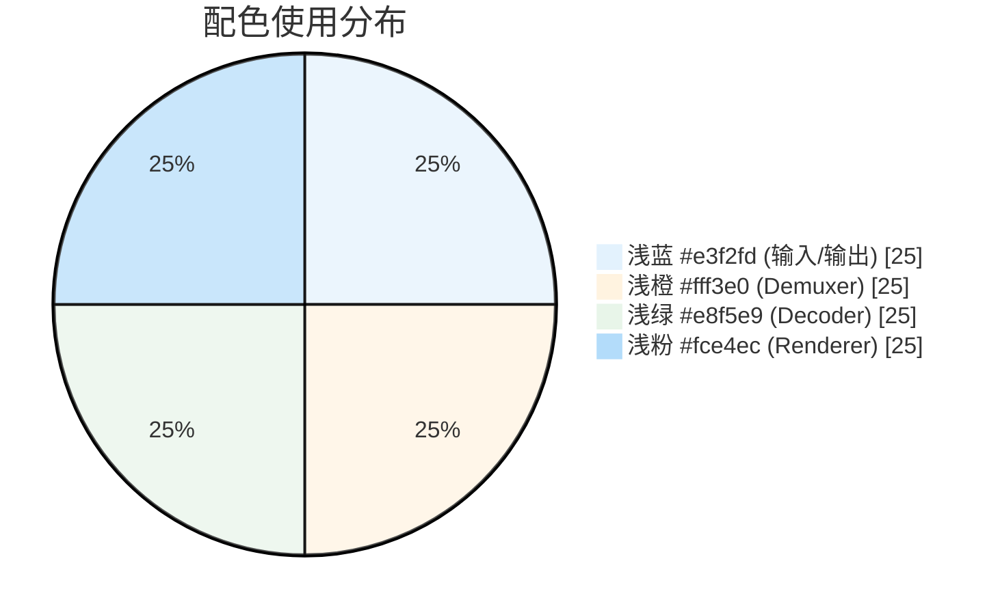
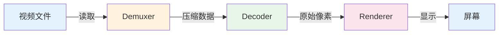
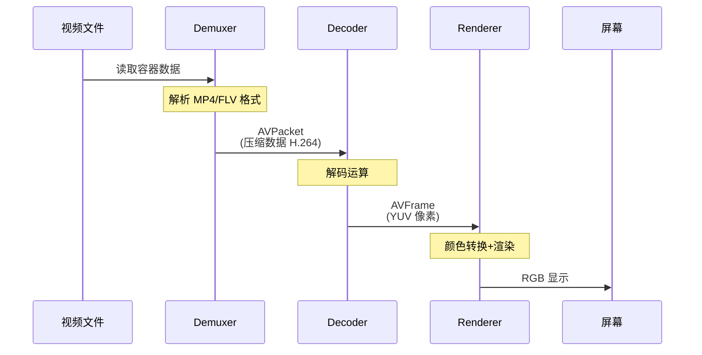
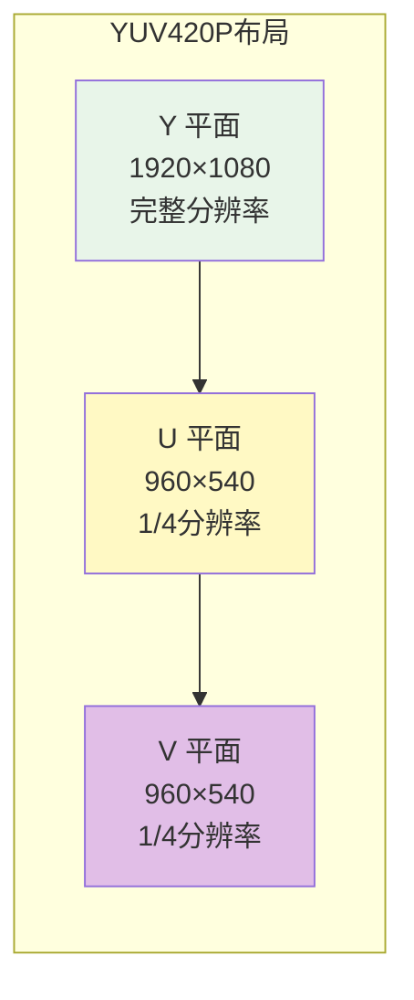

# 图表绘制指南

本书使用 **Mermaid** 绘制图表，GitHub 会自动渲染。

如需更精美的图表，可使用 **Draw.io**（免费）手动绘制。

---

## 推荐的图表工具

| 工具 | 适用场景 | 文件格式 |
|-----|---------|---------|
| **Mermaid** | 流程图、时序图、架构图 | Markdown 内嵌 |
| **Draw.io** | 精美架构图、自定义样式 | PNG/SVG + 源文件 |
| **Excalidraw** | 手绘风格、草图 | PNG/SVG |

---

## 配色方案

本书统一使用以下配色：



---

## 第1章关键图表

### 1. Pipeline 架构图



### 2. 数据流时序图



### 3. YUV 内存布局



---

## 绘制步骤

1. 打开 [Draw.io](https://draw.io)
2. 创建新图表
3. 使用上述配色方案
4. 导出为 PNG（分辨率 300dpi）
5. 保存源文件到 `docs/diagrams/*.drawio`
6. 导出图片到 `docs/images/*.png`

---

## 文件存放规范

```
docs/
├── images/          # 导出的 PNG/SVG 图片
│   ├── pipeline-arch.png
│   ├── data-flow.png
│   └── ...
└── diagrams/        # Draw.io 源文件（可编辑）
    ├── pipeline-arch.drawio
    ├── data-flow.drawio
    └── ...
```

---

## Markdown 引用方式

```markdown


<!-- 或者使用 Mermaid -->

```
