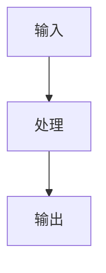

# 图表绘制规范

本书使用 **SVG + Mermaid** 方案，平衡美观度和可维护性。

---

## 图表存放

每章独立存放：

```
chapter-XX/
├── README.md
├── diagrams/          # SVG 图片 + Mermaid 定义
│   ├── arch.svg
│   ├── flow.svg
│   └── ...
└── src/
```

---

## 使用方式

### SVG 引用

```markdown

```

### Mermaid 图表

直接在 Markdown 中嵌入：

```markdown

```

---

## 配色规范

| 颜色 | 用途 | 十六进制 |
|:---|:---|:---|
| 浅蓝 | 输入/输出 | `#e3f2fd` |
| 浅橙 | Demuxer | `#fff3e0` |
| 浅绿 | Decoder | `#e8f5e9` |
| 浅粉 | Renderer | `#fce4ec` |

---

## 图表类型选择

| 场景 | 推荐格式 |
|:---|:---|
| 架构图 | Mermaid graph |
| 流程图 | Mermaid flowchart |
| 时序图 | Mermaid sequence |
| 复杂示意图 | SVG |
| 状态机 | Mermaid stateDiagram |

---

## 绘制工具

1. **Mermaid**: 直接在 Markdown 中编写
2. **Draw.io**: 复杂图形，导出 SVG
3. **保存位置**: `chapter-XX/diagrams/`
