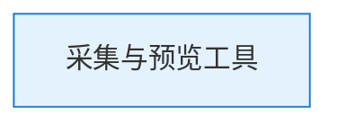
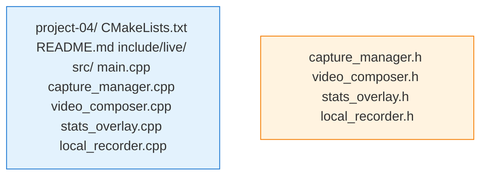

# 项目实战4：采集与预览工具

> **前置要求**：完成 Chapter 10-14
> **目标**：实现专业级音视频采集与预览工具

## 项目概述

本项目整合 Part 2 前半部分知识（Ch10-Ch14），实现一个功能完整的采集预览工具。这是主播端的基础工具，所有推流前的准备工作都在这里完成。

## 功能需求

### 视频采集
- [ ] 摄像头采集（多设备切换）
- [ ] 屏幕采集（全屏/窗口/区域）
- [ ] 画中画模式（屏幕+摄像头叠加）
- [ ] 分辨率/帧率可调

### 音频采集
- [ ] 麦克风采集（多设备选择）
- [ ] 系统音频采集（可选）
- [ ] 3A 处理（AEC/ANS/AGC）

### 实时预览
- [ ] 视频预览窗口
- [ ] 音量表显示
- [ ] 帧率/码率统计

### 录制功能
- [ ] 本地录制为 MP4
- [ ] 录制时显示时长

## 关键技术

### 架构设计



### 设备管理

```cpp
class CaptureManager {
public:
    struct VideoDevice {
        std::string id;
        std::string name;
        std::vector<Resolution> supported_resolutions;
    };
    
    struct AudioDevice {
        std::string id;
        std::string name;
        int channels;
        std::vector<int> sample_rates;
    };
    
    // 枚举设备
    std::vector<VideoDevice> ListVideoDevices();
    std::vector<AudioDevice> ListAudioDevices();
    
    // 选择设备
    bool SelectVideoDevice(const std::string& device_id);
    bool SelectAudioDevice(const std::string& device_id);
    
    // 设置参数
    bool SetVideoResolution(int width, int height);
    bool SetFrameRate(int fps);
    
    // 开始/停止采集
    bool StartCapture();
    void StopCapture();
    
private:
    std::unique_ptr<VideoCapture> video_capture_;
    std::unique_ptr<AudioCapture> audio_capture_;
    std::unique_ptr<ScreenCapture> screen_capture_;
    bool enable_pip_ = false;  // 画中画模式
};
```

### 画面合成（画中画）

```cpp
class VideoComposer {
public:
    void SetLayout(LayoutType layout) { layout_ = layout; }
    
    void Compose(uint8_t* output, int out_w, int out_h,
                 const uint8_t* main_frame, int main_w, int main_h,
                 const uint8_t* pip_frame, int pip_w, int pip_h) {
        switch (layout_) {
            case FULLSCREEN:
                // 全屏主画面
                ScaleToFit(output, out_w, out_h, main_frame, main_w, main_h);
                break;
            case PIP_BOTTOM_RIGHT:
                // 主画面全屏 + 右下角小窗口
                ScaleToFit(output, out_w, out_h, main_frame, main_w, main_h);
                OverlayPIP(output, out_w, out_h, pip_frame, pip_w, pip_h,
                           out_w - pip_w - 20, out_h - pip_h - 20);
                break;
            case PIP_TOP_RIGHT:
                // 主画面全屏 + 右上角小窗口
                ScaleToFit(output, out_w, out_h, main_frame, main_w, main_h);
                OverlayPIP(output, out_w, out_h, pip_frame, pip_w, pip_h,
                           out_w - pip_w - 20, 20);
                break;
        }
    }
    
private:
    LayoutType layout_ = FULLSCREEN;
};
```

### 统计信息显示

```cpp
class StatsOverlay {
public:
    void UpdateStats(const CaptureStats& stats) {
        stats_ = stats;
    }
    
    void Render(SDL_Renderer* renderer) {
        char buffer[256];
        
        // 视频统计
        snprintf(buffer, sizeof(buffer), 
                 "Video: %dx%d @ %.1ffps | Bitrate: %.1f kbps",
                 stats_.video_width, stats_.video_height,
                 stats_.video_fps, stats_.video_bitrate / 1000.0);
        RenderText(renderer, 10, 10, buffer);
        
        // 音频统计
        snprintf(buffer, sizeof(buffer),
                 "Audio: %dHz %dch | Level: %.1fdB",
                 stats_.audio_sample_rate, stats_.audio_channels,
                 stats_.audio_level_db);
        RenderText(renderer, 10, 35, buffer);
        
        // 渲染音量条
        RenderVolumeBar(renderer, 10, 60, 200, 10, stats_.audio_level_db);
    }
    
private:
    void RenderVolumeBar(SDL_Renderer* renderer, int x, int y, int w, int h, float db) {
        // 背景
        SDL_Rect bg = {x, y, w, h};
        SDL_SetRenderDrawColor(renderer, 64, 64, 64, 255);
        SDL_RenderFillRect(renderer, &bg);
        
        // 音量条 (db: -60 ~ 0)
        float level = (db + 60) / 60.0f;
        level = std::clamp(level, 0.0f, 1.0f);
        
        int bar_w = static_cast<int>(w * level);
        SDL_Rect bar = {x, y, bar_w, h};
        
        // 颜色：绿(安全) -> 黄(警告) -> 红(过载)
        if (level < 0.7f) {
            SDL_SetRenderDrawColor(renderer, 0, 255, 0, 255);
        } else if (level < 0.9f) {
            SDL_SetRenderDrawColor(renderer, 255, 255, 0, 255);
        } else {
            SDL_SetRenderDrawColor(renderer, 255, 0, 0, 255);
        }
        SDL_RenderFillRect(renderer, &bar);
    }
    
    CaptureStats stats_;
};
```

### 本地录制

```cpp
class LocalRecorder {
public:
    bool StartRecording(const char* filename);
    void StopRecording();
    
    void OnVideoFrame(const AVFrame* frame);
    void OnAudioFrame(const AVFrame* frame);
    
    int64_t GetRecordingDurationMs() const;
    int64_t GetRecordedBytes() const;
    
private:
    AVFormatContext* fmt_ctx_ = nullptr;
    AVCodecContext* video_ctx_ = nullptr;
    AVCodecContext* audio_ctx_ = nullptr;
    
    int video_stream_idx_ = -1;
    int audio_stream_idx_ = -1;
    
    std::chrono::steady_clock::time_point start_time_;
    int64_t total_bytes_ = 0;
    bool recording_ = false;
};
```

## 项目结构



## 使用示例

```bash
# 构建
cd project-04 && mkdir build && cd build
cmake .. && make -j4

# 运行（默认摄像头）
./capture_tool

# 指定摄像头
./capture_tool --camera "FaceTime HD Camera"

# 屏幕采集模式
./capture_tool --screen

# 画中画模式（屏幕+摄像头）
./capture_tool --pip --screen --camera "FaceTime HD Camera"

# 录制
./capture_tool --record output.mp4
```

## 验收标准

- [ ] 能枚举并选择摄像头/麦克风设备
- [ ] 能切换屏幕采集和摄像头采集
- [ ] 画中画模式正确叠加画面
- [ ] 实时显示帧率、码率、音量
- [ ] 能录制本地 MP4 文件
- [ ] 界面响应流畅，无卡顿

## 扩展挑战

1. **虚拟摄像头**：将合成后的画面输出为虚拟摄像头设备
2. **场景切换**：预设多个场景（全屏/画中画/多窗口），快捷键切换
3. **绿幕抠像**： chroma key 实现背景替换

---

**完成本项目后，你将掌握：**
- 多设备采集管理
- 画面合成与布局
- 实时统计信息显示
- 本地录制实现

**为第十五章（美颜滤镜）和第十六章（主播端架构）打下基础。**
