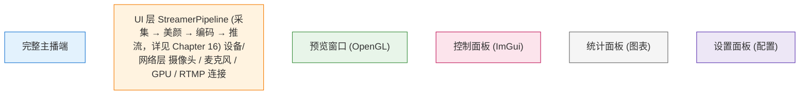
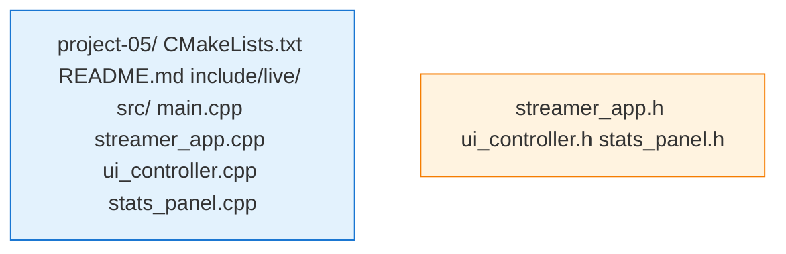

# 项目实战5：完整主播端

> **前置要求**：完成 Chapter 9-16
> **目标**：实现可开播的完整主播工具

## 项目概述

本项目整合 Part 2 全部内容（Ch9-Ch16），实现一个功能完整的主播端工具。你能够用它进行真正的直播推流。

## 功能需求

### 核心功能
- [ ] 摄像头/屏幕采集切换
- [ ] 实时美颜调节
- [ ] RTMP 推流
- [ ] 实时预览
- [ ] 推流统计（码率、帧率、延迟）

### 控制功能
- [ ] 开始/停止推流
- [ ] 暂停/恢复
- [ ] 切换摄像头
- [ ] 调节美颜参数（滑块）
- [ ] 调节码率

### 状态显示
- [ ] 连接状态
- [ ] 实时码率曲线
- [ ] 音量表
- [ ] 推流时长

## 架构设计



## 技术要点

### UI 框架选择

使用 **Dear ImGui** —— 轻量级即时模式 GUI：

```cpp
// ImGui 初始化
ImGui::CreateContext();
ImGui_ImplSDL2_InitForOpenGL(window, gl_context);
ImGui_ImplOpenGL3_Init("#version 330");

// 主循环
while (running) {
    // 开始帧
    ImGui_ImplOpenGL3_NewFrame();
    ImGui_ImplSDL2_NewFrame();
    ImGui::NewFrame();
    
    // 构建 UI
    RenderControlPanel();
    RenderStatsWindow();
    
    // 渲染
    ImGui::Render();
    glClear(GL_COLOR_BUFFER_BIT);
    ImGui_ImplOpenGL3_RenderDrawData(ImGui::GetDrawData());
    SDL_GL_SwapWindow(window);
}
```

### 控制面板

```cpp
void RenderControlPanel() {
    ImGui::Begin("控制面板");
    
    // 推流控制
    if (streamer_.GetState() == StreamerState::IDLE) {
        if (ImGui::Button("开始推流", ImVec2(120, 40))) {
            streamer_.Start();
        }
    } else if (streamer_.GetState() == StreamerState::STREAMING) {
        if (ImGui::Button("停止推流", ImVec2(120, 40))) {
            streamer_.Stop();
        }
    }
    
    ImGui::Separator();
    
    // 美颜参数
    auto params = streamer_.GetBeautyParams();
    if (ImGui::SliderFloat("磨皮", &params.smooth, 0.0f, 1.0f)) {
        streamer_.SetBeautyParams(params);
    }
    if (ImGui::SliderFloat("美白", &params.whitening, 0.0f, 1.0f)) {
        streamer_.SetBeautyParams(params);
    }
    
    ImGui::Separator();
    
    // 设备选择
    if (ImGui::BeginCombo("摄像头", current_camera_.c_str())) {
        for (const auto& cam : camera_list_) {
            if (ImGui::Selectable(cam.name.c_str())) {
                streamer_.SwitchCamera(cam.id);
                current_camera_ = cam.name;
            }
        }
        ImGui::EndCombo();
    }
    
    ImGui::End();
}
```

### 实时统计面板

```cpp
class StatsPanel {
public:
    void Update(const StreamStats& stats) {
        // 添加到历史
        video_bitrate_history_.push_back(stats.video_bitrate / 1000.0f);  // kbps
        if (video_bitrate_history_.size() > 100) {
            video_bitrate_history_.erase(video_bitrate_history_.begin());
        }
    }
    
    void Render() {
        ImGui::Begin("推流统计");
        
        // 码率曲线
        ImGui::PlotLines("视频码率 (kbps)",
                         video_bitrate_history_.data(),
                         video_bitrate_history_.size(),
                         0, nullptr, 0.0f, 5000.0f,
                         ImVec2(0, 100));
        
        // 数字显示
        ImGui::Text("视频: %.0f kbps @ %.1f fps",
                    current_stats_.video_bitrate / 1000.0f,
                    current_stats_.video_fps);
        ImGui::Text("音频: %.0f kbps",
                    current_stats_.audio_bitrate / 1000.0f);
        ImGui::Text("已推流: %02d:%02d:%02d",
                    hours_, minutes_, seconds_);
        
        // 连接状态
        const char* status_str[] = {"空闲", "连接中", "推流中", "错误"};
        ImVec4 status_color[] = {
            ImVec4(0.5f, 0.5f, 0.5f, 1.0f),  // 灰
            ImVec4(1.0f, 1.0f, 0.0f, 1.0f),  // 黄
            ImVec4(0.0f, 1.0f, 0.0f, 1.0f),  // 绿
            ImVec4(1.0f, 0.0f, 0.0f, 1.0f)   // 红
        };
        ImGui::TextColored(status_color[status_], "状态: %s", status_str[status_]);
        
        ImGui::End();
    }
    
private:
    std::vector<float> video_bitrate_history_;
    StreamStats current_stats_;
    int hours_ = 0, minutes_ = 0, seconds_ = 0;
    int status_ = 0;
};
```

### 音量表

```cpp
void RenderVolumeMeter(float db) {
    // 将 dB 映射到 0-1
    float level = (db + 60.0f) / 60.0f;  // -60dB ~ 0dB
    level = std::clamp(level, 0.0f, 1.0f);
    
    ImDrawList* draw_list = ImGui::GetWindowDrawList();
    ImVec2 pos = ImGui::GetCursorScreenPos();
    ImVec2 size(200, 20);
    
    // 背景
    draw_list->AddRectFilled(pos, ImVec2(pos.x + size.x, pos.y + size.y),
                              IM_COL32(64, 64, 64, 255));
    
    // 音量条
    ImU32 color;
    if (level < 0.7f) {
        color = IM_COL32(0, 255, 0, 255);    // 绿
    } else if (level < 0.9f) {
        color = IM_COL32(255, 255, 0, 255);  // 黄
    } else {
        color = IM_COL32(255, 0, 0, 255);    // 红
    }
    
    draw_list->AddRectFilled(pos,
                              ImVec2(pos.x + size.x * level, pos.y + size.y),
                              color);
    
    ImGui::Dummy(size);  // 占位
}
```

## 项目结构



## 使用示例

```bash
# 构建
cd project-05 && mkdir build && cd build
cmake .. && make -j4

# 运行（需要指定 RTMP 地址）
./streamer "rtmp://live.example.com/stream/key"

# 或使用配置文件
./streamer --config streamer.conf
```

**配置文件示例** (`streamer.conf`)：
```ini
[video]
width=1280
height=720
fps=30
bitrate=4000000
codec=h264

[audio]
sample_rate=48000
channels=2
bitrate=128000

[beauty]
smooth=0.3
whitening=0.2

[stream]
rtmp_url=rtmp://live.example.com/stream/key
reconnect_attempts=3
```

## 验收标准

- [ ] 能成功推流到 RTMP 服务器
- [ ] 美颜参数实时调节生效
- [ ] 切换摄像头不中断推流
- [ ] 统计显示准确（码率、帧率）
- [ ] 断网后能自动重连
- [ ] CPU 占用 < 50% (1080p@30fps)

## 测试方案

```bash
# 1. 本地测试（使用 nginx-rtmp）
docker run -p 1935:1935 -p 8080:8080 alfg/nginx-rtmp

# 推流
./streamer "rtmp://localhost/live/test"

# 播放（使用 ffplay 或 VLC）
ffplay "rtmp://localhost/live/test"

# 2. 公网测试（Bilibili/抖音等平台）
# 从平台获取推流地址和流密钥
./streamer "rtmp://live-push.bilibili.com/live-bvc/?streamname=..."
```

## 扩展挑战

1. **多平台推流**：同时推流到多个平台（B站、抖音、YouTube）
2. **弹幕显示**：从平台获取弹幕，叠加到画面上
3. **场景切换**：预设多个场景，快捷键切换
4. **云导播**：支持远程控制（WebSocket 协议）

---

**完成本项目后，你将具备：**
- 完整主播端开发能力
- 实际开播经验
- 实时系统调试技能

**Part 2 完成！接下来进入 Part 3：实时连麦（WebRTC）。**
