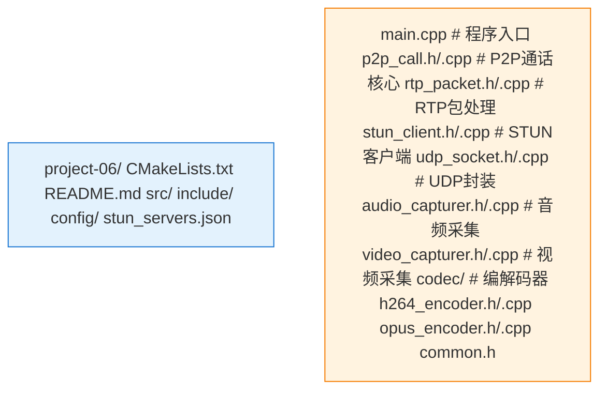

# Project 06: P2P通话工具

基于UDP/RTP/NAT穿透的双人音视频通话实现。

## 项目概述

本项目实现了一个简单的P2P音视频通话工具，包含以下核心功能：
- UDP套接字通信
- RTP包封装与解析
- STUN/TURN NAT穿透
- 双人音视频传输

## 架构图


## 项目结构



## 构建说明

### 依赖

- CMake 3.10+
- C++14 编译器
- OpenSSL (用于D TLS)
- FFmpeg (用于编解码)
- PortAudio (用于音频采集)

### 编译

```bash
mkdir build && cd build
cmake ..
make -j$(nproc)
```

## 运行说明

### 1. 启动STUN服务器（可选，可使用公共STUN）

```bash
# 使用公共STUN服务器
coturn -c turnserver.conf
```

### 2. 启动通话程序

```bash
# 用户A（作为发起方）
./p2p_call --role caller --remote-ip <bob_ip> --remote-port 8000 --local-port 8000

# 用户B（作为接收方）
./p2p_call --role callee --remote-ip <alice_ip> --remote-port 8000 --local-port 8000
```

### 命令行参数

| 参数 | 说明 | 默认值 |
|:---|:---|:---|
| `--role` | 角色 (caller/callee) | caller |
| `--local-port` | 本地监听端口 | 8000 |
| `--remote-ip` | 对端IP地址 | - |
| `--remote-port` | 对端端口 | 8000 |
| `--stun-server` | STUN服务器地址 | stun.l.google.com:19302 |
| `--video-device` | 视频设备索引 | 0 |
| `--audio-device` | 音频设备索引 | 0 |

## 配置示例

`config/stun_servers.json`:
```json
{
  "stun_servers": [
    "stun.l.google.com:19302",
    "stun1.l.google.com:19302",
    "stun2.l.google.com:19302"
  ],
  "turn_servers": [
    {
      "url": "turn:turn.example.com:3478",
      "username": "user",
      "credential": "pass"
    }
  ]
}
```

## 实现要点

### 1. NAT穿透流程

```cpp
// ICE候选收集
void P2PCall::GatherCandidates() {
    // 1. 获取本地候选
    auto local_ip = GetLocalIPAddress();
    local_candidates_.push_back({local_ip, local_port_});
    
    // 2. STUN服务器获取反射候选
    StunClient stun(stun_server_);
    auto mapped = stun.GetMappedAddress();
    reflexive_candidates_.push_back(mapped);
    
    // 3. TURN服务器获取中继候选（如需要）
    if (NeedRelay()) {
        TurnClient turn(turn_server_);
        auto relay = turn.Allocate();
        relay_candidates_.push_back(relay);
    }
}

// 连接性检查
void P2PCall::CheckConnectivity() {
    for (const auto& local : all_candidates_) {
        for (const auto& remote : remote_candidates_) {
            SendBindingRequest(local, remote);
            if (ReceiveBindingResponse()) {
                selected_pair_ = {local, remote};
                return;
            }
        }
    }
}
```

### 2. RTP传输

```cpp
void P2PCall::SendVideoFrame(const uint8_t* data, size_t len) {
    // 分片为RTP包
    size_t offset = 0;
    bool first = true;
    
    while (offset < len) {
        RtpPacket packet;
        packet.header.sequence_number = video_seq_++;
        packet.header.timestamp = GetTimestamp();
        packet.header.ssrc = video_ssrc_;
        packet.header.payload_type = 96;  // H264
        
        size_t fragment_size = std::min(len - offset, MAX_RTP_PAYLOAD);
        bool last = (offset + fragment_size >= len);
        
        // FU-A分片
        packet.payload = CreateFuAFragment(data + offset, fragment_size, first, last);
        
        // 发送
        udp_socket_.SendTo(packet.Serialize(), selected_pair_.remote);
        
        offset += fragment_size;
        first = false;
    }
}
```

## 注意事项

1. **防火墙配置**：确保本地端口开放
2. **NAT类型**：对称NAT需要TURN中继
3. **带宽估计**：建议实现简单的带宽自适应
4. **抖动缓冲**：接收端需要JitterBuffer

## 参考资料

- [RFC 5245] Interactive Connectivity Establishment (ICE)
- [RFC 5389] Session Traversal Utilities for NAT (STUN)
- [RFC 5766] Traversal Using Relays around NAT (TURN)
- [RFC 3550] RTP: A Transport Protocol for Real-Time Applications
