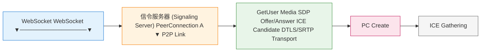
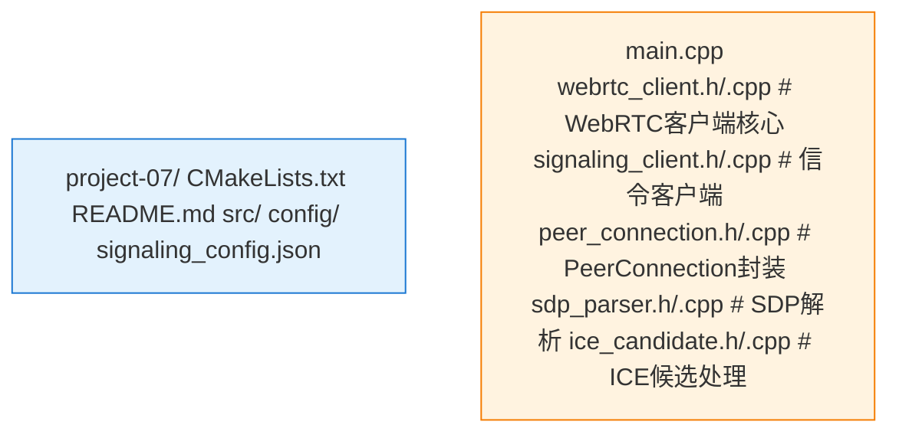

# Project 07: WebRTC连麦客户端

基于WebRTC的1v1实时音视频连麦客户端实现。

## 项目概述

本项目实现了一个完整的WebRTC连麦客户端，包含：
- WebRTC信令交互
- 音视频采集与编码
- ICE连接建立
- 1v1音视频通话

## 架构图



## 项目结构



## 信令协议

```json
// Offer
{
  "type": "offer",
  "sdp": "v=0\r\no=- 123...",
  "from": "user_a",
  "to": "user_b"
}

// Answer
{
  "type": "answer",
  "sdp": "v=0\r\no=- 456...",
  "from": "user_b",
  "to": "user_a"
}

// ICE Candidate
{
  "type": "ice_candidate",
  "candidate": "candidate:842163049 1 udp 168...",
  "sdp_mid": "0",
  "sdp_mline_index": 0
}
```

## 构建运行

```bash
mkdir build && cd build
cmake ..
make
./webrtc_client --server ws://localhost:8080 --room test-room
```

## 关键代码

### 创建PeerConnection

```cpp
void WebRTCClient::CreatePeerConnection() {
    webrtc::PeerConnectionInterface::RTCConfiguration config;
    config.servers.push_back(
        {.uri = "stun:stun.l.google.com:19302"}
    );
    
    pc_ = pc_factory_->CreatePeerConnection(
        config, nullptr, nullptr, this);
    
    // 添加音视频轨
    auto video_track = CreateVideoTrack("video_label");
    pc_->AddTrack(video_track, {"stream_id"});
}
```

### 处理信令

```cpp
void WebRTCClient::OnSignalingMessage(const json& msg) {
    std::string type = msg["type"];
    
    if (type == "offer") {
        HandleOffer(msg["sdp"]);
    } else if (type == "answer") {
        HandleAnswer(msg["sdp"]);
    } else if (type == "ice_candidate") {
        AddIceCandidate(msg);
    }
}
```
