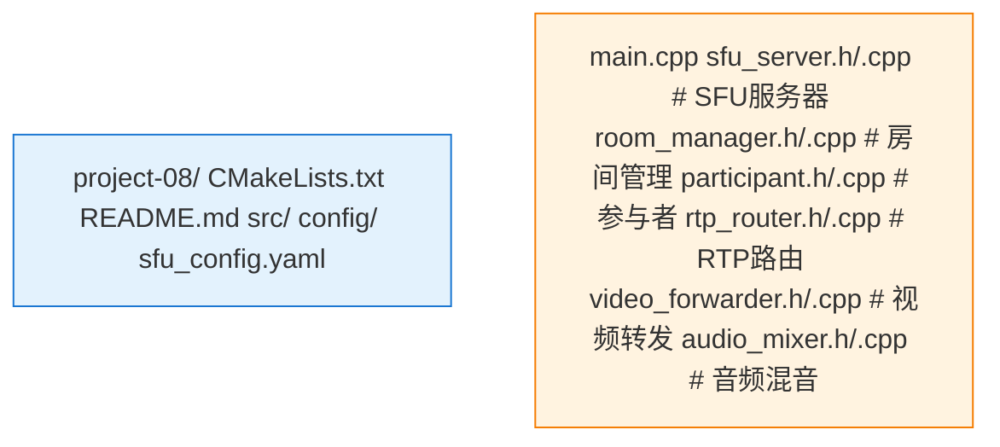

# Project 08: 多人会议系统

基于SFU架构的多人视频会议系统，支持10人在线。

## 项目概述

本项目实现了一个完整的多人视频会议系统：
- SFU（Selective Forwarding Unit）转发
- 多人房间管理
- 多路视频渲染
- 音频混音

## 架构图


## 项目结构



## 核心功能

### 房间管理

```cpp
class Room {
public:
    void AddParticipant(std::shared_ptr<Participant> participant);
    void RemoveParticipant(const std::string& id);
    void Broadcast(const RtpPacket& packet, const std::string& exclude_id);
    
private:
    std::map<std::string, std::shared_ptr<Participant>> participants_;
    static constexpr size_t MAX_PARTICIPANTS = 10;
};
```

### RTP路由

```cpp
class RtpRouter {
public:
    void OnPacketReceived(const RtpPacket& packet, 
                          const std::string& publisher_id);
    void RouteToSubscriber(const RtpPacket& packet,
                           std::shared_ptr<Participant> subscriber);
    
    // 选择性转发
    void SetTargetLayer(const std::string& sub_id, 
                        int spatial_layer, 
                        int temporal_layer);
};
```

### 视频渲染优化

```cpp
class MultiVideoRenderer {
public:
    void AddStream(const std::string& id, VideoTrack* track);
    void RemoveStream(const std::string& id);
    void RenderLayout();  // 网格/演讲者布局
    
private:
    // 最多渲染N路（节省CPU）
    void SelectTopNStreams(size_t n);
    std::vector<std::string> active_speakers_;
};
```

## 配置示例

```yaml
sfu:
  bind_address: 0.0.0.0
  rtp_port_range: [10000, 20000]
  
room:
  max_participants: 10
  max_publishers: 10
  
routing:
  audio_mixer_enabled: true
  simulcast_enabled: true
  svc_enabled: false
```

## 运行

```bash
./sfu_server -c config/sfu_config.yaml
```
