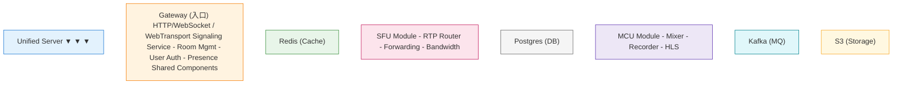
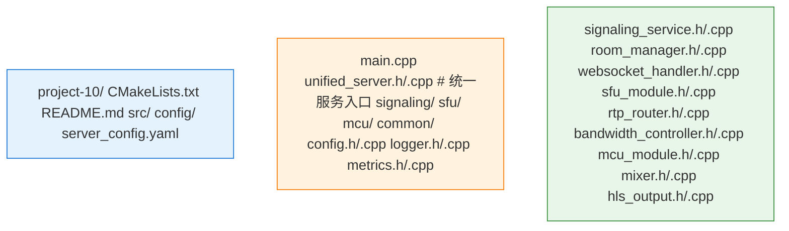

# Project 10: 完整服务端

集成SFU/MCU/信令的统一服务端。

## 项目概述

本项目实现了一个完整的实时音视频服务端，包含：
- SFU转发模块
- MCU录制模块
- 信令服务
- 统一API管理

## 架构图



## 项目结构



## API接口

### REST API

```http
# 创建房间
POST /api/v1/rooms
{
  "name": "会议名称",
  "max_participants": 10
}

# 加入房间
POST /api/v1/rooms/{room_id}/join
{
  "user_id": "user123",
  "role": "publisher"
}

# 获取ICE配置
GET /api/v1/ice-config

# 开始录制
POST /api/v1/rooms/{room_id}/record
{
  "format": "hls",
  "mode": "mcu"
}
```

### WebSocket信令

```json
// 加入房间
{
  "type": "join",
  "room_id": "room123",
  "user_id": "user456"
}

// 发布流
{
  "type": "publish",
  "stream_type": "video_audio",
  "sdp": "v=0..."
}

// 订阅流
{
  "type": "subscribe",
  "publisher_id": "user123"
}
```

## 配置示例

```yaml
server:
  bind_address: 0.0.0.0
  http_port: 8080
  websocket_port: 8081
  
modules:
  signaling:
    enabled: true
    
  sfu:
    enabled: true
    rtp_port_range: [10000, 20000]
    
  mcu:
    enabled: true
    output_dir: /recordings

storage:
  redis:
    host: localhost
    port: 6379
  postgres:
    host: localhost
    port: 5432
    database: live
```

## 运行

```bash
# 构建
mkdir build && cd build
cmake ..
make -j$(nproc)

# 运行
./unified_server -c config/server_config.yaml
```
